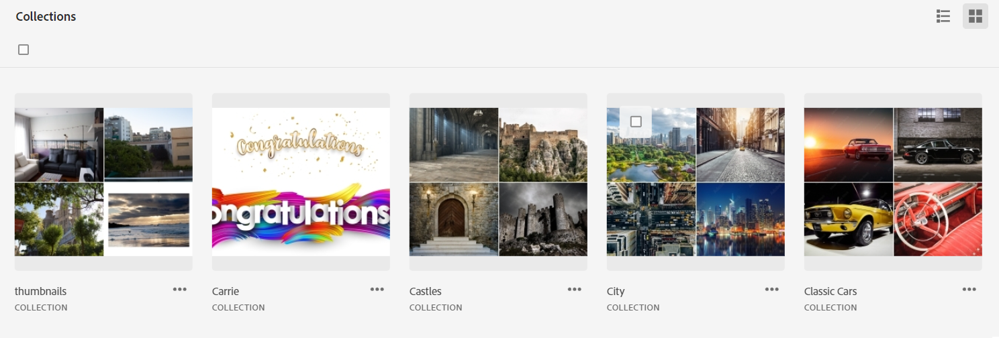
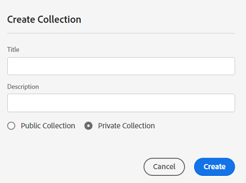
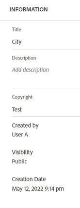
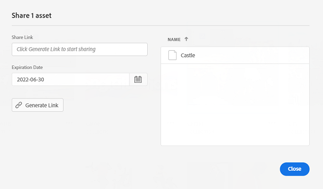

# Manage collections {#manage-collections}

<table>
    <tr>
        <td>
            <i>New</i> <a href="/help/assets/dynamic-media/dm-prime-ultimate.md"><b>Dynamic Media Prime and Ultimate</b></a>
        </td>
        <td>
            <i>New</i> <a href="/help/assets/assets-ultimate-overview.md"><b>AEM Assets Ultimate</b></a>
        </td>
        <td>
            <i>New</i> <a href="/help/assets/integrate-aem-assets-edge-delivery-services.md"><b>AEM Assets integration with Edge Delivery Services</b></a>
        </td>
        <td>
            <i>New</i> <a href="/help/assets/aem-assets-view-ui-extensibility.md"><b>UI Extensibility</b></a>
        </td>
          <td>
            <i>New</i> <a href="/help/assets/dynamic-media/enable-dynamic-media-prime-and-ultimate.md"><b>Enable Dynamic Media Prime and Ultimate</b></a>
        </td>
    </tr>
    <tr>
        <td>
            <a href="/help/assets/search-best-practices.md"><b>Search Best Practices</b></a>
        </td>
        <td>
            <a href="/help/assets/metadata-best-practices.md"><b>Metadata Best Practices</b></a>
        </td>
        <td>
            <a href="/help/assets/product-overview.md"><b>Content Hub</b></a>
        </td>
        <td>
            <a href="/help/assets/dynamic-media-open-apis-overview.md"><b>Dynamic Media with OpenAPI capabilities</b></a>
        </td>
        <td>
            <a href="https://developer.adobe.com/experience-cloud/experience-manager-apis/"><b>AEM Assets developer documentation</b></a>
        </td>
    </tr>
</table>

>[!CONTEXTUALHELP]
>id="assets_collections"
>title="Manage Collections"
>abstract="A collection is a set of assets, folders, or other collections within Assets view. Use collections to share assets between users. Unlike folders, a collection can include assets from different locations. You can share multiple collections with a user. Each collection contains references to assets. The referential integrity of assets is maintained across collections."

A collection is a set of assets, folders, or other collections within Adobe Experience Manager Assets view. Use collections to share assets between users.

Unlike folders, a collection can include assets from different locations. 

<!--
You can share collections with various users that are assigned different levels of privileges, including viewing, editing, and so on.
-->

You can share multiple collections with a user. Each collection contains references to assets. The referential integrity of assets is maintained across collections.

You can perform the following tasks to manage and use collections:

* [Create a collection](#create-collection)

* [Add assets to a collection](#add-assets-to-collection)

* [Remove assets from a collection](#remove-assets-from-collection)

* [Create a Smart Collection](#create-smart-collection)

* [Edit a Smart Collection](#edit-smart-collection)

* [View and edit collection metadata](#view-edit-collection-metadata)

* [Share links for collections](#share-collection-links)

* [Download a collection](#download-collection)

* [Delete a collection](#delete-collection)

* [Manage permissions to a private collection](#manage-permissions-to-a-private-collection)

## Create a collection {#create-collection}

To create a collection:

1. Click **[!UICONTROL Collections]** in the left rail and then click **[!UICONTROL Create Collection]**.

1. Specify a title and an optional description for the collection.

1. Select if you need to a create a Private collection or a Public collection. A Public collection is available for viewing and editing to all users. However, a Private collection is available to the creator and users with administrator privileges.
   
1. Click **[!UICONTROL Create]** to create the collection.

 <!--
   
   for viewing and editing only to users with the appropriate [permissions](#manage-collection-access).

-->
   
## Add assets to a collection {#add-assets-to-collection}

To add assets to a collection:

1. Click **[!UICONTROL Assets]** in the left rail and select the assets that you need to add to a collection.

1. Click **[!UICONTROL Add to Collection]**.

1. On the [!UICONTROL Collections] dialog box, select the collections to add the selected assets.

1. Click **[!UICONTROL Add]** to add the asset to the selected collections.

## Remove assets from a collection {#remove-assets-from-collection}

To remove assets from a collection:

1. Click **[!UICONTROL Collections]** in the left rail to view the list of collections.

1. Click the collection and select items that you need to remove from the collection.

1. Click **[!UICONTROL Remove]**.

## Manage a Smart Collection {#manage-smart-collection}

Save your search results as a Smart Collection to dynamically update the collection contents. If there are assets added to the Assets view repository that fit the search criteria defined while creating the Smart Collection, the contents of the Smart Collection get updated automatically when you open a Smart Collection.

### Create a Smart Collection {#create-smart-collection}

To create a Smart Collection:

1. Click **[!UICONTROL Filter]** and [define the search criteria](search-assets-view.md#refine-search-results).

1. Click **[!UICONTROL Save as]** and then select **[!UICONTROL Smart Collection]**.

   

1. On the [!UICONTROL Create Smart Collection] dialog box, specify a title and a description for the Smart Collection.

1. Select **[!UICONTROL Public Collection]** if you need all users to access the collection. Select **[!UICONTROL Private Collection]** if you need a limited group of users to access the collection.

1. Click **[!UICONTROL Create]** to create the Smart Collection.

### Edit a Smart Collection {#edit-smart-collection}

To edit a Smart Collection:

1. Click **[!UICONTROL Collections]** in the left rail and then double-click the name of the collection that you need to edit.

1. Click **[!UICONTROL Edit Smart Collection]**.

1. On the [!UICONTROL Edit Smart Collection Filters] dialog box, [update the search criteria](search-assets-view.md#refine-search-results) for the Smart Collection.

1. Click **[!UICONTROL Save]**.

<!--

## Manage access to a Private collection {#manage-collection-access}

The permission management for collections function in the same manner as folders in [!DNL Assets view]. Administrators can manage the access levels for collections available in the repository. As an administrator, you can create user groups and assign permissions to those groups to manage access levels. You can also delegate the permission management privileges to user groups at the collection-level.

For more information, see [Manage permissions for folders and collections](manage-permissions.md).

-->

<!--

## Search a collection {#search-collections}

Click **[!UICONTROL Collections]** in the left rail and use the Search box to specify a text as the criteria to search for a collection. [!DNL Assets view] uses the specified text to search collection names, metadata including tags defined for a collection and returns appropriate results.

>[!NOTE]
>
>Assets view performs search in collections available at the root level. It does not perform search in assets and folders available in collections.

-->

## View and edit collection metadata {#view-edit-collection-metadata}

Collection metadata comprises data about the collection, such as title and description.

To view and edit collection metadata:

1. Click **[!UICONTROL Collections]** in the left rail, select a collection, and click **[!UICONTROL Details]**.
1. View the collection metadata using the **[!UICONTROL Basic]** tab.
1. Modify the metadata fields, as necessary. You can modify the [!UICONTROL Title] and [!UICONTROL Description] fields.

## Share links for collections {#share-collection-links}

[!DNL Assets view] enables you to generate a link and share collections and assets within collections with external stakeholders, who do not have access to the [!DNL Assets view] application. You can define an expiration date for the link and then share it with others using your preferred communication method like email or messaging services. Recipients of the link can preview assets and download them.

For more information on how to share collection links with external stakeholders, see [share links for assets](/help/assets/share-links-for-assets-view.md).

## Download a collection {#download-collection}

To download a collection:

1. Click **[!UICONTROL Collections]** in the left rail.

1. Select the collection that you need to download and click **[!UICONTROL Download]**.

1. On the [!UICONTROL Downloading Asset] dialog box, click **[!UICONTROL OK]**.

The collection downloads as a .ZIP file on your local machine.

## Delete a collection {#delete-collection}

To delete a collection:

1. Click **[!UICONTROL Collections]** in the left rail.

1. Select the collection that you need to delete.

1. Click **[!UICONTROL Delete]**.

## Manage permissions for a private collection{#manage-permissions-private-collection}

You can allow administrators to manage [access levels](https://experienceleague.adobe.com/en/docs/experience-manager-assets-essentials/help/get-started-admins/folder-access/manage-permissions) for private collections available in the repository. You can assign permissions such as `Can View` and `Can Edit` to the user groups or users. You can also delegate permission management privileges to user groups. The users who create private collections are the owners of those collections. They can use the [!UICONTROL Manage Permissions] action to grant access to the other users. Moreover, Administrators can view and manage permissions of the private collections in the [!DNL Experience Manager] repository.
<!--
>[!NOTE]
>
>Adobe does not recommend to assign permissions to users.
-->
For information on how to assign the available permissions to user groups, see [Add permissions to user groups](https://experienceleague.adobe.com/en/docs/experience-manager-assets-essentials/help/get-started-admins/folder-access/manage-permissions).

For more information on the end-to-end workflow, see [manage permissions](https://experienceleague.adobe.com/en/docs/experience-manager-assets-essentials/help/get-started-admins/folder-access/manage-permissions).

## Next Steps {#next-steps}

* Provide product feedback using the [!UICONTROL Feedback] option available on the Assets view user interface

* Provide documentation feedback using [!UICONTROL Edit this page]  or [!UICONTROL Log an issue]  available on the right sidebar

* Contact [Customer Care](https://experienceleague.adobe.com/?support-solution=General#support)
