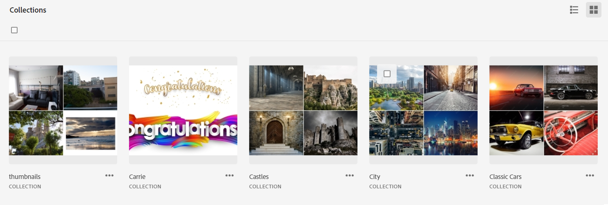
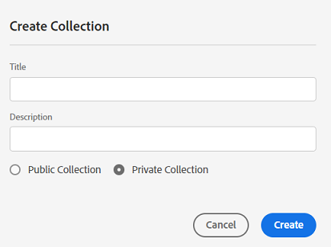
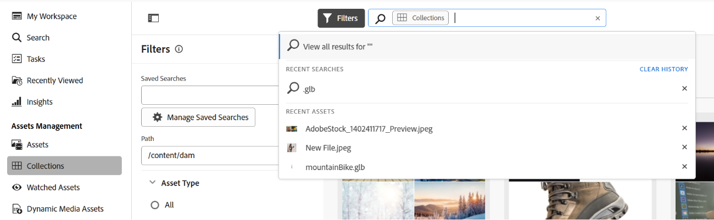
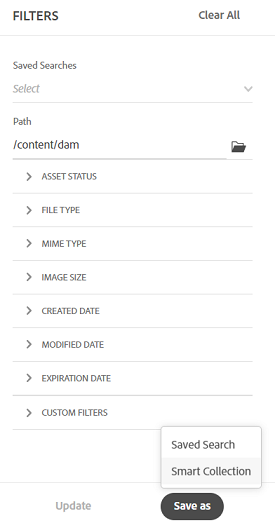
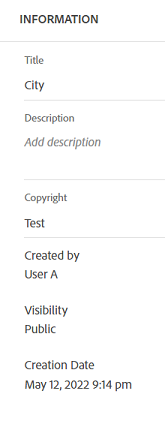
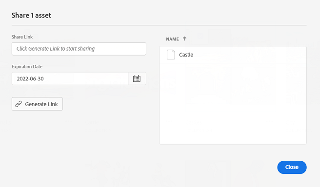

# Manage collections {#manage-collections}

<!--
You can share collections with various users that are assigned different levels of privileges, including viewing, editing, and so on.
-->

>[!CONTEXTUALHELP]
>id="assets_collections"
>title="Manage [!DNL Collections]"
>abstract="A collection is a set of assets, folders, or other collections within [!DNL Assets view]. Use collections to share assets between users. Unlike folders, a collection can include assets from different locations. You can share multiple collections with a user. Each collection contains references to assets. The referential integrity of assets is maintained across collections."

A **collection** is a set of assets, **folders**, or other collections within Adobe [!DNL Experience Manager] [!DNL Assets view]. [!DNL Collections] enable users to share assets efficiently with one another, making them a core mechanism for collaboration across teams working with the same digital asset library.

Unlike **folders**, which organize assets by their storage location, a **collection can include assets from different locations**. This flexibility allows a collection to group related content that lives in separate parts of the asset repository, so users can assemble the exact set of assets they need without moving or duplicating files.

A single user can be granted access to **multiple collections**. Each collection contains **references to assets** rather than copies of the assets themselves. The **referential integrity of assets is maintained across collections**, meaning that each reference reliably points to its source asset, so the same underlying asset can appear in multiple collections while remaining consistent and up to date. This reference-based structure prevents duplication and ensures that changes to a source asset are reflected wherever it is referenced.

## [!DNL Collection] management tasks {#collection-management-tasks}

The following tasks manage and use collections:

* [Create a collection](#create-collection)

* [Add assets to a collection](#add-assets-to-collection)

* [Remove assets from a collection](#remove-assets-from-collection)

* [Search within collections](#search-collection)

* [Create a [!DNL Smart Collection]](#create-smart-collection)

* [Edit a [!DNL Smart Collection]](#edit-smart-collection)

* [View and edit collection metadata](#view-edit-collection-metadata)

* [Share links for collections](#share-collection-links)

* [Download a collection](#download-collection)

* [Delete a collection](#delete-collection)

* [Manage permissions to a private collection](#manage-permissions-to-a-private-collection)

## Create a collection {#create-collection}

A collection groups related assets together for organized access. To create a collection, follow these steps:

1. Click **[!UICONTROL Collections]** in the left rail and then click **[!UICONTROL Create Collection]**.

2. Specify a **title** and an optional **description** for the collection. A clear title makes the collection easier to locate later.

3. Select whether to create a **Private collection** or a **Public collection**, based on how widely the contents should be shared. This choice determines who can view and edit the collection. [!DNL Collection] types:

   - **Public collection:** Available for **viewing and editing to all users**. Choose this option when the collection is meant to be shared and collaboratively maintained across the team.
   - **Private collection:** Available **only to the creator and users with administrator privileges**. Choose this option when access should remain restricted, because it limits both viewing and editing to a controlled group.

   

<!--
   
   for viewing and editing only to users with the appropriate [permissions](#manage-collection-access).

-->

4. Click **[!UICONTROL Create]** to create the collection. The new collection then appears in the [!DNL Collections] list, ready for you to add assets.

## Add assets to a collection {#add-assets-to-collection}

[!DNL Collections] group related assets together so you can organize, locate, and share them as a single set. Adding assets to a collection streamlines asset management, making it easier to reuse content and provide teams with shared access to the same grouped resources.

Follow these steps to add assets to a collection:

1. Click **[!UICONTROL Assets]** in the left rail and select the assets you want to add to a collection.

1. Click **[!UICONTROL Add to Collection]**. This opens the [!UICONTROL Collections] dialog box, where you assign the selected assets to one or more collections.

1. On the [!UICONTROL Collections] dialog box, select the collections to which you want to add the selected assets. You can add the same assets to multiple collections at once.

1. Click **[!UICONTROL Add]** to add the assets to the selected collections. The selected assets are now grouped within each chosen collection and are accessible from those collections for organization, reuse, and sharing.

## Remove assets from a collection {#remove-assets-from-collection}

Removing assets from a collection lets you keep the collection focused and organized by taking out items that are no longer relevant. Removing an asset from a collection does not delete the asset itself from the repository—it only removes the association between that asset and the collection, so the asset remains available elsewhere.

To remove assets from a collection, follow these steps:

1. Click **[!UICONTROL Collections]** in the left rail to view the list of collections.

1. Click the collection and select the specific assets you need to remove from the collection.

1. Click **[!UICONTROL Remove]**.

Completing these steps removes the selected assets from the collection immediately, helping you maintain a clean, well-organized set of collections.

## Search within collections {#search-collection}

Search within a collection to quickly locate relevant assets. Follow these steps:

1. Navigate to **[!DNL Collections]**. In the search bar, enter a keyword to locate the desired collection. The search bar displays the location of the selected collection.

2. To refine the results, open **[!DNL Filters]** and confirm that **[!DNL Collections]** is selected under **[!DNL Asset Type]** so that only collections appear in your results.

3. In the **[!DNL Collection Visibility]** dropdown, choose one of the following options:

   * **[!DNL All]:** Displays all collections, regardless of visibility.
   * **[!DNL Public Collection]:** Shows only collections that are visible to all users, useful when locating shared or organization-wide assets.
   * **[!DNL Private Collection]:** Shows only collections that are restricted or visible to specific users or groups, useful when working with confidential or team-limited content.

4. In the **[!DNL Collection Type]** dropdown, choose one of the following options:

   * **[!DNL All]:** Displays both regular and smart collections.
   * **[!DNL Collection]:** Shows manually created collections where assets are added individually.
   * **[!DNL Smart Collection]:** Shows collections that automatically include assets that are saved under [Smart [!DNL Collections]](#manage-smart-collection).

   

5. The **[!DNL Created Date]** dropdown filters collections based on when they were created. Specify a date range to surface recently created or older collections, which helps narrow large result sets to a relevant time period.

For more information, see [search assets](search-assets-view.md), [filter search results](search-assets-view.md#refine-search-results), or [manage saved searches](search-assets-view.md##saved-search).

## Manage a [!DNL Smart Collection] {#manage-smart-collection}

A **[!DNL Smart Collection]** is a saved search that behaves as a dynamic, self-updating collection. Instead of manually adding assets one by one, you save your search results as a **[!DNL Smart Collection]**, and the collection continuously reflects any asset that matches its defined **search criteria**.

### How a [!DNL Smart Collection] Works

You define the **search criteria** when creating the [!DNL Smart Collection]. From that point forward, the [!DNL Smart Collection] **automatically** keeps its contents in sync with those criteria:

- When new assets are added to the [!DNL Assets view] repository, the system evaluates them against the saved criteria.
- If a newly added asset fits the defined search criteria, it becomes part of the [!DNL Smart Collection].
- The [!DNL Smart Collection] automatically updates its contents when you open it, so you always see the current, matching set of assets.

Because membership is driven by criteria rather than by manual selection, the collection stays current on its own. As a result, you do not need to revisit and edit the collection each time relevant assets arrive—the qualifying assets appear the next time you open the [!DNL Smart Collection]. This ensures the collection remains an accurate, live representation of your search rather than a static, one-time snapshot.

### Key Benefits

- **Dynamic updating:** New matching assets are captured automatically, without manual maintenance.
- **Consistency:** The collection always reflects the exact **search criteria** you defined.
- **Efficiency:** Saved searches can be reused, saving the effort of re-running the same query.
- **Scalability:** As the [!DNL Assets view] repository grows, relevant assets are surfaced automatically as they meet the criteria.

Smart [!DNL Collections] are especially useful when you regularly work with assets that share common attributes—such as a specific file type, tag, project, or metadata value—where the underlying set of matching assets changes over time.

### Create a [!DNL Smart Collection] {#create-smart-collection}

A **[!DNL Smart Collection]** is a dynamic, filter-based collection that automatically updates its contents based on the saved search criteria you define, so newly added assets that match the criteria appear in the collection without manual updates. Unlike a static collection, a [!DNL Smart Collection] continuously reflects the results of its underlying search.

To create a [!DNL Smart Collection], complete the following steps:

1. Click **[!UICONTROL Filter]** and [define the search criteria](search-assets-view.md#refine-search-results). These criteria determine which assets the [!DNL Smart Collection] dynamically includes.

   

1. Click **[!UICONTROL Save as]** and then select **[!UICONTROL Smart Collection]**.

1. On the [!UICONTROL Create Smart Collection] dialog box, specify a **title** and a **description** for the [!DNL Smart Collection]. A clear title and description make the collection easier to identify and reuse later.

1. Set the access level for the [!DNL Smart Collection]:
   - Select **[!UICONTROL Public Collection]** to allow all users to access the collection. This grants organization-wide visibility.
   - Select **[!UICONTROL Private Collection]** to restrict access to a limited group of users. This limits visibility because only the intended users can view the collection.

1. Click **[!UICONTROL Create]** to create the [!DNL Smart Collection]. The [!DNL Smart Collection] is then saved and begins populating with all assets that match the defined search criteria.

### Edit a [!DNL Smart Collection] {#edit-smart-collection}

A **[!DNL Smart Collection]** is a dynamic, criteria-based collection whose contents are populated automatically by a saved set of search filters rather than by manually added assets. Editing a [!DNL Smart Collection] means changing those underlying search criteria, which in turn redefines which assets belong to the collection.

To edit a [!DNL Smart Collection]:

1. Click **[!UICONTROL Collections]** in the left rail, then locate and double-click the name of the [!DNL Smart Collection] that you need to edit. This opens the selected collection so you can access its settings.

1. Click **[!UICONTROL Edit Smart Collection]** to open the collection's filter settings for modification.

1. On the [!UICONTROL Edit Smart Collection Filters] dialog box, [update the search criteria](search-assets-view.md#refine-search-results) for the [!DNL Smart Collection]. This redefines which assets automatically populate the [!DNL Smart Collection], because [!DNL Smart Collection] membership is driven by these filters rather than by manual selection.

1. Click **[!UICONTROL Save]**. Saving applies the updated criteria and refreshes the collection so that it reflects every asset matching the revised filters.

<!--

## Manage access to a Private collection {#manage-collection-access}

The permission management for collections function in the same manner as folders in [!DNL Assets view]. Administrators can manage the access levels for collections available in the repository. As an administrator, you can create user groups and assign permissions to those groups to manage access levels. You can also delegate the permission management privileges to user groups at the collection-level.

For more information, see [Manage permissions for folders and collections](manage-permissions.md).

-->

<!--

## Search a collection {#search-collections}

Click **[!UICONTROL Collections]** in the left rail and use the Search box to specify a text as the criteria to search for a collection. [!DNL Assets view] uses the specified text to search collection names, metadata including tags defined for a collection and returns appropriate results.

>[!NOTE]
>
>Assets view performs search in collections available at the root level. It does not perform search in assets and folders available in collections.

-->

## View and edit collection metadata {#view-edit-collection-metadata}

[!DNL Collection] metadata is the descriptive information that identifies and characterizes a collection, including its **Title** and **Description**. This metadata makes a collection easier to recognize, organize, and locate, ensuring that the right content can be found quickly. Keeping collection metadata accurate and up to date improves discoverability and helps maintain a well-organized library.

To view and edit collection metadata:

1. Click **[!UICONTROL Collections]** in the left rail, select a collection, and click **[!UICONTROL Details]**.

1. View the collection metadata using the **[!UICONTROL Basic]** tab.

   

1. Modify the metadata fields to keep the collection accurate and discoverable. You can modify the [!UICONTROL Title] and [!UICONTROL Description] fields.

Editing the **Title** and **Description** fields updates how the collection is displayed and referenced, so clear, accurate values ensure the collection remains easy to identify and manage.

## Share links for collections {#share-collection-links}

**[!DNL Assets view] lets you generate a shareable link** to distribute collections and the assets within them to **external stakeholders who do not have access to the [!DNL Assets view] application**. This makes it possible to collaborate with clients, partners, and reviewers outside your organization without provisioning them accounts or granting direct application access.

When you create a share link, you can:

- Set an **expiration date** for the link, which controls how long recipients can access the shared collection and automatically revokes access after the defined period.
- Share the link with recipients using any preferred communication method, such as **email or messaging services**.
- Allow recipients to **preview** the assets in the collection.
- Allow recipients to **download** the shared assets directly.

Because access is governed by the link and its expiration date rather than by an application account, share links provide a controlled, time-limited way to deliver collection content to people outside the [!DNL Assets view] environment.

For more information on how to share collection links with external stakeholders, see [share links for assets](/help/assets/share-links-for-assets-view.md).

## Download a collection {#download-collection}

Downloading a collection packages all of its assets into a single **.ZIP file** that is saved directly to your local machine, making it easy to store, share, or transfer the full set of assets in one bundled archive.

To download a collection:

1. Click **[!UICONTROL Collections]** in the left rail to open the list of available collections.

1. Select the specific collection you want to download, then click **[!UICONTROL Download]** to begin the download process.

1. On the [!UICONTROL Downloading Asset] dialog box, click **[!UICONTROL OK]** to confirm and start the download.

The collection downloads as a **.ZIP file** on your local machine. The .ZIP format compresses and consolidates every asset in the collection into a single compressed archive, which reduces the overall file size and keeps all assets together during transfer.

Once the download completes, locate the **.ZIP file** in your browser's default download location, then extract (unzip) the archive to access the individual assets contained within the collection.

## Delete a collection {#delete-collection}

Deleting a collection permanently removes it, along with its saved contents, from your workspace. Because this action cannot be undone, confirm that you no longer need the collection before proceeding.

To delete a collection, follow these steps:

1. Click **[!UICONTROL Collections]** in the left rail to open your list of saved collections.

1. Select the collection that you need to delete.

1. Click **[!UICONTROL Delete]**.

1. Confirm the deletion when prompted. This step ensures the collection is removed only when you intend it to be, protecting you from accidental data loss.

## Manage permissions for a private collection{#manage-permissions-private-collection}

<!--
>[!NOTE]
>
>Adobe does not recommend to assign permissions to users.
-->

**Administrators and collection owners** control who can access private collections stored in the [!DNL Experience Manager] repository. Permission management in [!DNL Experience Manager] Assets Essentials establishes clear [access levels](https://experienceleague.adobe.com/en/docs/experience-manager-assets-essentials/help/get-started-admins/folder-access/manage-permissions) for every private collection, ensuring that only authorized users and user groups can view or modify collection contents.

### Available Permission Levels

Assign the following permissions to individual users or to user groups:

- **`Can View`** — grants read-only access, allowing the user to see the private collection and its assets without making changes.
- **`Can Edit`** — grants the ability to modify the private collection, including its assets and organization.

You can also delegate permission management privileges to user groups, so that designated groups can grant, adjust, and revoke access on behalf of the collection.

### Who Manages Permissions

The users who create private collections are the **owners** of those collections. [!DNL Collection] owners use the [!UICONTROL Manage Permissions] action to grant access to other users. This ensures that the person responsible for a collection controls exactly who can view or edit it, keeping sensitive or work-in-progress assets appropriately restricted.

In addition, **Administrators** can view and manage the permissions of all private collections in the [!DNL Experience Manager] repository. This provides centralized oversight, allowing administrators to enforce consistent access policies and step in when ownership changes or access needs to be corrected.

### Related Resources

- To assign the available permissions to user groups, see [Add permissions to user groups](https://experienceleague.adobe.com/en/docs/experience-manager-assets-essentials/help/get-started-admins/folder-access/manage-permissions).
- For the complete end-to-end workflow, see [manage permissions](https://experienceleague.adobe.com/en/docs/experience-manager-assets-essentials/help/get-started-admins/folder-access/manage-permissions).

## Next Steps {#next-steps}

Adobe [!DNL Experience Manager] (AEM) Assets provides several channels to share feedback and get help. Use the following options to report issues, suggest improvements, or reach support:

* Provide product feedback using the [!UICONTROL Feedback] option available on the [!DNL Assets view] user interface, which lets you report usability concerns or request enhancements directly from the product experience.

* Provide documentation feedback using [!UICONTROL Edit this page]  to suggest content changes, or [!UICONTROL Log an issue]  to open a tracked GitHub issue — both options are available on the right sidebar.

* Contact [Customer Care](https://experienceleague.adobe.com/?support-solution=General#support) when you need direct support for product questions or issues that require assistance beyond documentation.

**See also**

The following related resources cover common Assets workflows, from translation and search to metadata management and publishing. Use them to explore capabilities in greater depth:

* [Translate Assets](/help/assets/translate-assets.md)
* [Assets HTTP API](/help/assets/mac-api-assets.md) — programmatic access through the Assets Application Programming Interface (API)
* [Assets supported file formats](/help/assets/file-format-support.md)
* [Search assets](/help/assets/search-assets.md)
* [Connected assets](/help/assets/use-assets-across-connected-assets-instances.md)
* [Asset reports](/help/assets/asset-reports.md)
* [Metadata schemas](/help/assets/metadata-schemas.md)
* [Download assets](/help/assets/download-assets-from-aem.md)
* [Manage metadata](/help/assets/manage-metadata.md)
* [Manage Dynamic Media templates](/help/assets/dynamic-media/manage-dynamic-media-templates.md)
* [Manage reports in [!DNL Assets view]](/help/assets/manage-reports-assets-view.md)
* [Search facets](/help/assets/search-facets.md)
* [Manage collections](/help/assets/manage-collections.md)
* [Bulk metadata import](/help/assets/metadata-import-export.md)
* [Publish Assets to AEM and Dynamic Media](/help/assets/publish-assets-to-aem-and-dm.md)
