# Manage assets {#manage-assets}

| Version | Article link |
| -------- | ---------------------------- |
| AEM 6.5  |    [Click here](https://experienceleague.adobe.com/docs/experience-manager-65/assets/managing/manage-assets.html?lang=en)                  |
| AEM as a Cloud Service     | This article         |

This article describes how to manage and edit assets in **Adobe [!DNL Experience Manager] (AEM) [!DNL Assets]**. Managing assets in AEM [!DNL Assets] covers the full lifecycle of digital content, including uploading, organizing, editing, versioning, and publishing assets from a centralized digital asset management (DAM) repository. To manage [!DNL Content Fragments], see [Content Fragments](content-fragments/content-fragments.md) assets.

## Overview of asset management in AEM [!DNL Assets]

**Adobe [!DNL Experience Manager] (AEM) [!DNL Assets]** functions as a centralized digital asset management (DAM) system, storing and organizing digital content so that teams can locate, reuse, and deliver assets consistently across channels. In this context, an **asset** is any digital file managed within the repository, such as images, videos, documents, audio files, and other media. **[!DNL Content Fragments]** are a distinct asset type used to author channel-neutral, structured content that can be reused across multiple experiences, and they are managed separately as described in the linked [!DNL Content Fragments] article.

Centralizing assets in a single managed repository reduces duplication, enforces consistent metadata, and streamlines collaboration between content creators, marketers, and reviewers. As widely acknowledged in digital asset management practice, this centralized approach improves discoverability and helps maintain brand consistency because every team works from a single, governed source of truth.

## Common asset management tasks

Managing and editing assets in AEM [!DNL Assets] includes the following core activities:

- **Uploading and importing assets** into the DAM repository from local files or connected sources.
- **Organizing assets** into folders and collections for structured navigation and reuse.
- **Editing metadata** to improve searchability, governance, and downstream delivery.
- **Editing and processing assets**, such as applying edits, renditions, and transformations.
- **Versioning assets** to track changes over time and revert to earlier states when needed.
- **Publishing and delivering assets** to the channels and experiences where they are consumed.

## Practical applications and benefits

Effective asset management directly supports faster content production and consistent multichannel delivery. Because assets and their metadata are stored and governed centrally, teams can quickly find approved content, avoid recreating existing files, and ensure the correct, up-to-date versions are used everywhere. This leads to more efficient workflows, stronger brand consistency, and reduced operational overhead across marketing and content teams.

## Create folders {#creating-folders}

Folders in Adobe [!DNL Experience Manager] (AEM) [!DNL Assets] let you group and organize a collection of related assets — for example, all `Nature` images — into a single container. Folders help you categorize, structure, and quickly locate your assets, which improves navigation and workflow efficiency as your asset library grows. [!DNL Experience Manager Assets] does not require you to organize assets in folders to function correctly, so folder organization remains an optional convenience rather than a mandatory step.

<!--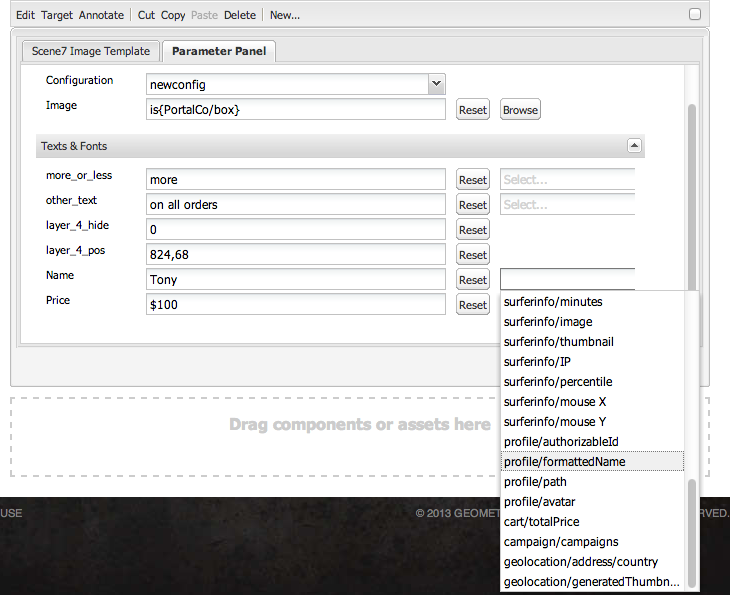-->

<!-- 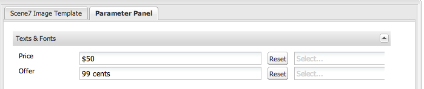-->

<!--
1. To notify a user about an annotation, specify the email address of the user and add the comment. For example, to notify Aaron MacDonald about an annotation, enter @aa. Hints for all matching users is displayed in a list. Select Aaron's email address from the list to tag her with the comment. Similarly, you can tag more users anywhere within the annotation or before or after it.
-->

<!--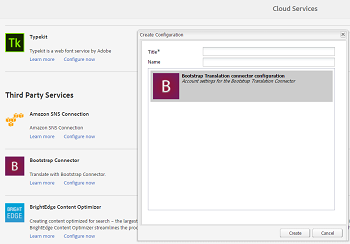-->

>[!NOTE]
>
>* Sharing an [!DNL Assets] folder of the type `sling:OrderedFolder` is not supported when sharing to Experience Cloud. If you want to share a folder, do not select [!UICONTROL Ordered] when creating a folder.
>* [!DNL Experience Manager] does not allow using `subassets` word as the name of a folder. The word **`subassets`** is a keyword reserved for nodes that contain subassets for compound assets.

### Steps to create a folder

1. Navigate to the place in your digital assets folder where you want to create a folder. In the menu, click **[!UICONTROL Create]**. Select **[!UICONTROL New Folder]**.
1. In the **[!UICONTROL Title]** field, provide a folder name. By default, Digital Asset Management (DAM) uses the title that you provided as the folder name. Once the folder is created, you can override the default and specify another folder name.
1. Click **[!UICONTROL Create]**. Your folder is displayed in the digital assets folder.

### Unsupported characters in file and folder names

The following (space-separated list of) characters are not supported:

* An asset file name cannot contain any of these characters: `* / : [ \\ ] | # % { } ? &`
* An asset folder name cannot contain any of these characters: `* / : [ \\ ] | # % { } ? \" . ^ ; + & \t`

## Upload assets {#uploading-assets}

Uploading assets brings your **digital assets**—images, videos, documents, audio files, and other rich media—into [!DNL Experience Manager], where they are centrally stored, organized, and made available for reuse across your web pages, campaigns, and channels. Once uploaded, [!DNL Experience Manager] processes each file and generates the metadata and renditions needed to manage, search, and deliver the asset efficiently.

For the complete step-by-step procedure, see [add digital assets to [!DNL Experience Manager]](add-assets.md).

### Why upload assets to [!DNL Experience Manager]

Uploading centralizes your media in a single, governed repository rather than leaving files scattered across local drives or disconnected folders. This delivers several practical benefits:

- **Reuse:** A single uploaded asset can be referenced across multiple pages and experiences, eliminating duplicate copies.
- **Consistency:** Centralized storage ensures every team uses the correct, approved version of an asset.
- **Discoverability:** Uploaded assets are indexed, making them searchable by name, metadata, and tags.
- **Delivery-ready processing:** When you upload an asset, [!DNL Experience Manager] generates the appropriate renditions so the file is ready for use across different channels and screen sizes.

Because uploaded assets become the source of truth for your media, keeping them well-organized from the moment of upload directly improves downstream authoring, search, and delivery.

## Extract ZIP archives {#extract-zip-archives}

Select ZIP archives that are managed in [!DNL Experience Manager] and extract their contents directly within [!DNL Experience Manager], without first downloading the compressed files to a local system. Extracting archives in place avoids the overhead of downloading, unpacking, and re-uploading files, which streamlines asset ingestion and keeps large ZIP contents inside the managed repository.

To extract the ZIP files, perform the following steps:

1. Select the ZIP archive (ZIP file type) that you want to extract.
1. Click the **[!UICONTROL Extract Archive]** option available on the action bar.
1. Select the destination folder where you want to save the assets extracted from the compressed folder.
1. Click **[!UICONTROL Next]**.
1. Select the appropriate behavior to handle file name conflicts during extraction. The available conflict-handling options are:

   * **Create a version** of an existing asset.
   * **Replace** the existing asset.
   * **Keep both** assets in the destination folder.
   * **Skip** the extraction of the new asset.

   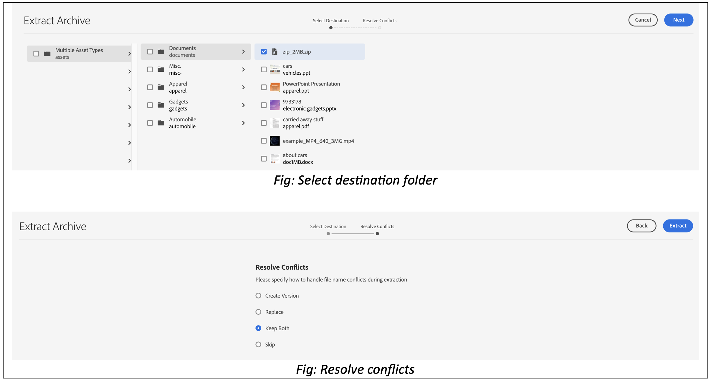

1. Click **[!UICONTROL Extract]**. The ZIP extraction process starts. Once the process is complete, the extracted assets are available for viewing in the destination folder.

   >[!NOTE]
   >
   >* The maximum supported ZIP file size is **15 GB** per archive.
   >* You can extract a maximum of **three ZIP files** at one time.

## Preview assets {#previewing-assets}

To preview an asset in the [!DNL Assets] user interface, complete the following steps in order:

1. From the [!DNL Assets] user interface, navigate to the location of the asset you want to preview.
1. Select the desired asset to open it.
1. In the preview mode, zoom controls are enabled for [supported Image types](/help/assets/file-format-support.md), providing interactive editing.

### Zoom controls for previewing images {#zoom-controls}

Preview mode gives you precise control over how closely you inspect an asset:

- **Zoom in:** Select **`+`** (or select the magnifying glass on the asset) to magnify the image.
- **Zoom out:** Select **`-`** to reduce the magnification and view more of the image.
- **Pan:** When you zoom in, you can look closely at any area of the image by panning (dragging the visible area of the image to reveal other regions). This ensures you can inspect fine details without losing image quality.
- **Reset zoom:** The reset zoom arrow brings you back to the original view.

Select **[!UICONTROL Reset]** to reset the view to the original size.

## Edit properties {#editing-properties}

<!--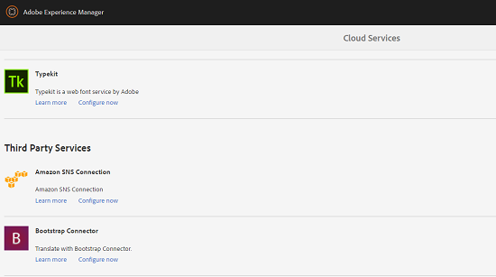-->

1. Navigate to the location of the asset whose metadata you want to edit.
1. Select the asset, and select **[!UICONTROL Properties]** from the toolbar to view asset properties. Alternatively, choose the **[!UICONTROL Properties]** quick action on the asset card.

   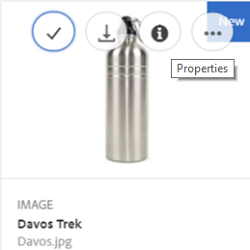

1. In the [!UICONTROL Properties] page, edit the metadata properties under various tabs. For example, under the **[!UICONTROL Basic]** tab, edit metadata fields such as the title, description, and other descriptive attributes.

   >[!NOTE]
   >
   >The layout of the [!UICONTROL Properties] page and the metadata properties available depend on the underlying metadata schema. To learn how to modify the layout of the [!UICONTROL Properties] page, see [Metadata Schemas](/help/assets/metadata-schemas.md).

1. To schedule a particular date/time for the activation of the asset, use the date picker beside the **[!UICONTROL On Time]** field. This schedules automatic activation, ensuring the asset becomes available only at the intended time.

   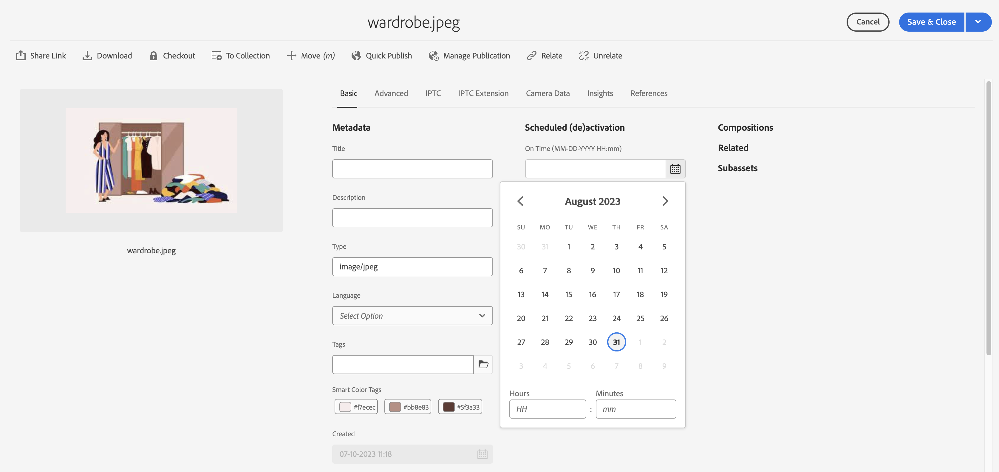

1. To deactivate the asset after a particular duration, choose the deactivation date/time from the date picker beside the **[!UICONTROL Off Time]** field. The deactivation date should be later than the activation date for an asset. As a result, after the [!UICONTROL Off Time] is reached, the asset and its renditions are no longer available either through the [!DNL Assets] web interface or through the HTTP API, because the deactivation automatically withdraws them from delivery.

1. In the **[!UICONTROL Tags]** field, select one or more tags to categorize and improve the discoverability of the asset. To add a custom tag, type the name of the tag in the box and select the `Enter` key. The new tag is saved in [!DNL Experience Manager].

   YouTube requires Tags to publish and have a link to YouTube (if a suitable link can be found).

   >[!NOTE]
   >
   >To create tags, you must have write permission at `/content/cq:tags/default` path in the CRX repository.

1. Select **[!UICONTROL Save & Close]**.
1. Navigate to the [!DNL Assets] user interface. The edited metadata properties—including title, description, and tags—are displayed on the asset card, confirming that the changes were saved successfully. These properties appear on the asset card in Card view and under relevant columns in the List view.

<!--
 TBD: Uncomment after verification for Dec release.

## View asset usage and references {#usage-and-references}

[!DNL Experience Manager] lets you track statistics about usage of a digital asset. The usage statistics include the following:

    * Number of times the asset was viewed or downloaded
    * Channels/devices through which the asset was used
    * Creative solutions where the asset was recently used

To view usage statistics for an asset, in the [!UICONTROL Properties] page, click the **[!UICONTROL Insights]** tab. For more details, see [Assets Insights](assets-insights.md).

[!DNL Experience Manager] also lets you check all the incoming references to an asset, that is, the usage of an asset in remote [!DNL Sites] and in compound assets. Authors of webpages on [!DNL Experience Manager Sites] deployment can use an asset on a remote [!DNL Assets] deployment using the Connected Assets functionality. The [!UICONTROL References] tab in an asset's [!UICONTROL Properties] page lists the local and remote references of the asset. That is, the use of assets in compound assets in [!DNL Assets] and its use in remote [!DNL Sites] pages.

-->

## Copy assets {#copying-assets}

Copying an asset or a folder in [!DNL Experience Manager] duplicates the **entire asset or folder, along with its complete content structure**, at the target location. The copied asset or folder becomes a full duplicate, while the original **asset at the source location remains unaltered** — making the copy operation a non-destructive action that safely preserves the source.

A few attributes that are unique to each individual copy of an asset are **not carried forward**. Examples include:

* **Asset ID, creation date and time, and versions and version history.** These properties are indicated by **`jcr:uuid`** (the unique asset identifier), **`jcr:created`** (the original creation timestamp), and **`cq:name`**.

* **Creation time and referenced paths**, which are unique for each asset and for each of its renditions.

All other properties and metadata information are fully retained in the copy. [!DNL Experience Manager] creates a **complete duplicate, not a partial copy**, when copying an asset.

1. From the [!DNL Assets] user interface, select one or more assets, and then select the **[!UICONTROL Copy]** icon from the toolbar. Alternatively, select the **[!UICONTROL Copy]** 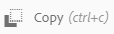 quick action from the asset card.

   >[!NOTE]
   >
   >If you use the [!UICONTROL Copy] quick action, you can copy only one asset at a time.

1. Navigate to the location where you want to copy the assets.

   >[!NOTE]
   >
   >If you copy an asset to the same location, [!DNL Experience Manager] automatically generates a variation of the name to avoid a naming conflict. For example, because two assets cannot share an identical name in one location, copying an asset titled `Square` causes [!DNL Experience Manager] to automatically generate the title of its copy as `Square1`.

1. Click the **[!UICONTROL Paste]** asset icon from the toolbar. The assets are copied to this location.

   >[!NOTE]
   >
   >The **[!UICONTROL Paste]** icon remains available in the toolbar until the paste operation is completed.

### Move or rename assets {#moving-or-renaming-assets}

1. Navigate to the location of the asset you want to move.

1. Select the asset, and select the **[!UICONTROL Move]** icon 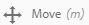 from the toolbar.

1. In the Move [!DNL Assets] wizard, do one of the following:

    * Specify the name for the asset after it is moved. Then select **[!UICONTROL Next]** to proceed.

    * Select **[!UICONTROL Cancel]** to stop the process.

   >[!NOTE]
   >
   >* You can specify the same name for the asset if no asset with that name exists at the new location. However, use a different name when moving the asset to a location where an asset with the same name already exists. If you use the same name, the system automatically generates a name variation to prevent conflicts. For example, if your asset has the name Square, the system generates the name Square1 for its copy.
   >* When renaming, whitespace is not allowed in the file name, because file names must remain valid path-compatible identifiers.

1. On the **[!UICONTROL Select Destination]** dialog, do one of the following:

    * Navigate to the new location for the assets, and then select **[!UICONTROL Next]** to proceed.

    * Select **[!UICONTROL Back]** to return to the **[!UICONTROL Rename]** screen.

1. If the assets being moved have any referencing pages, assets, or collections, the **[!UICONTROL Adjust References]** tab appears beside the **[!UICONTROL Select Destination]** tab.

   Do one of the following in the **[!UICONTROL Adjust References]** screen:

    * Specify the references to be adjusted based on the new details, and then select **[!UICONTROL Move]** to proceed.

    * From the **[!UICONTROL Adjust]** column, select/unselect references to the assets.
    * Select **[!UICONTROL Back]** to return to the **[!UICONTROL Select Destination]** screen.

    * Select **[!UICONTROL Cancel]** to stop the move operation.

   If you do not update references, they continue to point to the asset's previous path, which can result in broken links. If you adjust the references, the system updates them to the new asset path, preserving connections to referencing pages, assets, and collections. For more information on moving an asset, see [Permission model for move or publish operations](#permission-model).

### Manage renditions {#managing-renditions}

Renditions are the alternate versions of an asset—such as different sizes or formats generated during asset processing—that [!DNL Adobe Experience Manager Assets] stores alongside the original. You can add or remove renditions for an asset, except the original, directly from the asset's details page.

1. Navigate to the location of the asset for which you want to add or remove renditions.

1. Select the asset to open its asset page.

<!--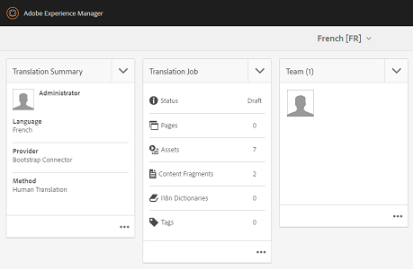-->

1. Select the GlobalNav icon, and select **[!UICONTROL Renditions]** from the list.

   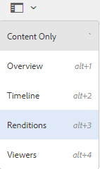

1. In the **[!UICONTROL Renditions]** panel, view the list of renditions generated for the asset.

   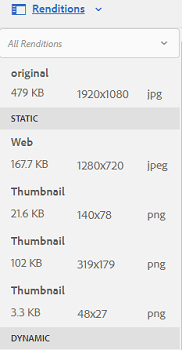

   >[!NOTE]
   >
   >By default, [!DNL Experience Manager Assets] does not display the original rendition of the asset in the preview mode. If you are an administrator, you can use overlays to configure [!DNL Assets] to display original renditions in the preview mode.

1. Select a rendition to either view or delete the rendition.

   **Deleting a rendition**

   Select a rendition from the **[!UICONTROL Renditions]** panel, and then select the **[!UICONTROL Delete Rendition]** icon from the toolbar. Renditions cannot be deleted in bulk after asset processing is complete, because bulk deletion is not supported once processing has finished. For individual assets, you can remove renditions manually from the user interface. For multiple assets, you can customize [!DNL Experience Manager] to delete either specific renditions or to delete the assets and re-upload the deleted assets.

   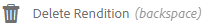

   **Uploading a new rendition**

   Navigate to the asset details page for the asset, and select the **[!UICONTROL Add Rendition]** icon in the toolbar to upload a new rendition for the asset.

   <!--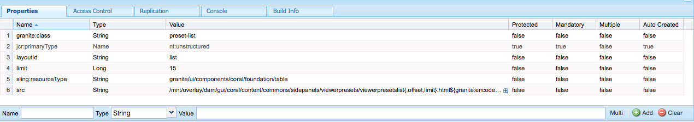-->

   >[!NOTE]
   >
   >If you select a rendition from the **[!UICONTROL Renditions]** panel, the toolbar changes context and displays only those actions that are relevant to the rendition. Options such as the Upload Rendition icon are not displayed. To view these options in the toolbar, navigate to the details page for the asset.

   **Configuring rendition dimensions**

   You can configure the dimensions for the rendition you want displayed on the details page of an image or video asset. As a result, [!DNL Assets] automatically selects and displays the rendition whose dimensions exactly match or most closely match the values you specify.

   You cannot create renditions with the following prefixes, as these are internal to Adobe:

   * **cq5**

   * **cqdam**

   * **cq5dam**

   To configure rendition dimensions of an image at the asset detail level, overlay the `renditionpicker` node (`/libs/dam/gui/content/assets/assetpage/jcr:content/body/content/content/items/assetdetail/items/col1/items/assetview/renditionpicker`) and configure the value of the width property. Configure the property **[!UICONTROL size (Long) in KB]** in place of width to customize the rendition on the asset detail page based on image size. For size-based customization, the property `preferOriginal` assigns preference to the original if the size of the matched rendition is greater than the original.

   Similarly, you can customize the Annotation page image by overlaying `/libs/dam/gui/content/assets/annotate/jcr:content/body/content/content/items/content/renditionpicker`.

   <!--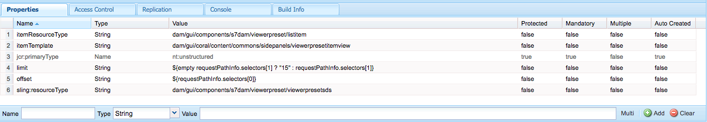-->

   To configure rendition dimensions for a video asset, navigate to the `videopicker` node in the **CRX (Content Repository Extreme)** repository at the location `/libs/dam/gui/content/assets/assetpage/jcr:content/body/content/content/items/assetdetail/items/col1/items/assetview/videopicker`, overlay the node, and then edit the appropriate property.

   >[!NOTE]
   >
   >Video annotations are supported only on browsers with **HTML5 (HyperText Markup Language 5)** compatible video formats. In addition, depending on the browser, different video formats are supported. However, the **MXF (Material Exchange Format)** video format is not yet supported with video annotations.

## Delete assets {#delete-assets}

To resolve or remove incoming references from other pages, update the relevant references before deleting an asset. This step is essential because deleting an asset that other pages still reference leaves broken links across those pages.

Also, disable the force delete button using an overlay. This prevents users from deleting referenced assets, and as a result, it protects your content from broken links and ensures reference integrity is maintained before any deletion occurs.

1. Navigate to the location of the assets you want to delete.

1. Select the asset, and click **[!UICONTROL Delete]**  from the toolbar.

1. In the confirmation dialog, click:

    * **[!UICONTROL Cancel]** to stop the action and return to the asset location without any changes
    * **[!UICONTROL Delete]** to confirm the action:

        * If the asset has no references, the asset is deleted immediately.
        * If the asset has references, an error message informs you that **[!UICONTROL One or more assets are referenced]**. This message indicates that other pages still depend on the asset, and deleting it would break those references. You can then select **[!UICONTROL Force Delete]** to override the check and delete the asset regardless of its references, or **[!UICONTROL Cancel]** to stop and update the references first.

   >[!NOTE]
   >
   >You require **delete permissions on dam/asset** to be able to delete an asset. If you only have **modify permissions**, you can only edit the asset metadata and add annotations to the asset. However, you cannot delete the asset or its metadata. This permission separation ensures that only authorized users can permanently remove assets from the repository.

   >[!NOTE]
   >
   >To resolve or remove the incoming references from other pages, update the relevant references before deleting an asset. Administrators can disallow deletion of referenced assets, because deleting a referenced asset directly causes broken links on the pages that depend on it. To enforce this safeguard, disable the force delete button using an overlay.

## Asynchronous Background Jobs {#asynchronous-background-jobs}

To improve performance and reliability when processing large numbers of assets, Adobe [!DNL Experience Manager] (AEM) uses asynchronous background jobs for certain asset management operations. Instead of completing these operations immediately, AEM processes them in the background and allows users to continue working while progress is tracked separately. This approach keeps the user interface responsive and prevents long-running operations from blocking other work.

### When Jobs Run Asynchronously

**Folder operations affecting more than 150 assets** — including moving, copying, or deleting — are automatically executed as asynchronous jobs. When starting one of these operations, users can choose to **run the job immediately** or **schedule it for a later time**. Scheduling allows large operations to be deferred to off-peak periods, reducing contention on system resources.

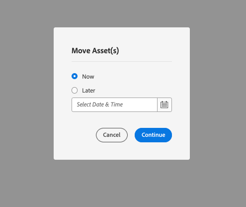

### How AEM Processes the Job

As the operation runs, AEM processes assets in **batches** and periodically saves progress. Batch processing with periodic checkpoints ensures that progress is preserved and the operation can recover reliably rather than restarting from the beginning. The AEM user interface displays progress updates so that users can monitor the status of the operation in real time.

For **move and delete operations**, AEM restricts access to the affected folders while the job runs. This restriction exists to prevent conflicting actions, because concurrent edits during a batch operation could corrupt the job state or produce inconsistent results.

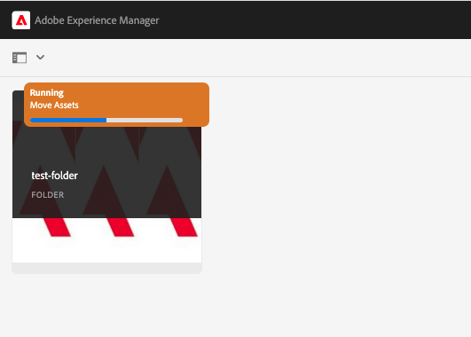

### Tracking Job Progress

To track job progress, open the **[!DNL Assets] Jobs console** (**[!DNL Assets]** > **Jobs** within the Admin view). The console displays the current status, percentage completed, and other job information. To view detailed job information:

1. Open the **[!DNL Assets] Jobs console** by navigating to **[!DNL Assets]** > **Jobs** in the Admin view.
2. Review the listed jobs, each showing its **current status** and **percentage completed**.
3. Select a job and click **Open** to view additional details, including progress information and the **estimated time remaining** for completion.

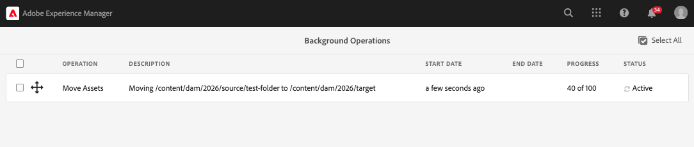

Users are notified automatically when the operation finishes, so no manual polling is required to confirm completion.

## Download assets {#download-assets}

Downloading assets in Adobe [!DNL Experience Manager] (AEM) lets you retrieve digital files — such as images, documents, videos, and other rich media — from the centralized asset repository to your local machine or another destination. For complete step-by-step instructions, see [download assets from [!DNL Experience Manager]](/help/assets/download-assets-from-aem.md).

The ability to download assets is a core function of digital asset management, ensuring that approved, up-to-date files can be reused across creative, marketing, and publishing workflows. Because [!DNL Experience Manager] serves as a single source of truth for an organization's media, downloading directly from the repository helps teams work with the correct, latest versions rather than outdated or duplicated copies.

**Common reasons to download assets from [!DNL Experience Manager] include:**

- **Reusing approved files** in external design, editing, or publishing tools.
- **Sharing assets** with collaborators, partners, or stakeholders outside the platform.
- **Archiving or backing up** important media locally.
- **Preparing assets** for delivery across channels such as web, print, and social.

For the full workflow, including selection options and available formats, refer to the linked guide: [download assets from [!DNL Experience Manager]](/help/assets/download-assets-from-aem.md).

## Publish or unpublish assets {#publish-assets}

1. Navigate to the location of the asset or the asset folder that you want to publish or that you want to remove from the publish environment (unpublish).

1. Select the asset or the folder to publish or unpublish, then select the **[!UICONTROL Manage Publication]**  option from the toolbar. Alternatively, to publish quickly, select the **[!UICONTROL Quick Publish]** option from the toolbar. If the folder you want to publish includes an empty folder, that empty folder is not published.

1. Select the **[!UICONTROL Publish]** or **[!UICONTROL Unpublish]** option as required.

   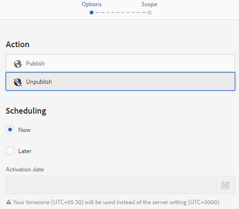
   *Figure: Publish and unpublish options and the scheduling option.*

1. Select **[!UICONTROL Now]** to act on the asset immediately. To schedule the action instead, select **[!UICONTROL Later]** and choose a date and time. Click **[!UICONTROL Next]** to continue.

1. When publishing, if an asset references other assets, the wizard lists those references. The wizard displays only the references that are either unpublished or modified since the last publish. Choose the references that you want to publish.

1. When unpublishing, if an asset references other assets, choose the references that you want to unpublish. Click **[!UICONTROL Unpublish]**. In the confirmation dialog, click **[!UICONTROL Cancel]** to stop the action or click **[!UICONTROL Unpublish]** to confirm that the assets are to be unpublished at the specified date.

### Limitations and Tips for Publishing and Unpublishing [!DNL Assets]

Understand the following limitations and tips related to publishing or unpublishing assets or folders:

* The **[!UICONTROL Manage Publication]** option is available only to user accounts that have **replication permissions**. Accounts without these permissions cannot access the publish or unpublish workflow.
* While unpublishing a complex asset, unpublish **the asset only**. Avoid unpublishing the references, because those references may still be referenced by other published assets. Unpublishing shared references can break the other published assets that depend on them.
* **Empty folders are never published.**
* If you publish an asset that is still being processed, only the **original content** is published, and the renditions are missing, because the renditions have not yet been generated. To include renditions, either wait for processing to complete and then publish, or re-publish the asset once processing completes.

## Closed user group {#closed-user-group}

A **closed user group (CUG)** limits access to specific asset folders published from [!DNL Experience Manager]. When you create a CUG for a folder, access to that folder—including its assets and all subfolders—is restricted exclusively to assigned members or groups. Because access is gated, assigned members or groups must log in with their security credentials before the folder becomes available to them.

CUGs provide an additional, layered method for restricting access to your assets, complementing existing permission settings so that sensitive content remains protected even in the publish environment. You can also configure a dedicated login page for the folder.

### Configure a closed user group for an asset folder

1. Select a folder from the [!DNL Assets] UI, and select the Properties icon from the toolbar to display the properties page.
1. From the **[!UICONTROL Permissions]** tab, add members or groups under **[!UICONTROL Closed User Group]**.

   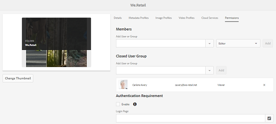

1. To display a login screen when users access the folder, select the **[!UICONTROL Enable]** option. Then, select the path to a login page in [!DNL Experience Manager], and save the changes.

   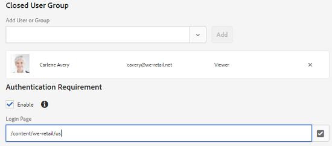

   >[!NOTE]
   >
   >If you do not specify the path to a login page, [!DNL Experience Manager] displays the default login page in the publish instance.

1. Publish the folder, and then try accessing it from the publish instance. A login screen is displayed.
1. If you are a CUG member, enter your security credentials. After [!DNL Experience Manager] authenticates the assigned member, the folder is displayed, confirming that access is granted only to verified CUG members.

## Search assets {#search-assets}

Searching assets is central to the usage of a **digital asset management (DAM)** system, because effective discovery of the right asset determines how quickly work moves forward across the organization. Regardless of role, users depend on search to locate, reuse, govern, and maintain the assets that power their workflows.

Search supports several distinct groups of users:

- **Creatives**, who search to discover and reuse existing assets for further creative production.
- **Business users and marketers**, who rely on search for robust management of assets across campaigns and day-to-day operations.
- **DAM administrators**, who use search for administration, governance, and oversight of the asset library.

To meet these varied needs, a DAM system provides multiple levels of search capability:

- **Simple search** enables quick discovery using keywords or basic terms.
- **Advanced search** narrows results using metadata, filters, and structured criteria for greater precision.
- **Custom search** tailors query behavior to specific business requirements and asset structures.

For simple, advanced, and custom searches to discover and use the most appropriate assets, see [search assets in [!DNL Experience Manager]](/help/assets/search-assets.md).

## Quick actions {#quick-actions}

**Quick action icons** provide fast, context-specific controls for working with an individual asset directly from its thumbnail. **These icons are available for a single asset at a time**, meaning they surface the actions relevant to one selected item rather than to a group. This single-asset scope keeps the interface focused and ensures that each action applies precisely to the asset in view.

The method used to reveal the quick action icons depends on the input type of your device. Because touch and pointer-based devices interact differently, the display gesture differs accordingly. Perform the following actions to display the quick action icons:

* **Touch devices:** Touch and hold the asset. For example, on an iPad, the user can select-and-hold an asset so that the quick actions display.
* **Non-touch devices:** Hover the pointer over the asset. For example, on a desktop device, hovering the pointer over the asset thumbnail displays the quick action bar.

In short, **touch devices** rely on a press-and-hold gesture, while **non-touch devices** rely on a pointer hover — both revealing the same set of quick action icons for the targeted asset.

<!--
 Hiding this topic via cqdoc-18707

## Edit images {#editing-images}

The editing tools in the [!DNL Experience Manager Assets] interface let you perform small editing jobs on image assets. You can crop, rotate, flip, and perform other editing jobs on images. You can also add image maps to assets.

>[!NOTE]
>
>For some components, the Full Screen mode has additional options available.

1. Do one of the following to open an asset in edit mode:

    * Select the asset and then select the **[!UICONTROL Edit]** icon in the toolbar.
    * Select the **[!UICONTROL Edit]** icon that appears on an asset in the Card view.
    * In the asset page, select the **[!UICONTROL Edit]** icon in the toolbar.

   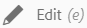

1. To crop the image, select the **Crop** icon.

   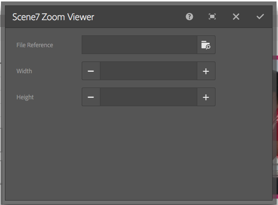

1. Select the desired option from the list. The crop area appears on the image based on the option you choose. The **Free Hand** option lets you crop the image without any aspect ratio restrictions.

   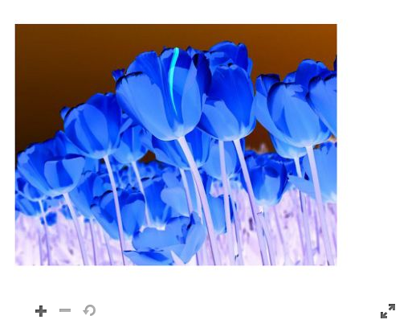

1. Select the area to be cropped, and resize or reposition it on the image.
1. Use the **Finish** icon (top right corner) to crop the image. Clicking the **Finish** icon also triggers the regeneration of renditions.

   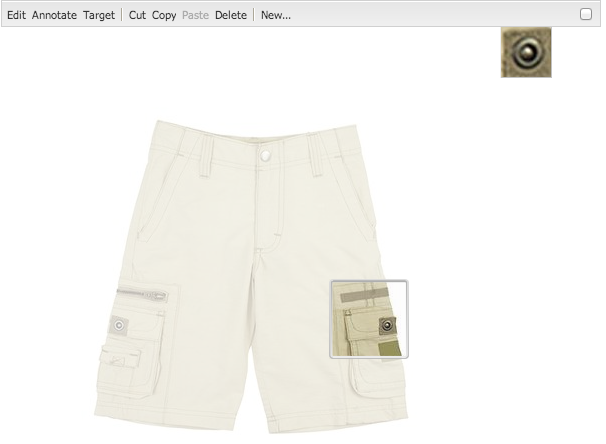

1. Use the **Undo** and **Redo** icons on the top right to revert to the uncropped image or retain the cropped image, respectively.

   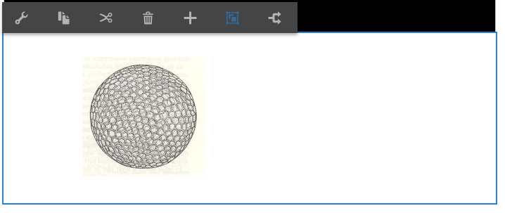

1. Select the appropriate Rotate icon to rotate the image clockwise or anti-clockwise.

   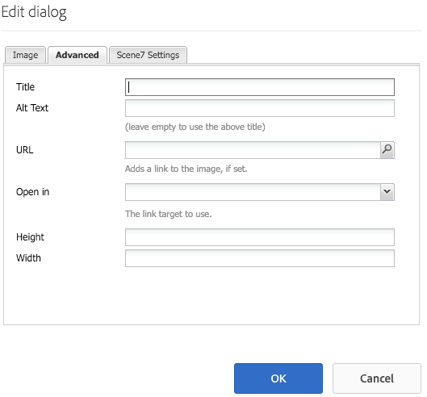

1. Select the appropriate Flip icon to flip the image horizontally or vertically.

   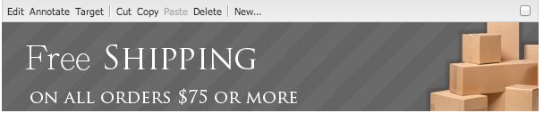

1. Select the **Finish** icon to save the changes.

   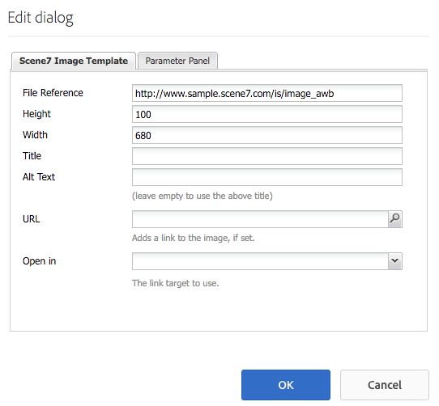

>[!NOTE]
>
>Image editing is supported for BMP, GIF, PNG, and JPEG files formats.

>[!NOTE]
>
>To edit a TXT file, set **Day CQ Link Externalizer** from Configuration Manager.
-->

## Timeline {#timeline}

The timeline provides a chronological view of asset-related events across four categories for a selected item, letting you track and review everything that has happened to an asset in one place. The timeline surfaces the following event types:

- **Active workflows** for an asset, so you can see which automated or manual processes are currently running against the item.
- **Comments/annotations**, which capture reviewer feedback and markup added directly to the asset.
- **Activity logs**, which record the history of actions performed on the item for auditing and traceability.
- **Versions**, which let you view and compare successive revisions of the asset over time.

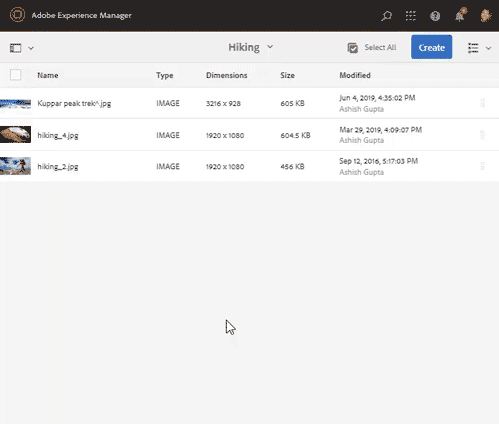
*Figure: Sort timeline entries for an asset*

Because these events are consolidated into a single chronological view, the timeline serves as a central reference point for collaboration, review, and version tracking.

>[!NOTE]
>
>In the [Collections console](/help/assets/manage-collections.md#navigate-the-collections-console), the **[!UICONTROL Show All]** list provides options to view comments and workflows only. Moreover, the timeline is displayed only for top-level collections that are listed in the console. The timeline does not appear when you navigate inside any of the collections.

>[!NOTE]
>
>Timeline contains several [options specific to content fragments](content-fragments/content-fragments.md).

## Annotate assets {#annotating}

<!--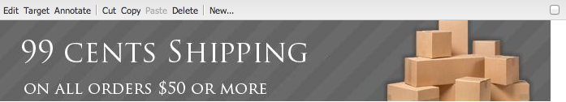-->

Annotations are comments or explanatory notes added directly to images or videos. Annotations enable marketers to collaborate and leave feedback directly on assets, streamlining the review and approval workflow by keeping comments attached to the exact asset—and, for videos, the exact frame—being discussed.

Video annotations are only supported on browsers with HTML5-compatible video formats. The video formats that [!DNL Assets] supports depend on the browser. However, **MXF (Material Exchange Format) video format** is not yet supported with video annotations.

>[!NOTE]
>
>For [!DNL Content Fragments], [annotations are created in the fragment editor](content-fragments/content-fragments.md).

1. Navigate to the location of the asset to which you want to add annotations.
1. Select the **[!UICONTROL Annotate]** icon from one of the following:

    * [Quick actions](#quick-actions)
    * From the toolbar after selecting the asset or navigating to the asset page

<!--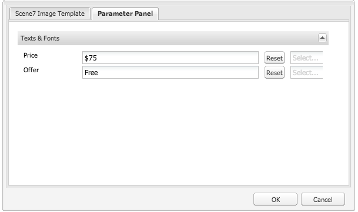-->

   

1. Add a comment in the **[!UICONTROL Comment]** box at the bottom of the timeline. Alternatively, mark up a specific area on the image and add an annotation in the **[!UICONTROL Add Annotation]** dialog. Marking up a precise region focuses the feedback on the exact part of the asset that requires attention.

  


   >[!NOTE]
   >
   >For a non-administrator user, suggestions appear only if the user has Read permissions at `/home` in CRXDE (Content Repository Extreme Development Environment).

   

1. After adding the annotation, click **[!UICONTROL Add]** to save it. A notification for the annotation is sent to Aaron so that the intended reviewer is alerted to the new feedback.

   

   >[!NOTE]
   >
   >You can add multiple annotations before you save them.

1. Select **[!UICONTROL Close]** to exit from the Annotation mode.
1. To view the notification, log in to [!DNL Assets] with Aaron MacDonald's credentials and click the **[!UICONTROL Notifications]** icon to view the notification.

   >[!NOTE]
   >
   >Annotations can also be added to video assets. While annotating videos, the player pauses to let you annotate on a specific frame, because pausing allows you to attach precise, frame-level feedback to the exact moment in the video that needs comment. For details, see [managing video assets](manage-video-assets.md). However, **MXF video format** is not yet supported with video annotations.

1. To choose a different color so you can differentiate between users, select the Profile icon and select **[!UICONTROL My Preferences]**. Assigning distinct annotation colors makes it easy to identify which reviewer contributed each comment.

   

<!--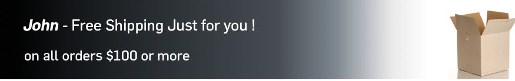-->

   Specify the desired color in the **[!UICONTROL Annotation Color]** box and then select **[!UICONTROL Accept]**.

<!-- 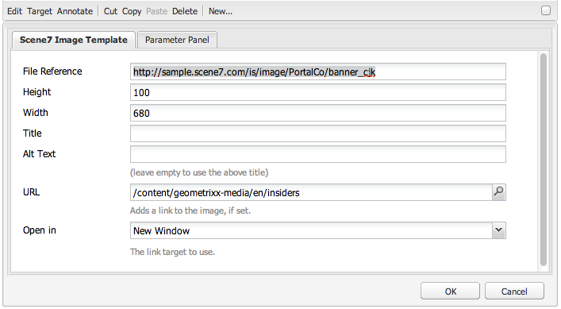-->

  

>[!NOTE]
>
>You can also add annotations to a collection. However, if a collection contains child collections, you can add annotations or comments to the parent collection only. The Annotate option is not available for child collections.

### View saved annotations {#viewing-saved-annotations}

<!--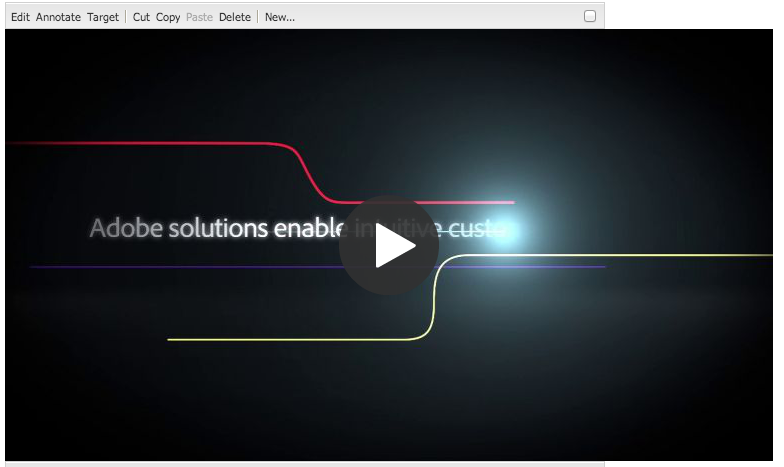-->

<!--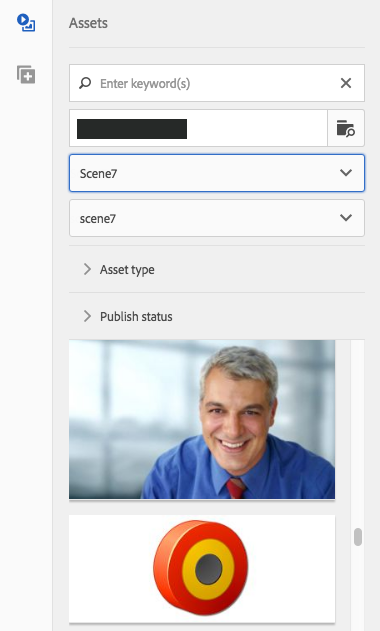-->

<!--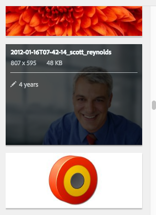-->

You can view only one annotation at a time.

>[!NOTE]
>
>If you are selecting multiple annotations, the most recently created annotation is displayed on the user interface.
>
>Multi-select is supported only when printing the annotated asset as a Portable Document Format (PDF); as a result, selecting multiple annotations does not display them simultaneously in the standard viewer.

Follow these steps:

1. To view saved annotations for an asset, navigate to the location of the asset and open the asset page. This opens the detail view where the asset and its associated activity are available.

1. Select the GlobalNav icon, and choose **[!UICONTROL Timeline]** from the list. The **[!UICONTROL Timeline]** displays the activity and comment history associated with the asset.

   

1. From the **[!UICONTROL Show All]** list in the timeline, select **[!UICONTROL Comments]** to filter the results based on annotations. This narrows the timeline to display only comment and annotation entries.

   

   Select a comment in the **[!UICONTROL Timeline]** panel to view the corresponding annotation on the image. This displays the annotation exactly where it was placed on the asset.

   

   Select **[!UICONTROL Delete]** to permanently remove a particular comment and its associated annotation from the asset.

### Print annotations {#printing-annotations}

<!--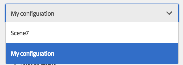-->

If an asset has **annotations** or has been subjected to a review workflow, [!DNL Adobe Experience Manager Assets] lets you print the asset together with its annotations and review status as a **PDF file** for offline review.

You can also choose to print only the **annotations** or only the **review status**, depending on what reviewers need to see offline.

>[!NOTE]
>
>You can select multiple annotations while printing the annotated asset as PDF.

To print the annotations and review status, select the **[!UICONTROL Print]** icon and follow the instructions in the wizard. The **[!UICONTROL Print]** icon appears in the toolbar only when the asset has at least one annotation or review status assigned to it, because printing requires reviewable content to output.

1. From the [!DNL Assets] UI, open the preview page for an asset.
1. Do one of the following:

    * To print all the annotations and the review status, skip step 3 and go directly to step 4.
    * To print specific annotations and review status, open the [timeline](/help/assets/manage-digital-assets.md#timeline) and then continue to step 3.

1. To print specific annotations, select the annotations from the timeline.

<!--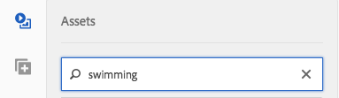-->

   

   To print the review status only, select the review status from the timeline.

   

<!--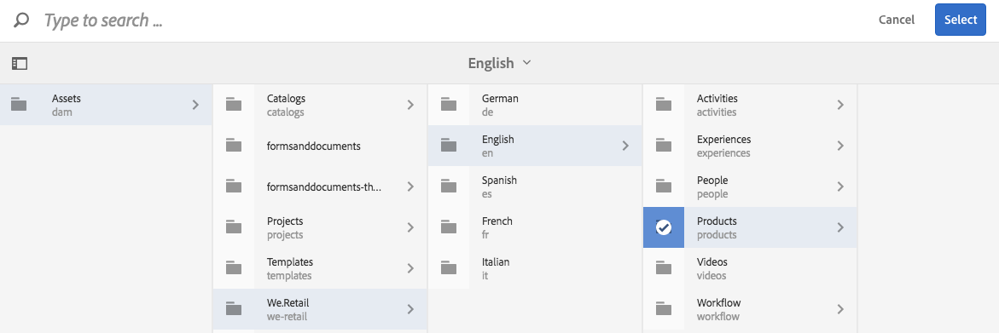-->

1. Select the **[!UICONTROL Print]** icon from the toolbar.

<!--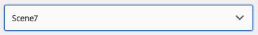-->

   

1. From the Print dialog, choose the position where you want the annotations and review status to be displayed on the PDF. For example, to print the annotations and status at the top-right of the page that contains the printed image, use the **Top-Left** setting. The **Top-Left** setting is selected by default.

   

   Choose other settings depending on where you want the annotations and status to appear in the printed PDF. To place the annotations and status on a page separate from the printed asset, choose **[!UICONTROL Next Page]**.

1. Click **[!UICONTROL Print]**. As a result of the option selected in step 2, the generated PDF displays the annotations and review status at the position you specified. For example, if you choose to print both the annotations and the review status using the **Top-Left** setting, the generated output resembles the PDF file depicted here.

   

<!--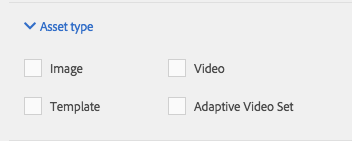-->

1. Download or print the PDF using the options at the top-right.

<!--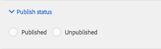-->

   

   To modify the appearance of the rendered PDF file — for example, the font color, size, and style, or the background color of the comments and statuses — open the **[!UICONTROL Annotation PDF configuration]** from Configuration Manager and modify the desired options. For example, to change the display color of the approved status, modify the color code in the corresponding field. This lets you standardize how statuses and comments appear across printed reviews. For information about changing the font color of annotations, see [Annotating](/help/assets/manage-digital-assets.md#annotating).

   Return to the rendered PDF file and refresh it. The refreshed PDF reflects the changes you made.

## Asset versioning {#asset-versioning}

**Asset versioning** creates a **snapshot** of a digital asset at a specific point in time. Each version preserves the exact state of the asset so it can be **restored to a previous state** whenever needed. This enables non-destructive editing: to undo a change made to an asset, simply restore the unedited version, because the earlier snapshot remains intact and recoverable. As a result, versioning safeguards original content against accidental overwrites and supports reliable rollback across collaborative workflows.

### When versions are created

Versions are created in the following scenarios:

* **Editing in another application:** When you modify an image in a different application and upload it to [!DNL Assets], a new version is created automatically. This ensures your original image is not overwritten and remains available for restore.
* **Metadata edits:** When you edit the metadata of an asset, a version captures that change.
* **Desktop app checkout:** When you use the [!DNL Experience Manager] desktop app to check out an existing asset and save your changes, a new version is created every time the asset is saved.

You can also enable **automatic versioning** through a workflow, so versions are generated without manual intervention.

### Metadata and renditions saved with each version

When you create a version for an asset, the **metadata and renditions** are saved along with the version. **Renditions** are rendered alternatives of the same image — for example, a **Portable Network Graphics (PNG)** rendition of an uploaded **Joint Photographic Experts Group (JPEG)** file. Because these renditions and metadata are stored with the snapshot, restoring a version returns the asset to its complete prior state rather than the base file alone.

### What versioning lets you do

The versioning functionality lets you:

* Create a version of an asset.
* View the current revision for an asset.
* Restore the asset to a previous version.

### How to create and manage asset versions

1. Navigate to the location of the asset for which you want to create a version, and select it to open its asset page.

1. Select the GlobalNav icon, and then choose **[!UICONTROL Timeline]** from the menu.

   

1. Select the **[!UICONTROL Actions]** (arrow) icon at the bottom to view the available actions you can perform on the asset.

<!--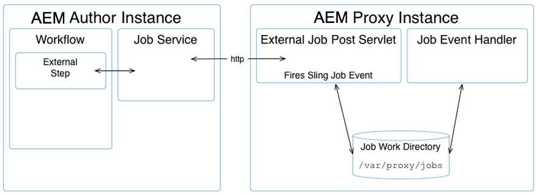-->

1. Select **[!UICONTROL Save as Version]** to create a version for the asset.

<!--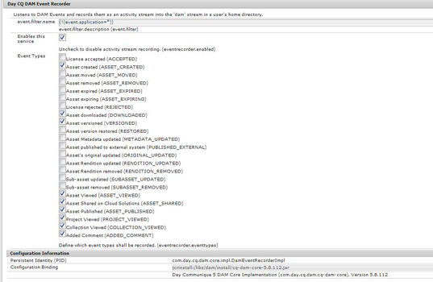-->

1. Add a label and comment, and then click **[!UICONTROL Create]** to create a version. Alternatively, select **Cancel** to exit the operation.

<!--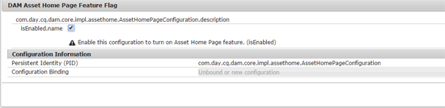-->

1. To view the new version, open the **[!UICONTROL Show All]** list in the timeline from the asset details page or the [!DNL Assets] UI, and choose **[!UICONTROL Versions]**. All versions created for an asset are listed under the timeline tab. You can filter the list to show only versions by clicking the drop arrow and selecting **[!UICONTROL Versions]** from the list.

   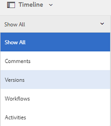

1. Select a specific version for the asset to preview it or enable it to appear in the [!DNL Assets] UI.

   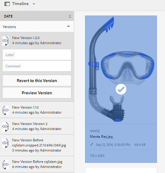

1. Add a label and comment for the version to revert to that particular version in the [!DNL Assets] UI.

   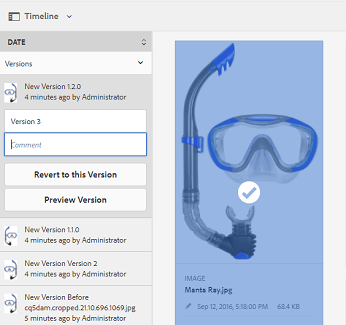

1. To generate a preview for the version, select **[!UICONTROL Preview Version]**.
1. To display this version in the [!DNL Assets] UI, select **[!UICONTROL Revert to this Version]**.
1. To compare two versions, go to the asset page of the asset and select the version to be compared with the current version.

   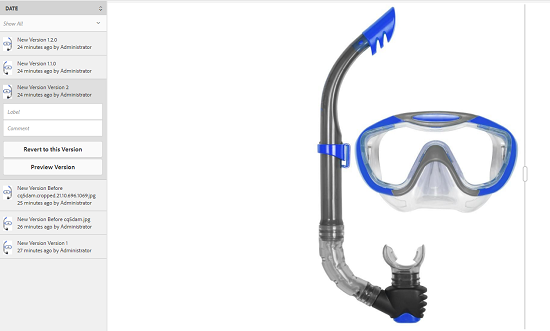

1. From the timeline, select the version you want to compare and drag the slider to the left to superimpose this version over the current version and compare them.

   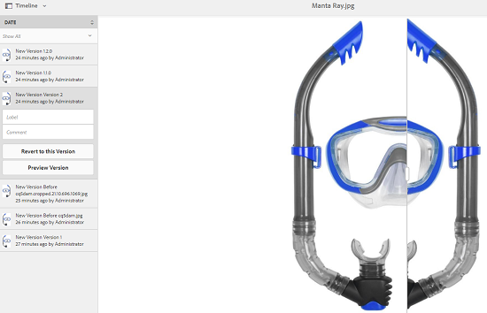

### Start a workflow on an asset {#starting-a-workflow-on-an-asset}

<!---->

<!---->

<!--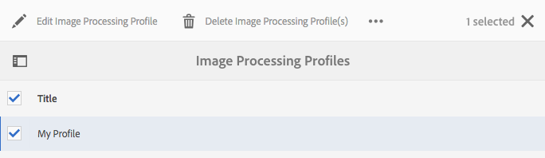-->

<!--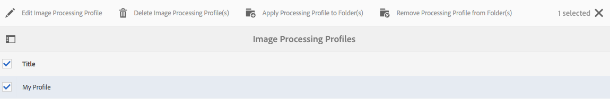-->

Starting a workflow on an asset lets you apply a defined, repeatable process—such as review, approval, or publishing—directly to that asset. Follow these steps to start a workflow:

1. Navigate to the location of the asset for which you want to start a workflow, and select the asset to open the asset page.

1. Select the **GlobalNav** (Global Navigation) icon, and then choose **[!UICONTROL Timeline]** from the menu to display the timeline. The timeline shows the asset's activity history and is where workflow events appear as the process runs.

   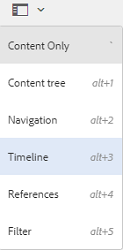

1. Select the **[!UICONTROL Actions]** (arrow) icon at the bottom of the timeline to open the list of actions available for the asset.

1. Select **[!UICONTROL Start Workflow]** from the list of actions.

1. In the **[!UICONTROL Start Workflow]** dialog, select a workflow model from the list. A workflow model is a predefined sequence of steps that determines how the asset is processed once the workflow begins.

1. (Optional) Specify a title for the workflow. This title identifies and references the specific workflow instance, making it easier to locate and track later.

1. Select **[!UICONTROL Start]** and then select **[!UICONTROL Proceed]** in the confirmation dialog to begin the workflow. Each step of the workflow is displayed in the timeline as an event, allowing you to monitor progress and confirm that each stage completes as expected.

<!--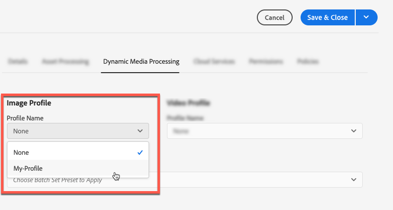-->

## Collections {#collections}

A **collection** is an **ordered set of assets** used to share assets between users. Because a collection stores only **references** to assets rather than copies of the assets themselves, it can group assets from **different locations** into a single, shareable set without duplicating or moving the underlying files. This reference-based design makes collections well suited to collaboration, review, and distribution workflows where multiple users need consistent access to the same set of assets.

* A collection can include assets from different locations because collections contain only references to these assets, not the assets themselves. As a result, each collection maintains the **referential integrity** of its assets, ensuring that every referenced asset remains accurately linked to its original source location.
* You can share collections with multiple users at different privilege levels, including **editing**, **viewing**, and other role-based access levels. This lets you control who can modify a collection and who can only review its contents, supporting secure collaboration across teams.

To know details of Collection management, see [manage Collections](/help/assets/manage-collections.md).

## Hide expired assets when viewing assets in desktop app or Adobe Asset Link {#hide-expired-assets-via-acp-api}

[!DNL Experience Manager] desktop app provides access to the **Digital Asset Management (DAM)** repository from Windows or Mac desktop. Adobe Asset Link provides access to assets from within the supported [!DNL Creative Cloud] desktop applications.

Within the [!DNL Experience Manager] user interface, expired assets are hidden from view by default. This default behavior does not extend automatically to external access points. As a result, expired assets may still be viewed, searched, and fetched when users browse the repository through the desktop app and Adobe Asset Link. Hiding expired assets across these entry points supports consistent asset lifecycle governance, ensuring that content past its expiration is no longer surfaced to users regardless of how they connect to the DAM.

To prevent the viewing, searching, and fetching of expired assets when browsing from the desktop app and Asset Link, administrators apply the configuration below. **This configuration works for all users, irrespective of administrator privilege** — it operates at the repository configuration level rather than per-user, so a single setting governs the behavior for every account that accesses assets.

### Configuration steps

1. Ensure read access on **`/conf/global/settings/dam/acpapi/`** for the users who access assets. Users who are part of the **`dam-user`** group have this permission by default.
2. Execute the following CURL command to set **`hideExpiredAssets=true`**:

```curl
curl -v -u admin:admin --location --request POST 'http://localhost:4502/conf/global/settings/dam/acpapi/configuration/_jcr_content' \
--header 'Content-Type: application/x-www-form-urlencoded' \
--data-urlencode 'jcr:title=acpapiconfig' \
--data-urlencode 'hideExpiredAssets=true' \
--data-urlencode 'hideExpiredAssets@TypeHint=Boolean' \
--data-urlencode 'jcr:primaryType=nt:unstructured' \
--data-urlencode '../../jcr:primaryType=sling:Folder'
```

Once applied, expired assets are excluded from browsing, search, and fetch operations across the desktop app and Adobe Asset Link, matching the behavior already present in the [!DNL Experience Manager] user interface.

To know more, see how to [browse DAM assets using desktop app](https://experienceleague.adobe.com/docs/experience-manager-desktop-app/using/using.html#browse-search-preview-assets) and [how to use Adobe Asset Link](https://helpx.adobe.com/enterprise/admin-guide.html/enterprise/using/manage-assets-using-adobe-asset-link.ug.html).

## Permission model for move or publish operations {#permission-model}

Moving an asset or Content Fragment in **Adobe [!DNL Experience Manager] (AEM)** requires **replicate** permission, not merely write access to the source and destination folders. Write access alone is insufficient; the **replicate** permission is mandatory for a move or publish operation to complete.

A user who lacks **replicate** access does not receive an outright failure. Instead, the move enters a **pending approval** workflow state. The operation then waits for an administrator, defined as a user who holds the **replicate** permission, to approve or complete it. This is **expected, by-design behavior**, and not a defect or bug.

AEM intentionally gates replication-triggering actions behind the **replicate** permission. This ensures that only authorized users push content changes to publish environments, protecting content integrity and preventing unauthorized or accidental publication.

|Operation|Minimum permission needed|What happens if missing|
|--- |--- |--- |
|Move a folder or asset within the Digital Asset Management (DAM)|Write on the source, destination, and a destination folder explicitly selected in the **[!UICONTROL Select Destination]** dialog box.|The **[!UICONTROL Move]** button stays disabled until a destination folder checkbox is actually checked. This is a common false alarm reported as **Move button not working**.|
|Move or copy an asset or Content Fragment that triggers the replication|**replicate** permission|The move or copy operation starts a workflow that pauses in a pending state awaiting administrator approval, rather than failing with an error.|
|View a folder marked private|You must own the folder, or you must be an explicit member (owner or editor or viewer) of that private folder.|Private folder settings override standard ACLs, hence a user or group with `jcr:read` access can still see the folder, but sharing is restricted to owners or members only.|
|Use **Share Link** on a private folder|Explicit membership (owner or editor or viewer) on the private folder, in addition to `jcr:modifyAccessControl` or edit ACL and link share configuration.|Plain read access is not sufficient, a group with `jcr:read` on a folder that is later marked private loses the ability to generate share links even though they can still browse the folder.|

### Stuck or pending move-replicate workflow {#stuck-pending}

A move or copy workflow that appears **stuck or pending** is almost always caused by a missing **replicate permission** on the target path, not by a system defect. In **Adobe [!DNL Experience Manager] (AEM)**, moving or copying content triggers a replication event, and the platform enforces a **permission gate** that pauses the workflow whenever the initiating user lacks the required access. Resolve it by confirming the permission and completing the approval, as follows:

1. Identify the user who initiated the move or copy, and check whether that user holds the **replicate permission** on the target path.
2. If the initiating user does not hold this permission, either grant the **replicate permission** when that is the intended long-term access level, or ask an administrator who already holds the **replicate permission** to approve or complete the pending workflow and unblock it.
3. Do not treat the stuck workflow as a system defect before completing this check. This is the **standard AEM behavior** enforcing the **replicate permission gate**, a deliberate safeguard that ensures only authorized users publish or propagate content. Because the workflow simply pauses at this permission check, the underlying content is neither corrupted nor lost — it remains fully intact and resumes as soon as the permission requirement is satisfied.

### Disabled Move button {#move-button}

**The [!UICONTROL Move] button in the [!DNL Assets] UI stays grayed out until a destination folder checkbox is selected in the [!UICONTROL Select Destination] dialog box.** If the **[!UICONTROL Move]** action appears grayed out or unresponsive, the most common cause is that no destination has been chosen yet.

**How to enable the Move button:**

1. Open the **[!UICONTROL Select Destination]** dialog box.
2. Select or check the **destination folder checkbox** for the target folder where the asset should go.
3. Confirm that a specific destination is highlighted or checked — not merely browsed to.
4. The **[!UICONTROL Move]** button activates once a valid destination folder is confirmed.

**Why the Move button stays disabled:** The **[!UICONTROL Move]** action requires a confirmed target folder before it can run. As a result, the button remains inactive whenever the **[!UICONTROL Select Destination]** dialog is open but no folder checkbox has been selected. This ensures the Move operation always has a valid destination and prevents assets from being moved without a target.

Selecting the **destination folder checkbox** is easy to overlook, since simply navigating into or clicking a folder does not always register it as the confirmed destination. Verify that the checkbox for the folder is actually checked, and the **[!UICONTROL Move]** button becomes active and clickable.

### Private folders versus standard ACLs {#private-folders-versus-standard-ACLs}

Private folders use a **membership-based model** that layers on top of and effectively overrides the standard Access Control List (ACL)–based sharing for the **Share Link** feature specifically. In practice, only the folder's **owner** and **explicitly added members** can generate shared links or otherwise use sharing features on a private folder — even when the underlying group ACL is unchanged.

#### How the override works

Read access through the group ACL still lets group members browse a private folder, so members retain visibility into the folder's contents. Sharing capability, however, is governed separately by the private-folder membership list rather than by the group ACL. This layered model ensures that browsing and sharing are controlled independently: a user can see a private folder because of read-level ACL access, yet remain unable to share it because they are not on the folder's explicit membership list.

#### Troubleshooting restricted sharing

When investigating why a specific group can no longer share the folder, follow these steps:

1. **Check whether the folder was recently converted to private.** Conversion to a private folder is the most common cause of newly restricted sharing.
2. **Confirm the group ACL is unchanged.** If read access still works but link generation fails, the ACL is not the source of the problem.
3. **Verify the private-folder membership list.** Confirm whether the affected users are listed as the owner or as explicitly added members.

Because private-folder membership overrides ACL-based sharing, a recent conversion to private directly explains restricted sharing even when the group ACL remains unchanged. As a result, restoring sharing requires adding the relevant users as explicit members of the private folder rather than modifying the group ACL.

### Folder structure and performance guidance {#folder-structure-and-performance-guidance}

**Adobe [!DNL Experience Manager] (AEM) recommends keeping the number of direct children under any single folder to roughly 1,000 for optimal performance and usability.** While AEM does not enforce a hard technical limit on the number of subfolders or assets stored under a single folder, staying near this practical ceiling keeps content operations responsive.

In this context, **direct children** are the combined count of subfolders and assets immediately under a single folder.

**Why the ~1,000 threshold matters:** As the number of direct children grows into the several-thousand range, AEM must enumerate, sort, and index a much larger set of items each time the folder is accessed. Because of this larger workload, folders with several thousand direct children typically exhibit degraded performance across common operations, including:

- **Listing** — browsing or paginating the folder's contents becomes slower.
- **Moving** — relocating folders or assets takes longer as more items must be processed.
- **Workflow operations** — automated processes running against the folder's contents complete less efficiently.

**Best practice: subdivide proactively.** If a folder is expected to grow beyond roughly **1,000 direct children**, introduce additional grouping or subfolder levels before performance issues appear rather than after. Establishing a logical hierarchy in advance distributes items across multiple smaller folders, keeping each folder's child count within the responsive range and preventing the listing, moving, and workflow slowdowns associated with oversized folders.

### Known UI behavior {#known-UI-behavior}

**Avoid using slashes (/) in folder titles in the [!DNL Assets] UI.** This is a documented behavior, not a bug in the underlying repository.

A **slash (/) in a folder title** interferes with the **[!UICONTROL Column View]** rendering logic. As a result, the affected folder's subfolders fail to display in **[!UICONTROL Column View]**, even though the subfolders still exist in the repository and remain intact.

#### Cause

The rendering logic in **[!UICONTROL Column View]** treats the slash character as a path separator. Because a slash inside a folder title collides with how the interface parses hierarchy, the view cannot resolve and draw the child folders beneath that title. The children are not lost — they are simply hidden from the **[!UICONTROL Column View]** display.

#### Troubleshooting steps

If **[!UICONTROL Column View]** unexpectedly shows an empty folder that actually has children, work through the following checks before assuming a deeper indexing or permissions problem:

1. **Inspect the folder titles along that path for slashes (/).** A single slash in any title on the path is the most common cause of the empty-view symptom.
2. **Rename any offending folders** to remove the slash from the title, which allows **[!UICONTROL Column View]** to resolve and render the child folders correctly.
3. **Only escalate to indexing or permissions investigation** after confirming that no folder titles under that path contain slashes, since those are far less likely explanations for this specific behavior.

### Troubleshooting checklist {#troubleshooting-checklist}

1. **Move or copy workflow stuck in pending**: Check the initiating user's **replicate permission**. Obtain approval from an administrator if the workflow is expected to remain pending, or grant **replicate access** when the initiating user legitimately requires it, because move and copy operations depend on replicate permission to complete.
2. **Move button disabled**: Confirm a **destination folder** is actually checked or selected in the destination picker. The Move button remains disabled until a valid target is selected, because the operation requires an explicit destination.
3. **Group can see a folder but cannot share it**: Check whether the folder is marked private. **Private folders** restrict sharing to owners or explicitly added members, regardless of the read **Access Control Lists (ACLs)**. This is because private status overrides read permissions, allowing a group to view a folder without being able to share it.
4. **Column View shows a folder as empty when it has children**: Check for slashes in the child folder titles, because a slash character in a folder title can break the path resolution that Column View uses to display children.
5. **Folder operations feel slow at scale**: Count the direct children under the folder. When the child count reaches the thousands, introduce an additional subfolder grouping, because a large number of direct children increases the processing load for folder operations and slows performance.

**See also**

* [Translate [!DNL Assets]](/help/assets/translate-assets.md)
* [Assets HTTP API](/help/assets/mac-api-assets.md)
* [Assets supported file formats](/help/assets/file-format-support.md)
* [Search assets](/help/assets/search-assets.md)
* [Connected assets](/help/assets/use-assets-across-connected-assets-instances.md)
* [Asset reports](/help/assets/asset-reports.md)
* [Metadata schemas](/help/assets/metadata-schemas.md)
* [Download assets](/help/assets/download-assets-from-aem.md)
* [Manage metadata](/help/assets/manage-metadata.md)
* [Manage Dynamic Media templates](/help/assets/dynamic-media/manage-dynamic-media-templates.md)
* [Manage reports in [!DNL Assets] view](/help/assets/manage-reports-assets-view.md)
* [Search facets](/help/assets/search-facets.md)
* [Manage collections](/help/assets/manage-collections.md)
* [Bulk metadata import](/help/assets/metadata-import-export.md)
* [Publish [!DNL Assets] to AEM and Dynamic Media](/help/assets/publish-assets-to-aem-and-dm.md)
