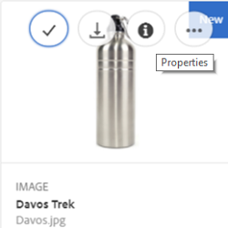
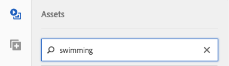

# Manage assets {#manage-assets}

This article describes how to manage and edit assets in Adobe Experience Manager Assets. To manage Content Fragments, see [Content Fragments](content-fragments/content-fragments.md) assets.

## Create folders {#creating-folders}

When organizing a collection of assets, for example, all `Nature` images, you can create folders to keep them together. You can use folders to categorize and organize your assets. [!DNL Experience Manager Assets] does not require you to organize assets in folders to work better.

>[!NOTE]
>
>* Sharing an Assets folder of the type `sling:OrderedFolder`, is not supported when sharing to Marketing Cloud. If you want to share a folder, do not select [!UICONTROL Ordered] when creating a folder.
>* Experience Manager does not allow using `subassets` word as the name of a folder. It is a keyword reserved for node that contain subassets for compound assets

1. Navigate to the place in your digital assets folder where you want to create a new folder. In the menu, click **[!UICONTROL Create]**. Select **[!UICONTROL New Folder]**.
1. In the **[!UICONTROL Title]** field, provide a folder name. By default, DAM uses the title that you provided as the folder name. Once the folder is created, you can override the default and specify another folder name.
1. Click **[!UICONTROL Create]**. Your folder is displayed in the digital assets folder.

The following (space-separated list of) characters are not supported:

* An asset file name cannot contain any of these characters: `* / : [ \\ ] | # % { } ? &`
* An asset folder name cannot contain any of these characters: `* / : [ \\ ] | # % { } ? \" . ^ ; + & \t`

## Upload assets {#uploading-assets}

See [add digital assets to Experience Manager](add-assets.md).

## Detect duplicate assets {#detect-duplicate-assets}

<!-- TBD: This feature may not work as documented. See CQ-4283718. Get PM review done. -->

If a DAM user uploads one or more assets that already exist in the repository, [!DNL Experience Manager] detects the duplication and notifies the user. Duplicate detection is disabled by default as it can have performance impact depending on size of repository and number of assets uploaded. To enable the feature, configure [!UICONTROL Adobe AEM Cloud Asset Duplication Detector]. See [how to do OSGi configurations](https://experienceleague.adobe.com/docs/experience-manager-cloud-service/implementing/deploying/configuring-osgi.html). The duplication detection is based on the unique `dam:sha1` value stored at `jcr:content/metadata/dam:sha1`. It means that duplicate assets are detected even if the filenames are different.


You can add the configuration file `/apps/example/config.author/com.adobe.cq.assetcompute.impl.assetprocessor.AssetDuplicationDetector.cfg.json` in custom code and the file can contain the following:

```json
{
  "enabled":true,
  "detectMetadataField":"dam:sha1"
}
```

Once enabled, Experience Manager sends notifications of duplicate assets to the inbox. It is an aggregated result for multiple duplicates. Users can choose to remove the assets based on the results.


## Preview assets {#previewing-assets}

To preview an asset, follow these steps.

1. From the Assets user interface, navigate to the location of the asset you want to preview.
1. Tap the desired asset to open it.

1. In the preview mode, zoom options are available for [supported Image types](/help/assets/file-format-support.md) (with interactive editing).

   To zoom into an asset, tap/click `+` (or tap/click the magnifying glass on the asset). To zoom out, tap/click `-`. When you zoom in, you can look closely at any area of the image by panning. The reset zoom arrow brings you back to the original view.

   Tap **[!UICONTROL Reset]** to reset the view to the original size.

## Edit properties {#editing-properties}

1. Navigate to the location of the asset whose metadata you want to edit.

1. Select the asset, and tap/click **[!UICONTROL Properties]** from the toolbar to view asset properties. Alternatively, choose the **[!UICONTROL Properties]** quick action on the asset card.

   

1. In the [!UICONTROL Properties] page, edit the metadata properties under various tabs. For example, under the **[!UICONTROL Basic]** tab, edit the title, description, and so on.

   >[!NOTE]
   >
   >The layout of the [!UICONTROL Properties] page and the metadata properties available depend on the underlying metadata schema. To learn how to modify the layout of the [!UICONTROL Properties] page, see [Metadata Schemas](/help/assets/metadata-schemas.md).

1. To schedule a particular date/time for the activation of the asset, use the date picker beside the **[!UICONTROL On Time]** field.

   

1. To deactivate the asset after a particular duration, choose the deactivation date/time from the date picker beside the **[!UICONTROL Off Time]** field. The deactivation date should be later than the activation date for an asset. After the [!UICONTROL Off Time], an asset and its renditions are not available either via the Assets web interface or through the HTTP API.

   

1. In the **[!UICONTROL Tags]** field, select one or more tags. To add a custom tag, type the name of the tag in the box and select the `Enter` key. The new tag is saved in [!DNL Experience Manager].

   YouTube requires Tags to publish and have a link to YouTube (if a suitable link can be found).

   >[!NOTE]
   >
   >To create tags, you must have write permission at `/content/cq:tags/default` path in the CRX repository.

1. Tap/click **[!UICONTROL Save & Close]**.

1. Navigate to the Assets user interface. The edited metadata properties, including title, description, and tags are displayed on the asset card in Card view and under relevant columns in the List view.

<!-- TBD: Uncomment after verification for Dec release.

## View asset usage and references {#usage-and-references}

[!DNL Experience Manager] lets you track statistics about usage of a digital asset. The usage statistics include the following:

    * Number of times the asset was viewed or downloaded
    * Channels/devices through which the asset was used
    * Creative solutions where the asset was recently used

To view usage statistics for an asset, in the [!UICONTROL Properties] page, click the **[!UICONTROL Insights]** tab. For more details, see [Asset Insights](assets-insights.md).

[!DNL Experience Manager] also lets you check all the incoming references to an asset, that is, the usage of an asset in remote [!DNL Sites] and in compound assets. Authors of webpages on [!DNL Experience Manager Sites] deployment can use an asset on a remote [!DNL Assets] deployment using the Connected Assets functionality. The [!UICONTROL References] tab in an asset's [!UICONTROL Properties] page lists the local and remote references of the asset. That is, the use of assets in compound assets in [!DNL Assets] and its use in remote [!DNL Sites] pages.

-->

## Copy assets {#copying-assets}

When you copy an asset or a folder, the entire asset or the folder is copied, along with its content structure. A copied asset or a folder is duplicated at the target location. The asset at the source location is not altered.

A few attributes that are unique to a particular copy of an asset are not carried forward. Some examples are:

* Asset ID, creation date and time, and versions and version history. Some of these properties are indicated by the properties `jcr:uuid`, `jcr:created`, and `cq:name`.

* Creation time and referenced paths are unique for each asset and each of its rendition.

The other properties and metadata information is retained. A partial copy is not created when copying an asset.

1. From the Assets UI, select one or more assets, and then tap/click the **[!UICONTROL Copy]** icon from the toolbar. Alternatively, select the **[!UICONTROL Copy]**  quick action from the asset card.  

   >[!NOTE]
   >
   >If you use the [!UICONTROL Copy] quick action, you can only copy one asset at a time.

1. Navigate to the location where you want to copy the assets.

   >[!NOTE]
   >
   >If you copy an asset at the same location, [!DNL Experience Manager] automatically generates a variation of the name. For example, if you copy an asset titled `Square`, [!DNL Experience Manager] automatically generates the title for its copy as `Square1`.

1. Click the **[!UICONTROL Paste]** asset icon from the toolbar. Assets are copied to this location.

   

   >[!NOTE]
   >
   >The **[!UICONTROL Paste]** icon is available in the toolbar until the paste operation is completed.

### Move or rename assets {#moving-or-renaming-assets}

1. Navigate to the location of the asset you want to move.

1. Select the asset, and tap/click the **[!UICONTROL Move]** icon  from the toolbar.

1. In the Move Assets wizard, do one of the following:

    * Specify the name for the asset after it is moved. Then tap/click **[!UICONTROL Next]** to proceed.

    * Tap/click **[!UICONTROL Cancel]** to stop the process.

   >[!NOTE]
   >
   >* You can specify the same name for the asset if there is no asset with that name at the new location. However, you should use a different name if you move the asset to a location where an asset with the same name exists. If you use the same name, the system automatically generates a variation of the name. For example if your asset has the name Square, the system generates the name Square1 for its copy.
   >* When renaming, whitespace is not allowed in the file name.

1. On the **[!UICONTROL Select Destination]** dialog, do one of the following:

    * Navigate to the new location for the assets, and then tap/click **[!UICONTROL Next]** to proceed.

    * Tap/click **[!UICONTROL Back]** to return to the **[!UICONTROL Rename]** screen.

1. If the assets being moved have any referencing pages, assets, or collections, the **[!UICONTROL Adjust References]** tab appears beside the **[!UICONTROL Select Destination]** tab.

   Do one of the following in the **[!UICONTROL Adjust References]** screen:

    * Specify the references to be adjusted based on the new details, and then tap/click **[!UICONTROL Move]** to proceed.

    * From the **[!UICONTROL Adjust]** column, select/unselect references to the assets.
    * Tap/click **[!UICONTROL Back]** to return to the **[!UICONTROL Select Destination]** screen.

    * Tap/click **[!UICONTROL Cancel]** to stop the move operation.

   If you do not update references, they continue to point to the previous path of the asset. If you adjust the references, they are updated to the new asset path.

### Manage renditions {#managing-renditions}

1. You can add or remove renditions for an asset, except the original. Navigate to the location of the asset for which you want to add or remove renditions.

1. Tap/click the asset to open its asset page.

   

1. Tap/click the GlobalNav icon, and select **[!UICONTROL Renditions]** from the list.

   

1. In the **[!UICONTROL Renditions]** panel, view the list of renditions generated for the asset.

   

   >[!NOTE]
   >
   >By default, [!DNL Experience Manager Assets] does not display the original rendition of the asset in the preview mode. If you are an administrator, you can use overlays to configure [!DNL Assets] to display original renditions in the preview mode.

1. Select a rendition to either view or delete the rendition.

   **Deleting a rendition**

   Select a rendition from the **[!UICONTROL Renditions]** panel, and then tap/click the **[!UICONTROL Delete Rendition]** icon from the toolbar. Renditions cannot be deleted in bulk after asset processing is complete. For individual assets, you can remove renditions manually from the user interface. For multiple assets, you can customize [!DNL Experience Manager] to delete either specific renditions or delete the assets and re-upload the deleted assets.

   

   **Uploading a new rendition**

   Navigate to the asset details page for the asset, and tap/click the **[!UICONTROL Add Rendition]** icon in the toolbar to upload a new rendition for the asset.

   

   >[!NOTE]
   >
   >If you select a rendition from the **[!UICONTROL Renditions]** panel, the toolbar changes context and displays only those actions that are relevant to the rendition. Options, such as the Upload Rendition icon is not displayed. To view these options in the toolbar, navigate to the details page for the asset.

   You can configure the dimensions for the rendition you want displayed in the details page of an image or video asset. Based on the dimensions you specify, Assets displays the rendition with the exact or closest dimensions.

   To configure rendition dimensions of an image at the asset detail level, overlay the `renditionpicker` node (`libs/dam/gui/content/assets/assetpage/jcr:content/body/content/content/items/assetdetail/items/col1/items/assetview/renditionpicker`) and configure the value of the width property. Configure the property **[!UICONTROL size (Long) in KB]** in place of width to customize rendition on asset detail page based on image size. For size-based customization, the property `preferOriginal` assigns preference to the original if the size of the matched rendition is greater than the original.

   Similarly, you can customize the Annotation page image by overlaying `libs/dam/gui/content/assets/annotate/jcr:content/body/content/content/items/content/renditionpicker`.

   

   To configure rendition dimensions for a video asset, navigate to the `videopicker` node in the CRX repository at the location `/libs/dam/gui/content/assets/assetpage/jcr:content/body/content/content/items/assetdetail/items/col1/items/assetview/videopicker`, overlay the node, and then edit the appropriate property.

   >[!NOTE]
   >
   >Video annotations are supported only on browsers with HTML5 compatible video formats. In addition, depending on the browser, different video formats are supported.

## Delete assets {#delete-assets}

To resolve or remove the incoming references from other pages, update the relevant references before deleting an asset.

Also, disable the force delete button using an overlay, to disallow users from deleting referenced assets and leaving broken links.

1. Navigate to the location of the asset(s) you want to delete.

1. Select the asset, and tap/click the **[!UICONTROL Delete]** icon from the toolbar.

   

1. In the confirmation dialog, click:

    * **[!UICONTROL Cancel]** to stop the action
    * **[!UICONTROL Delete]** to confirm the action:

        * If the asset has no references, the asset is deleted.
        * If the asset has references, an error-message informs you that **One or more assets are referenced.** You can select **[!UICONTROL Force Delete]** or **[!UICONTROL Cancel]**.

   >[!NOTE]
   >
   >You require delete permissions on dam/asset to be able to delete an asset. If you only have modify permissions, you can only edit the asset metadata and add annotations to the asset. However, you cannot delete the asset or its metadata.

   >[!NOTE]
   >
   >To resolve or remove the incoming references from other pages, update the relevant references before deleting an asset.
   >
   >
   >Also, disable the force delete button using an overlay, to disallow users from deleting referenced assets and leaving broken links.

## Download assets {#download-assets}

See [Download assets from [!DNL Experience Manager]](/help/assets/download-assets-from-aem.md).

## Publish assets {#publish-assets}

<!--
>[!NOTE]
>
>For more information specific to Dynamic Media, see [Publishing Dynamic Media Assets.](/help/assets/dynamic-media/publishing-dynamicmedia-assets.md)
-->

1. Navigate to the location of the assets/folder you want to publish.

1. Either select the **[!UICONTROL Publish]** quick action from the asset card, or select the asset and tap/click the **[!UICONTROL Quick Publish]** icon from the toolbar.
1. If the asset references other assets, its references are listed in the wizard. Only references that are either unpublished or modified since they were last published/unpublished are displayed. Choose the references you want to publish.

   

   >[!NOTE]
   >
   >If the folder you want to publish includes an empty folder, the empty folder is not published.

1. Tap/click **[!UICONTROL Publish]** to confirm the activation for the assets.

>[!CAUTION]
>
>If you publish an assets that is being processed, only the original content is published. The renditions are missing. Either wait for processing to complete and then publish or re-publish the asset once the processing completes.

## Unpublish assets {#unpublishing-assets}

1. Navigate to the location of the asset/asset folder you want to remove from the publish environment (unpublish).

1. Select the asset/folder to unpublish, and tap/click the **[!UICONTROL Manage Publication]** icon from the toolbar.

   

1. Select the **[!UICONTROL Unpublish]** action from the list.

   

1. To unpublish the asset later, select **[!UICONTROL Unpublish Later]**, and then select a date for unpublishing the asset.
1. Schedule a date for the asset to be unavailable from the publish environment.
1. If the asset references other assets, choose the references you want to unpublish. Tap/click **[!UICONTROL Unpublish]**.
1. In the confirmation dialog, tap/click:

    * **[!UICONTROL Cancel]** to stop the action
    * **[!UICONTROL Unpublish]** to confirm that the assets are unpublished (no longer available on the publish environment) at the specified date.

   >[!NOTE]
   >
   >When un-publishing a complex asset, unpublish the asset only. Avoid un-publishing the references because they may be referenced by other published assets.

## Closed user group {#closed-user-group}

A closed user group (CUG) is used to limit access to specific asset folders published from [!DNL Experience Manager]. If you create a CUG for a folder, access to the folder (including folder assets and subfolders) is restricted to assigned members or groups only. To access the folder, they must log in using their security credentials.

CUGs are an extra way to restrict access to your assets. You can also configure a login page for the folder.

1. Select a folder from the Assets UI, and tap/click the Properties icon from the toolbar to display the properties page.
1. From the **[!UICONTROL Permissions]** tab, add members or groups under **[!UICONTROL Closed User Group]**.

   

1. To display a login screen when users access the folder, select the **[!UICONTROL Enable]** option. Then, select the path to a login page in [!DNL Experience Manager], and save the changes.

   

   >[!NOTE]
   >
   >If you do not specify the path to a login page, [!DNL Experience Manager] displays the default login page in the publish instance.

1. Publish the folder, and then try accessing it from the publish instance. A login screen is displayed.
1. If you are a CUG member, enter your security credentials. The folder is displayed after [!DNL Experience Manager] authenticates you.

## Search assets {#search-assets}

Searching assets is central to the usage of a digital asset management system -- be it for further use by creatives, for robust management of assets by the business users and marketers, or for administration by DAM administrators.

For simple, advanced, and custom searches to discover and use the most appropriate assets, see [search assets in [!DNL Experience Manager]](/help/assets/search-assets.md).

## Quick actions {#quick-actions}

Quick action icons are available for a single asset at a time. Depending upon your device, perform the following actions to display the quick action icons:

* Touch devices: Touch and hold. For example, on an iPad, you can tap-and-hold an asset so that the quick actions display.
* Non-touch devices: Hover pointer. For example, On a desktop device, the quick action bar is displayed if you hover the pointer over the asset thumbnail.

## Edit images {#editing-images}

The editing tools in the [!DNL Experience Manager Assets] interface let you perform small editing jobs on image assets. You can crop, rotate, flip, and perform other editing jobs on images. You can also add image maps to assets.

>[!NOTE]
>
>For some components, the Full Screen mode has additional options available.

1. Do one of the following to open an asset in edit mode:

    * Select the asset and then click/tap the **[!UICONTROL Edit]** icon in the toolbar.
    * Tap/click the **[!UICONTROL Edit]** icon that appears on an asset in the Card view.
    * In the asset page, tap/click the **[!UICONTROL Edit]** icon in the toolbar.

   

1. To crop the image, tap/click the **Crop** icon.

   

1. Select the desired option from the list. The crop area appears on the image based on the option you choose. The **Free Hand** option lets you crop the image without any aspect ratio restrictions.

   

1. Select the area to be cropped, and resize or reposition it on the image.
1. Use the **Finish** icon (top right corner) to crop the image. Clicking the **Finish** icon also triggers the regeneration of renditions.

   

1. Use the **Undo** and **Redo** icons on the top right to revert to the uncropped image or retain the cropped image, respectively.

   

1. Tap/click the appropriate Rotate icon to rotate the image clockwise or anti-clockwise.

   

1. Tap/click the appropriate Flip icon to flip the image horizontally or vertically.

   

1. Tap/click the **Finish** icon to save the changes.

   

>[!NOTE]
>
>Image editing is supported for BMP, GIF, PNG, and JPEG files formats.

<!-- You can also add image maps using the image editor. For details, see [Adding Image Maps](/help/assets/image-maps.md). -->

>[!NOTE]
>
>To edit a TXT file, set **Day CQ Link Externalizer** from Configuration Manager.

## Timeline {#timeline}

The timeline lets you view various events for a selected item, such as active workflows for an asset, comments/annotations, activity logs, and versions.


*Figure: Sort timeline entries for an asset*

>[!NOTE]
>
>In the [Collections console](/help/assets/manage-collections.md#navigate-the-collections-console), the **[!UICONTROL Show All]** list provides options to view comments and workflows only. Moreover, the timeline is displayed only for top-level collections that are listed in the console. It is not displayed if you navigate inside any of the collections.

>[!NOTE]
>
>Timeline contains several [options specific to content fragments](content-fragments/content-fragments.md).

## Annotating {#annotating}

Annotations are comments or explanatory notes added to images or videos. Annotations provide marketers the ability to collaborate and leave feedback about assets.

Video annotations are only supported on browsers with HTML5-compatible video formats. Video formats that Assets supports depend on the browser.

>[!NOTE]
>
>For Content Fragments, [annotations are created in the fragment editor](content-fragments/content-fragments.md).

1. Navigate to the location of the asset to which you want to add annotations.
1. Tap/click the **[!UICONTROL Annotate]** icon from one of the following:

    * [Quick actions](#quick-actions)
    * From the toolbar after selecting the asset or navigating to the asset page

   

1. Add a comment in the **[!UICONTROL Comment]** box at the bottom of the timeline. Alternatively, mark up an area on the image and add an annotation in the **[!UICONTROL Add Annotation]** dialog.

   

<!--
1. To notify a user about an annotation, specify the email address of the user and add the comment. For example, to notify Aaron MacDonald about an annotation, enter @aa. Hints for all matching users is displayed in a list. Select Aaron's email address from the list to tag her with the comment. Similarly, you can tag more users anywhere within the annotation or before or after it.
-->

   >[!NOTE]
   >
   >For a non-administrator user, suggestions appear only if the user has Read permissions at `/home` in CRXDE.

   

1. After adding the annotation, click **[!UICONTROL Add]** to save it. A notification for the annotation is sent to Aaron.

   

   >[!NOTE]
   >
   >You can add multiple annotations, before you save them.

1. Tap/click **[!UICONTROL Close]** to exit from the Annotation mode.
1. To view the notification, log in to Assets with Aaron MacDonald's credentials and click the **[!UICONTROL Notifications]** icon to view the notification.

   >[!NOTE]
   >
   >Annotations can also be added to video assets. While annotating videos, the player pauses to let you annotate on a frame. For details, see [managing video assets](manage-video-assets.md).

1. To choose a different color so you can differentiate between users, click/tap the Profile icon and click/tap **[!UICONTROL My Preferences]**.

   

   Specify the desired color in the **[!UICONTROL Annotation Color]** box and then click/tap **[!UICONTROL Accept]**.

   

>[!NOTE]
>
>You can also add annotations to a collection. However, if a collection contains child collections, you can add annotations/comments to the parent collection only. The Annotate option is not available for child collections.

### View saved annotations {#viewing-saved-annotations}

1. To view saved annotations for an asset, navigate to the location of the asset and open the asset page for the asset.

1. Tap/click the GlobalNav icon, and choose **[!UICONTROL Timeline]** from the list.

   

1. From the **[!UICONTROL Show All]** list in the timeline, select **[!UICONTROL Comments]** to filter the results based on annotations.

   

   Tap/click a comment in the **[!UICONTROL Timeline]** panel to view the corresponding annotation on the image.

   

   Tap/click **[!UICONTROL Delete]**, to delete a particular comment.

### Print annotations {#printing-annotations}

If an asset has annotations or it has been subjected to a review workflow, you can print the asset along with annotations and review status as a PDF file for offline review.

You can also choose to print only the annotations or review status.

To print the annotations and review status, tap/click the **[!UICONTROL Print]** icon and follow the instructions in the wizard. The **[!UICONTROL Print]** icon appears in the toolbar only when the asset has at least one annotation or review status assigned to it.

1. From the Assets UI, open the preview page for an asset.
1. Do one of the following:

    * To print all the annotations and the review status, skip step 3 and directly go to step 4.
    * To print specific annotations and review status, open the [timeline](/help/assets/manage-digital-assets.md#timeline) and then go to step 3.

1. To print specific annotations, select the annotations from the timeline.

   

   To print the review status only, select it from the timeline.

   

1. Tap/click the **[!UICONTROL Print]** icon from the toolbar.

   

1. From the Print dialog, choose the position you want the annotations/review status to be displayed on the PDF. For example, if you want the annotations/status to be printed at the top-right of the page that contains the printed image, use the **Top-Left** setting. It is selected by default.

   

   You can choose other settings depending on the position where you want the annotations/status to appear in the printed PDF. If you want the annotations/status to appear in a page that is separate from the printed asset, choose **[!UICONTROL Next Page]**.

1. Click **[!UICONTROL Print]**. Depending upon the option you choose in step 2, the generated PDF displays the annotations/status at the specified position. For example, if you choose to print both annotations and the review status using the **Top-Left** setting, the generated output resembles the PDF file depicted here.

   

1. Download or print the PDF using the options at the top-right.

   

   To modify the appearance of the rendered PDF file, for example the font color, size, and style, background color of the comments and statuses, open the **[!UICONTROL Annotation PDF configuration]** from Configuration Manager, and modify the desired options. For example, to change the display color of the approved status, modify the color code in the corresponding field. For information around changing the font color of annotations, see [Annotating](/help/assets/manage-digital-assets.md#annotating).

   

   Return to the rendered PDF file and refresh it. The refreshed PDF reflects the changes you made.

## Asset versioning {#asset-versioning}

Versioning creates a snapshot of digital assets at a specific point in time. Versioning helps restore assets to a previous state at a later time. For example, if you want to undo a change that you made to an asset, restore the unedited version of the asset.

The following are scenarios where you create versions:

* You modify an image in a different application and upload to Assets. A version of the image is created so your original image is not overwritten.
* You edit the metadata of an asset.
* You use [!DNL Experience Manager] desktop app to checkout an existing asset and save your changes. A new version is created every time the asset is saved.

You can also enable automatic versioning through a workflow. When you create a version for an asset, the metadata and renditions are saved along with the version. Renditions are rendered alternatives of the same images, for example, a PNG rendition of an uploaded JPEG file.

The versioning functionality lets you do the following:

* Create a version of an asset.
* View the current revision for an asset.
* Restore the asset to a previous version.

1. Navigate to the location of the asset for which you want to create a version, and tap/click it to open its asset page.

1. Tap/click the GlobalNav icon, and the choose **[!UICONTROL Timeline]** from the menu.

   

1. Tap/click the **[!UICONTROL Actions]** (arrow) icon at the bottom to view the available actions you can perform on the asset.

   

1. Tap/click **[!UICONTROL Save as Version]** to create a version for the asset.

   

1. Add a label and comment, and then click **[!UICONTROL Create]** to create a version. Alternatively, tap/click **Cancel** to exit the operation.

   

1. To view the new version, open the **[!UICONTROL Show All]** list in the timeline from the asset details page or the Assets UI, and choose **[!UICONTROL Versions]**. All versions created for an asset are listed under the timeline tab. You can filter the list to show Versions, by clicking the drop arrow and selecting **[!UICONTROL Versions]** from the list.

   

1. Select a specific version for the asset to preview it or enable it to appear in the Assets UI.

   

1. Add a label and comment for the version to revert to the particular version in the Assets UI.

   

1. To generate a preview for the version, tap/click **[!UICONTROL Preview Version]**.
1. To display this version in the Assets UI, select **[!UICONTROL Revert to this Version]**.
1. To compare between two versions, go to asset page of the asset and tap/click the version to be compared with the current version.

   

1. From the timeline, select the version you want to compare and drag the slider to the left to superimpose this version over the current version and compare.

   

### Starte a workflow on an asset {#starting-a-workflow-on-an-asset}

1. Navigate to the location of the asset for which you want to start a workflow, and tap/click the asset to open the asset page.
1. Tap/click the GlobalNav icon, and the choose **[!UICONTROL Timeline]** from the menu to display the timeline.

   

1. Tap/click the **[!UICONTROL Actions]** (arrow) icon at the bottom to open the list of actions available for the asset.

   

1. Tap/click **[!UICONTROL Start Workflow]** from the list.

   

1. In the **[!UICONTROL Start Workflow]** dialog, select a workflow model from the list.

   

1. (Optional) Specify a title for the workflow, which can be used to reference the workflow instance.

   

1. Tap/click **[!UICONTROL Start]** and then tap/click **[!UICONTROL Proceed]** in the dialog to confirm. Each step of workflow is displayed in the timeline as an event.

   

## Collections {#collections}

A collection is an ordered set of assets. Use collections to share assets between users.

* A collection can include assets from different locations because they only contain references to these assets. Each collection maintains the referential integrity of assets.
* You can share collections with multiple users with different privilege levels, including editing, viewing, and so on.

See [Managing Collections](/help/assets/manage-collections.md) for details on collection management.
