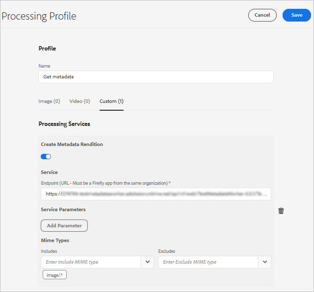

# Manage metadata of your digital assets {#managing-metadata-for-digital-assets}

| [Search Best Practices](/help/assets/search-best-practices.md) |[Metadata Best Practices](/help/assets/metadata-best-practices.md)|[Content Hub](/help/assets/product-overview.md)|[Dynamic Media with OpenAPI capabilities](/help/assets/dynamic-media-open-apis-overview.md)|[AEM Assets developer documentation](https://developer.adobe.com/experience-cloud/experience-manager-apis/)|
| ------------- | --------------------------- |---------|----|-----|

| Version | Article link |
| -------- | ---------------------------- |
| AEM 6.5  |    [Click here](https://experienceleague.adobe.com/docs/experience-manager-65/assets/using/metadata.html?lang=en)                  |
| AEM as a Cloud Service     | This article         |

[!DNL Adobe Experience Manager Assets] keeps metadata for every asset. It allows easier categorization and organization of assets and it helps people who are looking for a specific asset. With the ability to extract metadata from files uploaded to [!DNL Experience Manager Assets], metadata management integrates with the creative workflow. With the ability to keep and manage metadata with your assets, you can automatically organize and process assets based on their metadata.

<!-- 
* [Metadata Schemata Reference](meta-ref.md)
-->

## Why we need metadata {#why-metadata}

Metadata means data about data. In this regard, data refers to your digital asset, say an image. Metadata is critical for efficient asset management.

Metadata is the collection of all the data available for an asset but that is not necessarily contained in that image. Some examples of metadata are:

* Name of the asset.
* Time and date of last modification.
* Size of the asset as it was stored in the repository.
* Name of the folder it is contained in.
* Related assets or applied tags.

The above are the basic metadata properties that [!DNL Experience Manager] can manage for assets, which allows users to see all assets. For example, ordering assets by last modification date is useful when trying to discover recently added or modified assets.

You can add more high-level data to digital assets, for example:

* Type of asset (is it an image, a video, an audio clip, or a document?).
* Owner of the asset.
* Title of the asset.
* Description of the asset.
* Tags assigned to an asset.

More metadata helps you further categorize assets and is helpful as the amount of digital information grows. It is possible to manage a few hundred files based on just the filenames. However, this approach is not scalable. It falls short when the number of people involved and the number of assets managed increase.

With the addition of metadata, the value of a digital asset grows, because the asset becomes,

* More accessible - systems and users can find it easily.
* Easier to manage - you can find assets with the same set of properties easier and apply changes to them.
* Complete - asset carries more information and context with more metadata.

For these reasons, [!DNL Assets] provides you with the right means of creating, managing, and exchanging metadata for your digital assets.

## Types of metadata {#types-of-metadata}

Metadata is classified as Technical, Informational, and Administrative metadata.

### Technical metadata

Technical metadata focuses on the technical aspects of digital assets, providing crucial information related to:

* File size
* Format
* Resolution
* Dimensions
* Color mode

This type of metadata helps users understand and efficiently use digital assets.

### Informational metadata

Informational metadata provides descriptive information to enhance content understanding, aiding in content discovery and searchability. It includes keywords, captions, and descriptions.  For example, when managing a video in Experience Manager Assets, we can include the following informational metadata:

* **Keywords**: Marketing, Product launch, Promo
* **Caption**: Introducing our latest product with exciting features
* **Description**: A detailed overview of the video content.

### Administrative metadata

Administrative metadata deals with the managerial aspects of digital assets. It ensures access control, compliance, and managing the overall lifecycle of assets within the digital asset management system. It includes information related to:

* Asset ownership
* Usage rights
* Permissions
* Other administrative details

This metadata type ensures effective asset management, access control, and compliance.

<!-- Learn more about [metadata best practices](metadata-best-practices.md) to manage your digital assets effectively. -->

<!-- The two basic types of metadata are technical metadata and descriptive metadata.

Technical metadata is useful for software applications that are dealing with digital assets and should not be maintained manually. [!DNL Experience Manager Assets] and other software automatically determine technical metadata and the metadata may change when the asset is modified. The available technical metadata of an asset depends largely on the file type of the asset. Some examples of technical metadata are:

* Size of a file.
* Dimensions (height and width) of an image.
* Bit rate of an audio or video file.
* Resolution (level of detail) of an image.

Descriptive metadata is metadata concerned with the application domain, for example, the business that an asset is coming from. Descriptive metadata cannot be determined automatically. It is created manually or semi-automatically. For example, a GPS-enabled camera can automatically track the latitude and longitude and add geotag the image.

The cost of manually creating descriptive metadata information is high. So, standards are established to ease the exchange of metadata across software systems and organizations. [!DNL Experience Manager Assets] supports all relevant standards for metadata management. -->

## Metadata and Last Modification {#last-modification}

The last modified date of an asset reflects the last time the original file for an asset is modified. As a result, the modification date and user only change when:

* A new version of the asset is uploaded
* An asset is reprocessed

The last modification date and user does not change:

* When an asset is moved or renamed
* When an asset is checkedout, checkedin or version
* When an asset is published or unpublished
* On metadata updates
* Reference or collection updates

## Encoding standards {#encoding-standards}

There are various ways to embed metadata in files. A selection of encoding standards are supported:

* XMP: used by [!DNL Assets] to store the extracted metadata within the repository.
* ID3: for audio and video files.
* Exif: for image files.
* Other/Legacy: from [!DNL Microsoft Word], [!DNL PowerPoint], [!DNL Excel], and so on.

### XMP {#xmp}

[!DNL Extensible Metadata Platform] (XMP) is an open standard that is used by [!DNL Experience Manager Assets] for all metadata management. The standard offers universal metadata encoding that can be embedded into all file formats. Adobe and other companies support XMP standard as it provides a rich content model. Users of XMP standard and of [!DNL Experience Manager Assets] have a powerful platform to build upon. For more information, see [XMP](https://www.adobe.com/products/xmp.html).

### ID3 {#id}

Data stored in these ID3 tags is displayed when you play back a digital audio file on either your computer or a portable MP3 player.

ID3 tags are designed for the MP3 file format. Additional information on formats:

* ID3 tags work in MP3 and mp3PRO files.
* WAV has no tags.
* WMA has proprietary tags that do not allow open-source implementation.
* Ogg Vorbis uses Xiph Comments embedded in the Ogg container.
* AAC uses a proprietary tagging format.

### Exif {#exif}

Exchangeable image file format (Exif) is the most popular metadata format used in digital photography. It provides a way of embedding a fixed vocabulary of metadata properties in many file formats, such as JPEG, TIFF, RIFF, and WAV. Exif stores metadata as pairs of a metadata name and a metadata value. These metadata name-value-pairs are also called tags, not to be confused with the tagging in [!DNL Experience Manager]. Modern digital cameras create Exif metadata and modern graphics software support it. Exif format is the lowest common denominator for metadata management especially for images.

A major limitation of Exif is that a few popular image file formats such as BMP, GIF, or PNG do not support it.

Metadata fields defined by Exif are typically technical in nature and are of limited use for descriptive metadata management. For this reason, [!DNL Experience Manager Assets] offers mapping of Exif properties into [common metadata schemata](metadata-schemas.md) and into XMP.

#### Other metadata {#other-metadata}

Other metadata that can be embedded from files include [!DNL Microsoft Word], [!DNL PowerPoint], [!DNL Excel], and so on.

## Manage metadata of your digital assets {#manage-assets-metadata}

Enterprise Manager Assets lets you edit the metadata of multiple assets simultaneously so you can quickly propagate common metadata changes to assets in bulk. Use the [!UICONTROL Properties] page to change metadata properties to a common value or add or modify tags. To customize the metadata Properties page, including adding, modifying, deleting metadata properties, use the Schema editor.

>[!NOTE]
>
>The bulk editing methods work for assets available in a folder or a collection. For the assets that are available across folders or match a common criteria, it is possible to [bulk update the metadata after searching](/help/assets/search-assets.md#metadata-updates).

1. Navigate to the location of the assets that you want to edit.
1. Select the assets for which you want to edit common properties.
1. From the toolbar, select **[!UICONTROL Properties]** to open the [!UICONTROL Properties] page for the selected assets.

   >[!NOTE]
   >
   >When you select multiple assets, the lowest common parent form is selected for the assets. In other words, the [!UICONTROL Properties] page only displays metadata fields that are common across the [!UICONTROL Properties] pages of all the individual assets.

1. Modify the metadata properties for selected assets under the various tabs.
1. To view the metadata editor for a specific asset, cancel the selection of the remaining assets in the list. The metadata editor fields are populated with the metadata for the particular asset.

   >[!NOTE]
   >
   >* In the [!UICONTROL Properties] page, you can remove assets from the asset list by canceling the selection. The asset list has all the assets selected by default. The metadata for assets that you remove from the list is not updated.
   >* At the top of assets list, select the check box near **[!UICONTROL Title]** to toggle between selecting the assets and clearing the list.

1. To select a different metadata schema for the assets, select **[!UICONTROL Settings]** from the toolbar, and select the desired schema. Save the changes.
1. To append the new metadata with the existing metadata in fields that contain multiple values, select **[!UICONTROL Append mode]**. If you do not select this option, the new metadata replaces the existing metadata in the fields. Select **[!UICONTROL Submit]**.

   >[!CAUTION]
   >
   >For single-value fields, the new metadata is not appended to the existing value in the field even if you select **[!UICONTROL Append mode]**.

## Custom metadata using processing profile {#metadata-compute-service}

Assets as a [!DNL Cloud Service] can generate custom metadata for an asset using cloud-native services. Configure a processing profile to generate custom metadata. See [how to use processing profile](/help/assets/asset-microservices-configure-and-use.md#use-profiles).

>[!TIP]
>
>Only one processing profile can be applied to a folder. To apply multiple processing to assets in a folder, add more options to a single processing profile. For example, a single profile can generate renditions, transcode assets, generate custom metadata, and so on. You can apply MIME type filters for each task so that the appropriate task is triggered for the required file format.

<!-- TBD: Commenting as Web Console is not available. Document the appropriate OSGi config method if available in CS.

## Configure limit for bulk metadata update {#configlimit}

To prevent DOS-like situation, [!DNL Experience Manager] limits the number of parameters supported in a Sling request. When updating metadata of many assets in one go, you may reach the limit and the metadata does not get updated for more assets. [!DNL Experience Manager] generates the following warning in the logs:

`org.apache.sling.engine.impl.parameters.Util Too many name/value pairs, stopped processing after 10000 entries`

To change the limit, access Web Console ( **[!UICONTROL Tools]** > **[!UICONTROL Operations]** > **[!UICONTROL Web Console]**) and change the value of **[!UICONTROL Maximum POST Parameters]** in **[!UICONTROL Apache Sling Request Parameter Handling]** OSGi configuration.
-->

## Metadata schemata {#metadata-schemata}

Metadata schemas are predefined sets of metadata property definitions that can be used in various applications. Properties are always associated with an asset, meaning that the properties are 'about' the resource.

You can also design your own metadata schemata if none exists that meet your needs. Do not duplicate existing information. Within an organization, separating schemata makes it easier to share metadata. [!DNL Experience Manager] provides you with a default list of the most popular metadata schemata. The list helps you to jumpstart your metadata strategy and quickly pick the metadata properties that you need.

The supported metadata schemata supported are listed below.

### Standard metadata {#standard-metadata}

* DC - [!DNL Dublin Core] is an important and widely used set of metadata.
* DICOM - Digital Imaging and Communications in Medicine.
* `Iptc4xmpCore` and `iptc4xmpExt` - International Press Communications Standard contains many subject-specific metadata.
* RDF - Resource Description Framework - for generic semantic web metadata.
* XMP - [!DNL Extensible Metadata Platform].
* `xmpBJ` - Basic Job Ticketing.

### Application-specific metadata {#application-specific-metadata}

The application-specific metadata includes technical and descriptive metadata. If you use such metadata, other applications may not be able to use the metadata. For example, a different image-rendering application may not be able to access [!DNL Adobe Photoshop] metadata. You can create a workflow step that changes an application-specific property to a standard property.

* ACDSee - Metadata managed by the [!DNL ACDSee] program. See [www.acdsee.com/](https://www.acdsee.com/).
* Album - [!DNL Adobe Photoshop Album].
* CQ - Used by [!DNL Experience Manager Assets].
* DAM - Used by [!DNL Experience Manager Assets].
* DEX - [Optima SC Description explorer](https://www.optimasc.com/products/dex/index.html) is a collection of tools for metadata and file management for Windows operating systems.
* CRS - [Adobe Photoshop Camera Raw](https://helpx.adobe.com/camera-raw/using/introduction-camera-raw.html).
* LR - [!DNL Adobe Lightroom].
* MediaPro - [iView MediaPro](https://en.wikipedia.org/wiki/Phase_One_Media_Pro).
* MicrosoftPhoto and MP - Microsoft Photo.
* PDF and PDF/X.
* Photoshop and psAux - [!DNL Adobe Photoshop].

### Digital Rights Management metadata {#digital-rights-management-metadata}

* CC - [!DNL Creative Commons].
* [!DNL XMPRights].
* PLUS - [Picture Licensing Universal System](https://www.useplus.com).
<!--THIS LINK IS 404 WITH NO SUITABLE REPLACEMENT * PRISM - [Publishing Requirements for Industry Standard Metadata](https://www.idealliance.org/prism-metadata). -->
* PRL - PRISM Rights Language.
* PUR - PRISM Usage Rights.
* `xmpPlus` - Integration of PLUS with XMP.

### Photography-specific metadata {#photography-specific-metadata}

* Exif - Technical information from camera, including GPS position.
* CRS - [!DNL Camera Raw] schema.
* `iptc4xmpCore` and `iptc4xmpExt`.
* TIFF - image metadata (not only for TIFF images).

### Print-specific metadata {#print-specific-metadata}

* PDF and PDF/X - Adobe PDF and third-party applications.
<!--THIS LINK IS 404 WITH NO SUITABLE REPLACEMENT * PRISM - [Publishing Requirements for Industry Standard Metadata](https://www.idealliance.org/prism-metadata). -->
* XMP - [!DNL Extensible Metadata Platform].
* `xmpPG` - XMP metadata for paged text.

### Multimedia-specific metadata {#multimedia-specific-metadata}

* `xmpDM` - [!DNL Dynamic Media].
* `xmpMM` - Media Management.

## Metadata-driven workflows {#metadata-driven-workflows}

Creating metadata-driven workflows help you automate some processes, which improves efficiency. In a metadata-driven workflow, the workflow management system reads the workflow and as a result performs some pre-defined action. For example, some of the ways you could use metadata-driven workflows:

* The workflow can check whether an image has a title or not. If it does not, the system notifies to add a title.
* The workflow can check whether a copyright notice on an asset allows for distribution or not. So, the system sends the asset to one server or the other.
* A workflow can check for assets without pre-defined, mandatory metadata or assets with *invalid* metadata.

**See also**

* [Translate Assets](translate-assets.md)
* [Assets HTTP API](mac-api-assets.md)
* [Assets supported file formats](file-format-support.md)
* [Search assets](search-assets.md)
* [Connected assets](use-assets-across-connected-assets-instances.md)
* [Asset reports](asset-reports.md)
* [Metadata schemas](metadata-schemas.md)
* [Download assets](download-assets-from-aem.md)
* [Search facets](search-facets.md)
* [Manage collections](manage-collections.md)
* [Bulk metadata import](metadata-import-export.md)
* [Publish Assets to AEM and Dynamic Media](/help/assets/publish-assets-to-aem-and-dm.md)

>[!MORELIKETHIS]
>
>* [XMP metadata](xmp-metadata.md)
>* [How to edit or add metadata](meta-edit.md)
