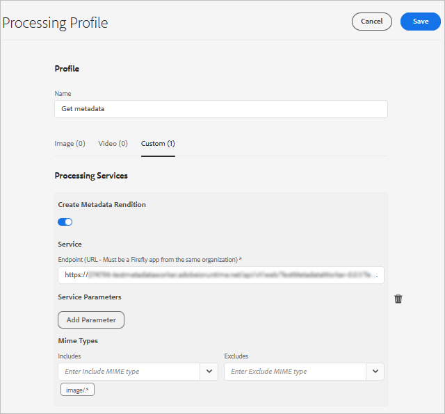

# Manage metadata of your digital assets {#managing-metadata-for-digital-assets}

| Version | Article link |
| -------- | ---------------------------- |
| AEM 6.5  |    [Click here](https://experienceleague.adobe.com/docs/experience-manager-65/assets/using/metadata.html?lang=en)                  |
| AEM as a [!DNL Cloud Service]     | This article         |

**Adobe [!DNL Experience Manager] (AEM) [!DNL Assets] stores metadata for every asset it manages.** **Metadata** is the descriptive, structured information attached to a digital file — details such as its title, description, keywords, format, author, usage rights, and creation data — that describes what the asset is and how it can be used. As widely recognized in digital asset management (DAM), metadata is the foundation that makes large asset libraries searchable, organized, and usable at scale.

## What Metadata Does in [!DNL Experience Manager Assets]

[!DNL Experience Manager Assets] uses metadata to make categorization and organization straightforward and to help people locate a specific asset quickly. Because [!DNL Experience Manager Assets] can **extract metadata** directly from files as they are uploaded, **metadata management integrates with the creative workflow** rather than existing as a separate, manual step. This tight integration means metadata is captured at the source, reducing the need for teams to key in information by hand.

## Benefits of Metadata Management

Storing and managing metadata alongside your assets delivers several practical advantages:

- **Faster categorization and organization** — Metadata classifies assets consistently, so teams can group, tag, and structure their libraries in a repeatable way.
- **Improved discoverability** — Rich metadata helps people who are searching for a specific asset find it faster, because assets can be located by their descriptive attributes rather than by filename alone.
- **Metadata extraction on upload** — [!DNL Experience Manager Assets] automatically pulls embedded metadata from uploaded files, keeping the creative workflow efficient and connected.
- **Automated organization and processing** — With metadata kept and managed with your assets, you can automatically organize and process assets based on their metadata. This enables workflows to route, transform, or publish assets according to their descriptive attributes, because the system can act on the values metadata contains without manual intervention.

Together, these capabilities establish metadata as the connective layer between how assets are created, how they are stored, and how they are found and reused across an organization.

<!-- 
* [Metadata Schemata Reference](meta-ref.md)
-->

## Why we need metadata {#why-metadata}

**Metadata is data about data** — descriptive information that identifies, categorizes, and adds context to a digital asset, such as an image, video, or document. **Metadata is critical for efficient digital asset management**, because it makes assets discoverable, manageable, and meaningful at scale.

Metadata is the collection of all the data available for an asset that is not necessarily contained within the asset file itself. Common examples of metadata include:

* **Name** of the asset.
* **Time and date of last modification.**
* **Size** of the asset as it was stored in the repository.
* **Name of the folder** it is contained in.
* **Related assets or applied tags.**

These are the basic metadata properties that Adobe [!DNL Experience Manager] can manage within a digital asset management (DAM) system, allowing users to view and organize all assets. For example, ordering assets by last modification date helps you quickly discover recently added or modified assets, because the metadata records exactly when each change occurred and lets the system sort on that value.

You can add more high-level, descriptive metadata to digital assets, including:

* **Type of asset** — whether it is an image, a video, an audio clip, or a document.
* **Owner** of the asset.
* **Title** of the asset.
* **Description** of the asset.
* **Tags** assigned to an asset.

Richer metadata further categorizes assets and becomes increasingly valuable as the volume of digital information grows. Managing a few hundred files based on filenames alone is possible, but this approach does not scale. It falls short as the number of people involved and the number of assets managed increase, because filenames alone cannot capture ownership, context, relationships, or searchable descriptions.

With the addition of metadata, the value of a digital asset grows, because the asset becomes:

* **More accessible** — systems and users can find it easily through search, filters, and tags.
* **Easier to manage** — you can locate assets that share the same set of properties and apply changes to them in bulk.
* **More complete** — the asset carries more information and context as more metadata is applied.

For these reasons, [!DNL Assets] provides the right means of creating, managing, and exchanging metadata for your digital assets, turning raw files into organized, findable, and reusable resources across teams.

## Types of metadata {#types-of-metadata}

**Metadata is classified into three primary categories: Technical, Informational, and Administrative metadata.** Metadata is structured data that describes, explains, or locates other data, making information easier to retrieve, use, and manage. Each of the three categories serves a distinct function in how data is stored, understood, and governed.

- **Technical metadata** — Describes the technical characteristics of a data asset, such as its format, structure, file type, encoding, and system-level details. Technical metadata enables systems to correctly read, process, and integrate the data.
- **Informational metadata** — Describes the meaning and content of the data, including its subject, description, keywords, and context. Informational metadata helps users discover, interpret, and understand what the data represents.
- **Administrative metadata** — Describes how a data asset is managed, governed, and controlled, including ownership, access permissions, creation and modification history, and retention rules. Administrative metadata supports data governance, security, and lifecycle management.

Together, these three types of metadata provide a complete framework for organizing information: **Technical metadata** defines how data is handled by systems, **Informational metadata** defines what the data means, and **Administrative metadata** defines how the data is controlled and maintained.

### Technical metadata

**Technical metadata** describes the technical properties of digital assets, capturing the concrete, machine-level attributes that define how a file is stored, rendered, and reused. It provides crucial information related to:

* **File size** — the amount of storage a digital asset occupies, typically expressed in kilobytes (KB), megabytes (MB), or gigabytes (GB). File size directly affects storage planning, transfer times, and web performance, since larger files load more slowly.
* **Format** — the file type or encoding standard, such as JPEG, PNG, TIFF, or PDF. Format determines which applications can open the asset and whether it supports features like transparency or compression.
* **Resolution** — the level of detail in an image, commonly measured in pixels per inch (PPI) or dots per inch (DPI). Higher resolution yields sharper output, which matters most when assets are printed or displayed at large sizes.
* **Dimensions** — the width and height of an asset, usually expressed in pixels for digital images. Dimensions ensure an asset fits its intended layout, whether on a web page, in print, or across social channels.
* **Color mode** — the color model used to reproduce an asset, such as RGB for on-screen display or CMYK for print production. Choosing the correct color mode prevents color shifts between screen and printed output.

Technical metadata enables users to understand, evaluate, and efficiently use digital assets. Because it standardizes how technical properties are recorded, this metadata streamlines search and retrieval, supports quality control, and helps teams select the right file for a given purpose. As a result, technical metadata reduces errors such as using a low-resolution image for print or an incompatible format, and it makes large digital libraries far easier to organize and manage.

### Informational metadata

**Informational metadata is descriptive data — including keywords, captions, and descriptions — that enhances content understanding and directly improves content discovery and searchability.** By attaching meaningful, human-readable context to an asset, informational metadata enables both users and automated search systems to locate, interpret, and retrieve content accurately.

The core elements of informational metadata are:

* **Keywords** — descriptive terms that classify an asset by topic, campaign, or theme. Because search engines and asset repositories index these terms, keywords make content retrievable through targeted queries.
* **Caption** — a short, descriptive line summarizing the asset. Captions provide immediate context that helps viewers and indexing systems recognize what the asset represents.
* **Description** — a detailed overview of the content. Descriptions supply the fuller context needed for accurate matching against complex or long-tail searches.

Because each element adds a searchable layer of meaning, richer informational metadata leads to greater discoverability. As a result, well-tagged assets surface more reliably in search results and are easier to reuse across campaigns.

**Example: Video asset in Adobe [!DNL Experience Manager] (AEM) [!DNL Assets]**

When managing a video in [!DNL Experience Manager Assets], an author can add the following informational metadata:

* **Keywords**: Marketing, Product launch, Promo
* **Caption**: Introducing our latest product with exciting features
* **Description**: A detailed overview of the video content

In this example, the keywords group the video with related marketing and product-launch assets, the caption gives a concise summary for quick identification, and the description provides the depth needed for precise search matching. Together, these fields make the video easier to find, understand, and repurpose.

### Administrative metadata

**Administrative metadata** is the metadata type that governs the managerial and operational aspects of digital assets. Administrative metadata enforces access control, maintains compliance, and manages the complete lifecycle of assets within a **digital asset management (DAM) system** — from creation and ingestion through storage, distribution, and eventual archival or deletion.

As one of the core categories of metadata, administrative metadata answers the practical questions of *who owns an asset*, *who is permitted to use it*, and *under what conditions it may be used*. This makes it the layer of information most directly responsible for governance, security, and legal accountability across an organization's digital library.

Administrative metadata records and structures the following information:

* **Asset ownership** — identifies the individual, department, or organization that holds the rights to a digital asset, establishing clear accountability and provenance.
* **Usage rights** — defines the licensing terms, copyright status, and any restrictions that determine how, where, and for how long an asset may be used.
* **Permissions** — specifies which users or roles may view, edit, download, or distribute an asset, forming the basis of role-based access control.
* **Other administrative details** — includes technical origin information, file management data, retention schedules, and audit or version history used to track an asset over time.

Because administrative metadata links each asset to its ownership, rights, and permissions, it directly enables secure, compliant, and efficient asset management. As a result, organizations rely on administrative metadata to prevent unauthorized use, satisfy licensing and regulatory obligations, and maintain an auditable record throughout the entire lifecycle of every digital asset.

<!-- Learn more about [metadata best practices](metadata-best-practices.md) to manage your digital assets effectively. -->

<!--
 The two basic types of metadata are technical metadata and descriptive metadata.

Technical metadata is useful for software applications that are dealing with digital assets and should not be maintained manually. [!DNL Experience Manager Assets] and other software automatically determine technical metadata and the metadata may change when the asset is modified. The available technical metadata of an asset depends largely on the file type of the asset. Some examples of technical metadata are:

* Size of a file.
* Dimensions (height and width) of an image.
* Bit rate of an audio or video file.
* Resolution (level of detail) of an image.

Descriptive metadata is metadata concerned with the application domain, for example, the business that an asset is coming from. Descriptive metadata cannot be determined automatically. It is created manually or semi-automatically. For example, a GPS-enabled camera can automatically track the latitude and longitude and add geotag the image.

The cost of manually creating descriptive metadata information is high. So, standards are established to ease the exchange of metadata across software systems and organizations. [!DNL Experience Manager Assets] supports all relevant standards for metadata management.
-->

### [!DNL Assets] View versus Sites or Admin View metadata differences {#metadata-differences}

**Adobe [!DNL Experience Manager] (AEM) [!DNL Assets] view and the classic Sites or Admin view maintain separate metadata form definitions and do not share client-library-based UI customizations.** This separation is the core distinction to understand: the two experiences are governed by independent configurations, so a customization created in one view does not carry over to the other by default.

The [!DNL Assets] view refers to the Experience Cloud or React-based user interface, while the Admin view refers to the classic Sites or Admin experience. Because each view stores and renders its own metadata form definitions, changes made in one context do not propagate automatically to the other.

**Key behaviors to expect:**

- A **custom metadata schema extension** or `clientlib` built for the Admin view does **not** automatically appear or function in the [!DNL Assets] view. This is a direct consequence of the two views maintaining separate form definitions rather than a shared configuration.
- UI customizations based on client libraries remain scoped to the view in which they were created and are not synchronized across views.
- To bring an Admin-view-defined schema into the [!DNL Assets] view, use the **`Import`** capability for metadata forms rather than expecting automatic synchronization.

Because there is no automatic synchronization between the two views, the `Import` capability is the supported mechanism for reusing an Admin-view schema in the [!DNL Assets] view. For details about the `Import` capability, see [Import metadata forms](https://experienceleague.adobe.com/en/docs/experience-manager-cloud-service/content/assets/assets-view/import-metadata-form-from-admin-view-to-assets-view).

## Metadata and Last Modification {#last-modification}

The **last modified date** of an asset records the last time the asset's original file was changed. Because this date tracks the file itself rather than surrounding metadata or organizational actions, the **modification date and user** update only when the underlying file content changes.

### When the Last Modification Date Updates

The modification date and user change only in the following cases:

* A new version of the asset is uploaded
* The asset is reprocessed

Both actions replace or regenerate the original file, so the system records a new modification timestamp and the responsible user.

### When the Last Modification Date Does Not Change

The last modification date and user remain unchanged for actions that do not alter the original file, including:

* When an asset is moved or renamed
* When an asset is checked out, checked in, or versioned
* When an asset is published or unpublished
* On metadata updates
* When references or collections associated with the asset are updated

Each of these operations affects the asset's location, status, or associated data, but leaves the original file untouched. As a result, the recorded modification date and user stay the same.

## Encoding standards {#encoding-standards}

Metadata can be embedded in files using several established encoding standards, each suited to a particular class of file. Because different file formats store descriptive information in different ways, matching the correct encoding standard to each file type ensures that metadata is read, extracted, and preserved reliably. The following encoding standards are supported:

* **XMP ([!DNL Extensible Metadata Platform]):** Used by [!DNL Assets] to store the extracted metadata within the repository. XMP is a widely adopted, XML-based standard for recording descriptive, administrative, and rights metadata, which makes it well suited to serving as the repository's canonical store for extracted metadata across many file types.
* **ID3:** Used for **audio and video files**. ID3 is the standard container for embedding metadata such as title, artist, album, and track information directly within media files, allowing playback and cataloging tools to display this information consistently.
* **Exif (Exchangeable Image File Format):** Used for **image files**. Exif records technical capture details—such as camera settings, orientation, and other image parameters—directly within the image file, making it the standard for reading metadata written by digital cameras and imaging devices.
* **Other/Legacy formats:** Metadata originating from applications such as **[!DNL Microsoft Word], [!DNL PowerPoint], and [!DNL Excel]**, among others. These legacy document formats embed their own descriptive properties (for example, author, title, and revision details), which are recognized and extracted alongside the standards above.

### XMP {#xmp}

**[!DNL Extensible Metadata Platform] (XMP)** is an open metadata standard used by [!DNL Adobe Experience Manager Assets] for **all metadata management**. As an open standard, XMP defines a consistent way to describe, store, and exchange information about digital assets across tools and platforms.

#### Universal Metadata Encoding Embedded in Files

XMP provides **universal metadata encoding that can be embedded directly into virtually all file formats**. Because the metadata travels inside the file itself, descriptive information remains attached to an asset as it moves between systems, applications, and workflows. This ensures that details such as authorship, rights, keywords, and technical properties are not lost when files are copied, shared, or converted, which is a common challenge when metadata is stored separately from the content it describes.

#### Broad Industry Support

Adobe and other companies support the XMP standard because it provides a rich, extensible content model. As an open standard, XMP is widely adopted across the digital asset industry, allowing metadata created in one application to be reliably read and interpreted in another. This interoperability is a primary reason XMP has become a foundational element for consistent, portable metadata.

#### A Powerful Platform to Build Upon

Users of the XMP standard and of [!DNL Experience Manager Assets] gain a powerful, extensible foundation for managing digital content at scale. Key advantages include:

- **File-embedded metadata** that stays with the asset across systems and formats.
- **Universal encoding** compatible with virtually all file types.
- **An open, extensible content model** that supports custom metadata schemas.
- **Broad interoperability**, supported by Adobe and other companies, enabling consistent metadata across tools and workflows.

Together, these capabilities make XMP a dependable standard for organizations that need accurate, portable, and self-describing metadata throughout the asset lifecycle.

For more information, see [XMP](https://www.adobe.com/products/xmp.html).

### ID3 {#id}

**ID3 tags** are the metadata container embedded within **MP3 (MPEG-1 Audio Layer III)** audio files. The data stored in these **ID3 tags**—commonly including the track title, artist, album, genre, track number, and year—is displayed automatically during playback, whether the file is played on a computer or a portable MP3 player. This metadata is what allows media software and hardware players to organize, label, and display information about a track without needing to open the file's raw audio data.

**ID3 tags** were designed specifically for the **MP3** file format, serving as the standard method for attaching descriptive information to compressed audio. Because different audio formats handle metadata in different ways, tagging support varies significantly from one format to another.

#### Tagging Support Across Audio Formats

The way descriptive metadata is stored depends entirely on the container and codec being used. Key differences include:

* **ID3 tags** work in **MP3** and **mp3PRO** files, providing broad, widely-supported metadata across mainstream players.
* **WAV (Waveform Audio File Format)** has no native tagging system, so descriptive metadata cannot be embedded in the standard file structure.
* **WMA (Windows Media Audio)** uses proprietary tags. Because these tags are proprietary, they do not allow open-source implementation, which limits how freely third-party and open-source tools can read or write them.
* **Ogg Vorbis** uses **Xiph Comments** embedded directly within the Ogg container, an open and flexible tagging approach.
* **AAC (Advanced Audio Coding)** uses a proprietary tagging format rather than ID3.

These differences matter because the choice of audio format directly determines whether descriptive metadata can be embedded, how portable that metadata is across devices, and whether open-source software can reliably access it.

### Exif {#exif}

**Exchangeable image file format (Exif) is the most popular metadata format used in digital photography.** Exif provides a standardized way of embedding a fixed vocabulary of metadata properties directly inside many common file formats, including:

- **JPEG**
- **TIFF**
- **RIFF**
- **WAV**

Exif stores metadata as pairs consisting of a **metadata name and a metadata value**. These name-value pairs are also called **tags** — a term that should not be confused with the tagging feature in [!DNL Experience Manager], which serves a different purpose. Modern digital cameras automatically generate Exif metadata, and modern graphics software widely supports reading and writing it.

Because of this near-universal adoption across cameras and imaging tools, **Exif functions as the lowest common denominator for metadata management, especially for images.** This ubiquity makes Exif a dependable baseline that asset systems can rely on for extracting technical details from virtually any modern photograph.

#### Format Limitations {#exif-limitations}

A major limitation of Exif is that several popular image file formats do not support it, including:

- **BMP**
- **GIF**
- **PNG**

As a result, assets stored in these formats cannot carry Exif tags, and their technical metadata must be managed through alternative mechanisms.

#### Descriptive Metadata Mapping {#exif-mapping}

Metadata fields defined by Exif are typically **technical in nature** — capturing details such as capture settings and device information — and are of limited use for descriptive metadata management. For this reason, [!DNL Experience Manager Assets] maps Exif properties into [common metadata schemata](metadata-schemas.md) and into **XMP** ([!DNL Extensible Metadata Platform]). This mapping ensures that technical Exif values can be reconciled with richer descriptive metadata standards, allowing consistent search, organization, and reuse of assets across formats.

#### Other metadata {#other-metadata}

Beyond images, [!DNL Experience Manager] can embed and extract metadata from many other file types, including:

- **[!DNL Microsoft Word]**
- **Microsoft [!DNL PowerPoint]**
- **Microsoft [!DNL Excel]**

This broad support extends metadata management beyond photography to common document formats used across business and creative workflows.

## Manage metadata of your digital assets {#manage-assets-metadata}

Enterprise Manager [!DNL Assets] edits the metadata of multiple assets simultaneously, letting you propagate common metadata changes across assets in bulk in a single operation. Use the [!UICONTROL Properties] page to change metadata properties to a common value or to add or modify tags. To customize the metadata Properties page—including adding, modifying, and deleting metadata properties—use the Schema editor, which defines the structure and fields available on the Properties page.

>[!NOTE]
>
>The bulk editing methods work for assets available in a folder or a collection. For the assets that are available across folders or match a common criteria, you can [bulk update the metadata after searching](/help/assets/search-assets.md#metadata-updates).

1. Navigate to the location of the assets that you want to edit.
1. Select the assets for which you want to edit common properties.
1. From the toolbar, select **[!UICONTROL Properties]** to open the [!UICONTROL Properties] page for the selected assets.

   >[!NOTE]
   >
   >When you select multiple assets, the lowest common parent form is selected for the assets. Because the lowest common parent form is applied, the [!UICONTROL Properties] page displays only the metadata fields that are common across the [!UICONTROL Properties] pages of all the individual assets.

1. Modify the metadata properties for selected assets under the various tabs.
1. To view the metadata editor for a specific asset, cancel the selection of the remaining assets in the list. The metadata editor fields are then populated with the metadata for that particular asset.

   >[!NOTE]
   >
   >* In the [!UICONTROL Properties] page, you can remove assets from the asset list by canceling the selection. The asset list has all the assets selected by default. The metadata for assets that you remove from the list is **not updated**.
   >* At the top of the assets list, select the check box near **[!UICONTROL Title]** to toggle between selecting the assets and clearing the list.

1. To select a different metadata schema for the assets, select **[!UICONTROL Settings]** from the toolbar, and select the desired schema. Save the changes.
1. To **append** the new metadata to the existing metadata in fields that contain multiple values, select **[!UICONTROL Append mode]**. This preserves existing values and adds the new metadata alongside them. If you do not select this option, the new metadata **replaces the existing metadata** in the fields. Select **[!UICONTROL Submit]**.

   >[!CAUTION]
   >
   >For single-value fields, the new metadata is **not appended** to the existing value in the field even if you select **[!UICONTROL Append mode]**.

## Custom metadata using processing profile {#metadata-compute-service}

[!DNL Assets] as a [!DNL Cloud Service] generates **custom metadata** for an asset using cloud-native services, which run at scale without local processing overhead. Custom metadata is descriptive information—such as computed properties, tags, or derived attributes—that is added to an asset beyond its default fields. To generate it, configure a **processing profile**, a reusable configuration that defines which tasks run against assets in a folder. See [how to use processing profile](/help/assets/asset-microservices-configure-and-use.md#use-profiles).

Because the metadata is produced by cloud-native services, this approach lets teams enrich large asset libraries consistently and automatically, improving searchability, organization, and downstream workflows that depend on accurate asset attributes.

>[!TIP]
>
>**Only one processing profile can be applied to a folder.** To apply multiple types of processing to assets in a folder, add more options to that single processing profile rather than creating several profiles. For example, a single profile can generate renditions, transcode assets, and generate custom metadata within one configuration. You can apply **MIME (Multipurpose Internet Mail Extensions) type filters** for each task so that the appropriate task is triggered only for the required file format. This ensures, for instance, that a transcode task runs on video files while a metadata task runs on the intended file types, preventing tasks from executing against incompatible formats.

<!--
 TBD: Commenting as Web Console is not available. Document the appropriate OSGi config method if available in CS.

## Configure limit for bulk metadata update {#configlimit}

To prevent DOS-like situation, [!DNL Experience Manager] limits the number of parameters supported in a Sling request. When updating metadata of many assets in one go, you may reach the limit and the metadata does not get updated for more assets. [!DNL Experience Manager] generates the following warning in the logs:

`org.apache.sling.engine.impl.parameters.Util Too many name/value pairs, stopped processing after 10000 entries`

To change the limit, access Web Console ( **[!UICONTROL Tools]** > **[!UICONTROL Operations]** > **[!UICONTROL Web Console]**) and change the value of **[!UICONTROL Maximum POST Parameters]** in **[!UICONTROL Apache Sling Request Parameter Handling]** OSGi configuration.
-->

## Metadata schemata {#metadata-schemata}

**Metadata schemata are predefined sets of metadata property definitions** that standardize how information is described, stored, and exchanged. These schemata apply across content management, digital asset management, and publishing applications, providing a consistent framework for organizing descriptive data.

Each **property is always associated with an asset**, meaning the property describes—or is "about"—the resource itself. This asset-centric structure ensures that descriptive information stays tied directly to the content it references, making assets easier to search, filter, and reuse.

### Designing Custom Schemata

Administrators can also design their own metadata schemata when no existing schema meets their requirements. As a best practice, do not duplicate existing information; instead, extend or supplement what is already defined.

Within an organization, separating schemata makes it easier to share metadata **because clearly scoped schemata keep property definitions consistent across teams and prevent conflicting or overlapping metadata**. This separation supports interoperability, so different departments and systems can reliably interpret the same metadata.

### Default Schemata in [!DNL Experience Manager]

**[!DNL Experience Manager] provides a default list of widely used metadata schemata.** This ready-to-use list helps you jumpstart your metadata strategy and quickly select the specific metadata properties you need, reducing the effort required to build a schema from scratch.

### Supported Metadata Schemata

The metadata schemata supported in [!DNL Experience Manager] include the standard, industry-recognized schemas commonly used for describing digital assets:

- **[!DNL Dublin Core] (DC)** — a general-purpose schema for describing a broad range of resources.
- **[!DNL Extensible Metadata Platform] (XMP)** — an Adobe standard for embedding metadata directly within files.
- **Exchangeable Image File Format (EXIF)** — technical metadata typically captured by cameras and imaging devices.
- **International Press Telecommunications Council (IPTC)** — descriptive and rights-related metadata used widely in publishing and media.

These supported schemata give you a foundation of established property definitions, which you can adopt directly or combine with custom schemata to match your organization's specific metadata strategy.

### Standard metadata {#standard-metadata}

The following widely recognized metadata standards define how descriptive information is structured, exchanged, and preserved across documents, images, and semantic web resources. Each serves a distinct purpose, and many are commonly used together within a single asset.

* **DC ([!DNL Dublin Core])** — [!DNL Dublin Core] is one of the most important and widely adopted metadata vocabularies. It provides a small, general-purpose set of descriptive elements — such as title, creator, subject, and date — that can describe virtually any digital or physical resource. Because it is simple and cross-domain, [!DNL Dublin Core] is frequently used as a baseline vocabulary for cataloging, libraries, and web resources.

* **DICOM (Digital Imaging and Communications in Medicine)** — DICOM is the standard for storing and transmitting medical imaging information. It governs how images and their associated metadata (such as patient, study, and acquisition details) are formatted and exchanged, ensuring that medical imaging data can be shared reliably across different systems and devices.

* **`Iptc4xmpCore` and `iptc4xmpExt` (International Press Telecommunications Council standard)** — The IPTC standard contains extensive subject-specific metadata, particularly for photographs and news media. Its Core and Extension schemas capture rights, captions, locations, and descriptive information, making it widely used across journalism, stock photography, and publishing workflows to preserve context and attribution.

* **RDF (Resource Description Framework)** — RDF is a general-purpose framework for expressing semantic web metadata. It describes resources as subject–predicate–object statements (triples), enabling machine-readable relationships between entities. This makes RDF a foundational model for linked data and interoperable, machine-processable metadata.

* **XMP ([!DNL Extensible Metadata Platform])** — XMP is a standard for embedding and processing metadata directly within files. Built on RDF, it allows descriptive, rights, and technical metadata to travel with an asset across applications and platforms, providing a consistent, extensible container for metadata in documents, images, and other media.

* **`xmpBJ` (Basic Job Ticketing)** — Basic Job Ticketing is an XMP schema for describing the production intent of a file within print and publishing workflows. It carries "job ticket" information — details that connect an asset to the larger job or production task it belongs to — helping coordinate documents through prepress and print processes.

### Application-specific metadata {#application-specific-metadata}

Application-specific metadata is metadata created and managed by a particular software application, and it includes both technical and descriptive metadata. Because this metadata is tied to its originating application, other applications may not be able to read or use it. For example, a different image-rendering application may not be able to access [!DNL Adobe Photoshop] metadata. To improve interoperability, you can create a workflow step that converts an application-specific property into a standard property, ensuring the information remains accessible across different applications.

* **[!DNL ACDSee]** - Metadata managed by the [!DNL ACDSee] program. See [www.acdsee.com/](https://www.acdsee.com/).
* **Album** - Metadata managed by [!DNL Adobe Photoshop Album].
* **CQ** - A namespace used by [!DNL Experience Manager Assets].
* **DAM** - Digital Asset Management namespace used by [!DNL Experience Manager Assets].
* **DEX** - [Optima SC Description explorer](https://www.optimasc.com/products/dex/index.html) is a collection of tools for metadata and file management for Windows operating systems.
* **CRS** - [!DNL Camera Raw] Settings, used by [Adobe Photoshop [!DNL Camera Raw]](https://helpx.adobe.com/camera-raw/using/introduction-camera-raw.html).
* **LR** - [!DNL Adobe Lightroom].
* **MediaPro** - [iView MediaPro](https://en.wikipedia.org/wiki/Phase_One_Media_Pro).
* **MicrosoftPhoto and MP** - Microsoft Photo.
* **PDF and PDF/X** - Metadata associated with the Portable Document Format (PDF) and PDF/X, the PDF subset designed for reliable print production and graphic content exchange.
* **Photoshop and psAux** - [!DNL Adobe Photoshop].

### Digital Rights Management metadata {#digital-rights-management-metadata}

<!--THIS LINK IS 404 WITH NO SUITABLE REPLACEMENT * PRISM - [Publishing Requirements for Industry Standard Metadata](https://www.idealliance.org/prism-metadata). -->

Digital Rights Management (DRM) metadata schemas embed licensing, ownership, and usage-rights information directly within digital assets, enabling automated systems to determine how an image or document may be reused, distributed, or attributed. The following standards are the most widely referenced rights-management vocabularies:

* **CC — [!DNL Creative Commons] (CC):** standardized, machine-readable public copyright licenses that specify the permitted reuse of a work, such as attribution, non-commercial use, or share-alike conditions.
* **[!DNL XMPRights]:** the [!DNL Extensible Metadata Platform] (XMP) Rights Management schema, which embeds usage-terms, owner, and web-statement information directly inside a file so rights travel with the asset.
* **PLUS — [Picture Licensing Universal System](https://www.useplus.com):** a universal framework for defining and communicating image licensing terms across the media supply chain.

* **PRL — PRISM Rights Language:** the Publishing Requirements for Industry Standard Metadata (PRISM) vocabulary for expressing the rights associated with published content.
* **PUR — PRISM Usage Rights:** the PRISM schema that describes how content may be used, including permissions, constraints, and geographic or temporal limits.
* **`xmpPlus`:** the integration of PLUS licensing metadata with XMP, allowing PLUS rights data to be carried within the standard XMP metadata packet.

Because these schemas are machine-readable, they allow rights information to be preserved and enforced automatically as files move between platforms, supporting compliant licensing and attribution throughout the digital content lifecycle.

### Photography-specific metadata {#photography-specific-metadata}

Photography-specific metadata schemas describe the technical, descriptive, and rights-related information embedded within image files. These schemas allow cameras, editing software, and digital asset management systems to record and interpret details about how, when, and where an image was created. The core photography metadata standards include:

* **Exif (Exchangeable Image File Format)** — Stores technical information recorded by the camera at the moment of capture. This includes camera and lens make and model, exposure settings (shutter speed, aperture, and ISO), date and time, orientation, and **GPS position** when location tagging is enabled. Because Exif is written automatically by the device, it serves as the primary source of hardware-level capture data.

* **CRS ([!DNL Camera Raw] Settings)** — The [!DNL Camera Raw] schema, which stores editing adjustments and processing parameters applied to raw image files. CRS records non-destructive settings such as white balance, exposure correction, tone curves, and other develop adjustments, allowing the original raw data to remain unchanged while edits are preserved separately.

* **`iptc4xmpCore` and `iptc4xmpExt`** — The IPTC (International Press Telecommunications Council) XMP schemas for descriptive and administrative metadata. `iptc4xmpCore` covers core fields such as creator, copyright, contact information, and description, while `iptc4xmpExt` extends these with additional descriptive properties used in professional and editorial workflows.

* **TIFF (Tagged Image File Format)** — Defines standardized image metadata tags. Despite the name, the TIFF schema is used to describe metadata for many image types, not only for TIFF images. It captures baseline attributes such as image dimensions, resolution, color representation, and orientation, providing a consistent structure that other schemas build upon.

### Print-specific metadata {#print-specific-metadata}

<!--THIS LINK IS 404 WITH NO SUITABLE REPLACEMENT * PRISM - [Publishing Requirements for Industry Standard Metadata](https://www.idealliance.org/prism-metadata). -->

**Print-specific metadata** describes the embedded, machine-readable properties that print and prepress workflows rely on to preserve document fidelity, color, and page structure. These standards ensure that files remain consistent and reproducible as they move between authoring tools, print-production systems, and archival repositories. The core print-specific metadata formats include the following:

* **PDF and PDF/X** — **Portable Document Format (PDF)** is the widely adopted, platform-independent format for exchanging print-ready documents, supported by **Adobe PDF and third-party applications** alike. **PDF/X (PDF for Exchange)** is the print-focused subset of PDF designed specifically for reliable graphic-arts exchange, and it embeds the metadata needed to guarantee predictable output across different presses and vendors.

* **XMP — [!DNL Extensible Metadata Platform].** XMP is the standardized framework for embedding descriptive, rights, and technical metadata directly within a file, so that information such as authorship, provenance, and processing history travels with the document itself. Because XMP is extensible and self-contained, it allows print workflows to attach structured metadata without depending on external databases.

* **`xmpPG` — XMP metadata for paged text.** The `xmpPG` schema namespace defines XMP properties specific to paged-text documents, capturing page-level and layout-oriented information relevant to print production. This enables applications to record and interpret details tied to the paged structure of a document, supporting accurate reproduction of multi-page print material.

### Multimedia-specific metadata {#multimedia-specific-metadata}

These namespaces belong to the **[!DNL Extensible Metadata Platform] (XMP)**, the standard used to embed structured metadata directly within media files. The following two XMP namespaces are specific to multimedia assets:

* **`xmpDM`** — the **[!DNL Dynamic Media]** namespace. This namespace defines metadata properties for time-based media such as audio and video files, describing characteristics that apply to content unfolding over time. It is commonly used in audio and video production workflows to store details relevant to editing, playback, and timeline-based assets.

* **`xmpMM`** — the **Media Management** namespace. This namespace defines metadata properties that track the history, versioning, and derivation of digital assets. Because it records how an asset was created and modified over its lifecycle, `xmpMM` supports asset tracking and provenance, enabling systems to identify original sources, derived versions, and the relationships between related media files.

Together, `xmpDM` and `xmpMM` serve distinct roles: `xmpDM` captures the descriptive properties of time-based media content, while `xmpMM` manages the administrative and lifecycle information used to organize and trace media assets.

## Metadata-driven workflows {#metadata-driven-workflows}

A **metadata-driven workflow** automates asset-management processes by triggering actions based on the metadata attached to an asset, which increases operational efficiency and reduces manual effort. In a **metadata-driven workflow**, the workflow management system reads the metadata associated with the workflow and, as a result, performs a pre-defined action such as validation, notification, or routing. Because the system responds automatically to metadata conditions, teams avoid repetitive manual checks and enforce consistent standards across large asset libraries.

For example, metadata-driven workflows can automate the following tasks:

* **Title validation:** The workflow checks whether an image has a title. If the title is missing, the system notifies the responsible user to add one, ensuring every asset meets required metadata standards.
* **Copyright-based routing:** The workflow checks whether the copyright notice on an asset allows distribution. As a result, the system routes the asset to the appropriate server based on its distribution rights.
* **Metadata completeness checks:** A workflow identifies assets that lack pre-defined, mandatory metadata, as well as assets that contain *invalid* metadata, so that these issues can be corrected before the asset is used.

**See also**

* [Translate [!DNL Assets]](/help/assets/translate-assets.md)
* [Assets HTTP API](/help/assets/mac-api-assets.md)
* [Assets supported file formats](/help/assets/file-format-support.md)
* [Search assets](/help/assets/search-assets.md)
* [Connected assets](/help/assets/use-assets-across-connected-assets-instances.md)
* [Asset reports](/help/assets/asset-reports.md)
* [Metadata schemas](/help/assets/metadata-schemas.md)
* [Download assets](/help/assets/download-assets-from-aem.md)
* [Manage metadata](/help/assets/manage-metadata.md)
* [Manage [!DNL Dynamic Media] templates](/help/assets/dynamic-media/manage-dynamic-media-templates.md)
* [Manage reports in [!DNL Assets] view](/help/assets/manage-reports-assets-view.md)
* [Search facets](/help/assets/search-facets.md)
* [Manage collections](/help/assets/manage-collections.md)
* [Bulk metadata import](/help/assets/metadata-import-export.md)
* [Publish [!DNL Assets] to AEM and [!DNL Dynamic Media]](/help/assets/publish-assets-to-aem-and-dm.md)

>[!MORELIKETHIS]
>
>* [XMP metadata](xmp-metadata.md)
>* [How to edit or add metadata](meta-edit.md)
