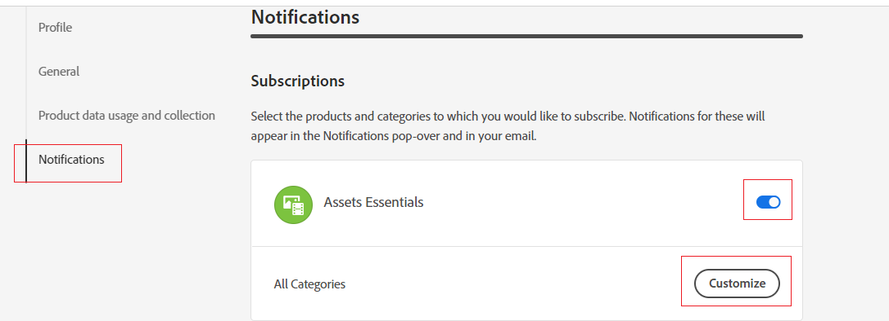
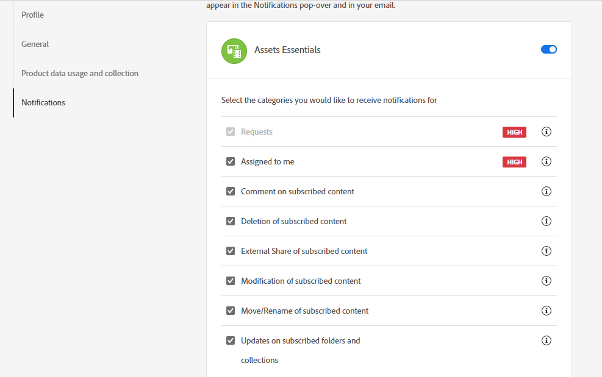
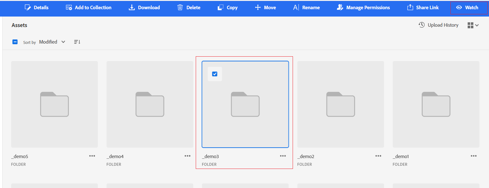
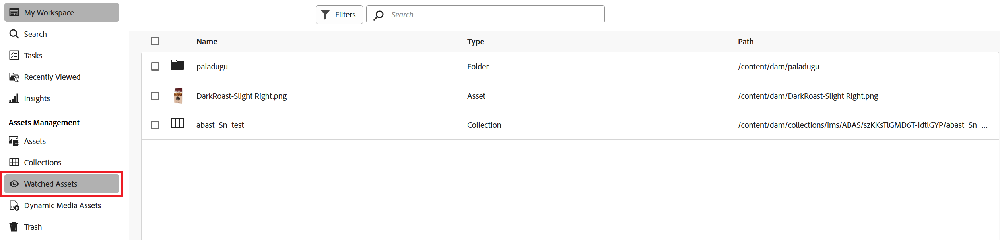
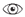
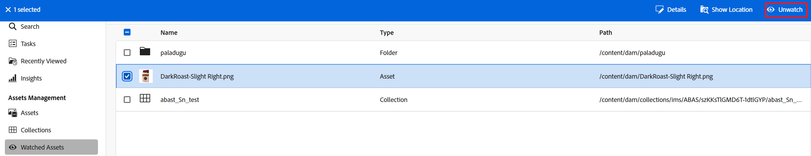

# Watch assets, folders, and collections {#watch-assets-folders}

Assets view notifications enable you to monitor the operations performed on the assets, folders, or collections available in the repository. You need to select and subscribe to the content for which the notifications are sent to you. You can also configure the categories for which the notifications are sent to you.

## Subscribe to notification categories {#subscribe-to-notification-categories}

You can choose and subscribe from a list of categories to receive notifications. Assets view sends the notifications to you only for the categories that you select from the available options:

<table>
    <tbody>
     <tr>
      <th><strong>Notification category</strong></th>
      <th><strong>Description</strong></th>
     </tr>
     <tr>
      <td>Requests</td>
      <td>When you assign a task to a user, you receive notifications when there are actions performed on that task by that user.</td>
     </tr>
     <tr>
      <td>Assigned to me</td>
      <td>You receive a notification when there is a task assigned to you from another user.</td>
     </tr>
     <tr>
      <td>Comment on subscribed content</td>
      <td>You receive a notification when a user comments on your subscribed asset.</td>
     </tr>
     <tr>
      <td>Deletion of subscribed content</td>
      <td>You receive a notification when a user deletes your subscribed asset, folder, or collection.</td>
     </tr>
     <tr>
      <td>External Share of subscribed content</td>
      <td>You receive a notification when a user generates a public link for your subscribed asset, folder, or collection.</td>
     </tr>
     <tr>
      <td>Modification of subscribed content</td>
      <td>You receive a notification when a user creates a new version for your subscribed asset.</td>
     </tr>
     <tr>
      <td>Move/Rename of subscribed content</td>
      <td>You receive a notification when a user moves or renames your subscribed asset or folder.</td>
     </tr>
     <tr>
      <td>Updates on subscribed folders and collections</td>
      <td>You receive a notification when a user adds or removes an asset from a subscribed folder or collection.</td>
     </tr>    
    </tbody>
   </table>

To subscribe to the notification categories:

1. Click  at the right end of the menu bar on the Assets view user interface.

1. Click  to view the [!UICONTROL Experience Cloud preferences] page.

1. Click the **[!UICONTROL Notifications]** option available in the left pane.

1. In the **[!UICONTROL Notifications]** section, navigate to the [!UICONTROL Assets view] section and ensure that the toggle option is switched to the ON state.

   

1. Click **[!UICONTROL Customize]** to view the notification categories.
   

1. Select the notification categories for which you need to be notified.

## Watch and unwatch folders, assets, or collections {#watch-unwatch-assets}

You can watch and unwatch folders, assets, or collections to stay informed, enabling better collaboration around the assets you are monitoring.

After [subscribing to the notification categories](#subscribe-to-notification-categories), you must subscribe to the content to start receiving notifications.

>[!NOTE]
>
>* For **[!UICONTROL Requests]** and **[!UICONTROL Assigned to me]** notification categories, you do not need to subscribe to the content after subscribing to the notification categories. Notifications are automatically sent to you for requests created by you and when a task is assigned to you.
>* Assets view sends notifications only when other users perform actions on the subscribed content. You do not receive notifications for the actions that you perform on the subscribed content.

### Subscribe to the content {#subscribe-to-content}

Follow these steps to subscribe to folders, assets, or collections:

1. Browse the folder, asset, or collection you want to subscribe to, and click **[!UICONTROL Watch]**.

1. The Assets view displays a success message. You can click **[!UICONTROL Go to notification preferences]** in the success message to edit your [subscription to notification categories](#subscribe-to-notification-categories).

   

The Assets view will now send notifications for the subscribed categories. You can also select multiple assets, folders, or collections and click **[!UICONTROL Watch]** to save time. However, if you select multiple items and some are already subscribed, the **[!UICONTROL Watch]** option will not be displayed.

### View subscribed content {#view-subscribed-content}

To view your subscribed content, follow these steps:

1. Navigate to **[!UICONTROL Watched Assets]** under [!UICONTROL Asset Management].

1. The Assets view displays a list of subscribed assets, including their name, type, and path. Select an asset, folder, or collection from the list to view its details, location, or to [unsubscribe](#unsubscribe-to-content).

   

### View content subscribers {#view-content-subscribers}

To view your content subscribers, follow these steps:

1. Navigate the folder, asset, or collection and select **[!UICONTROL Details]**.

1. Click eye from the right pane to see a list of watchers of the content.

   Alternatively, Click  on the right pane to see content watchers.

### Unsubscribe to the content {#unsubscribe-to-content}

To unsubscribe:

1. Go to **[!UICONTROL Watched Assets]** under [!UICONTROL Asset Management].

1. Select the asset, folder, or collection you want to unsubscribe from, and click **[!UICONTROL Unwatch]**.

   

Alternatively, browse the folder, asset, or collection under [!UICONTROL Asset Management]. Select the [subscribed asset](#subscribe-to-content) and click **[!UICONTROL Unwatch]**.

## View notifications {#view-notifications}

The notifications appear at the right end of the menu bar on the Assets view user interface.

When you click a notification, Assets view navigates you to the appropriate asset or folder that is referred to in the notification.
