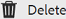
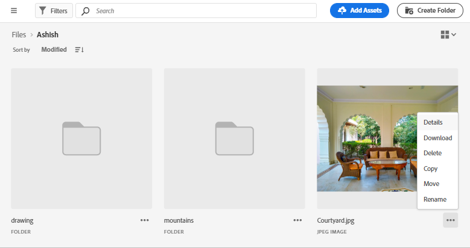
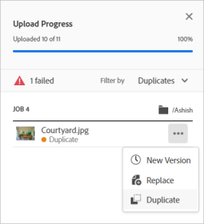
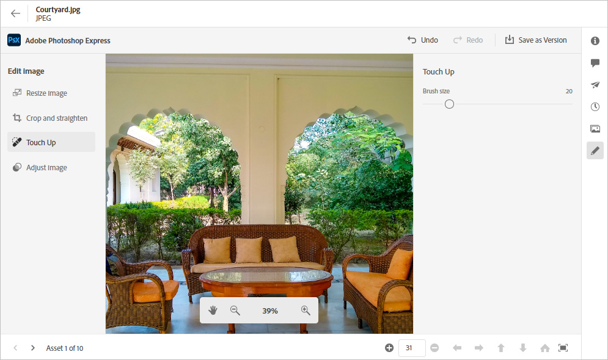
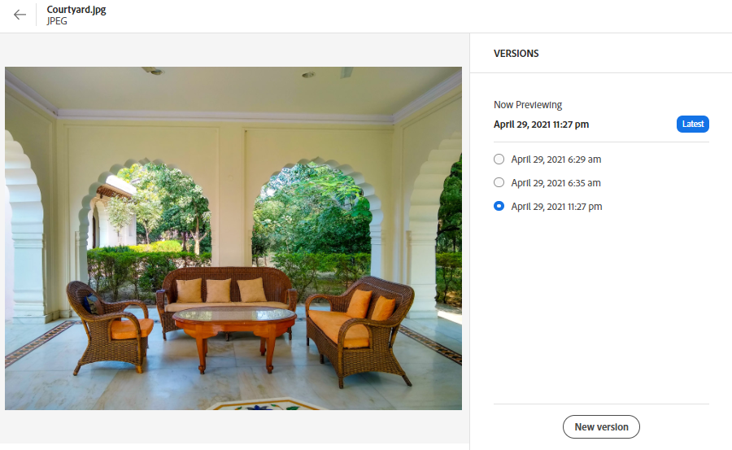
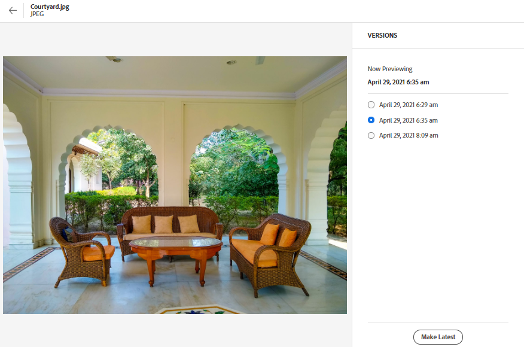

# Manage assets {#manage-assets}

<table>
    <tr>
        <td>
            <i>New</i> <a href="/help/assets/dynamic-media/dm-prime-ultimate.md"><b>Dynamic Media Prime and Ultimate</b></a>
        </td>
        <td>
            <i>New</i> <a href="/help/assets/assets-ultimate-overview.md"><b>AEM Assets Ultimate</b></a>
        </td>
        <td>
            <i>New</i> <a href="/help/assets/integrate-aem-assets-edge-delivery-services.md"><b>AEM Assets integration with Edge Delivery Services</b></a>
        </td>
        <td>
            <i>New</i> <a href="/help/assets/aem-assets-view-ui-extensibility.md"><b>UI Extensibility</b></a>
        </td>
          <td>
            <i>New</i> <a href="/help/assets/dynamic-media/enable-dynamic-media-prime-and-ultimate.md"><b>Enable Dynamic Media Prime and Ultimate</b></a>
        </td>
    </tr>
    <tr>
        <td>
            <a href="/help/assets/search-best-practices.md"><b>Search Best Practices</b></a>
        </td>
        <td>
            <a href="/help/assets/metadata-best-practices.md"><b>Metadata Best Practices</b></a>
        </td>
        <td>
            <a href="/help/assets/product-overview.md"><b>Content Hub</b></a>
        </td>
        <td>
            <a href="/help/assets/dynamic-media-open-apis-overview.md"><b>Dynamic Media with OpenAPI capabilities</b></a>
        </td>
        <td>
            <a href="https://developer.adobe.com/experience-cloud/experience-manager-apis/"><b>AEM Assets developer documentation</b></a>
        </td>
    </tr>
</table>

You can do various digital asset management (DAM) tasks easily using the user-friendly interface of [!DNL Assets view]. After you've added the assets, you can search, download, move, copy, rename, delete, update, and edit your assets. 

Use [!DNL Assets view] to accomplish the following asset management tasks. When you select an asset, the following options display in the toolbar at the top.

*Figure: Options available in the toolbar for a selected image.*

*  Deselect the selection.

*  Find similar image asset in the Assets UI based on the metadata and smart tags.

*  Click to preview an asset and view the detailed metadata. When previewing, you can view the versions and edit an image.

*  Download the selected asset to your local file system.

*  Add the selected asset to a collection.  

*  Pin an asset for faster access when you need it later. All pinned items display in the **Quick access** section of My Workspace.

*  Edit an image in the integrated Adobe Express within Adobe Experience Manager Assets.

*  Edit the image using Adobe Express. 

*  for an asset with other users so that they can access and download it.

*  Delete the selected asset or folder.

*  Copy the selected file or folder.

*  Move the selected asset or folder to a different location in the repository hierarchy.

*  Rename the selected asset or folder. Use a unique name otherwise renaming fails with a warning. You can try again with a new name. 
Additionally, you can click the title of an asset or a folder to rename it. Mention the new text in the **Rename Asset** textbox and click **Save**. This capability is available in Grid, Gallery, Waterfall and List views.

*  [!UICONTROL Waterfall View].

*  Add an asset to Library.

*  Assign tasks to other users to collaborate on an asset.

*  Monitor the operations performed on an asset.

You can view the same options on assets thumbnails.

[!DNL Assets view] displays only the relevant options in the toolbar that depend on the type of the selected asset.

*Figure: Options available in the toolbar for a selected folder.*

*Figure: Options available in the toolbar for a selected PDF file.*

## Download and distribute assets {#download}

You can select one or more assets or folders or a combination of both, and download the selection to your local file system. You can edit the assets and upload again or distribute the assets outside [!DNL Assets view]. Also, you can [download the renditions](/help/assets/add-delete-assets-view.md#renditions) of an asset.

## Asset versioning {#versions-of-assets}

<!-- 
TBD: query for engineering: How many versions are maintained. What happens when we reach that limit? Are old versions automatically removed? -->

[!DNL Assets view] versions the assets when the assets are uploaded again that is updated or are edited. You can view version history, past versions, and can restore a past version of assets as the latest version, that is reverted to a previous version if needed. Asset versions are created in the following scenarios:

* Upload a new asset with the same filename as an existing asset and in the same folder as the existing asset. [!DNL Assets view] prompts to either overwrite the previous asset or save the new asset as a version. See [upload duplicate assets](/help/assets/add-delete-assets-view.md).

  

  *Figure: When uploading an asset named the same as an existing asset, you can create a version of the asset.*

* Edit an image and click **[!UICONTROL Save as Version]**. See [edit images](/help/assets/edit-images-assets-view.md).

  

  *Figure: Save edited image as a version.*

* Open the versions of an existing asset. Click **[!UICONTROL New Version]** and upload a newer version of the asset in the repository.

  

### View versions of an asset {#view-versions}

When uploading a duplicate copy or a modified copy of an asset, you can create its versions. Versioning lets you review historical assets and revert to a previous version if needed.

To view versions, open an asset's preview and click **[!UICONTROL Versions]**  from the right sidebar. To preview a specific version, select it. To revert to it, click **[!UICONTROL Make Latest]**.

You can also create versions from the versions timeline. Select the latest version, click **[!UICONTROL New Version]**, and upload a new copy of the asset from your local file system.

*Figure: View versions of an asset, revert to a previous version, or upload another new version.*

## Manage asset status {#manage-asset-status}

**Permissions required:**  `Can Edit`, `Owner`, or administrator permissions on an asset.

Assets view lets you set status on assets available in the repository. Set an asset status to better govern and manage downstream consumption of digital assets.

You can set the following status on assets:

* Approved

* Rejected

* No Status

### Set asset status {#set-asset-status}

To set asset status:

1. Select the asset, and click **[!UICONTROL Details]** in the toolbar.

1. In the **[!UICONTROL Basic]** tab, select the asset status from the **[!UICONTROL Status]** drop-down list. The possible values include Approved, Rejected, and No Status (default).
If you have Dynamic Media with OpenAPI capabilities provisioned for your environment, Experience Manager Assets generates a public URL as soon as you mark the asset as `Approved`.

   >[!VIDEO](https://video.tv.adobe.com/v/342495)

### Set approval target {#set-approval-target}

Assets view enables you to publish approved assets to Dynamic Media with OpenAPI capabilities, Content Hub, or both based on the value that you set in the **Approval Target** field available on the Asset Details page.

To set approval target:

1. Select the asset, and click **[!UICONTROL Details]** in the toolbar.

1. In the **[!UICONTROL Basic]** tab, select the asset status from the **[!UICONTROL Status]** drop-down list. The possible values include Approved, Rejected, and No Status (default).

1. If you select **Approved** in step 2, select an approval target. The possible values include Delivery and Content Hub. 

   * **Delivery** is the default option selected in the drop-down menu and it publishes the asset to both [Dynamic Media with OpenAPI](/help/assets/dynamic-media-open-apis-overview.md) and [Content Hub](/help/assets/product-overview.md), if both are enabled for Experience Manager Assets. 

   * Selecting **Content Hub** publishes the asset just to Content Hub. Content Hub displays as an option only if it is enabled for Experience Manager Assets.

   * If you do not select an option from the drop-down list, the default option enabled for your AEM as a Cloud Service environment is automatically applied to the asset.

   For more information on the available options, see [Default Approval Target and publish destinations for approved assets](#default-approval-target-options-publish-destinations).

   >[!NOTE]
   >
   >Setting an approval target is a limited availability feature. You can get it enabled or disabled by creating a support ticket. If you have Dynamic Media with OpenAPI enabled, it is enabled by default.

   

1. Specify other asset properties and click **[!UICONTROL Save]**.

Some additional points to note include:

* When you are not using the default metadata form and cannot view the **[!UICONTROL Approval Target]** field, [edit your metadata form](/help/assets/metadata-assets-view.md#metadata-forms) to drag the **[!UICONTROL Approval for]** field from the available components to your metadata form and click **[!UICONTROL Save]**.

* When you select the approval target as `Content Hub` using the Assets view, the assets are made available in Content Hub to the users that are part of the same organization.

#### Default Approval Target and publish destinations for approved assets {#default-approval-target-options-publish-destinations}

The following table illustrates the prerequisites for display of `Approval Target` dropdown list and default approval target based on the enablement of DM with OpenAPI and Content Hub on your AEM as a Cloud Service environment:

| Dynamic Media with OpenAPI| Content Hub | Approval Target dropdown list displays?| Default approval target for approved assets | Publish destination |
| --- | --- | --- | --- |---|
| Enabled | Enabled | Yes | Delivery | Dynamic Media with OpenAPI and Content Hub |
| Not enabled | Enabled | Yes | Content Hub | Content Hub |
| Enabled | Not enabled | Yes | Delivery | Dynamic Media with OpenAPI|
| Not enabled | Not enabled | No | N/A | N/A |
 
### Set asset expiration date {#set-asset-expiration-date}

Assets view also lets you set expiration date on assets available in the repository. You can then [filter the search results](search-assets-view.md#refine-search-results) based on an `Expired` asset status. In addition, you can specify an expiration date range for assets to further filter your search results.

To set asset expiration date:

1. Select the asset, and click **[!UICONTROL Details]** in the toolbar.

1. In the **[!UICONTROL Basic]** tab, set the expiration date for the asset using the  **[!UICONTROL Expiration date]** field.

The `Expired` asset card indicator overrides the `Approved` or `Rejected` indicator set for an asset.

You can also filter assets based on an asset status, for more information, see [Search assets in Assets view](search-assets-view.md).

## Customize metadata forms to include asset status field {#customize-asset-status-metadata-form}

**Permissions required:** Administrator

Assets view provides many standard metadata fields by default. Organizations have additional metadata needs and need more metadata fields to add business-specific metadata. Metadata forms let businesses add custom metadata fields to an asset's [!UICONTROL Details] page. The business-specific metadata improves the governance and discovery of its assets.

For more information on how to add additional metadata fields to the metadata form, see [Metadata Forms](metadata-assets-view.md#metadata-forms).

**Add Asset Status metadata field to the form**

To add Asset Status metadata field to the form, drag **[!UICONTROL Asset Status]** component from the left rail to the form. The mapping property gets pre-populated automatically. Save the form to confirm the changes.

**Add Expiration Date metadata field to the form**

To add Expiration Date metadata field to the form,  drag **[!UICONTROL Date]** component from the left rail to the form. Specify **Expiration Date** as the label and `pur:expirationDate` as the mapping property. Save the form to confirm the changes.

## Next Steps {#next-steps}

* [Watch a video to manage assets in Assets view](https://experienceleague.adobe.com/docs/experience-manager-learn/assets-essentials/basics/managing.html)

* Provide product feedback using the [!UICONTROL Feedback] option available on the Assets view user interface

* Provide documentation feedback using [!UICONTROL Edit this page]  or [!UICONTROL Log an issue]  available on the right sidebar

* Contact [Customer Care](https://experienceleague.adobe.com/?support-solution=General#support)

