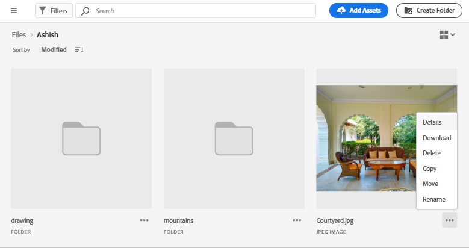
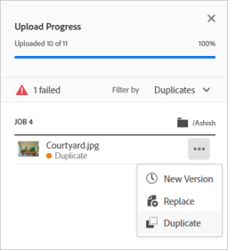
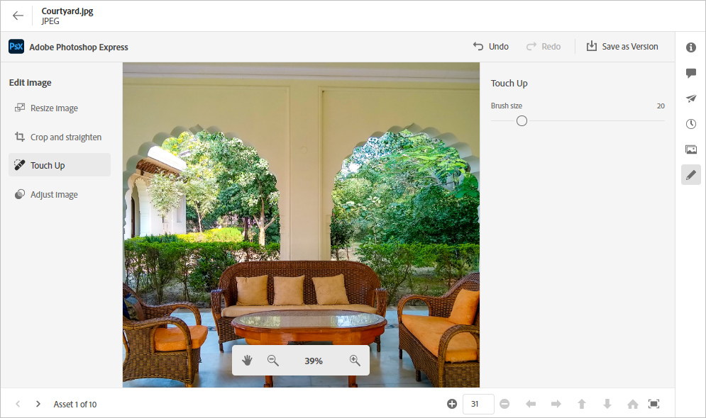
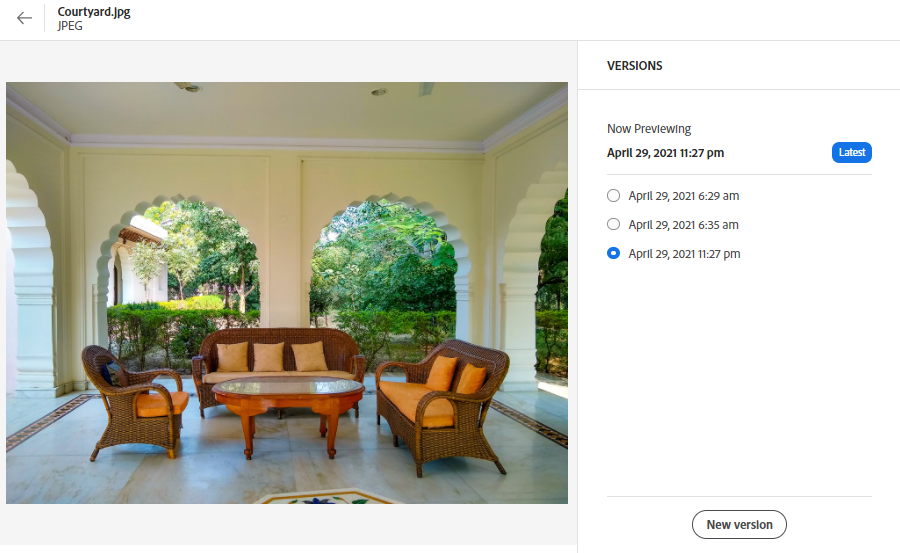
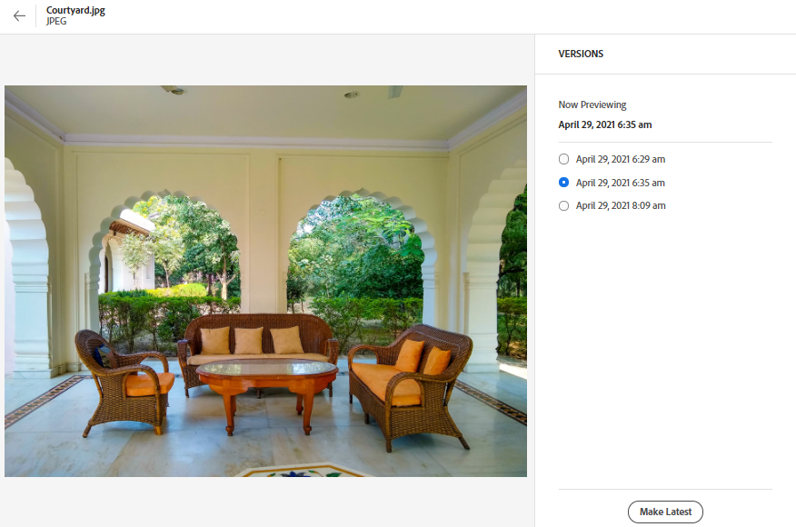

# Manage assets {#manage-assets}

The **[!DNL Assets view]** interface supports the full range of **digital asset management (DAM)** operations through a single, user-friendly workspace. After adding assets, you can **search, download, move, copy, rename, delete, update, and edit** them directly from [!DNL Assets view].

Use **[!DNL Assets view]** to accomplish the following asset management tasks. When you select an asset, the toolbar at the top displays the applicable options for that asset.

*Figure: Options available in the toolbar for a selected image.*

*  **Deselect** the current selection.

*  **Find similar** image assets in the Assets UI based on the metadata and smart tags, helping you quickly locate related visuals without manual searching.

*  **Preview** an asset and view its detailed metadata. While previewing, you can view the versions and edit an image.

*  **Download** the selected asset to your local file system.

*  **Add to a collection** to group the selected asset with related items.

*  **Pin an asset** for faster access when you need it later. All pinned items display in the **Quick access** section of My Workspace, so frequently used assets remain readily available.

*  **Edit an image** in the integrated Adobe Express within **Adobe Experience Manager (AEM) Assets**.

*  **Edit the image** using Adobe Express.

*  **Share an asset link** with other users so that they can access and download it.

*  **Delete** the selected asset or folder.

*  **Copy** the selected file or folder.

*  **Move** the selected asset or folder to a different location in the repository hierarchy.

*  **Rename** the selected asset or folder. Use a unique name; otherwise renaming fails with a warning, and you can try again with a new name.
Additionally, you can click the title of an asset or a folder to rename it. Enter the new text in the **Rename Asset** textbox and click **Save**. This capability is available in **Grid**, **Gallery**, **Waterfall**, and **List** views.

*  [!UICONTROL Waterfall View].

*  **Add an asset to Library**.

*  **Assign tasks** to other users to collaborate on an asset, enabling coordinated review and approval workflows.

*  **Monitor** the operations performed on an asset so that you stay informed of changes.

You can view the same options on the asset thumbnails.

**[!DNL Assets view]** displays only the relevant options in the toolbar, and those options depend on the type of the selected asset.

*Figure: Options available in the toolbar for a selected folder.*

*Figure: Options available in the toolbar for a selected PDF file.*

## Download and distribute assets {#download}

You can download one or more assets, folders, or a combination of both from [!DNL Assets view] directly to your **local file system**. Selecting a mix of individual assets and entire folders in a single operation streamlines bulk retrieval, so you can obtain everything you need without repeating the download for each item.

Once assets are downloaded to your local file system, you can:

- **Edit the assets** locally using your preferred applications, then upload the updated versions back into [!DNL Assets view].
- **Distribute the assets outside [!DNL Assets view]** to share them beyond the platform. This lets you deliver approved files to external stakeholders, partners, or offline workflows that do not have access to [!DNL Assets view].
- **Download the [renditions](/help/assets/add-delete-assets-view.md#renditions) of an asset.** Renditions are the alternate versions or formats of an asset—such as resized, reformatted, or otherwise derived copies—generated from the original, allowing you to retrieve the specific variant that matches your intended use.

Because downloading preserves the original files on your local file system while keeping the source assets intact in [!DNL Assets view], you can iterate on content offline and reintroduce revised versions without losing the master copy.

## Asset versioning {#versions-of-assets}

<!-- 
TBD: query for engineering: How many versions are maintained. What happens when we reach that limit? Are old versions automatically removed?
-->

Asset versioning in [!DNL Assets view] automatically preserves earlier states of an asset whenever that asset is re-uploaded, updated, or edited. You can **view the version history**, review **past versions**, and **restore any past version as the latest version**. Restoring a past version reverts the asset to that earlier state, so no previous work is lost and you can recover an approved or original file at any time.

[!DNL Assets view] creates a new version in the following scenarios:

* **Uploading a duplicate asset.** Upload a new asset with the same filename as an existing asset and in the same folder as the existing asset. [!DNL Assets view] prompts you to either overwrite the previous asset or save the new asset as a version. See [upload duplicate assets](/help/assets/add-delete-assets-view.md).

  

  *Figure: When uploading an asset named the same as an existing asset, you can create a version of the asset.*

* **Saving an edited image as a version.** Edit an image and click **[!UICONTROL Save as Version]**. This keeps the original intact while storing your edits as a distinct version. See [edit images](/help/assets/edit-images-assets-view.md).

  

  *Figure: Save edited image as a version.*

* **Uploading a newer version manually.** Open the versions of an existing asset, click **[!UICONTROL New Version]**, and upload a newer version of the asset in the repository.

  

### View and compare versions of an asset {#view-and-compare-versions}

Versioning tracks the modifications to an asset over time and lets users revert to a previous version when needed. To create versions, upload a duplicate copy or a modified copy of an asset. This ensures that earlier iterations are never permanently lost, so users can always restore a prior state of the asset if a later change is unwanted.

To view and compare versions:

1. Navigate to the asset's details page.
1. Click  in the right pane to display the **[!UICONTROL Versions]** panel. The thumbnails of the original asset and its uploaded versions display on this panel.
1. Select a version on the panel to preview it in the preview area.
1. Select any version other than the latest, and click **[!UICONTROL Make Latest]** to set it as the latest version. This promotes an earlier iteration to the current working version without deleting the version history.
1. Drag the slider in the preview toward the left and right to quickly see the selected version of an image and its latest version in a single preview. This enables a quick side-by-side comparison of the selected version of the image with its latest version.

   

   <!--
   old content
   To view versions, open an asset's preview and click **[!UICONTROL Versions]**  from the right sidebar. To preview a specific version, select it. To revert to it, click **[!UICONTROL Make Latest]**.
   -->

   >[!NOTE]
   >
   > **Version compare is enabled only for image assets.**

To add a new version, select the latest version and click **[!UICONTROL New Version]** to upload a new copy of the asset from your local file system. This creates a new asset version while preserving all previous versions in the version history.

<!--
 old content
You can also create versions from the versions timeline. Select the latest version, click **[!UICONTROL New Version]**, and upload a new copy of the asset from your local file system.

*Figure: View versions of an asset, revert to a previous version, or upload another new version.* 
-->

## Manage asset status {#manage-asset-status}

**Permissions required:**  `Can Edit`, `Owner`, or administrator permissions on an asset.

The [!DNL Assets view] enables users to set a status on any asset available in the repository. Setting an asset status governs and controls the downstream consumption of digital assets, ensuring that only reviewed and approved content is distributed or reused. This provides a clear approval workflow that improves content quality and reduces the risk of publishing unapproved material.

Users with the required permissions can set the following statuses on assets:

* **Approved** — indicates the asset has passed review and is cleared for downstream use, distribution, or reuse.

* **Rejected** — indicates the asset has been reviewed and is not cleared for use, signaling that it should not be consumed downstream.

* **No Status** — indicates the asset has not yet been reviewed or assigned a status, marking it as pending evaluation.

### Set asset status {#set-asset-status}

To set the status of an asset in Adobe Experience Manager Assets:

1. Select the asset, and click **[!UICONTROL Details]** in the toolbar.

2. In the **[!UICONTROL Basic]** tab, select the asset status from the **[!UICONTROL Status]** drop-down list. The three available status values are **Approved**, **Rejected**, and **No Status** (the default). **No Status** indicates that the asset has not yet been reviewed and remains in its initial, unmarked state, while **Approved** and **Rejected** record the outcome of the review decision.

   If you have **Dynamic Media with OpenAPI capabilities**—the delivery capability that enables assets to be served through a public endpoint—provisioned for your environment, the approval action carries an additional effect. As soon as you mark the asset as **Approved**, Experience Manager Assets automatically generates a public URL, because approval signals that the asset is ready for external delivery and distribution.

   >[!VIDEO](https://video.tv.adobe.com/v/342495)

### Set approval target {#set-approval-target}

The **Approval Target** field on the Asset Details page controls where approved assets are published. Using the [!DNL Assets view], you publish approved assets to **Dynamic Media with OpenAPI (DM with OpenAPI)** capabilities, **Content Hub**, or both, depending on the value you set in this field. This single field determines the publish destination for every asset you approve.

To set the approval target:

1. Select the asset, and click **[!UICONTROL Details]** in the toolbar.

1. In the **[!UICONTROL Basic]** tab, select the asset status from the **[!UICONTROL Status]** drop-down list. The possible values include **Approved**, **Rejected**, and **No Status** (the default).

1. If you select **Approved** in step 2, select an approval target. The possible values include **Delivery** and **Content Hub**.

   * **Delivery** is the default option selected in the drop-down menu, and it publishes the asset to both [Dynamic Media with OpenAPI](/help/assets/dynamic-media-open-apis-overview.md) and [Content Hub](/help/assets/product-overview.md), provided both are enabled for Experience Manager Assets. This ensures the asset reaches every delivery surface that your environment supports without requiring separate publish actions.

   * Selecting **Content Hub** restricts publishing so that the asset is delivered exclusively to Content Hub. As a result, the asset does not reach Dynamic Media with OpenAPI. Content Hub displays as an option only when it is enabled for Experience Manager Assets.

   * If you do not select an option from the drop-down list, Experience Manager automatically applies the default option enabled for your AEM as a Cloud Service environment to the asset.

   For more information on the available options, see [Default Approval Target and publish destinations for approved assets](#default-approval-target-options-publish-destinations).

   

1. Specify other asset properties and click **[!UICONTROL Save]**.

Some additional points to note include:

* When you are not using the default metadata form and cannot view the **[!UICONTROL Approval Target]** field, [edit your metadata form](/help/assets/metadata-assets-view.md#metadata-forms) to drag the **[!UICONTROL Approval for]** field from the available components onto your metadata form, then click **[!UICONTROL Save]**. This makes the Approval Target field visible so you can set a publish destination.

* When you select the approval target as `Content Hub` using the [!DNL Assets view], the assets become available in Content Hub to the users that are part of the same organization. Because access is scoped to the organization, only users within that organization can view or use the published assets.

#### Default Approval Target and publish destinations for approved assets {#default-approval-target-options-publish-destinations}

The following table illustrates the prerequisites for display of the `Approval Target` dropdown list, and the default approval target based on whether Dynamic Media with OpenAPI and Content Hub are enabled on your AEM as a Cloud Service environment. The dropdown list appears whenever at least one of the two destinations is enabled:

| Dynamic Media with OpenAPI| Content Hub | Approval Target dropdown list displays?| Default approval target for approved assets | Publish destination |
| --- | --- | --- | --- |---|
| Enabled | Enabled | Yes | Delivery | Dynamic Media with OpenAPI and Content Hub |
| Not enabled | Enabled | Yes | Content Hub | Content Hub |
| Enabled | Not enabled | Yes | Delivery | Dynamic Media with OpenAPI|
| Not enabled | Not enabled | No | N/A | N/A |

### Set asset expiration date {#set-asset-expiration-date}

[!DNL Assets view] lets you assign an **expiration date** to any asset in the repository, giving you a built-in way to manage the lifecycle of digital assets and flag content that should no longer be used after a certain point. Once an expiration date is set, you can [filter the search results](search-assets-view.md#refine-search-results) based on an **`Expired`** asset status. You can also specify an **expiration date range** to narrow your search results further, making it easier to locate assets that expire within a defined window or that have already lapsed.

#### Steps to set an asset expiration date

1. Select the asset, and click **[!UICONTROL Details]** in the toolbar.
1. In the **[!UICONTROL Basic]** tab, set the expiration date for the asset using the **[!UICONTROL Expiration date]** field.

#### How the Expired indicator behaves

The **`Expired`** asset card indicator overrides the **`Approved`** or **`Rejected`** indicator set for an asset. As a result, once an asset passes its expiration date, its card displays the **`Expired`** status regardless of whether it was previously marked **`Approved`** or **`Rejected`**. This ensures that expired content is clearly identified at a glance, so it is not mistakenly reused after its intended lifespan.

You can also filter assets based on an asset status. For more information, see [Search assets in [!DNL Assets view]](search-assets-view.md).

## Customize metadata forms to include asset status field {#customize-asset-status-metadata-form}

**Permissions required:** Administrator

Customizing metadata forms requires **Administrator** permissions and lets organizations extend the [!DNL Assets view] with business-specific metadata fields. By default, **[!DNL Assets view] provides many standard metadata fields**, but most organizations have additional metadata needs that these defaults do not cover.

A **metadata form** is the configurable structure that defines which fields appear on an asset's [!UICONTROL Details] page. Metadata forms let businesses add custom metadata fields to that page, and each field is bound to the underlying asset property through a **mapping property**, which specifies where the field's value is stored. Adding business-specific metadata directly improves the governance and discovery of the organization's assets, because richer, standardized metadata makes assets easier to search, classify, filter, and manage across their lifecycle.

For more information on how to add additional metadata fields to the metadata form, see [Metadata Forms](metadata-assets-view.md#metadata-forms).

**Add Asset Status metadata field to the form**

To add the **[!UICONTROL Asset Status]** metadata field to the form:

1. Drag the **[!UICONTROL Asset Status]** component from the left rail onto the form.
2. Confirm the **mapping property**, which populates automatically for this component — no manual mapping is required.
3. Save the form to confirm the changes.

The Asset Status field enables the organization to track and surface the current state of each asset, supporting governance and lifecycle workflows.

**Add Expiration Date metadata field to the form**

To add the **Expiration Date** metadata field to the form:

1. Drag the **[!UICONTROL Date]** component from the left rail onto the form.
2. Specify **Expiration Date** as the field label.
3. Enter `pur:expirationDate` as the **mapping property**, which binds the label to the correct underlying asset property.
4. Save the form to confirm the changes.

The Expiration Date field lets the organization capture when an asset is no longer valid for use, which supports compliance, retention, and automated lifecycle management of assets.

## Next Steps {#next-steps}

Continue building your expertise in the [!DNL Assets view] by exploring these recommended actions, feedback channels, and related documentation:

* [Watch a video to manage assets in [!DNL Assets view]](https://experienceleague.adobe.com/docs/experience-manager-learn/assets-essentials/basics/managing.html) to see core management tasks demonstrated end to end.

* Provide product feedback using the [!UICONTROL Feedback] option available on the [!DNL Assets view] user interface. This feedback helps shape future product improvements and prioritize the capabilities that matter most to [!DNL Assets view] users.

* Provide documentation feedback using [!UICONTROL Edit this page]  or [!UICONTROL Log an issue]  available on the right sidebar. Reporting inaccuracies or gaps this way helps keep the documentation accurate, complete, and useful for other users.

* Contact [Customer Care](https://experienceleague.adobe.com/?support-solution=General#support) for account-specific assistance and to resolve support issues that documentation and self-service options do not address.

**See also** — related documentation covering translation, APIs, metadata, search, publishing, and other core [!DNL Assets view] workflows:

* [Translate Assets](/help/assets/translate-assets.md)
* [Assets HTTP API](/help/assets/mac-api-assets.md)
* [Assets supported file formats](/help/assets/file-format-support.md)
* [Search assets](/help/assets/search-assets.md)
* [Connected assets](/help/assets/use-assets-across-connected-assets-instances.md)
* [Asset reports](/help/assets/asset-reports.md)
* [Metadata schemas](/help/assets/metadata-schemas.md)
* [Download assets](/help/assets/download-assets-from-aem.md)
* [Manage metadata](/help/assets/manage-metadata.md)
* [Manage Dynamic Media templates](/help/assets/dynamic-media/manage-dynamic-media-templates.md)
* [Manage reports in [!DNL Assets view]](/help/assets/manage-reports-assets-view.md)
* [Search facets](/help/assets/search-facets.md)
* [Manage collections](/help/assets/manage-collections.md)
* [Bulk metadata import](/help/assets/metadata-import-export.md)
* [Publish Assets to AEM and Dynamic Media](/help/assets/publish-assets-to-aem-and-dm.md)
