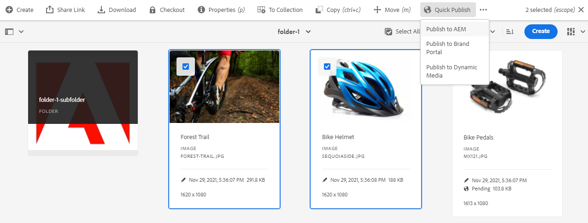
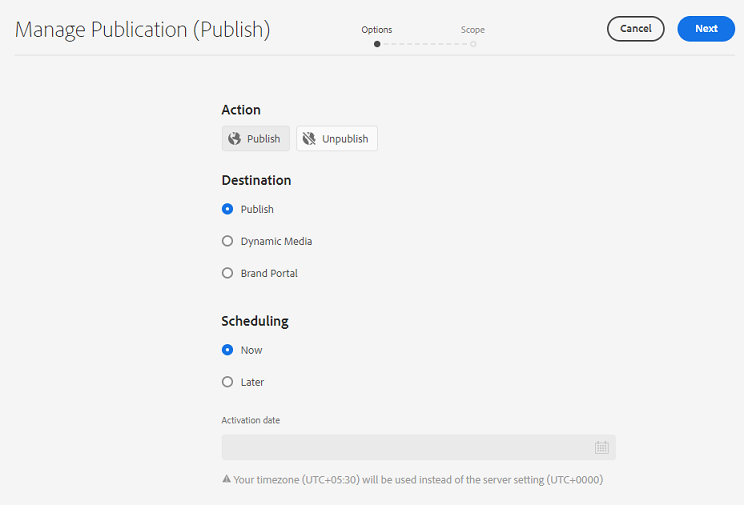
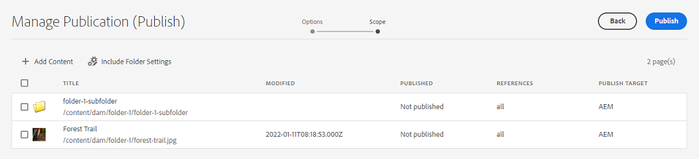
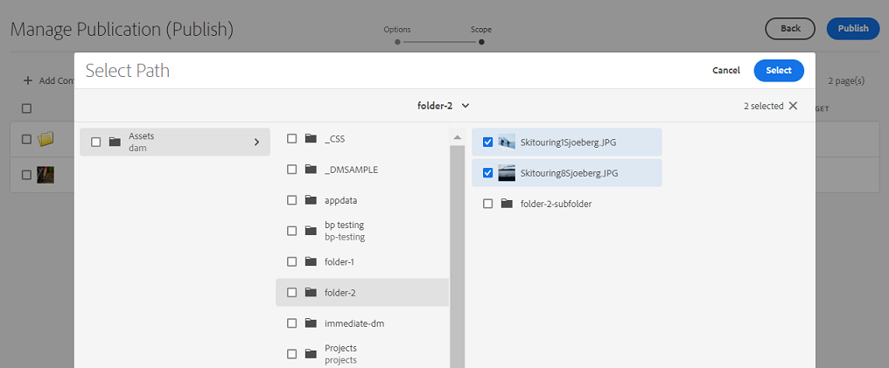
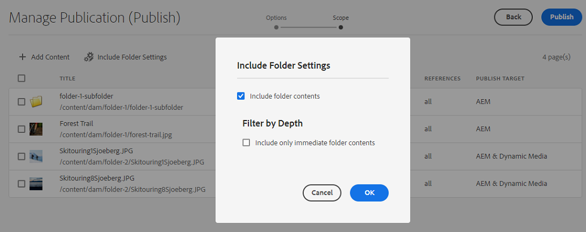
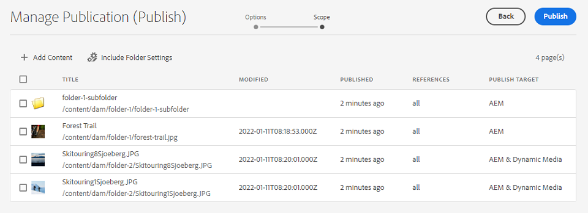
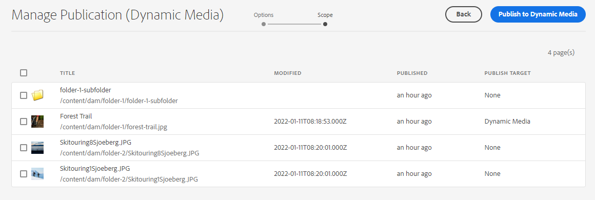
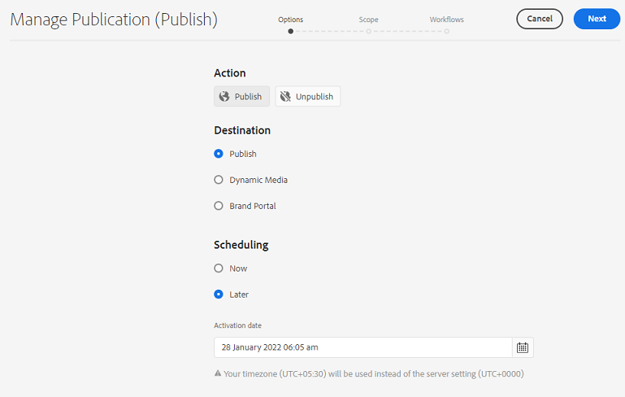
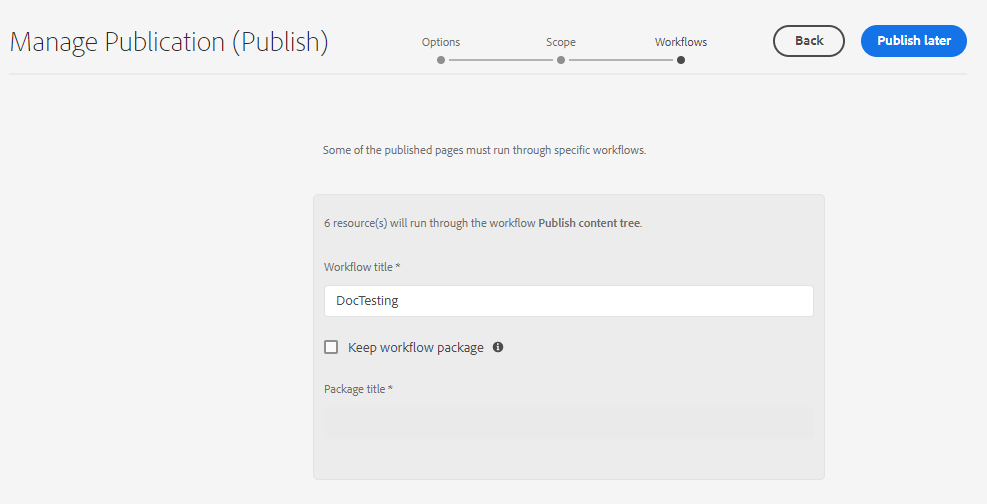

# Manage publication in Experience Manager Assets {#manage-publication-in-aem}

<table>
    <tr>
        <td>
            <i>New</i> <a href="/help/assets/dynamic-media/dm-prime-ultimate.md"><b>Dynamic Media Prime and Ultimate</b></a>
        </td>
        <td>
            <i>New</i> <a href="/help/assets/assets-ultimate-overview.md"><b>AEM Assets Ultimate</b></a>
        </td>
        <td>
            <i>New</i> <a href="/help/assets/integrate-aem-assets-edge-delivery-services.md"><b>AEM Assets integration with Edge Delivery Services</b></a>
        </td>
        <td>
            <i>New</i> <a href="/help/assets/aem-assets-view-ui-extensibility.md"><b>UI Extensibility</b></a>
        </td>
          <td>
            <i>New</i> <a href="/help/assets/dynamic-media/enable-dynamic-media-prime-and-ultimate.md"><b>Enable Dynamic Media Prime and Ultimate</b></a>
        </td>
    </tr>
    <tr>
        <td>
            <a href="/help/assets/search-best-practices.md"><b>Search Best Practices</b></a>
        </td>
        <td>
            <a href="/help/assets/metadata-best-practices.md"><b>Metadata Best Practices</b></a>
        </td>
        <td>
            <a href="/help/assets/product-overview.md"><b>Content Hub</b></a>
        </td>
        <td>
            <a href="/help/assets/dynamic-media-open-apis-overview.md"><b>Dynamic Media with OpenAPI capabilities</b></a>
        </td>
        <td>
            <a href="https://developer.adobe.com/experience-cloud/experience-manager-apis/"><b>AEM Assets developer documentation</b></a>
        </td>
    </tr>
</table>

As an [!DNL Adobe Experience Manager Assets] administrator, you can publish assets and folders containing assets from your author instance to [!DNL Experience Manager Assets], [!DNL Dynamic Media], and [!DNL Brand Portal]. Also, you can schedule to publish an asset or folder at a later date or time. Once published, the users can access and further distribute the assets to other users. By default, you can publish assets and folders to [!DNL Experience Manager Assets]. However, you can configure [!DNL Experience Manager Assets] to enable publishing to [[!DNL Dynamic Media]](https://experienceleague.adobe.com/docs/experience-manager-cloud-service/content/assets/dynamicmedia/config-dm.html) and [[!DNL Brand Portal]](https://experienceleague.adobe.com/docs/experience-manager-cloud-service/content/assets/brand-portal/configure-aem-assets-with-brand-portal.html).

You can publish or unpublish assets at the asset or folder level, using either **[!UICONTROL Quick Publish]** or **[!UICONTROL Manage Publication]** option available in the [!DNL Experience Manager Assets] interface. If you make subsequent modifications to the original asset or folder in [!DNL Experience Manager Assets], the changes are not reflected in the publish instance until you republish from [!DNL Experience Manager Assets]. It ensures that work-in-progress changes are not available in the publish instance. Only approved changes that are published by an administrator are available in the publish instance.

* [Publish assets using Quick Publish](#quick-publish)
* [Publish assets using Manage Publication](#manage-publication) 
* [Publish assets later](#publish-assets-later)
* [Publish assets to Dynamic Media](#publish-assets-to-dynamic-media)
* [Publish assets to Brand Portal](#publish-assets-to-brand-portal)
* [Request Publication](#request-publication)
* [Limitations and tips](#limitations-and-tips)

## Publish assets using Quick Publish {#quick-publish}

Quick publish lets you immediately publish content to the selected destination. From the [!DNL Experience Manager Assets] console, navigate to the parent folder and select all the assets or folders that you want to publish. Click **[!UICONTROL Quick Publish]** option from the toolbar and select destination from the drop-down list where you want to publish the assets.

## Publish assets using Manage Publication {#manage-publication}

Manage publication lets you publish or unpublish content to and from the selected destination, [add content](#add-content) to the publishing list from across the DAM repository, [include folder settings](#include-folder-settings) to publish content of the selected folders and apply filters, and [schedule publishing](#publish-assets-later) to a later date or time. 

From the [!DNL Experience Manager Assets] console, navigate to the parent folder and select all the assets or folders that you want to publish. Click **[!UICONTROL Manage Publication]** option from the toolbar. If you do not have [!DNL Dynamic Media] and [!DNL Brand Portal] configured in your [!DNL Experience Manager Assets] instance, you can publish assets and folders only to [!DNL Experience Manager Assets].

The following options are available in the [!UICONTROL Manage Publication] interface:

* [!UICONTROL Actions] 
  * `Publish`: Publish assets and folders to the selected destination
  * `Unpublish`: Unpublish assets and folders from the destination

* [!UICONTROL Destination]
  * `Publish`: Publish assets and folders to [!DNL Experience Manager Assets] (`AEM`)
  * `Dynamic Media`: Publish assets to [!DNL Dynamic Media]
  * `Brand Portal`: Publish assets and folders to [!DNL Brand Portal]

* [!UICONTROL Scheduling]
  * `Now`: Publish assets immediately
  * `Later`: Publish assets based on the `Activation` date or time

To continue, click **[!UICONTROL Next]**. Based on the selection, the **[!UICONTROL Scope]** tab reflects different options. The options to **[!UICONTROL Add Content]** and **[!UICONTROL Include Folder Settings]** are available only for publishing the assets and folders to [!DNL Experience Manager Assets] (`Destination: Publish`).

### Add Content {#add-content}

Publishing to [!DNL Experience Manager Assets] lets you further add more content (assets and folders) to the publishing list. You can add more assets or folders to the list across the dam-repositories. Click **[!UICONTROL Add Content]** button to add more content. 

You can add multiple assets from a folder or add multiple folders at a time. But you cannot add assets from multiple folders at a time. 

### Include Folder Settings {#include-folder-settings}

By default, publishing a folder to [!DNL Experience Manager Assets] publishes all the assets, subfolders, and their references. 

To filter the folder content that you want to publish, click **[!UICONTROL Include Folder Settings]**:

* `Include folder contents`

  * Enabled: All the assets of the selected folder, subfolders (including all the assets of the subfolders), and references are published.
  * Disabled: Only the selected folder (empty) and references are published. The assets of the selected folder are not published.

* `Include folder contents` and `Include only immediate folder contents`

  If both the options are selected, all the assets of the selected folder, subfolders (empty), and references are published. The assets of the subfolders are not published.

<!--
* [!UICONTROL Include only immediate folder contents]: Only the subfolders content and references are published. 

Only the selected folder content and references are published.
-->

After applying the filters, click **[!UICONTROL OK]**, and then click **[!UICONTROL Publish]**. On clicking the publish button, a confirmation message `Resource(s) have been scheduled for publication` appears. And the selected assets and (or) folders are published to the defined destination based on the scheduler (`Now` or `Later`). Log in to your publish instance to verify that the assets and (or) folders are successfully published.

In the above Illustration, you can see different values for the **[!UICONTROL Publish Target]** attribute. Let us recollect the fact that you have opted for publishing to [!DNL Experience Manager Assets] (`Destination: Publish`). Then, why is it showing that only a folder and an asset are published to `AEM`, and the other two assets are published to both `AEM` and `Dynamic Media`?

Here, you must understand the role of folder properties. A folder's **[!UICONTROL Dynamic Media Publishing mode]** property plays an important role in publication. To view a folder's properties, select a folder and click **[!UICONTROL Properties]** from the toolbar. For an asset, see the properties of its parent folder. 

The following table explains how the publication occurs depending on the defined **[!UICONTROL Destination]** and **[!UICONTROL Dynamic Media Publish mode]**:

| [!UICONTROL Destination] | [!UICONTROL Dynamic Media Publish mode] | [!UICONTROL Publish Target] | Allowed content |
| --- | --- | --- | --- |
| Publish | Selective Publish | `AEM` | Assets and(or) folders |
| Publish | Immediate | `AEM` and `Dynamic Media` | Assets and(or) folders |
| Publish | Upon Activation | `AEM` and `Dynamic Media` | Assets and(or) folders |
| Dynamic Media | Selective Publish | `Dynamic Media` | Assets |
| Dynamic Media | Immediate | `None` | Cannot publish the assets  |
| Dynamic Media | Upon Activation | `None` |  Cannot publish the assets |

>[!NOTE]
>
>Only assets are published to [!DNL Dynamic Media].
>
>Publishing a folder to [!DNL Dynamic Media] is not supported.
>
>If you select a folder (`Selective Publish`) and choose the [!DNL Dynamic Media] destination, the [!UICONTROL Publish Target] attribute reflects `None`. 

Let us now change the **[!UICONTROL Destination]** in the above use case to **[!UICONTROL Dynamic Media]** and verify the results. By doing so, only the asset of `Selective Publish` folder is published to [!DNL Dynamic Media]. The assets of `Immediate` and `Upon Activation` folders are not published, and reflects `None`.

>[!NOTE]
>
>If [!DNL Dynamic Media] is not configured on your [!DNL Experience Manager Assets] instance and the **[!UICONTROL Destination]** is **[!UICONTROL Publish]**, the assets and folders are always published to `AEM`.
>
>Publishing to [!DNL Brand Portal] is independent of the folder properties. All the assets, folders, and collections can be published to Brand Portal. See [publish assets to Brand Portal](#publish-assets-to-brand-portal).

>[!NOTE]
>
>If you have customized the [!DNL Manage Publication] wizard, your customization continues to work with the existing functionalities.
>
>However, you can remove the existing customization to use the new [!DNL Manager Publication] features. 

## Publish assets later {#publish-assets-later}

To schedule the publish workflow of assets to a later date or time:

1. From the [!UICONTROL Experience Manager Assets] console, navigate to the parent folder and select all the assets or folders that you want to schedule for publishing. 
1. Click **[!UICONTROL Manage Publication]** option from the toolbar.
1. Click **[!UICONTROL Publish]** from **[!UICONTROL Action]**, and then select the **[!UICONTROL Destination]** where you want to publish the content.
1. Select **[!UICONTROL Later]** from **[!UICONTROL Scheduling]**.
1. Select an **[!UICONTROL Activation date]** and specify the date and time. Click **[!UICONTROL Next]**.

   

1. In the **[!UICONTROL Scope]** tab, **[!UICONTROL Add Content]** (if necessary). Click **[!UICONTROL Next]**.
1. In the **[!UICONTROL Workflows]** tab, specify a Workflow title. Click **[!UICONTROL Publish Later]**. 

   

   Log in to the destination instance to verify the published assets (depending upon the scheduled date or time).

## Publish assets to Dynamic Media {#publish-assets-to-dynamic-media}

Only assets are published to [!DNL Dynamic Media]. However, the publishing behavior differs based on the folder properties. A folder can have **[!UICONTROL Dynamic Media Publish mode]** configured for selective publishing which can be any of the following:

* `Selective Publish`
* `Immediate`
* `Upon Activation`

The publishing process for **[!UICONTROL Immediate]** and **[!UICONTROL Upon Activation]** mode is consistent, however, different for **[!UICONTROL Selective Publish]**. See [configure selective publish at folder level in Dynamic Media](https://experienceleague.adobe.com/docs/experience-manager-cloud-service/content/assets/dynamicmedia/selective-publishing.html). After you configure selective publishing in a folder, you can do any of the following:

* [Selectively publish assets to Dynamic Media or Experience Manager using Manage Publication](https://experienceleague.adobe.com/docs/experience-manager-cloud-service/content/assets/dynamicmedia/selective-publishing.html?lang=en#selective-publish-manage-publication)
* [Selectively unpublish assets from Dynamic Media or Experience Manager using Manage Publication](https://experienceleague.adobe.com/docs/experience-manager-cloud-service/content/assets/dynamicmedia/selective-publishing.html?lang=en#selective-unpublish-manage-publication)
* [Publish assets to Dynamic Media or Experience Manager using Quick Publish](https://experienceleague.adobe.com/docs/experience-manager-cloud-service/content/assets/dynamicmedia/selective-publishing.html?lang=en#quick-publish-aem-dm)
* [Selectively publish or unpublish assets by way of search results](https://experienceleague.adobe.com/docs/experience-manager-cloud-service/content/assets/dynamicmedia/selective-publishing.html?lang=en#selective-publish-unpublish-search-results)

## Publish assets to Brand Portal {#publish-assets-to-brand-portal}

You can publish assets, folders, and collections to the [!DNL Experience Manager Assets Brand Portal] instance.

* [Publish assets to Brand Portal](https://experienceleague.adobe.com/docs/experience-manager-cloud-service/content/assets/brand-portal/publish-to-brand-portal.html?lang=en#publish-assets-to-bp)
* [Publish folders to Brand Portal](https://experienceleague.adobe.com/docs/experience-manager-cloud-service/content/assets/brand-portal/publish-to-brand-portal.html?lang=en#publish-folders-to-brand-portal)
* [Publish collections to Brand Portal](https://experienceleague.adobe.com/docs/experience-manager-cloud-service/content/assets/brand-portal/publish-to-brand-portal.html?lang=en#publish-collections-to-brand-portal)

## Request Publication {#request-publication}

The `Request Publication` option helps in authenticating workflow of Assets before getting them published on [!DNL AEM] Assets environment. [!DNL AEM] provides different level of permissions to various users. You can be a *contributor* who is uploading assets but cannot publish them until the uploads are verified. Also, being an *Admin* you can manage to read and write workflows of the Assets. 

Request publication option is available to the following users:

* **Contributor:** If you are a user who can contribute to [!DNL AEM] Assets, then you have limited access to the [!DNL AEM] Assets workflow. `Manage publication` button is hidden for you. As a contributor, you can only contribute by adding Assets but you cannot publish them or have read access to the workflow.

* **Workflow User:** This user cannot publish assets but has read access to the workflow. Being a workflow user, you can: 
  * request publication
  * view `Manage publication` button
  * schedule the workflow and see the options `schedule now` and `schedule later`

* **Admin:** As an admin type of user, you can manage overall workflow steps for the Assets. `Manage publication` button is visible to you. If the destination `publish` is selected, you can schedule an Asset later for the workflow step.

>[!NOTE]
>
>If [!DNL Dynamic Media] is selected as a destination, then workflow step is disabled for **workflow user** and **admin** users.
>

## Limitations and tips {#limitations-and-tips}

* `Manage publication` is available to the users who have atleast Read permissions to the workflow.
* Empty folders are not published.
* If you publish an asset that is being processed, only the original content is published. The renditions are missing. Either wait for the processing to complete and then publish or republish the asset once the processing completes.
* While unpublishing a complex asset, unpublish the asset only. Avoid unpublishing the references because they may be referred by other published assets.
