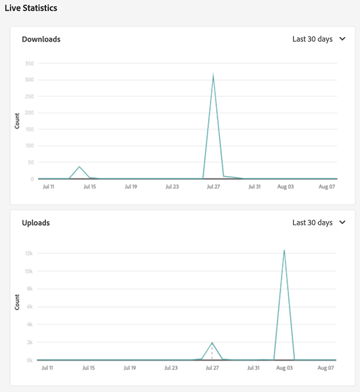
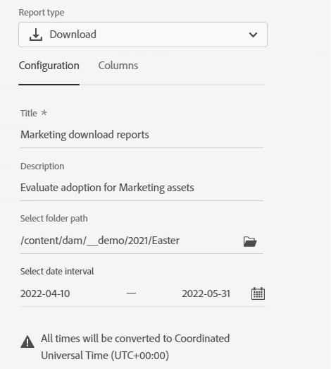
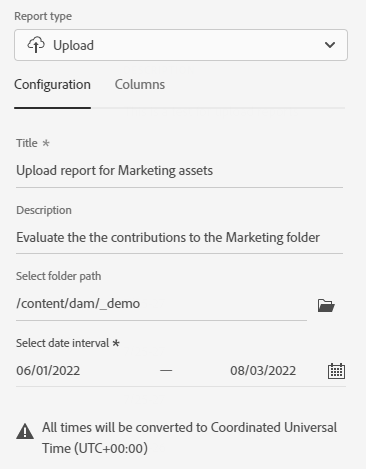
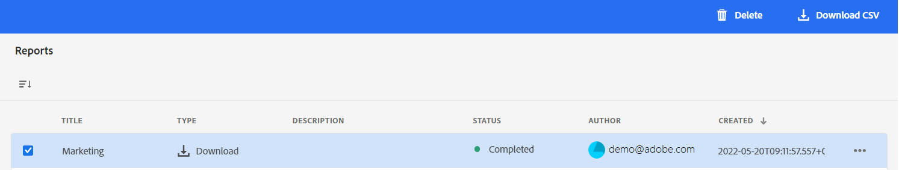

# Manage reports {#manage-reports}

Asset reporting provides administrators with visibility into activity of the Adobe Experience Manager Assets View environment. This data provides useful information about how users interact with content and the product. All users can access the Insights dashboard and the ones who are assigned to the Administrators product profile can create user-defined reports. 

## Access reports {#access-reports}

All users who are assigned to the Assets view Administrators product profile can access the Insights dashboard or create user-defined reports in Assets view.

To access reports, navigate to **[!UICONTROL Reports]** under **[!UICONTROL Settings]**.

<!--
In the **[!UICONTROL Reports]** screen, various components are shown in the tabular format which includes the following:

* **Title**: Title of the report
* **Type**: Determines whether the report is uploaded or downloaded to the repository
* **Description**: Provide details of the report that was given during uploading/downloading the report
* **Status**: Determines whether the report is completed, under progress, or deleted.
* **Author**: Provides email of the author who has uploaded/downloaded the report.
* **Created**: Gives information of the date when the report was generated.
-->

## View Insights {#view-live-statistics}

Assets view enables you to view real-time data for your Assets view environment with the Insights dashboard. You can view real-time event metrics during the last 30 days or for the last 12 months. 

   <!---->

Click **[!UICONTROL Insights]** available in the left navigation pane to view the following automatically generated charts:

* **Downloads**: The number of assets downloaded from the Assets view environment in the last 30 days or 12 months represented using a line graph.

* **Uploads**: The number of assets uploaded to the Assets view environment in the last 30 days or 12 months represented using a line graph.

<!--* **Asset Count by Size**: The division of count of assets based on their range of various sizes from 0 MB to 100 GB.-->

* **Storage usage**: The storage usage, in bytes, for the Assets view environment represented using a bar chart.

<!--* **Delivery**: The graph depicts the count of assets as the delivery dates.-->

<!--* **Asset Count by Asset Type**: Represents count of various MIME types of the available assets. For example, application/zip, image/png, video/mp4, application/postscripte.-->

* **Top Searches**: View top searched terms along with the number of times those terms are searched within your Assets view environment in the last 30 days or 12 months represented in a tabular format.

  <!--
   
   
   -->

## Create a Download report {#create-download-report}

To create a Download report:

1. Navigate to **[!UICONTROL Settings]** > **[!UICONTROL Reports]** and click **[!UICONTROL Create Report]**.

1. In the [!UICONTROL Configuration] tab, specify the report type as **[!UICONTROL Download]**.

1. Specify a title and an optional description for the report.

1. Select the folder path, which comprises the assets to execute the report on, using the **[!UICONTROL Select Folder Path]** field.

1. Select the date interval for the report.
   
   >[!NOTE]
   >
   > Assets view converts all local time zones to Coordinated Universal Time (UTC).

1. In the [!UICONTROL Columns] tab, select the column names that you need to display in the report.

1. Click **[!UICONTROL Create]**.

   

The following table explains the use of all columns that you can add to the report:

<table>
    <tbody>
     <tr>
      <th><strong>Column name</strong></th>
      <th><strong>Description</strong></th>
     </tr>
     <tr>
      <td>Title</td>
      <td>The title of the asset.</td>
     </tr>
     <tr>
      <td>Path</td>
      <td>The folder path where the asset is available in Assets view.</td>
     </tr>
     <tr>
      <td>MIME Type</td>
      <td>The MIME type for the asset.</td>
     </tr>
     <tr>
      <td>Size</td>
      <td>The size of the asset in bytes.</td>
     </tr>
     <tr>
      <td>Downloaded By</td>
      <td>The email ID of the user who downloaded the asset.</td>
     </tr>
     <tr>
      <td>Download Date</td>
      <td>The date when the asset download action is performed.</td>
     </tr>
     <tr>
      <td>Author</td>
      <td>The author for the asset.</td>
     </tr>
     <tr>
      <td>Creation Date</td>
      <td>The date when the asset is uploaded to Assets view.</td>
     </tr>
     <tr>
      <td>Modified Date</td>
      <td>The date when the asset is last modified.</td>
     </tr>
     <tr>
      <td>Expired</td>
      <td>The expiration status of the asset.</td>
     </tr>
     <tr>
      <td>Downloaded By User Name</td>
      <td>The name of the user who downloaded the asset.</td>
     </tr>           
    </tbody>
   </table>

## Create an Upload report {#create-upload-report}

To create an Upload report:

1. Navigate to **[!UICONTROL Settings]** > **[!UICONTROL Reports]** and click **[!UICONTROL Create Report]**.

1. In the [!UICONTROL Configuration] tab, specify the report type as **[!UICONTROL Upload]**.

1. Specify a title and an optional description for the report.

1. Select the folder path, which comprises the assets to execute the report on, using the **[!UICONTROL Select Folder Path]** field.

1. Select the date interval for the report.

1. In the [!UICONTROL Columns] tab, select the column names that you need to display in the report.

1. Click **[!UICONTROL Create]**.

   

The following table explains the use of all columns that you can add to the report:

<table>
    <tbody>
     <tr>
      <th><strong>Column name</strong></th>
      <th><strong>Description</strong></th>
     </tr>
     <tr>
      <td>Title</td>
      <td>The title of the asset.</td>
     </tr>
     <tr>
      <td>Path</td>
      <td>The folder path where the asset is available in Assets view.</td>
     </tr>
     <tr>
      <td>MIME Type</td>
      <td>The MIME type for the asset.</td>
     </tr>
     <tr>
      <td>Size</td>
      <td>The size of the asset.</td>
     </tr>
     <tr>
      <td>Author</td>
      <td>The author for the asset.</td>
     </tr>
     <tr>
      <td>Creation Date</td>
      <td>The date when the asset is uploaded to Assets view.</td>
     </tr>
     <tr>
      <td>Modified Date</td>
      <td>The date when the asset is last modified.</td>
     </tr>
     <tr>
      <td>Expired</td>
      <td>The expiration status of the asset.</td>
     </tr>              
    </tbody>
   </table>

## View existing reports {#view-report-list}

After [creating the report](#create-download-report), you can view the list of existing reports and select to download them in a CSV format or delete them.

To view the list of reports, navigate to **[!UICONTROL Settings]** > **[!UICONTROL Reports]**.

For each report, you can view report title, the type of the report, description specified while creating the report, status of the report, email ID of the author who created the report, and report creation date.

`Completed ` status of the report represents that the report is ready for download.

## Download a CSV report {#download-csv-report}

To download a report in CSV format:

1. Navigate to **[!UICONTROL Settings]** > **[!UICONTROL Reports]**.

1. Select a report and click **[!UICONTROL Download CSV]**.

The selected report downloads in CSV format. The columns that display in the CSV report depends on the columns that you select while [creating the report](#create-download-report).

## Delete a report {#delete-report}

To delete a report:

1. Navigate to **[!UICONTROL Settings]** > **[!UICONTROL Reports]**.

1. Select a report and click **[!UICONTROL Delete]**.

1. Click **[!UICONTROL Delete]** again to confirm.
