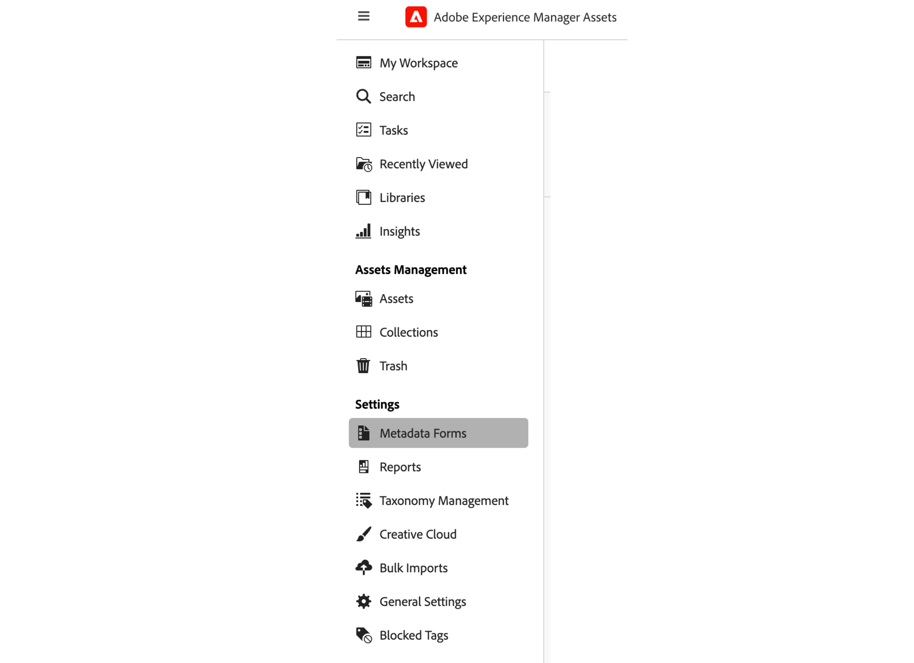
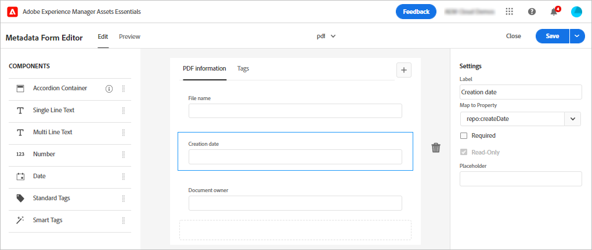
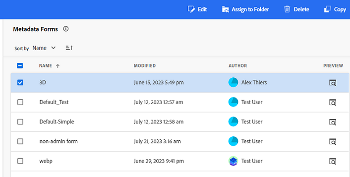
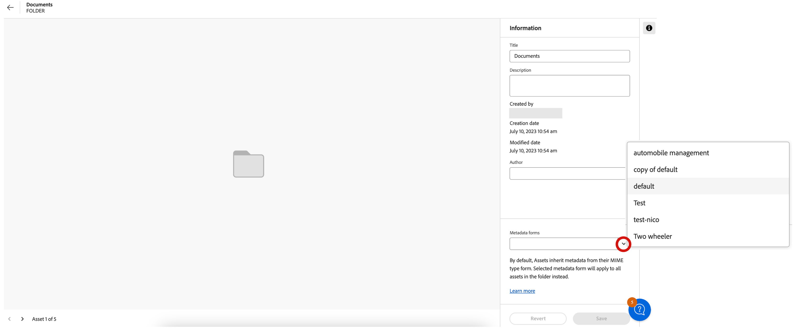

# Metadata in Assets View {#metadata}

| [Search Best Practices](/help/assets/search-best-practices.md) |[Metadata Best Practices](/help/assets/metadata-best-practices.md)|[Content Hub](/help/assets/product-overview.md)|[Dynamic Media with OpenAPI capabilities](/help/assets/dynamic-media-open-apis-overview.md)|[AEM Assets developer documentation](https://developer.adobe.com/experience-cloud/experience-manager-apis/)|
| ------------- | --------------------------- |---------|----|-----|

Metadata means data or description about the data. For example, your images as an asset can contain information about the camera it was clicked with or any copyright information. This information is metadata of the image. Metadata is critical for efficient asset management. Metadata is the collection of all the data available for an asset but it may not necessarily be contained in that asset.

Metadata helps you further categorize assets and is helpful as the amount of digital information grows. It is possible to manage a few hundred files based on just the filenames, thumbnails, and memory. However, this approach is not scalable. It falls short when the number of people involved and the number of managed assets increase.

With the addition of metadata, the value of a digital asset grows, because the asset becomes:

* More accessible - systems and users can find it easily.
* Easier to manage - you can find assets with the same set of properties easier and apply changes to them.
* Complete - asset carries more information and context with more metadata.

For these reasons, Assets provides you with the right means of creating, managing, and exchanging metadata for your digital assets.

## View the metadata {#view-metadata}

To view the metadata of an asset, browse to the asset or search the asset, select the asset, and click **[!UICONTROL Details]** in the toolbar.

*Figure: To view an asset and its metadata, click **[!UICONTROL Details]** from toolbar or double-click the asset.*

The basic metadata such as title, description, and upload date is available in the [!UICONTROL Basic] tab. The [!UICONTROL Advanced] tab contains more advanced metadata such as camera model, lens details, and geotags. The [!UICONTROL Tags] tab contains auto-applied tags based on the contents of the image.

## Update metadata {#update-metadata}

Once Admin configures the metadata form, other fields can be updated manually. You may want to change this because it reads only based on out of the box metadata form.

## Smart Tags {#smart-tags}

[!DNL Experience Manager Assets] uses artificial intelligence provided by [Adobe Sensei](https://www.adobe.com/sensei.html) to automatically apply relevant tags to all your uploaded assets. These tags, aptly named Smart Tags, increase the content velocity of your projects by helping you find relevant assets quickly. The smart tags are an example of metadata that is not contained in the image. 

The smart tags are applied in near real time and are generated based on the contents of the image. When you upload an asset, the user interface displays [!UICONTROL Processing] on the asset thumbnail for some time. Once the processing is complete, you can [view the metadata](#view-metadata) and the smart tags.

*Figure: To view the Smart Tags of an asset, click **[!UICONTROL Details]** from toolbar or double-click the asset.*

Smart tags also contain a confidence score as a percentage. It indicates the confidence associated with the applied tag. You can moderate the automatically applied smart tags.

## Add or update keywords {#manually-tag}

You may add more tags to your assets, in addition to the Smart Tags that are added automatically using the [!DNL Adobe Sensei] smart service. Open an asset for preview, click [!UICONTROL Tags], and type the desired keywords in the [!UICONTROL Keywords] field. To add the tag, press Return. [!DNL Assets view] indexes the keyword in near real time and your team can soon search the updated assets using the new keywords.

You can also remove tags from the [!UICONTROL Smart Tags] section that are automatically added by [!DNL Assets view] to all the uploaded assets.

## Taxonomy management {#taxonomy-management}

Tags can also be nested into a hierarchy to support relationships like category and sub-category. If you need to insert hierarchical tags, they are easily managed by Administrator in the [!UICONTROL Taxonomy Management] section of [!UICONTROL Settings]. You can create a governed set of namespaces and tags that all users can access to use while describing content. Only the Administrators can set up tag hierarchies in [!UICONTROL Taxonomy Manager] ensuring that the values are controlled and used consistently. 

## Setup Metadata Forms {#metadata-forms}

>[!CONTEXTUALHELP]
>id="assets_metadata_forms"
>title="Metadata Forms"
>abstract="[!DNL Experience Manager Assets] provides many standard metadata fields by default. Organizations have additional metadata needs and require more metadata fields to add business-specific metadata. Metadata forms let businesses add custom metadata fields to an asset's Details page. The business-specific metadata improves the governance and discovery of its assets."

Assets view provides many standard metadata fields by default. Organizations have additional metadata needs and need more metadata fields to add business-specific metadata. Metadata forms let businesses add custom metadata fields to an asset's [!UICONTROL Details] page. The business-specific metadata improves the governance and discovery of its assets. You can create forms from scratch or repurpose an existing form.

You can configure metadata forms for different types of assets (different MIME types). Use the same form name as the file's MIME type. Assets view automatically match uploaded assets MIME type to the name of the form and updates the metadata for the uploaded assets based on the form fields.
<!--
For example, if a metadata form by the name `PDF` or `pdf` exists, then the uploaded PDF documents contain metadata fields as defined in the form.
-->
Assets view uses the following sequence to search for existing metadata form names to apply the metadata fields to the uploaded assets of a particular type:

MIME subtype > MIME type > `default` form > Out-of-the-box form

For example, if a metadata form by the name `PDF` or `pdf` exists, then the uploaded PDF documents contains metadata fields as defined in the form. If a metadata form by the name `PDF` or `pdf` does not exist, Assets view match if there is a metadata form by the name `application`. If there is a metadata form by the name `application`, the uploaded PDF documents contain metadata fields as defined in the form. If Assets view still does not find a matching metadata form, it searches for the `default` metadata form to apply metadata fields defined in the form to the uploaded PDF documents. If none of these steps work, Assets view applies metadata fields defined in the out-of-the-box form to all the uploaded PDF documents.
Though if you want to assign a metadata form to a folder [see](#assign-metadata-form-folder).

>[!IMPORTANT] 
>
>The new metadata form for a specific file type completely replaces the default metadata form that [!DNL Assets view] provides. If you delete or rename a metadata form, the default metadata fields are again available for new assets.

To create a metadata form, follow these steps:

1. In the left rail, click **[!UICONTROL Settings]** > **[!UICONTROL Metadata Forms]**.

   

1. Click **[!UICONTROL Create]**, in the upper-right area of the user interface.
1. Provide a name for the form and click **[!UICONTROL Create]**.
1. Provide a name for the tab in **[!UICONTROL Settings]** in the right rail.
1. From the **[!UICONTROL Components]** available in the left rail, drag the required components on a tab in the form. Drag the components in the desired sequence.

   

   *Figure: Metadata form creation interface with options to add components and option to preview the form.*

1. For each component, provide a name in the **[!UICONTROL Settings]** in the right rail, provide a mapping with the supported properties.
1. Optionally, for a component, select **[!UICONTROL Required]** to make the metadata field mandatory and select **[!UICONTROL Read-Only]** to make the field uneditable in the asset [!UICONTROL Details] page.
1. Optionally, click **[!UICONTROL Preview]** to preview the form that you are creating.
1. Optionally, add more tabs and the required components in each tab.
1. Click **[!UICONTROL Save]** when the form is complete.

Watch this video to view the sequence of steps:

>[!VIDEO](https://video.tv.adobe.com/v/341275)

Once a form is created, it is automatically applied when users upload an asset of the matching MIME type.

To reuse an existing form to create a new form, select a metadata form, click **[!UICONTROL Copy]** from the toolbar, provide a name, and click **[!UICONTROL Confirm]**. You can edit a metadata form to change it. When you change a form, it is used for assets uploaded after the change. It does not change the existing assets.

### Property components {#property-components}

You can customize your metadata form using any of the following property components. Simply drag and drop the component type onto the form in the desired location and modify the component settings. 
Below is an overview of each property type and how they are stored. 

| Component Name | Description |
|---|---|
| Accordion Container | Add a collapsible heading for a list of common components and properties. It can be expanded or collapsed by default. |
| Single-line text | Add a single-line text property. |
| Multi-line text | Add multiple lines of text or a paragraph. It expands as a user types to contain all content. |
| Multi value text | Add a multi value text property. |
| Number | Add a number component. |
| Checkbox | Add a Boolean value. Stored as TRUE or FALSE once a value is saved. |
| Date | Add a date component. |
| Drop-down | Add a drop-down list. |
| State | Add the repository state property (mapped to repo:state) |
| Asset Status | Add the default Asset Status property (mapped to dam:assetStatus) |
| Tags | Add a tag from values stored in Taxonomy Management (mapped to xcm:tags). |
| Keywords | Add free-form keywords (mapped to dc:subject). |
| Smart Tags | Add to augment search capabilities by automatically adding metadata tags. |

### Assign metadata form to a folder {#assign-metadata-form-folder}

You can also assign a metadata form to a folder within your Assets view deployment. The metadata form assigned to a folder as per the MIME type is overwritten when you apply a metadata form to a folder manually. All assets in the folder, including assets in the sub-folders, then display properties defined in the metadata form.

To assign a metadata form to a folder:

1. Navigate to **[!UICONTROL Settings]** > **[!UICONTROL Metadata Forms]** and select a metadata form.

2. Click **[!UICONTROL Assign to Folder]**.

3. Select the folder and click **[!UICONTROL Assign]**. You can select the folders by clicking the folder names.

   

   You can also navigate to the folder details page and select a metadata form from the folder properties available in the right pane to assign the metadata form to the folder.

   

### Remove metadata form from folders {#remove-metadata-form-folder}

After assigning a metadata form to one or multiple folders, Experience Manager Assets also enables you to remove metadata form from the selected folders.

To remove a metadata form from a folder:

1. Navigate to **[!UICONTROL Settings]** > **[!UICONTROL Metadata Forms]** and select a metadata form.

1. Click **[!UICONTROL Remove from Folder(s)]**. The list of assigned folders for the metadata form display.

1. Select the folder and click **[!UICONTROL Remove]**. You can also select multiple folders from the list.

You can also navigate to the folder details page and select **[!UICONTROL System mapped Metadata Form]** from the **[!UICONTROL Metadata Forms]** field to remove the assigned metadata form from a folder.

### Working with Link component in metadata form {#link-component-metadata-form}

The link component is used to enable external URLs including storage links, copyright information, contact forms, and so on. To use link component on metadata form, you need to [configure metadata form](#metadata-forms).

Follow the steps below to use link component on metadata form:

1. Go to asset details page and navigate to **[!UICONTROL Link URL]**.
1. Add a URL that you want to use to redirect for the selected asset.
1. Click **[!UICONTROL Add link]**. Perform one of the following actions:
   * Click  to copy the URL.
   * Click  to edit the URL.
1. Click **[!UICONTROL Save]** to save the changes.

## Next Steps {#next-steps}

* [Watch a video to manage metadata forms in Assets view](https://experienceleague.adobe.com/docs/experience-manager-learn/assets-essentials/configuring/metadata-forms.html)

* Provide product feedback using the [!UICONTROL Feedback] option available on the Assets view user interface

* Provide documentation feedback using [!UICONTROL Edit this page]  or [!UICONTROL Log an issue]  available on the right sidebar

* Contact [Customer Care](https://experienceleague.adobe.com/?support-solution=General#support)

<!-- TBD: Cannot create a form using the second option. Documenting only the first option for now.
To reuse an existing form to create a form, do one of these:

* Select a metadata form and click **[!UICONTROL Copy]** from the toolbar, provide a name, and click **[!UICONTROL Confirm]**.

* Click **[!UICONTROL Create]**, select **[!UICONTROL Use existing form structure as template]** option, and select an existing form. 
-->

<!-- TBD: Queries for PM and engg.

Can we edit the existing metadata in any form?

How to moderate smart tags?

Allow or deny list for smart tags?

What about Tags displayed just above Smart Tags in the UI?

Is there a detailed metadata tab. Where do the other details of an asset go?

How can one search based strictly on the metadata. Similar to AEM Assets GQL queries.
-->

<!-- TBD: Link to related articles if any.

>[!MORELIKETHIS]
>
>* [Search assets](search.md).
-->

