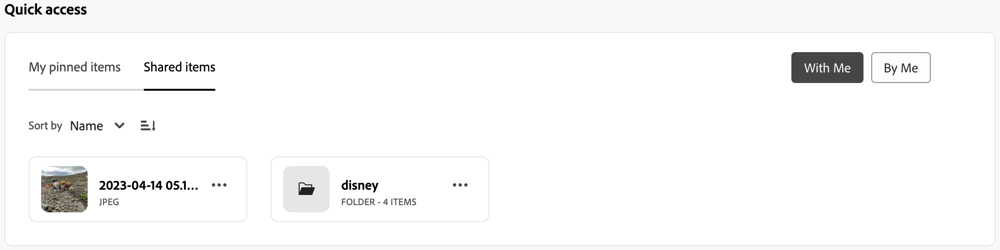
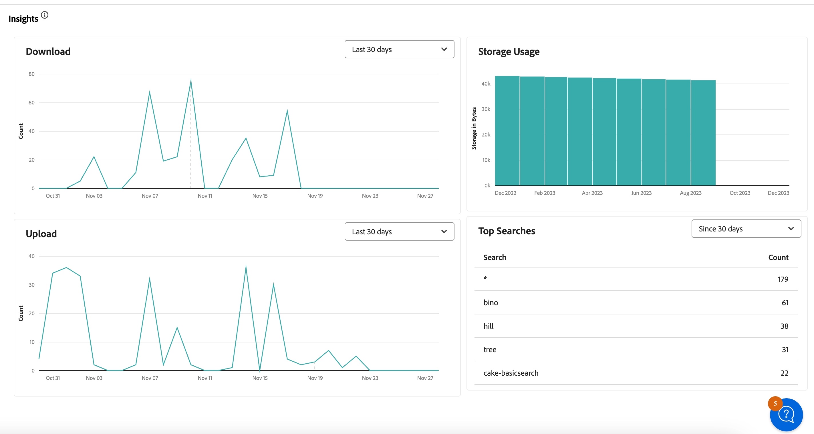
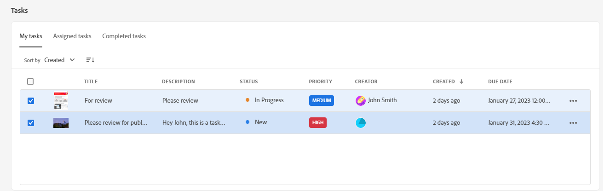
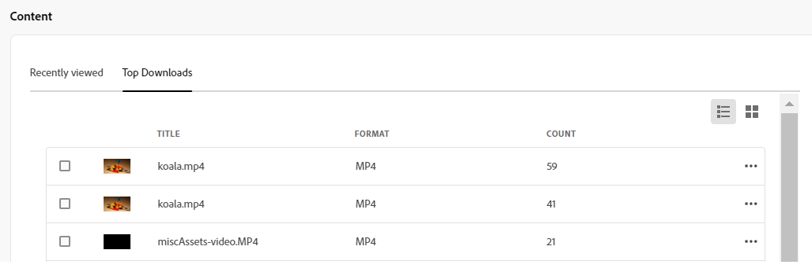
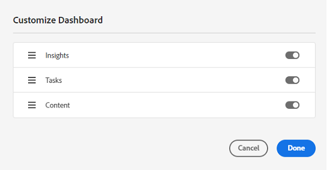

# My Workspace for Assets {#my-workspace}

| [Search Best Practices](/help/assets/search-best-practices.md) |[Metadata Best Practices](/help/assets/metadata-best-practices.md)|[Content Hub](/help/assets/product-overview.md)|[Dynamic Media with OpenAPI capabilities](/help/assets/dynamic-media-open-apis-overview.md)|[AEM Assets developer documentation](https://developer.adobe.com/experience-cloud/experience-manager-apis/)|
| ------------- | --------------------------- |---------|----|-----|

>[!CONTEXTUALHELP]
>id="assets_my_workspace"
>title="My Workspace"
>abstract="Assets now includes a customizable workspace that provides widgets for convenient access to key areas of the Assets user interface and information that is most relevant to you. This page serves as a one-stop solution to provide an overview of your work items and to give quick access to key workflows."

Assets now includes a customizable workspace that provides widgets for convenient access to key areas of the Assets user interface and information that is most relevant to you. This page serves as a one-stop solution to provide an overview of your work items and to give quick access to key workflows. More convenient access to these options increases your efficiency and content velocity.

You can access My Workspace by clicking **[!UICONTROL My Workspace]** from the items available in the left navigation pane. My Workspace includes a variety of widgets that show Quick access, Insights, Tasks, and Content widgets. You can configure how these widgets are displayed in your Workspace based on your preferences.

>[!NOTE]
>
>Insights widget is only visible to administrators.

<!--

**New features coming soon**

Highlights upcoming features for Assets.

-->

**Quick access**

Pin files, folders, and collections for faster access to these items when you need them later. All pinned items display in the **Quick access** section of My Workspace. You can access them using My Workspace instead of navigating to the location where they are saved within the repository.

To pin an asset, a folder, or a collection:

1. Select the item and click **[!UICONTROL Pin to Quick Access]**.

1. Select if you need to pin the item just for you, for the entire organization, or for selected groups. If you select **[!UICONTROL For groups]**, choose an existing group names in the **[!UICONTROL Pin for groups]** field.

   
1. Click **[!UICONTROL Pin]**.

   The selected item displays in the **[!UICONTROL Quick Access]** section of My Workspace. 
   

**Insights**

Administrators can view a summary of the number of downloads and uploads performed on the Assets environment during the last 30 days. You can click **[!UICONTROL View all]** to quickly navigate to the Insights page for more detailed dashboards.

You can also view top searched terms along with the number of times those terms are searched within your Assets view deployment using the **Insights** section of My Workspace. You can also navigate to detailed Insights to view top searches during the last 30 days or 12 months.

**Tasks**

Displays the list of tasks currently assigned to you in the **[!UICONTROL My Tasks]** tab, created by you in the **[!UICONTROL Assigned tasks]** tab, and the tasks already completed by you in the **[!UICONTROL Completed tasks]** tab. You can select a task and click **[!UICONTROL Complete ask]** to approve or reject a task. You can also select a task and click **[!UICONTROL Open Task Details]** to view the task and approve, reject, edit, or delete it.

>[!NOTE]
>
> The **[!UICONTROL Assign Tasks]** option to assign a task on an asset to another user is available when you select an asset or when you open the asset information view.

**Content**

Displays assorted views of assets including the list of assets that you have recently viewed. You can select to display assets in the widget in a List View, Grid View, Gallery View, or Waterfall View and sort the assets by name, size, and modified date. You can also select an asset to view the asset details or remove it from the list of recently viewed assets.

The **[!UICONTROL Top Downloads]** tab displays the top ten most downloaded assets available in your Assets view environment. You can select to display assets in the List View or Grid View. Both views display the format type and the number of downloads for each asset. You can also select an asset and click **[!UICONTROL Details]** to view its properties. 

## Customize My Workspace {#configure-widgets}

All the widgets are displayed by default, but you can enable or disable the widgets that are displayed in My Workspace. The preferences are specific for each user.

1. Click **[!UICONTROL My Workspace]** available in the left navigation pane and click **[!UICONTROL Customize]**.

1. Turn off the toggle for the widget that you do not require to display in the Workspace. You can also drag a widget to an appropriate location to update its display order in the Workspace.

1. Click **[!UICONTROL Done]** to save the changes.

   
