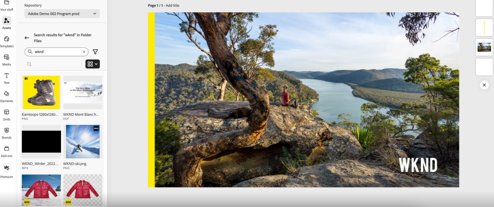
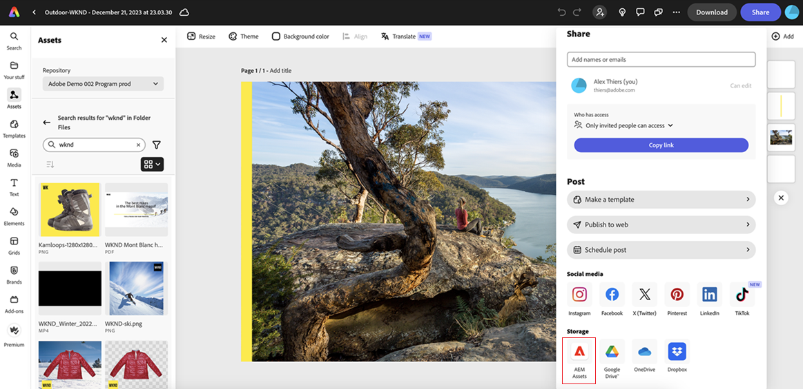

# Native integration with Adobe Express {#native-integration-adobe-express}

<table>
    <tr>
        <td>
            <i>New</i> <a href="/help/assets/dynamic-media/dm-prime-ultimate.md"><b>Dynamic Media Prime and Ultimate</b></a>
        </td>
        <td>
            <i>New</i> <a href="/help/assets/assets-ultimate-overview.md"><b>AEM Assets Ultimate</b></a>
        </td>
        <td>
            <i>New</i> <a href="/help/assets/integrate-aem-assets-edge-delivery-services.md"><b>AEM Assets integration with Edge Delivery Services</b></a>
        </td>
        <td>
            <i>New</i> <a href="/help/assets/aem-assets-view-ui-extensibility.md"><b>UI Extensibility</b></a>
        </td>
          <td>
            <i>New</i> <a href="/help/assets/dynamic-media/enable-dynamic-media-prime-and-ultimate.md"><b>Enable Dynamic Media Prime and Ultimate</b></a>
        </td>
    </tr>
    <tr>
        <td>
            <a href="/help/assets/search-best-practices.md"><b>Search Best Practices</b></a>
        </td>
        <td>
            <a href="/help/assets/metadata-best-practices.md"><b>Metadata Best Practices</b></a>
        </td>
        <td>
            <a href="/help/assets/product-overview.md"><b>Content Hub</b></a>
        </td>
        <td>
            <a href="/help/assets/dynamic-media-open-apis-overview.md"><b>Dynamic Media with OpenAPI capabilities</b></a>
        </td>
        <td>
            <a href="https://developer.adobe.com/experience-cloud/experience-manager-apis/"><b>AEM Assets developer documentation</b></a>
        </td>
    </tr>
</table>

AEM Assets integrates natively with Adobe Express, which allows you to directly access the assets stored in AEM Assets from within the Adobe Express user interface. You can place content managed in AEM Assets in the Express canvas and then save new or edited content in an AEM Assets repository. The integration provides the following key benefits:

* Increased content reuse by editing and saving new assets in AEM.

* Reduced overall time and effort  to create new assets or create new versions of existing assets.

## Prerequisites {#prerequisites}

Entitlements to access Adobe Express and at least one environment within AEM Assets. The environment can be any of the repositories within Assets as a Cloud Service or Assets Essentials.

## Use AEM Assets in Adobe Express editor {#use-aem-assets-in-express}

Perform the following steps to start using AEM Assets in Adobe Express editor:

1. Open the Adobe Express web application.

2. Open a new blank canvas by loading a new template or a project, or by creating an asset.

3. Click **[!UICONTROL Assets]** available in the left navigation pane. Adobe Express  displays the list of repositories that you are entitled to access along with the list of assets and folders available at the root-level.

4. Browse or search assets in your repository to drag & drop onto the canvas. You can filter assets using various available filters, such as file type, MIME type, and dimensions.

   >[!NOTE]
   >
   >Filter by dimension does not apply to videos.

   

## Save Adobe Express projects in AEM Assets {#save-express-projects-in-assets}

After incorporating appropriate modifications in the Express canvas, you can save it in the AEM Assets repository.. 

1. Click **[!UICONTROL Share]** to open the **[!UICONTROL Share]** dialog.

   

2. From the Storage section in the right pane, select **AEM Assets**. Adobe Express displays the upload dialog.
3. Select either **Current Page** or **All Pages**. Specify a name and format for the asset(s) to export. You can export the canvas contents in PNG, JPEG, PDF, MP4, MP4+PNG, or MP4+JPEG formats. The format adjusts automatically based on the asset(s) on the canvas page(s).
Selecting **Current Page** saves the asset on your current page to your destination folder. If you select **All Pages** and the export format is not PDF, all canvas pages are saved as separate files in a new folder within your destination folder. If the export format is PDF, all canvas pages are saved as a single PDF file in the destination folder.

4. Click the folder icon under **Destination Folder** to select a location and save the asset(s). 

   

5. Optional: You can add campaign metadata for your upload using the **Project or campaign name** field. You can use an existing name or create a new one. You can define multiple Project or Campaign names for your upload. To register the name, simply type the name and hit enter.
As a best practice, Adobe recommends specifying values in the rest of the fields as well as creating an enhanced search experience for your uploaded assets.

6. Similarly, define values for the **[!UICONTROL Keywords]** and **[!UICONTROL Channels]** fields.

7. Click **[!UICONTROL Upload]** to upload the asset(s) to AEM Assets.

## Limitations {#limitations}

1. For importing and exporting, the supported video file type is MP4.

2. For MP4 video import: 

   1. The maximum file size supported is 200 MB. If this limit exceeds, an alert message displays.
   2. The maximum supported resolution is 3840 X 3840 pixels.
   3. Videos with transparent backgrounds (alpha channel) are not supported.

3. For MP4 video export: 

   1. The maximum file size supported is 200 MB. If this limit exceeds, an alert suggests trimming the video to 200 MB or less, or manually uploading it to the AEM Assets destination folder after downloading it.

   
   
