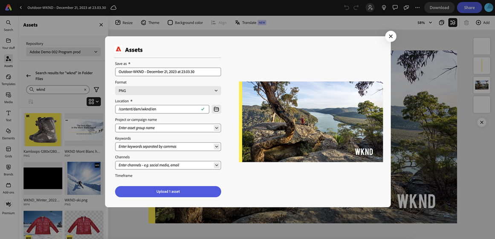

# Native integration with Adobe Express {#native-integration-adobe-express}

AEM Assets integrates natively with Adobe Express, which allows you to directly access the assets stored in AEM Assets from within the Adobe Express user interface. You can place content managed in AEM Assets in the Express canvas and then save new or edited content in an AEM Assets repository. The integration provides the following key benefits:

* Increased content reuse by editing and saving new assets in AEM.

* Reduced overall time and effort  to create new assets or create new versions of existing assets.

## Prerequisites {#prerequisites}

Entitlements to access Adobe Express and at least one environment within AEM Assets. The environment can be any of the repositories within Assets as a Cloud Service or Assets Essentials.

## Use AEM Assets in Adobe Express editor {#use-aem-assets-in-express}

Perform the following steps to start using AEM Assets in Adobe Express editor:

1. Open the Adobe Express web application.

1. Open a new blank canvas by loading a new template or a project, or by creating an asset.

1. Click **[!UICONTROL Assets]** available in the left navigation pane. Adobe Express  displays the list of repositories that you are entitled to access along with the list of assets and folders available at the root-level.

1. Browse or search assets in your repository to drag & drop onto the canvas. You can filter assets using various available filters, such as, file type, MIME type, and dimensions.

   

## Save Adobe Express projects in AEM Assets {#save-express-projects-in-assets}

After incorporating appropriate modifications in the Express canvas, you can save it in AEM Assets repository. 

1. Click **[!UICONTROL Share]** to open the **[!UICONTROL Share]** dialog.

   

1. Select **[!UICONTROL AEM Assets]** from the **[!UICONTROL Storage]** section available in the right pane. Adobe Express displays the upload dialog.
1. Specify a name and format for the asset. You can save the contents of the canvas in PNG or JPEG format types.

1. Click the folder icon adjacent to the **[!UICONTROL Location]** field, navigate to the location where you need to save the asset, and click **[!UICONTROL Select]**. The name of the folder displays in the **[!UICONTROL Location]** field.

   

1. Optional: You can add campaign metadata for your upload using the **[!UICONTROL Project or campaign name]** field. You can use an existing name or create a new one. You can define multiple Project or Campaign names for your upload. While you are typing a name, either click anywhere else within the dialog box or press the `,` (Comma) key to register the name.

   As a best practice, Adobe recommends specifying values in the rest of the fields as well as it creates an enhanced search experience for your uploaded assets.
1. Similarly, define values for the **[!UICONTROL Keywords]** and **[!UICONTROL Channels]** fields.

1. Click **[!UICONTROL Upload]** to upload the asset to AEM Assets.

   

## Limitations {#limitations}

There is a known bug experienced by some users with access to more than one Assets repository when saving a document with assets from multiple repositories.
