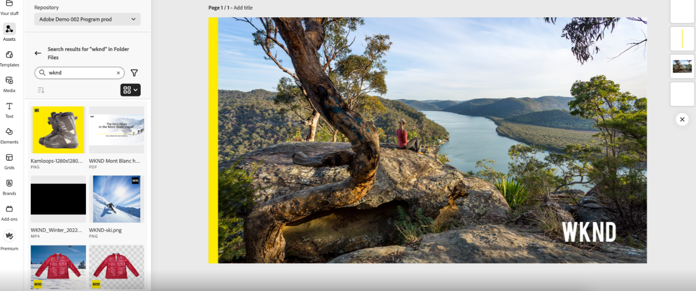
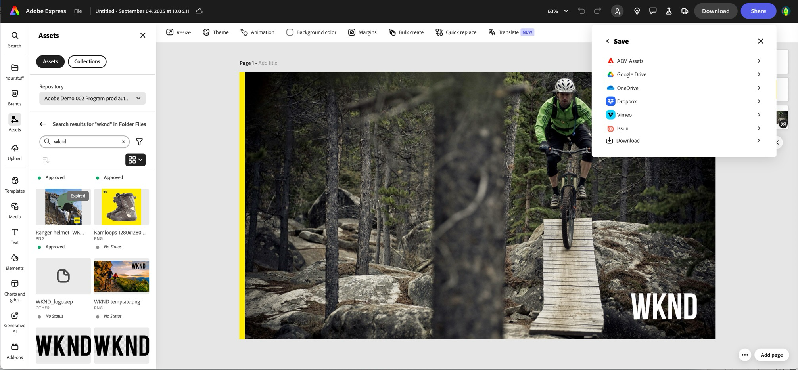

# Native integration with Adobe Express {#native-integration-adobe-express}

AEM Assets integrates natively with Adobe Express, which allows you to directly access the assets stored in AEM Assets from within the Adobe Express user interface. You can place content managed in AEM Assets in the Express canvas and then save new or edited content in an AEM Assets repository. The integration provides the following key benefits:

* Increased content reuse by editing and saving new assets in AEM.

* Reduced overall time and effort  to create new assets or create new versions of existing assets.

## Prerequisites {#prerequisites}

You must ensure the following prerequisites:

* Entitlements to access Adobe Express and at least one environment within AEM Assets. The environment can be any of the repositories within Assets as a Cloud Service or Assets Essentials.

* To access detailed upload and suggested Content Advisor capabilities, ensure that the `GenAI rider` entitlement is enabled.

## Use AEM Assets in Adobe Express editor {#use-aem-assets-in-express}

Perform the following steps to start using AEM Assets in Adobe Express editor:

1. Open the Adobe Express web application.

2. Open a new blank canvas by loading a new template or a project, or by creating an asset.

3. Click **[!UICONTROL Assets]** available in the left navigation pane. Adobe Express  displays the list of repositories that you are entitled to access along with the list of assets and folders available at the root-level.

4. Browse or search for assets in your repository, then drag and drop them onto the canvas. Alternatively, click on the assets to place them onto the canvas. You can also filter  assets by various criteria, such as file type, MIME type, and dimensions.

   >[!NOTE]
   >
   >Filter by dimension does not apply to videos.

   

5. Under **[!UICONTROL Suggested Content]**, the Content Advisor displays related or similar assets based on the content currently being authored. Using metadata, tags, categories, keywords, or AI-based similarity analysis, it identifies content that closely matches the selected asset in terms of topic, style, format, or intended usage. Use the **[!UICONTROL Show]** or **[!UICONTROL Hide]** toggle to display or collapse the content suggestions. If the suggested assets are not relevant, click the refresh icon  to regenerate updated recommendations. [Browse Assets in Content Advisor](#browse-assets-content-advisor).

## Browse assets using Content Advisor {#browse-assets-content-advisor}
    
Within assets tab, you can access content by browsing [Files and folders](#content-advisor-files-and-folders) or viewing [Collections](#content-advisor-collections).

### Files and Folders tab{#content-advisor-files-and-folders}

Browsing content using Files and Folders allows you navigate your assets in a familiar hierarchical structure, making it easy to locate assets within the repository. To browse assets within files and folders, navigate to the **[!UICONTROL Assets]** tab and select **[!UICONTROL Files & Folders]**. A hierarchical structure is then displayed, allowing you to easily locate and select the desired assets.

### Collections tab{#content-advisor-collections}

Browsing content using Collections allows you to access curated groups of assets within Collections. To browse assets within Collections, navigate to the **[!UICONTROL Assets]** tab and select **[!UICONTROL Collections]**. The interface then displays curated groups of assets, enabling you to browse the content you need.

### Replace image using AEM upload {#replace-image-using-aem-upload}

Additionally, you can replace the added images using **[!UICONTROL AEM Upload]**. To do this, execute the following steps:

1. Browse or search assets and drag & drop onto the canvas.

1. Select the image which you want to replace. Click **[!UICONTROL Replace]** and select **[!UICONTROL AEM Assets]** among various other options.

    

1. **[!UICONTROL AEM Upload]** panel opens in the left navigation pane. Adobe Express  displays the list of repositories that you are entitled to access along with the list of assets and folders available at the root-level. Select an asset from there to preview the replacement on the canvas, then click **[!UICONTROL Replace]** to confirm. 

    >[!NOTE]
    >
    > SVG file types are not supported.

## Save Adobe Express projects in AEM Assets {#save-express-projects-in-assets}

After incorporating appropriate modifications in the Express canvas, you can save it in the AEM Assets repository.

1. Click **[!UICONTROL Share]** to open the **[!UICONTROL Share]** dialog.

   

2. From the **[!UICONTROL Recommended]** section in the right pane, select **AEM Assets**. Adobe Express displays the upload dialog.

   

3. Select either **Current Page** or **All Pages**. Specify a name and format for the asset(s) to export. You can export the canvas contents in PNG, JPEG, PDF, MP4, MP4+PNG, or MP4+JPEG formats. The format adjusts automatically based on the asset(s) on the canvas page(s).
Selecting **Current Page** saves the asset on your current page to your destination folder. If you select **All Pages** and the export format is not PDF, all canvas pages are saved as separate files in a new folder within your destination folder. If the export format is PDF, all canvas pages are saved as a single PDF file in the destination folder.

4. Click the folder icon under **Destination Folder** to select a location and save the asset(s). 

   

5. Optional: You can add campaign metadata for your upload using the **Project or campaign name** field. You can use an existing name or create a new one. You can define multiple Project or Campaign names for your upload. To register the name, simply type the name and hit enter.
As a best practice, Adobe recommends specifying values in the rest of the fields as well as creating an enhanced search experience for your uploaded assets.

6. Similarly, define values for the **[!UICONTROL Keywords]** and **[!UICONTROL Channels]** fields.

7. Click **[!UICONTROL Upload]** to upload the asset(s) to AEM Assets.

<table> 
    <tbody>
     <tr>
      <th><strong>Supported formats</strong></th>
      <th><strong>Size</strong></th>
     </tr>
    </tr>
    <tr>
        <td>[!UICONTROL JPEG]</td>
        <td> 65MP (For example, 8K x 8K or 16K x 4K) </td>
    </tr>
    <tr>
        <td>[!UICONTROL PNG]</td>
        <td> 65MP (For example, 8K x 8K or 16K x 4K) </td>
    </tr>
    <tr>
        <td>[!UICONTROL SVG]</td>
        <td> Maximum 250 KB</td>
    </tr>
    <tr>
        <td>[!UICONTROL MP4]</td>
        <td> 3840 X 3840 pixels, Maximum 200 MB</td>
    </tr>
    <tr>
      <td colspan="2"> <i> The asset size must be less than 80 MB for desktop devices and 40 MB for mobile devices. </i></td>
   </tr>
    </tbody>
</table>

## Limitations {#limitations}

1. For importing and exporting, the supported video file type is MP4.

2. For **MP4 video import**, videos with transparent backgrounds (alpha channel) are not supported.
   <!--
   1. The maximum file size supported is 200 MB. If this limit exceeds, an alert message displays.
   2. The maximum supported resolution is 3840 X 3840 pixels.
   3. Videos with transparent backgrounds (alpha channel) are not supported.
   -->

3. For **MP4 video export**, the maximum file size supported is 200 MB. If this limit exceeds, an alert suggests trimming the video to 200 MB or less, or manually uploading it to the AEM Assets destination folder after downloading it.

<!--
## Content Advisor Properties {#content-advisor-props}

You can configure following properties for the content advisor:

* `featureSet` : This property enables the Content Advisor MFE.

    ```
    featureSet: [
        ...defaultFeatures, /* to include all default features */
        'advisor', /* enables Content Advisor features */
        'content-fragments', /* enables Content Fragments */
    ],
    ```

* `rail:true/false` : If marked true, Content Advisor is rendered in a left rail view. If it is marked false, the Content Advisor is rendered in modal view.

## Browse assets using Content Advisor {#browse-assets-content-advisor}

<!--In the Modal View of Content Advisor, you can access both [Assets](#using-assets-tab) and [Content Fragments](#using-content-fragments) within a unified interface.

### Assets tab{#assets-tab}

The **[!UICONTROL Assets]** tab allows you to browse or filter available assets, preview them before selection, and choose appropriate **[!UICONTROL Dynamic Media]** [renditions](renditions.md) or [smart crops](/help/assets/dynamic-media/image-profiles.md#creating-image-profiles) as needed. Assets, folders, and collections are presented together in a single, streamlined experience. The interface also provides contextual recommendations based on the integrated application context, helping you quickly identify relevant content.

Within assets tab, you can access content by browsing [Files and folders](#content-advisor-files-and-folders) or viewing [Collections](#content-advisor-collections).

### Files and Folders tab{#content-advisor-files-and-folders}

Browsing content using Files and Folders allows you navigate your assets in a familiar hierarchical structure, making it easy to locate assets within the repository. To browse assets within files and folders, navigate to the **[!UICONTROL Assets]** tab and select **[!UICONTROL Files & Folders]**. A hierarchical structure is then displayed, allowing you to easily locate and select the desired assets.


### Collections tab{#content-advisor-collections}

Browsing content using Collections allows you to access curated groups of assets within Collections. To browse assets within Collections, navigate to the **[!UICONTROL Assets]** tab and select **[!UICONTROL Collections]**. The interface then displays curated groups of assets, enabling you to browse the content you need.


<!--
### Content Fragments tab{#content-fragments}

The [Content Fragments](/help/assets/content-fragments/content-fragments.md) tab displays structured assets, allowing you to browse, search, and filter fragments efficiently within the same interface. To browse assets using Content Fragments, navigate to the **[!UICONTROL Content Fragments]** tab to access and explore the fragments available in the repository.


-->


