# Native integration with Adobe Express {#native-integration-adobe-express}

Adobe Experience Manager (AEM) Assets integrates natively with Adobe Express, allowing you to discover, access, and use assets from your AEM Assets repository directly within the Express interface. 

With Content Advisor available with this integration, you can receive intelligent, context-aware asset recommendations based on your canvas content or campaign brief, and select channel-ready Dynamic Media renditions optimized for your use case. 

You can also place assets in the Express canvas and save new or edited content back to AEM Assets, ensuring centralized asset management and governance. The integration provides the following key benefits:

* Accelerated content creation with context-aware asset discovery and recommendations.

* Increased content reuse by editing existing assets and saving new assets to AEM Assets.

* Faster access to approved, channel-optimized Dynamic Media renditions.

* Reduced time and effort to create new assets or new versions while maintaining brand consistency.

## Prerequisites {#prerequisites}

Entitlements to access Adobe Express and at least one environment within AEM Assets. The environment can be any of the Assets as a Cloud Service repositories.

## Use AEM Assets in Adobe Express editor {#use-aem-assets-in-express}

Perform the following steps to start using AEM Assets in Adobe Express editor:

1. Open the Adobe Express web application.

2. Open a new blank canvas by loading a new template or a project, or by creating an asset.

3. Click **[!UICONTROL Assets]** available in the left navigation pane. Adobe Express  displays [Content Advisor](#intelligent-asset-discovery-content-advisor), which lists the repositories that you are entitled to access along with the list of assets and folders available at the root-level.

4. Browse or search for assets in your repository using [Content Advisor](#intelligent-asset-discovery-content-advisor), then drag and drop them onto the canvas. Alternatively, click on the assets to place them onto the canvas. You can also filter  assets by various criteria, such as file type, MIME type, and dimensions.

   >[!NOTE]
   >
   >Filter by dimension does not apply to videos.

   

## Intelligent asset discovery with Content Advisor {#intelligent-asset-discovery-content-advisor}    

Content Advisor transforms how you discover and use assets in Adobe Express by bringing intelligent, context-aware asset discovery directly to your creative workflow. Instead of searching for assets by typing keywords, Content Advisor surfaces relevant, approved assets based on your canvas content, campaign brief, and intent, helping you find the right asset faster.

With smart suggestions, access to Dynamic Media renditions, and full visibility into asset metadata, Content Advisor enables you to efficiently locate, evaluate, and use assets from AEM Assets without leaving Adobe Express. This ensures faster content creation, improved asset reuse, and consistent use of approved, brand-compliant assets.

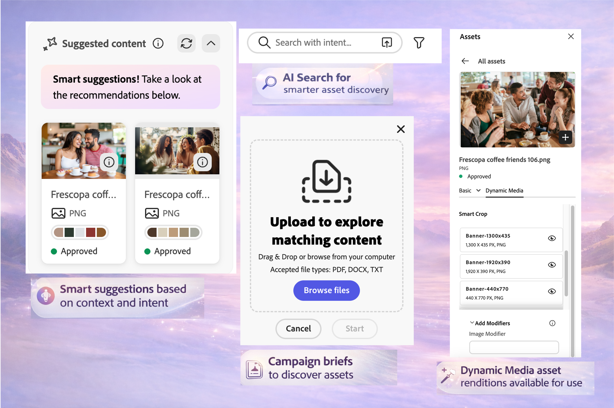

>[!IMPORTANT]
> 
>Ensure that you select an **author** repository from the **Repository** drop-down list. A **delivery** repository does not display Content Advisor features. 

### AI Search for smarter asset discovery {#content-advisor-ai-search}

Content Advisor uses an advanced search capability that understands the meaning and intent behind a user's query rather than relying on exact keyword matches. It uses Artificial Intelligence (AI) and machine learning to deliver more accurate and context-aware results.

Unlike traditional keyword-based search, which looks for exact terms, AI Search interprets relationships between words, concepts, and user intent. This ensures that users find what they are looking for—even if their query is phrased differently, contains typos, or is in another language.


Some if its key benefits include:

   * Multilingual support: Search across multiple languages without requiring exact translations. Users can find relevant content regardless of their query language.

   * Handles misspellings: Interprets typos and spelling errors, ensuring accurate results even with imperfect input.

   * Understands synonyms: Delivers results for related terms and phrases, so users do not need to guess the right keyword.

   * Context-Aware search: Recognizes the intent behind a query, not just the exact words.

   >[!IMPORTANT]
   > 
   >* Minimum required AEM release version to access AI Search within Content Advisor is `21994`.
   

### Smart suggestions based on context and intent {#smart-suggestions-content-advisor}

 Content Advisor displays smart suggestions based on the context and intent of the content in the Express canvas. This helps you quickly discover and use assets that align with your content needs without the time-consuming manual search.

   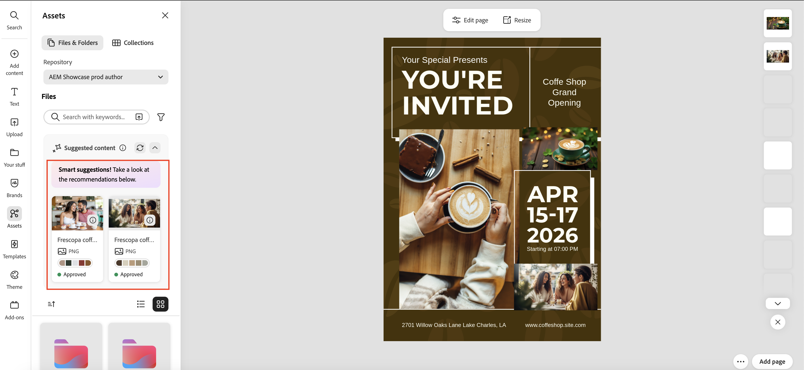

Click  to view asset metadata available in the **[!UICONTROL Basic]** tab or  view Dynamic Media renditions available in the [Dynamic Media](#dynamic-media-renditions-content-advisor) tab. Drag and drop the suggested content onto the canvas. Alternatively, click the asset to place them automatically onto the canvas.

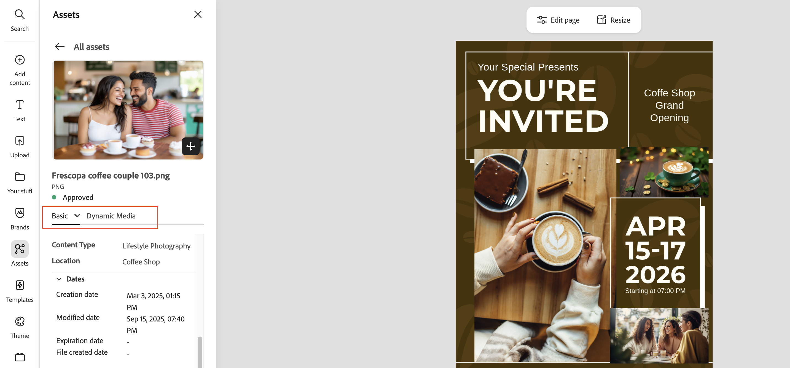

   >[!IMPORTANT]
   > 
   >* Content Advisor displays smart suggestions based on the context and intent of the content available in the text layers or the title in the Express canvas. It does not display results based on the images available in the canvas.
   >* You must sign a GenAI Rider to access this feature within Content Advisor. To sign GenAI rider, contact your Adobe representative.
   >* Minimum required AEM release version to access this feature is `21994`.
   

### Campaign briefs to discover relevant assets {#campaign-briefs-content-advisor}

Content Advisor allows you to upload a campaign brief document to discover relevant assets without manually entering search keywords. Content Advisor analyzes the information in the campaign brief to understand the campaign's intent and recommends relevant assets from your AEM Assets repository.

  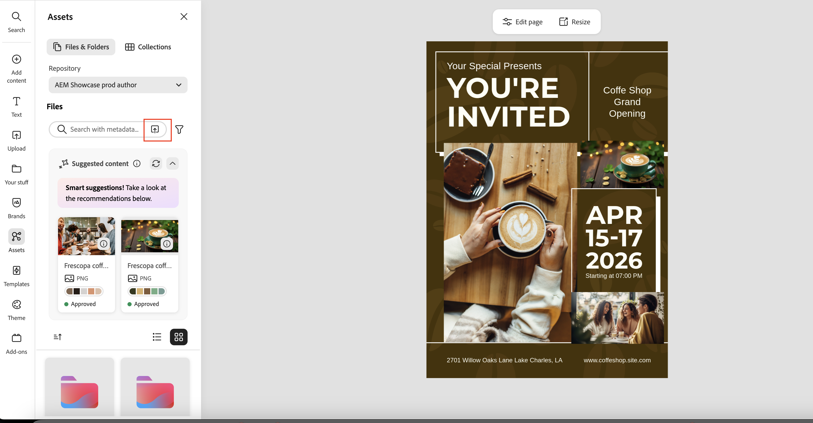

   >[!IMPORTANT]
   >
   >* Content Advisor analyzes the information available as text in the campaign brief to recommend relevant assets. It does not analyze the information available as images in the campaign brief.
   >* The supported file types that you can upload as a campaign brief include PDF, DOCX, and TXT documents. 
   >* You must sign a GenAI Rider to access this feature within Content Advisor. To sign GenAI rider, contact your Adobe representative.
   >* Minimum required AEM release version to access this feature is `21994`.

### Dynamic Media asset renditions available for use {#dynamic-media-renditions-content-advisor}

Dynamic Media renditions provide ready-to-use, channel-optimized versions of assets, including [image presets](/help/assets/dynamic-media/managing-image-presets.md), [Smart Crops](/help/assets/dynamic-media/image-profiles.md), format types, and color profiles. These renditions help ensure that the selected asset meets channel and design requirements without requiring manual editing or asset duplication.

You can also apply Dynamic Media modifiers to preview adjustments in real-time before placing the rendition on the Express canvas, enabling faster selection of the most appropriate rendition while maintaining asset consistency and quality.

Click the  icon on the asset card and select the  **[!UICONTROL Dynamic Media]** tab to view the available renditions for an asset. You can select to view [Dynamic Media Scene7](/help/assets/dynamic-media/dynamic-media.md) renditions or [Dynamic Media with OpenAPI](/help/assets/dynamic-media-open-apis-overview.md) renditions. When you select **[!UICONTROL OpenAPI]** for an asset, the available renditions display only if the asset is approved and published to Dynamic Media with OpenAPI.

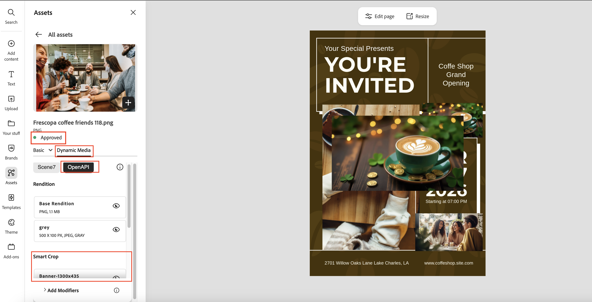

Click the  icon to preview the rendition or click the rendition name to place them automatically onto the canvas. You can also preview the rendition and then drag and drop it to place the image onto canvas.

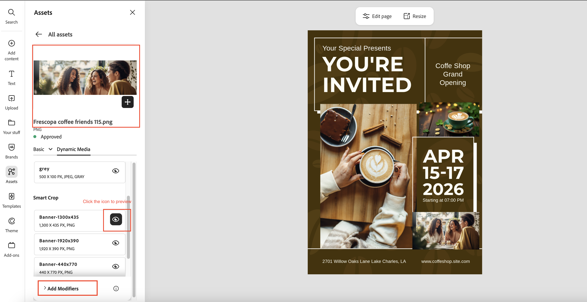

Click **[!UICONTROL Add Modifiers]**, specify a modifier in the text box, and press Enter to apply the transformation to the renditions in real-time. Similarly, you can add multiple modifiers to a rendition and preview those transformations. Drag and drop the asset from the preview onto the canvas. The rendition after applying those modifiers is not saved. See the list of supported modifiers for [Dynamic Media Scene7](https://experienceleague.adobe.com/en/docs/dynamic-media-developer-resources/image-serving-api/image-serving-api/http-protocol-reference/command-reference/c-command-reference) and [Dynamic Media with OpenAPI](https://developer.adobe.com/experience-cloud/experience-manager-apis/api/stable/assets/delivery/#operation/getAssetSeoFormat).

>[!IMPORTANT]
> 
>Dynamic Media helps overcome the 80MB upload file size limitation in Adobe Express (web) by providing optimized renditions of large assets. Dynamic Media renditions significantly reduce file size while preserving visual quality. For example, a 300MB TIFF asset can be delivered as a 2.5MB rendition without compromising quality, enabling efficient use of high-resolution assets in Adobe Express.

### Access asset metadata consistent with Assets view {#asset-metadata-content-advisor}

Content Advisor provides access to asset properties defined in AEM Assets, including metadata available in the Assets view. This allows you to review key asset details such as title, description, format, size, and other metadata before selecting an asset. Access to asset properties helps ensure you choose the correct and approved asset for your content.

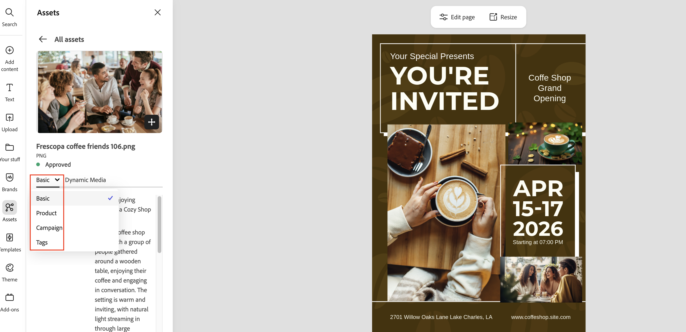

Click the  icon on the asset card and select the  **[!UICONTROL Basic]** tab to view asset metadata. You can also view other asset metadata tabs such as, Product, Campaign, and Tags, consistent with the asset metadata that exist in Assets view.

### Access filters consistent with Assets view {#filters-content-advisor}

Content Advisor provides the same filtering capabilities available in the Assets view, enabling you to refine assets using predefined filters. Same filtering capabilities apply to the filters available for all asset types, such as files, folders, and collections. This ensures a consistent asset discovery experience and helps you efficiently locate relevant assets within Adobe Express.

### Access and reuse recent and saved searches {#saved-searches-content-advisor}

Content Advisor saves your recent searches and also allows you to save frequently used searches for quick access later. Saved searches created in the Assets view are also available, enabling you to reuse predefined search criteria. This helps you efficiently locate assets using consistent search patterns across AEM Assets and Adobe Express.

To save your frequently used search using Content Advisor:

1. Specify a search term (optional), click the filters icon, and select the options based on your requirements to create a search query.

1. Click **[!UICONTROL Apply]** to view the results.

1. Click the filters icon > **Manage saved searches** > **Create new Saved Search**.

1. Specify the name of the search and click  to save it. The search displays in the list of items.

To apply the any of the saved search items, click the filters icon, select the search item from the **[!UICONTROL Saved Searches]** drop-down list and click **[!UICONTROL Apply]**.


### Search for assets across and within collections {#search-collections-content-advisor}

Content Advisor allows you to search for assets across all collections or limit your search to a specific collection. This helps you quickly locate and use assets from curated collections while preserving their intended organizational context.

## Replace image using AEM upload {#replace-image-using-aem-upload}

Additionally, you can replace the added images using **[!UICONTROL AEM Upload]**. To do this, execute the following steps:

1. Browse or search assets and drag & drop onto the canvas.

1. Select the image which you want to replace. Click **[!UICONTROL Replace]** and select **[!UICONTROL AEM Assets]** among various other options.

    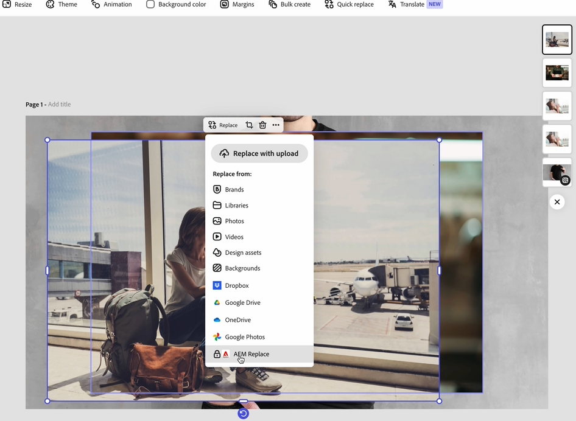

1. [Content Advisor](#intelligent-asset-discovery-content-advisor) opens in the left navigation pane. Adobe Express  displays the list of repositories that you are entitled to access along with the list of assets and folders available at the root-level. Select an asset from there to preview the replacement on the canvas, then click **[!UICONTROL Replace]** to confirm. 

    >[!NOTE]
    >
    > SVG file types are not supported.

## Save Adobe Express projects in AEM Assets {#save-express-projects-in-assets}

After incorporating appropriate modifications in the Express canvas, you can save it in the AEM Assets repository.

1. Click **[!UICONTROL Share]** to open the **[!UICONTROL Share]** dialog.

   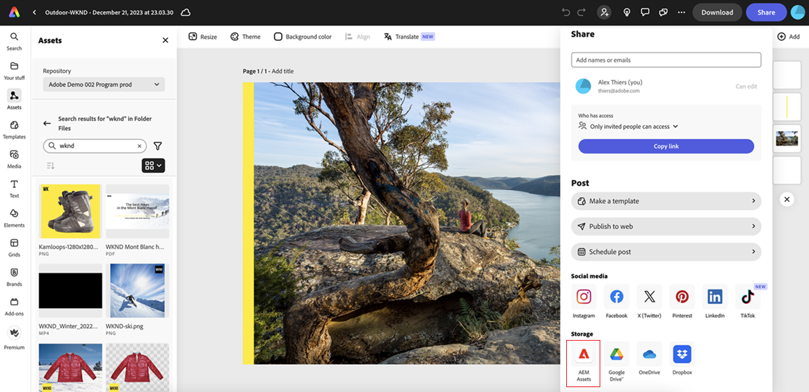

2. Select **AEM Assets**. Adobe Express displays the upload dialog.

3. Select either **Current Page** or **All Pages**. Specify a name and format for the asset(s) to export. You can export the canvas contents in PNG, JPEG, PDF, MP4, MP4+PNG, or MP4+JPEG formats. The format adjusts automatically based on the asset(s) on the canvas page(s).
Selecting **Current Page** saves the asset on your current page to your destination folder. If you select **All Pages** and the export format is not PDF, all canvas pages are saved as separate files in a new folder within your destination folder. If the export format is PDF, all canvas pages are saved as a single PDF file in the destination folder.

4. Click the folder icon under **Destination Folder** to select a location and save the asset(s). 

   

5. Optional: You can add campaign metadata for your upload using the **Project or campaign name** field. You can use an existing name or create a new one. You can define multiple Project or Campaign names for your upload. To register the name, simply type the name and hit enter.
As a best practice, Adobe recommends specifying values in the rest of the fields as well as creating an enhanced search experience for your uploaded assets.

6. Similarly, define values for the **[!UICONTROL Keywords]** and **[!UICONTROL Channels]** fields.

7. Click **[!UICONTROL Upload]** to upload the asset(s) to AEM Assets.

   <table> 
    <tbody>
     <tr>
      <th><strong>Supported formats</strong></th>
      <th><strong>Size</strong></th>
     </tr>
    </tr>
    <tr>
        <td>[!UICONTROL JPEG]</td>
        <td> 65MP (For example, 8K x 8K or 16K x 4K) </td>
    </tr>
    <tr>
        <td>[!UICONTROL PNG]</td>
        <td> 65MP (For example, 8K x 8K or 16K x 4K) </td>
    </tr>
    <tr>
        <td>[!UICONTROL SVG]</td>
        <td> Maximum 250 KB</td>
    </tr>
    <tr>
        <td>[!UICONTROL MP4]</td>
        <td> 3840 X 3840 pixels, Maximum 200 MB</td>
    </tr>
    <tr>
      <td colspan="2"> <i> The asset size must be less than 80 MB for desktop devices and 40 MB for mobile devices. </i></td>
   </tr>
    </tbody>
   </table>

## Limitations {#limitations}

1. For importing and exporting, the supported video file type is MP4.

2. For **MP4 video import**, videos with transparent backgrounds (alpha channel) are not supported.
   <!--
   1. The maximum file size supported is 200 MB. If this limit exceeds, an alert message displays.
   2. The maximum supported resolution is 3840 X 3840 pixels.
   3. Videos with transparent backgrounds (alpha channel) are not supported.
   -->

3. For **MP4 video export**, the maximum file size supported is 200 MB. If this limit exceeds, an alert suggests trimming the video to 200 MB or less, or manually uploading it to the AEM Assets destination folder after downloading it.

<!--
## Content Advisor Properties {#content-advisor-props}

You can configure following properties for the content advisor:

* `featureSet` : This property enables the Content Advisor MFE.

    ```
    featureSet: [
        ...defaultFeatures, /* to include all default features */
        'advisor', /* enables Content Advisor features */
        'content-fragments', /* enables Content Fragments */
    ],
    ```

* `rail:true/false` : If marked true, Content Advisor is rendered in a left rail view. If it is marked false, the Content Advisor is rendered in modal view.

## Browse assets using Content Advisor {#browse-assets-content-advisor}

<!--In the Modal View of Content Advisor, you can access both [Assets](#using-assets-tab) and [Content Fragments](#using-content-fragments) within a unified interface.

### Assets tab{#assets-tab}

The **[!UICONTROL Assets]** tab allows you to browse or filter available assets, preview them before selection, and choose appropriate **[!UICONTROL Dynamic Media]** [renditions](renditions.md) or [smart crops](/help/assets/dynamic-media/image-profiles.md#creating-image-profiles) as needed. Assets, folders, and collections are presented together in a single, streamlined experience. The interface also provides contextual recommendations based on the integrated application context, helping you quickly identify relevant content.

Within assets tab, you can access content by browsing [Files and folders](#content-advisor-files-and-folders) or viewing [Collections](#content-advisor-collections).

### Files and Folders tab{#content-advisor-files-and-folders}

Browsing content using Files and Folders allows you navigate your assets in a familiar hierarchical structure, making it easy to locate assets within the repository. To browse assets within files and folders, navigate to the **[!UICONTROL Assets]** tab and select **[!UICONTROL Files & Folders]**. A hierarchical structure is then displayed, allowing you to easily locate and select the desired assets.

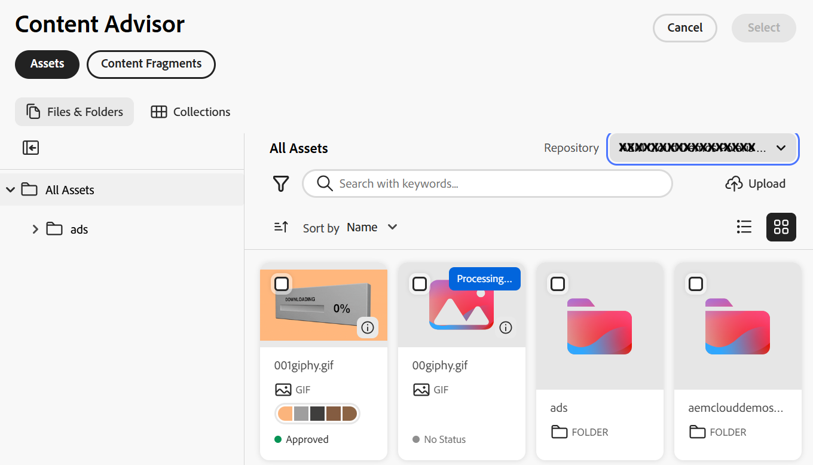

### Collections tab{#content-advisor-collections}

Browsing content using Collections allows you to access curated groups of assets within Collections. To browse assets within Collections, navigate to the **[!UICONTROL Assets]** tab and select **[!UICONTROL Collections]**. The interface then displays curated groups of assets, enabling you to browse the content you need.

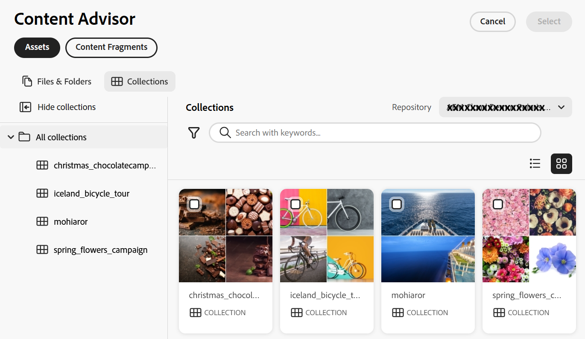

<!--
### Content Fragments tab{#content-fragments}

The [Content Fragments](/help/assets/content-fragments/content-fragments.md) tab displays structured assets, allowing you to browse, search, and filter fragments efficiently within the same interface. To browse assets using Content Fragments, navigate to the **[!UICONTROL Content Fragments]** tab to access and explore the fragments available in the repository.

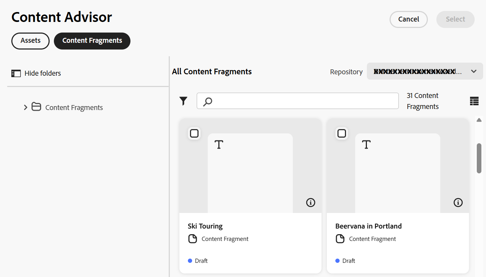
-->


