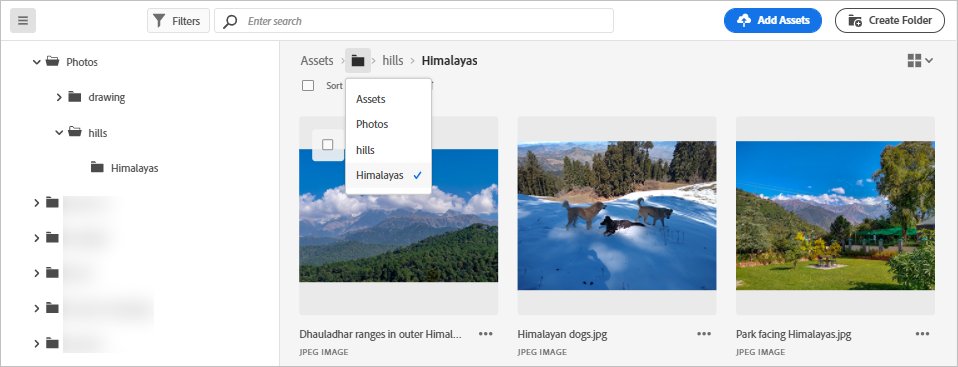
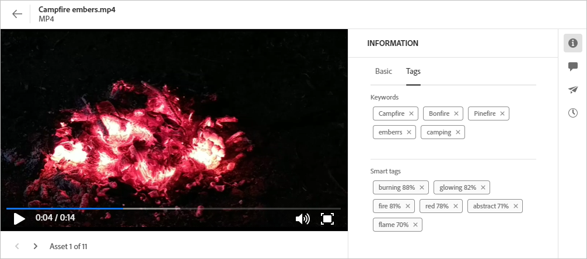

# Navigate to files and folders and view assets {#view-assets-and-details}

| [Search Best Practices](/help/assets/search-best-practices.md) |[Metadata Best Practices](/help/assets/metadata-best-practices.md)|[Content Hub](/help/assets/product-overview.md)|[Dynamic Media with OpenAPI capabilities](/help/assets/dynamic-media-open-apis-overview.md)|[AEM Assets developer documentation](https://developer.adobe.com/experience-cloud/experience-manager-apis/)|
| ------------- | --------------------------- |---------|----|-----|

<!-- TBD: Give screenshots of all views with many assets. Zoom out to showcase how the thumbnails/tiles flow on the UI in different views. -->

<!-- TBD: The options in left sidebar may change. Shared with me and Shared by me are missing for now. Update this section as UI is updated. -->

## Understand the [!DNL Assets view] user interface {#understand-interface-navigation}

[!DNL Assets view] offers an intuitive and user-friendly user interface. The clean interface makes assets and related information easy to find and remember.

When you log into [!DNL Assets view], you see the following interface.

![[!DNL Assets view] user interface](assets/assets-view-interface.png)

**A**: Left sidebar to browse repository and provides access to a few other options **B**: Display or collapse the left sidebar to increase asset-viewing area **C**: Filter search results **D**: Select all contents of the selected folder **E**: Options to sort assets **F**: Search box **G**: Upload or drag and drop files using `Add Assets` button **H**: Create a new folder **I**: Switch between different views

<!-- TBD: Need an embedded video here with narration. It has to be hosted on MPC to be embeddable. -->

## Browse and view assets and folders {#browse-repository}

You can browse the folders from the main user interface or from the left sidebar. Experience Manager Assets displays visual previews of folder contents on the folder thumbnail when browsing or searching for content. This improves the discoverability of assets available within AEM Assets repository. This folder thumbnail saves your time spent on searching specific assets within a folder in AEM Assets repository.
When browsing through assets in a folder, you can use the interface to view asset thumbnails to visually browse the repository or view asset details to quickly find the asset you want. The options available in the left sidebar are:

* [My Workspace](/help/assets/my-workspace-assets-view.md): Assets now includes a customizable workspace that provides widgets for convenient access to key areas of the Assets user interface and information that is most relevant to you. This page serves as a one-stop solution to provide an overview of your work items and to give quick access to key workflows. More convenient access to these options increases your efficiency and content velocity.
* [Tasks](/help/assets/my-workspace-assets-view.md): You can view the tasks assigned to you under **My tasks** tab. Whereas, the tasks that are created by you can be viewed under **Assigned tasks** tab. Also, the tasks that you complete are located under **Completed tasks** tab.
* [Assets](/help/assets/manage-organize-assets-view.md): List of all folders in a tree view, that you have access to.
* **Recently Viewed**: List of assets that you previewed recently. [!DNL Assets view] displays only the assets that you preview. It does not display the assets that you scroll past when browsing the repository files or folders.
* [Collections](/help/assets/manage-collections-assets-view.md): A collection is a set of assets, folders, or other collections within Adobe Experience Manager Assets view. Use collections to share assets between users. Unlike folders, a collection can include assets from different locations. You can share multiple collections with a user. Each collection contains references to assets. The referential integrity of assets is maintained across collections.

* [Insights](/help/assets/manage-reports-assets-view.md#view-live-statistics): In [!DNL Assets view], you can view real-time insights on your dashboard. Assets view enables you to view real-time data for your Assets view environment with the Insights dashboard. You can view real-time event metrics during the last 30 days or for the last 12 months. 
* **Trash**: List the assets deleted from the root **[!UICONTROL Assets]** folder. You can select an asset in the Trash folder to restore it to its original location or permanently delete it. You can specify a keyword or apply filters such as asset status, file type, mime type, image size, asset creation, modification, and expiration dates, as well as filtering by assets discarded by the current user. You can also apply custom filters to search appropriate assets within the Trash folder. For more information on using standard and custom filters, see how to [search assets in Assets view](/help/assets/search-assets-view.md).
* **Settings**: You can configure various options of Assets view using **Settings**, such as, Metadata forms, Reports, and Taxonomy Management.

<!-- TBD: Not sure if we want to publish these right now. CC Libs are beta as per Greg.
* **Libraries**: Access to [!DNL Adobe Creative Cloud Team] (CCT) Libraries view. This view is visible only if the user is entitled to CCT Libraries.
-->

<!-- TBD: My Work Space shows task inbox and it is not visible on AEM Cloud Demos as of now. It is the source of truth server hence not documenting My Work Space option for now.
-->

You can open or collapse the left sidebar to increase the available asset-viewing area.

In [!DNL Assets view], you can view assets, folders, and search results in four different types of layouts.

*  [!UICONTROL List View]
*  [!UICONTROL Grid View]
*  [!UICONTROL Gallery View]
*  [!UICONTROL Waterfall View]

To locate an asset, you can sort the assets in ascending or descending order of `Name`, `Relevancy`, `Size`, `Modified`, and `Created`.

To navigate in a folder, double-click the folder's thumbnails or select the folder from the left sidebar. To view details of a folder, select it and click Details from the toolbar at the top. To navigate up and down the hierarchy, either use the left sidebar or use the breadcrumbs at the top.

*Figure: To browse the hierarchy, use the breadcrumbs at the top or the left sidebar.*

## Preview assets {#preview-assets}

Before you use, share, or download an asset, you can view it more closely. The preview feature lets you view not just the images but a few other supported asset types.

To preview an asset, select it and click [!UICONTROL Details]  from the toolbar at the top. You cannot only view the asset but also view its detailed metadata and take other actions.

**A**: Return to the current folder or current search result in the repository **B**: Name and format for the file you are previewing **C**: Assign tasks **D**: Advanced metadata **E**: Keywords and smart tags **F**: Comment and annotate **G**: View tasks related to the selected Asset **H**: View and manage versions **I**: View renditions of the image **J**: Edit image **K**: View Dynamic Media renditions including Smart Crop and Dynamic Media with OpenAPI capabilities renditions. **L**: Basic metadata **M**: Advanced metadata **N**: Keywords and smart tags **O**: Proceed to previous or next asset in the current folder without going back to the folder **P**: Preview more closely. Zoom, full screen, and other options.

You can also preview videos.

If you explicitly preview an asset, then [!DNL Assets view] displays it as a recently viewed asset.

<!-- TBD: Describe the options.

Explicitly previewed assets are displayed as recently viewed assets. Give screenshot of this.
Other use cases after previewing.
-->

## Next Steps {#next-steps}

* Provide product feedback using the [!UICONTROL Feedback] option available on the Assets view user interface

* Provide documentation feedback using [!UICONTROL Edit this page]  or [!UICONTROL Log an issue]  available on the right sidebar

* Contact [Customer Care](https://experienceleague.adobe.com/?support-solution=General#support)

>[!MORELIKETHIS]
>
>* [View versions of an asset](/help/assets/manage-organize-assets-view.md#view-versions).
