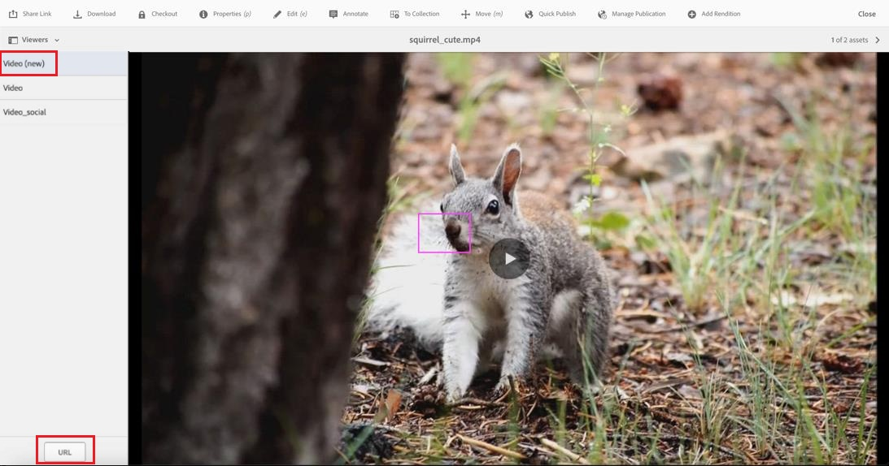

# New Video Viewer in Dynamic Media {#new-video-viewer-dynamic-media}

The New Video Viewer for Dynamic Media provides a modernized video playback experience in Adobe Experience Manager (AEM). It delivers a consistent and extensible viewing experience across authoring, preview, and Sites environments, while continuing to work with existing Dynamic Media workflows.

Existing video viewers in Dynamic Media support core playback requirements but provide limited extensibility and event-level integration for modern analytics and integration scenarios.

The New Video Viewer addresses these limitations by:

* Providing a more consistent playback experience  
* Allowing explicit viewer selection  
* Emitting structured playback events for programmatic consumption  
* Supporting integration with external analytics and external systems  

The viewer is available as an additional option and requires explicit selection where supported. It does not automatically replace existing video viewers.

The New Video Viewer is intended for organizations that require an enhanced and extensible video experience without disrupting existing implementations.

> **NOTE**
>
> The New Video Viewer is a limited availability feature. You can get it enabled by creating a [support ticket](https://helpx.adobe.com/enterprise/using/support-for-experience-cloud.html).

## How the New Video Viewer works {#how-it-works}

The New Video Viewer works as follows:

1. A video asset is ingested into a folder that is synced with Dynamic Media.
2. The video can be previewed from the asset details page using **Video (new)**.
3. The New Video Viewer can be selected in the **Dynamic Media** component when authoring Sites pages.
4. During playback, the viewer emits structured events to the parent window.
5. Optional viewer modifiers can be used to control playback behavior.

## Key differences from the existing Video Viewer {#key-differences}

| Area | Description |
|------|-------------|
| Viewer availability | Appears as a new option named **Video (new)** |
| Viewer selection | Must be explicitly selected |
| Extensibility | Emits structured playback events |
| Integration | Continues to work with existing Dynamic Media workflows |

## Prerequisites {#prerequisites}

Before using the New Video Viewer, ensure the following prerequisites are met:

| Requirement | Description |
|------------|-------------|
| Dynamic Media sync | The asset folder must be synced with Dynamic Media. |
| Video profile | A video profile must be applied to the folder. |
| Video asset | A video must be ingested into the folder. |

The New Video Viewer is available starting with **AEM as a Cloud Service version 2025.7.0**.

To enable or disable the New Video Viewer, contact Adobe Customer Care.

## Preview the New Video Viewer {#preview}

Execute the following steps to preview the New Video Viewer from the asset details page:

1. Navigate to **Assets** > **Files**, and open the folder containing the video asset.
2. Click the video asset to open the asset details page.
3. In the left panel, click **Viewers**.
4. In the **Viewers** panel, select **Video (new)**.
5. Click **URL** to copy the preview link.

## Use the New Video Viewer in Sites {#use-in-sites}

The New Video Viewer is available through the existing **Dynamic Media** component in AEM Sites.

### Add the Dynamic Media component

Execute the following steps to add a video using the Dynamic Media component:

1. Open the page in the **Sites editor**.
2. Drag the **Dynamic Media** component to the required location on the page.
3. Select the **Dynamic Media** component on the page.
4. Click the component to open the asset selector.
5. Select a video asset.

### Configure the viewer

Execute the following steps to configure the viewer preset:

1. Select the **Dynamic Media** component on the page.
2. Click **Configure** in the component toolbar.
   

3. In the **Dynamic Media settings dialog**, select **Video (new)** from the **Viewer Preset** drop-down list.
   

4. Enter any required modifiers in the **Viewer Modifiers** field (for example, `autoplay=true&muted=true`).
   

5. Save the changes.

The video loads on the page using the New Video Viewer.

## Viewer modifiers {#viewer-modifiers}

Viewer modifiers allow you to control asset loading, playback behavior, streaming format selection, and viewer presentation.

| Modifier | Description |
|--------|-------------|
| `asset` | Specifies the asset ID of the video or Adaptive Video Set. |
| `posterimage` | Specifies the image displayed before playback starts. |
| `serverurl` | Specifies the Image Serving root path. |
| `contenturl` | Specifies the content root path. |
| `videoserverurl` | Specifies the video server root path. |
| `sources.dash` | Specifies the DASH manifest URL for playback. |
| `sources.hls` | Specifies the HLS manifest URL for playback. |
| `autoplay=true` | Starts playback automatically when the video loads. |
| `controls=true/false` | Shows or hides the video playback controls. |
| `loop=true` | Restarts playback automatically after the video ends. |
| `muted=true` | Starts playback in a muted state. |
| `playbackrates` | Specifies the available playback speed options. |
| `playback` | Specifies the streaming format (auto, hls, dash, or progressive). |
| `progressivebitrate` | Specifies the bitrate for progressive playback. |
| `initialbitrate` | Specifies the initial bitrate for adaptive streaming. |
| `isletterboxed=true/false` | Controls whether the video is letterboxed or stretched. |
| `customcss` | Specifies a custom CSS file for viewer styling. |
| `transition` | Specifies the show or hide transition behavior for viewer controls. |

Modifiers are specified as query parameters in the **Viewer Modifiers** field.

## Supported events {#supported-events}

The New Video Viewer emits the following events during playback:

| Event type | Description |
|-----------|-------------|
| play | Video starts playing |
| pause | Video is paused |
| seek | User seeks within the video |
| load | Video is loaded |
| close | Player is closed |
| metadata | Metadata such as duration |
| milestone | Playback milestone reached |
| current_time | Periodic playback position |
| fullscreen | Enter fullscreen |
| un_fullscreen | Exit fullscreen |

## Handling events in the parent window {#handling-events}

The New Video Viewer sends playback-related messages to the parent page during video interactions. 

To handle these events, the parent application must listen for browser message events and validate the message origin before processing the data.

The event payload includes information such as the event type, playback state, current playback time, and additional metadata. These events can be used to support analytics tracking, custom interactions, or integration with external systems.

Adobe recommends validating the message origin to ensure that events are processed only from trusted Dynamic Media domains.

## Video Engagement Report for the New Video Viewer {#video-engagement-report}

The Video Engagement Report provides analytics metrics for videos played using the New Video Viewer in Dynamic Media. The report delivers aggregated performance data for the specified month and supports monthly reporting.

Reports are generated upon request. To request a report, create a [support ticket](https://helpx.adobe.com/enterprise/using/support-for-experience-cloud.html) and provide the following details:

* Month of report – Specify the month for which the report is required (for example, January 2026).
* Delivery email address – Email address of the group (recommended) or individual to deliver the report

The report provides per-video engagement metrics, including views, impressions, watch time, completion rate, and engagement score.

### Report format

* Reports are delivered in CSV format.
* Each row represents a single video.
* Metrics are aggregated for the selected reporting period.
* Deleted assets are excluded from the report.
* Supports filtering by `tenant_name`.

### Report fields

The Video Engagement Report includes the following fields:

| Field | Description | Calculation |
|-------|------------|-------------|
| `video_id` | Unique video identifier. | NA |
| `video_name` | Name of the video asset. | NA |
| `video_created_date` | Date the video was created. | NA |
| `duration_in_seconds` | Duration of the video in seconds. | NA |
| `video_views` | Total number of video play events during the selected reporting period. | NA |
| `video_impressions` | Total number of times the video was loaded. | NA |
| `video_watched_seconds` | Total seconds watched across all play events. | Sum of seconds watched across all play events |
| `play_rate` | Percentage of video plays relative to video loads. | (`video_views` ÷ `video_impressions`) × 100 |
| `avg_time_watched_in_seconds` | Average seconds watched per view. | `video_watched_seconds` ÷ `video_views` |
| `avg_completion_rate` | Percentage of views that reached full video completion. | (Completed views ÷ `video_views`) × 100 |
| `engagement_score` | Average watch percentage across all play events. | (Total percentage of video timeline viewed across all sessions ÷ `video_views`) |
| `tenant_name` | Identifier of the company or tenant associated with the data. | NA |

## Frequently asked questions{#faq-video-engagement}

+++**Does autoplay count as a video view?**

If autoplay is enabled, playback starts automatically when the video loads.  
[To confirm] Whether a view is counted immediately on autoplay or only after a minimum playback duration depends on the engagement tracking logic.

+++

+++**What qualifies as a completed video view?**

A completed view typically occurs when playback reaches the end of the video.  
[To confirm] Whether completion requires 100% playback or allows a defined completion threshold.

+++

+++**If a user watches only part of a video, is it counted as a view?**

Partial playback is generally counted as a view once playback begins.  
[To confirm] The minimum playback duration required for a view to be counted.

+++

+++**If a user seeks directly to the end of the video, is it counted as a completed view?**

[To confirm] Whether completion is determined strictly by reaching the end of playback or requires continuous viewing from the beginning.

+++

+++**Can engagement reports be generated for custom time periods?**

Engagement reports can be generated for specific reporting periods.  
[To confirm] Whether supported reporting periods include daily, weekly, monthly, and custom date ranges.

+++

+++**Are engagement reports available in the user interface?**

Currently, reports are generated upon request.  
[To confirm] Whether self-service report generation is supported or planned.

+++

+++**Are deleted video assets included in engagement reports?**

Deleted assets are typically excluded from reporting results.  
[To confirm] Whether historical engagement data for deleted assets remains available.

+++

+++**Does switching to the New Video Viewer affect engagement reporting?**

The New Video Viewer supports engagement tracking and reporting.  
[To confirm] Whether reporting applies only to playback using the New Video Viewer or includes playback from existing viewers.

+++

+++**Does reloading the page count as a new video impression?**

[To confirm] Whether impressions are counted per page load, per playback, or per user session.

+++

+++**Are engagement metrics available for all Dynamic Media videos?**

Engagement reporting is supported for videos played using the New Video Viewer.  
[To confirm] Whether reporting applies to both newly ingested and existing video assets.

+++