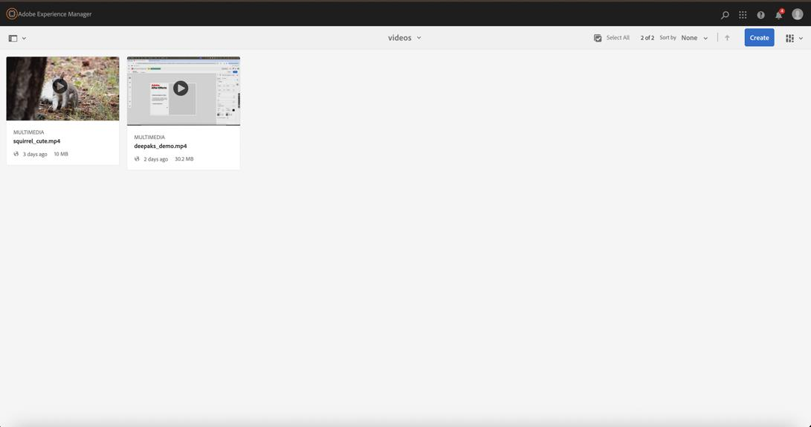
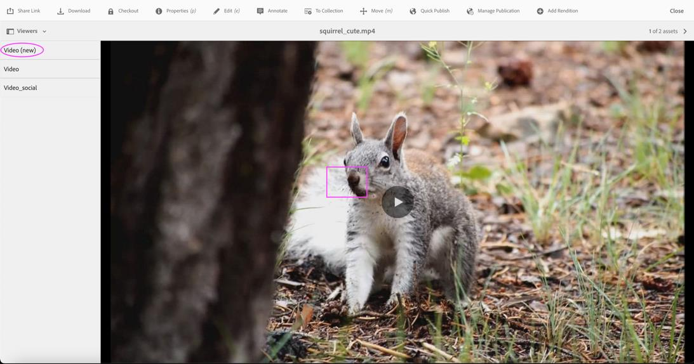
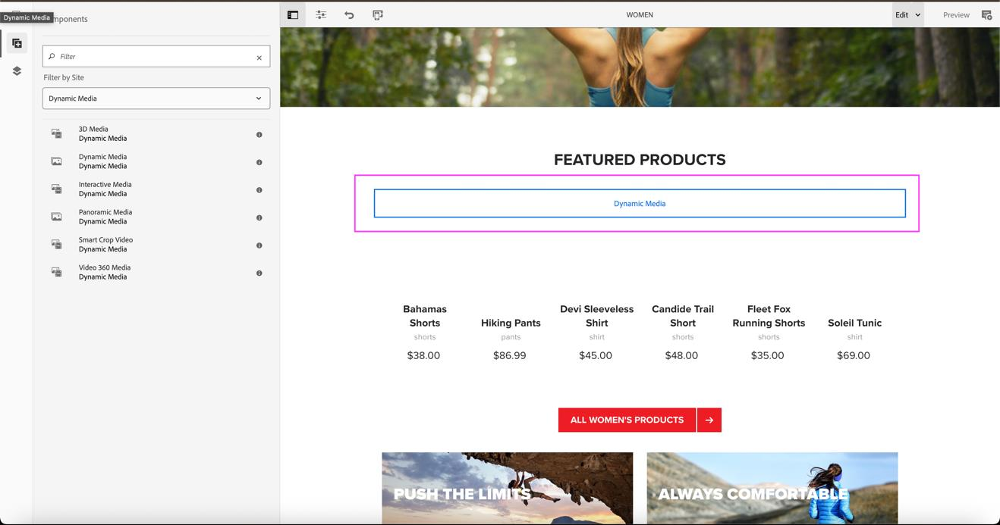
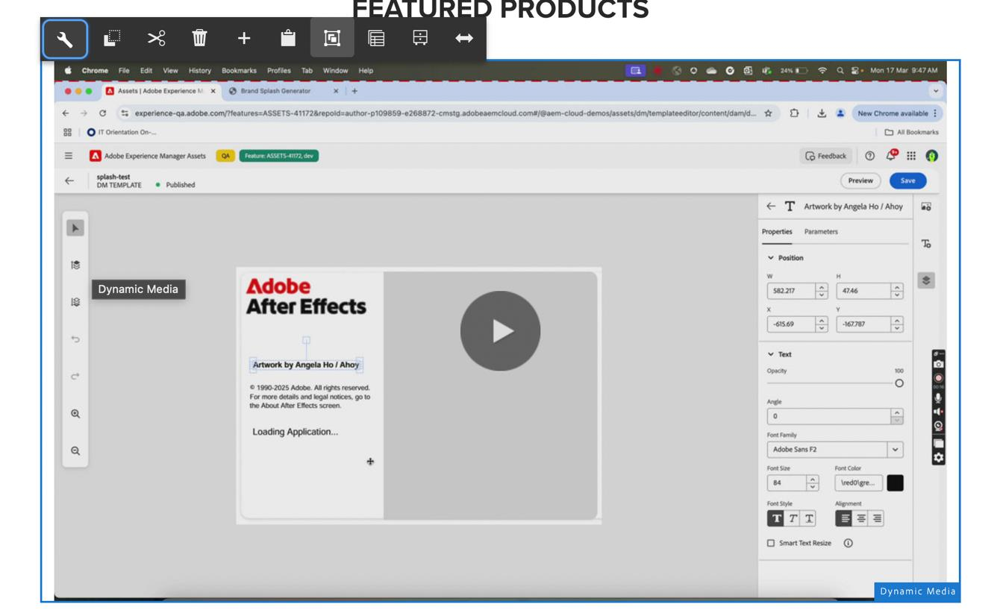
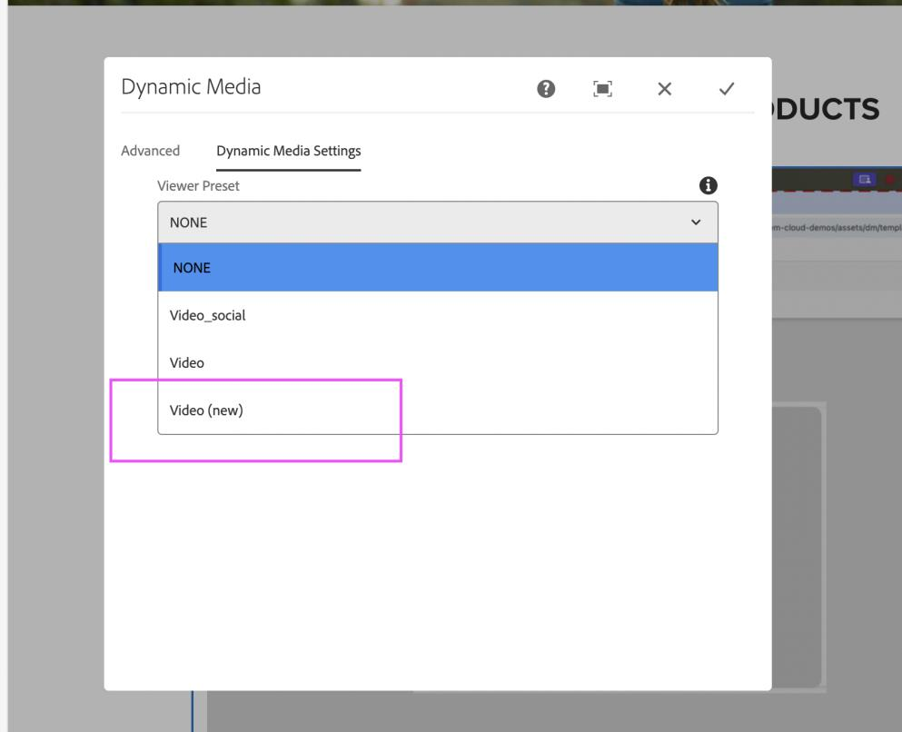
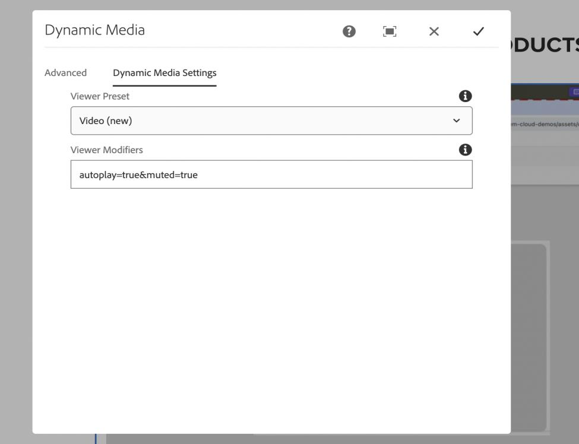

# New Video Viewer in Dynamic Media {#new-video-viewer-dynamic-media}

The New Video Viewer for Dynamic Media introduces a modernized video playback experience in Adobe Experience Manager (AEM). It is designed to deliver a consistent and extensible viewing experience across authoring, preview, and Sites usage, while continuing to work with existing Dynamic Media workflows.

The viewer is available as a new option and can be explicitly selected by authors wherever supported. In addition to improved playback behavior, the New Video Viewer exposes structured playback events that can be consumed by parent applications. This enables use cases such as analytics tracking, integration with external systems, and custom playback-driven interactions.

The New Video Viewer is intended for organizations that want a future-ready video experience without disrupting existing implementations.

> **Note:** The New Video Viewer is provided as an additional option and does not automatically replace existing video viewers.

## Problem statement {#problem-statement}

Existing video viewers in Dynamic Media support core playback requirements, but they offer limited extensibility and event-level integration for modern use cases.

The New Video Viewer addresses these limitations by:

* Providing a more consistent playback experience.
* Allowing explicit viewer selection by authors.
* Emitting structured events for programmatic consumption.
* Supporting integration with external analytics and systems.

## How the New Video Viewer works {#how-it-works}

At a high level, the New Video Viewer works as follows:

1. A video asset is ingested into a folder that is synced with Dynamic Media.
2. The video can be previewed using the New Video Viewer from the asset details page.
3. Authors can select the New Video Viewer when using the Dynamic Media component in AEM Sites.
4. During playback, the viewer emits structured events to the parent window.
5. Optional viewer modifiers control playback behavior.

## Key differences {#key-differences}

| Area | Description |
|-----|-------------|
| Viewer availability | Appears as a new option named **Video (new)** |
| Author control | Viewer is explicitly selected |
| Extensibility | Emits structured playback events |
| Integration | Works with existing Dynamic Media workflows |

## Use cases {#use-cases}

Common use cases include:

* Delivering a modern video playback experience on Sites pages.
* Tracking video engagement through playback events.
* Integrating video playback with external analytics or reporting systems.
* Customizing playback behavior using viewer modifiers.

## Prerequisites {#prerequisites}

Before using the New Video Viewer, ensure the following prerequisites are met:

| Requirement | Description |
|------------|-------------|
| Dynamic Media sync | The asset folder must be synced with Dynamic Media |
| Video profile | A video profile must be applied to the folder |
| Video asset | A video must be ingested into the folder |

## Enable or disable the New Video Viewer {#enable-disable}

### Adobe Experience Manager as a Cloud Service {#aem-cloud}

The New Video Viewer is available starting with **AEM as a Cloud Service version 2025.7.0**.

* To enable the New Video Viewer, contact your organization’s Adobe Customer Care representative and request that the feature toggle be enabled.
* To disable the New Video Viewer, contact Adobe Customer Care and request that the feature toggle be turned off.

### Adobe Experience Manager 6.5 {#aem-65}

To use the New Video Viewer on AEM 6.5, ensure that you are running **Service Pack 22 or later**.

#### Enable the New Video Viewer

1. Install the appropriate hotfix package:
   * Service Pack 22: `cq-6.5.0-hotfix-53898-1.2.zip`
   * Service Pack 23: `cq-6.5.0-hotfix-53898-sp23-1.2.zip`
2. Open the Felix console.
3. Locate the OSGi configuration:  
   `com.day.cq.dam.scene7.impl.featureflags.NewVideoViewerFlag`
4. Select **Enable New Video Viewer**.
5. Save the configuration.

#### Disable the New Video Viewer

1. Open the same OSGi configuration in the Felix console.
2. Clear **Enable New Video Viewer**.
3. Save the configuration.

## Preview the New Video Viewer {#preview}

To preview the New Video Viewer from the asset details page:

1. Open a video asset that meets the prerequisites.
2. In the Viewer rail, select **Video (new)**.
3. Click **Copy URL** to obtain the preview link.

## Use the New Video Viewer in Sites {#use-in-sites}

The New Video Viewer is available through the existing Dynamic Media component in AEM Sites.

### Add the Dynamic Media component

1. Open the page in the Sites editor.
2. Drag the **Dynamic Media** component onto the page.
3. Add a video asset to the component.

### Configure the viewer

1. Open the component settings.  
   

2. From the **Viewer Preset** list, select **Video (new)**.  
   

3. Add any required viewer modifiers.  
   

4. Save the configuration.

The video loads on the page using the New Video Viewer.

## Viewer modifiers {#viewer-modifiers}

Viewer modifiers allow you to control playback behavior.

| Modifier | Description |
|--------|-------------|
| `autoplay=true` | Automatically starts playback |
| `muted=true` | Starts playback in a muted state |

Modifiers are specified as query parameters in the **Viewer Modifiers** field.

## Supported events {#supported-events}

The New Video Viewer emits the following events during playback:

| Event type | Description |
|-----------|-------------|
| play | Video starts playing |
| pause | Video is paused |
| seek | User seeks within the video |
| load | Video is loaded |
| close | Player is closed |
| metadata | Metadata such as duration |
| milestone | Playback milestone reached |
| current_time | Periodic playback position |
| fullscreen | Enter fullscreen |
| un_fullscreen | Exit fullscreen |

## Handling events in the parent window {#handling-events}

The New Video Viewer sends playback-related messages to the parent page during video interactions.

To handle these events, the parent application must listen for browser message events and validate the message origin before processing the data.

The event payload includes information such as the event type, playback state, current playback time, and additional metadata. These events can be used to support analytics tracking, custom interactions, or integration with external systems.

Adobe recommends validating the message origin to ensure that events are processed only from trusted Dynamic Media domains.