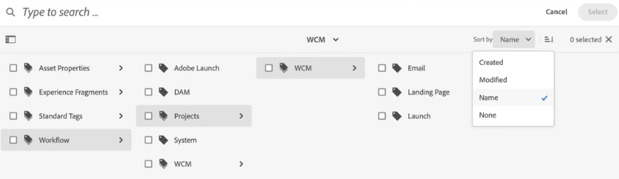

# Organize your digital assets {#organize-digital-assets}

| [Search Best Practices](/help/assets/search-best-practices.md) |[Metadata Best Practices](/help/assets/metadata-best-practices.md)|[Content Hub](/help/assets/product-overview.md)|[Dynamic Media with OpenAPI capabilities](/help/assets/dynamic-media-open-apis-overview.md)|[AEM Assets developer documentation](https://developer.adobe.com/experience-cloud/experience-manager-apis/)|
| ------------- | --------------------------- |---------|----|-----|

| Version | Article link |
| -------- | ---------------------------- |
| AEM 6.5  |    [Click here](https://experienceleague.adobe.com/docs/experience-manager-65/assets/managing/organize-assets.html?lang=en)                  |
| AEM as a Cloud Service     | This article         |

All digital assets, metadata, and content of Microsoft&reg; Office and PDF documents are extracted and made searchable. Search allows sophisticated filtering on assets and completely respects the proper permissions. Metadata is covered in detail in Metadata in Digital Asset Management.

[!DNL Experience Manager Assets] supports multiple ways of organizing content. You can organize them in a hierarchical manner using folders or you can organize them in an unordered, ad-hoc manner, for example, tags. Users can edit tags in the DAM Asset Editor where subassets, renditions, and metadata are displayed.

<!-- Commenting to pull down the existing content before applying changes wrt CQDOC-15930
## Create folders {#create-folders}

When organizing a collection of assets, for example, all *Nature* images, you can create folders to keep them together. You can use folders to categorize and organize your assets. [!DNL Assets] does not require you to organize assets in folders to work better.

>[!NOTE]
>
>Sharing an Assets folder (in Marketing Cloud) of the type `sling:OrderedFolder`, is not supported. If you want to share a folder, do not select Ordered when creating a folder.

1. Navigate to the place in your digital assets folder where you want to create a folder.
1. In the menu, click **[!UICONTROL Create]**. Select **[!UICONTROL New Folder]**.
1. In the **[!UICONTROL Title]** field, provide a folder name. By default, DAM uses the title that you provided as the folder name. Once the folder is created, you can override the default and specify another folder name.
1. Click **[!UICONTROL Create]**. Your folder is displayed in the digital assets folder.

## Add CUG properties to folders {#add-cug-properties-to-folders}

You can limit who can access certain folders in Assets by making the folder part of a closed user group (CUG). To make a folder part of a CUG:

1. In Assets, right-click the folder you want to add closed user group properties for and select **Properties**.  
1. Click the **CUG** tab.
1. Select the **Enabled** check box to make the folder and its assets available only to a closed user group.  
1. Browse to the login page, if there is one, to add that information. Add admitted groups by clicking **Add item**. If necessary, add the realm. Click **OK** to save your changes.

## Use tags to organize assets {#use-tags-to-organize-assets}

You can use folders or tags or both to organize assets. Adding tags to assets makes them easier to retrieve during a search. To add tags to an asset, follow these steps:

1. In the Digital Asset Manager, double-click the asset to open it.
1. In the **Tags** area, open the menu to reveal the available tags. Select tags as appropriate. To delete a tag, hover the pointer over the tag and click `X` to delete it.
1. Click **Save** to save any tags you added.

Date24/08/2021
-->

## Organize assets in folders {#organize-using-folders}

The most basic way to organize assets is to save the assets in folders. It is analogous to organizing files in folders in your local filesystem. For more information about how to create and manage folders, see [Manage assets](manage-digital-assets.md). How you name files and folders, how you arrange subfolders, and how you handle the files within these folders can have a significant impact on how those assets are processed. By using consistent and appropriate file and folder naming strategies, along with good metadata practice, you can make the most of your digital assets repository.

* Usually, your digital assets repository is always growing. Therefore, it is important to formalize metadata use, folder structure, and file naming early in the content creation cycle.
* Use folders only to impose a consistent storage structure for your digital assets. This consistency helps your process and manages your assets better. For example, assets placed in the following types of folders can help you segregate your assets:

  * **Development folders**: contains digital assets that you are currently working on.
  * **Client folders**: contains digital assets based on clients or project names.
  * **Primary folders**: contains original, source digital assets.
  * **Rendition folders**: contains renditions and copies of the original, source digital assets.
  * **File Size folders**: contains digital assets based on small, medium, or large file sizes.
  * **Staging folders**: contains digital assets that are ready to publish live on your website.
  * **MIME type folders**: contains digital assets that are specific to MIME types such as images, documents, and multimedia.
  * **Archive folders**: contains retired digital assets.
  * **Date-based folders**: contains digital assets based on a creation date or a last modified date.

* Create a directory of folders that are not likely to change so that any customization or automation continues to work. For example, the assigned processing profiles continue to work.
* If an asset is already published, then you use [!DNL Experience Manager] to move the asset to another folder, and republish from its new location. The original published asset location is still available along with the newly republished asset. The original published asset, however, is *lost* to [!DNL Experience Manager] and cannot be unpublished. Therefore, as a best practice, first unpublish an asset and then move it to a different folder.

## Organize assets using tags {#use-tags-to-organize-assets}

Adding tags to assets makes them easier to retrieve during a search, create collections using the search results, boost search ranking for some assets, and apply AI algorithms of Adobe Sensei for asset discovery.

[!DNL Adobe Experience Manager Assets] uses a self-learning algorithm to create highly descriptive tags that allow you to find the right asset in just a few clicks. Smart tagging uses Adobe Sensei, artificial intelligence and machine learning framework, which can be trained to recognize and apply both standard and business-specific tags to imagery. Smart Tags can also identify content, individual words, or phrases and automatically apply descriptive tags to assets.

Following are the steps to add tags to an asset:

1. Log in to [!DNL Experience Manager Assets].
1. Click **[!UICONTROL Assets]** > **[!UICONTROL Files]**, select the asset and click **[!UICONTROL Properties]** to open the asset properties. 
1. In the **[!UICONTROL Basic]** tab, click the folder icon in **[!UICONTROL Tags]** metadata. A pop-up window opens. 
1. Search or select the appropriate tags from the existing tags in `cq-tags`. You can assign multiple tags to the asset. 

   You can sort the tags structure in ascending or descending order based on the **[!UICONTROL Name]** (alphabetical order), **[!UICONTROL Created]** date, or **[!UICONTROL Modified]** date. In the following Illustration, the tag structure is sorted alphabetically based on the **[!UICONTROL Name]**. 

    

1. Click **Save** to update the asset metadata changes.

For more information, see the following articles:

* [Edit asset metadata](meta-edit.md)
* [Smart Tags in Assets](smart-tags.md)
* [Add tags predicate to the search panel](/help/assets/search-facets.md/#adding-a-tags-predicate)

## Organize as collections {#organize-as-collections}

With asset collections in [!DNL Experience Manager Assets], you can streamline the ability to create, edit, and share assets between users. Create several types of collections based on the way you use them, including collections that contain a static reference list of assets, folders, and collections, and collections that pull in assets based on search criteria. You can create collections with assets from different locations and share them with multiple users with different levels of access, viewing and editing privileges.

For more information, see [manage collections](manage-collections.md)

## Use profiles to organize your assets {#organize-to-use-profiles}

A processing profile contains [!DNL Assets] processing commands that apply to assets that get uploaded to pre-defined folders. Profiles are used to automate the processing of contents of a folder or freshly uploaded assets. You can use profiles to organize your assets better.

Standardizing metadata usage, file naming, and folder structure ensures that as your pool of digital assets grows, you can apply processing profiles to folders with greater precision and consistency.

**See also**

* [Translate Assets](translate-assets.md)
* [Assets HTTP API](mac-api-assets.md)
* [Assets supported file formats](file-format-support.md)
* [Search assets](search-assets.md)
* [Connected assets](use-assets-across-connected-assets-instances.md)
* [Asset reports](asset-reports.md)
* [Metadata schemas](metadata-schemas.md)
* [Download assets](download-assets-from-aem.md)
* [Manage metadata](manage-metadata.md)
* [Search facets](search-facets.md)
* [Manage collections](manage-collections.md)
* [Bulk metadata import](metadata-import-export.md)
* [Publish Assets to AEM and Dynamic Media](/help/assets/publish-assets-to-aem-and-dm.md)

>[!MORELIKETHIS]
>
>* [Use asset microservices and processing profiles](asset-microservices-configure-and-use.md)
>* [Metadata profiles](metadata-profiles.md)
>* [Video profiles](/help/assets/dynamic-media/video-profiles.md)
>* [Dynamic Media image profiles](/help/assets/dynamic-media/image-profiles.md)

