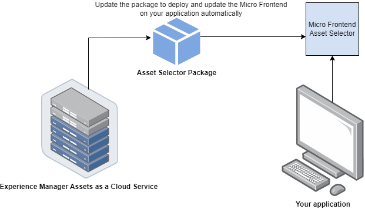
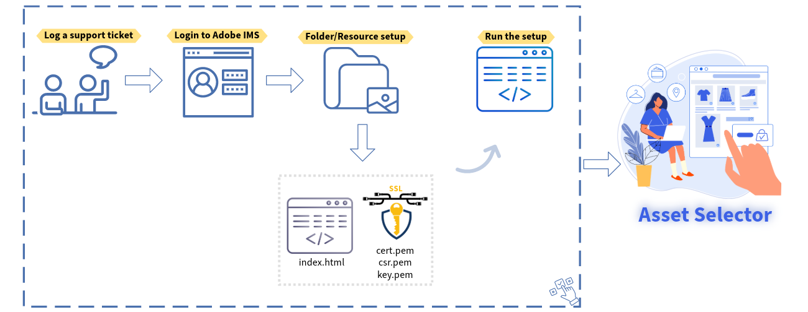
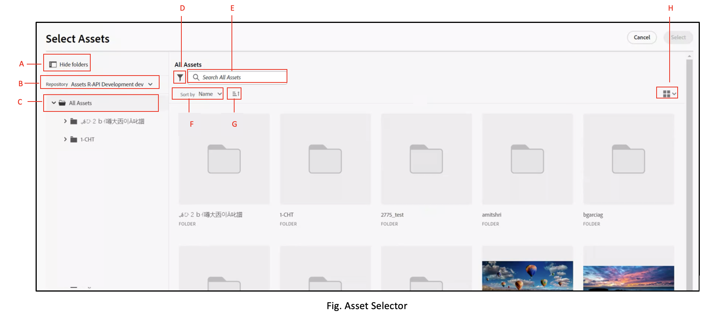
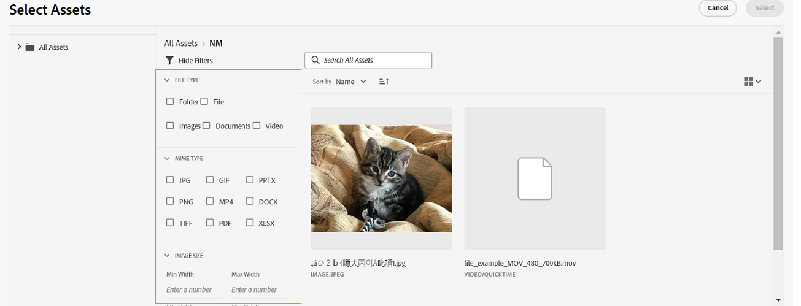
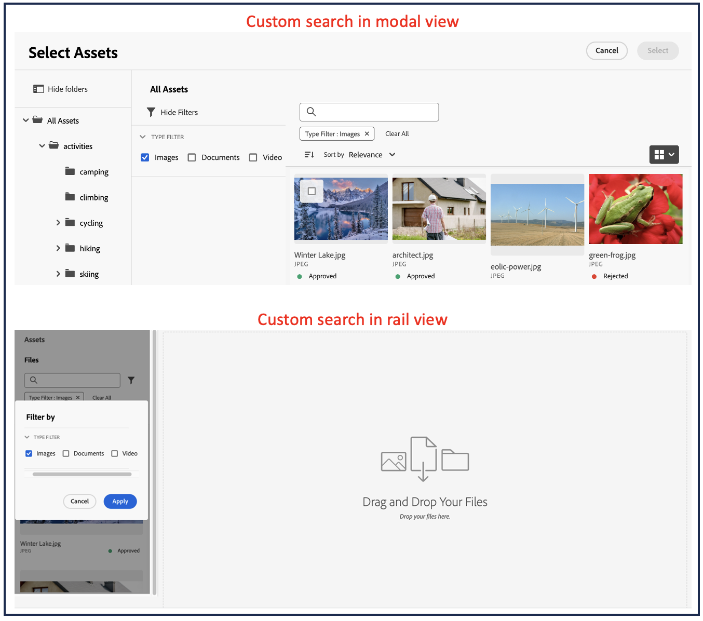

# Micro-Frontend Asset Selector {#Overview}

| [Search Best Practices](/help/assets/search-best-practices.md) |[Metadata Best Practices](/help/assets/metadata-best-practices.md)|[Content Hub](/help/assets/product-overview.md)|[Dynamic Media with OpenAPI capabilities](/help/assets/dynamic-media-open-apis-overview.md)|[AEM Assets developer documentation](https://developer.adobe.com/experience-cloud/experience-manager-apis/)|
| ------------- | --------------------------- |---------|----|-----|

Micro-Frontend Asset Selector provides a user interface that easily integrates with the [!DNL Experience Manager Assets] repository so that you can browse or search digital assets available in the repository and use them in your application authoring experience.

The Micro-Frontend user interface is made available in your application experience using the Asset Selector package. Any updates to the package are automatically imported and the latest deployed Asset Selector loads automatically within your application.



Asset Selector provides many benefits, such as:

* Ease of integration with any of the [Adobe](/help/assets/integrate-asset-selector-adobe-app.md) or [non-Adobe](/help/assets/integrate-asset-selector-non-adobe-app.md) applications using the Vanilla JavaScript library.
* Easy to maintain as updates to the Assets Selector package are automatically deployed to the Asset Selector available for your application. There are no updates required within your application to load the latest modifications.
* Ease of customization as there are properties available that control the Asset Selector display within your application.
* Full-text search, out-of-the-box, and customized filters to quickly navigate to assets for use within the authoring experience.
* Ability to switch repositories within an IMS organization for asset selection.
* Ability to sort assets by name, dimensions, and size and view them in List, Grid, Gallery, or Waterfall view.

<!--Perform the following tasks to integrate and use Asset Selector with your [!DNL Experience Manager Assets] repository:

1. [Install Asset Selector](#installation)
2. [Integrate Asset Selector using Vanilla JS](#integration-using-vanilla-js)
3. [Use Asset Selector](#using-asset-selector)
-->

<!--
## Setting up Asset Selector {#asset-selector-setup}


-->

## Prerequisites{#prereqs}

You must ensure the following communication methods:

* The application is running on HTTPS.
* The URL of the application is in the IMS client's allowed list of redirect URLs.
* The IMS login flow is configured and rendered using a popup on the web browser. Therefore, popups should be enabled or allowed on the target browser.

Use the above prerequisites if you require the IMS authentication workflow of Asset Selector. Alternatively, if you are already authenticated with the IMS workflow, you can add the IMS information instead. 

**See more**

* [Integrate Asset Selector with an Adobe app](/help/assets/integrate-asset-selector-adobe-app.md)
* [Integrate Asset Selector with a non-Adobe app](/help/assets/integrate-asset-selector-non-adobe-app.md)
* [Integrate Asset Selector dynamic media open APIs](/help/assets/integrate-asset-selector-dynamic-media-open-api.md)


>[!IMPORTANT]
>
> This repository is intended to serve as a supplemental documentation describing the available APIs and usage examples for integrating Asset Selector. Before attempting to install or use the Asset Selector, ensure that your organization has been provisioned the access to Asset Selector as part of the Experience Manager Assets as a Cloud Service profile. If you have not been provisioned, you cannot integrate or use these components. To request provisioning, your program admin should raise a support ticket marked as P2 from the Admin Console and include the following information:
>
>* Domain names where the integrating application is hosted.
>* After provisioning, your organization will be provided with `imsClientId`, `imsScope`, and a `redirectUrl` corresponding to the environments requested that are essential for the configuration of Asset Selector. Without those valid properties, you cannot run the installation steps.

## Installation {#installation}

Asset Selector is available via both ESM CDN (For example, [esm.sh](https://esm.sh/)/[skypack](https://www.skypack.dev/)) and [UMD](https://github.com/umdjs/umd) version.

In browsers using **UMD version** (recommended):

```
<script src="https://experience.adobe.com/solutions/CQ-assets-selectors/static-assets/resources/assets-selectors.js"></script>

<script>
  const { renderAssetSelector } = PureJSSelectors;
</script>

```

In browsers with `import maps` support using **ESM CDN version**:

```
<script type="module">
  import { AssetSelector } from 'https://experience.adobe.com/solutions/CQ-assets-selectors/static-assets/resources/@assets/selectors/index.js'
</script>

```

In Deno/Webpack Module Federation using **ESM CDN version**:

```
import { AssetSelector } from 'https://experience.adobe.com/solutions/CQ-assets-selectors/static-assets/resources/@assets/selectors/index.js'

```

## Using Asset Selector {#using-asset-selector}

Once the Asset Selector is set up and you are authenticated to use Asset Selector with your [!DNL Adobe Experience Manager] as a [!DNL Cloud Service] application, you can select assets or perform various other operations to search for your assets within the repository.

   

* **A**: [Hide/Show panel](#hide-show-panel)
* **B**: [Repository switcher](#repository-switcher)
* **C**: [Assets](#repository)
* **D**: [Filters](#filters)
* **E**: [Search bar](#search-bar)
* **F**: [Sorting](#sorting)
* **G**: [Sorting in ascending or descending order](#sorting)
* **H**: [View](#types-of-view)

### Hide/Show panel {#hide-show-panel}

To hide folders in the left navigation, click the **[!UICONTROL Hide folders]** icon. To undo the changes, click the **[!UICONTROL Hide folders]** icon again.

### Repository switcher {#repository-switcher}

Asset Selector also lets you switch repositories for asset selection. You can select the repository of your choice from the drop-down available in the left panel. The repository options available in the drop-down list are based on the `repositoryId` property defined in the `index.html` file. It is based on the environment from the selected IMS org that is accessed by the logged in user. Consumers can pass a preferred `repositoryID` and in that case the Asset Selector stops rendering the repo switcher and render assets from the given repository only.

### Assets repository

It is a collection of assets folders that you can use to perform operations. 

### Out-of-the-box filters {#filters}

Asset Selector also provides out-of-the-box filter options to refine your search results. The following filters are available:

* **[!UICONTROL Status]:** includes the current state of asset among `all`, `approved`, `rejected`, or `no status`.
* **[!UICONTROL File type]:** includes `folder`, `file`, `images`, `documents`, or `video`.
* **[!UICONTROL Expiration status]:** mentions the assets based upon its expiration duration. You can either check the `[!UICONTROL Expired]` checkbox to filter assets that are expired; or set `[!UICONTROL Expiration Duration]` of an asset to display assets based on their expiry duration. When an asset is expired already or is near to expire, a badge appears to depict the same. Moreover, you can control whether you want to allow usage (or drag and drop) of an expired asset. See more about [customize expired assets](/help/assets/asset-selector-customization.md#customize-expired-assets). By default, the **Expiring Soon** badge is displayed for assets that are expiring in the next 30 days. However, you can configure the expiration using `expirationDate` property.

    >[!TIP]
    >
    > If you want to view or filter assets based on their future expiry date, mention the future date range in the `[!UICONTROL Expiration Duration]` field. It displays the assets with **expiring soon** badge on them.

* **[!UICONTROL MIME type]:** includes `JPG`, `GIF`, `PPTX`, `PNG`, `MP4`, `DOCX`, `TIFF`, `PDF`, `XLSX`.
* **[!UICONTROL Image Size]:** includes minimum/maximum width, minimum/maximum height of image.

    

### Custom search

Apart from the full-text search, Asset Selector lets you search assets within files using customized search. You can use custom search filters in both Modal view and Rail view modes.



You can also create a default search filter to save the fields that you frequently search for and use them later. To create custom search for your assets, you can use `filterSchema` property.

### Search bar {#search-bar}

Asset Selector lets you perform a full text search of assets within the selected repository. For example, if you type the keyword `wave` in the search bar, all the assets with the `wave` keyword mentioned in any of the metadata properties are displayed.

### Sorting {#sorting}

You can sort assets in Asset Selector by name, dimensions, or size of an asset. You can also sort the assets in ascending or descending order.

### Types of view {#types-of-view}

Asset Selector lets you view the asset in four different views:

*  [!UICONTROL **List View**] The list view displays scrollable files and folders in a single column.
*  [!UICONTROL **Grid View**] The grid view displays scrollable files and folders in a grid of rows and columns.
*  [!UICONTROL **Gallery View**] The gallery view displays files or folders in a center-locked horizontal list.
*  [!UICONTROL **Waterfall** View] The waterfall view displays files or folders in the form of a Bridge.

**Overview Graphic**


## Learn more on key capabilities {#key-capabilities-asset-selector}

<table>
<tr>
    <td>
        <br/>
        <a href="integrate-asset-selector.md">Integrate Asset Selector</a>
        <p>
        <em>Learn various capabilities to integrate Asset Selector with multiple applications.
        </p>
     </td>
    <td>
        <br/>
        <a href="integrate-asset-selector.md">Integrate Asset Selector with Adobe applications</a>
        <p>
        <em>Discover how to integrate Asset Selector with various Adobe applications.</em>
        </p>
    </td>
    <td>
        <br/>
        <a href="integrate-asset-selector.md">Integrate Asset Selector with third party applications</a>
        <p>
        <em>Dig up the capabilities to integrate Asset Selector with non-Adobe applications.</em>
        </p>
    </td>
    <td>
        <br/>
        <a href="integrate-asset-selector.md">Integrate Asset Selector with Dynamic Media Open APIs</a>
        <p>
        <em>Understand how to integrate Asset Selector with Dynamic Media Open APIs.</em>
        </p>
     </td>
     <td>
        <br/>
        <a href="asset-selector-customization.md">Asset Selector Properties</a>
        <p>
        <em>Learn the basics of customizing various components of Asset Selector, such as filters, selection of assets, expired assets, and much more. </em>
        </p>
    </td>
</tr>
<tr>
    <td>
        <br/>
        <a href="asset-selector-customization.md">Asset Selector Examples</a>
        <p>
        <em>Understand the usage of properties in a practical manner. </em>
        </p>
    </td>
    <td>
        <br/>
        <a href="asset-selector-customization.md">Asset Selector Customizations</a>
        <p>
        <em>Configure and customize various components of Asset Selector based upon your usability. </em>
        </p>
    </td>
    <td>
        <br/>
        <a href="asset-selector-upload.md">Asset Selector Upload</a>
        <p>
        <em>Learn how you can upload files or folders to Asset Selector from your local or third party file system. </em>
        </p>
    </td>
     <td>
        <br/>
        <a href="asset-selector-collections.md">Asset Selector Collections</a>
        <p>
        <em>Learn how to use collections inside Asset Selector using Experience Manager repository. </em>
        </p>
    </td>
    <td>
    </td>
</tr>
</table>

>[!MORELIKETHIS]
>
>* [Asset Selector customizations](/help/assets/asset-selector-customization.md)
>* [Integrate Asset Selector with various applications](/help/assets/integrate-asset-selector.md)
>* [Asset Selector properties](/help/assets/asset-selector-properties.md)
>* [Integrate Asset Selector with Dynamic Media with OpenAPI capabilities](/help/assets/integrate-asset-selector-dynamic-media-open-api.md)
