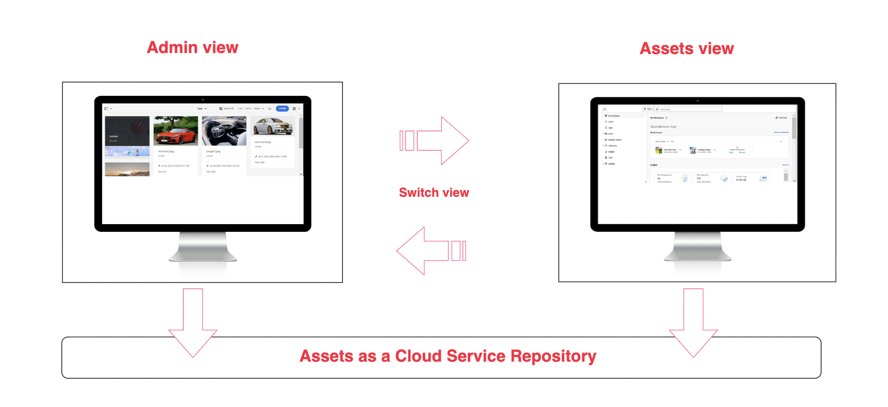

# Introducing Assets as a Cloud Service for Digital Asset Management in [!DNL AEM] {#assets-as-cloud-service-digital-asset-management-aem}

**Adobe Experience Manager ([!DNL AEM]) Assets as a Cloud Service** is a **cloud-native, Platform-as-a-Service (PaaS)** solution for **Digital Asset Management (DAM)** and **Dynamic Media**. Beyond core asset operations, [!DNL AEM Assets] as a Cloud Service delivers next-generation smart capabilities powered by **Artificial Intelligence and Machine Learning (AI/ML)** — automating tasks such as tagging, cropping, and asset discovery. As a fully managed cloud service, the platform is **always current, always available, and always learning**, meaning updates arrive continuously, uptime is maintained by Adobe, and its AI/ML models improve over time.

Adobe provides robust Digital Asset Management (DAM) solutions that help you maximize the value of your digital assets across creation, management, and delivery. [!DNL Adobe Experience Manager Assets] offers two distinct experiences that share the same Cloud Services repository, so you can adopt the interface that best fits your requirements. For information on persona-based experiences for [!DNL AEM Assets], see [Available persona-based experiences for Digital Asset Management](#persona-based-experiences).

For information on [!DNL AEM Assets] Ultimate and [!DNL AEM Assets] Prime offerings, see [Assets as a Cloud Service Ultimate](/help/assets/assets-ultimate-overview.md) and [Assets as a Cloud Service Prime](/help/assets/assets-prime.md).

Key features of Adobe's Digital Asset Management include:

- **Ingestion** — Bring assets into the repository quickly and at scale, with automatic metadata extraction and processing.
- **Smart tagging and metadata** — AI/ML-based capabilities automatically enrich assets to improve searchability and organization.
- **Search and discovery** — Locate assets rapidly using metadata, tags, and content-based search.
- **Dynamic Media** — Deliver rich, responsive images and video optimized for every channel and device.
- **Asset governance and reuse** — Manage versions, permissions, and distribution to ensure assets are used consistently across the organization.

>[!BEGINTABS]

>[!TAB Ingestion]

Ingestion is the process of bringing digital assets into the [!DNL AEM Assets] as a Cloud Service repository so they can be managed, enriched, and delivered. During ingestion, assets are uploaded, processed, and prepared for use — including automatic metadata extraction, renditions generation, and AI/ML-based smart tagging. This ensures that assets are searchable, well-organized, and ready for distribution as soon as they enter the system, whether they are added individually or through bulk, high-volume uploads.

## Asset ingestion {#asset-ingestion}

Use the bulk import feature to import a large volume of assets directly from a data source &ndash; such as **Azure**, **AWS**, **Google Cloud**, **Dropbox**, and **OneDrive** &ndash; to Assets as a Cloud Service.

You can perform the bulk import operation using the Admin view or Assets view. Assets view provides more data source options as compared to the Admin view.

In addition to the Web browser user interface, Experience Manager supports other clients on the desktop. They also provide an upload experience without the need to go to the Web browser.

* Adobe Asset Link provides access to assets from Experience Manager in Adobe Photoshop, Adobe Illustrator, and Adobe InDesign desktop applications. You can upload the currently open document to Experience Manager directly, keeping creative work and asset management in a single workflow. You can do so directly through the Adobe Asset Link interface found in these desktop applications.

* Experience Manager desktop app simplifies working with assets on the desktop, independent of their file type or the native application that handles them. It uploads files in nested folder hierarchies directly from your local file system — a capability the browser upload does not provide, because browser upload supports only flat file lists.

Use the following links to access detailed documentation for each asset ingestion tool covered above:

<table>
<td>
   
   

      <a href="/help/assets/bulk-import-assets-view.md">
      <strong>Use Bulk Import tool</strong>
      </a>
   

   

      <em>Learn how to import a large number of assets directly from a data source</em>
   

</td>

<td>
   
   

      <a href="https://experienceleague.adobe.com/en/docs/experience-manager-desktop-app/using/get-started">
      <strong>Use [!DNL AEM] desktop app</strong>
      </a>
   

   

      <em>Learn how to use the [!DNL AEM] desktop app to upload files in nested folder hierarchies from your local file system.</em>
   

</td>
<td>
   
   

      <a href="https://helpx.adobe.com/enterprise/using/adobe-asset-link.html">
      <strong>Use Adobe Asset Link</strong>
      </a>
   

   

      <em>Learn how to upload assets to Experience Manager using Creative Cloud applications.</em>
   

</td>
</table>

>[!TAB AI-Powered features]

**Smart Tags**: Smart Tags use the artificially intelligent framework of Adobe AI to train its image recognition algorithm on your tag structure and business taxonomy. This content intelligence is then used to apply relevant tags on a different set of assets. Adobe Experience Manager ([!DNL AEM]) automatically applies smart tags to uploaded assets, by default.

**Intelligent Color-based Tagging & Search**: [!DNL AEM Assets] uses Adobe AI capabilities to distinguish between colors in an image and apply those traits as tags automatically on ingestion. As a result, these tags power an enhanced Search experience driven by image color composition, letting users find assets by their visual color profile.

**AI-generated metadata**: [!DNL AEM Assets] uses AI to generate metadata automatically, including Title, Description, and Keywords. These AI-generated fields enhance metadata accuracy, making the assets easier to search, categorize, and recommend. This approach not only improves efficiency by eliminating manual tagging but also ensures consistency and scalability across large volumes of digital content.

**AI-powered assets bulk rename**: [Assets view allows you to rename multiple assets at once using Artificial Intelligence](/help/assets/bulk-rename-assets-view.md). You can select multiple files at once and rename them all together. Some of the example conversational rename prompts include *Change all files to 'my-file' and append an incrementing number* and *Prefix the files with 001, 002, etc. and translate into English*.

<table>
<td>
   
   

      <a href="/help/assets/smart-tags.md">
      <strong>Add AI Smart Tags to assets</strong>
      </a>
   

   

      <em>Learn how to apply smart tags automatically to uploaded assets.</em>
   

</td>

<td>
   
   

      <a href="/help/assets/manage-notifications-assets-view.md">
      <strong>Add Intelligent color-based tags</strong>
      </a>
   

   

      <em>Learn how to apply color-based tags automatically on ingestion.</em>
   

</td>
<td>
   
   

      <a href="/help/assets/metadata-assets-view.md">
      <strong>AI-generated metadata</strong>
      </a>
   

   

      <em>Use AI to generate asset metadata, such as Title and Description. </em>
   

</td>
</table>

**Contextual Search**: Adobe Experience Manager ([!DNL AEM]) Assets lets you search assets in the repository using natural-language text prompts. Experience Manager Assets automatically transforms these text prompts into search filters and displays the matching results, removing the need to build filters manually. You can view and modify the automatically generated filters using the **Filters Pane** to narrow down the search results further. Because the prompts are conversational, you can combine multiple criteria—dimensions, subject matter, date, and approval status—in a single query. Some conversational text prompt examples include the following:

   * *Images at least 200px tall and 100px wide with beach and clear sky*, and
   * *I need images of blue sky that are 1500 and 2500 pixel height and created in the past month that is not expired and are approved*.

**Generate assets using Adobe Firefly within [!DNL AEM]**: [!DNL AEM Assets] allows you to generate an asset with **Adobe Firefly** in real-time when your search query does not return any results. [!DNL AEM Assets] then enables you to upload the generated image directly to the [!DNL AEM Assets] repository from within the [!DNL AEM Assets] user interface, so you never have to leave the application to create and store net-new content.

**Integration with Adobe Express**: [!DNL AEM Assets] integrates natively with **Adobe Express**, which allows you to access assets stored in [!DNL AEM Assets] directly from within the Adobe Express user interface. You can also use **Adobe Firefly** Artificial Intelligence (AI) within Express to generate images from simple text prompts and place them on the Express canvas. You can then save new or edited content back into an [!DNL AEM Assets] repository, keeping creative work and the managed asset library in sync.

<table>
<td>
   
   

      <a href="/help/assets/search-assets-view.md#contextual-search">
      <strong>Contextual Search</strong>
      </a>
   

   

      <em>Learn how to search assets using simple text prompts.</em>
   

</td>

<td>
   
   

      <a href="/help/assets/search-assets-view.md#search-firefly">
      <strong>Generate assets using Adobe Firefly</strong>
      </a>
   

   

      <em>Generate assets in real-time using Adobe Firefly.</em>
   

</td>
<td>
   
   

      <a href="/help/assets/native-integration-adobe-express.md">
      <strong>Integration with Adobe Express</strong>
      </a>
   

   

      <em>Use Adobe Express AI features within [!DNL AEM Assets] user interface.</em>
   

</td>
</table>

**Smart Imaging**: **Smart Imaging** improves image asset delivery performance by automatically optimizing an image's format and file size based on the requesting browser's capabilities. It works with your existing image presets and applies intelligence at the point of delivery. This intelligence further reduces image file size based on the browser and network connection speed, because serving a lighter, browser-appropriate format lowers the number of bytes transferred and speeds up page rendering.

**Smart Crop**: **Smart Crop** is an Adobe Artificial Intelligence (AI) capability that automatically detects the focal point—the intended point of interest—in any image or video and crops to preserve it. It captures that focal point regardless of screen size, which eliminates tedious manual cropping and delivers high-quality, fast-loading imagery and video that displays well on any device or screen.

**AI-generated video captions**: AI-generated video captions in Adobe Dynamic Media use artificial intelligence to automatically generate captions for video content in **more than 60 languages**. This feature improves accessibility and enhances the user experience by delivering accurate, machine-generated captions across a wide range of supported languages.

Accurate captions directly expand who can engage with video content. They make video usable for viewers who are deaf or hard of hearing, support comprehension in sound-off environments such as public spaces and social feeds, and, as widely acknowledged, improve overall engagement and content discoverability.

**How AI-generated captions are created:**

- **From original audio:** Dynamic Media generates captions directly from the video's original audio track.
- **From additional audio tracks:** You can also generate captions from any additional audio tracks associated with the video.
- **From supplementary captions:** You can provide extra captions in the **Captions and Audio** tab on the video properties page.

Because captions can be reviewed and previewed before the video is published, editors verify accuracy and correct any errors while the video is still in draft. This review-and-preview workflow ensures the published captions faithfully match the spoken content before the video goes live.

<table>
<td>
   
   

      <a href="/help/assets/dynamic-media/imaging-faq.md">
      <strong>Smart Imaging</strong>
      </a>
   

   

      <em>Optimize an image's format and file size based on a user's browser capability and network speed.</em>
   

</td>

<td>
   
   

      <a href="https://experienceleague.adobe.com/en/docs/experience-manager-learn/assets/dynamic-media/video/dynamic-media-smart-crop-video">
      <strong>Smart Crop</strong>
      </a>
   

   

      <em>Use AI to detect the focal point automatically in any image or video, and crop to maintain it</em>
   

</td>
<td>
   
   

      <a href="/help/assets/dynamic-media/video.md">
      <strong>AI-generated video captions</strong>
      </a>
   

   

      <em>Use artificial intelligence to generate captions automatically for video content. </em>
   

</td>
</table>

>[!TAB Discovery]

## Asset discovery {#asset-discovery}

After importing assets to Adobe Experience Manager ([!DNL AEM]) Assets, locating the right asset quickly within a large, growing repository becomes a significant challenge.

[!DNL AEM Assets] solves this challenge with features engineered to surface the right asset fast. These features include AI-generated tagging (smart tags), customized metadata, and enhanced search capabilities.

**Metadata management**: Metadata is the most critical aspect of any asset management journey. Once assets are distributed to users, managing metadata moves completely out of the administrators' direct control, which makes disciplined metadata practices essential from the start. Effective asset metadata directly drives better search results, and superior discoverability is the ultimate goal of any Digital Asset Management (DAM) tool.

**Metadata Forms**: [!DNL AEM Assets] as a Cloud Service provides many standard metadata fields by default. When your organization has additional metadata requirements beyond these defaults, metadata forms let you add custom, business-specific metadata fields directly to an asset's Details page. This business-specific metadata improves both the governance and the discovery of assets, because richer, consistent metadata makes assets easier to search, filter, and control. You can build metadata forms from scratch or repurpose an existing form, which accelerates setup by reusing proven field structures.

<table>
<td>
   
   

      <a href="/help/assets/metadata-assets-view.md">
      <strong>Manage Metadata in Assets view</strong>
      </a>
   

   

      <em>Learn how to manage metadata and metadata forms using Assets view.</em>
   

</td>

<td>
   
   

      <a href="https://experienceleaguecommunities.adobe.com/t5/adobe-experience-manager-blogs/how-to-manage-metadata-before-and-after-migrating-to-aem-assets/ba-p/744298">
      <strong>Metadata management best practices</strong>
      </a>
   

   

      <em>Learn how to manage metadata before and after migrating your assets to [!DNL AEM].</em>
   

</td>
<td>
   
   

      <a href="/help/assets/manage-metadata.md">
      <strong>Manage metadata in Admin view</strong>
      </a>
   

   

      <em>Learn how to manage metadata and metadata forms using the Admin view.</em>
   

</td>
</table>

**Smart Tags**: Smart Tags use the Adobe artificial intelligence framework to train an image-recognition algorithm on your organization's tag structure and business taxonomy. [!DNL AEM Assets] then applies this content intelligence to automatically tag a different set of assets with relevant tags. By default, [!DNL AEM Assets] applies smart tags to uploaded assets automatically, reducing manual tagging effort and improving discoverability at scale.

**Search assets**: Once the right metadata is in place, [!DNL AEM Assets] lets you search using operators, wildcards, advanced queries, and custom filters to pinpoint specific assets precisely.

**Contextual Search**: [!DNL AEM Assets] also provides Contextual Search, which enables you to find assets in the repository by defining natural-language text prompts. Experience Manager Assets automatically transforms these text prompts into search filters and displays the matching results. You can view and modify the automatically generated filters using the Filters Pane to narrow down the search results further.

<table>
<td>
   
   

      <a href="/help/assets/smart-tags.md">
      <strong>Add Smart Tags to assets</strong>
      </a>
   

   

      <em>Learn how to apply smart tags automatically to uploaded assets.</em>
   

</td>

<td>
   
   

      <a href="/help/assets/search-assets-view.md">
      <strong>Search assets in Assets view</strong>
      </a>
   

   

      <em>Learn how to use Contextual Search effectively and other search capabilities in Assets view.</em>
   

</td>
<td>
   
   

      <a href="/help/assets/search-best-practices.md">
      <strong>Search best practices</strong>
      </a>
   

   

      <em>Learn about various scenarios to assist [!DNL AEM] users to perform basic to advanced level search.</em>
   

</td>
</table>

>[!TAB Governance]

## Asset management and governance {#asset-management-governance}

Once you have uploaded your assets to [!DNL AEM Assets] and set its metadata for better discoverability, you can perform various digital asset management tasks using the user-friendly interface of Assets view.

**Asset Management Tasks**: Some of the basic tasks include search, download, move, copy, rename, delete, update, and edit operations.

You can also maintain asset versions, set asset status, and set asset expiration.

**My Workspace**: Assets view also includes a customizable workspace that provides widgets. These widgets provide convenient access to key areas of the Assets user interface and information most relevant to each user. This page serves as a one-stop solution to provide an overview of your work items and to give quick access to key workflows.

**Content Credentials**: Another powerful feature that [!DNL AEM Assets] supports is Content Credentials. Brands are more concerned than ever about content transparency, AI disclosure, and preventing the tampering of assets. The **Content Authenticity Initiative (CAI)** at Adobe builds tools compliant with the **Coalition for Content Provenance and Authenticity (C2PA)** technical standard. Content Credentials, which are a new kind of encrypted, tamper-evident metadata, help viewers understand the lineage of content and verify the integrity of brand assets. They can include a wide range of provenance data that offer insight into the history of a digital asset.

<table>
<td>
   
   

      <a href="/help/assets/manage-organize-assets-view.md">
      <strong>Asset management tasks</strong>
      </a>
   

   

      <em>Learn how to perform some basic as well as advanced asset management tasks.</em>
   

</td>

<td>
   
   

      <a href="/help/assets/my-workspace-assets-view.md">
      <strong>My Workspace</strong>
      </a>
   

   

      <em>Learn how to work with My Workspace to access key areas  of the Assets user interface quickly.</em>
   

</td>
<td>
   
   

      <a href="/help/assets/content-credentials.md">
      <strong>Content Credentials</strong>
      </a>
   

   

      <em>Gain insights on the history of a digital asset using Content Credentials.</em>
   

</td>
</table>

**Collections**: [!DNL AEM Assets] also enables you to organize your assets into collections. A collection is a set of assets, folders, or other collections within the [!DNL Adobe Experience Manager Assets] view. Use collections to share assets between users, enabling teams to distribute related content efficiently across projects. Unlike folders, a collection can include assets from different locations. You can share multiple collections with a user. Each collection contains references to assets. The referential integrity of assets is maintained across collections, ensuring that changes to a source asset remain consistent wherever it is referenced.

**Notifications**: Assets view notifications enable you to monitor the operations performed on the assets, folders, or collections available in the repository. You need to select and subscribe to the content for which the notifications are sent to you. You can also configure the categories for which the notifications are sent to you.

**Detect duplicate assets**: [!DNL AEM Assets] also supports detecting duplicate assets. If a Digital Asset Management (DAM) user uploads one or more assets that already exist in the repository, Experience Manager detects the duplication and, as a result, immediately notifies the user.

<table>
<td>
   
   

      <a href="/help/assets/manage-collections-assets-view.md">
      <strong>Manage Collections</strong>
      </a>
   

   

      <em>Learn how to organize your assets into collections for efficient sharing of assets.</em>
   

</td>

<td>
   
   

      <a href="/help/assets/manage-notifications-assets-view.md">
      <strong>Set Notifications</strong>
      </a>
   

   

      <em>Learn how to set notifications to monitor the operations performed on assets, folders, or collections.</em>
   

</td>
<td>
   
   

      <a href="/help/assets/detect-duplicate-assets.md">
      <strong>Detect duplicate assets</strong>
      </a>
   

   

      <em>Detect duplicate assets uploaded to [!DNL AEM Assets] and notify to users.</em>
   

</td>
</table>

>[!TAB Integrations]

## Integration with Adobe and non-Adobe applications {#integration-adobe-non-adode-apps}

Adobe Experience Manager ([!DNL AEM]) Assets integrates directly with a broad range of Adobe and non-Adobe applications, including **[!DNL Dynamic Media with OpenAPI capabilities]**, **Content Advisor**, **[!DNL Adobe Workfront]**, **Figma**, **Adobe Express**, and **Creative Cloud**. These integrations connect digital asset management with the tools teams already use for design, work management, and content delivery. The following is a summarized view of the available integrations:

+++**Integration with Adobe and non-Adobe applications**

* **[!DNL Dynamic Media with OpenAPI capabilities]**: [Dynamic Media with OpenAPI capabilities](/help/assets/dynamic-media-open-apis-overview.md) delivers a comprehensive set of [**search**](/help/assets/search-assets-api.md) and [**delivery**](/help/assets/deliver-assets-apis.md) **APIs**. These APIs enable developers to integrate asset delivery directly into their applications, spanning both **Adobe and third-party applications**. [!DNL Dynamic Media with OpenAPI capabilities] also provides a **Micro Frontend assets selector** user interface for searching and selecting approved assets. Because the selector is built on the OpenAPI open standard, it integrates seamlessly with any application built on JavaScript frameworks such as **React JS**, **Angular JS**, and **Vanilla JS**.

* **Content Advisor**: Content Advisor provides a user interface that connects to the Experience Manager Assets repository, allowing users to browse or search the digital assets available in the repository and then use those assets within their application authoring experience. Content Advisor integrates with both Adobe and non-Adobe applications.

<table>
<td>
   
   

      <a href="/help/assets/dynamic-media-open-apis-overview.md">
      <strong>[!DNL Dynamic Media with OpenAPI capabilities] overview</strong>
      </a>
   

   

      <em>Learn key benefits and how to get it enabled. </em>
   

</td>

<td>
   
   

      <a href="/help/assets/restrict-assets-delivery.md">
      <strong>Restrict access to assets in Experience Manager</strong>
      </a>
   

   

      <em> Configure roles to restrict access to approved assets.</em>
   

</td>
<td>
   
   

      <a href="/help/assets/integrate-adobe-non-adobe-applications.md">
      <strong>Content Advisor</strong>
      </a>
   

   

      <em>Learn how to integrate Content Advisor with an Adobe or a non-Adobe application.</em>
   

</td>
</table>

+++

+++**Native integration with Adobe applications**

* **Integration with [!DNL Adobe Workfront]**: [!DNL Adobe Workfront] is a work management application that manages the entire lifecycle of work in one place. The native integration between [!DNL Workfront] and [!DNL Adobe Experience Manager Assets] improves **content velocity and time-to-market** by intrinsically connecting work and digital asset management, because teams no longer need to switch between separate systems to find and apply approved content. Within the context of managing their work in [!DNL Workfront], users gain direct access to the required documents and images.

   Adobe offers to [integrate [!DNL Workfront] and [!DNL Adobe Experience Manager Assets] natively](https://experienceleague.adobe.com/en/docs/workfront/using/documents/wf-aem-integrations/wf-aem-essentials/aem-asset-integrations).

* **Integration with Figma**: [!DNL AEM Assets] integrates natively with **Figma**, enabling designers to access assets stored directly in [!DNL AEM Assets] from within the Figma user interface. Designers can place content managed in [!DNL AEM Assets] onto the Figma canvas and then save new or edited content back to the [!DNL AEM Assets] repository. To access the [!DNL AEM Assets] Connector available on the Figma Community page, click [here](https://www.figma.com/community/plugin/1512561378275712210/adobe-experience-manager-aem-assets-connector).

* **Native integration with Adobe Express**: [!DNL AEM Assets] integrates natively with **Adobe Express**, enabling users to access assets stored directly in [!DNL AEM Assets] from within the Adobe Express user interface. Users can place content managed in [!DNL AEM Assets] onto the Express canvas and then save new or edited content back to an [!DNL AEM Assets] repository.

* **Connect [!DNL AEM Assets] to Creative Cloud**: Experience Manager Assets connects to a **Creative Cloud** entitlement provisioned in a different **Identity Management System (IMS)** organization. This capability provides access to the latest Creative Cloud integrations in [!DNL AEM Assets], including Express and **Creative Cloud Libraries**. When Creative Cloud products and [!DNL AEM Assets] are provisioned to separate IMS organizations, connecting to a different Creative Cloud organization enables integrated workflows to run between the two solutions.

<table>
<td>
   
   

      <a href="/help/assets/workfront-integrations.md">
      <strong>Integration with [!DNL Adobe Workfront]</strong>
      </a>
   

   

      <em>Integrate with [!DNL Adobe Workfront] to manage the entire work lifecycle at one place.</em>
   

</td>
<td>
   
   

      <a href="/help/assets/manage-collections-assets-view.md">
      <strong>Integration with Figma</strong>
      </a>
   

   

      <em>Access the assets stored in [!DNL AEM Assets] from within the Figma User Interface</em>
   

</td>
<td>
   
   

      <a href="/help/assets/native-integration-adobe-express.md">
      <strong>Native integration with Adobe Express</strong>
      </a>
   

   

      <em>Place assets available within [!DNL AEM Assets] on the Express canvas and save updated assets to [!DNL AEM]. </em>
   

</td>
</table>

* **Integration with Adobe Journey Optimizer**: Adobe Experience Manager ([!DNL AEM]) Assets unites marketing and creative workflows through native integration with **Adobe Journey Optimizer**. Access Assets as a Cloud Service to store, manage, discover, and distribute digital assets from one place. It provides a single, centralized repository of assets, so teams can populate messages directly from one approved source of truth, reducing duplication and keeping brand content consistent across campaigns.

* **Integration with Commerce**: **Adobe Experience Manager ([!DNL AEM]) Assets Integration for Commerce** combines the robust capabilities of [!DNL AEM] as a **Digital Asset Management (DAM)** system with Adobe Commerce to enhance eCommerce experiences. This integration connects Commerce projects directly to [!DNL AEM]'s asset management environment. As a result, merchants manage and deliver assets across commerce storefronts in a seamless, scalable, and efficient way. This ensures that product imagery and media remain consistent and up to date across every storefront.

* **Integrating [!DNL AEM Assets] with Document-Based Authoring flows for [!DNL Edge Delivery Services]**: When [!DNL AEM Assets] integrates with your Document-Based Authoring tools, such as [!DNL Microsoft Word] or [!DNL Google Docs], it provides **Content Advisor** inside your authoring tool. Use the Content Advisor to access [!DNL AEM Assets] and insert approved assets into your content, which keeps authors working with governed, brand-approved media without leaving the document.

   If you already have an [!DNL Edge Delivery Services] website, see [AEM Assets plugin](https://github.com/adobe-rnd/aem-assets-plugin/blob/main/README.md) documentation to learn how to integrate [!DNL AEM Assets] with your existing [!DNL AEM] project.

* **Integrating [!DNL AEM Assets] with [!DNL Universal Editor] based authoring flows for [!DNL Edge Delivery Services]**: Set up the **[!DNL Universal Editor]** to integrate with [!DNL AEM Assets]. This integration enables you to use **Dynamic Media** with OpenAPI capabilities to deliver assets.

   * See [Configuration in [!DNL Edge Delivery] Site](https://developer.adobe.com/uix/docs/extension-manager/extension-developed-by-adobe/configurable-asset-picker/#configuration-in-edge-delivery-site) to learn how to add a custom asset picker function in [!DNL Universal Editor]. The custom asset picker enables you to insert assets into your [!DNL Universal Editor] content directly.
   * See the [Extension overview](https://developer.adobe.com/uix/docs/extension-manager/extension-developed-by-adobe/configurable-asset-picker/#extension-overview) to learn how to access [!DNL AEM Assets] and insert the assets while authoring in [!DNL Universal Editor].

<table>
<td>
   
   

      <a href="https://experienceleague.adobe.com/en/docs/journey-optimizer/using/content-management/combine/assets">
      <strong>Integration with Adobe Journey Optimizer</strong>
      </a>
   

   

      <em>Bring marketing and creative workflows together using integration with AJO</em>
   

</td>
<td>
   
   

      <a href="https://experienceleague.adobe.com/en/docs/commerce/aem-assets-integration/overview">
      <strong>Integration with Commerce</strong>
      </a>
   

   

      <em>Integrate [!DNL AEM Assets] with Commerce to enhance eCommerce experiences.</em>
   

</td>
<td>
   
   

      <a href="/help/assets/integrate-aem-assets-edge-delivery-services.md">
      <strong>Integrate [!DNL AEM Assets] with EDS</strong>
      </a>
   

   

      <em>Integrate [!DNL AEM Assets] with document-based and [!DNL Universal Editor] based authoring flows.</em>
   

</td>
</table>

+++

>[!TAB AI Agents]

## AI Agents {#ai-agents}

An **AI agent** is an autonomous software system that perceives its environment, reasons over available information, and takes actions to accomplish defined goals with minimal human intervention. Unlike a simple chatbot that responds to a single prompt, an AI agent can plan multi-step tasks, call external tools, and adapt its approach based on intermediate results. As widely acknowledged in the field, the defining characteristic of an AI agent is **autonomy** — the capacity to decide *what* to do next, not merely *how* to respond to a single instruction.

Most AI agents are built around a small set of interoperating components that together enable goal-directed behavior:

- **Reasoning engine** — typically a large language model that interprets goals, breaks them into subtasks, and decides on the next action.
- **Memory** — short-term context for the current task and, in more advanced designs, long-term memory that persists across sessions.
- **Tool use** — the ability to invoke external functions, search engines, application programming interfaces (APIs), databases, or code execution to extend the agent beyond its built-in knowledge.
- **Planning** — decomposition of complex objectives into an ordered sequence of steps, with the flexibility to revise the plan when conditions change.
- **Feedback loop** — evaluation of outcomes so the agent can correct errors and iterate toward the goal.

AI agents are distinguished from static models by several practical capabilities:

1. **Goal-directed autonomy** — the agent pursues an objective across multiple steps rather than answering one query at a time.
2. **Tool and environment interaction** — the agent retrieves information, executes actions, and observes results in real time.
3. **Adaptability** — the agent adjusts its strategy in response to new information or failed attempts.
4. **Task decomposition** — complex requests are broken into manageable sub-goals that are solved in sequence.

Research indicates that agentic systems are increasingly applied to workflows that require reasoning across multiple steps. Common applications include:

- **Research and information retrieval**, where an agent searches, reads, and synthesizes sources to answer complex questions.
- **Task automation**, in which the agent coordinates several tools to complete a workflow end to end.
- **Coding assistance**, where the agent writes, tests, and revises code iteratively.
- **Customer support and operations**, handling multi-turn requests that involve looking up records and taking follow-up actions.

Because AI agents combine reasoning with **tool use** and iterative feedback, they can address tasks that a single-response model cannot complete on its own, making them a foundational building block for the next generation of intelligent, action-taking software systems.

Adobe Experience Manager ([!DNL AEM]) as a Cloud Service provides three intelligent **Agents** — the **Discovery Agent**, the **Content Optimization Agent**, and the **Governance Agent** — to enhance content management, optimization, and governance. These agents enable users to discover content quickly, optimize campaigns, and ensure compliance across digital assets through a single conversational interface. Because each agent operates through natural language, teams can perform complex content operations without manual query building or repository navigation.

**Discovery Agent**

The Discovery Agent delivers [!DNL AEM] content on demand through natural, conversational prompts for a streamlined, click-free discovery experience. It intelligently searches across **Assets, Content Fragments, and Adaptive Forms** to deliver relevant content such as images, videos, PDF documents, articles, and form templates. Using natural language, users search without building complex queries or applying filters in the [!DNL AEM Assets] interface. Based on the prompt, the agent returns curated results along with asset metadata and delivery URLs, ready to be embedded in other applications. This makes the Discovery Agent particularly valuable for teams that need to surface approved content rapidly across multiple channels.

Some of the key benefits of Discovery Agent include:

* **Unified Content Discovery:** Access all types of [!DNL AEM] content, such as images, videos, PDF documents, articles, and forms from a single conversational interface.
* **Faster Campaign Planning:** Quickly gather visuals and forms for marketing campaigns across Emails, Web, and Social channels.
* **Enhanced Productivity:** Reduce time spent browsing repositories or filtering metadata through automated, intent-based search, which frees marketing and asset teams to focus on higher-value creative work.
* **Consistent Content Utilization:** Enforces reuse of approved assets and fragments, which maintains brand consistency across channels.

**Skills:** Natural language content discovery, Tag-based asset discovery, Folder-based content discovery, Format & orientation-based asset discovery  
**Personas:** Campaign Managers, Channel Marketers, Digital Asset Management (DAM) Librarians, Agencies & Partners  
**Access:** Via AI Assistant in [!DNL AEM]  

**Common Use Cases / Sample Prompts:**  

* Show images tagged "office" in folder WKND.  
* List all published content fragments for WKND beverages.  
* Find forms to apply for a job.  
* Show assets with person in landscape orientation.  

**Content Optimization Agent**

The **Content Optimization Agent** refines and adapts assets using natural language prompts. It generates new renditions, adjusts visuals, changes backgrounds, and creates channel-ready variations automatically. It works alongside the Discovery Agent and **Dynamic Media with OpenAPI** for seamless optimization, allowing teams to move directly from discovering an asset to transforming it for a specific channel without leaving the conversational workflow.

**Key Benefits:**

* **Effortless asset transformation:** Resize, sharpen, recolor, or mirror images.  
* **Channel-optimized outputs:** Generate renditions for Instagram, web banners, and other marketing channels.  
* **Creative enhancements at scale:** Apply background changes or overlays for high-volume workflows.  

**Access:** Via AI Assistant in [!DNL AEM].

**Sample Prompts:**

* Create a 2000px JPEG rendition.
* Sharpen the image.
* Change background color to #ff8932.  
* Create a rendition for an Instagram story.

**Limitations:** Some optimizations are not supported for PNG assets.

**Governance Agent**

The Governance Agent ensures compliance, brand consistency, and policy enforcement across [!DNL AEM] content. It identifies content that does not meet metadata, accessibility, or corporate guidelines, helping organizations catch violations before content is published or reused.

Some of the key benefits of Governance Agent include:

* **Compliance Monitoring:** Detects policy violations in content.  
* **Metadata Enforcement:** Ensures assets have required metadata for governance.  
* **Brand Consistency:** Flags content that does not meet corporate standards.  

**Skills:** Policy compliance checks, Metadata validation, Accessibility auditing, Automated alerts for violations  
**Personas:** DAM Admins, Compliance Officers, Brand Managers  
**Access:** Via [!DNL AEM] AI Assistant  

**Common Use Cases / Sample Prompts:**  

* Validate metadata for all assets in WKND folder.  
* Identify assets missing brand guidelines.  
* Audit published content for accessibility compliance.

<table>
<td>
   
   

      <a href="https://experienceleague.adobe.com/en/docs/experience-manager-cloud-service/content/ai-in-aem/agents/discovery/overview">
      <strong>Discovery Agent Overview</strong>
      </a>
   

   

      <em>Overview of Discovery Agent and its conversational content discovery capabilities.</em>
   

</td>

<td>
   
   

      <a href="https://experienceleague.adobe.com/en/docs/experience-manager-cloud-service/content/ai-in-aem/agents/content-optimization/overview">
      <strong>Content Optimization Agent Overview</strong>
      </a>
   

   

      <em>Overview of Content Optimization Agent and supported optimization workflows.</em>
   

</td>

<td>
   
   

      <a href="https://experienceleague.adobe.com/en/docs/experience-manager-cloud-service/content/ai-in-aem/agents/governance/overview">
      <strong>Governance Agent Overview</strong>
      </a>
   

   

      <em>Overview of Governance Agent for compliance and policy enforcement.</em>
   

</td>
</table>

### **How to Access Agents in [!DNL AEM]**

Agents are accessed directly through the **AI Assistant** in **Adobe Experience Manager ([!DNL AEM]) Cloud Service**. The **AI Assistant** serves as the conversational entry point for agents, allowing users to request information and trigger workflows without navigating deep menu structures.

### Steps to Access Agents

1. Log in to **[experience.adobe.com](https://experience.adobe.com/)** using your Adobe credentials.
2. Open the **AI Assistant** within [!DNL AEM] Cloud Service.
3. Interact with the AI Assistant using **natural language prompts** to invoke and work with agents.

Natural language prompts are used because they let users express intent conversationally, so the AI Assistant can interpret the request and route it to the appropriate agent. This reduces the learning curve and enables both technical and non-technical users to complete tasks efficiently.

>[!TAB Activation]

## Asset activation {#asset-activation}

Unlock the full potential of your digital assets with **Adobe Experience Manager ([!DNL AEM]) Assets**, using [!DNL Content Hub] and Dynamic Media — including powerful **OpenAPI-based capabilities**. [!DNL AEM Assets] delivers a comprehensive suite of solutions that streamline asset transformation and optimize delivery across web, mobile, social, and commerce channels, so brands can activate on-brand content at scale from a single connected platform.

>[!NOTE]
>
>Agents must be enabled before they become available in the **AI Assistant**. Activation ensures that the relevant agent capabilities are provisioned within your [!DNL AEM] Cloud Service environment. Once activated, agents appear and respond directly within the AI Assistant conversation, ready to handle requests submitted through natural language prompts.

+++**[!DNL Content Hub]**

**[!DNL Content Hub] is available as part of Experience Manager Assets as a Cloud Service**, and it democratizes access to on-brand content for organizations and their business partners. [!DNL Content Hub] focuses on distributing assets for activation at scale and on creating on-brand content variants that improve marketing agility. Because approved content flows automatically from a governed source, teams and partners can move faster while staying consistent with brand standards.

[!DNL Content Hub] offers the following key benefits:

* **Find and share all brand-approved assets in an intuitive portal**: [!DNL AEM Assets] serves as a **single source of truth**, and all approved assets are automatically available on [!DNL Content Hub] in a flat hierarchy to improve the search experience. This flat structure removes deep folder navigation, so users locate and share approved assets quickly.

* **Configurable user interface**: The most common properties within [!DNL Content Hub] — including filters for search, fields available while adding or importing assets, asset properties, and banner content for branding — are configurable. An administrator can easily configure the [!DNL Content Hub] user interface to match organizational requirements, ensuring the portal reflects each brand's terminology and workflows.

* **Empower non-creatives to edit and remix content while staying on brand**: [!DNL Content Hub] allows users to create new content with **Adobe Express** (with Adobe Express entitlements). Users can edit existing content with easy-to-use tools, produce on-brand variations using templates and brand elements, and generate new content with the latest **Generative AI (GenAI)** capabilities from **Adobe Firefly**. As a result, marketers and business partners can adapt assets independently without breaking brand governance.

* **Gain insights on how content is used across teams**: [!DNL Content Hub] provides valuable insights into assets, addressing a common challenge marketing stakeholders encounter — the lack of asset usage statistics across marketing campaigns, channels, and regions. Because [!DNL Content Hub] surfaces the performance and popularity of each asset, it delivers actionable insights that help teams identify high-performing content and enhance the overall user experience.

<table>
<td>
   
   

      <a href="/help/assets/product-overview.md">
      <strong>[!DNL Content Hub] Overview</strong>
      </a>
   

   

      <em>Learn more about [!DNL Content Hub], its key benefits, and how to access it. </em>
   

</td>

<td>
   
   

      <a href="/help/assets/configure-content-hub-ui-options.md">
      <strong>Configure [!DNL Content Hub] User Interface</strong>
      </a>
   

   

      <em>Learn how to configure options available on the [!DNL Content Hub] user interface .</em>
   

</td>
<td>
   
   

      <a href="/help/assets/edit-images-content-hub.md">
      <strong>Edit using Adobe Express</strong>
      </a>
   

   

      <em>Learn how to edit images in [!DNL Content Hub] using Adobe Express.</em>
   

</td>
</table>

+++

+++**Dynamic Media**

**Dynamic Media delivers rich visual merchandising and marketing assets on demand.** It also creates and serves interactive viewing experiences, including zoom, 360-degree spin, and video. Dynamic Media dynamically scales assets for consumption on web, mobile, and social sites. Starting from a set of primary source assets — such as images, video, and 3D — Dynamic Media generates and delivers multiple variations of this rich content in real time through its **global, scalable, performance-optimized Content Delivery Network (CDN)**. This real-time, CDN-based delivery model means a single master asset can serve every channel and device without manual re-rendering.

Dynamic Media offers the following key features:

* **Smart Imaging**: Smart Imaging delivers even better image asset performance by automatically optimizing an image's format and file size based on a customer's browser capability. It works with existing image presets and applies intelligence at the point of delivery. This intelligence further reduces image file size based on browser and network connection speed, which ensures faster page loads and a smoother experience for users on slower or mobile connections.

* **Adaptive video sets**: An **Adaptive Video Set** groups versions of the same video encoded at different bit rates and formats. The process starts with the original, primary video uploaded into the system. Dynamic Media automatically sizes, or transcodes, that video into multiple versions. Then, at the time of delivery, it intelligently determines which video, quality, and format to use, and delivers it to the phone, tablet, or desktop computer. This adaptive delivery matches playback to each viewer's device and connection, reducing buffering and preserving visual quality.

* **Smart Crop**: An Adobe AI capability that automatically detects the focal point in any image or video and crops to maintain it. Smart Crop captures the intended point of interest regardless of screen size, eliminating tedious manual cropping tasks and delivering high-quality, fast-loading imagery and video optimized for any device or screen. This ensures the subject of an asset remains centered and visible across desktop, tablet, and mobile viewports without manual intervention.

* **Dynamic Media templates**: Create real-time, customizable templates for banners and flyers using Dynamic Media templates, a WYSIWYG (What You See Is What You Get) template editor. Publish your Dynamic Media template and use it in downstream applications. A Dynamic Media template includes image and text layers. Add parameters to the image and text layers, then use Dynamic Media URLs to reposition and resize each layer and update its content in real time. This allows teams to generate many personalized variations of a creative asset from a single template without rebuilding it.

* **Multi-audio and caption**: Add multiple captions and multiple audio tracks to a primary video. This capability makes videos accessible to a global audience. A single published primary video can be customized for a global audience in multiple languages and can adhere to accessibility guidelines for different geographical regions. Authors also manage the captions and audio tracks from a single tab in the user interface, streamlining localization and compliance workflows.

* **Dynamic Adaptive Streaming over HTTP (DASH) support**: Dynamic Media supports adaptive streaming in Dynamic Media video delivery (with Common Media Application Format (CMAF) enabled), which improves the viewing experience by dynamically adjusting video quality to match the viewer's available bandwidth and device. **DASH is the international standard protocol** for adaptive video streaming and is widely adopted across the industry, making DASH-delivered content broadly compatible with modern players and platforms.

* **AI-generated video captions**: AI-generated video captions in Adobe Dynamic Media use artificial intelligence to generate captions automatically for video content. Supporting **more than 60 languages**, AI-generated captions can be reviewed and previewed before publishing the video, giving authors a fast starting point for multilingual, accessible video.

For information on available Dynamic Media offerings, see [Dynamic Media Prime and Ultimate](/help/assets/dynamic-media/dm-prime-ultimate.md).

<table>
<td>
   
   

      <a href="/help/assets/dynamic-media/dynamic-media.md">
      <strong>Work with Dynamic Media</strong>
      </a>
   

   

      <em>Learn how to deliver assets for consumption on web, mobile, and social sites. </em>
   

</td>

<td>
   
   

      <a href="/help/assets/dynamic-media/dm-journey-part1.md">
      <strong>Dynamic Media Journey</strong>
      </a>
   

   

      <em>Learn how Dynamic Media brings value to your work.</em>
   

</td>
<td>
   
   

      <a href="/help/assets/dynamic-media/dm-best-practices.md">
      <strong>Dynamic Media best practices</strong>
      </a>
   

   

      <em>Best practices while working with images, videos, and viewers.</em>
   

</td>
</table>

+++

+++**[!DNL Dynamic Media with OpenAPI capabilities]**

Managing digital assets effectively is central to consistent, timely content delivery. A holistic Digital Assets Management (DAM) solution facilitates asset governance, promotes brand consistency, and accelerates content delivery while ensuring brand integrity and exceptional customer experiences.

[!DNL Dynamic Media with OpenAPI capabilities] puts DAM at the core of an agile and efficient content supply chain ecosystem to ensure asset governance and delivery.

[!DNL Dynamic Media with OpenAPI capabilities] offers the following key benefits:

* **Seamless integrations**: [!DNL Dynamic Media with OpenAPI capabilities] offers a comprehensive set of search and delivery APIs. These APIs allow developers to easily [integrate the delivery of assets with their applications](/help/assets/integrate-dynamic-media-open-apis.md), including both Adobe and third-party applications. It provides a [Content Advisor user interface](/help/assets/integrate-adobe-non-adobe-applications.md) to search and select approved assets. The selector integrates with any application built on JavaScript frameworks such as React JS, Angular JS, and Vanilla JS, giving development teams flexibility to embed asset selection directly into their existing front-end stack.

* **Centralized management of digital assets**: DAM serves as the single source of truth for all digital assets. Digital assets are managed centrally in [!DNL AEM Assets] and delivered to consuming applications by reference using delivery URLs, without copying asset binaries. Delivering by reference keeps a single authoritative version of each asset, which reduces duplication, preserves version control, and ensures every downstream application draws from the same approved source.

* **Real-time updates**: Any changes made to approved assets in DAM, including version updates and metadata modifications, are automatically reflected in the delivery URLs. With a short **Time-to-Live (TTL) value of 10 minutes** configured for [!DNL Dynamic Media with OpenAPI capabilities] via CDN, updates become visible across all authoring and published interfaces in under 10 minutes. This ensures that the latest approved content propagates quickly without manual republishing.

* **Brand consistency**: Only [brand-approved assets](/help/assets/approve-assets.md) are exposed to downstream applications. [Brand Managers and Marketers maintain strict control over brand assets](/help/assets/restrict-assets-delivery.md). Only the approved and latest version of the asset is available for use, ensuring consistent, on-brand asset usage across all channels and downstream applications.

* **Web-optimized delivery**: Digital assets are delivered in web-optimized formats, which directly improves your digital experiences' **Core Web Vitals** because smaller, format-appropriate payloads load faster. This optimization includes support for **WebP** renditions for images, adaptive streaming through **HTTP Live Streaming (HLS)** or **Dynamic Adaptive Streaming over HTTP (DASH)** protocols for videos, and original renditions for documents.

* **Dynamic asset transformation**: The system performs on-the-fly image transformation using URL parameters known as **image modifiers**. [For example, width, height, rotate, flip, quality, crop, format, and smart crop](/help/assets/deliver-assets-apis.md). Transformed renditions are generated dynamically and delivered seamlessly via the **Content Delivery Network (CDN)**, eliminating the need to pre-produce and store multiple static variants of each asset.

* **Secure delivery of assets**: [!DNL Dynamic Media with OpenAPI capabilities] controls access to your digital assets. You can specify authorized user roles or groups as metadata on assets to be secured, and set a predefined timeframe during which [only authorized users can access these assets](/help/assets/restrict-assets-delivery.md). The delivery URLs for secured assets do not resolve for unauthorized users during the restricted period.

For information on available Dynamic Media offerings, see [Dynamic Media Prime and Ultimate](/help/assets/dynamic-media/dm-prime-ultimate.md).

<table>
<td>
   
   

      <a href="/help/assets/dynamic-media-open-apis-overview.md">
      <strong>[!DNL Dynamic Media with OpenAPI capabilities] overview</strong>
      </a>
   

   

      <em>Learn key benefits and how to get it enabled. </em>
   

</td>

<td>
   
   

      <a href="/help/assets/restrict-assets-delivery.md">
      <strong>Restrict access to assets in Experience Manager</strong>
      </a>
   

   

      <em> Configure roles to restrict access to approved assets.</em>
   

</td>
<td>
   
   

      <a href="/help/assets/integrate-remote-approved-assets-with-sites.md">
      <strong>Integrate remote [!DNL AEM Assets] with [!DNL AEM] Sites</strong>
      </a>
   

   

      <em>Integrate remote [!DNL AEM Assets] with [!DNL AEM] Sites environment. </em>
   

</td>
</table>

+++

>[!TAB Insights]

## Asset Insights {#asset-insights}

Asset reporting gives administrators clear visibility into activity across the Adobe Experience Manager ([!DNL AEM]) Assets View environment. This data reveals how users interact with content and the product, enabling data-driven administration. All users can access the Insights dashboard, while users assigned to the Administrator's product profile can create user-defined reports.

Administrators can generate multiple report types, including **Upload**, **Download**, and **Dynamic Media delivery** reports.

* **Insights in Assets view**: Assets view enables you to view real-time data for your Assets view environment through the Insights dashboard. The Insights dashboard displays real-time event metrics for the **last 30 days** or the **last 12 months**. Tracked events include **Downloads**, **Uploads**, **Storage Usage**, **Top Searches**, **Asset Count by Size**, and **Asset Count by Asset Type**. These metrics allow administrators to monitor consumption patterns and manage storage capacity over both short-term and annual periods.

* **Adobe Analytics integration in Admin view**: Assets Insights functionality lets you track user ratings and usage statistics of images used in third-party websites, marketing campaigns, and Adobe's creative solutions. As a result, Assets Insights provides insights into the performance and popularity of images across channels. Assets Insights captures user activity details, such as the number of times an image is rated, clicked, and its **impressions** (the number of times an image is loaded on a website). Assets Insights assigns scores to images based on these statistics. These scores and performance statistics support practical decisions:

  * Select popular, high-performing images for inclusion in catalogs and marketing campaigns.
  * Formulate archival policies based on usage and engagement trends.
  * Formulate license renewal policies driven by measured asset performance.

  To let Assets Insights display usage statistics for assets, first configure the feature to fetch reporting data from Adobe Analytics.

* **[!DNL Content Hub] Insights**: [!DNL Content Hub] delivers valuable insights into assets, addressing a common challenge that marketing stakeholders often encounter — understanding asset usage statistics across marketing campaigns, channels, and different regions. By providing a clear understanding of the performance and popularity of assets, [!DNL Content Hub] delivers actionable insights essential for enhancing user experience and optimizing content strategy.

<table>
<td>
   
   

      <a href="/help/assets/manage-reports-assets-view.md">
      <strong>Manage reports in Assets view</strong>
      </a>
   

   

      <em>Derive insights on key success metrics using Assets view. </em>
   

</td>

<td>
   
   

      <a href="/help/assets/asset-reports.md">
      <strong>Manage reports in Admin view</strong>
      </a>
   

   

      <em>Learn how to manage Adobe Analytics integrated reports in the Admin view.</em>
   

</td>
<td>
   
   

      <a href="/help/assets/insights-content-hub.md">
      <strong>Assets insights in [!DNL Content Hub]</strong>
      </a>
   

   

      <em>Learn how to view assets insights in [!DNL Content Hub].</em>
   

</td>
</table>

>[!ENDTABS]

## Available persona-based experiences for Digital Asset Management {#persona-based-experiences}

[!DNL Adobe Experience Manager Assets] provides **two separate, persona-based experiences** for Digital Asset Management (DAM), and both operate on the **same Cloud Services repository**. This shared foundation means digital assets remain consistent across both interfaces, so a change made in one experience is reflected in the other. Adobe offers these robust DAM solutions so organizations get the most out of their digital assets:

* **Admin View**: The existing Assets as a Cloud Service user interface. Use the Admin View for all advanced Digital Asset Management capabilities, including integrations, workflows, content automation, publishing, and more.

* **Assets View**: Adobe's lightweight asset management experience to store, manage, discover, and use digital assets. This streamlined user interface contains the essential Digital Asset Management capabilities and is designed for lightweight DAM users, with a focus on upload, metadata management, search, download, and sharing.

Users with access to the Admin View can also access the Assets View. In contrast to the feature-rich Admin View, the Assets View provides a simplified user interface that makes it easy to manage, discover, and distribute digital assets. A broad set of users from across different functions — including creatives, marketing, and line-of-business teams — can collaborate on assets and access the right, approved assets when and where they need them, which reduces the risk of using outdated or unapproved files. Many casual DAM users prefer the Assets View because it exposes only a focused subset of features. The experience is targeted at creatives, read-only asset consumers, and lighter-weight DAM users.

DAM librarians, developers, and super-users can continue to use the Admin View or switch between the two user interfaces as needed. Each user selects the experience that best fits their role, and this role-based flexibility improves adoption and efficiency because each persona works within an interface tuned to how they actually use digital assets.

For information on how to access the Assets View and some of the simplifications it offers over the Admin View, see [Introduction to Assets view](/help/assets/assets-view-introduction.md).

## AI Assistant in [!DNL AEM]

The **AI Assistant in [!DNL AEM]** becomes available to all users within an organization once that organization has [completed the pre-requisite criteria](/help/implementing/cloud-manager/ai-assistant-in-aem.md#get-access) for access. Adobe Experience Manager ([!DNL AEM]) is Adobe's enterprise content and digital asset management platform, and the **AI Assistant** is a generative, conversational feature embedded within it. Access is gated behind these prerequisites, ensuring that only properly provisioned and configured organizations enable the assistant for their teams.

Once enabled, the AI Assistant provides users with a guided, question-and-answer experience directly inside [!DNL AEM]. This lets teams surface product knowledge, locate relevant capabilities, and get contextual help without leaving their workflow — reducing the time spent searching documentation and increasing productivity for content and asset teams. For complete setup requirements, eligibility details, and usage guidance, see [AI Assistant in [!DNL AEM]](/help/implementing/cloud-manager/ai-assistant-in-aem.md).

**See also**

* [Translate Assets](/help/assets/translate-assets.md)
* [Assets HTTP API](/help/assets/mac-api-assets.md)
* [Assets supported file formats](/help/assets/file-format-support.md)
* [Search assets](/help/assets/search-assets.md)
* [Connected assets](/help/assets/use-assets-across-connected-assets-instances.md)
* [Asset reports](/help/assets/asset-reports.md)
* [Metadata schemas](/help/assets/metadata-schemas.md)
* [Download assets](/help/assets/download-assets-from-aem.md)
* [Manage metadata](/help/assets/manage-metadata.md)
* [Manage Dynamic Media templates](/help/assets/dynamic-media/manage-dynamic-media-templates.md)
* [Manage reports in Assets view](/help/assets/manage-reports-assets-view.md)
* [Search facets](/help/assets/search-facets.md)
* [Manage collections](/help/assets/manage-collections.md)
* [Bulk metadata import](/help/assets/metadata-import-export.md)
* [Publish Assets to [!DNL AEM] and Dynamic Media](/help/assets/publish-assets-to-aem-and-dm.md)
