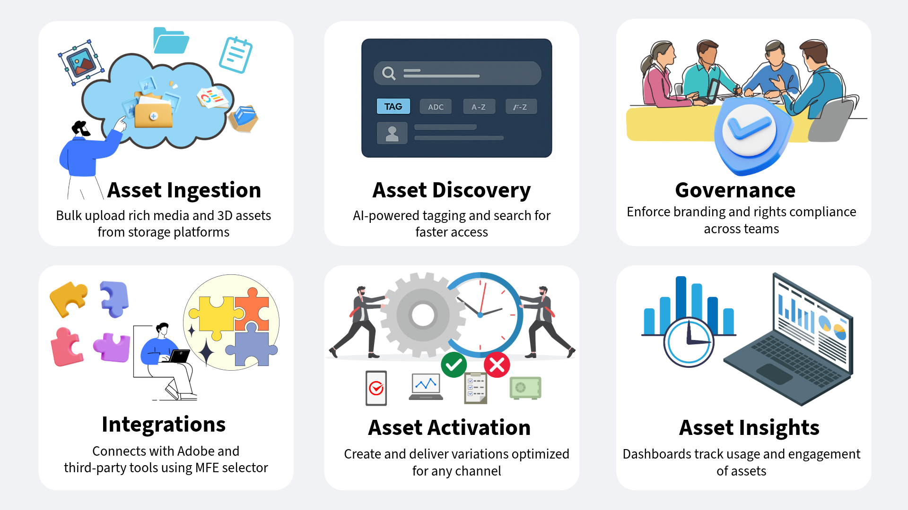
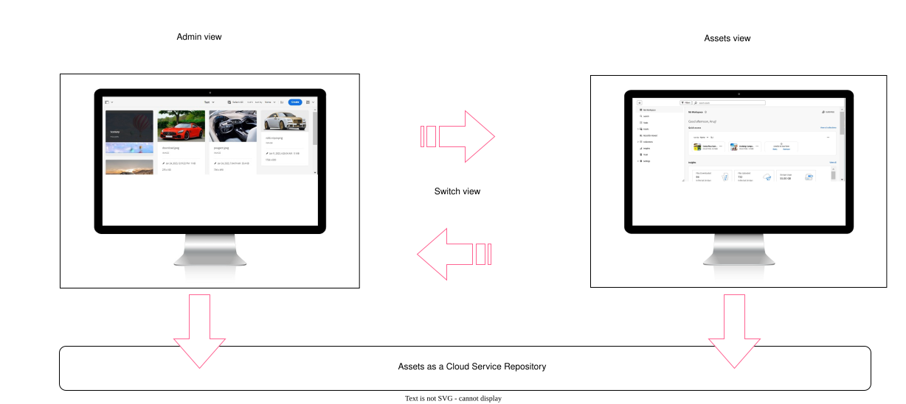

# Introducing Assets as a Cloud Service for Digital Asset Management in AEM {#assets-as-cloud-service-digital-asset-management-aem}

AEM Assets as a Cloud Service offers a cloud-native, PaaS solution for businesses not only to perform their Digital Asset Management and Dynamic Media operations, but also use next-generation smart capabilities, such as AI/ML. All from within a system that is always current, always available, and always learning.

Adobe offers robust Digital Asset Management (DAM) solutions for you to get the most out of your digital assets. Adobe Experience Manager Assets has two separate experiences that use the same Cloud Services repository to fit your requirements. For information on persona-based experiences for AEM Assets, see [Available persona-based experiences for Digital Asset Management](#persona-based-experiences).

For information on AEM Assets Ultimate and AEM Assets Prime offerings, see [Assets as a Cloud Service Ultimate](/help/assets/assets-ultimate-overview.md) and [Assets as a Cloud Service Prime](/help/assets/assets-prime.md).

Some of the key features of Adobe's Digital Asset Management include:

>[!BEGINTABS]

>[!TAB Ingestion]

## Asset ingestion {#asset-ingestion}

Use the bulk import feature to import large number of assets directly from a data source &ndash; such as Azure, AWS, Google Cloud, Dropbox, and OneDrive &ndash; to Assets as a Cloud Service.

You can perform the bulk import operation using the Admin view or Assets view. Assets view provides more data source options as compared to the Admin view.

In addition to the Web browser user interface, Experience Manager supports other clients on the desktop. They also provide upload experience without the need to go to the Web browser.

* Adobe Asset Link provides access to assets from Experience Manager in Adobe Photoshop, Adobe Illustrator, and Adobe InDesign desktop applications. You can upload the open document to Experience Manager. You can do so directly through the Adobe Asset Link interface found in these desktop applications.

* Experience Manager desktop app simplifies working with assets on the desktop, independent of their file type or the native application that handles them. It is useful to upload files in nested folder hierarchies from your local file system, as browser upload only supports uploading flat file lists.

Use these links to access detailed documentation on these asset ingestion tools:

<table>
<td>
   
   

      <a href="/help/assets/bulk-import-assets-view.md">
      <strong>Use Bulk Import tool</strong>
      </a>
   

   

      <em>Learn how to import a large number of assets directly from a data source</em>
   

</td>

<td>
   
   

      <a href="https://experienceleague.adobe.com/en/docs/experience-manager-desktop-app/using/get-started">
      <strong>Use AEM desktop app</strong>
      </a>
   

   

      <em>Learn how to use the AEM desktop app to upload files in nested folder hierarchies from your local file system.</em>
   

</td>
<td>
   
   

      <a href="https://helpx.adobe.com/enterprise/using/adobe-asset-link.html">
      <strong>Use Adobe Asset Link</strong>
      </a>
   

   

      <em>Learn how to upload assets to Experience Manager using Creative Cloud applications.</em>
   

</td>
</table>

>[!TAB AI-Powered features]

**Smart Tags**: Smart Tags use the artificially intelligent framework of Adobe AI to train its image recognition algorithm on your tag structure and business taxonomy. This content intelligence is then used to apply relevant tags on a different set of assets. AEM automatically applies smart tags to uploaded assets, by default.

**Intelligent Color-based Tagging & Search**: AEM Assets uses Adobe AI capabilities to distinguish between colors in an image and apply those traits as tags automatically on ingestion. These tags enable an enhanced Search experience, based on image color composition.

**AI-generated metadata**: AEM Assets uses AI to generate metadata automatically, including Title, Description, and Keywords. These AI-generated fields enhance metadata accuracy, making the assets easier to search, categorize, and recommend. This approach not only improves efficiency by eliminating manual tagging but also ensures consistency and scalability across large volumes of digital content.

**AI-powered assets bulk rename**: [Assets view allows you to rename multiple assets at once using Artificial Intelligence](/help/assets/bulk-rename-assets-view.md). You can select multiple files at once and rename them all together. Some of the example conversational rename prompts include *Change all files to 'my-file' and append an incrementing number* and *Prefix the files with 001, 002, etc. and translate into English*.

<table>
<td>
   
   

      <a href="/help/assets/smart-tags.md">
      <strong>Add AI Smart Tags to assets</strong>
      </a>
   

   

      <em>Learn how to apply smart tags automatically to uploaded assets.</em>
   

</td>

<td>
   
   

      <a href="/help/assets/manage-notifications-assets-view.md">
      <strong>Add Intelligent color-based tags</strong>
      </a>
   

   

      <em>Learn how to apply color-based tags automatically on ingestion.</em>
   

</td>
<td>
   
   

      <a href="/help/assets/metadata-assets-view.md">
      <strong>AI-generated metadata</strong>
      </a>
   

   

      <em>Use AI to generate asset metadata, such as Title and Description. </em>
   

</td>
</table>

**Contextual Search**: AEM Assets lets you search assets available in the repository by defining text prompts. Experience Manager Assets automatically transforms the text prompts to search filters and displays the search results. You can view and modify automatic filters using the Filters Pane to narrow down the search results more. Some of the conversational text prompt examples include the following:

   * *Images at least 200px tall and 100px wide with beach and clear sky* and 
   * *I need images of blue sky that are 1500 and 2500 pixel height and created in the past month that is not expired and are approved*.

**Generate assets using Adobe Firefly within AEM**: AEM Assets allows you to generate an asset, if your search query does not return any results, using Adobe Firefly in real-time. AEM Assets also then enables you to upload the generated image to the AEM Assets repository from within the AEM Assets user interface.

**Integration with Adobe Express**: AEM Assets integrates natively with Adobe Express, which allows you to access the assets directly stored in AEM Assets from within the Adobe Express user interface. You can also use Adobe Firefly Artificial Intelligence within Express to generate images using simple text prompts and place them on Express canvas. You can then save new or edited content in an AEM Assets repository.

<table>
<td>
   
   

      <a href="/help/assets/search-assets-view.md#contextual-search">
      <strong>Contextual Search</strong>
      </a>
   

   

      <em>Learn how to search assets using simple text prompts.</em>
   

</td>

<td>
   
   

      <a href="/help/assets/search-assets-view.md#search-firefly">
      <strong>Generate assets using Adobe Firefly</strong>
      </a>
   

   

      <em>Generate assets in real-time using Adobe Firefly.</em>
   

</td>
<td>
   
   

      <a href="/help/assets/native-integration-adobe-express.md">
      <strong>Integration with Adobe Express</strong>
      </a>
   

   

      <em>Use Adobe Express AI features within AEM Assets user interface.</em>
   

</td>
</table>

**Smart Imaging**: Smart Imaging provides even better image asset delivery performance by automatically optimizing an image's format and file size based on a customer's browser capability. It works with your existing image presets and uses intelligence at delivery. This intelligence further reduces image file size based on browser and network connection speed.

**Smart Crop**: An Adobe AI capability, to detect the focal point automatically in any image or video, and crop to maintain it. It captures the intended point of interest regardless of screen size and hence eliminates tedious manual tasks and delivers high-quality, fast-loading imagery and video that looks good on any device or screen.

**AI-generated video captions**: AI-generated video captions in Adobe Dynamic Media use artificial intelligence to generate captions automatically for video content. This feature is designed to improve accessibility and enhance the user experience by providing accurate captions. Captions are generated from the original audio, any additional audio tracks, or extra captions are provided in the `Captions and Audio` tab on the video properties page. With support for more than 60 languages, captions can be reviewed and previewed before publishing the video.
<table>
<td>
   
   

      <a href="/help/assets/dynamic-media/imaging-faq.md">
      <strong>Smart Imaging</strong>
      </a>
   

   

      <em>Optimize an image's format and file size based on a user's browser capability and network speed.</em>
   

</td>

<td>
   
   

      <a href="https://experienceleague.adobe.com/en/docs/experience-manager-learn/assets/dynamic-media/video/dynamic-media-smart-crop-video">
      <strong>Smart Crop</strong>
      </a>
   

   

      <em>Use AI to detect the focal point automatically in any image or video, and crop to maintain it</em>
   

</td>
<td>
   
   

      <a href="/help/assets/dynamic-media/video.md">
      <strong>AI-generated video captions</strong>
      </a>
   

   

      <em>Use artificial intelligence to generate captions automatically for video content. </em>
   

</td>
</table>

>[!TAB Discovery]

## Asset discovery {#asset-discovery}

After importing your assets to AEM Assets, it is a challenge to find the right assets quickly from such a huge collection.

AEM Assets provides features that help you quickly find the right asset. These features include AI-generated tagging (smart tags), customized metadata, and enhanced search capabilities.

**Metadata management**: Metadata is the most critical aspect while starting your asset management journey. Managing metadata gets completely out of the control of the administrators once the assets are distributed to the users. Effective asset metadata ensures better search, which is the ultimate destination for any DAM tool.

**Metadata Forms**: Assets as a Cloud Service provides many standard metadata fields by default. If you have additional metadata needs, and need more metadata fields to add business-specific metadata. Metadata forms let businesses add custom metadata fields to an asset's Details page. The business-specific metadata improves the governance and discovery of its assets. You can create forms from scratch or repurpose an existing form.

<table>
<td>
   
   

      <a href="/help/assets/metadata-assets-view.md">
      <strong>Manage Metadata in Assets view</strong>
      </a>
   

   

      <em>Learn how to manage metadata and metadata forms using Assets view.</em>
   

</td>

<td>
   
   

      <a href="https://experienceleaguecommunities.adobe.com/t5/adobe-experience-manager-blogs/how-to-manage-metadata-before-and-after-migrating-to-aem-assets/ba-p/744298">
      <strong>Metadata management best practices</strong>
      </a>
   

   

      <em>Learn how to manage metadata before and after migrating your assets to AEM.</em>
   

</td>
<td>
   
   

      <a href="/help/assets/manage-metadata.md">
      <strong>Manage metadata in Admin view</strong>
      </a>
   

   

      <em>Learn how to manage metadata and metadata forms using the Admin view.</em>
   

</td>
</table>

**Smart Tags**: Smart Tags use the artificially intelligent framework of Adobe AI to train its image recognition algorithm on your tag structure and business taxonomy. This content intelligence is then used to apply relevant tags on a different set of assets. AEM automatically applies smart tags to uploaded assets, by default.

**Search assets**: Once you have the right metadata in place, AEM Assets allows you to search using various operators, wildcards, advanced queries, and custom filters.

**Contextual Search**: AEM Assets also provides the Contextual Search capability, which enables you to search assets available in the repository by defining text prompts. Experience Manager Assets automatically transforms the text prompts to search filters and displays the search results. You can view and modify automatic filters using the Filters Pane to narrow down the search results more.

<table>
<td>
   
   

      <a href="/help/assets/smart-tags.md">
      <strong>Add Smart Tags to assets</strong>
      </a>
   

   

      <em>Learn how to apply smart tags automatically to uploaded assets.</em>
   

</td>

<td>
   
   

      <a href="/help/assets/search-assets-view.md">
      <strong>Search assets in Assets view</strong>
      </a>
   

   

      <em>Learn how to use Contextual Search effectively and other search capabilities in Assets view.</em>
   

</td>
<td>
   
   

      <a href="/help/assets/search-best-practices.md">
      <strong>Search best practices</strong>
      </a>
   

   

      <em>Learn about various scenarios to assist AEM users to perform basic to advanced level search.</em>
   

</td>
</table>

>[!TAB Governance]

## Asset management and governance {#asset-management-governance}

Once you have uploaded your assets to AEM Assets and set its metadata for better discoverability, you can perform various digital asset management tasks using the user-friendly interface of Assets view. 

**Asset Management Tasks**: Some of the basic tasks include search, download, move, copy, rename, delete, update, and edit operations.

You can also maintain asset versions, set asset status, and set asset expiration.

**My Workspace**: Assets view also includes a customizable workspace that provides widgets. These widgets provide convenient access to key areas of the Assets user interface and information that is most relevant to you. This page serves as a one-stop solution to provide an overview of your work items and to give quick access to key workflows.

**Content Credentials**: Another powerful feature that AEM Assets supports is Content Credentials. Brands are more concerned than ever about content transparency, AI disclosure, and preventing the tampering of assets. The Content Authenticity Initiative (CAI) at Adobe builds tools compliant with the Coalition for Content Provenance and Authenticity (C2PA) technical standard. Content Credentials, which are a new kind of encrypted, tamper-evident metadata can help viewers understand the lineage of content and ensure the integrity of brand assets. They can include a wide range of provenance data that offer insight into the history of a digital asset.

<table>
<td>
   
   

      <a href="/help/assets/manage-organize-assets-view.md">
      <strong>Asset management tasks</strong>
      </a>
   

   

      <em>Learn how to perform some basic as well as advanced asset management tasks.</em>
   

</td>

<td>
   
   

      <a href="/help/assets/my-workspace-assets-view.md">
      <strong>My Workspace</strong>
      </a>
   

   

      <em>Learn how to work with My Workspace to access key areas  of the Assets user interface quickly.</em>
   

</td>
<td>
   
   

      <a href="/help/assets/content-credentials.md">
      <strong>Content Credentials</strong>
      </a>
   

   

      <em>Gain insights on the history of a digital asset using Content Credentials.</em>
   

</td>
</table>

**Collections**: AEM Assets also enables you to organize your assets into collections. A collection is a set of assets, folders, or other collections within the Adobe Experience Manager Assets view. Use collections to share assets between users. Unlike folders, a collection can include assets from different locations. You can share multiple collections with a user. Each collection contains references to assets. The referential integrity of assets is maintained across collections.

**Notifications**: Assets view notifications enable you to monitor the operations performed on the assets, folders, or collections available in the repository. You need to select and subscribe to the content for which the notifications are sent to you. You can also configure the categories for which the notifications are sent to you.

**Detect duplicate assets**: AEM Assets also supports detecting duplicate assets. If a DAM user uploads one or more assets that already exist in the repository, Experience Manager detects the duplication and notifies the user.

<table>
<td>
   
   

      <a href="/help/assets/manage-collections-assets-view.md">
      <strong>Manage Collections</strong>
      </a>
   

   

      <em>Learn how to organize your assets into collections for efficient sharing of assets.</em>
   

</td>

<td>
   
   

      <a href="/help/assets/manage-notifications-assets-view.md">
      <strong>Set Notifications</strong>
      </a>
   

   

      <em>Learn how to set notifications to monitor the operations performed on assets, folders, or collections.</em>
   

</td>
<td>
   
   

      <a href="/help/assets/detect-duplicate-assets.md">
      <strong>Detect duplicate assets</strong>
      </a>
   

   

      <em>Detect duplicate assets uploaded to AEM Assets and notify to users.</em>
   

</td>
</table>

>[!TAB Integrations]

## Integration with Adobe and non-Adobe applications {#integration-adobe-non-adode-apps}

AEM Assets can integrate seamlessly with various Adobe and non-Adobe applications. The following is a summarized view of the available integrations:

+++**Integration with Adobe and non-Adobe applications**

* **Dynamic Media with OpenAPI capabilities**: [Dynamic Media with OpenAPI capabilities](/help/assets/dynamic-media-open-apis-overview.md) offers a comprehensive set of [search](/help/assets/search-assets-api.md) and [delivery](/help/assets/deliver-assets-apis.md) APIs. It allows your developers to integrate the delivery of assets easily with their applications. The applications include Adobe as well as third-party applications. It provides a Micro Frontend assets selector user interface to search and select approved assets. The selector can be effortlessly integrated with any application based on JavaScript frameworks such as React JS, Angular JS, and Vanilla JS.

* **Micro-Frontend Asset Selector**: Micro-Frontend Asset Selector provides a user interface that integrates with the Experience Manager Assets repository so that you can browse or search digital assets available in the repository. You can then use them in your application authoring experience.
You can integrate Asset Selector with an Adobe or a non-Adobe application.

<table>
<td>
   
   

      <a href="/help/assets/dynamic-media-open-apis-overview.md">
      <strong>Dynamic Media with OpenAPI capabilities overview</strong>
      </a>
   

   

      <em>Learn key benefits and how to get it enabled. </em>
   

</td>

<td>
   
   

      <a href="/help/assets/restrict-assets-delivery.md">
      <strong>Restrict access to assets in Experience Manager</strong>
      </a>
   

   

      <em> Configure roles to restrict access to approved assets.</em>
   

</td>
<td>
   
   

      <a href="/help/assets/overview-asset-selector.md">
      <strong>Micro-Frontend Asset Selector</strong>
      </a>
   

   

      <em>Learn how to integrate Micro-Frontend Asset Selector with an Adobe or a non-Adobe application.</em>
   

</td>
</table>

+++

+++**Native integration with Adobe applications**

* **Integration with Adobe Workfront**: [!DNL Adobe Workfront] is a work management application that helps you manage the entire lifecycle of work in one place. The integration between [!DNL Workfront] and [!DNL Adobe Experience Manager Assets] lets organizations improve content velocity and time-to-market by intrinsically connecting work and digital asset management. Within the context of managing their work in Workfront, users have access to the required documents and images.

   Adobe offers to [integrate [!DNL Workfront] and [!DNL Adobe Experience Manager Assets] natively ](https://experienceleague.adobe.com/en/docs/workfront/using/documents/wf-aem-integrations/wf-aem-essentials/aem-asset-integrations).

* **Integration with Figma**: AEM Assets integrates natively with Figma, which allows designers to access the assets directly stored in AEM Assets from within the Figma User Interface. You can place content managed in AEM Assets in the Figma canvas and then save new or edited content in the AEM Assets repository. To access the AEM Assets Connector available on the Figma Community page, click [here](https://www.figma.com/community/plugin/1512561378275712210/adobe-experience-manager-aem-assets-connector).

* **Native integration with Adobe Express**: AEM Assets integrates natively with Adobe Express, which allows you to access the assets directly stored in AEM Assets from within the Adobe Express user interface. You can place content managed in AEM Assets in the Express canvas and then save new or edited content in an AEM Assets repository.

* **Connect AEM Assets to Creative Cloud**: Experience Manager Assets can connect to a Creative Cloud entitlement provisioned in a different IMS organization. This ability lets you use the latest Creative Cloud integrations in AEM Assets, including Express and Creative Cloud Libraries. If your Creative Cloud products and AEM Assets are provisioned to separate IMS organizations, you can connect to a different Creative Cloud organization to be able to execute integrated workflows between the two solutions.

<table>
<td>
   
   

      <a href="/help/assets/workfront-integrations.md">
      <strong>Integration with Adobe Workfront</strong>
      </a>
   

   

      <em>Integrate with Adobe Workfront to manage the entire work lifecycle at one place.</em>
   

</td>
<td>
   
   

      <a href="/help/assets/manage-collections-assets-view.md">
      <strong>Integration with Figma</strong>
      </a>
   

   

      <em>Access the assets stored in AEM Assets from within the Figma User Interface</em>
   

</td>
<td>
   
   

      <a href="/help/assets/native-integration-adobe-express.md">
      <strong>Native integration with Adobe Express</strong>
      </a>
   

   

      <em>Place assets available within AEM Assets on the Express canvas and save updated assets to AEM. </em>
   

</td>

</table>

* **Integration with Adobe Journey Optimizer**: Bring marketing and creative workflows together using Adobe Experience Manager Assets. Natively integrated with Adobe Journey Optimizer, access Assets as a Cloud Service to store, manage, discover and distribute digital assets. It provides a single, centralized repository of assets that you can use to populate your messages.

* **Integration with Commerce**: Adobe Experience Manager (AEM) Assets Integration for Commerce combines the robust capabilities of AEM as a Digital Asset Management (DAM) system with Adobe Commerce to enhance eCommerce experiences. These capabilities are delivered by connecting Commerce projects to AEM's powerful asset management environment to provide a seamless, scalable, and efficient way to manage and deliver assets across commerce storefronts.
* **Integrating AEM Assets with Document-Based Authoring flows for Edge Delivery Services**: When [!DNL AEM Assets] integrates with your Document-Based Authoring tools, such as [!DNL Microsoft Word] or [!DNL Google Docs], it provides an Asset Selector in your authoring tool. Use this Asset Selector to access [!DNL AEM Assets], and insert approved assets into your content.
If you already have an [!DNL Edge Delivery Services] website, see [[!DNL AEM Assets] plugin](https://github.com/adobe-rnd/aem-assets-plugin/blob/main/README.md) documentation to learn how to integrate [!DNL AEM Assets] with your existing [!DNL AEM] project.

* **Integrating [!DNL AEM Assets] with [!DNL Universal Editor] based authoring flows for [!DNL Edge Delivery Services]**: Set up the [!DNL Universal Editor] to integrate with [!DNL AEM Assets]. This integration enables you to use [!DNL Dynamic Media with OpenAPI capabilities] to deliver assets.

   * See [Configuration in [!DNL Edge Delivery] Site](https://developer.adobe.com/uix/docs/extension-manager/extension-developed-by-adobe/configurable-asset-picker/#configuration-in-edge-delivery-site) to learn how to add a custom asset picker function in [!DNL Universal Editor]. The custom asset picker enables you to insert assets into your [!DNL Universal Editor] content directly.
   * See the [Extension overview](https://developer.adobe.com/uix/docs/extension-manager/extension-developed-by-adobe/configurable-asset-picker/#extension-overview) to learn how to access to [!DNL AEM Assets] and insert the assets while authoring in [!DNL Universal Editor].

<table>
<td>
   
   

      <a href="https://experienceleague.adobe.com/en/docs/journey-optimizer/using/content-management/combine/assets">
      <strong>Integration with Adobe Journey Optimizer</strong>
      </a>
   

   

      <em>Bring marketing and creative workflows together using integration with AJO</em>
   

</td>
<td>
   
   

      <a href="https://experienceleague.adobe.com/en/docs/commerce/aem-assets-integration/overview">
      <strong>Integration with Commerce</strong>
      </a>
   

   

      <em>Integrate AEM Assets with Commerce to enhance eCommerce experiences.</em>
   

</td>
<td>
   
   

      <a href="/help/assets/integrate-aem-assets-edge-delivery-services.md">
      <strong>Integrate AEM Assets with EDS</strong>
      </a>
   

   

      <em>Integrate AEM Assets with document-based and Universal Editor based authoring flows.</em>
   

</td>
</table>

+++

>[!TAB AI Agents]

## AI Agents {#ai-agents}

AEM as a Cloud Service provides intelligent **Agents** to enhance content management, optimization, and governance. These agents allow users to discover content quickly, optimize campaigns, and ensure compliance across digital assets.

**Discovery Agent**

The Discovery Agent delivers AEM content on demand through natural, conversational prompts for a streamlined, click-free discovery experience. It intelligently searches across **Assets, Content Fragments, and Adaptive Forms** to deliver relevant content such as images, videos, PDFs, articles, and form templates. Using natural language, you can search without building complex queries or applying filters in the AEM Assets interface. Based on your prompt, the agent returns curated results along with asset metadata and delivery URLs, ready to be embedded in other applications.

Some of the key benefits of Discovery Agent include:

* **Unified Content Discovery:** Access all types of AEM content, such as images, videos, PDF documents, articles, and forms from a single conversational interface.
* **Faster Campaign Planning:** Quickly gather visuals and forms for marketing campaigns across Emails, Web, and Social channels.
* **Enhanced Productivity:** Reduce time spent browsing repositories or filtering metadata through automated, intent-based search.
* **Consistent Content Utilization:** Ensures reuse of approved assets and fragments, maintaining brand consistency across channels.

**Skills:** Natural language content discovery, Tag-based asset discovery, Folder-based content discovery, Format & orientation-based asset discovery  
**Personas:** Campaign Managers, Channel Marketers, DAM Librarians, Agencies & Partners  
**Access:** Via AI Assistant in AEM  

**Common Use Cases / Sample Prompts:**  

* Show images tagged “office” in folder WKND.  
* List all published content fragments for WKND beverages.  
* Find forms to apply for a job.  
* Show assets with person in landscape orientation.  

**Content Optimization Agent**

The **Content Optimization Agent** helps refine and adapt assets using natural language prompts. It can generate new renditions, adjust visuals, change backgrounds, and create channel-ready variations automatically. Works with the Discovery Agent and **Dynamic Media with OpenAPI** for seamless optimization.

**Key Benefits:**

* **Effortless asset transformation:** Resize, sharpen, recolor, or mirror images.  
* **Channel-optimized outputs:** Generate renditions for Instagram, web banners, and other marketing channels.  
* **Creative enhancements at scale:** Apply background changes or overlays for high-volume workflows.  

**Access:** Via AI Assistant in AEM.

**Sample Prompts:**

* Create a 2000px JPEG rendition.
* Sharpen the image.
* Change background color to #ff8932.  
* Create a rendition for an Instagram story.

**Limitations:** Some optimizations are not supported for PNG assets.

**Governance Agent**

The Governance Agent helps ensure compliance, brand consistency, and policy enforcement across AEM content. It identifies content that does not meet metadata, accessibility, or corporate guidelines.

Some of the key benefits of Governance Agent include:

* **Compliance Monitoring:** Detects policy violations in content.  
* **Metadata Enforcement:** Ensures assets have required metadata for governance.  
* **Brand Consistency:** Flags content that does not meet corporate standards.  

**Skills:** Policy compliance checks, Metadata validation, Accessibility auditing, Automated alerts for violations  
**Personas:** DAM Admins, Compliance Officers, Brand Managers  
**Access:** Via AEM AI Assistant  

**Common Use Cases / Sample Prompts:**  

* Validate metadata for all assets in WKND folder.  
* Identify assets missing brand guidelines.  
* Audit published content for accessibility compliance.  

<table>
<td>
   
   

      <a href="https://experienceleague.adobe.com/en/docs/experience-manager-cloud-service/content/ai-in-aem/agents/discovery/overview">
      <strong>Discovery Agent Overview</strong>
      </a>
   

   

      <em>Overview of Discovery Agent and its conversational content discovery capabilities.</em>
   

</td>

<td>
   
   

      <a href="https://experienceleague.adobe.com/en/docs/experience-manager-cloud-service/content/ai-in-aem/agents/content-optimization/overview">
      <strong>Content Optimization Agent Overview</strong>
      </a>
   

   

      <em>Overview of Content Optimization Agent and supported optimization workflows.</em>
   

</td>

<td>
   
   

      <a href="https://experienceleague.adobe.com/en/docs/experience-manager-cloud-service/content/ai-in-aem/agents/governance/overview">
      <strong>Governance Agent Overview</strong>
      </a>
   

   

      <em>Overview of Governance Agent for compliance and policy enforcement.</em>
   

</td>
</table>

### **How to Access Agents in AEM**

Agents are accessible via the **AI Assistant** in AEM Cloud Service. Log in to [experience.adobe.com](https://experience.adobe.com/) and interact with AI Assistant using natural language prompts.

>[!TAB Activation]

## Asset activation {#asset-activation}

Unlock the full potential of your digital assets with AEM Assets using Content Hub to Dynamic Media — including powerful OpenAPI capabilities. AEM Assets offers a comprehensive suite of solutions designed to streamline asset transformation and optimize delivery across various channels.

+++**Content Hub**

Content Hub is available as part of Experience Manager Assets as a Cloud Service for democratizing access to on-brand content for organizations and their business partners. It focuses on distributing assets for activation at scale and creation of on-brand content variants for improved marketing agility.

Content Hub offers the following key benefits:

* **Find and share all brand approved assets available in an intuitive portal**: AEM Assets serves as a single source of truth and all approved assets are automatically available on Content Hub in a flat hierarchy to improve the search experience.

* **Configurable User interface**: The most common properties within Content Hub, such as filters for search, fields available while adding or importing assets, asset properties, banner content for branding are configurable and an administrator can easily configure the Content Hub user interface based on their requirements.   

* **Empower non-creatives to edit and remix content while staying on brand**: Content Hub allows you to create new content with Adobe Express (if you have Adobe Express entitlements). You can edit existing content with easy to use tools, produce on-brand variations with templates and brand elements, and create new content with the latest GenAI capabilities from Adobe Firefly.

* **Gain insights on how content is used across teams**: [!DNL Content Hub] provides valuable insights into assets, addressing a common challenge that marketing stakeholders often encounter - asset usage statistics used in marketing campaigns, channels, and different regions. By gaining a clear understanding of the performance and popularity of the assets, it delivers actionable insights essential for enhancing user experience.

<table>
<td>
   
   

      <a href="/help/assets/product-overview.md">
      <strong>Content Hub Overview</strong>
      </a>
   

   

      <em>Learn more about Content Hub, its key benefits, and how to access it. </em>
   

</td>

<td>
   
   

      <a href="/help/assets/configure-content-hub-ui-options.md">
      <strong>Configure Content Hub User Interface</strong>
      </a>
   

   

      <em>Learn how to configure options available on the Content Hub user interface .</em>
   

</td>
<td>
   
   

      <a href="/help/assets/edit-images-content-hub.md">
      <strong>Edit using Adobe Express</strong>
      </a>
   

   

      <em>Learn how to edit images in Content Hub using Adobe Express.</em>
   

</td>
</table>

+++

+++**Dynamic Media**

Dynamic Media helps you deliver rich visual merchandising and marketing assets on demand. It also helps you create and serve interactive viewing experiences, including zoom, 360-degree spin, and video. Your assets are dynamically scaled for consumption on web, mobile, and social sites. Using a set of primary source assets – such as images, video, and 3D – Dynamic Media generates and delivers multiple variations of this rich content, in real time through its global, scalable, performance-optimized CDN (Content Delivery Network).

Dynamic Media offers the following key features:

* **Smart Imaging**: Smart Imaging provides even better image asset delivery performance by automatically optimizing an image's format and file size based on a customer's browser capability. It works with your existing image presets and uses intelligence at delivery. This intelligence further reduces image file size based on browser and network connection speed. 

* **Adaptive video sets**: An Adaptive Video Set groups versions of the same video that are encoded at different bit rates and formats. You start with your original, primary video, which you upload into the system. Dynamic Media automatically sizes, or transcodes, that video into multiple videos. Then, at the time of delivery, it intelligently determines which video screen, what quality, and what format to use, and delivers it to either the phone, tablet, or desktop computer.

* **Smart Crop**: An Adobe AI capability, to automatically detect the focal point in any image or video, and crop to maintain it. It captures the intended point of interest regardless of screen size and hence eliminates tedious manual tasks and delivers high-quality, fast-loading imagery and video that looks good on any device or screen.

* **Dynamic Media templates**: Create real time customizable templates for your banners and flyers using Dynamic Media templates, a WYSIWYG template editor. Publish your Dynamic Media template and use it in downstream applications. A Dynamic Media template includes image and text layers. Add parameters to the image and text layers of the template and use Dynamic Media URLs to reposition and resize the layer and update its content in real-time.

* **Multi-audio and caption**: Add multiple captions and multiple audio tracks to a primary video. This capability means that your videos are accessible to a global audience. You can customize a single, published primary video to a global audience in multiple languages and adhere with accessibility guidelines for different geographical regions. Authors can also manage the captions and audio tracks from a single tab in the user interface.

* **Dynamic Adaptive Streaming over HTTP (DASH) support**: Dynamic Media supports Adaptive streaming in Dynamic Media video delivery (with CMAF enabled), which ensures a better user viewing experience for videos. DASH is the international standard protocol for adaptive video streaming and is widely adopted in the industry.

* **AI-generated video captions**: AI-generated video captions in Adobe Dynamic Media use artificial intelligence to generate captions automatically for video content. With support for more than 60 languages, captions can be reviewed and previewed before publishing the video.

For information on available Dynamic Media offerings, see [Dynamic Media Prime and Ultimate](/help/assets/dynamic-media/dm-prime-ultimate.md).

<table>
<td>
   
   

      <a href="/help/assets/dynamic-media/dynamic-media.md">
      <strong>Work with Dynamic Media</strong>
      </a>
   

   

      <em>Learn how to deliver assets for consumption on web, mobile, and social sites. </em>
   

</td>

<td>
   
   

      <a href="/help/assets/dynamic-media/dm-journey-part1.md">
      <strong>Dynamic Media Journey</strong>
      </a>
   

   

      <em>Learn how Dynamic Media brings value to your work.</em>
   

</td>
<td>
   
   

      <a href="/help/assets/dynamic-media/dm-best-practices.md">
      <strong>Dynamic Media best practices</strong>
      </a>
   

   

      <em>Best practices while working with images, videos, and viewers.</em>
   

</td>
</table>

+++

+++**Dynamic Media with OpenAPI capabilities**

In today's fast-paced digital world, unlocking the full potential of your brand's digital assets is crucial for staying ahead of the competition. A holistic Digital Assets Management (DAM) solution facilitates assets governance, promotes brand consistency, and accelerates content delivery while ensuring brand integrity, and exceptional customer experiences.

Dynamic Media with OpenAPI capabilities puts DAM at the core of an agile and efficient content supply chain ecosystem to ensure asset governance and delivery.

Dynamic Media with OpenAPI capabilities offers the following key benefits:

* **Seamless integrations**: Dynamic Media with OpenAPI capabilities offers a comprehensive set of search and delivery APIs. It allows your developers to easily [integrate the delivery of assets with their applications](/help/assets/integrate-dynamic-media-open-apis.md). The applications include Adobe as well as third-party applications. It provides a [Micro Frontend assets selector user interface](/help/assets/overview-asset-selector.md) to search and select approved assets. The selector can be effortlessly integrated with any application based on JavaScript frameworks such as React JS, Angular JS, and Vanilla JS.

* **Centralized management of digital assets**: DAM is the single source of truth for all digital assets. Your digital assets are managed centrally in AEM Assets and delivered to consuming applications by reference using delivery URLs, without copying asset binaries. 

* **Real-time updates**: Any changes made to approved assets in DAM, including version updates and metadata modifications, are automatically reflected in the delivery URLs. With a short Time-to-Live (TTL) value of 10 minutes configured for Dynamic Media with OpenAPI capabilities via CDN, updates become visible across all authoring and published interfaces in under 10 minutes. 

* **Brand consistency**: Only [brand-approved assets](/help/assets/approve-assets.md) are exposed to downstream applications. [Brand Managers and Marketers maintain strict control over brand assets](/help/assets/restrict-assets-delivery.md). Only the approved and latest version of the asset is available for use, ensuring brand consistency across all channels and applications.

* **Web-optimized delivery**: Digital assets are delivered in web-optimized formats to enhance your digital experiences' Core Web Vitals. This optimization includes support for WebP renditions for images, adaptive streaming through HLS or DASH protocols for videos, and original renditions for documents.

* **Dynamic asset transformation**: The system allows for on-the-fly image transformation using URL parameters known as image modifiers. [For example, width, height, rotate, flip, quality, crop, format, and smart crop](/help/assets/deliver-assets-apis.md). Transformed renditions are generated dynamically and delivered seamlessly via the CDN.

* **Secure delivery of assets**: Dynamic Media with OpenAPI capabilities provides a mechanism for control over access to your digital assets. You can specify user roles or groups as metadata for to-be-secured assets and set a predefined timeframe during which [only authorized users can access these assets](/help/assets/restrict-assets-delivery.md). The delivery URLs for secured assets do not resolve for unauthorized users during the restricted period.

For information on available Dynamic Media offerings, see [Dynamic Media Prime and Ultimate](/help/assets/dynamic-media/dm-prime-ultimate.md).

<table>
<td>
   
   

      <a href="/help/assets/dynamic-media-open-apis-overview.md">
      <strong>Dynamic Media with OpenAPI capabilities overview</strong>
      </a>
   

   

      <em>Learn key benefits and how to get it enabled. </em>
   

</td>

<td>
   
   

      <a href="/help/assets/restrict-assets-delivery.md">
      <strong>Restrict access to assets in Experience Manager</strong>
      </a>
   

   

      <em> Configure roles to restrict access to approved assets.</em>
   

</td>
<td>
   
   

      <a href="/help/assets/integrate-remote-approved-assets-with-sites.md">
      <strong>Integrate remote AEM Assets with AEM Sites</strong>
      </a>
   

   

      <em>Integrate remote AEM Assets with AEM Sites environment. </em>
   

</td>
</table>

+++

>[!TAB Insights]

## Asset Insights {#asset-insights}

Asset reporting provides administrators with visibility into activity of the Adobe Experience Manager Assets View environment. This data provides useful information about how users interact with content and the product. All users can access the Insights dashboard and the ones who are assigned to the Administrator's product profile can create user-defined reports.

You can generate various types of reports, such as Upload, Download, and Dynamic Media delivery.

* **Insights in Assets view**: Assets view enables you to view real-time data for your Assets view environment with the Insights dashboard. You can view real-time event metrics during the last 30 days or for the last 12 months. The events include Downloads, Uploads, Storage Usage, Top Searches, Asset Count by Size, and Asset Count by Asset Type.

* **Adobe Analytics integration in Admin view**: Assets Insights functionality lets you track user ratings and usage statistics of images that are used in third-party websites, marketing campaigns, and Adobe's creative solutions. It helps provide insights about the performance and popularity of the images. Assets Insights captures user activity details, such as the number of times an image is rated, clicked, and impressions (number of times an image is loaded on the website). It assigns scores to images based on these statistics. You can use the scores and performance statistics to select popular images for inclusion in catalogs, marketing campaigns, and so on. You can even formulate archival and license renewal policies based on these statistics. To let Assets Insights display usage statistics for assets, first configure the feature to fetch reporting data from Adobe Analytics.

* **Content Hub Insights**: Content Hub provides valuable insights into assets, addressing a common challenge that marketing stakeholders often encounter - asset usage statistics used in marketing campaigns, channels, and different regions. By gaining a clear understanding of the performance and popularity of the assets, it delivers actionable insights essential for enhancing user experience.

<table>
<td>
   
   

      <a href="/help/assets/manage-reports-assets-view.md">
      <strong>Manage reports in Assets view</strong>
      </a>
   

   

      <em>Derive insights on key success metrics using Assets view. </em>
   

</td>

<td>
   
   

      <a href="/help/assets/asset-reports.md">
      <strong>Manage reports in Admin view</strong>
      </a>
   

   

      <em>Learn how to manage Adobe Analytics integrated reports in the Admin view.</em>
   

</td>
<td>
   
   

      <a href="/help/assets/insights-content-hub.md">
      <strong>Assets insights in Content Hub</strong>
      </a>
   

   

      <em>Learn how to view assets insights in Content Hub.</em>
   

</td>
</table>

>[!ENDTABS]

## Available persona-based experiences for Digital Asset Management {#persona-based-experiences}

Adobe offers robust Digital Asset Management (DAM) solutions for you to get the most out of your digital assets. Adobe Experience Manager Assets has two separate experiences that use the same Cloud Services repository:

* **Admin View**: The existing Assets as a Cloud Service user interface. Use the Admin view for all advanced Digital Asset Management capabilities including integrations, workflows, content automation, publishing and more. 

* **Assets View**: Adobe's lightweight asset management experience to store, manage, discover, and use digital assets. Streamlined user interface containing essential Digital Asset Management capabilities. Designed for the light-weight DAM users with a focus on upload, metadata management, search, download, and sharing.

Users with access to the Admin view can also access the Assets view. Assets View provides a simplified user interface which makes it easy to manage, discover, and distribute your digital assets. A broad set of users from across different functions, including creatives, marketing and line-of-business teams, can collaborate on assets and access the right, approved assets when and where they need them. Many casual DAM users prefer the Assets view because it only contains a subset of features. The experience is targeted to creatives, read-only asset consumers, and lighter-weight DAM users.  

DAM librarians, developers, and super-users may continue to use the Admin view or switch between the user interfaces, as needed. You can select the experience that works best for your role. 

For information on how to access the Assets view and some of the simplifications that it offers over the Admin view, see [Introduction to Assets view](/help/assets/assets-view-introduction.md).

## AI Assistant in AEM

For customers who have [completed pre-requisite criteria](/help/implementing/cloud-manager/ai-assistant-in-aem.md#get-access), the AI Assistant in AEM is available to users of their organization. See [AI Assistant in AEM](/help/implementing/cloud-manager/ai-assistant-in-aem.md).
