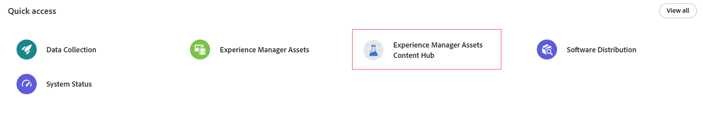
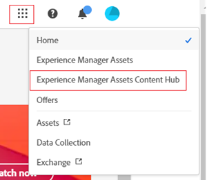
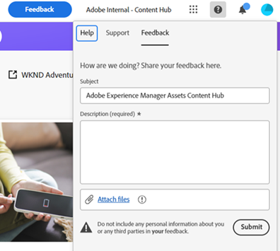
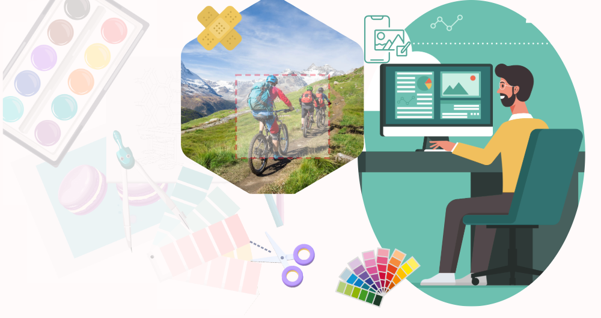

# Explore Content Hub {#overview-content-hub}

| [Search Best Practices](/help/assets/search-best-practices.md) |[Metadata Best Practices](/help/assets/metadata-best-practices.md)|[Dynamic Media with OpenAPI capabilities](/help/assets/dynamic-media-open-apis-overview.md)|[AEM Assets developer documentation](https://developer.adobe.com/experience-cloud/experience-manager-apis/)|
| ------------- | --------------------------- |----|-----|

>[!AVAILABILITY]
>
>Content Hub guide is now available in PDF format. Download the entire guide and use Adobe Acrobat AI Assistant to answer your queries. 
>
>[!BADGE Content Hub Guide PDF]{type=Informative url="https://helpx.adobe.com/content/dam/help/en/experience-manager/aem-assets/content-hub.pdf"}

Content Hub is available as part of Experience Manager Assets as a Cloud Service for democratizing access to on-brand content for organizations and their business partners. It focuses on distributing assets for activation at scale and creation of on-brand content variants for improved marketing agility.

## Why Content Hub?

Content Hub offers the following key benefits:

**Find and share all brand approved assets available in an intuitive portal** 

AEM Assets serves as a single source of truth and all approved assets are automatically available on Content Hub in a flat hierarchy to improve the search experience.

**Configurable User interface**

 The most common properties within Content Hub, such as filters for search, fields available while adding or importing assets, asset properties, banner content for branding are configurable and an administrator can easily configure the Content Hub user interface based on their requirements.   

**Empower non-creatives to edit and remix content while staying on brand**

Content Hub allows you to create new content with Adobe Express (if you have Adobe Express entitlements). You can edit existing content with easy to use tools, produce on-brand variations with templates and brand elements, and create new content with the latest GenAI capabilities from Adobe Firefly.

**Gain insights on how content is used across teams**

[!DNL Content Hub] provides valuable insights into assets, addressing a common challenge that marketing stakeholders often encounter - asset usage statistics used in marketing campaigns, channels, and different regions. By gaining a clear understanding of the performance and popularity of the assets, it delivers actionable insights essential for enhancing user experience.

## Prerequisites {#prerequisites-content-hub}

Content Hub requires a production author environment of Experience Manager as a Cloud Service, 2024.6 release or newer (minimum version is 2024.6.16799).

## How to access Content Hub? {#access-content-hub}

[After setting up Content Hub](/help/assets/deploy-content-hub.md) and adding a user to the [Content Hub product profile](/help/assets/deploy-content-hub.md#content-hub-instance-product-profile), Content Hub can be accessed using the following ways:

* Access Content Hub using the following link:

   `https://experience.adobe.com/#/assets/contenthub`

* Log on to [experience.adobe.com](https://auth.services.adobe.com/en_GB/index.html?callback=https%3A%2F%2Fims-na1.adobelogin.com%2Fims%2Fadobeid%2Fexc_app%2FAdobeID%2Ftoken%3Fredirect_uri%3Dhttps%253A%252F%252Fexperience.adobe.com%252F%2523old_hash%253Dold_hash%253D%252523%25252F%2526from_ims%253Dtrue%253Fclient_id%253Dexc_app%2526api%253Dauthorize%2526scope%253Dab.manage%252Caccount_cluster.read%252Cadditional_info%252Cadditional_info.job_function%252Cadditional_info.projectedProductContext%252Cadditional_info.roles%252CAdobeID%252Cadobeio.appregistry.read%252Cadobeio_api%252Caudiencemanager_api%252Ccreative_cloud%252Cmps%252Copenid%252Corg.read%252Cpps.read%252Cread_organizations%252Cread_pc%252Cread_pc.acp%252Cread_pc.dma_tartan%252Csession%26state%3D%257B%2522jslibver%2522%253A%2522v2-v0.31.0-2-g1e8a8a8%2522%252C%2522nonce%2522%253A%25222316022399331147%2522%257D%26code_challenge_method%3Dplain%26use_ms_for_expiry%3Dtrue&client_id=exc_app&scope=ab.manage%2Caccount_cluster.read%2Cadditional_info%2Cadditional_info.job_function%2Cadditional_info.projectedProductContext%2Cadditional_info.roles%2CAdobeID%2Cadobeio.appregistry.read%2Cadobeio_api%2Caudiencemanager_api%2Ccreative_cloud%2Cmps%2Copenid%2Corg.read%2Cpps.read%2Cread_organizations%2Cread_pc%2Cread_pc.acp%2Cread_pc.dma_tartan%2Csession&state=%7B%22jslibver%22%3A%22v2-v0.31.0-2-g1e8a8a8%22%2C%22nonce%22%3A%222316022399331147%22%7D&relay=64da7fa8-cd9e-47cf-9892-7f3ef3092f8c&locale=en_GB&flow_type=token&dctx_id=v%3A2%2Cs%2Cf%2Cb8e64530-b013-11ee-a6c1-e721bdec0171&idp_flow_type=login&response_type=token&profile_filter=%7B%22findFirst%22%3Atrue%2C+%22fallbackToAA%22%3Atrue%2C+%22preferForwardProfile%22%3Atrue%2C+%22searchEntireCluster%22%3Atrue%7D%3B+isOwnedByOrg%28%2776B329395DF155D60A495E2C%40AdobeOrg%27%29&code_challenge_method=plain&redirect_uri=https%3A%2F%2Fexperience.adobe.com%2F%23old_hash%3Dold_hash%3D%2523%252F%26from_ims%3Dtrue%3Fclient_id%3Dexc_app%26api%3Dauthorize%26scope%3Dab.manage%2Caccount_cluster.read%2Cadditional_info%2Cadditional_info.job_function%2Cadditional_info.projectedProductContext%2Cadditional_info.roles%2CAdobeID%2Cadobeio.appregistry.read%2Cadobeio_api%2Caudiencemanager_api%2Ccreative_cloud%2Cmps%2Copenid%2Corg.read%2Cpps.read%2Cread_organizations%2Cread_pc%2Cread_pc.acp%2Cread_pc.dma_tartan%2Csession&use_ms_for_expiry=true#/) and click **[!UICONTROL Experience Manager Assets Content Hub]** available in the **[!UICONTROL Quick access]** section:
   

* Log on to [experience.adobe.com](https://auth.services.adobe.com/en_GB/index.html?callback=https%3A%2F%2Fims-na1.adobelogin.com%2Fims%2Fadobeid%2Fexc_app%2FAdobeID%2Ftoken%3Fredirect_uri%3Dhttps%253A%252F%252Fexperience.adobe.com%252F%2523old_hash%253Dold_hash%253D%252523%25252F%2526from_ims%253Dtrue%253Fclient_id%253Dexc_app%2526api%253Dauthorize%2526scope%253Dab.manage%252Caccount_cluster.read%252Cadditional_info%252Cadditional_info.job_function%252Cadditional_info.projectedProductContext%252Cadditional_info.roles%252CAdobeID%252Cadobeio.appregistry.read%252Cadobeio_api%252Caudiencemanager_api%252Ccreative_cloud%252Cmps%252Copenid%252Corg.read%252Cpps.read%252Cread_organizations%252Cread_pc%252Cread_pc.acp%252Cread_pc.dma_tartan%252Csession%26state%3D%257B%2522jslibver%2522%253A%2522v2-v0.31.0-2-g1e8a8a8%2522%252C%2522nonce%2522%253A%25222316022399331147%2522%257D%26code_challenge_method%3Dplain%26use_ms_for_expiry%3Dtrue&client_id=exc_app&scope=ab.manage%2Caccount_cluster.read%2Cadditional_info%2Cadditional_info.job_function%2Cadditional_info.projectedProductContext%2Cadditional_info.roles%2CAdobeID%2Cadobeio.appregistry.read%2Cadobeio_api%2Caudiencemanager_api%2Ccreative_cloud%2Cmps%2Copenid%2Corg.read%2Cpps.read%2Cread_organizations%2Cread_pc%2Cread_pc.acp%2Cread_pc.dma_tartan%2Csession&state=%7B%22jslibver%22%3A%22v2-v0.31.0-2-g1e8a8a8%22%2C%22nonce%22%3A%222316022399331147%22%7D&relay=64da7fa8-cd9e-47cf-9892-7f3ef3092f8c&locale=en_GB&flow_type=token&dctx_id=v%3A2%2Cs%2Cf%2Cb8e64530-b013-11ee-a6c1-e721bdec0171&idp_flow_type=login&response_type=token&profile_filter=%7B%22findFirst%22%3Atrue%2C+%22fallbackToAA%22%3Atrue%2C+%22preferForwardProfile%22%3Atrue%2C+%22searchEntireCluster%22%3Atrue%7D%3B+isOwnedByOrg%28%2776B329395DF155D60A495E2C%40AdobeOrg%27%29&code_challenge_method=plain&redirect_uri=https%3A%2F%2Fexperience.adobe.com%2F%23old_hash%3Dold_hash%3D%2523%252F%26from_ims%3Dtrue%3Fclient_id%3Dexc_app%26api%3Dauthorize%26scope%3Dab.manage%2Caccount_cluster.read%2Cadditional_info%2Cadditional_info.job_function%2Cadditional_info.projectedProductContext%2Cadditional_info.roles%2CAdobeID%2Cadobeio.appregistry.read%2Cadobeio_api%2Caudiencemanager_api%2Ccreative_cloud%2Cmps%2Copenid%2Corg.read%2Cpps.read%2Cread_organizations%2Cread_pc%2Cread_pc.acp%2Cread_pc.dma_tartan%2Csession&use_ms_for_expiry=true#/) and click **[!UICONTROL Experience Manager Assets Content Hub]** available in the product switcher:
   

## Provide Content Hub feedback {#provide-content-hub-feedback}

To recommend any product-related improvements, click **[!UICONTROL Feedback]** next to your Organization name at the top of the Content Hub user interface.

Specify a subject, a description of the recommendation, and attach files, if required. Click **[!UICONTROL Submit]** to submit the feedback to Adobe.

## Setup Content Hub for your team {#setup-content-hub}

Follow these steps to setup Content Hub for your team:

1. [Enable Content Hub for Experience Manager Assets using Cloud Manager](deploy-content-hub.md#enable-content-hub).

1. [Onboard Content Hub administrator](deploy-content-hub.md#onboard-content-hub-administrator).

1. [Add key Content Hub users](deploy-content-hub.md#onboard-content-hub-consumer-users).

1. [Approved assets in Experience Manager Assets as a DAM author or administrator](approve-assets.md). 

1. [Configure Content Hub user interface for other users as an administrator](configure-content-hub-ui-options.md).

1. [Grant Content Hub access to more users from the team ](deploy-content-hub.md#onboard-content-hub-consumer-users).

1. [Access Content Hub portal](#access-content-hub).

1. [Provide Content Hub feedback](#provide-content-hub-feedback).

## Learn more on key capabilities {#key-capabilities-content-module}

<table>
<td>
   
   

      <a href="/help/assets/configure-content-hub-ui-options.md">
      <strong>Configure Content Hub user interface</strong>
      </a>
   

   

      <em>Learn how administrators can configure the Content Hub user interface. </em>
   

</td>

<td>
   
   

      <a href="/help/assets/search-assets-content-hub.md">
      <strong>Search assets available in Content Hub</strong>
      </a>
   

   

      <em>Learn how to utilize various capabilities to narrow down your search results.</em>
   

</td>
<td>
   
   

      <a href="/help/assets/edit-images-content-hub.md">
      <strong>Edit images using Adobe Express</strong>
      </a>
   

   

      <em>Learn how to create variants of images in Content Hub using Adobe Express</em>
   

</td>
</table>
<table>
<td>
   
   

      <a href="/help/assets/share-assets-content-hub.md">
      <strong>Share assets available in Content Hub</strong>
      </a>
   

   

      <em>Learn how to share one or multiple assets as a link and then access them.</em>
   

</td>
<td>
   
   

      <a href="/help/assets/collections-content-hub.md">
      <strong>Manage collections in Content Hub</strong>
      </a>
   

   

      <em>Learn how to create collections using assets and then manage them.</em>
   

</td>
<td>
   
   

      <a href="/help/assets/insights-content-hub.md">
      <strong>View asset insights in Content Hub</strong>
      </a>
   

   

      <em> Content module provides valuable insights into assets, addressing a common challenge that marketing stakeholders often encounter</em>
   

</td>
</table>
