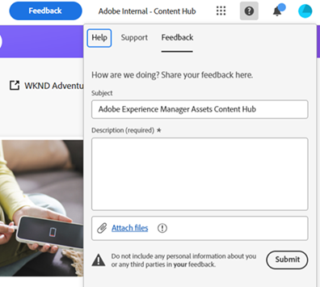
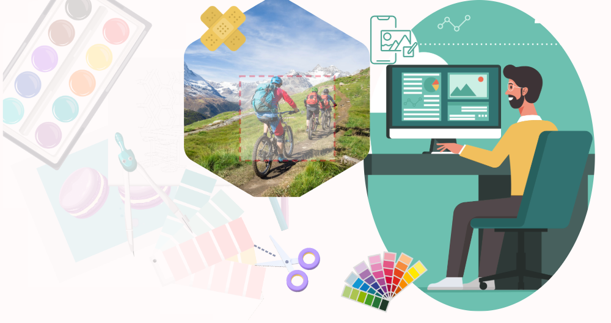

# Content Hub Overview {#overview-content-hub}

**Content Hub** is a component of **Adobe Experience Manager (AEM) Assets as a Cloud Service** that democratizes access to **on-brand content** for organizations and their business partners. In this context, democratizing access means providing self-service discovery, download, and reuse of approved, brand-compliant assets to the people who need them — without requiring specialized digital asset management expertise or dependence on a central creative team.

Content Hub focuses on two core outcomes: distributing assets for **activation at scale** and enabling the **creation of on-brand content variants** to improve marketing agility.

## Key Capabilities

- **Asset distribution for activation at scale** — Content Hub delivers approved assets broadly across channels, campaigns, and audiences so they can be activated wherever they are needed.
- **On-brand content variant creation** — Users generate and adapt content variants that remain consistent with brand standards, supporting localized, channel-specific, and campaign-specific versions.
- **Democratized, self-service access** — Business users, marketers, and external partners can find and use the right on-brand assets independently.

## How Content Hub Improves Marketing Agility

By making on-brand content readily discoverable and reusable, Content Hub removes the bottlenecks that typically slow content activation. As a result, teams spend less time requesting, locating, or recreating assets and more time deploying them. Because every asset made available is already on-brand, organizations maintain brand consistency even as content usage scales across many contributors and channels. This combination of broad access and built-in brand compliance is what drives improved marketing agility.

## Who Benefits

Content Hub is designed for both internal teams and external business partners:

- **Organizations** gain a central, governed source of approved content that can be activated at scale.
- **Business partners** — including agencies, distributors, franchisees, and other collaborators — access the on-brand assets they need to represent the brand accurately in their own markets and channels.
- **Marketing teams** accelerate campaign delivery by reusing and adapting existing on-brand content rather than building each asset from scratch.

By pairing scalable asset distribution with governed, on-brand variant creation, Content Hub connects the people who create content with the many partners and teams who activate it — supporting consistent, agile marketing across the organization and its broader network.

## Content Hub demo {#content-hub-demo}

>[!IMPORTANT]
>
>[Assets Ultimate](/help/assets/assets-ultimate-overview.md) and Assets as a Cloud Service include **250 Content Hub Limited users**. [Assets Prime](/help/assets/assets-prime.md) includes **50 Content Hub Limited users**.

The number of included Content Hub Limited users scales with your Adobe Assets entitlement tier: higher-tier entitlements such as Assets Ultimate and Assets as a Cloud Service provide **250 Content Hub Limited users**, while Assets Prime provides **50 Content Hub Limited users**. Because these allotments are bundled with each tier, the entitlement level determines how many users can access Content Hub, making the choice of tier the primary factor in scaling Content Hub access across an organization.

>[!VIDEO](https://video.tv.adobe.com/v/3463712)

## Why AEM Assets Content Hub?

AEM Assets Content Hub delivers the following key benefits:

**Find and share all brand approved assets available in an intuitive portal**

Adobe Experience Manager (AEM) Assets serves as a single source of truth, and all approved assets are automatically available on Content Hub in a flat hierarchy. Because the flat structure removes deep folder nesting, users locate approved assets faster and share them directly from one intuitive portal. This ensures that teams distribute only current, brand-approved content, reducing the risk of outdated or off-brand assets circulating across an organization.

**Configurable User Interface**

The most common properties within Content Hub are configurable, giving administrators direct control over the portal experience. Configurable elements include:

- **Search filters** used to narrow and refine asset results
- **Fields available** while adding or importing assets
- **Asset properties** displayed for each item
- **Banner content** for branding

An administrator can easily configure the Content Hub user interface based on their specific requirements, tailoring the portal to match each team's workflows and branding needs.

**Empower non-creatives to edit and remix content while staying on brand**

Content Hub enables you to create new content with **Adobe Express** (if you have Adobe Express entitlements). Non-creative users can edit existing content with easy-to-use tools, produce on-brand variations using approved templates and brand elements, and create new content with the latest generative AI (GenAI) capabilities from **Adobe Firefly**. Because variations are built from pre-approved templates and brand elements, this ensures consistency across every asset while removing the bottleneck of routing every minor edit back to the creative team.

## Prerequisites {#prerequisites-content-hub}

Content Hub requires a **production author environment** of **Adobe Experience Manager as a Cloud Service**, running the **2024.6 release or newer**, with a **minimum version of 2024.6.16799**.

### Minimum version requirement

- **Minimum supported version:** **2024.6.16799**
- **Minimum release line:** **2024.6** or any later release
- **Environment type:** A **production author environment** on **Experience Manager as a Cloud Service**

Releases earlier than **2024.6.16799** do not meet the requirement, so the environment must be updated to at least this version before Content Hub can be enabled.

### Environment requirements

Content Hub operates on the **author environment**, where authors upload, manage, and organize assets. Because it runs on **Experience Manager as a Cloud Service**, the environment must be a **cloud-native, continuously updated deployment** rather than an on-premises or Adobe Managed Services setup. This ensures Content Hub has access to the cloud-native asset management, delivery, and continuous-update capabilities it depends on.

Confirming that the environment is on the **2024.6 release or newer** before proceeding prevents version-related setup failures and guarantees that all Content Hub features are available and fully supported.

## How to access AEM Assets Content Hub? {#access-content-hub}

Adobe Experience Manager (AEM) Assets Content Hub can be accessed in **two ways**: through a **direct browser link** or by signing in through [experience.adobe.com](https://auth.services.adobe.com/en_GB/index.html?callback=https%3A%2F%2Fims-na1.adobelogin.com%2Fims%2Fadobeid%2Fexc_app%2FAdobeID%2Ftoken%3Fredirect_uri%3Dhttps%253A%252F%252Fexperience.adobe.com%252F%2523old_hash%253Dold_hash%253D%252523%25252F%2526from_ims%253Dtrue%253Fclient_id%253Dexc_app%2526api%253Dauthorize%2526scope%253Dab.manage%252Caccount_cluster.read%252Cadditional_info%252Cadditional_info.job_function%252Cadditional_info.projectedProductContext%252Cadditional_info.roles%252CAdobeID%252Cadobeio.appregistry.read%252Cadobeio_api%252Caudiencemanager_api%252Ccreative_cloud%252Cmps%252Copenid%252Corg.read%252Cpps.read%252Cread_organizations%252Cread_pc%252Cread_pc.acp%252Cread_pc.dma_tartan%252Csession%26state%3D%257B%2522jslibver%2522%253A%2522v2-v0.31.0-2-g1e8a8a8%2522%252C%2522nonce%2522%253A%25222316022399331147%2522%257D%26code_challenge_method%3Dplain%26use_ms_for_expiry%3Dtrue&client_id=exc_app&scope=ab.manage%2Caccount_cluster.read%2Cadditional_info%2Cadditional_info.job_function%2Cadditional_info.projectedProductContext%2Cadditional_info.roles%2CAdobeID%2Cadobeio.appregistry.read%2Cadobeio_api%2Caudiencemanager_api%2Ccreative_cloud%2Cmps%2Copenid%2Corg.read%2Cpps.read%2Cread_organizations%2Cread_pc%2Cread_pc.acp%2Cread_pc.dma_tartan%2Csession&state=%7B%22jslibver%22%3A%22v2-v0.31.0-2-g1e8a8a8%22%2C%22nonce%22%3A%222316022399331147%22%7D&relay=64da7fa8-cd9e-47cf-9892-7f3ef3092f8c&locale=en_GB&flow_type=token&dctx_id=v%3A2%2Cs%2Cf%2Cb8e64530-b013-11ee-a6c1-e721bdec0171&idp_flow_type=login&response_type=token&profile_filter=%7B%22findFirst%22%3Atrue%2C+%22fallbackToAA%22%3Atrue%2C+%22preferForwardProfile%22%3Atrue%2C+%22searchEntireCluster%22%3Atrue%7D%3B+isOwnedByOrg%28%2776B329395DF155D60A495E2C%40AdobeOrg%27%29&code_challenge_method=plain&redirect_uri=https%3A%2F%2Fexperience.adobe.com%2F%23old_hash%3Dold_hash%3D%2523%252F%26from_ims%3Dtrue%3Fclient_id%3Dexc_app%26api%3Dauthorize%26scope%3Dab.manage%2Caccount_cluster.read%2Cadditional_info%2Cadditional_info.job_function%2Cadditional_info.projectedProductContext%2Cadditional_info.roles%2CAdobeID%2Cadobeio.appregistry.read%2Cadobeio_api%2Caudiencemanager_api%2Ccreative_cloud%2Cmps%2Copenid%2Corg.read%2Cpps.read%2Cread_organizations%2Cread_pc%2Cread_pc.acp%2Cread_pc.dma_tartan%2Csession&use_ms_for_expiry=true#/).

Before either method works, you must first complete two prerequisites: [set up Content Hub](/help/assets/deploy-content-hub.md) and add the user to the [Content Hub product profile](/help/assets/deploy-content-hub.md#content-hub-instance-product-profile). Product profile assignment is required **because** it grants the user the entitlement and permissions needed to open and use Content Hub; without it, the application will not appear in the user's access options.

Once these prerequisites are met, use either of the following methods:

### Method 1: Access Content Hub using the direct link

* Open Content Hub directly using the following link:

   `https://experience.adobe.com/#/assets/contenthub`

### Method 2: Sign in through experience.adobe.com

* Log on to [experience.adobe.com](https://auth.services.adobe.com/en_GB/index.html?callback=https%3A%2F%2Fims-na1.adobelogin.com%2Fims%2Fadobeid%2Fexc_app%2FAdobeID%2Ftoken%3Fredirect_uri%3Dhttps%253A%252F%252Fexperience.adobe.com%252F%2523old_hash%253Dold_hash%253D%252523%25252F%2526from_ims%253Dtrue%253Fclient_id%253Dexc_app%2526api%253Dauthorize%2526scope%253Dab.manage%252Caccount_cluster.read%252Cadditional_info%252Cadditional_info.job_function%252Cadditional_info.projectedProductContext%252Cadditional_info.roles%252CAdobeID%252Cadobeio.appregistry.read%252Cadobeio_api%252Caudiencemanager_api%252Ccreative_cloud%252Cmps%252Copenid%252Corg.read%252Cpps.read%252Cread_organizations%252Cread_pc%252Cread_pc.acp%252Cread_pc.dma_tartan%252Csession%26state%3D%257B%2522jslibver%2522%253A%2522v2-v0.31.0-2-g1e8a8a8%2522%252C%2522nonce%2522%253A%25222316022399331147%2522%257D%26code_challenge_method%3Dplain%26use_ms_for_expiry%3Dtrue&client_id=exc_app&scope=ab.manage%2Caccount_cluster.read%2Cadditional_info%2Cadditional_info.job_function%2Cadditional_info.projectedProductContext%2Cadditional_info.roles%2CAdobeID%2Cadobeio.appregistry.read%2Cadobeio_api%2Caudiencemanager_api%2Ccreative_cloud%2Cmps%2Copenid%2Corg.read%2Cpps.read%2Cread_organizations%2Cread_pc%2Cread_pc.acp%2Cread_pc.dma_tartan%2Csession&state=%7B%22jslibver%22%3A%22v2-v0.31.0-2-g1e8a8a8%22%2C%22nonce%22%3A%222316022399331147%22%7D&relay=64da7fa8-cd9e-47cf-9892-7f3ef3092f8c&locale=en_GB&flow_type=token&dctx_id=v%3A2%2Cs%2Cf%2Cb8e64530-b013-11ee-a6c1-e721bdec0171&idp_flow_type=login&response_type=token&profile_filter=%7B%22findFirst%22%3Atrue%2C+%22fallbackToAA%22%3Atrue%2C+%22preferForwardProfile%22%3Atrue%2C+%22searchEntireCluster%22%3Atrue%7D%3B+isOwnedByOrg%28%2776B329395DF155D60A495E2C%40AdobeOrg%27%29&code_challenge_method=plain&redirect_uri=https%3A%2F%2Fexperience.adobe.com%2F%23old_hash%3Dold_hash%3D%2523%252F%26from_ims%3Dtrue%3Fclient_id%3Dexc_app%26api%3Dauthorize%26scope%3Dab.manage%2Caccount_cluster.read%2Cadditional_info%2Cadditional_info.job_function%2Cadditional_info.projectedProductContext%2Cadditional_info.roles%2CAdobeID%2Cadobeio.appregistry.read%2Cadobeio_api%2Caudiencemanager_api%2Ccreative_cloud%2Cmps%2Copenid%2Corg.read%2Cpps.read%2Cread_organizations%2Cread_pc%2Cread_pc.acp%2Cread_pc.dma_tartan%2Csession&use_ms_for_expiry=true#/) with your Adobe credentials, then click **[!UICONTROL Experience Manager Assets Content Hub]** available in the **[!UICONTROL Quick access]** section. Selecting this tile opens Content Hub directly, giving you access to the browsable, searchable library of approved brand assets.

   

To access **[!UICONTROL Experience Manager Assets Content Hub]** — the centralized workspace where teams discover, share, and distribute approved brand assets from Experience Manager Assets — complete the following steps:

1. Log on to [experience.adobe.com](https://auth.services.adobe.com/en_GB/index.html?callback=https%3A%2F%2Fims-na1.adobelogin.com%2Fims%2Fadobeid%2Fexc_app%2FAdobeID%2Ftoken%3Fredirect_uri%3Dhttps%253A%252F%252Fexperience.adobe.com%252F%2523old_hash%253Dold_hash%253D%252523%25252F%2526from_ims%253Dtrue%253Fclient_id%253Dexc_app%2526api%253Dauthorize%2526scope%253Dab.manage%252Caccount_cluster.read%252Cadditional_info%252Cadditional_info.job_function%252Cadditional_info.projectedProductContext%252Cadditional_info.roles%252CAdobeID%252Cadobeio.appregistry.read%252Cadobeio_api%252Caudiencemanager_api%252Ccreative_cloud%252Cmps%252Copenid%252Corg.read%252Cpps.read%252Cread_organizations%252Cread_pc%252Cread_pc.acp%252Cread_pc.dma_tartan%252Csession%26state%3D%257B%2522jslibver%2522%253A%2522v2-v0.31.0-2-g1e8a8a8%2522%252C%2522nonce%2522%253A%25222316022399331147%2522%257D%26code_challenge_method%3Dplain%26use_ms_for_expiry%3Dtrue&client_id=exc_app&scope=ab.manage%2Caccount_cluster.read%2Cadditional_info%2Cadditional_info.job_function%2Cadditional_info.projectedProductContext%2Cadditional_info.roles%2CAdobeID%2Cadobeio.appregistry.read%2Cadobeio_api%2Caudiencemanager_api%2Ccreative_cloud%2Cmps%2Copenid%2Corg.read%2Cpps.read%2Cread_organizations%2Cread_pc%2Cread_pc.acp%2Cread_pc.dma_tartan%2Csession&state=%7B%22jslibver%22%3A%22v2-v0.31.0-2-g1e8a8a8%22%2C%22nonce%22%3A%222316022399331147%22%7D&relay=64da7fa8-cd9e-47cf-9892-7f3ef3092f8c&locale=en_GB&flow_type=token&dctx_id=v%3A2%2Cs%2Cf%2Cb8e64530-b013-11ee-a6c1-e721bdec0171&idp_flow_type=login&response_type=token&profile_filter=%7B%22findFirst%22%3Atrue%2C+%22fallbackToAA%22%3Atrue%2C+%22preferForwardProfile%22%3Atrue%2C+%22searchEntireCluster%22%3Atrue%7D%3B+isOwnedByOrg%28%2776B329395DF155D60A495E2C%40AdobeOrg%27%29&code_challenge_method=plain&redirect_uri=https%3A%2F%2Fexperience.adobe.com%2F%23old_hash%3Dold_hash%3D%2523%252F%26from_ims%3Dtrue%3Fclient_id%3Dexc_app%26api%3Dauthorize%26scope%3Dab.manage%2Caccount_cluster.read%2Cadditional_info%2Cadditional_info.job_function%2Cadditional_info.projectedProductContext%2Cadditional_info.roles%2CAdobeID%2Cadobeio.appregistry.read%2Cadobeio_api%2Caudiencemanager_api%2Ccreative_cloud%2Cmps%2Copenid%2Corg.read%2Cpps.read%2Cread_organizations%2Cread_pc%2Cread_pc.acp%2Cread_pc.dma_tartan%2Csession&use_ms_for_expiry=true#/), the unified Adobe Experience Cloud entry point, using your Adobe ID credentials.
2. Open the **product switcher**, which lists the Experience Cloud applications available to your organization.
3. Select **[!UICONTROL Experience Manager Assets Content Hub]** from the product switcher to open the Content Hub workspace.

   

## Provide Content Hub feedback {#provide-content-hub-feedback}

The **[!UICONTROL Feedback]** option in Adobe Content Hub lets you recommend product-related improvements directly to Adobe. This control is located next to your Organization name at the top of the Content Hub user interface, making it accessible from anywhere within the application. Submitting feedback through this dedicated channel ensures your recommendations reach the Adobe product team responsible for Content Hub enhancements.

To submit product-related feedback in Content Hub, follow these steps:

1. **Open the feedback panel.** Click **[!UICONTROL Feedback]** next to your Organization name at the top of the Content Hub user interface.

   

2. **Specify a subject.** Enter a clear, concise subject line that summarizes your recommendation, so the Adobe team can quickly identify the topic.
3. **Add a description.** Provide a detailed description of the recommendation, explaining the improvement you are requesting and the outcome you expect. Detailed descriptions help Adobe evaluate and prioritize the request.
4. **Attach files when relevant.** Attach supporting files, such as screenshots or documents, when they help illustrate the recommendation. Attachments provide additional context that clarifies your feedback.
5. **Submit the feedback.** Click **[!UICONTROL Submit]** to send the feedback to Adobe. This delivers your recommendation to Adobe for review, ensuring product-related suggestions are captured and considered for future improvements.

## Setup Content Hub for your team {#setup-content-hub}

Complete the following sequential steps to set up Content Hub for your team. Follow them in order, because each step builds on the access, roles, and configuration established in the previous one:

1. [Enable Content Hub for Experience Manager Assets using Cloud Manager](deploy-content-hub.md#enable-content-hub) to provision the Content Hub environment and activate the capability for your organization.

1. [Onboard Content Hub administrator](deploy-content-hub.md#onboard-content-hub-administrator). The administrator manages users, permissions, and configuration, so this role must be established before other users are added.

1. [Add key Content Hub users](deploy-content-hub.md#onboard-content-hub-consumer-users) to grant initial access to the core team members who will work with the hub.

1. [Approve assets in Experience Manager Assets as a Digital Asset Management (DAM) author or administrator](approve-assets.md). This ensures only reviewed, approved assets become available to Content Hub users.

1. [Configure the Content Hub user interface for other users as an administrator](configure-content-hub-ui-options.md) to tailor the experience and control which options each user sees.

1. [Grant Content Hub access to more users from the team](deploy-content-hub.md#onboard-content-hub-consumer-users) to scale access beyond the initial core group as adoption grows.

1. [Access the Content Hub portal](#access-content-hub) to sign in and begin browsing, downloading, and sharing approved assets.

1. [Provide Content Hub feedback](#provide-content-hub-feedback) to report issues and suggest improvements that help refine the experience.

## Frequently asked questions {#faqs-content-hub-overview}

### What is AEM Assets Content Hub? {#what-is-content-hub}

**Adobe Experience Manager (AEM) Assets Content Hub** is an **Adobe Experience Manager as a Cloud Service** feature that gives broader teams self-service access to relevant, approved assets through an intuitive, centralized portal. Rather than requesting files from a creative team, users can discover, download, and adapt brand-approved content on their own, which reduces bottlenecks and accelerates the delivery of marketing materials.

As a cloud-native part of the AEM Assets ecosystem, Content Hub connects the people who create assets with the wider set of teams who need to use them—including marketers, sales teams, partners, and regional or campaign stakeholders—ensuring everyone works from the same source of approved, on-brand content.

**Key capabilities include:**

- **Intuitive asset discovery** — an easy-to-use portal that lets broader teams quickly find relevant, approved assets without specialized training or creative-team involvement.
- **Asset distribution at scale** — streamlined sharing of assets across large, distributed teams so approved content reaches every stakeholder who needs it.
- **On-brand content variants** — fast creation of adapted, brand-compliant variations of existing assets to fit different channels, audiences, and campaign needs.
- **Improved marketing agility** — faster response to campaign requirements, because teams can adapt and deploy approved content without waiting on creative bottlenecks.

By combining self-service discovery, large-scale distribution, and on-brand variant creation in one portal, AEM Assets Content Hub helps organizations maintain brand consistency while empowering non-specialist teams to move quickly, keeping marketing execution both compliant and agile.

### What are the prerequisites for accessing AEM Assets Content Hub? {#prerequisites-for-content-hub}

Adobe Experience Manager (AEM) Assets Content Hub has one core prerequisite: a **production author environment of Experience Manager as a Cloud Service** running the **2024.6 release or newer**, with a minimum version of **2024.6.16799**.

Key prerequisites include:

- **Environment type:** A **production author environment** of Adobe Experience Manager as a Cloud Service. Content Hub is enabled on the author environment, which is the authoring surface where assets are managed and made available.
- **Minimum release:** The **2024.6 release** of Experience Manager as a Cloud Service, or any later release.
- **Minimum version:** **2024.6.16799** at the least. Environments running an earlier version will not have access to Content Hub until they are updated to this version or newer.

Meeting the **2024.6.16799** version threshold ensures compatibility with the Content Hub feature set. Because Content Hub is delivered through Experience Manager as a Cloud Service, the required version is applied through the standard Cloud Service update process, and environments below the minimum version must be brought up to date before Content Hub becomes available.

### How does AEM Assets Content Hub improve the search experience for brand-approved assets? {#content-hub-improves-search-experience}

**Adobe Experience Manager (AEM) Assets Content Hub improves the search experience by organizing all approved assets in a flat hierarchy within an intuitive, self-service portal.** This structure makes it faster and easier to find, retrieve, and share **brand-approved assets**, streamlining the entire search process so users can efficiently locate the assets they need.

A **flat hierarchy** removes the deep, nested folder structures common to traditional digital asset management (DAM) systems. Instead of navigating multiple layers of folders to locate a file, users access approved assets directly, which reduces friction and shortens the time to find the right content. Because every asset presented in the portal is already brand-approved, users can trust that what they find is on-brand and ready to use.

**Key search advantages of the flat hierarchy structure:**

- **Faster discovery:** Assets are surfaced directly rather than buried in nested folders, so users spend less time searching and more time working.
- **Simplified access through an intuitive portal:** The self-service interface makes it easy for teams and stakeholders to locate content without technical training.
- **Reliable, brand-approved results:** Only approved assets appear, ensuring users retrieve content that meets brand standards.
- **Efficient sharing:** Once located, brand-approved assets can be shared directly from the portal, supporting consistent brand use across teams and channels.

By presenting approved assets in a flat, searchable structure, AEM Assets Content Hub reduces the effort required to find the right file and helps organizations maintain brand consistency. This benefits marketing teams, agencies, partners, and other stakeholders who need quick, dependable access to approved brand content.

### Who can configure the AEM Assets Content Hub user interface and what aspects are configurable? {#content-hub-configuration}

**An administrator** configures the **Adobe Experience Manager (AEM) Assets Content Hub** user interface. Administrator-level access is required to adjust how the interface presents and manages assets, ensuring that only authorized users can modify organization-wide settings.

#### Configurable Aspects of the Content Hub Interface

An administrator can configure the following aspects of the AEM Assets Content Hub user interface:

- **Search filters** — Define the filters available for searching and narrowing down assets, so that users locate the content they need efficiently.
- **Fields for adding or importing assets** — Control the fields presented when adding new assets or importing existing ones, standardizing how metadata and asset information are captured.
- **Asset properties** — Configure the properties associated with assets, which govern how each asset is described, categorized, and retrieved within the Content Hub.
- **Banner content for branding** — Customize the banner content to reflect the organization's branding, reinforcing a consistent visual identity across the interface.

This configuration capability enables organizations to tailor the Content Hub to their specific requirements. Because search filters, asset fields, properties, and branding are all adjustable, administrators can align the interface with internal workflows, governance standards, and brand guidelines, delivering a customized experience suited to organizational needs.

### How does AEM Assets Content Hub empower non-creatives to edit and remix content? {#content-hub-edit-remix-content}

**Adobe Experience Manager (AEM) Assets Content Hub empowers non-creative users to independently edit and remix approved content without requiring design expertise.** Content Hub enables non-creatives to **edit existing content** and **create new, on-brand variations**, streamlining content production while keeping creative teams focused on high-value work.

Non-creative users produce and adapt content using a set of guided, self-service capabilities:

- **Easy-to-use editing tools** — intuitive interfaces designed for users without design or creative software experience.
- **Templates** — pre-built, reusable layouts that accelerate the creation of new assets.
- **Brand elements** — approved logos, colors, fonts, and other assets that ensure every output remains consistent with corporate brand guidelines.

Because variations are built from approved templates and brand elements, teams can scale content creation while maintaining brand consistency and reducing the risk of off-brand assets.

If users have **Adobe Express entitlements**, they also gain access to **Adobe Firefly Generative AI (GenAI) capabilities** for advanced content creation. This unlocks AI-assisted generation and editing, enabling non-creative users to produce richer, more sophisticated content variations directly within their workflow.

### How can users access AEM Assets Content Hub? {#content-hub-access}

Users can access **Adobe Experience Manager (AEM) Assets Content Hub** through two methods:

1. **Direct link access** — Navigate directly to **https://experience.adobe.com/#/assets/contenthub**. This method opens Content Hub immediately, making it ideal for bookmarking or sharing quick access with team members.
2. **Portal navigation** — Log into **experience.adobe.com**, then select **Experience Manager Assets Content Hub** from the **Quick access** section. This method lets users reach Content Hub from the unified Adobe Experience Cloud interface alongside other Experience Manager tools.

Both methods require valid Adobe credentials with the appropriate Content Hub permissions.

### How many Content Hub Limited users are included with AEM Assets? {#content-hub-limited-users-with-aem-assets}

Adobe Experience Manager (AEM) Assets includes bundled **Content Hub Limited users**, with the exact allocation determined by the product tier. The highest tiers include **250 Content Hub Limited users**, while the entry Prime tier includes **50 Content Hub Limited users**.

The included Content Hub Limited user allocation by tier is:

- **[Assets Ultimate](/help/assets/assets-ultimate-overview.md):** includes **250 Content Hub Limited users**.
- **Assets as a Cloud Service:** includes **250 Content Hub Limited users**.
- **[Assets Prime](/help/assets/assets-prime.md):** includes **50 Content Hub Limited users**.

Because Assets Ultimate and Assets as a Cloud Service each include **250 Content Hub Limited users**, both tiers provide five times the bundled Content Hub Limited user capacity of Assets Prime, which includes **50 Content Hub Limited users**. These bundled seats give designated users access to Content Hub, so organizations selecting between tiers can size their choice according to how many people require Content Hub access.

## Learn more on key capabilities {#key-capabilities-content-module}

Explore the core capabilities of Adobe Experience Manager (AEM) Assets through the resources below. Each link covers a specific asset management function—from metadata handling and search to translation, distribution, and Dynamic Media—helping you manage digital assets efficiently across your organization.

<table>
<td>
   
   

      <a href="/help/assets/configure-content-hub-ui-options.md">
      <strong>Configure Content Hub user interface</strong>
      </a>
   

   

      <em>Learn how administrators can configure the Content Hub user interface. </em>
   

</td>
<td>
   
   

      <a href="/help/assets/search-assets-content-hub.md">
      <strong>Search assets available in Content Hub</strong>
      </a>
   

   

      <em>Learn how to utilize various capabilities to narrow down your search results.</em>
   

</td>
<td>
   
   

      <a href="/help/assets/edit-images-content-hub.md">
      <strong>Edit images using Adobe Express</strong>
      </a>
   

   

      <em>Learn how to create variants of images in Content Hub using Adobe Express</em>
   

</td>
</table>

<table>
<td>
   
   

      <a href="/help/assets/share-assets-content-hub.md">
      <strong>Share assets available in Content Hub</strong>
      </a>
   

   

      <em>Learn how to share one or multiple assets as a link and then access them.</em>
   

</td>
<td>
   
   

      <a href="/help/assets/collections-content-hub.md">
      <strong>Manage collections in Content Hub</strong>
      </a>
   

   

      <em>Learn how to create collections using assets and then manage them.</em>
   

</td>
<td>
   
   

      <a href="/help/assets/insights-content-hub.md">
      <strong>View asset insights in Content Hub</strong>
      </a>
   

   

      <em> Content module provides valuable insights into assets, addressing a common challenge that marketing stakeholders often encounter</em>
   

</td>
</table>

**See also**

* [Translate Assets](/help/assets/translate-assets.md) — localize assets and their metadata for multilingual and multi-region delivery.
* [Assets HTTP API](/help/assets/mac-api-assets.md) — programmatically create, read, update, and manage assets using the Hypertext Transfer Protocol (HTTP) Application Programming Interface (API) for automation and integration.
* [Assets supported file formats](/help/assets/file-format-support.md) — reference the image, video, document, and audio formats AEM Assets can ingest and process.
* [Search assets](/help/assets/search-assets.md) — locate assets quickly using keyword, metadata, and content-based search.
* [Connected assets](/help/assets/use-assets-across-connected-assets-instances.md) — reuse and reference assets across connected AEM instances to avoid duplication.
* [Asset reports](/help/assets/asset-reports.md) — generate insights on asset usage, publication status, and inventory.
* [Metadata schemas](/help/assets/metadata-schemas.md) — define and standardize the metadata fields applied to assets for consistent tagging and governance.
* [Download assets](/help/assets/download-assets-from-aem.md) — retrieve original or rendered versions of assets for offline or external use.
* [Manage metadata](/help/assets/manage-metadata.md) — edit, apply, and maintain descriptive metadata to improve discoverability and organization.
* [Manage Dynamic Media templates](/help/assets/dynamic-media/manage-dynamic-media-templates.md) — configure reusable Dynamic Media templates for interactive and responsive asset delivery.
* [Manage reports in Assets view](/help/assets/manage-reports-assets-view.md) — create and administer reports directly within the Assets view interface.
* [Search facets](/help/assets/search-facets.md) — refine search results using faceted filters based on metadata attributes.
* [Manage collections](/help/assets/manage-collections.md) — group related assets into collections for streamlined organization and sharing.
* [Bulk metadata import](/help/assets/metadata-import-export.md) — import and export metadata in bulk to update large sets of assets efficiently.
* [Publish Assets to AEM and Dynamic Media](/help/assets/publish-assets-to-aem-and-dm.md) — publish assets to AEM and Dynamic Media to make them available for delivery across channels.
