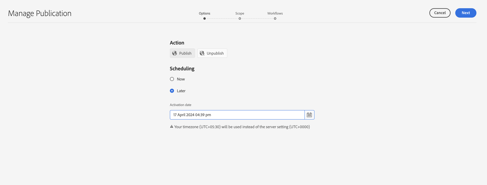
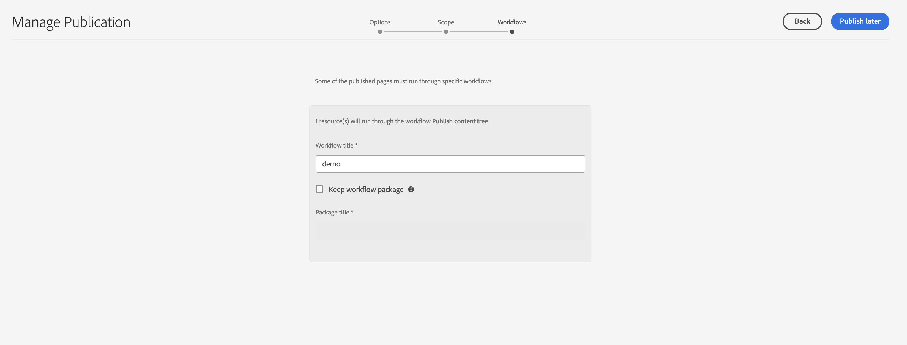
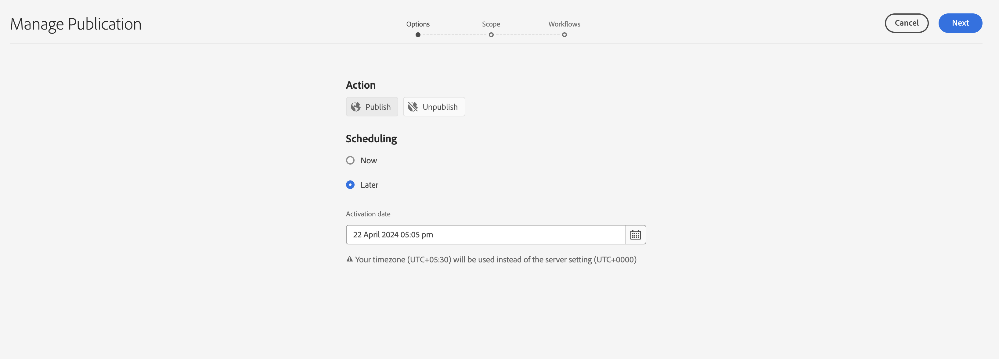
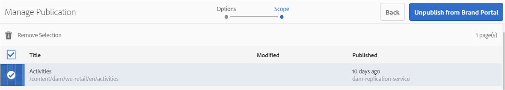

# Publish assets to Brand Portal {#publish-assets-to-brand-portal}

<table>
    <tr>
        <td>
            <i>New</i> <a href="/help/assets/dynamic-media/dm-prime-ultimate.md"><b>Dynamic Media Prime and Ultimate</b></a>
        </td>
        <td>
            <i>New</i> <a href="/help/assets/assets-ultimate-overview.md"><b>AEM Assets Ultimate</b></a>
        </td>
        <td>
            <i>New</i> <a href="/help/assets/integrate-aem-assets-edge-delivery-services.md"><b>AEM Assets integration with Edge Delivery Services</b></a>
        </td>
        <td>
            <i>New</i> <a href="/help/assets/aem-assets-view-ui-extensibility.md"><b>UI Extensibility</b></a>
        </td>
          <td>
            <i>New</i> <a href="/help/assets/dynamic-media/enable-dynamic-media-prime-and-ultimate.md"><b>Enable Dynamic Media Prime and Ultimate</b></a>
        </td>
    </tr>
    <tr>
        <td>
            <a href="/help/assets/search-best-practices.md"><b>Search Best Practices</b></a>
        </td>
        <td>
            <a href="/help/assets/metadata-best-practices.md"><b>Metadata Best Practices</b></a>
        </td>
        <td>
            <a href="/help/assets/product-overview.md"><b>Content Hub</b></a>
        </td>
        <td>
            <a href="/help/assets/dynamic-media-open-apis-overview.md"><b>Dynamic Media with OpenAPI capabilities</b></a>
        </td>
        <td>
            <a href="https://developer.adobe.com/experience-cloud/experience-manager-apis/"><b>AEM Assets developer documentation</b></a>
        </td>
    </tr>
</table>

| Version | Article link |
| -------- | ---------------------------- |
| AEM 6.5  |    [Click here](https://experienceleague.adobe.com/en/docs/experience-manager-65/content/assets/brandportal/brand-portal-publish-assets)                  |
| AEM as a Cloud Service     | This article         |

As an Adobe Experience Manager (AEM) Assets administrator, you can publish assets, folders, and collections to the AEM Assets Brand Portal instance. Also, you can schedule the publish workflow of an asset or folder to a later date or time. Once published, the Brand Portal users can access and further distribute the assets, folders, and collections to other users. 

However, you must first configure AEM Assets with Brand Portal. For details, see [Configure AEM Assets with Brand Portal](configure-aem-assets-with-brand-portal.md). 

If you make subsequent modifications to the original asset, folder, or collection in AEM Assets, the changes are not reflected in Brand Portal until you republish from AEM Assets. This feature ensures that work-in-progress changes are not available in Brand Portal. Only approved changes that are published by an administrator are available in Brand Portal.

* [Publish assets to Brand Portal](#publish-assets-to-bp)
* [Publish folders to Brand Portal](#publish-folders-to-brand-portal)
* [Publish collections to Brand Portal](#publish-collections-to-brand-portal)

>[!NOTE]
>
>Adobe recommends staggered publishing, preferably during non-peak hours, so that the AEM author does not occupy excess resources. 
>Assets should be published in batches. The recommendation for batch size is 15K.
> For [!DNL Experience Manager Assets] as a [!DNL Cloud Service], the transfer rate observed under lab condition is 1000 assets per hour. The rate is observed with an average size of 10 MB assets.

## Publish assets to Brand Portal {#publish-assets-to-bp}

Following are the steps to publish assets from AEM Assets to Brand Portal:

1. From the Assets console, open the parent folder and select all the assets that you want to publish and click **[!UICONTROL Quick Publish]** option from the toolbar.

   

1. Following are the two ways publish assets:
    * [Publish now](#publish-to-bp-now) (Publish assets immediately)
    * [Publish later](#publish-to-bp-later) (Schedule publishing assets)

### Publish assets now {#publish-to-bp-now}

To publish the selected assets to Brand Portal, do either of the following:

* From the toolbar, select **[!UICONTROL Quick Publish]**. Then from the menu, click **[!UICONTROL Publish to Brand Portal]**.

* From the toolbar, select **[!UICONTROL Manage Publication]**.

  1. From **[!UICONTROL Action]**, select **[!UICONTROL Publish to Brand Portal]**. 
  
     From **[!UICONTROL Scheduling]**, select **[!UICONTROL Now]**. 
     
     Click **[!UICONTROL Next]**.

  2. Confirm your selection in **[!UICONTROL Scope]** and click **[!UICONTROL Publish to Brand Portal]**.

A message appears stating that the assets have been queued up for publishing to Brand Portal. Login to the Brand Portal interface to see the published assets.

### Publish assets later {#publish-to-bp-later}

To schedule publishing the assets to Brand Portal to a later date or time:

1. Select the assets that you want to schedule for publishing and click **[!UICONTROL Manage Publication]** from the tool bar at the top.
  
1. On **[!UICONTROL Manage Publication]** page, select **[!UICONTROL Publish to Brand Portal]** from **[!UICONTROL Action]**.

   Select **[!UICONTROL Later]** from **[!UICONTROL Scheduling]**.

    <!---->

   

1. Select an **[!UICONTROL Activation date]** and specify time. Click **[!UICONTROL Next]**.

1. Select an **Activation date** and specify time. Click **Next**.

1. Specify a **[!UICONTROL Workflow title]** in **[!UICONTROL Workflows]**. Click **[!UICONTROL Publish Later]**.

    <!---->
    
    

>[!NOTE]
>
> * The existing users part of DAM-Users group have read access on path "/conf/global/settings/cloudconfigs/mediaportal"
> * The new users (or non-admin users) require the following rights to publish on brand portal.
> Paths:
> `"/conf/global/settings/cloudconfigs/mediaportal" : jcr:read `
>`/libs : jcr:read` 
>`/conf : jcr:read`
>`/content : jcr:read, crx:replicate`
>`/content/dam/ : jcr:read,modify, crx:replicate`

## Publish folders to Brand Portal {#publish-folders-to-brand-portal}

You can publish or unpublish asset folders immediately, or schedule to a later date or time.

### Publish folders to Brand Portal {#publish-folders-to-bp}

1. From the Assets console, select the folders that you want to publish and click **[!UICONTROL Quick Publish]** option from the toolbar.

   

1. **Publish folders now**

   To publish the selected folders to Brand Portal, do either of the following:

    * From the toolbar, select **[!UICONTROL Quick Publish]**. 
    
      From the menu, select **[!UICONTROL Publish to Brand Portal]**.

    * From the toolbar, select **[!UICONTROL Manage Publication]**.

      1. From **[!UICONTROL Action]**, select **[!UICONTROL Publish to Brand Portal]**.
      
         From **[!UICONTROL Scheduling]**, select **[!UICONTROL Now]**.
         
         Click **Next.**

      1. Confirm your selection in **[!UICONTROL Scope]** and click **[!UICONTROL Publish to Brand Portal]**.

   A message appears stating that the folder has been queued up for publishing to Brand Portal. Login to your Brand Portal interface to see the published folder.

1. **Publish folders later**
To schedule the publishing the asset folders to a later date or time:

    1. Select the folders that you want to schedule for publishing, select **[!UICONTROL Manage Publication]** from the tool bar at the top.
    1. From **[!UICONTROL Action]**, select **[!UICONTROL Publish to Brand Portal]**.
    
       From **[!UICONTROL Scheduling]**, select **[!UICONTROL Later]**.

    1. Select an **[!UICONTROL Activation date]** and specify time. Click **[!UICONTROL Next]**.

       <!---->
      
      

    1. Confirm your selection in **[!UICONTROL Scope]**. Click **[!UICONTROL Next]**.

    1. Specify a Workflow title under **[!UICONTROL Workflows]**. Click **[!UICONTROL Publish Later]**.

       <!---->
         
      

### View published file or folder to Brand Portal {#view-published-file-folder}

1. Login to the Brand Portal interface to see the published assets (depending on your scheduled date or time).

    

1. Switch to List view  to see the current publish status of the asset.

<!--2. On the [Asset Reports page](#https://experienceleague.adobe.com/en/docs/experience-manager-cloud-service/content/assets/admin/asset-reports), you can see the current state of the report job, for example, Success, Failed, Queued, or Scheduled.-->

   

### Unpublish folders from Brand Portal {#unpublish-folders-from-brand-portal}

You can remove any asset folder published to Brand Portal by unpublishing it from AEM Assets instance. After you unpublish the original folder, its copy is no longer available to Brand Portal users.

You can unpublish asset folders from Brand Portal immediately, or schedule to a later date and time. 

To unpublish asset folders from Brand Portal:

1. From the Assets console, select the asset folders that you want to upublish and click **[!UICONTROL Manage Publication]** option from the toolbar. 

   

1. **Unpublish asset folders now**

   To immediately unpublish the selected asset folder from Brand Portal:

    1. From the toolbar, select **[!UICONTROL Manage Publication]**.

    1. From **[!UICONTROL Action]** select **[!UICONTROL Unpublish from Brand Portal]**. 
    
       From **[!UICONTROL Scheduling]**, select **[!UICONTROL Now]**.
       
       Click **[!UICONTROL Next]**.

    1. Confirm your selection in **[!UICONTROL Scope]** and click **[!UICONTROL Unpublish from Brand Portal]**.

       

1. **Unpublish asset folders later**

   To schedule unpublishing of an asset folder to a later date and time:

    1. From the toolbar, select **[!UICONTROL Manage Publication]**.
    
    1. From **[!UICONTROL Action]**, select **[!UICONTROL Unpublish from Brand Portal]**.
    
       From **[!UICONTROL Scheduling]**, select **[!UICONTROL Later]**.

    1. Select an **[!UICONTROL Activation date]** and specify the time. Click **[!UICONTROL Next]**.

    1. Confirm your selection in **[!UICONTROL Scope]** and click **[!UICONTROL Next]**.

    1. Specify a **[!UICONTROL Workflow title]** in **[!UICONTROL Workflows]**. Click **[!UICONTROL Unpublish Later]**.

       

## Publish collections to Brand Portal {#publish-collections-to-brand-portal}

You can publish or unpublish collections from your AEM Assets cloud instance.

>[!NOTE]
>
>Content fragments cannot be published to the Brand Portal. Therefore, if you select content fragment(s) in AEM Assets, then **[!UICONTROL Publish to Brand Portal]** action is not available.
>
>If collections containing content fragments are published from AEM Assets to Brand Portal, then all the contents of the folder except content fragments is replicated to the Brand Portal interface.

### Publish collections {#publish-collections}

Following are the steps to publish collections from AEM Assets to Brand Portal:

1. In the AEM Assets UI, click AEM logo. 

1. From **Navigation** page, go to **[!UICONTROL Assets]** > **[!UICONTROL Collections]**.

1. From the **Collections** console, select the collections that you want to publish to Brand Portal.

   

1. From the toolbar, click **[!UICONTROL Publish to Brand Portal]**.

1. In the confirmation dialog, click **[!UICONTROL Publish]**.

1. Close the confirmation message.

   Login to Brand Portal as an administrator. The published collection is available in the Collections console.

   

### Unpublish collections {#unpublish-collections}

You can remove any collection published to Brand Portal by unpublishing it from your AEM Assets instance. After you unpublish the original collection, its copy is no longer available to the Brand Portal users.

Following are the steps to unpublish a collection:

1. From the **Collections** console of your AEM Assets instance, and select the collection that    you want to unpublish.

   

1. From the toolbar, click **[!UICONTROL Remove from Brand Portal]** icon.
1. In the dialog, click **[!UICONTROL Unpublish]**.
1. Close the confirmation message. The collection is removed from the Brand Portal interface.

In addition to the above, you can also publish metadata schemas, image presets, search facets, and tags from AEM Assets to Brand Portal. 

* [Publish presets, schemas, and facets to Brand Portal](https://experienceleague.adobe.com/docs/experience-manager-brand-portal/using/publish/publish-schema-search-facets-presets.html)
* [Publish tags to Brand Portal](https://experienceleague.adobe.com/docs/experience-manager-brand-portal/using/publish/brand-portal-publish-tags.html)

See, [Brand Portal documentation](https://experienceleague.adobe.com/docs/experience-manager-brand-portal/using/home.html) for more information.

<!--
   Comment Type: draft

   <li> </li>
   -->

   <!--
   Comment Type: draft

   <li>Step text</li>
   -->

**See also**

* [Translate Assets](translate-assets.md)
* [Assets HTTP API](mac-api-assets.md)
* [Assets supported file formats](file-format-support.md)
* [Search assets](search-assets.md)
* [Connected assets](use-assets-across-connected-assets-instances.md)
* [Asset reports](asset-reports.md)
* [Metadata schemas](metadata-schemas.md)
* [Download assets](download-assets-from-aem.md)
* [Manage metadata](manage-metadata.md)
* [Search facets](search-facets.md)
* [Manage collections](manage-collections.md)
* [Bulk metadata import](metadata-import-export.md)
* [Publish Assets to AEM and Dynamic Media](/help/assets/publish-assets-to-aem-and-dm.md)