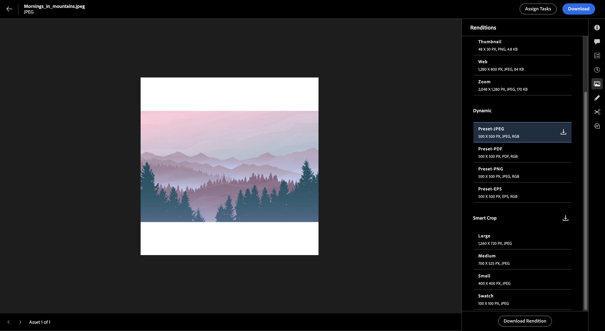

# View and manage renditions in Experience Manager Assets{#renditions}

Renditions in Adobe Experience Manager (AEM) are customized versions of digital assets, such as images, designed for different devices and platforms to ensure optimal performance. AEM facilitates easy creation and management of these renditions, enhancing user experience. You can create thumbnails, optimize images for web or mobile, add watermarks, view and download dynamic renditions or smart crop renditions, and do much more.

Dynamic Media image presets, and Smart Crop renditions promote systematic image management that aligns with brand standards, maximizing brand cohesion. This simplifies the process of quickly locating and using dynamic image renditions as needed without any admin access.
 Renditions are classified as static and dynamic, each type presenting unique features and capabilities that are discussed further in detail.

## Static renditions {#static-renditions}

Static renditions are pre-generated versions of digital assets, usually created during asset ingestion or modification. These renditions are optimized for specific purposes and platforms, such as web thumbnails, mobile-friendly formats for responsive design, or high-resolution versions for printing, ensuring an efficient and consistent experience.
Learn [how to view and download](#view-dynamic-renditions) static renditions in [!DNL Experience Manager Assets].

## Dynamic renditions {#dynamic-renditions}

Dynamic renditions are customized versions of assets created in real-time to meet specific needs, such as resizing images based on device resolution or cropping to fit different aspect ratios.
These renditions enable organizations to deliver personalized and optimized experiences to diverse audience needs. You can view and download dynamic renditions in [!DNL Experience Manager Assets].

### Before you begin

* You must be a licensed AEM Dynamic Media user.

* Use [!UICONTROL Admin view] to set up: 
    * [Smart Crop Image Profiles](/help/assets/dynamic-media/image-profiles.md#creating-image-profiles) 
    * [Image presets](/help/assets/dynamic-media/managing-image-presets.md)

    You can [switch the view](/help/assets/assets-view-introduction.md#how-to-access-assets-view) later to preview dynamic renditions in the Assets view.

### View and download Dynamic renditions {#view-renditions}

To view or download dynamic renditions of images in [!DNL Experience Manager Assets], follow these steps:

1. Go to **[!UICONTROL Assets Management]** > **[!UICONTROL Assets]**.

1. Navigate to the applicable asset folder.

1. Click the image you need to view and click **[!UICONTROL Details]**.

1. In the right menu, click **[!UICONTROL Renditions]**.   The **[!UICONTROL Renditions]** panel opens with the available **[!UICONTROL Dynamic]** and **[!UICONTROL Smart Crop]** renditions.

    
    <!--  -->

1. Click the rendition you need to view or download.

1. Click the  icon next to the dynamic rendition you need to download.   Alternatively, you can select the image rendition, and click **[!UICONTROL Download Rendition]** option at the bottom. 

   You can click the  icon available at the top of **[!UICONTROL Smart Crop]** renditions section to download all available Smart Crop renditions for that asset.

>[!NOTE]
>
>Dynamic renditions are visible only if the assets are uploaded from the Admin view.
