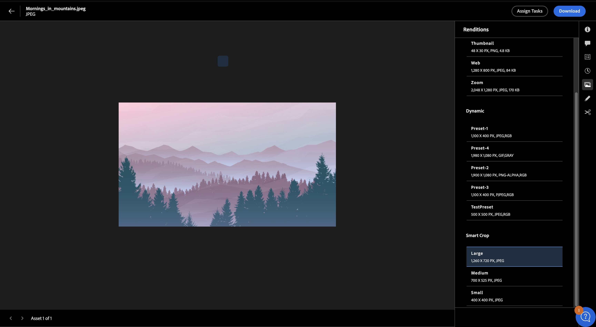

# View and manage renditions in Experience Manager Assets{#renditions}

<table>
    <tr>
        <td>
            <i>New</i> <a href="/help/assets/dynamic-media/dm-prime-ultimate.md"><b>Dynamic Media Prime and Ultimate</b></a>
        </td>
        <td>
            <i>New</i> <a href="/help/assets/assets-ultimate-overview.md"><b>AEM Assets Ultimate</b></a>
        </td>
        <td>
            <i>New</i> <a href="/help/assets/integrate-aem-assets-edge-delivery-services.md"><b>AEM Assets integration with Edge Delivery Services</b></a>
        </td>
        <td>
            <i>New</i> <a href="/help/assets/aem-assets-view-ui-extensibility.md"><b>UI Extensibility</b></a>
        </td>
          <td>
            <i>New</i> <a href="/help/assets/dynamic-media/enable-dynamic-media-prime-and-ultimate.md"><b>Enable Dynamic Media Prime and Ultimate</b></a>
        </td>
    </tr>
    <tr>
        <td>
            <a href="/help/assets/search-best-practices.md"><b>Search Best Practices</b></a>
        </td>
        <td>
            <a href="/help/assets/metadata-best-practices.md"><b>Metadata Best Practices</b></a>
        </td>
        <td>
            <a href="/help/assets/product-overview.md"><b>Content Hub</b></a>
        </td>
        <td>
            <a href="/help/assets/dynamic-media-open-apis-overview.md"><b>Dynamic Media with OpenAPI capabilities</b></a>
        </td>
        <td>
            <a href="https://developer.adobe.com/experience-cloud/experience-manager-apis/"><b>AEM Assets developer documentation</b></a>
        </td>
    </tr>
</table>

Renditions in Adobe Experience Manager (AEM) are customized versions of digital assets, such as images, designed for different devices and platforms to ensure optimal performance. AEM facilitates easy creation and management of these renditions, enhancing the user experience. You can create thumbnails, optimize images for web or mobile, add watermarks, view and download dynamic renditions or Smart Crop renditions, and do much more.

Dynamic Media image presets, and Smart Crop renditions promote systematic image management that aligns with brand standards, maximizing brand cohesion. This simplifies the process of quickly locating and using dynamic image renditions as needed without any admin access.

Renditions are classified as static and dynamic, each type presenting unique features and capabilities that are discussed further in detail.

## Static renditions {#static-renditions}

Static renditions are pre-generated versions of digital assets, usually created during asset ingestion or modification. These renditions are optimized for specific purposes and platforms, such as web thumbnails, mobile-friendly formats for responsive design, or high-resolution versions for printing, ensuring an efficient and consistent experience.
Learn how to [view and download static renditions](#view-and-download-static-renditions) in Experience Manager Assets.

### View and download static renditions{#view-and-download-static-renditions}

To see the asset renditions and download them, follow these steps:

1. On Assets View, click **Assets**, navigate to a folder, select an asset, and click **Details**.
1. Click the rendition's icon available in the right pane. 
1. Select a rendition to preview it, and click  to download it. 

   

## Dynamic renditions {#dynamic-renditions}

Dynamic renditions are customized versions of assets created in real-time to meet specific needs, such as resizing images based on device resolution or cropping to fit different aspect ratios.
These renditions enable organizations to deliver personalized and optimized experiences to diverse audience needs. You can view and download dynamic renditions in Experience Manager Assets.

## Dynamic Media renditions {#dynamic-media-renditions}

### Before you begin

* You must be a licensed AEM Dynamic Media user.
* Use the [!UICONTROL Admin view] to set up: 
    * [Smart Crop Image Profiles](/help/assets/dynamic-media/image-profiles.md#creating-image-profiles) 
    * [Image presets](/help/assets/dynamic-media/managing-image-presets.md)

    You can [switch the view](/help/assets/assets-view-introduction.md#how-to-access-assets-view) later to preview dynamic renditions in the Assets view.
* Publish assets to Dynamic Media to make Dynamic Media renditions available in the Assets view. For more information, see [Publish Assets to AEM and Dynamic Media](https://experienceleague.adobe.com/en/docs/experience-manager-cloud-service/content/assets/assets-view/publish-assets-to-aem-and-dm).

### View and download Dynamic Media renditions {#view-download-dm-renditions}

To view or download dynamic renditions of images in Experience Manager Assets, follow these steps:

1. Go to **[!UICONTROL Assets Management]** > **[!UICONTROL Assets]**.

1. Navigate to the applicable asset folder.

1. Click the asset that you need to view and click **[!UICONTROL Details]**.

1. In the right menu, click the **[!UICONTROL Dynamic Media]** icon. The **[!UICONTROL Dynamic Media]** panel displays Dynamic Media and Smart Crop renditions.

    
    <!--  -->

1. Select the rendition to preview and click **Copy URL** to copy the URL of the selected rendition. Click **Download Rendition** to download the renditions of image assets.
1. Select the Smart Crop rendition to preview and click **Copy URL** to copy the URL of the selected rendition.
1. Click  to download all available Smart Crop renditions as a single zip file.

   >[!NOTE]
   >
   >These renditions are available only for image assets.

## Dynamic Media with OpenAPI Capabilities renditions {#dm-with-openapi-renditions}

### Before you begin

* You must be a licensed AEM Dynamic Media user.
* Assets must be approved to display Dynamic Media with OpenAPI capabilities renditions. For more information, see [Approve assets in Experience Manager ](/help/assets/approve-assets.md#copy-delivery-url-approved-assets)
* Dynamic Media with OpenAPI capabilities must be enabled on your AEM as a Cloud Service instance.

### View Dynamic Media with OpenAPI Capabilities renditions {#view-download-dm-with-openapi-renditions}

1. Select the asset and click **Details**.
1. Click the Dynamic Media icon available in the right pane. The Dynamic Media panel displays the Dynamic Media with OpenAPI Capabilities rendition for all asset types. 

1. Select **Dynamic Media with OpenAPI** option and then click **Copy URL** to copy the delivery URL of the asset.

