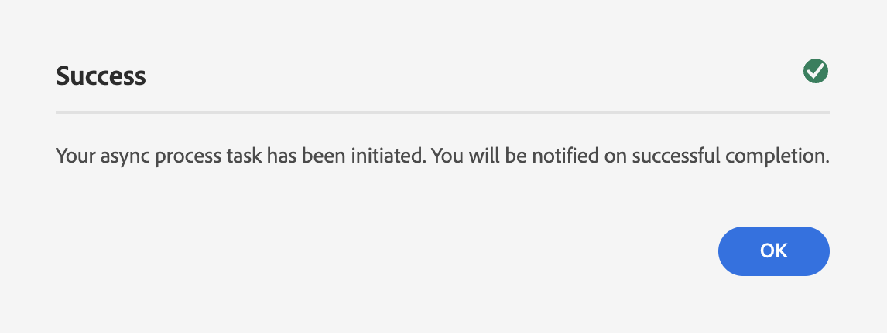

# Reprocessing digital assets {#reprocessing-digital-assets}

You can reprocess assets in a folder that already has an existing metadata profile that you later changed. If you want the newly edited preset to be reapplied to the existing assets in the folder, you must reprocess the folder. You can reprocess as many assets as required.

## Steps to reprocess assets {#reprocessing-steps}

To reprocess assets in a folder:

1. In [!DNL Experience Manager], from the Assets page,select the newly added assets or the assets that you want to reprocess. 
    In case you select a folder:

    * The workflow considers all files in the selected folder, recursively.
    * If there are one or more subfolders with assets in the main selected folder, the workflow reprocesses every asset in the folder hierarchy.
    * As a best practice, avoid running this workflow on a folder hierarchy that has more than 1000 assets.

1. Select **[!UICONTROL Reprocess Assets]**. Choose between the two options:

 

 * **[!UICONTROL Full Process]:** Select this option when you want to execute the overall process including default profile, custom profile, dynamic processing (if configured), and post processing workflows.
 * **[!UICONTROL Advanced]:** Select this option to choose advanced receprocessing.

 

Select among the following advanced options:

* [!UICONTROL Default Preview Renditions]:
* [!UICONTROL Metadata]
* [!UICONTROL Processing Profiles]
* [!UICONTROL Post-processing Workflow]

  

After selecting the appropriate options, click **[!UICONTROL Reprocess]**. The following message appears:
  
  

## Scenarios for reprocessing digital assets {#scenarios-reprocessing}

### Smart tags {#reprocessing-smart-tags} 

### Smart crop {#reprocessing-smart-crop}

### Metadata {#reprocessing-metadata}

### Reprocess Dynamic Media assets in a folder {#reprocessing-dynamic-media}

You can reprocess assets in a folder that already has an existing Dynamic Media Image Profile or a Dynamic Media Video Profile that you later changed.

### Workflows

### Supported files
