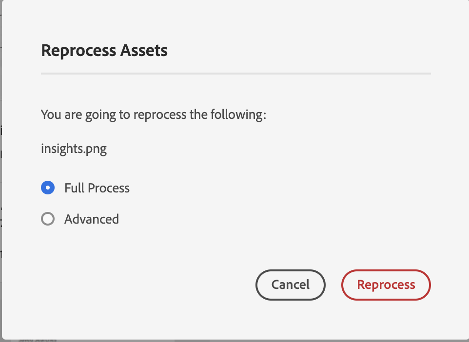
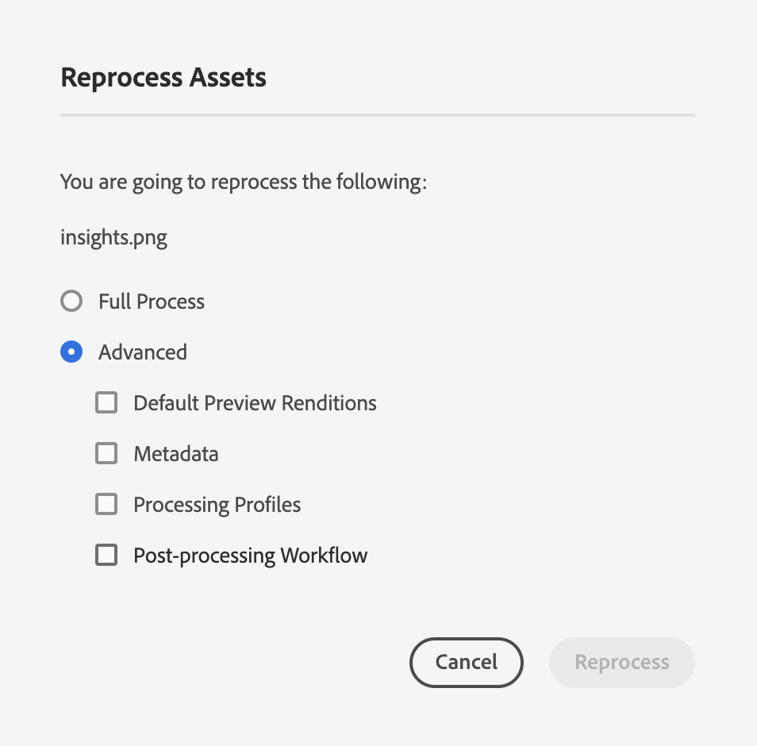

# Reprocessing digital assets {#reprocessing-digital-assets}

| [Search Best Practices](/help/assets/search-best-practices.md) |[Metadata Best Practices](/help/assets/metadata-best-practices.md)|[Content Hub](/help/assets/product-overview.md)|[Dynamic Media with OpenAPI capabilities](/help/assets/dynamic-media-open-apis-overview.md)|[AEM Assets developer documentation](https://developer.adobe.com/experience-cloud/experience-manager-apis/)|
| ------------- | --------------------------- |---------|----|-----|

You can reprocess assets in a folder that already has an existing metadata profile that you later changed. If you want the newly edited preset to be reapplied to the existing assets in the folder, you must reprocess the folder. You can reprocess as many assets as required.

Reprocess assets in a folder if you experience either of the following two scenarios:

* You want to run a batch set preset on an existing asset folder that already has assets uploaded to it.
* You later edit an existing batch set preset that was previously applied to a folder of assets.

## Reprocess assets {#reprocessing-steps}

To reprocess assets in a folder:

1. In [!DNL Experience Manager], from the Assets page, select the newly added assets or the assets that you want to reprocess. 
   In case you select a folder:

   * The workflow considers all files in the selected folder, recursively.
   * If there are one or more subfolders with assets in the main selected folder, the workflow reprocesses every asset in the folder hierarchy.
   * As a best practice, avoid running this workflow on a folder hierarchy that has more than 1000 assets.

1. Select **[!UICONTROL Reprocess Assets]**. Choose between the two options:

    

   * **[!UICONTROL Full Process]:** Select this option when you want to execute the overall process including default profile, custom profile, dynamic processing (if configured), and post processing workflows.
   * **[!UICONTROL Advanced]:** Select this option to choose advanced reprocessing.

     

     Select among the following advanced options:

     * **[!UICONTROL Default Preview Renditions]:** Choose this option when you want to reprocess the renditions that are previewed by default.

     * **[!UICONTROL Metadata]:** Choose this option when you want to extract metadata information and smart tags for the selected assets.

     * **[!UICONTROL Processing Profiles]:** Choose this option when you want to reprocess a selected profile. You can choose **[!UICONTROL Full Process]** option to include the default processing and the custom profile assigned at the folder level. 
     <!--When assets are uploaded to a folder, [!DNL Experience Manager] checks the containing folder's properties for a processing profile. If none is applied, a parent folder in the hierarchy is checked for a processing profile to apply.-->

     * **[!UICONTROL Post-processing Workflow]:** Choose this option where additional processing of assets is required that cannot be achieved using the processing profiles. Additional post-processing workflows can be added to the configuration. Post-processing lets you add completely customized processing on top of the configurable processing using asset microservices.

See [use asset microservices and processing profiles](https://experienceleague.adobe.com/docs/experience-manager-cloud-service/content/assets/manage/asset-microservices-configure-and-use.html?lang=en) to learn more about processing profiles and post-processing workflow.

  

After selecting the appropriate options, click **[!UICONTROL Reprocess]**. The success message appears.

## Scenarios for reprocessing digital assets {#scenarios-reprocessing}

[!DNL Experience Manager] allows reprocessing of digital assets for the following components.

### Smart tags {#reprocessing-smart-tags} 

Organizations that deal with digital assets increasingly use taxonomy-controlled vocabulary in asset metadata. Essentially, it includes a list of keywords that employees, partners, and customers commonly use to refer to and search for digital assets of a particular class. Tagging assets with taxonomy-controlled vocabulary ensures that assets are easily identified and retrieved.

Compared to natural language vocabularies, tagging digital assets based on business taxonomy helps align them with a company's business and ensures that the most relevant assets appear in searches.

Read more about [Smart tags for video assets](https://experienceleague.adobe.com/docs/experience-manager-cloud-service/content/assets/manage/smart-tags-video-assets.html?lang=en).

Read more about [Reprocess color tags for existing images in DAM](https://experienceleague.adobe.com/docs/experience-manager-cloud-service/content/assets/manage/color-tag-images.html?lang=en#color-tags-existing-images).

### Smart crop {#reprocessing-smart-crop}

Read more about [Dynamic Media smart crop](https://experienceleague.adobe.com/docs/experience-manager-cloud-service/content/assets/dynamicmedia/image-profiles.html?lang=en) that lets you apply specific cropping (**[!UICONTROL Smart Cropping]** and pixel cropping) and sharpening configuration to the uploaded assets.

### Metadata {#reprocessing-metadata}

[!DNL Adobe Experience Manager Assets] keeps metadata for every asset. It allows easier categorization and organization of assets and it helps people who are looking for a specific asset. With the ability to extract metadata from files uploaded to Experience Manager Assets, metadata management integrates with the creative workflow. With the ability to keep and manage metadata with your assets, you can automatically organize and process assets based on their metadata.

Read more about [Reprocessing metadata profiles](https://experienceleague.adobe.com/docs/experience-manager-cloud-service/content/assets/manage/metadata-profiles.html?lang=en).

### Reprocess Dynamic Media assets in a folder {#reprocessing-dynamic-media}

You can reprocess assets in a folder that already has an existing Dynamic Media Image Profile or a Dynamic Media Video Profile that you later changed. For more information, visit [reprocess Dynamic Media assets in a folder](https://experienceleague.adobe.com/docs/experience-manager-cloud-service/content/assets/admin/about-image-video-profiles.html?lang=en).

>[!NOTE]
>
>You need to configure [!DNL Dynamic Media] on the environment to enable Dynamic Media dialog box.
>

### Workflows

Read more about [processing profiles and post-processing workflows](https://experienceleague.adobe.com/docs/experience-manager-cloud-service/content/assets/manage/asset-microservices-configure-and-use.html?lang=en).
