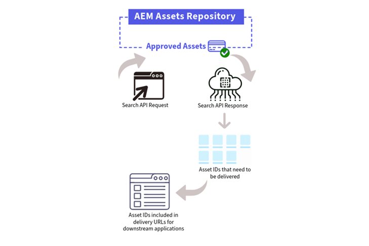

# Search Assets API {#search-assets-api}

<table>
    <tr>
        <td>
            <sup style= "background-color:#008000; color:#FFFFFF; font-weight:bold"><i>New</i></sup> <a href="/help/assets/dynamic-media/dm-prime-ultimate.md"><b>Dynamic Media Prime and Ultimate</b></a>
        </td>
        <td>
            <sup style= "background-color:#008000; color:#FFFFFF; font-weight:bold"><i>New</i></sup> <a href="/help/assets/assets-ultimate-overview.md"><b>AEM Assets Ultimate</b></a>
        </td>
        <td>
            <sup style= "background-color:#008000; color:#FFFFFF; font-weight:bold"><i>New</i></sup> <a href="/help/assets/integrate-aem-assets-edge-delivery-services.md"><b>AEM Assets integration with Edge Delivery Services</b></a>
        </td>
        <td>
            <sup style= "background-color:#008000; color:#FFFFFF; font-weight:bold"><i>New</i></sup> <a href="/help/assets/aem-assets-view-ui-extensibility.md"><b>UI Extensibility</b></a>
        </td>
          <td>
            <sup style= "background-color:#008000; color:#FFFFFF; font-weight:bold"><i>New</i></sup> <a href="/help/assets/dynamic-media/enable-dynamic-media-prime-and-ultimate.md"><b>Enable Dynamic Media Prime and Ultimate</b></a>
        </td>
    </tr>
    <tr>
        <td>
            <a href="/help/assets/search-best-practices.md"><b>Search Best Practices</b></a>
        </td>
        <td>
            <a href="/help/assets/metadata-best-practices.md"><b>Metadata Best Practices</b></a>
        </td>
        <td>
            <a href="/help/assets/product-overview.md"><b>Content Hub</b></a>
        </td>
        <td>
            <a href="/help/assets/dynamic-media-open-apis-overview.md"><b>Dynamic Media with OpenAPI capabilities</b></a>
        </td>
        <td>
            <a href="https://developer.adobe.com/experience-cloud/experience-manager-apis/"><b>AEM Assets developer documentation</b></a>
        </td>
    </tr>
</table>

>[!AVAILABILITY]
>
>Dynamic Media with OpenAPI capabilities guide is now available in PDF format. Download the entire guide and use Adobe Acrobat AI Assistant to answer your queries. 
>
>[!BADGE Dynamic Media with OpenAPI capabilities Guide PDF]{type=Informative url="https://helpx.adobe.com/content/dam/help/en/experience-manager/aem-assets/dynamic-media-with-openapi-capabilities.pdf"}

All [approved assets](approve-assets.md) available in Experience Manager assets repository can be searched and then delivered to integrated downstream applications using a Delivery URL.

Searching the right approved assets from the Experience Manager repository is the first step towards delivering assets using the delivery URL. The response to the search request comprises an array of JSON documents corresponding to the assets that met the search criteria. Each JSON document is identified using an `id` field, which is used to compose the asset delivery request.



You can define properties within the Search Assets API request to enable the following capabilities:

* **Full-text search**: Use the `match` query to define the text to search.  You can also use operators within the `match` query to filter the results.

* **Apply filters**: Use the `term` query to filters the results further by defining a `key` and one or multiple values. `key` identifies the field whose value must be matched and `value` represents what to match against. Similarly, you can use the `range` query to define a range for a field using the Greater-than (gt), Greater-than or equal-to (gte), Less-than (lt), and Less-than or equal-to (lte) properties. 

* **Sort results**: Use the `OrderBy` property to sort search results based on one or multiple fields. You can sort the results in an ascending or descending order.

* **Pagination**: Use the `limit` and `cursor` properties to define pagination properties within a Search API request. `limit` property defines the maximum items to retrieve in an API response. `cursor` property facilitates to retrieve starting point for the next set of assets defined in the `limit` property. For example, if you define `50` as the limit in the API request, you can use the `cursor` property to start and retrieve the next 50 items using the next API request.

## Search assets API endpoint {#search-assets-api-endpoint}

The endpoint in a Search assets API request must be in the following format:
`https://delivery-pXXXX-eYYYY.adobeaemcloud.com/adobe/assets/search`

The delivery domain is similar in structure to the Experience Manager author environment's domain. The only difference is replacing the term `author` with `delivery`.

`pXXXX` refers to the program ID

`eYYYY` refers to the environment ID

## Search assets API request method {#search-assets-api-request-method}

POST

## Search Assets API header {#search-assets-api-header}

You need to provide the following details while defining a header in the Search assets API:

```java
headers: {
      'Content-Type': 'application/json',
      'X-Adobe-Accept-Experimental': '1',
      Authorization: 'Bearer <YOUR_JWT_HERE>',
      'X-Api-Key': 'YOUR_API_KEY_HERE'
    },
```

To invoke the Search API, an IMS token is required to define in the `Authorization` details. The IMS token is fetched from a technical account. See [Fetch the AEM as a Cloud Service Credentials](https://experienceleague.adobe.com/docs/experience-manager-cloud-service/content/implementing/developing/generating-access-tokens-for-server-side-apis.html?lang=en#fetch-the-aem-as-a-cloud-service-credentials) to create a new technical account. See [Generating the access token](https://experienceleague.adobe.com/docs/experience-manager-cloud-service/content/implementing/developing/generating-access-tokens-for-server-side-apis.html?lang=en#generating-the-access-token) to generate the IMS token and use it appropriately in the Search assets API request header.

To view request samples, response samples, and response codes, see [Search Assets API](https://adobe-aem-assets-delivery-experimental.redoc.ly/#operation/search).
