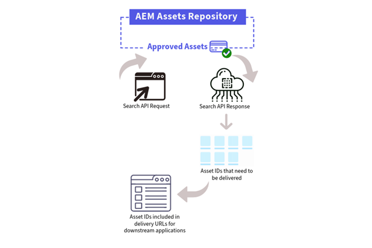

# Search Assets API {#search-assets-api}

All [approved assets](approve-assets.md) available in Experience Manager assets repository can be searched and then delivered to integrated downstream applications using a Delivery URL.

Searching the right approved assets from the Experience Manager repository is the first step towards delivering assets using the delivery URL. The response to the search request comprises an array of JSON documents corresponding to the assets that met the search criteria. Each JSON document is identified using an `id` field, which is used to compose the asset delivery request.



You can define properties within the Search Assets API request to enable the following capabilities:

* **Full-text search**: Use the `match` query to define the text to search.  You can also use operators within the `match` query to filter the results.

* **Apply filters**: Use the `term` query to filters the results further by defining a `key` and one or multiple values. `key` identifies the field whose value must be matched and `value` represents what to match against. Similarly, you can use the `range` query to define a range for a field using the Greater-than (gt), Greater-than or equal-to (gte), Less-than (lt), and Less-than or equal-to (lte) properties. 

* **Sort results**: Use the `OrderBy` property to sort search results based on one or multiple fields. You can sort the results in an ascending or descending order.

* **Pagination**: Use the `limit` and `cursor` properties to define pagination properties within a Search API request. `limit` property defines the maximum items to retrieve in an API response. `cursor` property facilitates to retrieve starting point for the next set of assets defined in the `limit` property. For example, if you define `50` as the limit in the API request, you can use the `cursor` property to start and retrieve the next 50 items using the next API request.

## Search assets API endpoint {#search-assets-api-endpoint}

The endpoint in a Search assets API request must be in the following format:
`https://delivery-pXXXX-eYYYY.adobeaemcloud.com/adobe/assets/search`

The delivery domain is similar in structure to the Experience Manager author environment's domain. The only difference is replacing the term `author` with `delivery`.

`pXXXX` refers to the program ID

`eYYYY` refers to the environment ID

## Search assets API request method {#search-assets-api-request-method}

POST

## Search Assets API header {#search-assets-api-header}

You need to provide the following details while defining a header in the Search assets API:

```java
headers: {
      'Content-Type': 'application/json',
      'X-Adobe-Accept-Experimental': '1',
      Authorization: 'Bearer <YOUR_JWT_HERE>',
      'X-Api-Key': 'YOUR_API_KEY_HERE'
    },
```

To invoke the Search API, an IMS token is required to define in the `Authorization` details. The IMS token is fetched from a technical account. See [Fetch the AEM as a Cloud Service Credentials](https://experienceleague.adobe.com/docs/experience-manager-cloud-service/content/implementing/developing/generating-access-tokens-for-server-side-apis.html?lang=en#fetch-the-aem-as-a-cloud-service-credentials) to create a new technical account. See [Generating the access token](https://experienceleague.adobe.com/docs/experience-manager-cloud-service/content/implementing/developing/generating-access-tokens-for-server-side-apis.html?lang=en#generating-the-access-token) to generate the IMS token and use it appropriately in the Search assets API request header.

To view request samples, response samples, and response codes, see [Search Assets API](https://developer.adobe.com/experience-cloud/experience-manager-apis/api/stable/assets/delivery/#operation/search).

## Frequently Asked Questions {#faqs-search-assets-apis}

### What is the Search Assets API in Dynamic Media with OpenAPI and what does it do? {#search-assets-api-overview}

The Dynamic Media with OpenAPI Search Assets API enables searching for approved assets in the Adobe Experience Manager Assets repository and delivering them to integrated downstream applications using a Delivery URL. Searching approved assets is the first step in the delivery workflow — the API response returns an array of JSON documents for each asset that meets the search criteria, each identified by an id field that is used to compose the asset delivery request. The Search Assets API supports full-text search, filter-based search, result sorting, and pagination within a single request.

### What search capabilities does the Search Assets API support? {#search-assets-api-capabilities}

The Dynamic Media with OpenAPI Search Assets API supports four core search capabilities. Full-text search uses the match query to search for text and supports operators to filter results. Filter-based search uses the term query to filter results by a key and one or multiple values, or the range query to filter by a value range using greater-than, greater-than-or-equal-to, less-than, and less-than-or-equal-to operators. Result sorting uses the OrderBy property to sort results based on one or multiple fields in ascending or descending order. Pagination uses the limit and cursor properties to control the number of results returned per request and to retrieve subsequent pages of results.

### How do I perform a full-text search using the Search Assets API? {#search-assets-api-full-text-search}

Full-text search in the Dynamic Media with OpenAPI Search Assets API is performed using the match query property in the request body. Define the text to search within the match query. Operators can also be used within the match query to further filter the results returned. The match query searches across approved assets in the AEM Assets repository and returns a JSON array of matching assets, each identified by an id field used to compose the delivery URL.

### How do I filter search results using the Search Assets API? {#search-assets-api-filters}

The Dynamic Media with OpenAPI Search Assets API supports two filter query types. The term query filters results by specifying a key — which identifies the field to match — and one or multiple values to match against. The range query filters results for a specific field using a defined range with the following operators: Greater-than (gt), Greater-than or equal-to (gte), Less-than (lt), and Less-than or equal-to (lte). Both query types can be used within the same API request to apply multiple filters simultaneously.

### How does pagination work in the Search Assets API? {#search-assets-api-pagination}

Pagination in the Dynamic Media with OpenAPI Search Assets API is controlled using two properties in the request: limit and cursor. The limit property defines the maximum number of assets to retrieve in a single API response. The cursor property defines the starting point for the next set of assets based on the limit defined. For example, setting a limit of 50 in the first request returns the first 50 matching assets — the cursor property in the next request then retrieves the following 50 assets, enabling sequential traversal of large result sets.

### How do I sort search results returned by the Search Assets API? {#search-assets-api-sort}

Search results in the Dynamic Media with OpenAPI Search Assets API are sorted using the OrderBy property in the request body. Specify one or multiple fields in the OrderBy property to sort the results. Sorting can be applied in ascending or descending order. Multiple sort fields can be combined to apply layered sorting across the search results returned by the API.

### What is the endpoint format for the Search Assets API? {#search-assets-api-endpoint=faqs}

The Dynamic Media with OpenAPI Search Assets API endpoint must follow this format: https://delivery-pXXXX-eYYYY.adobeaemcloud.com/adobe/assets/search. The delivery domain is structured similarly to the AEM author environment domain — the only difference is replacing the term author with delivery. In the URL, pXXXX refers to the program ID and eYYYY refers to the environment ID. The Search Assets API uses the HTTP POST request method.

### What headers are required to call the Search Assets API? {#search-assets-api-headers}

The Dynamic Media with OpenAPI Search Assets API requires four header fields: Content-Type set to application/json, X-Adobe-Accept-Experimental set to 1, Authorization as a Bearer token containing the IMS token, and X-Api-Key containing the API key. The IMS token is fetched from a technical account created using the AEM as a Cloud Service Credentials workflow. The technical account must be created and the access token generated before the Search Assets API can be invoked.

### What role does the id field play in the Search Assets API response? {#search-assets-api-response-id}

Each JSON document in the Search Assets API response corresponds to an asset that met the search criteria and is identified by an id field. This id field is the asset identifier used to compose the asset delivery request — it is passed as the assetId parameter in the Dynamic Media with OpenAPI Delivery API endpoint URL. Capturing the id from the search response is a required step in the end-to-end workflow of searching for and then delivering an approved asset via a Delivery URL.