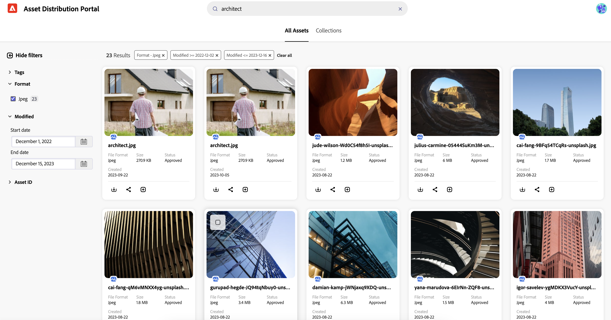

# Search Assets in [!DNL Content Hub] {#search-assets}

>[!AVAILABILITY]
>
>Content Hub guide is now available in PDF format. Download the entire guide and use Adobe Acrobat AI Assistant to answer your queries. 
>
>[!BADGE Content Hub Guide PDF]{type=Informative url="https://helpx.adobe.com/content/dam/help/en/experience-manager/aem-assets/content-hub.pdf"}

When you have a large number of assets in your repository, searching for the right asset is time-consuming. [!DNL The Content Hub] search provides you with the capability to look for the approved assets so that you can perform additional actions on them, such as download, share, or create collections. You can utilize various capabilities to narrow down your search results, such as, performing text-based search, using filters, performing tags or smart tags-specific search, searching for a particular file format, and so on.

## Prerequisites {#prerequisites}

[Content Hub users](deploy-content-hub.md#onboard-content-hub-users) can perform actions mentioned in this article.

## What you can search for  {#what-you-can-search}

The [!DNL Content Hub] search provides results based on: 

* **Matching text:** The [!DNL Content Hub] search allows you to search for an asset using its name or description. You can perform keyword-based search, which compares the keyword to the text available in the properties of an asset. 

* **Matching context:** [!DNL Content Hub] search results list contains proximate results of assets that you get based on the matching context. For example, if you type `cool` in the search bar, the assets related to `winter`, `snow`, `cold surroundings`, display in the search list. 

* **Asset information (title, tags, or smart tags):** [!DNL Content Hub] uses smart search algorithm to rank search results accurately and as relevant as possible. [Metadata](#asset-properties.md) is the collection of all the data available for an asset, but it may not necessarily be contained in that asset. [It helps you further categorize assets and is helpful as the amount of digital information grows](/help/assets/configure-content-hub-ui-options.md##configure-metadata-search-content-hub). 

* **Last modified date:** The assets that were modified recently appear on the top of search results list. You can also filter the date range as per your requirement. 

* **Usage:** The commonly used assets appear on the top of the search list.

* **Search history:** Click inside the search box without typing a character to get your search history. You can also remove any particular keyword from history. The search history is saved in the cache memory of a web browser, which means, if you access the [!DNL Content Hub] search in a different browser or clear cache memory of the browser, you cannot view the search history anymore.

* **Search while you type:** The [!DNL Content Hub] search enhances your search experience by providing autocomplete suggestions as you start typing.

## Basic search {#basic-search}

To perform basic search on [!DNL the Content Hub], navigate to the search bar and specify the keyword that you need to search. Navigate to filters available in the left pane and apply them to narrow down your search results. 

For example, search for all the **[!UICONTROL JPEG]** images with keyword `architect` in it, which is modified within the last year. To execute this scenario, execute the following steps: 

1. Specify `architect` as the search keyword.

1. Navigate to filters panel > **[!UICONTROL Format]** > select **[!UICONTROL JPEG]**. 

1. Navigate to **[!UICONTROL Modified]** > specify the date range. 

    

## Narrow your search results using filters {#narrow-down-search-results}

Use the Filters panel to search for assets based on metadata. You can filter search results based on various search predicates. You can select all the appropriate predicates to minimize or narrow down your search results. When you select multiple options within a filter, Content Hub displays the assets that match any of the options selected within a filter. However, when you select multiple options across filters, Content Hub only displays the assets that match all options selected across filters to narrow down your search results. 

The default filters include file format, approved by, date approved, expired and not expired assets, and expiration date. Administrators can also configure the filters that display in the list of filters. For more information, see [Configure Content Hub user interface](configure-content-hub-ui-options.md#configure-filters-content-hub).

<!--

<table>
    <tbody>
     <tr>
      <th><strong>Search Predicate</strong></th>
      <th><strong>Description</strong></th>
      <th><strong>Properties</strong></th>
     </tr>
     <tr>
      <td> Campaigns </td>
      <td> Allows you to search using planned activity performed to take any particular action. For example, advertisement campaign run on Ferrari to know the understand the interests of people using number of clicks people perform.</td>
      <td>NA</td>
     </tr>
     <tr>
      <td> Channels </td>
      <td> Helps you to understand the path from where the asset is coming from. For example, web, social media, books, catalog, etc.</td>
      <td>NA</td>
     </tr>
     <tr>
      <td> Region </td>
      <td> Helps you to understand the location where the asset is created. For example, Japan, EMEA, Worldwide, etc.</td>
      <td>NA</td>
     </tr>
     <tr>
      <td> Keywords </td>
      <td> Keyword helps you search using terms or the words that you enter based on the topic. For example, images, low-resolution, etc.</td>
      <td>NA</td>
     </tr>
     <tr>
      <td> Timeframe </td>
      <td> Helps you search assets using timeline. For example, search by year 2024, Q3 2023, etc.</td>
      <td>NA</td>
     </tr>
     <tr>
      <td>File format</td>
      <td>Composition of an asset. The supported assets include image, document, video, printable media, and so on.</td>
      <td>
        <ul>
            <li>[!UICONTROL JPEG]</li> 
            <li>[!UICONTROL Quicktime]</li> 
            <li>[!UICONTROL PNG]</li> 
            <li>[!UICONTROL WebP]</li> 
            <li>[!UICONTROL MP4]</li> 
            <li>[!UICONTROL Plain]</li> 
            <li>[!UICONTROL PDF]</li>
            <li>[!UICONTROL SVG + XML]</li>
        </ul>
      </td>
     </tr>
     <tr>
      <td>Tags</td>
      <td>Tags help you categorize assets that can be browsed and searched more efficiently based on hierarchical taxonomies.</td>
      <td>
        <ul>
            <li>Field label</li>
            <li>Property name</li>
            <li>Path</li>
            <li>Description</li>
        </ul>
      </td>
     </tr>
     <!--<tr>
      <td>Subject</td>
      <td>Classification of assets based on their theme. For example, colorful, hiking, outdoors.</td>
      <td>NA</td>
     </tr>
          <tr>
      <td>Last modified</td>
      <td>Search assets based on their last modification. Specify the date range using the Start date and End date fields.</td>
      <td>
        <ul>
            <li>Range text (From)</li> 
            <li>Range text (To) </li>
        </ul>
      </td>
     </tr>    
     <!--<tr>
      <td>Asset ID</td>
      <td>Unique number that identifies the asset.</td>
      <td>NA</td>
     </tr>
     <tr>
      <td> Colors </td>
      <td> Helps you search assets using colors that are automatically identified in an asset using Adobe's Sensei AI capabilities.</td>
      <td>NA</td>
     </tr>  
    </tbody>
   </table>

-->

## Do more with search {#do-more-with-search}

[!DNL The Content Hub] is not limited to search, instead it allows you to perform additional actions, such as [download](download-assets-content-hub.md), [share](share-assets-content-hub.md), and [add assets to collection](collections-content-hub.md), right from the search or preview interface. Select the assets on the search results page to view these options.
