# Search assets in [!DNL Assets view] {#search-assets}

<table>
    <tr>
        <td>
            <i>New</i> <a href="/help/assets/dynamic-media/dm-prime-ultimate.md"><b>Dynamic Media Prime and Ultimate</b></a>
        </td>
        <td>
            <i>New</i> <a href="/help/assets/assets-ultimate-overview.md"><b>AEM Assets Ultimate</b></a>
        </td>
        <td>
            <i>New</i> <a href="/help/assets/integrate-aem-assets-edge-delivery-services.md"><b>AEM Assets integration with Edge Delivery Services</b></a>
        </td>
        <td>
            <i>New</i> <a href="/help/assets/aem-assets-view-ui-extensibility.md"><b>UI Extensibility</b></a>
        </td>
          <td>
            <i>New</i> <a href="/help/assets/dynamic-media/enable-dynamic-media-prime-and-ultimate.md"><b>Enable Dynamic Media Prime and Ultimate</b></a>
        </td>
    </tr>
    <tr>
        <td>
            <a href="/help/assets/search-best-practices.md"><b>Search Best Practices</b></a>
        </td>
        <td>
            <a href="/help/assets/metadata-best-practices.md"><b>Metadata Best Practices</b></a>
        </td>
        <td>
            <a href="/help/assets/product-overview.md"><b>Content Hub</b></a>
        </td>
        <td>
            <a href="/help/assets/dynamic-media-open-apis-overview.md"><b>Dynamic Media with OpenAPI capabilities</b></a>
        </td>
        <td>
            <a href="https://developer.adobe.com/experience-cloud/experience-manager-apis/"><b>AEM Assets developer documentation</b></a>
        </td>
    </tr>
</table>

>[!CONTEXTUALHELP]
>id="assets_search"
>title="Search Assets"
>abstract="Search for assets by specifying a keyword in the Search bar or by filtering assets based on their status, file type, MIME type, size, creation, modification, and expiration dates. You can also apply custom filters in addition to the standard filters. You can save the filtered results as a Saved Search or a Smart Collection."
>additional-url="https://experienceleague.adobe.com/docs/experience-manager-assets-essentials/help/manage-collections.html?lang=en#manage-smart-collection" text="Create Smart Collections"

[!DNL Assets view] provides an effective search, that just works by default. The search is comprehensive as it is a full-text search. The powerful search functionality lets you quickly discover the appropriate asset and help you improve your content velocity. [!DNL Assets view] provides full-text search and even searches through the metadata such as smart tags, title, date created, and copyright.

To search assets, 

* Click in the search box at the top of the page. By default, it searches within the folder that you are currently browsing. Do one of the following:

  

  * Search using a keyword and optionally change the folder. Press Return.

  * Start working with a recently viewed asset, by searching for it directly. Click in the search box and select a recently viewed asset from the suggestions. 

## Filter the search results {#refine-search-results}

You can filter the search results based on the following parameters.

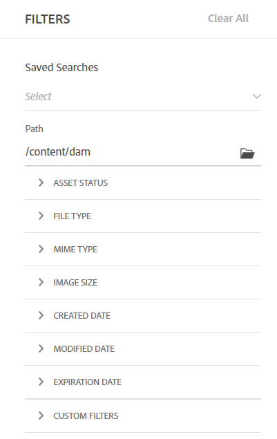

*Figure: Filter searched assets based on various parameters.*

* Asset Status: Filter the search results using an `Approved`, `Rejected`, or `No Status` asset status.

* File type: Filter the search results by the supported types of files that is, `Images`, `Documents`, and `Videos`.
* MIME type: Filter for one or more of the supported file formats. <!-- TBD:  [supported file formats](/help/using/supported-file-formats.md). -->
* Image size: Provide one of more of the minimum and maximum dimensions to filter images. Size is provided in dimensions in pixel and is not the file size of the images.
* Created date: The creation date of the asset as provided in the metadata. The standard date format used is `yyyy-mm-dd`.
* Modified date: The last modified date of the assets. The standard date format used is `yyyy-mm-dd`.

* Expiration Date: Filter the search results based on an `Expired` asset status. In addition, you can specify an expiration date range for assets to further filter your search results.

* Custom Filters: [Add custom filters](#custom-filters) to the Assets view user interface. Apply the custom filters in addition to the standard filters to refine your search results.

You can sort the searched assets in increasing or decreasing order of `Name`, `Relevance`, `Size`, `Modified`, and `Created`. The searched assets are sorted based on `Relevance`, by default.

## Manage custom filters {#custom-filters}

**Permissions required:**  `Can Edit`, `Owner`, or Administrator.

Assets view also enable you to add custom filters to the user interface. You can then apply those custom filters in addition to the [standard filters](#refine-search-results) to refine your search results.

Assets view provides the following custom filters:

<table>
    <tbody>
     <tr>
      <th><strong>Custom filter name</strong></th>
      <th><strong>Description</strong></th>
     </tr>
     <tr>
      <td>Title</td>
      <td>Filter assets using the asset title. The title that you specify in the case-sensitive search criteria must match the exact title of the asset to display in the results.</td>
     </tr>
     <tr>
      <td>Name</td>
      <td>Filter assets using the asset file name. The name that you specify in the case-sensitive search criteria must match the exact file name of the asset to display in the results.</td>
     </tr>
     <tr>
      <td>Asset Size</td>
      <td>Filter assets by defining a size range, in bytes, in the search criteria for an asset to display in the results.</td>
     </tr>
     <tr>
      <td>Predicted Tags</td>
      <td>Filter assets using the asset smart tag. The smart tag name that you specify in the case-sensitive search criteria must match the exact smart tag name of the asset to display in the results. You cannot specify multiple smart tags in search criteria.</td>
     </tr>    
    </tbody>
   </table>

   <!--
   You can use a wildcard operator (*) to enable Assets view to display assets in the results that partially match the search criteria. For example, if you define <b>ma*</b> as the search criteria, Assets view displays assets with title, such as, market, marketing, man, manchester, and so on in the results.

   You can use a wildcard operator (*) to enable Assets view to display assets in the results that partially match the search criteria.

   You can use a wildcard operator (*) to enable Assets view to display assets in the results that partially match the search criteria. You can specify multiple smart tags separated by a comma in the search criteria.

   -->

### Add custom filters {#add-custom-filters}

To add custom filters:

1. Click **[!UICONTROL Filters]**. 

1. In the **[!UICONTROL Custom Filters]** section, click **[!UICONTROL Edit]** or **[!UICONTROL Add Filters]**.

   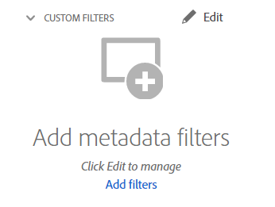

1. On the **[!UICONTROL Custom filters management]** dialog box, select the filters that you need to add to the existing list of filters. Select **[!UICONTROL Custom Filters]** to select all filters.

1. Click **[!UICONTROL Confirm]** to add the filters to the user interface.

### Remove custom filters {#remove-custom-filters}

To remove custom filters:

1. Click **[!UICONTROL Filters]**. 

1. In the **[!UICONTROL Custom Filters]** section, click **[!UICONTROL Edit]**.

1. On the **[!UICONTROL Custom filters management]** dialog box, deselect the filters that you need to remove from the existing list of filters.

1. Click **[!UICONTROL Confirm]** to remove the filters from the user interface. 

## Search assets using [!DNL Adobe Firefly] {#search-firefly}

You can search for an asset that is not available in any of the asset folders by utilizing the [!DNL Adobe Firefly] asset search feature within [!DNL Experience Manager Assets]. This allows you to efficiently generate assets in real-time that are not stored in the asset folders.

### Before you begin {#search-assets-firefly-prereqs}

You must have an active [!DNL Adobe Express] subscription.

### Generate assets {#generate-assets-firefly}

To generate new assets using [!DNL Adobe Firefly]:

1. Navigate to the [!DNL AEM Assets] workspace.

1. Type the asset name in the search bar. For example, you can search an asset using the keyword `Bugatti Type 57`. When searching for the asset, no results are found because the asset is not present in any of the asset folders. To generate assets using AI, click **[!UICONTROL Generate with Firefly]**. The [!DNL Adobe Firefly] screen appears. 

   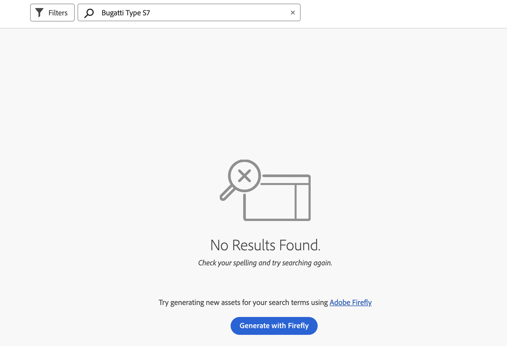

   The new assets are successfully generated. Additionally, you can change the image description by typing the new text prompt in the description box. [Learn how to write a good AI prompt to generate extraordinary and relevant content](https://helpx.adobe.com/in/firefly/using/tips-and-tricks.html). Alternatively, you can [edit image with various other features like changing style, image dimensions, and more](https://helpx.adobe.com/in/firefly/using/text-to-image.html).

   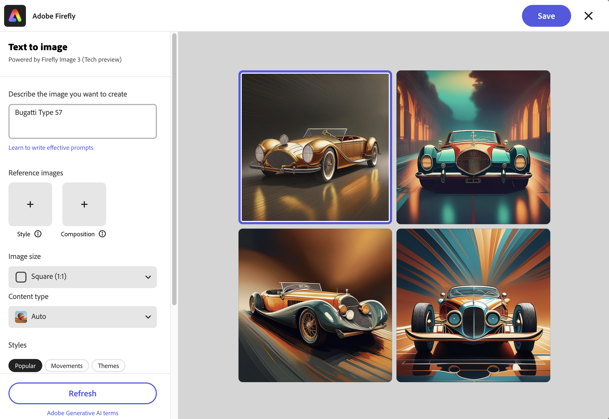

1. Select an image that you want to save. Click **[!UICONTROL Save]** to save the assets in your preferred folder for easy access.

1. Save asset form appears. Specify the following fields:

   * Enter a name for the file in the **Save As** field.
   * Select a destination folder. 
   * Enter details such as Project or Campaign name, Keywords, Channels, Time frame, and Region. 

   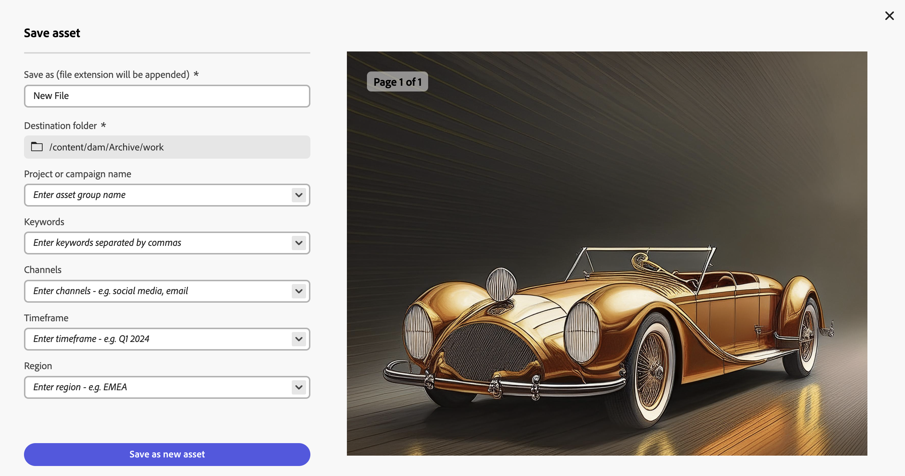

1. Click **Save as new asset** to save the asset(s).

### Upload assets {#upload-assets-firefly}

To upload the generated asset to the assets repository:

1. Click **[!UICONTROL Upload]**.
1. Select the asset folder to which you need to upload the asset and click **[!UICONTROL Select Folder]**.
 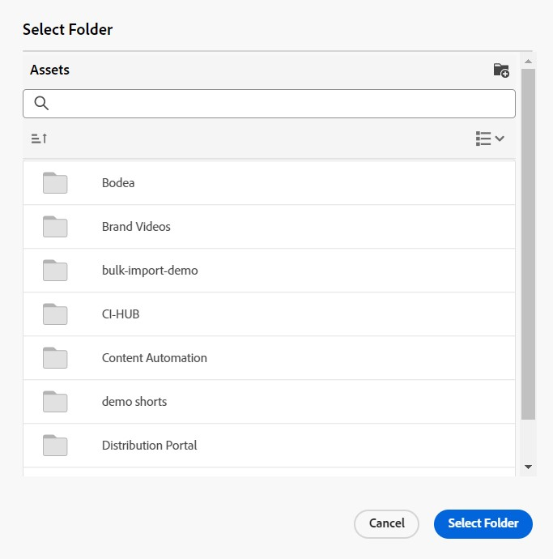

## Saved searches {#saved-search}

Search functionality is quite easy to use in [!DNL Assets view]. From within the search box, you cannot only type a keyword and press return to see the results, you can also quickly search again for your recently searched keywords in a single click.

You can also filter the search results based on specific criteria around metadata and type of assets. For frequently used filters, to improve the search experience, [!DNL Assets view] lets you save the search parameters. You can then select the saved search to search and apply the filter with just a single click as well.

To create a saved search, search for some asset, apply one or more filters, and click **[!UICONTROL Save as]** > **[!UICONTROL Saved Search]** in the [!UICONTROL Filters] panel. You can also click **[!UICONTROL Save as]** and select **[!UICONTROL Smart Collection]** to save the results as a Smart Collection. See [Create a Smart Collection](manage-collections.md#create-a-smart-collection) for more details.

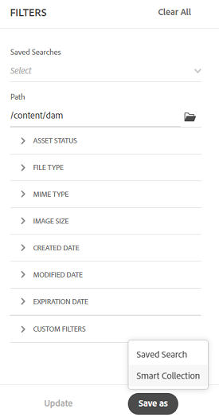

<!-- TBD: Search behavior. Full-text search. Ranking and rank boosts. Hidden assets.
Report poor UX that users can only save a filtered search and not a simple search.
.
Are other supported files fully indexed and support full-text search? Eg. audio/videos files can at best have metadata indexed.
Anything about ranking of assets displayed in search results?

What about temporarily hiding an asset (suspending search on it) from the search results? If an asset is undergoing review collaboration, should it be used by others? Should it be hidden in search?

When userA is searching and userB add an asset that matches search results, will the asset display in search as soon as userA refreshes the page? Assuming indexing is near real-time. May not be so for bulk uploads.
-->

## Work with Search results {#work-with-search-results}

You can select the assets that display in the search results and do the following actions:

* **Find Similar Image**: Find a similar image asset in the Assets UI based on the metadata and smart tags.

* **Details**: View and edit asset properties.

* **Download**: Download an asset.

* **Add to Collection**: Add the selected asset to a collection.

* **Pin to Quick Access**: [Pin an asset](my-workspace-assets-view.md) for faster access when you need it later. All pinned items display in the **Quick access** section of My Workspace.

* **Open in Adobe Express**: Edit an image in the integrated Adobe Express from the Experience Manager Assets screen.

* **Edit**: Edit the image using Adobe Express. 

* **Share Link**: [Share links](share-links-for-assets-view.md) for an asset with other users so that they can access and download it.

* **Delete**: Delete an asset.

* **Copy**: Copy an asset to a different folder location.

* **Move**: Move an asset to a different folder location.

* **Rename**: Rename an asset.

* **Copy to Libraries**: Add an asset to the Library.

* **Assign Tasks**: Assign tasks to users for an asset.

* **Watch**: [Monitor the operations](https://experienceleague.adobe.com/en/docs/experience-manager-cloud-service/content/assets/manage/search-assets) performed on an asset.

## Configure search first homepage {#configuring-search-first-homepage}

Assets view enables you to select the default landing page for your organization. When using Search First as the home page, you also have options to tailor the branding of the page by configuring the background and logo images to match your brand.

To configure the search first homepage, execute the steps below:

1. Navigate to **[!UICONTROL Settings]** > **[!UICONTROL General Settings]**.
1. Select **[!UICONTROL Search first]**. It further opens the search first related configuration. You can set [alignment](#setting-alignment-search-bar) or [set the background and logo image](#setting-background-image-and-logo) of your homepage.

### Setting alignment of search bar {#setting-alignment-search-bar}

[!DNL Assets view] allows you to change the alignment of the search bar. You can make the search bar appear either at the center or at the top. Select the appropriate alignment and click **[!UICONTROL Save]**.

   

### Setting background and logo image of homepage {#setting-background-image-and-logo}

You can add a brand logo and background image to your search first homepage. Execute the following steps:

1. Navigate to the **[!UICONTROL Background and Logo image]** section under **[!UICONTROL Homepage]**.
1. Click **[!UICONTROL Replace]** to browse images from the existing assets repository.
1. Click **[!UICONTROL Save]**. [Preview](#preview-configured-homepage) the changes to review the modifications.

### Preview configured homepage {#preview-configured-homepage}

You can preview to check the layout and formatting of the search first homepage. Using **[!UICONTROL Preview]**, you can fix the layout or make modifications as per the requirement. To preview the configured homepage, execute the steps below:

1. Click **[!UICONTROL General Settings]** and select **[!UICONTROL Search first]**.
1. Navigate to **[!UICONTROL Customize search first homepage]** and click **[!UICONTROL Preview]**. Toggle through the **[!UICONTROL Dark theme]** button to preview the homepage in dark or light theme.
1. Click **[!UICONTROL Close]** to close the preview screen.

   

## Contextual Search {#contextual-search}

You can also search assets available in the repository by defining text prompts. Experience Manager Assets automatically transforms those text prompts to search filters and displays the search results. You can view and modify automatic filters using the Filters Pane to further narrow down the search results.

### Access Contextual Search {#access-contextual-search}

To access Contextual Search in Experience Manager Assets:

1. Click **[!UICONTROL Search]** in the left pane.

   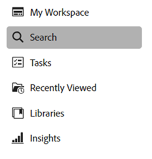

1. Define the text prompt in the Search text box and click **[!UICONTROL Contextual Search]**.

   

   [!DNL Experience Manager Assets] displays the search results.

### Supported filters {#supported-filters}

Contextual Search supports the following filters out-of-the-box. Base your text prompts on these filters to view appropriate search results.

* Image height

* Image width

* File type: image, document, video, or folder.

* MIME type: JPG, PNG, TIFF, GIF, MP4, PDF, PPTX, DOCX or XLSX

* Created date

* Modified date

* Expiration date

* Asset status: Approved, Rejected, or all

* Expired assets

### Examples for the text prompts {#text-prompts-examples}

**Example 1**

**Text Prompt**: Images created this month.

[!DNL Experience Manager Assets] applies the following filters automatically and displays the search results:

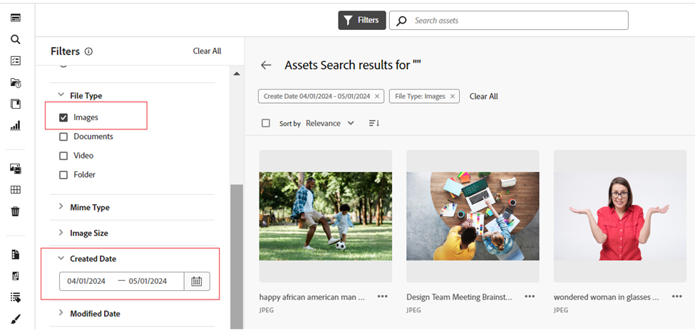

**Example 2**

**Text prompt**: Images at least 200px tall and 100px wide with beach and clear sky.

[!DNL Experience Manager Assets] applies the following filters automatically and displays the search results:

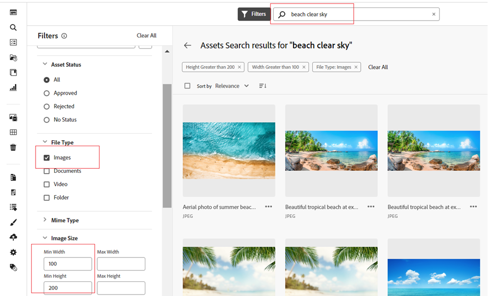

**Example 3**

**Text prompt**: I need images of blue sky that are 1500 and 2500 pixel height and created in the past month that is not expired and approved.

[!DNL Experience Manager Assets] applies the following filters automatically and displays the search results:

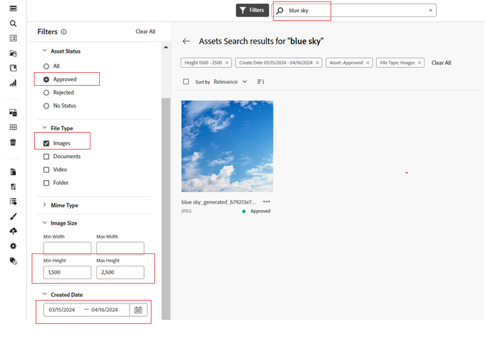

The following video illustrates the end-to-end process from accessing the Contextual Search User Interface to defining text prompts, and viewing the search results.

>[!VIDEO](https://video.tv.adobe.com/v/3428407)

### Disable Contextual Search {#disable-contextual-search}

Administrators also have the option to disable Contextual Search for users in your organization. To do so, execute the following steps:

1. Navigate to **[!UICONTROL Settings]** > **[!UICONTROL General Settings]**.

1. In the [!UICONTROL Contextual Search] section, turn off the **[!UICONTROL Enable Contextual Search for your organization]** toggle to disable the Contextual Search feature for all users in your organization.  

### Contextual Search feedback {#contextual-search-feedback}

If you need to provide feedback on the Contextual Search feature, click   and click the Feedback icon. Select the feedback type, specify the subject and description, and click **[!UICONTROL Submit]**.

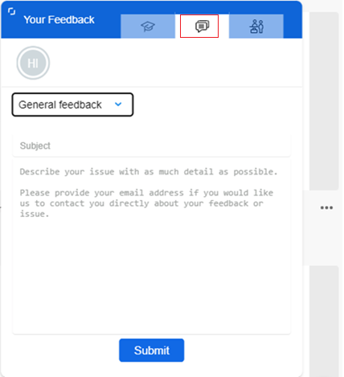

## Next Steps {#next-steps}

* [Watch a video to search assets in Assets view](https://experienceleague.adobe.com/docs/experience-manager-learn/assets-essentials/basics/using.html)

* Provide product feedback using the [!UICONTROL Feedback] option available on the Assets view user interface

* Provide documentation feedback using [!UICONTROL Edit this page]  or [!UICONTROL Log an issue]  available on the right sidebar.

* Contact [Customer Care](https://experienceleague.adobe.com/?support-solution=General#support)

