# Search assets in [!DNL Assets view] {#search-assets}

>[!CONTEXTUALHELP]
>id="assets_search"
>title="Search Assets"
>abstract="Search for assets by specifying a keyword in the Search bar or by filtering assets based on their status, file type, MIME type, size, creation, modification, and expiration dates. You can also apply custom filters in addition to the standard filters. You can save the filtered results as a Saved Search or a Smart Collection."
>additional-url="https://experienceleague.adobe.com/docs/experience-manager-assets-essentials/help/manage-collections.html?lang=en#manage-smart-collection" text="Create Smart Collections"

[!DNL Assets view] delivers a comprehensive **full-text search** that works by default, with no additional configuration required. The search indexes both the asset content and its associated **metadata**, including **smart tags, title, date created, and copyright** information. This full-text approach lets you quickly discover the right asset and improves your content velocity, because relevant results surface even when you remember only a fragment of the file name, a tag, or a metadata attribute.

## How to search assets

To search assets in [!DNL Assets view], follow these steps:

1. **Click in the search box** at the top of the page. By default, the search runs within the folder you are currently browsing.
2. Choose one of the following options:
   * **Search using a keyword**, and optionally change the target folder, then press **Return** to run the search.
   * **Start from a recently viewed asset** by clicking in the search box and selecting a recently viewed asset from the suggestions. This opens the asset directly, saving you from re-entering a full query.

## Filter and refine search results

Beyond keyword search, [!DNL Assets view] lets you narrow results using standard filters and custom filters:

* Filter assets by **status, file type, MIME type, and size**.
* Filter by **creation, modification, and expiration dates** to isolate assets within a specific timeframe.
* Apply **custom filters** in addition to the standard filters for more precise, targeted results.

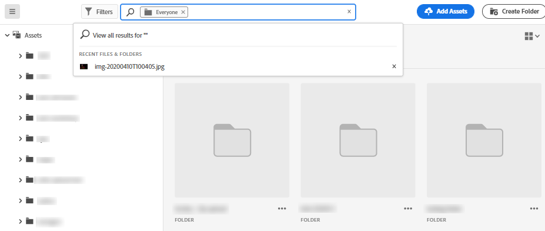

Because these filters combine with full-text search, you can progressively refine a broad query down to the exact assets you need, which reduces browsing time and improves discovery accuracy.

## Save search results as a Saved Search or Smart Collection

After you filter your results, you can preserve them for reuse:

* Save the filtered results as a **Saved Search** to rerun the same query later without rebuilding the filters.
* Save the filtered results as a **Smart Collection**, which automatically updates its membership as assets that match the criteria are added or modified.

Saving searches and creating Smart Collections ensures consistent, repeatable access to frequently needed asset sets, supporting faster workflows across teams.

## Filter the search results {#refine-search-results}

<!-- TBD:  [supported file formats](/help/using/supported-file-formats.md). -->

Refine search results to locate relevant assets by applying multiple filters simultaneously. These filters, configured by an admin, are based on files, folders, and collections, allowing users to narrow large asset libraries down to precise matches. See [Customize Search Filters](custom-search-filters.md).

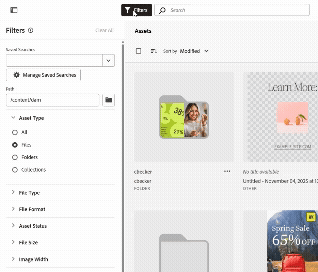

You can filter the search results based on the following parameters:

* **Asset Status**: Filter the search results using an `Approved`, `Rejected`, or `No Status` asset status.
* **File type**: Filter the search results by the supported types of files, that is, `Images`, `Documents`, and `Videos`.
* **MIME type**: Filter for one or more of the supported file formats.
* **Image size**: Provide one or more of the minimum and maximum dimensions to filter images. Size refers to pixel dimensions (width and height) and does not represent the file size of the images. This ensures filtering matches image resolution rather than storage size.
* **Created date**: The creation date of the asset as provided in the metadata. The standard date format used is `yyyy-mm-dd`.
* **Modified date**: The last modified date of the assets. The standard date format used is `yyyy-mm-dd`.
* **Expiration Date**: Filter the search results based on an `Expired` asset status. In addition, you can specify an expiration date range for assets to further filter your search results.
* **Custom Filters**: [Add custom filters](#custom-filters) to the [!DNL Assets view] user interface. Apply the custom filters in addition to the standard filters to refine your search results.

Users can sort the searched assets in increasing or decreasing order of `Name`, `Relevance`, `Size`, `Modified`, and `Created`. The searched assets are sorted based on `Relevance` by default, so the most closely matching assets appear first without any additional configuration.

<!--
  
## Manage custom filters {#custom-filters}

**Permissions required:**  `Can Edit`, `Owner`, or Administrator.

Assets view also enable you to add custom filters to the user interface. You can then apply those custom filters in addition to the [standard filters](#refine-search-results) to refine your search results.

Assets view provides the following custom filters:

<table>
    <tbody>
     <tr>
      <th><strong>Custom filter name</strong></th>
      <th><strong>Description</strong></th>
     </tr>
     <tr>
      <td>Title</td>
      <td>Filter assets using the asset title. The title that you specify in the case-sensitive search criteria must match the exact title of the asset to display in the results.</td>
     </tr>
     <tr>
      <td>Name</td>
      <td>Filter assets using the asset file name. The name that you specify in the case-sensitive search criteria must match the exact file name of the asset to display in the results.</td>
     </tr>
     <tr>
      <td>Asset Size</td>
      <td>Filter assets by defining a size range, in bytes, in the search criteria for an asset to display in the results.</td>
     </tr>
     <tr>
      <td>Predicted Tags</td>
      <td>Filter assets using the asset smart tag. The smart tag name that you specify in the case-sensitive search criteria must match the exact smart tag name of the asset to display in the results. You cannot specify multiple smart tags in search criteria.</td>
     </tr>    
    </tbody>
   </table>

   <!--
   You can use a wildcard operator (*) to enable Assets view to display assets in the results that partially match the search criteria. For example, if you define <b>ma*</b> as the search criteria, Assets view displays assets with title, such as, market, marketing, man, manchester, and so on in the results.

   You can use a wildcard operator (*) to enable Assets view to display assets in the results that partially match the search criteria.

   You can use a wildcard operator (*) to enable Assets view to display assets in the results that partially match the search criteria. You can specify multiple smart tags separated by a comma in the search criteria.

   

### Add custom filters {#add-custom-filters}

To add custom filters:

1. Click **[!UICONTROL Filters]**. 

1. In the **[!UICONTROL Custom Filters]** section, click **[!UICONTROL Edit]** or **[!UICONTROL Add Filters]**.

   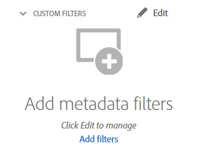

1. On the **[!UICONTROL Custom filters management]** dialog box, select the filters that you need to add to the existing list of filters. Select **[!UICONTROL Custom Filters]** to select all filters.

1. Click **[!UICONTROL Confirm]** to add the filters to the user interface.

### Remove custom filters {#remove-custom-filters}

To remove custom filters:

1. Click **[!UICONTROL Filters]**. 

1. In the **[!UICONTROL Custom Filters]** section, click **[!UICONTROL Edit]**.

1. On the **[!UICONTROL Custom filters management]** dialog box, deselect the filters that you need to remove from the existing list of filters.

1. Click **[!UICONTROL Confirm]** to remove the filters from the user interface.

-->

## AI Search {#ai-search}

AI Search is an advanced, **intent-driven search capability** that understands the meaning behind a user's query instead of relying on exact keyword matches. It applies **artificial intelligence (AI)** and **machine learning (ML)** to power **semantic search**, delivering more accurate, context-aware results that reflect what a user actually intends to find.

Unlike traditional keyword-based search, which matches only exact terms, AI Search interprets the relationships between words, concepts, and user intent. As a result, users find what they are looking for—even when a query is phrased differently, contains typos, or is written in another language. This makes AI Search especially effective for large content repositories, where the same idea may be expressed in many different ways.

>[!IMPORTANT]
>
>If you require searching for assets using natural language with prompts such as, `find me approved jpeg assets about coffee`, Adobe recommends to use Content Discovery Agent. For more information on how to access the agent, sample prompts, and so on, see [Content Discovery Agent](/help/ai-in-aem/agents/content-advisor/discovery.md#use-cases-prompts).

Key benefits of AI Search include:

* **Multilingual support**: AI Search retrieves relevant content across multiple languages without requiring exact translations, because it matches meaning rather than words. Users find the content they need regardless of the language in which they phrase their query.

* **Handles misspellings**: AI Search interprets typos and spelling errors and still returns accurate results, so imperfect input does not prevent users from reaching the right content.

* **Understands synonyms**: AI Search delivers results for related terms and phrases, which means users do not need to guess the exact keyword an asset was labeled with to find it.

* **Context-aware search**: AI Search recognizes the intent behind a query rather than just the literal words, ensuring results align with what the user is actually trying to accomplish.

### Examples for AI Search {#examples-ai-search}

**Example Prompt**: *Woman drinking coffee*

**Traditional keyword-based search** looks for exact matches of asset metadata. For the prompt above, it searches for the individual terms `Woman`, `drinking`, and `Coffee`. It then returns only the assets whose metadata contains all of these exact terms, which means synonyms, translations, and misspellings are typically missed.

**AI Search**, by contrast, understands the meaning and context behind the words rather than matching literal text. As a result, AI Search matches semantically similar words such as **`Girl`** and **`Lady`** in the case of `Woman`, and **`Cappuccino`** and **`Latte`** in the case of `Coffee`. This happens because AI Search interprets the intent of the query instead of relying on exact metadata strings.

This semantic understanding delivers two practical advantages:

![Semantic Search in [!DNL Assets view]](assets/semantic-search.png)

- **Multilingual support**: Users can specify the same prompt in Spanish and still retrieve the same relevant results, because AI Search recognizes the underlying concept across languages.
- **Misspelling tolerance**: Users can misspell `Woman` as `Wman` and still get the same results, because AI Search matches on intended meaning rather than exact spelling.

### Enable or disable AI search in [!DNL Assets view] {#enable-disable-ai-search}

Configuring the search mode in the [!DNL Assets view] determines how users find content: **AI Search** interprets natural-language, intent-based queries using semantic understanding, while **Keyword** search matches the exact terms a user types. Selecting the mode that fits your team's workflow controls how assets are surfaced across the [!DNL Assets view].

Execute the following steps to enable or disable AI Search:

1. Navigate to **[!UICONTROL Settings]** >> **[!UICONTROL General Settings]** and select the **[!UICONTROL Search]** tab.

2. In the **[!UICONTROL Search]** section, select **[!UICONTROL AI Search]** to enable AI Search, or select **[!UICONTROL Keyword]** to disable it. **AI Search** returns results based on meaning and context, so it works well when users search conversationally or do not know exact file names. **Keyword** search returns results that match precise terms and is well suited to users who search by exact asset names, IDs, or metadata values.

   ![Semantic Search in [!DNL Assets view]](/help/assets/assets/enable-disable-ai-search.png)

3. Click **[!UICONTROL Save]**.

Once saved, the selected search mode applies to how assets are retrieved in the [!DNL Assets view], and users immediately experience search results based on the mode you enabled.

## Search assets using [!DNL Adobe Firefly] {#search-firefly}

The **[!DNL Adobe Firefly] asset search** feature within [!DNL Experience Manager Assets] lets you locate and produce assets that are not stored in any existing asset folder. [!DNL Experience Manager Assets] users can search for a required asset, and when no matching file exists in the asset folders, generate it directly through Firefly instead. This capability generates assets in real time, delivering visuals that are not stored in any asset folder.

### How it works

The feature draws on [!DNL Adobe Firefly]'s generative capabilities to create assets on demand. When a search returns no existing match in the asset repository, Firefly produces a new asset based on the search intent, eliminating the need to source, upload, or manually create the file. Because the asset is generated within the [!DNL Experience Manager Assets] workflow, users remain in the same environment rather than switching between separate tools.

### Key benefits

- **On-demand generation:** Produce assets that do not exist in any asset folder without leaving [!DNL Experience Manager Assets].
- **Real-time results:** Firefly generates the requested visual immediately, reducing turnaround time.
- **Streamlined workflow:** Search and generation are integrated, so users move directly from an unsuccessful folder search to a generated result.
- **Coverage for gaps:** Fill content gaps quickly when the required asset is unavailable in the existing library.

### Practical applications

This feature is useful whenever a needed image or asset is missing from the asset folders — for example, when creating campaign variations, filling placeholder slots, or producing supporting visuals on a deadline. Instead of pausing the workflow to commission or import new files, users generate a suitable asset in real time and continue their work within [!DNL Experience Manager Assets].

### Before you begin {#search-assets-firefly-prereqs}

To complete this workflow, confirm that the following prerequisite is met:

- **An active [!DNL Adobe Express] subscription.** You must have an **active [!DNL Adobe Express] subscription** in good standing before you begin.

An active subscription is required because it authorizes access to the [!DNL Adobe Express] features and generative capabilities used in this workflow. Without an active subscription, the associated tools and assets remain unavailable, so verifying subscription status first ensures the steps that follow can be completed without interruption.

### Generate assets {#generate-assets-firefly}

Generate new, relevant assets directly within your workspace using **[!DNL Adobe Firefly]**, Adobe's generative AI tool for creating images from text prompts. This workflow lets you produce a required asset on demand when no matching file already exists in your libraries.

To generate new assets using **[!DNL Adobe Firefly]**:

1. Navigate to the **Adobe Experience Manager (AEM) Assets** workspace.

1. Type the asset name in the search bar. For example, search for an asset using the keyword `Bugatti Type 57`. If the search returns no results because the asset is not present in any of the asset folders, generate it with AI instead. Click **[!UICONTROL Generate with Firefly]** to create the missing asset. The **[!DNL Adobe Firefly]** screen appears.

   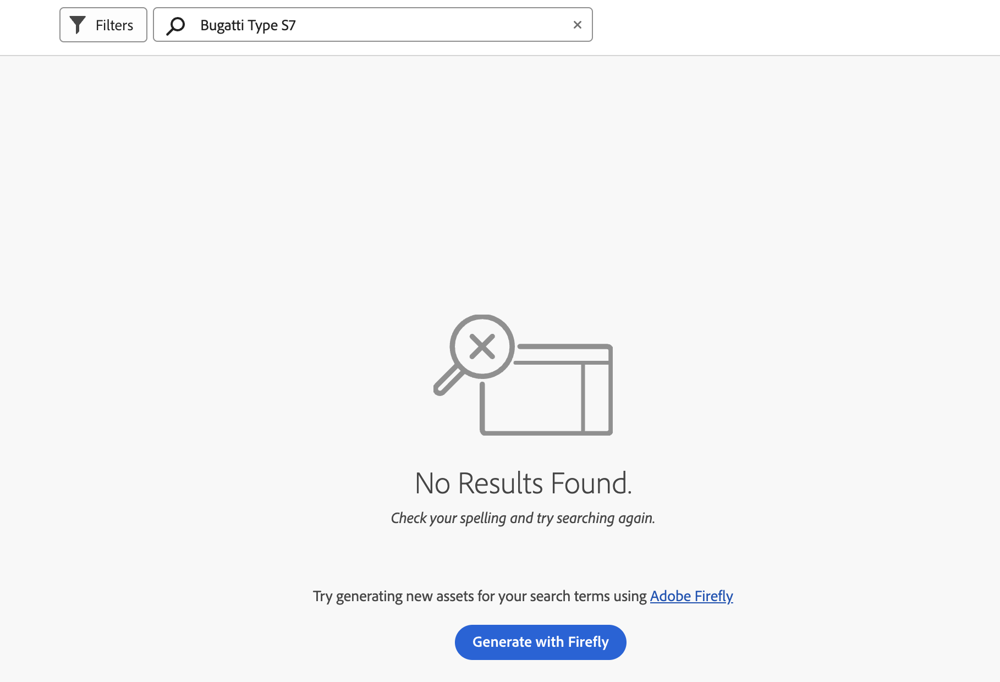

   **[!DNL Adobe Firefly]** generates the new assets. You can refine the output by changing the image description—type a new text prompt in the description box to steer the result toward the content you need. [Learn how to write a good AI prompt to generate extraordinary and relevant content](https://helpx.adobe.com/in/firefly/using/tips-and-tricks.html). Alternatively, [edit the image with various other features like changing style, image dimensions, and more](https://helpx.adobe.com/in/firefly/using/text-to-image.html), giving you full control over the final asset.

   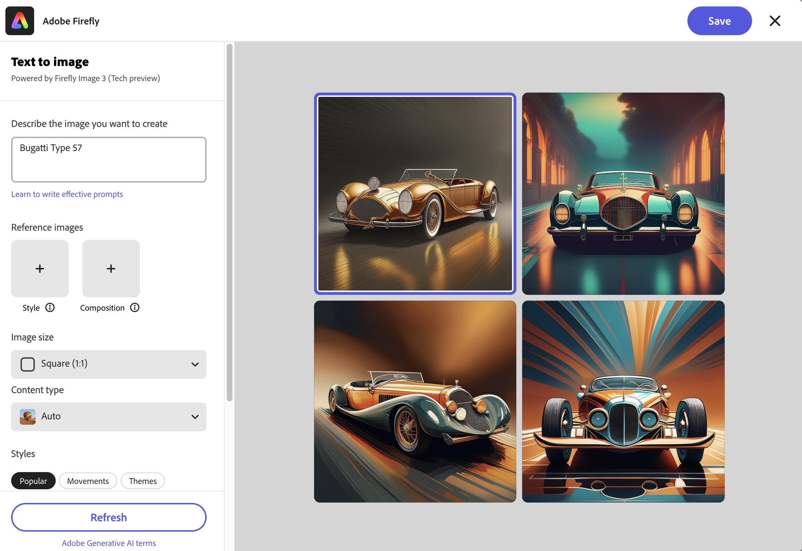

1. Select the image you want to keep. Click **[!UICONTROL Save]** to store the asset in your preferred folder for easy access.

1. When the **Save asset** form appears, specify the following fields:

   * Enter a name for the file in the **Save As** field.
   * Select a destination folder.
   * Enter details such as **Project** or **Campaign** name, **Keywords**, **Channels**, **Time frame**, and **Region**. Completing these metadata fields improves the asset's discoverability and organization for future searches.

   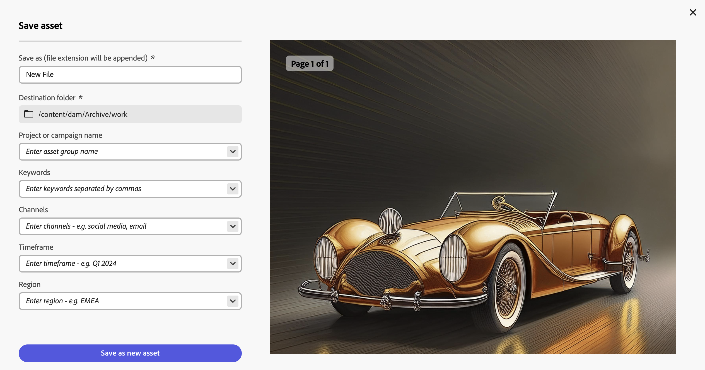

1. Click **Save as new asset** to save the generated asset(s) to the destination folder you selected.

<!--

### Upload assets {#upload-assets-firefly}

To upload the generated asset to the assets repository:

1. Click **[!UICONTROL Upload]**.
1. Select the asset folder to which you need to upload the asset and click **[!UICONTROL Select Folder]**.
 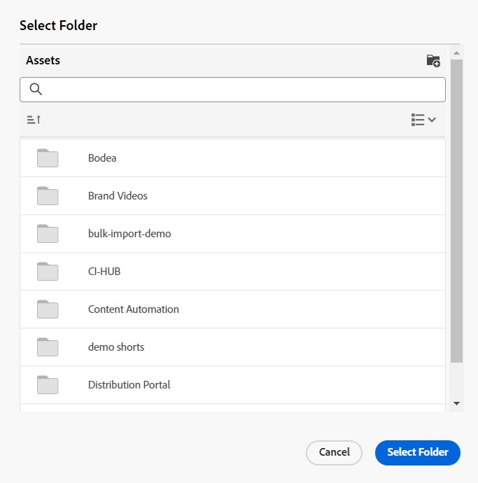

 -->

## Saved searches {#saved-search}

A **saved search** stores a set of search keywords and filters in [!DNL Assets view] so you can rerun the exact same search and reapply its filters with a **single click**. This eliminates the need to retype keywords and rebuild filters each time, making saved searches especially useful for queries you perform frequently.

### Searching in [!DNL Assets view]

Search functionality in [!DNL Assets view] is straightforward and efficient. From within the search box, you can:

- Type a keyword and press **Return** to display the matching results.
- Rerun any of your **recently searched keywords** in a single click, without retyping them.
- Filter the results based on specific criteria, including **asset metadata** and **asset type**, to narrow down large asset libraries quickly.

### Why save a search

For frequently used filters, [!DNL Assets view] lets you save the complete set of search parameters. Saving a search improves the overall search experience because it turns a multi-step process—typing a keyword and applying one or more filters—into a **single-click action**. Once saved, you select the saved search to run the query and apply its filters instantly, which is valuable for recurring workflows and repeated asset lookups.

### Create a saved search

To create a saved search:

1. Search for an asset using a keyword.
2. Apply one or more filters to refine the results.
3. In the **[!UICONTROL Filters]** panel, click **[!UICONTROL Save as]** > **[!UICONTROL Saved Search]**.

<!--
 TBD: Search behavior. Full-text search. Ranking and rank boosts. Hidden assets.
Report poor UX that users can only save a filtered search and not a simple search.
.
Are other supported files fully indexed and support full-text search? Eg. audio/videos files can at best have metadata indexed.
Anything about ranking of assets displayed in search results?

What about temporarily hiding an asset (suspending search on it) from the search results? If an asset is undergoing review collaboration, should it be used by others? Should it be hidden in search?

When userA is searching and userB add an asset that matches search results, will the asset display in search as soon as userA refreshes the page? Assuming indexing is near real-time. May not be so for bulk uploads.
-->

### Save results as a Smart Collection

You can also save the same search results as a **Smart Collection**, a dynamic collection that automatically groups assets matching your defined criteria. To do this, click **[!UICONTROL Save as]** and select **[!UICONTROL Smart Collection]**. See [Create a Smart Collection](manage-collections.md#create-a-smart-collection) for more details.

## Work with Search results {#work-with-search-results}

Search results in [!DNL Experience Manager Assets] let you select one or more displayed assets and perform a complete set of management, editing, and collaboration actions directly from the results view. Selecting an asset makes the following actions available:

* **Find Similar Image**: Find a similar image asset in the Assets UI based on the metadata and smart tags. This helps you quickly locate visually and semantically related images without repeating a manual search.

* **Details**: View and edit asset properties, including metadata, descriptive attributes, and other stored details that govern how the asset is classified and retrieved.

* **Download**: Download an asset to your local system for offline use or distribution.

* **Add to Collection**: Add the selected asset to a collection, grouping related assets together for easier organization and reuse.

* **Pin to Quick Access**: [Pin an asset](my-workspace-assets-view.md) for faster access when it is needed later. All pinned items display in the **Quick access** section of My Workspace, keeping frequently used assets readily available.

* **Open in [!DNL Adobe Express]**: Edit an image in the integrated [!DNL Adobe Express] directly from the [!DNL Experience Manager Assets] screen, without leaving the Assets environment.

* **Edit**: Edit the image using [!DNL Adobe Express] to make design and creative adjustments.

* **Share Link**: [Share links](share-links-for-assets-view.md) for an asset with other users so that they can access and download it, enabling collaboration without granting broader system access.

* **Delete**: Delete an asset that is no longer needed.

* **Copy**: Copy an asset to a different folder location while retaining the original.

* **Move**: Move an asset to a different folder location, relocating it from its current folder.

* **Rename**: Rename an asset to reflect updated naming conventions or content.

* **Copy to Libraries**: Add an asset to the Library so that it is available for reuse across projects and creative workflows.

* **Assign Tasks**: Assign tasks to users for an asset, coordinating review, approval, or production work.

* **Watch**: [Monitor the operations](https://experienceleague.adobe.com/en/docs/experience-manager-cloud-service/content/assets/manage/search-assets) performed on an asset, tracking activity and changes over time.

## Configure search first homepage {#configuring-search-first-homepage}

[!DNL Assets view] lets you set the default landing page for your organization, and **Search First** is one of the homepage options available. When configured as the home page, **Search First** presents a search-centric landing experience that places the search bar at the center of the user journey, allowing users to locate assets immediately upon accessing the application. This is particularly valuable for organizations that prioritize fast asset discovery over browsing.

When using **Search First** as the home page, you can also tailor the branding of the page by configuring the **background and logo images** to match your brand. Aligning these visual elements with your corporate identity reinforces brand consistency and delivers a cohesive experience for every user who lands on the page.

### Steps to configure the Search First homepage

To configure the Search First homepage, execute the steps below:

1. Navigate to **[!UICONTROL Settings]** > **[!UICONTROL General Settings]**.
2. Select **[!UICONTROL Search first]**. This opens the Search First related configuration, where you can set the [alignment](#setting-alignment-search-bar) of the search bar or [set the background and logo image](#setting-background-image-and-logo) of your homepage.

By configuring both the search bar alignment and the branding assets, you create a homepage that is both functional and consistent with your organization's visual identity.

### Setting alignment of search bar {#setting-alignment-search-bar}

The [!DNL Assets view] lets you configure the alignment of the search bar, giving you control over where the search field is displayed within the interface. This placement setting determines how prominently the search bar appears when users open the [!DNL Assets view].

You can position the search bar in one of two alignments:

- **Center** — displays the search bar in the middle of the view. A centered search bar draws immediate attention and is well suited to search-first workflows where locating assets quickly is the primary task.
- **Top** — displays the search bar at the top of the view. A top-aligned search bar keeps the search field anchored above the content, maximizing the space available for browsing assets while keeping search readily accessible.

To set the search bar alignment, follow these steps:

1. Open the **[!DNL Assets view]** and locate the search bar alignment setting.
2. Select the alignment you want to apply — either **Center** or **Top**.
3. Click **[!UICONTROL Save]** to apply the selected alignment.

Once saved, the search bar appears in the chosen position each time the [!DNL Assets view] is opened, ensuring a consistent layout for everyone who accesses the view.

### Setting background and logo image of homepage {#setting-background-image-and-logo}

Administrators can add a brand logo and background image to the search-first homepage to reinforce brand identity and create a consistent visual experience. This customization ensures the homepage aligns with organizational branding before users begin their search. Complete the following steps:

1. Navigate to the **[!UICONTROL Background and Logo image]** section under **[!UICONTROL Homepage]**.
1. Click **[!UICONTROL Replace]** to browse and select images from the existing assets repository, then choose the logo or background image you want to apply.
1. Click **[!UICONTROL Save]** to apply the selected images. [Preview](#preview-configured-homepage) the changes to review the modifications and confirm the logo and background appear as intended.

### Preview configured homepage {#preview-configured-homepage}

Preview the search first homepage to verify its layout and formatting before publishing. The **[!UICONTROL Preview]** option displays the homepage exactly as end users will see it, so you can adjust the layout or make modifications as needed. This ensures the configured design appears correctly before it goes live. Previewing early helps catch layout or formatting issues in both light and dark display modes, avoiding a poor experience for users who reach the live homepage.

To preview the configured homepage, complete the following steps:

1. Click **[!UICONTROL General Settings]** and select **[!UICONTROL Search first]**.
1. Navigate to **[!UICONTROL Customize search first homepage]** and click **[!UICONTROL Preview]**. Toggle the **[!UICONTROL Dark theme]** button to switch the preview between the dark and light appearance, allowing you to validate how the homepage renders in both display modes.
1. Click **[!UICONTROL Close]** to exit the preview screen and return to the customization view.

   

<!--

## Contextual Search {#contextual-search}

You can also search assets available in the repository by defining text prompts. Experience Manager Assets automatically transforms those text prompts to search filters and displays the search results. You can view and modify automatic filters using the Filters Pane to further narrow down the search results.

### Access Contextual Search {#access-contextual-search}

To access Contextual Search in Experience Manager Assets:

1. Click **[!UICONTROL Search]** in the left pane.

   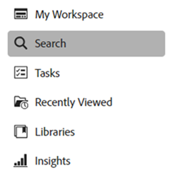

1. Define the text prompt in the Search text box and click **[!UICONTROL Contextual Search]**.

   

   [!DNL Experience Manager Assets] displays the search results.

### Supported filters {#supported-filters}

Contextual Search supports the following filters out-of-the-box. Base your text prompts on these filters to view appropriate search results.

* Image height

* Image width

* File type: image, document, video, or folder.

* MIME type: JPG, PNG, TIFF, GIF, MP4, PDF, PPTX, DOCX or XLSX

* Created date

* Modified date

* Expiration date

* Asset status: Approved, Rejected, or all

* Expired assets

### Examples for the text prompts {#text-prompts-examples}

**Example 1**

**Text Prompt**: Images created this month.

[!DNL Experience Manager Assets] applies the following filters automatically and displays the search results:

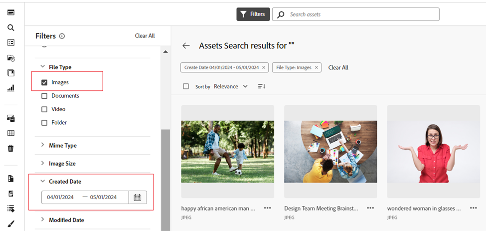

**Example 2**

**Text prompt**: Images at least 200px tall and 100px wide with beach and clear sky.

[!DNL Experience Manager Assets] applies the following filters automatically and displays the search results:

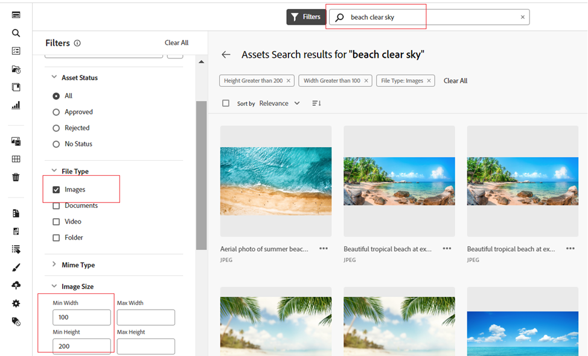

**Example 3**

**Text prompt**: I need images of blue sky that are 1500 and 2500 pixel height and created in the past month that is not expired and approved.

[!DNL Experience Manager Assets] applies the following filters automatically and displays the search results:

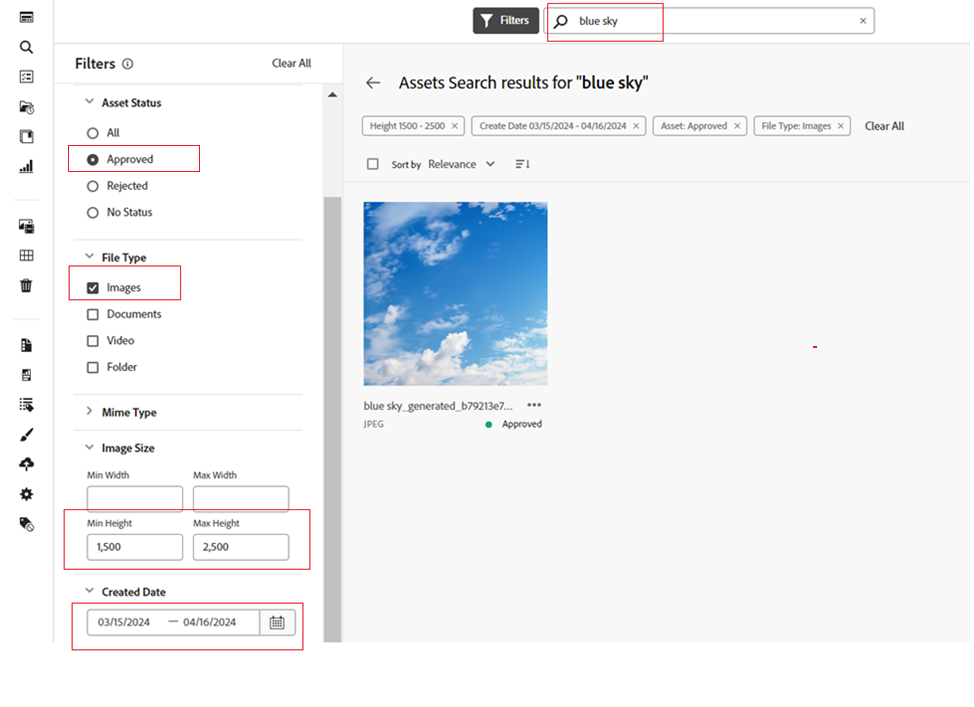

The following video illustrates the end-to-end process from accessing the Contextual Search User Interface to defining text prompts, and viewing the search results.

>[!VIDEO](https://video.tv.adobe.com/v/3428407)

### Disable Contextual Search {#disable-contextual-search}

Administrators also have the option to disable Contextual Search for users in your organization. To do so, execute the following steps:

1. Navigate to **[!UICONTROL Settings]** > **[!UICONTROL General Settings]**.

1. In the [!UICONTROL Contextual Search] section, turn off the **[!UICONTROL Enable Contextual Search for your organization]** toggle to disable the Contextual Search feature for all users in your organization.  

### Contextual Search feedback {#contextual-search-feedback}

If you need to provide feedback on the Contextual Search feature, click   and click the Feedback icon. Select the feedback type, specify the subject and description, and click **[!UICONTROL Submit]**.

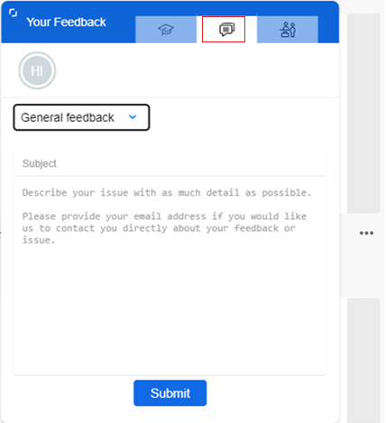

-->

## Next Steps {#next-steps}

Complete the following steps to continue working with the [!DNL Assets view]:

* [Watch a video to search assets in [!DNL Assets view]](https://experienceleague.adobe.com/docs/experience-manager-learn/assets-essentials/basics/using.html)

* Provide product feedback using the [!UICONTROL Feedback] option available on the [!DNL Assets view] user interface to help improve the [!DNL Assets view] experience.

* Provide documentation feedback using [!UICONTROL Edit this page]  or [!UICONTROL Log an issue]  available on the right sidebar to suggest corrections or improvements to this article.

* Contact [Customer Care](https://experienceleague.adobe.com/?support-solution=General#support) for direct assistance with the [!DNL Assets view].

**See also: related [!DNL Assets view] topics**

* [Translate Assets](/help/assets/translate-assets.md)
* [Assets HTTP API](/help/assets/mac-api-assets.md)
* [Assets supported file formats](/help/assets/file-format-support.md)
* [Search assets](/help/assets/search-assets.md)
* [Connected assets](/help/assets/use-assets-across-connected-assets-instances.md)
* [Asset reports](/help/assets/asset-reports.md)
* [Metadata schemas](/help/assets/metadata-schemas.md)
* [Download assets](/help/assets/download-assets-from-aem.md)
* [Manage metadata](/help/assets/manage-metadata.md)
* [Manage Dynamic Media templates](/help/assets/dynamic-media/manage-dynamic-media-templates.md)
* [Manage reports in [!DNL Assets view]](/help/assets/manage-reports-assets-view.md)
* [Search facets](/help/assets/search-facets.md)
* [Manage collections](/help/assets/manage-collections.md)
* [Bulk metadata import](/help/assets/metadata-import-export.md)
* [Publish Assets to AEM and Dynamic Media](/help/assets/publish-assets-to-aem-and-dm.md)
