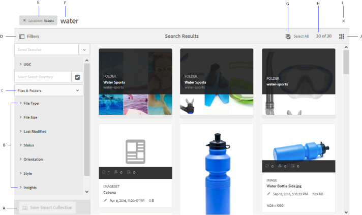
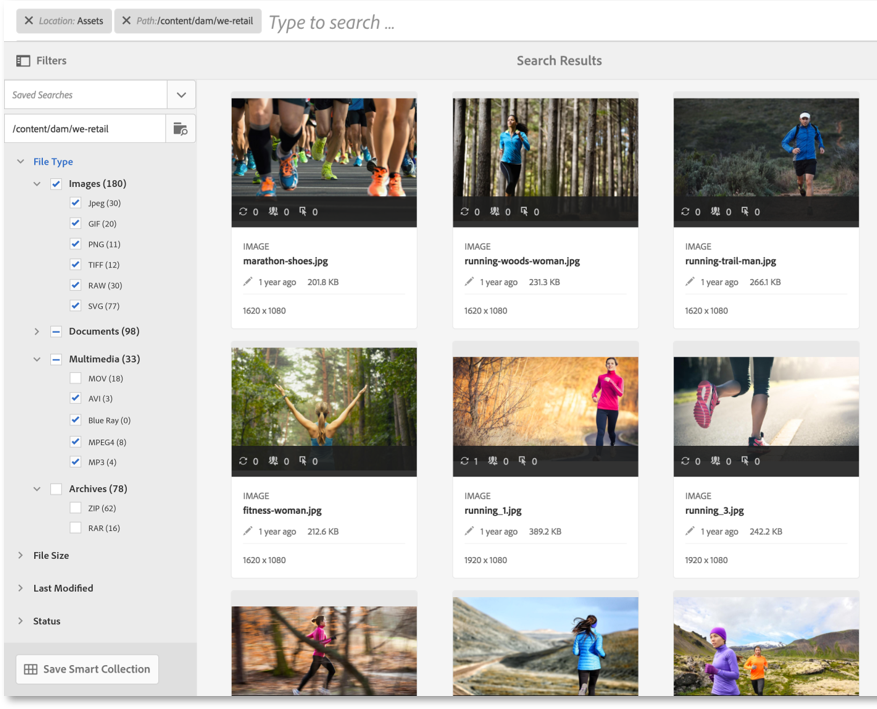
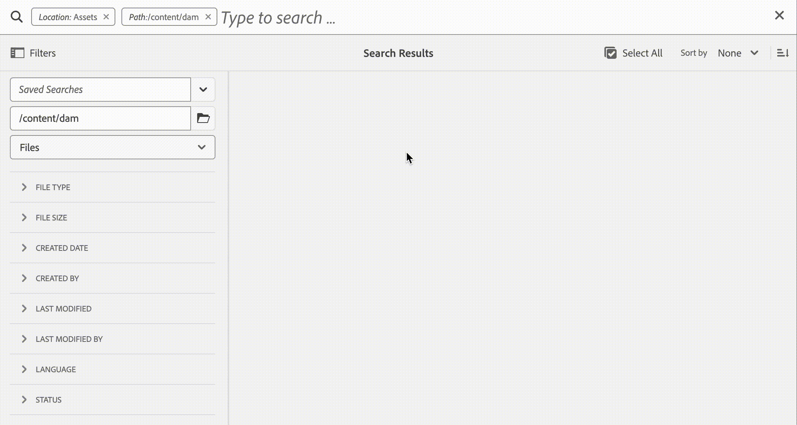
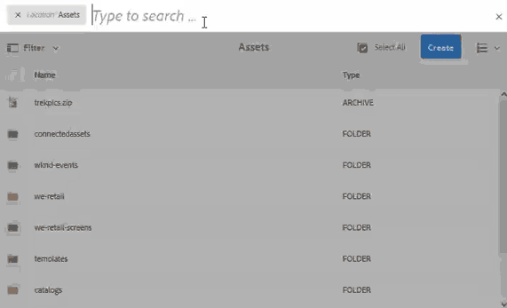
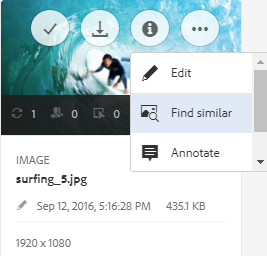
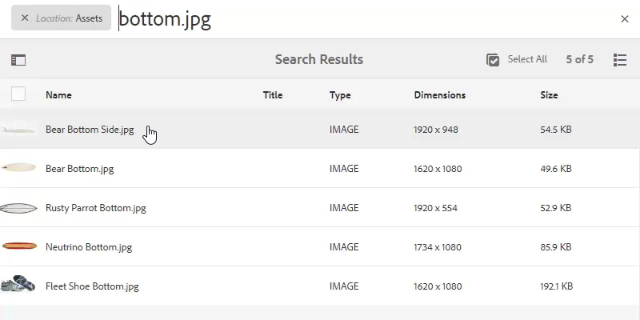
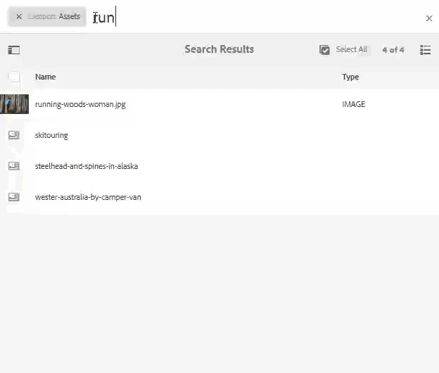
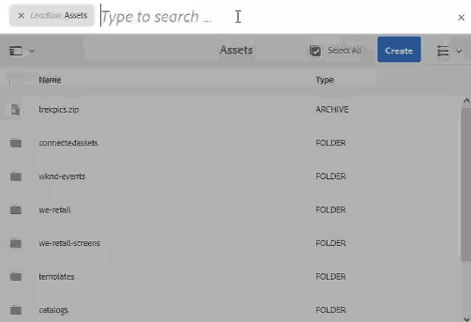
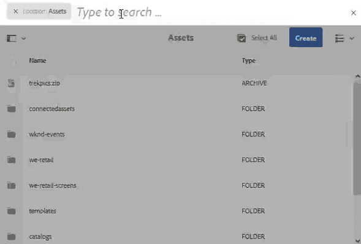
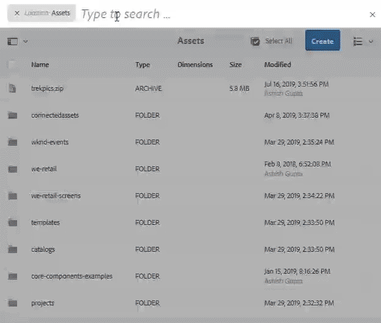

# Search assets in AEM {#search-assets-in-aem}

| Version | Article link |
| -------- | ---------------------------- |
| AEM 6.5  |    [Click here](https://experienceleague.adobe.com/docs/experience-manager-65/assets/using/search-assets.html)                  |
| AEM as a Cloud Service     | This article         |

[!DNL Adobe Experience Manager Assets] delivers robust, intelligent asset search methods that drive higher content velocity. Teams reduce time to market through a seamless, intelligent search experience that combines out-of-the-box functionality with custom methods. The search assets capability is central to any digital asset management (DAM) system, because it determines how quickly users locate, reuse, and govern content -- whether for further use by creatives, for robust management of assets by business users and marketers, or for administration by DAM administrators. Simple, advanced, and custom searches that you can perform via the [!DNL Assets] user interface or other apps and surfaces fulfill these use cases across the [!DNL Assets] user interface, connected apps, and other surfaces.

Asset search in AEM supports the following use cases, and this article describes the usage, concepts, configurations, limitations, and troubleshooting for each of these use cases.

| Search assets | Configure and administer search functionality | Work with asset search results |
|---|---|---|
| [Basic searches](#searchbasics) | [Search index](#searchindex) | [Sort results](#sort) |
| [Understand search UI](#searchui) | [Text extraction](#extracttextupload) | [Check properties and metadata of an asset](#checkinfo) |
| [Search suggestions](#searchsuggestions) | [Mandatory metadata](#mandatorymetadata) | [Download](#download) |
| [Understand search results and behavior](#searchbehavior) | [Modify search facets](#searchfacets) | [Bulk metadata updates](#metadata-updates) |
| [Search rank and boosting](#searchrank) | [Custom predicates](#custompredicates) | [Smart collections](#collections) |
| [Advanced search: filtering and scope of search](#scope) | | [Understand and troubleshoot unexpected results](#unexpected-results) |
| [Search from other solutions and apps](#search-assets-other-surfaces):<ul><li>[Adobe Asset Link](#aal)</li><li>[Brand Portal](#brand-portal)</li><li>[Experience Manager desktop app](#desktop-app)</li><li>[Adobe Stock images](#adobe-stock)</li><li>[Dynamic Media assets](#search-dynamic-media-assets)</li></ul> | | |
| [Content Advisor](#asset-picker) | | |
| [Limitations](#limitations) and [Tips](#tips) | | |
| [Illustrated examples](#samples)| | |

## Search assets using Omnisearch

Search assets using the **Omnisearch field** at the top of the [!DNL Experience Manager] web interface. To run a search:

1. Go to **[!UICONTROL Assets]** > **[!UICONTROL Files]** in [!DNL Experience Manager].
2. Click  in the top bar, or use the keyboard shortcut `/` (forward slash) to open the **Omnisearch field**.
3. Enter your search keyword and select `Return`.

By default, **`Location:Assets`** is pre-selected to limit the searches to DAM assets. This ensures results are scoped to DAM assets only. **`Path:/content/dam`** also displays when you are performing a search at the root level within the **[!UICONTROL Files]** folder. If you navigate to any other folder, `Path:/content/dam/<folder name>` displays in the Omnisearch field to limit the search scope to the current folder. [!DNL Experience Manager] provides suggestions as you start typing a search keyword, which speeds up query entry and reduces mistyped searches.

## Filter search results

Use the **[!UICONTROL Filters]** panel to search for assets, folders, tags, and metadata. You can filter search results based on named predicates, including:

- **File type**
- **File size**
- **Last modified date**
- **Status of asset**
- **Insights data**
- **[!DNL Adobe Stock] licensing**

You can customize the Filters panel and add or remove search predicates using [search facets](/help/assets/search-facets.md). The **[!UICONTROL File Type]** filter in the **[!UICONTROL Filters]** panel uses mixed-state checkboxes. As a result, a first-level checkbox appears only partially checked until all of its nested predicates (formats) are selected.

## Search collections

[!DNL Experience Manager] search capability supports searching for collections and searching for assets within a collection. See [search collections](/help/assets/manage-collections.md).

## Understand asset search interface {#searchui}

The asset search interface in [!DNL Adobe Experience Manager] (AEM) [!DNL Assets] provides a centralized workspace for locating, filtering, sorting, and organizing digital assets. Mastering this interface and its available actions lets you retrieve the exact files you need quickly, refine large result sets with precision, and save frequently used searches for repeated use.

*Figure: Understand [!DNL Experience Manager Assets] search results interface.*
<!--

-->

![Understand [!DNL Experience Manager Assets] search results interface](assets/aem-search-interface.png)

### Search interface controls (A–O)

Each labeled control in the search results interface performs a specific function:

**A.** Save search as a smart collection. A smart collection is a dynamically updated set of assets defined by your saved search criteria, so any new asset matching those criteria is automatically included without manual updates.
**B.** Filters or predicates to narrow the search results. Applying filters or predicates restricts results to the assets that match your chosen attributes, which reduces noise and surfaces the most relevant files.
**C.** Display files, folders, or both, letting you scope results to the content type you are looking for.
**D.** Search location is the Digital Asset Management (DAM) repository, the central store for managed assets.
**E.** Access Saved Searches, so you can re-run previously stored searches without re-entering criteria.
**F.** Click Filters to open or close the left rail, which houses the filtering predicates.
**G.** Shows [!DNL Assets] as the default search scope.
**H.** Search location is the Digital Asset Management (DAM) repository.
**I.** Omnisearch field with the user-provided search keyword. Omnisearch is the unified search field where you type keywords to query assets across the DAM repository.
**J.** Select the loaded search results for further actions.
**K.** Sort by Created, Modified, Name, or None, so you can arrange results in the order most useful to your task.
**L.** Sort by Ascending or Descending order to control the direction of the applied sort.
**M.** Number of displayed search results out of the total search results, indicating how much of the full result set is currently loaded.
**N.** Close search.
**O.** Switch between card view and list view, letting you choose between a visual thumbnail layout and a compact, detail-oriented list.

Understanding these controls together makes asset retrieval faster and more accurate, because it allows you to combine keyword search, filtering, sorting, and saved searches into an efficient workflow.

### Dynamic search facets {#dynamicfacets}

Dynamic search facets let you find the desired assets faster from the search results page, displaying the **dynamically updated number of expected search results** in real time — even before you apply a filter. The expected number of assets is updated even before the search filter is applied. Seeing the expected count against each filter helps you navigate through the search results quickly and efficiently. Faceted navigation of this kind is a widely used pattern for narrowing large result sets, and surfacing counts up front reduces trial-and-error filtering.

*Figure: See the approximate number of assets without filtering search results in search facets.*

**Default facet properties**

[!DNL Experience Manager Assets] displays facet counts for two properties by default:

* **Asset type** (jcr:content/metadata/dc:format)

* **Approval status** (jcr:content/metadata/dam:status)

**The `damAssetLucene-9` indexing change**

**As of August 2023**, [!DNL Experience Manager Assets] includes a new **version 9 of the `damAssetLucene` index**. The previous versions, `damAssetLucene-8` and below, use the `statistical` mode to evaluate access control against a sample of the items for each search facet count.

`damAssetLucene-9` changes the behavior of Oak Query facet counting to no longer evaluate access control on the facet counts returned by the underlying search index. As a result, search responses return faster, because the index no longer performs per-item permission checks during counting. Because of this change, users might be presented with facet count values that include assets they do not have access to. These users cannot access, download, or read any other detail of those assets, including their paths, or gain any further information about them.

**Reverting to `statistical` mode**

If you need to switch to the previous behavior (`statistical` mode), see [Content Search and Indexing](https://experienceleague.adobe.com/docs/experience-manager-cloud-service/content/operations/indexing.html) to create a custom version of the `damAssetLucene-9` index. Adobe does not recommend switching to the `secure` mode due to the impact on search response times with large result sets.

For more information on Oak's facet capabilities, including a detailed description of these modes, see [Facets - Oak Documentation - Lucene Index](https://jackrabbit.apache.org/oak/docs/query/lucene.html#facets).

## Search suggestions as you type {#searchsuggestions}

**[!DNL Adobe Experience Manager] provides real-time search suggestions** as you begin typing a keyword, proposing possible search keywords or phrases before you finish entering a query. [!DNL Experience Manager] generates these suggestions directly from the assets stored in the system, because it **indexes all metadata fields** to power fast, relevant search. As a result, the quality and completeness of your asset metadata directly determine how useful and accurate these suggestions are.

To generate search suggestions, the system draws on the values of **five specific metadata fields**. To improve the relevance and discoverability of your assets, populate the following fields with appropriate, descriptive keywords — doing so ensures that users see meaningful suggestions that match how they actually search:

* **Asset tags** — maps to `jcr:content/metadata/cq:tags`. Tags provide categorized keywords that help surface assets across related searches.
* **Asset title** — maps to `jcr:content/metadata/dc:title`. A clear, keyword-rich title increases the likelihood of a suggestion match.
* **Asset description** — maps to `jcr:content/metadata/dc:description`. Descriptive text adds context and broadens the range of matching queries.
* **Title in the Java Content Repository (JCR)** — maps to `jcr:content/jcr:title`. This value may be mapped to the Asset title.
* **Description in the Java Content Repository (JCR)** — maps to `jcr:content/jcr:description`. This value may be mapped to the Asset description.

Because [!DNL Experience Manager] builds suggestions from indexed metadata, completing these fields with accurate, well-chosen keywords is the most effective way to make assets easy to find. Sparse or empty metadata reduces the number and relevance of the suggestions that [!DNL Experience Manager] can offer during search.

## Understand search results and behavior {#searchbehavior}

### Basic search terms and results {#searchbasics}

You can run keyword searches from the **OmniSearch field**, the unified search bar in [!DNL Experience Manager]. The keyword search is a **full-text search**, meaning it matches terms across the popular metadata fields associated with each asset. The keyword search is **not case-sensitive**, so uppercase and lowercase queries return the same results. If more than one keyword is used, **`AND`** is the default operator between the keywords, so results must contain every term.

**How results are ranked**

The results are sorted by **relevance**, starting with the closest matches. For multiple keywords, the more relevant results are the assets that contain both terms in their metadata. The ranking follows a clear hierarchy within metadata:

- Keywords appearing as **smart tags** are ranked higher than keywords appearing in other metadata fields.
- [!DNL Experience Manager] allows giving a particular search term **higher weight**, tuning which terms influence relevance most.
- You can [boost the rank](#searchrank) of targeted assets for specific search terms, promoting selected content to the top for chosen queries.

Because relevance depends on metadata quality, assets with well-structured smart tags and complete metadata surface more prominently in search results.

**Filtering, sorting, and refining results**

To quickly find the relevant assets, the rich interface provides several refinement mechanisms:

- **Filtering** results based on multiple criteria, with the number of searched assets shown for each filter.
- **Sorting** results to reorder them by your preferred order.
- **Selection** mechanisms for acting on matching assets.

Alternatively, you can rerun the search by changing the query in the OmniSearch field. When you change your search terms or filters, the other filters remain applied to preserve the context of your search.

**Number of assets displayed**

[!DNL Experience Manager] displays the first **100 assets in card view** and **200 assets in list view** when a search returns many results. As users scroll, more assets are loaded on demand. This lazy-loading approach improves performance because it avoids rendering the entire result set at once. Watch a video demonstration of the [number of assets displayed](https://www.youtube.com/watch?v=LcrGPDLDf4o).

**Unexpected results**

Occasionally, the search results include assets that do not appear to match the query. This typically happens because a keyword resides in a metadata field that is not immediately visible. For more info, see [unexpected results](#unexpected-results).

[!DNL Experience Manager] can search many file formats, and the search filters can be customized to suit your business requirements. Contact your administrator to understand what search options are made available for your Digital Asset Management (DAM) repository and what restrictions your account has.

<!-- 
### Results with and without enhanced Smart Tags {#withsmarttags}

By default, [!DNL Experience Manager] search combines the search terms with an AND clause. For example, consider searching for keywords woman running. Only the assets with both woman and running keywords in the metadata appear in the search results by default. The same behavior is retained when special characters (periods, underscores, or dashes) are used with the keywords. The following search queries return the same results:

* `woman running`
* `woman.running`
* `woman-running`

However, the query `woman -running` returns assets without `running` in their metadata.
Using Smart Tags adds an extra `OR` clause to find any of the search terms as the applied smart tags. An asset tagged with either `woman` or `running` using Smart Tags also appear in such a search query. So the search results are a combination of,

* Assets with `woman` and `running` keywords in the metadata (default behavior).

* Assets smart tagged with either of the keywords (Smart Tags behavior).
-->

### Search ranking and boosting {#searchrank}

Search results are ranked by match precision: results matching **all search terms in metadata fields** are displayed first, followed by results matching **any of the search terms in smart tags**. This tiered ordering ensures that the most specific, closely matched assets surface ahead of broader partial matches.

#### Default search ranking order

For the example search `woman running`, the approximate order of display of search results is:

1. Matches of `woman running` across the various **metadata fields**.
1. Matches of `woman running` in **smart tags**.
1. Matches of `woman` or of `running` in **smart tags**.

Because metadata-field matches take priority over smart-tag matches, and full-phrase matches take priority over single-word matches, assets with accurate, complete metadata rank higher and are easier for users to discover.

#### Boosting assets with promoted keywords

You can improve keyword relevance for particular assets so that the images for which you promote specific keywords appear at the top of the search results whenever those keywords are searched. This directly influences ranking, giving prioritized assets greater visibility for the keywords that matter most.

To promote an asset for a specific keyword:

1. From the [!DNL Assets] user interface, open the properties page for the asset. Click **[!UICONTROL Advanced]** and click **[!UICONTROL Add]** under **[!UICONTROL Elevate for search keywords]**.
1. In the **[!UICONTROL Search Promote]** box, specify a keyword for which you want to boost the search for the image and then click **[!UICONTROL Add]**. You can specify multiple keywords in the same way, promoting a single asset for several targeted keywords.
1. Click **[!UICONTROL Save & Close]**. As a result, the asset promoted for this keyword ranks among the top search results for that keyword.

Use this capability to deliberately boost the rank of high-priority assets in the search results for a targeted keyword, ensuring that the most relevant or important images consistently appear first. See the example video below. For detailed info, see [search in [!DNL Experience Manager]](https://experienceleague.adobe.com/docs/experience-manager-learn/assets/search-and-discovery/search-boost.html).

>[!VIDEO](https://video.tv.adobe.com/v/16766/?quality=6)

*Video: Understand how search results are ranked and how the rank can be influenced.*

## Configure asset batch size to display search results {#configure-asset-batch-size}

Administrators can configure the batch size of assets that display when you perform a search in [!DNL Experience Manager Assets], choosing from three available options: **200**, **500**, and **1000** assets. The asset search results display in multiples of the configured batch size as you scroll down to load additional results. Setting a lower batch size **reduces the number of assets loaded per request, which directly reduces search response times**, because fewer assets must be retrieved, processed, and rendered before results appear.

### How incremental batch loading works

When you set a result count limit, [!DNL Experience Manager Assets] returns results in fixed-size increments rather than loading every matching asset at once. This incremental (lazy-loading) approach keeps the initial search fast and responsive, then loads more results only as you scroll.

For example, if you set the result count limit to a batch size of **200** assets, [!DNL Experience Manager Assets] displays the first **200** assets in the search results when you begin the search. As you scroll down to navigate through the results, [!DNL Experience Manager Assets] loads and displays the next batch of **200** assets. This process continues until all assets that match the search query are displayed.

**Choosing the right batch size:**

- Select a smaller batch size, such as **200**, when you want the fastest initial response times and expect to review results incrementally.
- Select a larger batch size, such as **500** or **1000**, when you want more results loaded per scroll and are less concerned about initial load speed.

### To configure the asset batch size

1. Navigate to **[!UICONTROL Tools]** > **[!UICONTROL Assets]** > **[!UICONTROL Assets Configurations]** > **[!UICONTROL Assets Omnisearch Configuration]**.

1. Select the result count limit and click **[!UICONTROL Save]**.

   

## Advanced search {#scope}

**[!DNL Experience Manager] provides filters that apply to searched assets, letting you locate the desired assets faster.** Filters narrow large asset libraries down to the exact items you need, which is essential when working across extensive digital asset repositories. Commonly used filtering methods include narrowing results to files or folders and restricting the search to a specific folder path, as described below. Some [illustrated examples](#samples) are shared below.

**Search for files or folders**: In the search results, display files, folders, or both. From the **[!UICONTROL Filters]** panel, select the appropriate option to control which asset types appear. This is useful when you know whether the target is an individual asset or an entire folder, because it removes irrelevant result types from view. See [search interface](#searchui).

**Search for assets within a folder**: Limit the search to a specific folder to reduce noise and return only assets stored in that location. In the **[!UICONTROL Filters]** panel, add the **path of a folder**. Only one folder can be selected at a time, which keeps the folder-scoped search precise and unambiguous. Restricting results to a single folder path improves relevance because the search engine evaluates only the assets contained within that path.

<!--

-->

*Figure: Limit search results to a folder by adding a **folder path** in the Filters panel.*

### Find similar images {#visualsearch}

The **Find Similar** feature locates images that are **visually similar** to a user-selected image, helping you quickly surface related assets across a large content library. [!DNL Experience Manager] returns **smart-tagged** images from the Digital Asset Management (DAM) repository that closely match the selected image in visual content.

**Steps to find visually similar images**

1. Open the image you want to use as a reference.
2. Click the **[!UICONTROL Find Similar]** option from either of these locations:
   - The **card view** of the image, or
   - The **toolbar**.
3. [!DNL Experience Manager] displays the **smart-tagged** images from the Digital Asset Management (DAM) repository that are visually similar to the user-selected image.

*Figure: Find similar images using the option in the card view.*

[!DNL Experience Manager] relies on smart tagging to power this similarity matching. Because assets in the DAM repository are automatically analyzed and tagged based on their visual characteristics, the system can compare those characteristics and return the closest visual matches to the reference image. This means the results reflect actual visual resemblance rather than only file names or manual metadata.

**Why use Find Similar**

- **Locate related assets faster** by starting from an existing image instead of searching by keywords.
- **Identify near-duplicates and variations** of an asset already stored in the DAM repository.
- **Streamline asset selection** when you need images that share a consistent visual style or subject.

### [!DNL Adobe Stock] images {#adobe-stock}

From within the [!DNL Experience Manager] user interface, users can search [Adobe Stock assets](/help/assets/aem-assets-adobe-stock.md) and license the assets they need directly, without leaving the authoring environment. This integration streamlines creative workflows by keeping asset discovery, licensing, and content authoring in a single interface.

To search and license [!DNL Adobe Stock] assets, add **`Location: Adobe Stock`** in the **Omnisearch** bar.

Users can locate [!DNL Adobe Stock] assets in [!DNL Experience Manager] through the following methods:

- **Omnisearch keyword search:** Add **`Location: Adobe Stock`** in the Omnisearch bar to scope results to [!DNL Adobe Stock] assets.
- **Filters panel:** Use the Filters panel to find all **licensed** or **unlicensed** assets, making it easy to distinguish assets that are ready to use from those still requiring a license.
- **[!DNL Adobe Stock] file number:** Search for a specific asset directly using its [!DNL Adobe Stock] file number.

### [!DNL Dynamic Media] assets {#dmassets}

You can filter for [!DNL Dynamic Media] images by selecting **[!UICONTROL Dynamic Media]** > **[!UICONTROL Sets]** from the **[!UICONTROL Filters]** panel. This filter locates and displays interactive [!DNL Dynamic Media] asset types that are grouped as sets, making it faster to isolate rich, viewer-ready assets from standard single images.

Applying the **[!UICONTROL Sets]** filter surfaces the following [!DNL Dynamic Media] set types:

- **Image sets** — a collection of related images grouped together so viewers can switch between alternate views of a single product or subject.
- **Carousels** — a rotating sequence of banner-style images or slides, typically used to showcase multiple offers, features, or products in a single interactive component.
- **Mixed media sets** — a combined grouping that can include images, spin sets, and video within one interactive viewer, delivering a complete visual experience for a product or story.
- **Spin sets** — a series of images captured from multiple angles that let viewers rotate and inspect a product in 360 degrees.

Because these assets are stored as grouped sets rather than individual files, filtering by **[!UICONTROL Sets]** streamlines the process of locating interactive experiences directly, ensuring that carousels, spin sets, image sets, and mixed media sets appear together instead of being scattered among standalone image assets.

### GQL search using specific values in metadata fields {#gql-search}

<!--
 TBD: Where are the limit, size, orderby properties defined?
-->

**GQL (Graph Query Language) full-text search** lets you locate assets by the **exact values of metadata fields** such as title, description, and creator. GQL search returns only those assets whose metadata value **exactly matches the search query**. Both the property names (Creator, Title, and so on) and their values are **case-sensitive**, so precise capitalization is required for a match.

#### Supported metadata fields and facet syntax

| Metadata field | Facet value and usage |
|---|---|
| Title | title:John |
| Creator | creator:John |
| Location | location:NA |
| Description | description:"Sample Image" |
| Creator tool | creatortool:"[!DNL Adobe Photoshop]" |
| Copyright Owner | copyrightowner:"Adobe Systems" |
| Contributor | contributor:John |
| Usage Terms | usageterms:"CopyRights Reserved" |
| Created | created:YYYY-MM-DDTHH |
| Expires Date | expires:YYYY-MM-DDTHH |
| On time | ontime:YYYY-MM-DDTHH |
| Off time | offtime:YYYY-MM-DDTHH |
| Range of time(expires date, ontime, offtime) | facet field : lowerbound..upperbound |
| Path | /content/dam/&lt;folder name&gt; |
| PDF Title | pdftitle:"Adobe Document" |
| Subject | subject:"Training" |
| Tags | tags:"Location And Travel" |
| Type | type:"image\png" |
| Width of image | width:lowerbound..upperbound |
| Height of image | height:lowerbound..upperbound |
| Person | person:John |

#### Operator constraints

The properties **`path`, `limit`, `size`, and `orderby` cannot be combined using the `OR` operator** with any other property. These properties govern scope, result count, and ordering rather than metadata matching, so they must be applied independently.

#### Keyword rule for user-generated properties

The keyword for a **user-generated property** is its field label as it appears in the property editor, converted to **lowercase with all spaces removed**. This ensures that custom fields defined in the property editor map to a valid GQL keyword.

#### Search formats for complex queries

The following examples demonstrate how to build GQL queries for common matching scenarios:

* **Match multiple facet fields** (for example, title=John Doe and creator tool=[!DNL Adobe Photoshop]): `title:"John Doe" creatortool:Adobe*`
* **Match a multi-word facet value** where the value is a sentence rather than a single word (for example, title=Scott Reynolds): `title:"Scott Reynolds"`
* **Match multiple values of a single property** (for example, title=Scott Reynolds or John Doe): `title:"Scott Reynolds" OR "John Doe"`
* **Match property values starting with a string** (for example, title beginning with Scott Reynolds): `title:Scott*`
* **Match property values ending with a string** (for example, title ending with Reynolds): `title:*Reynolds`
* **Match property values containing a string** (for example, title=Basel Meeting Room): `title:*Meeting*`
* **Match a string within an asset that also has a specific property value** (for example, search for the string Adobe in assets having title=John Doe): `*Adobe* title:"John Doe"`

The asterisk (`*`) acts as a wildcard, enabling prefix, suffix, and substring matching, while quotation marks group multi-word values so that the entire phrase is treated as a single search term.

## Search assets from other [!DNL Experience Manager] offerings or interfaces {#search-assets-other-surfaces}

[!DNL Adobe Experience Manager] connects its **Digital Asset Management (DAM)** repository to multiple connected [!DNL Experience Manager] solutions and interfaces, giving teams faster access to digital assets and streamlining creative workflows. Because these surfaces draw from the same underlying repository, asset discovery is unified: every workflow begins with either **browse** or **search**.

### Why search behavior stays consistent

Search behavior remains largely consistent across these surfaces and solutions. This consistency results from the shared DAM repository underpinning each connected interface, so the core search experience—querying, filtering, and locating assets—works the same way regardless of which [!DNL Experience Manager] solution you are using. As a result, skills learned in one surface transfer directly to others.

### What varies across solutions

Some search methods change because the following factors differ across the [!DNL Experience Manager] solutions:

- **Target audience** — the intended users of each solution and their expectations.
- **Use cases** — the specific tasks and creative workflows each surface supports.
- **User interface** — how the search experience is presented and interacted with in each solution.

The specific search methods are documented for the individual solutions at the links below. The universally applicable tips and behaviors are documented in this article, providing a single reference for the search practices that apply everywhere the DAM repository is connected.

### Search assets from Adobe Asset Link panel {#aal}

**Adobe Asset Link** gives creative professionals direct access to content stored in **[!DNL Experience Manager Assets]** from within their supported **[!DNL Adobe Creative Cloud]** applications: **[!DNL Adobe Photoshop]**, **[!DNL Adobe Illustrator]**, and **[!DNL Adobe InDesign]**. Because the connection lives inside an in-app panel, creatives work with managed, approved assets without leaving their design environment, keeping the creative workflow uninterrupted and reducing context switching.

**Core capabilities**

Creatives can seamlessly manage assets directly from the in-app panel. Key actions include:

- **Browse** content stored in [!DNL Experience Manager Assets]
- **Search** the digital asset management (DAM) repository for the right files
- **Check out** assets to work on them
- **Check in** assets once edits are complete

This tight integration ensures teams use current, governed assets rather than local or outdated copies, supporting brand consistency across projects.

**Visual search powered by Adobe AI**

Asset Link also supports visual similarity search, allowing users to surface aesthetically related results. These visual search results are powered by Adobe AI machine learning algorithms, which help creative professionals find aesthetically similar images because the system matches images by visual characteristics rather than relying only on filenames or keywords. As a result, creatives can quickly locate on-brand or stylistically consistent imagery even when they do not know the exact file name.

See [search and browse assets](https://helpx.adobe.com/enterprise/using/manage-assets-using-adobe-asset-link.html#UseAdobeAssetLink) using Adobe Asset Link.

### Search assets in [!DNL Experience Manager] desktop app {#desktop-app}

The [!DNL Experience Manager] desktop app makes [!DNL Assets] **easily searchable and directly accessible on a local desktop (Windows or Mac)**, allowing creative professionals to locate and open assets in their native desktop applications without downloading files manually. The app connects local desktop tools to the central [!DNL Experience Manager] repository, so creatives can work in familiar applications while keeping every asset synchronized with the source of truth.

**Supported search capabilities**

The application supports basic searches, giving creative professionals precise control over how they find assets. Search capabilities include:

- **One or more keywords** to match asset names and metadata
- **`*` (asterisk) and `?` (question mark) wildcards** for partial or pattern-based matching
- The **`AND` operator** to combine multiple search terms and narrow results

**Edit-and-save workflow**

The desktop app streamlines the process of finding, editing, and returning assets to [!DNL Experience Manager]. The workflow follows these steps:

1. **Reveal** the desired assets in Mac Finder or Windows Explorer.
2. **Open** the assets in the appropriate desktop applications.
3. **Edit** the assets locally on the desktop.
4. **Save** the changes, which are automatically written back to [!DNL Experience Manager]. As a result, a new version is created in the repository. This ensures every edit is tracked and previous versions remain recoverable, protecting the integrity of the asset history.

For detailed guidance, see [browse, search, and preview assets](https://experienceleague.adobe.com/docs/experience-manager-desktop-app/using/using.html#browse-search-preview-assets) in the desktop app.

### Search assets in [!DNL Brand Portal] {#brand-portal}

**[!DNL Brand Portal]** is a cloud-based [!DNL Adobe Experience Manager] offering that enables **line-of-business users and marketers** to efficiently and securely distribute **approved, on-brand digital assets** to audiences outside the core content team. Rather than granting broad access to the full asset repository, [!DNL Brand Portal] provides controlled distribution of only the assets that have been reviewed and cleared for use.

[!DNL Brand Portal] is designed to serve extended stakeholders, including:

- **Internal teams** across departments and regions who need ready-to-use marketing materials
- **Partners** who require access to sanctioned brand assets for co-marketing and joint initiatives
- **Resellers** distributing products under agreed brand guidelines

Sharing only **approved digital assets** ensures brand consistency and reduces the risk of outdated, unlicensed, or off-brand content reaching external audiences. This controlled, secure model allows organizations to accelerate go-to-market activities while maintaining governance over how their brand is represented.

Search capabilities within [!DNL Brand Portal] help these users quickly locate the exact assets they need, streamlining asset discovery for large libraries and saving time when preparing campaigns, product launches, or partner enablement materials. See [search assets on [!DNL Brand Portal]](https://experienceleague.adobe.com/docs/experience-manager-brand-portal/using/search-capabilities/brand-portal-searching.html).

### Search [!DNL Adobe Stock] images {#adobe-stock1}

Users can search [!DNL Adobe Stock] assets and license the required assets directly from within the [!DNL Experience Manager] user interface, without leaving their existing workflow. This integration keeps discovery, licensing, and asset management in a single environment, so teams can source stock imagery and put it to use without switching applications.

To locate [!DNL Adobe Stock] assets in [!DNL Experience Manager], use any of the following methods:

- **Search by location:** Add `Location: Adobe Stock` in the Omnisearch field to scope your search to [!DNL Adobe Stock] assets.
- **Filter by license status:** Use the **[!UICONTROL Filters]** panel to find all the licensed or unlicensed assets. This helps users quickly distinguish assets that are already licensed and ready for production use from those that still require licensing.
- **Search by file number:** Search a specific asset using the **[!DNL Adobe Stock] file number**, which returns the exact asset when the identifier is known.

See [manage [!DNL Adobe Stock] images in [!DNL Experience Manager]](/help/assets/aem-assets-adobe-stock.md#usemanage).

### Search [!DNL Dynamic Media] assets {#search-dynamic-media-assets}

To filter for [!DNL Dynamic Media] images, select **[!UICONTROL Dynamic Media]** > **[!UICONTROL Sets]** from the **[!UICONTROL Filters]** panel. This filter displays [!DNL Dynamic Media] set assets, including:

- **Image sets**
- **Carousels**
- **Mixed media sets**
- **Spin sets**

While authoring web pages, authors can search for these sets directly from within the **Content Finder**, which streamlines the workflow by keeping asset discovery within the authoring environment. The Content Finder provides a dedicated filter for sets, available through a pop-up menu, so authors can quickly locate and place the correct set type without leaving the page they are building.

### Search assets in Content Finder when authoring web pages {#content-finder}

**Content Finder** enables authors to locate and reuse approved digital assets directly while building web pages, drawing on both local and remote [!DNL Experience Manager] repositories. Content Finder is the in-context search panel that surfaces images, documents, and other media from the **Digital Asset Management (DAM)** repository so authors place the right asset without leaving the page they are authoring.

Authors work with two complementary asset-sourcing capabilities:

- **Content Finder (local search):** Authors use **Content Finder** to search the **Digital Asset Management (DAM)** repository for the relevant assets and place those assets directly into the web pages they create. Because assets are pulled from the managed DAM repository, this ensures authors reuse the approved, up-to-date version of each asset and maintain visual and brand consistency across pages.
- **Connected [!DNL Assets] (remote search):** Authors use the **Connected [!DNL Assets]** functionality to search for assets that are available on a remote [!DNL Experience Manager] deployment. Authors then use these remote assets in web pages on a local [!DNL Experience Manager] deployment. This allows a local site to draw on a centralized or shared asset library hosted elsewhere, eliminating the need to duplicate assets across deployments.

#### Access remote assets with Connected [!DNL Assets]

For step-by-step guidance on searching and consuming assets stored on a connected, remote [!DNL Experience Manager] instance, see [use remote assets](/help/assets/use-assets-across-connected-assets-instances.md#use-remote-assets).

### Search collections {#collections}

[!DNL Adobe Experience Manager] search capability enables you to search across **collections** and to search for **assets within a collection**. A collection is a grouping of related digital assets—such as images, documents, or videos—organized together so teams can manage and reuse them efficiently.

[!DNL Experience Manager] supports two distinct search modes:

- **Searching for collections** — locate an entire collection by name or attribute across the repository.
- **Searching for assets within a collection** — find a specific asset inside a known collection, narrowing results to that grouping.

This dual capability helps you retrieve the right content quickly, whether you need the full collection or a single asset within it. As a result, teams working with large asset libraries can navigate directly to the material they need instead of browsing folder by folder. For detailed steps, see [search collections](/help/assets/manage-collections.md).

## Content Advisor {#asset-picker}

### Launch URL and Capabilities

[Content Advisor](/help/assets/integrate-adobe-non-adobe-applications.md) is available at **`https://[aem_server]:[port]/aem/assetpicker.html`** and lets you search, filter, and browse **Digital Asset Management (DAM)** assets in a specialized way. Content Advisor was **called the asset picker in prior versions of [!DNL Adobe Experience Manager] (AEM)**. Developers can fetch the metadata of selected assets directly through Content Advisor.

Content Advisor launches with supported request parameters, such as **asset type** (image, video, text) and **selection mode** (single or multiple selections). These parameters set the context of Content Advisor for a particular search instance and remain intact throughout the selection. This ensures that the search scope you define at launch stays consistent for the entire selection session.

Content Advisor uses the HTML5 **`Window.postMessage`** message to send data for the selected asset to the recipient. Content Advisor operates only in **browse mode** and functions exclusively with the **Omnisearch result page**.

### Request Parameters

Pass the following request parameters in a URL to launch Content Advisor in a particular context. Each parameter narrows or configures the selection experience so that users see only the relevant assets:

| Name | Values | Example | Purpose |
|---|---|---|---|
| resource suffix (B) | Folder path as the resource suffix in the URL: [https://localhost:4502/aem/assetpicker.html/&lt;folder_path&gt;](https://localhost:4502/aem/assetpicker.html) | To launch Content Advisor with a particular folder selected, for example, with the folder `/content/dam/we-retail/en/activities` selected, the URL should be of the form: `https://localhost:4502/aem/assetpicker.html/content/dam/we-retail/en/activities?assettype=images` | If you require a particular folder to be selected when Content Advisor is launched, pass it as a resource suffix. |
| `mode` | single, multiple | <ul><li>`https://localhost:4502/aem/assetpicker.html?mode=single`</li><li>`https://localhost:4502/aem/assetpicker.html?mode=multiple`</li></ul> | In **multiple** mode, you can select several assets simultaneously using Content Advisor. |
| `dialog` | true, false | [https://localhost:4502/aem/assetpicker.html?dialog=true](https://localhost:4502/aem/assetpicker.html?dialog=true) | Use this parameter to open Content Advisor as a **Granite Dialog**. This option applies only when you launch Content Advisor through the Granite Path Field and configure it as the `pickerSrc` URL. |
| `root` | &lt;folder_path&gt; | `https://localhost:4502/aem/assetpicker.html?assettype=images&root=/content/dam/we-retail/en/activities` | Use this option to specify the **root folder** for Content Advisor. In this case, Content Advisor lets you select only child assets (direct or indirect) under the root folder. |
| `viewmode` | search | `https://localhost:4502/aem/assetpicker.html?viewmode=search` | Launches Content Advisor in **search mode**, used together with the `assettype` and `mimetype` parameters. |
| `assettype` | Images, documents, multimedia, archives. | <ul><li>`https://localhost:4502/aem/assetpicker.html?viewmode=search&assettype=images`</li><li> `https://localhost:4502/aem/assetpicker.html?viewmode=search&assettype=documents` </li><li> `https://localhost:4502/aem/assetpicker.html?viewmode=search&assettype=multimedia` </li><li> `https://localhost:4502/aem/assetpicker.html?viewmode=search&assettype=archives` </li></ul> | Use this option to filter asset types based on the value provided. |
| `mimetype` | MIME type (`/jcr:content/metadata/dc:format`) of an asset (wildcard also supported). | <ul><li>`https://localhost:4502/aem/assetpicker.html?mimetype=image/png`</li><li>`https://localhost:4502/aem/assetpicker.html?mimetype=*png`</li><li>`https://localhost:4502/aem/assetpicker.html?mimetype=*presentation`</li><li>`https://localhost:4502/aem/assetpicker.html?mimetype=*presentation&mimetype=*png`</li></ul> | Use this to filter assets based on **MIME type**. |

### How to Access the Content Advisor Interface

To access the Content Advisor interface at **`https://[aem_server]:[port]/aem/assetpicker`**, follow these steps:

1. Navigate to `https://[aem_server]:[port]/aem/assetpicker`.
2. Browse to the desired folder and select one or more assets.
3. Alternatively, search for the desired asset from the **Omnisearch** box, apply a filter as required, and then select it.

## Limitations {#limitations}

<!-- (CQ-4273540) -->

### Text and Omnisearch Limitations

The search capability in [!DNL Experience Manager Assets] has the following documented limitations:

* Do not enter a **leading space** in the search query, because a leading space causes the search to fail and return no results. Always begin the query with the search term itself.
* [!DNL Experience Manager] may continue to display the search term after you select the properties of an asset from the searched results and then cancel the search. This is expected behavior, and the retained term does not affect the underlying asset.
* When searching for **folders**, or for **files and folders together**, the search results cannot be sorted on any parameter. Sorting controls are unavailable for these mixed and folder-only result sets.
* If you select `Return` without typing in the **Omnisearch** bar, [!DNL Experience Manager] returns a list of only files and not folders. If you search specifically for folders without using a keyword, [!DNL Experience Manager] returns no results, so a keyword is required to surface folder matches.
* **Full-text search** on folders is supported, but it requires a search term to function. Specify a keyword for the folder search to work, because an empty query does not trigger full-text matching.

### Visual (Similarity) Search Limitations

Visual search, also called similarity search, has the following limitations:

* Visual search works best with a **large repository**. There is no minimum number of images required for results, but the quality of matches with only a few images is not as good as the matches produced from a large repository. A larger image set gives the search more visual data to compare against, which improves match relevance.
* You cannot change the model or train [!DNL Experience Manager] to find similar images. For example, adding or removing smart tags on a few assets does not change the model, because the similarity model is not retrained by tag edits. Those tagged assets are, however, excluded from the visually similar search results.

### Performance Limitations

The search functionality can encounter performance limitations in the following scenario:

* **Card view** has a faster load time than **list view** when displaying search results. To reach results more quickly, use card view rather than list view, because card view renders the result set with lower overhead.

## Search tips {#tips}

* When monitoring the review status of assets, use the appropriate option to find which assets are approved or which assets are pending approval.
* Use the Insights predicate to search for supported assets based on their usage statistics obtained from various Creative apps. Usage data is grouped under the **Usage score**, **Impressions**, **Clicks**, and **Media channels** categories, indicating where the assets appear.
* Use the **[!UICONTROL Select All]** check box to select the searched assets. [!DNL Experience Manager] initially displays **100 assets in card view** and **200 assets in list view**. More assets are loaded as you scroll the search results. You can select more assets than the loaded assets. The count of the selected assets is displayed in the upper-right corner of the search results page. You can then operate on the selection. For example, download the selected assets, update metadata properties in bulk, or add the selected assets to a Collection. When more assets are selected than displayed, an action is either applied on all selected assets or a dialog displays the number of assets it is applied on. To apply an action to the assets that did not load, ensure that all assets are explicitly selected.
* To search for assets that do not contain the mandatory metadata, see [mandatory metadata](#mandatorymetadata).
* Search uses all metadata fields. A generic search, such as searching for 12, returns many results because search scans every metadata field. For better results, use double (not single) quotes, because double quotes bind the search terms together. Alternatively, ensure that the number is contiguous to a word without a special character (for example, `shoe12`).
* Full-text search supports operators such as `-` and `^`. To search these letters as string literals, enclose the search expression in double quotes. For example, use `"Notebook - Beauty"` instead of `Notebook - Beauty`.
* If the search results are too many, limit the [scope of search](#scope) to zero-in on the desired assets. This approach works best when you have some idea of how to better look for the desired assets, for example, a specific file type, a specific location, specific metadata, and so on.

* **Tagging**: Tags categorize assets so they can be browsed and searched more efficiently. Tagging propagates the appropriate taxonomy to other users and workflows. [!DNL Experience Manager] offers methods to automatically tag assets using Adobe AI services that keep getting better at tagging your assets with usage and training. When you search for assets, the smart tags are factored in. Smart tagging works alongside the in-built search functionality, improving the relevance of results by matching assets to concepts even when explicit metadata is absent. See [search behavior](#searchbehavior). To optimize the order in which the search results are displayed, you can [boost the search ranking](#searchrank) of a few select assets.

* **Indexing**: Only indexed metadata and assets are returned in the search results. As a result, unindexed assets remain invisible to search. For better coverage and performance, ensure proper indexing and follow the best practices. See [indexing](#searchindex).

See more [Search best practices](search-best-practices.md).

## Some examples illustrating search {#samples}

**Exact-phrase search:** Enclose keywords in **double quotation marks** to find assets that contain the **exact phrase in the exact order** specified. This narrows results to precise matches, which is useful when the order of words changes the meaning of a query.

*Figure: Search behavior with and without quotation marks.*

**Search with the asterisk (*) wildcard for partial matching:** To broaden a search, place an asterisk before or after a search word to match **any number of characters**. This allows you to capture every variation of a root word in a single query. For example, searching for `run` **without** an asterisk returns only exact matches and does not return assets containing any variation of the word, including in the metadata. An asterisk substitutes for any number of characters, expanding the match automatically. For example:

* `run` returns assets with **exactly** the `run` keyword.
* `run*` returns assets with `running`, `run`, `runaway`, and other words that **begin** with `run`.
* `*run` returns assets with `outrun`, `rerun`, and other words that **end** with `run`.
* `*run*` returns **all possible combinations** containing `run` anywhere in the word.

*Figure: Illustrating use of asterisk wildcard in Asset search using an example.*

**Search with the question mark (?) wildcard for fixed-length matching:** To broaden a search while controlling length, use one or more `?` characters, where **each `?` matches exactly one character**. Because the number of `?` characters sets the required character length, the wildcard matches only words of a specific size. For example:

* `run???` matches no asset, because it requires exactly three characters after `run`.

* `run????` matches the word `running`, which has **four characters** after `run`.

* `??run` matches the word `rerun`, which has **two characters** before `run`.

*Figure: Illustrating use of question mark wildcard in Asset search using an example.*

**Exclude a keyword using the dash (-) operator:** Use the **dash (-) operator**, which functions as a Boolean NOT, to search for assets that do **not** contain a keyword. For example:

* `running -shoe` returns assets that contain `running` but **not** `shoe`.
* `camp -night` returns assets that contain `camp` but **not** `night`.
* `camp-night` (with no space) returns assets that contain **both** `camp` and `night`, because the dash without a leading space is treated as part of the phrase rather than as an exclusion operator.

*Figure: Use of dash to search for assets not containing an excluded keyword.*

### Quick reference: Asset search operators

| Operator | Symbol | Function | Example |
|----------|--------|----------|---------|
| Exact-phrase search | `" "` | Matches the exact phrase in the exact order | `"running shoe"` |
| Prefix/suffix wildcard | `*` | Matches any number of characters before or after a term | `run*`, `*run`, `*run*` |
| Fixed-length wildcard | `?` | Matches exactly one character per `?` | `run????` |
| Exclusion (Boolean NOT) | `-` (with leading space) | Excludes assets containing the keyword | `running -shoe` |

## AI Search {#ai-search}

AI Search is an advanced, intent-based search capability that understands the meaning and intent behind a user's query rather than relying on exact keyword matches. **AI Search** uses **artificial intelligence (AI)** and **machine learning (ML)** to deliver more accurate, context-aware results that align with what the user actually wants to find.

### How AI Search Works

Unlike traditional keyword-based search, which looks for exact terms, AI Search interprets the relationships between words, concepts, and underlying user intent. It applies semantic understanding—analyzing meaning rather than matching literal strings—to connect a query with the most relevant content. As a result, users find what they are looking for even when their query is phrased differently, contains typos, or is written in another language. This makes search more forgiving of imperfect input and more effective at surfacing content that a rigid keyword match would miss.

>[!IMPORTANT]
>
>If you require searching for assets using natural language with prompts such as, `find me approved jpeg assets about coffee`, Adobe recommends to use Content Discovery Agent. For more information on how to access the agent, sample prompts, and so on, see [Content Discovery Agent](/help/ai-in-aem/agents/content-advisor/discovery.md#use-cases-prompts).

### Key Benefits of AI Search

Key benefits of AI Search include:

* **Multilingual support**: Search across multiple languages without requiring exact translations. Users find relevant content regardless of their query language, because AI Search maps concepts across languages rather than depending on word-for-word matches. This is especially valuable for global teams working with content in different locales.

* **Handles misspellings**: Interprets typos and spelling errors to return accurate results even with imperfect input. Users no longer need to enter perfectly spelled queries, because the system infers the intended term from context and similarity.

* **Understands synonyms**: Delivers results for related terms and phrases, so users do not need to guess the exact keyword. By recognizing that different words can express the same concept, AI Search broadens coverage and reduces empty result sets.

* **Context-aware search**: Recognizes the intent behind a query, not just the exact words. This ensures results match what the user is actually trying to accomplish, improving relevance for ambiguous or conversational queries.

### Examples for AI Search {#examples-ai-search}

**Example Prompt**: *Woman drinking coffee*

**AI Search** understands the meaning and intent behind a query, whereas **keyword-based search** only returns literal text matches. This distinction determines which assets each method retrieves for the same prompt.

#### How Traditional Keyword Search Behaves

Traditional **keyword-based search** looks for exact matches of asset metadata. For the prompt *Woman drinking coffee*, it isolates the terms `Woman`, `drinking`, and `Coffee`, and returns only assets whose metadata includes all of these exact terms. As a result, relevant assets tagged with different but equivalent wording are missed.

#### How AI Search Behaves

**AI Search** matches semantically similar words because it interprets meaning and intent rather than requiring literal text matches. For the same prompt, it recognizes related terms and returns a broader, more relevant set of assets. Key capabilities include:

- **Synonym and concept matching**: Matches `Girl` and `Lady` for `Woman`, and `Cappuccino` and `Latte` for `Coffee`.
- **Cross-language support**: Users can enter the prompt in Spanish and still receive the same results, since AI Search maps concepts across languages.
- **Spelling tolerance**: Even a misspelling such as `Wman` in place of `Woman` returns the same results, because the system resolves intent rather than exact spelling.

This semantic approach surfaces relevant assets that keyword-only search would overlook, improving retrieval accuracy for varied phrasing, alternate vocabulary, multiple languages, and typographical errors.

### Enable or disable AI search in Admin view {#enable-disable-ai-search}

AI Search in Admin view is controlled through a single configuration toggle in the **[!DNL Assets] Omnisearch Configuration**. This setting determines how the search experience behaves for administrators: enabling **AI Search** activates AI-powered search capabilities, while selecting **Keyword** reverts to standard keyword-based search. Complete the following steps to enable or disable AI Search in Admin view:

1. Navigate to **[!UICONTROL Tools]** >> **[!UICONTROL Assets]** >> **[!UICONTROL Assets Configurations]** >> **[!UICONTROL Assets Omnisearch Configuration]**.

1. In the **[!UICONTROL Search]** section, select **[!UICONTROL AI Search]** to enable AI Search or **[!UICONTROL Keyword]** to disable it. Selecting **[!UICONTROL AI Search]** switches the Admin view to the AI-powered search experience, whereas selecting **[!UICONTROL Keyword]** turns AI Search off and restores the standard keyword search behavior.

   

1. Click **[!UICONTROL Save]**. Saving applies your selection immediately, and the chosen search mode takes effect for the Admin view.

## Configuration and administration tasks related to search functionality {#configadmin}

**Search configuration and administration** encompass the setup, tuning, and ongoing maintenance activities that keep a search feature accurate, fast, and reliable. Configuration defines how content is indexed and how queries are matched, while administration covers the recurring operational work that keeps search results relevant over time. Together, these tasks determine the quality of every result a user sees.

Effective search administration directly improves the user experience: well-configured search returns the right content quickly, reduces failed or empty searches, and helps users find information without navigating through multiple pages.

### Core Configuration Tasks

The initial configuration establishes how the search engine understands and retrieves content. Key configuration tasks include:

- **Defining the search index** — specify which content sources, fields, and document types are included so that only relevant material is searchable.
- **Setting up indexing schedules** — configure how often the index is rebuilt or updated. This ensures newly added or edited content becomes discoverable promptly.
- **Configuring relevance and ranking rules** — adjust weighting, boosting, and sorting so that the most important results appear first.
- **Establishing synonyms and stop words** — map related terms and exclude low-value words. This improves recall for users who phrase queries differently.
- **Enabling filters and facets** — provide categories, tags, or metadata refinements that let users narrow results efficiently.
- **Managing access and permissions** — restrict search results to the content each user is authorized to view, preserving security and privacy.

### Ongoing Administration Tasks

Administration is a continuous process rather than a one-time setup. Routine tasks keep search performing well as content and usage patterns change:

1. **Monitor search performance** — track response times, index size, and query volume to detect bottlenecks before they affect users.
2. **Review search analytics** — examine popular queries, zero-result searches, and click-through behavior to identify gaps in content or configuration.
3. **Reindex content** — rebuild the index after large content changes or configuration updates so results remain accurate.
4. **Tune relevance based on feedback** — refine ranking rules and synonyms in response to observed search behavior. This closes the loop between user intent and returned results.
5. **Troubleshoot failed searches** — investigate errors, timeouts, or missing content and correct the underlying configuration.
6. **Maintain the search infrastructure** — apply updates, manage storage, and back up index data to prevent downtime.

### Best Practices for Search Administration

- **Prioritize the most common queries.** Optimizing for high-frequency searches delivers the greatest improvement for the largest number of users.
- **Act on zero-result searches.** Recurring empty results signal missing content or gaps in synonyms and indexing that administrators can resolve.
- **Reindex deliberately after major changes.** Coordinating reindexing with content updates prevents users from encountering stale or incomplete results.
- **Document configuration decisions.** Recording ranking rules, synonym lists, and indexing settings makes ongoing administration repeatable and easier to hand off.
- **Review analytics regularly.** Continuous review turns search data into actionable improvements, keeping the search experience aligned with how users actually search.

By treating search configuration and administration as an ongoing discipline rather than a single installation step, administrators ensure that search remains fast, accurate, and genuinely useful as content grows and user needs evolve.

### Search index configurations {#searchindex}

Asset discovery depends directly on the **indexing** of Digital Asset Management (DAM) contents, including the associated **metadata**. When an asset and its metadata are indexed, they become searchable; content that is not indexed, or is indexed incompletely, cannot be reliably surfaced in search results.

Optimized indexing and correct search index configurations directly enable faster, more accurate asset discovery. This is because the search engine queries the index rather than the raw repository, so the quality, completeness, and structure of that index determine how quickly and precisely users can locate assets.

**Key factors that influence discovery through indexing include:**

- **Metadata indexing:** Ensuring descriptive, technical, and administrative metadata fields are captured in the index so assets can be found by attributes beyond their file name.
- **Optimized indexing:** Tuning what is indexed and how, which reduces search latency and improves the relevance of returned results.
- **Appropriate configuration:** Applying the correct search index settings so that indexing behavior aligns with how users query and retrieve assets.

Because indexing governs both the speed and the accuracy of asset discovery, maintaining well-configured, optimized indexes is essential to a reliable DAM search experience. For details on configuring and managing these indexes, see [indexing](/help/operations/indexing.md).

### Mandatory metadata {#mandatorymetadata}

**Mandatory metadata** refers to metadata fields that must be populated for an asset before it can be used correctly in downstream business processes. Business users, administrators, or **Digital Asset Management (DAM) librarians** define which metadata properties are mandatory, establishing them as required fields that underpin cataloging, discovery, rights management, and workflow automation. When these required fields are enforced, assets remain reliably searchable, compliant, and usable across business processes.

Despite these requirements, some assets may lack this metadata. The most common causes include:

- **Legacy assets** created before mandatory metadata rules were established.
- **[!DNL Assets] migrated in bulk**, where metadata was incomplete or not mapped during import.

Because completeness cannot be guaranteed for every asset, the system continuously identifies gaps: assets with **missing or invalid metadata are detected and reported based on the indexed metadata property**. As a result, administrators gain visibility into non-compliant assets and can remediate them, ensuring that mandatory fields are consistently enforced across the repository.

To configure mandatory metadata, see [mandatory metadata](/help/assets/metadata-schemas.md#defining-mandatory-metadata).

### Modify search facets {#searchfacets}

**Search facets** in [!DNL Adobe Experience Manager Assets] let you filter search results across defined attributes—such as file type, metadata, tags, size, or creation date—so you can narrow a large result set to exactly the assets you need. Faceted filtering speeds up discovery because it lets you progressively refine results instead of scrolling through every match, which is especially valuable in repositories that contain thousands of assets.

#### What search facets do

A facet is a filterable dimension of your asset metadata, and each facet is driven by a **predicate**—a configurable rule that defines how a given attribute is matched and displayed in the Filters panel. [!DNL Adobe Experience Manager Assets] provides an extensive library of **in-built predicates** together with a visual editor, so you can shape the filtering experience without custom development.

By default, the **Filters panel** includes several standard facets. Administrators can customize the Filters panel to modify these default facets using the in-built predicates.

#### Customizing the Filters panel

Administrators can tailor the Filters panel to match how their teams search. Using the in-built predicates and the editor, you can:

- **Add, remove, or reorder facets** to surface the attributes most relevant to your users.
- **Configure predicates** to control how each attribute is matched, grouped, and presented.
- **Refine the default facets** so search results align with your organization's metadata structure and workflows.

Customizing facets improves search precision, reduces the time spent locating assets, and gives users a filtering experience tuned to their content. For details on the available predicates and how to configure them, see [search facets](/help/assets/search-facets.md).

### Extract text when uploading assets {#extracttextupload}

You can configure [!DNL Experience Manager] to extract the text from the assets — the readable words, labels, and metadata contained inside files — when users upload assets, such as **PSD** or **PDF** files. Text extraction captures the embedded textual content of a file so that it can be stored, searched, and referenced independently of the visual asset itself.

**How text extraction works**

Because [!DNL Experience Manager] indexes this extracted text, the content of each file becomes searchable. As a result, users can locate assets by keywords found inside the documents rather than relying only on file names or manually applied tags. This enables users to search these assets directly by their extracted text content, which is especially valuable for large asset libraries where visual inspection alone is impractical.

**Key benefits**

- **Deeper searchability:** [!DNL Assets] become discoverable by the words contained within them, not just their titles or metadata.
- **Improved asset findability:** Users retrieve the right **PSD** and **PDF** files faster, because the indexed text matches search queries against the actual file contents.
- **Reduced manual tagging:** Since extracted text is indexed automatically on upload, teams depend less on manually entered keywords to make assets findable.

See [upload assets](/help/assets/manage-digital-assets.md#uploading-assets).

### Custom predicates to filter search results {#custompredicates}

**Predicates** define and create the search **facets** that power result filtering. A predicate is the underlying rule that determines how a given asset property becomes a selectable filter, and a facet is the resulting filter option a user sees. Administrators customize the search facets in the **Filters** panel using pre-configured predicates, and these predicates can be tailored through **overlays** to extend or modify the default filtering behavior. See [create custom predicates](/help/assets/search-facets.md).

Users and administrators can search for digital assets based on one or more of the following properties. Filters that apply to some of these properties are available by default, while additional filters can be custom-created to apply to the remaining properties. This flexibility means an organization is not limited to the out-of-the-box facets: custom predicates let teams surface exactly the properties that matter to their asset library, improving how quickly relevant images, documents, and media are located within large repositories.

| Search field    | Search property values                                                                                                                 |
|-----------------|----------------------------------------------------------------------------------------------------------------------------------------|
| MIME Types      | Images, Documents, Multimedia, Archives, or Other.                                                                                     |
| Last Modified   | Hour, Day, Week, Month, or Year.                                                                                                       |
| File Size       | Small, Medium, or Large.                                                                                                               |
| Publish Status  | Published or Unpublished.                                                                                                              |
| Approved Status | Approved or Rejected.                                                                                                                  |
| Orientation     | Horizontal, Vertical, or Square.                                                                                                       |
| Style           | Color, or Black & White.                                                                                                               |
| Video Height    | Specified as a minimum and maximum value. The value is stored in the metadata of video renditions only.                                |
| Video Width     | Specified as a minimum and maximum value. The value is stored in the metadata of video renditions only.                                |
| Video Format    | DVI, Flash, MPEG4, MPEG, OGG Theora, QuickTime, Windows Media. The value is stored in the metadata of the source video and any renditions. |
| Video Codec     | x264. The value is stored in the metadata of video renditions only.                                                                    |
| Video Bitrate   | Specified as a minimum and maximum value. The value is stored in the metadata of video renditions only.                                |
| Audio Codec     | Libvorbis, Lame MP3, AAC Encoding. The value is stored in the metadata of video renditions only.                                        |
| Audio Bitrate   | Specified as a minimum and maximum value. The value is stored in the metadata of video renditions only.                                |

Because many of these properties—such as **Video Height**, **Video Width**, **Video Bitrate**, and **Audio Bitrate**—accept a minimum and maximum range, filtering can be scoped precisely rather than limited to fixed categories. Property values tied to **video renditions** or **source video metadata** are only available for filtering when that metadata is present, so ensuring complete metadata across renditions directly improves the accuracy of these facets.

## Work with asset search results {#aftersearch}

[!DNL Experience Manager] provides several actions for the assets returned in your search results. After running a search, you can perform the following operations directly on the matching assets:

* **View metadata properties** and other descriptive information to confirm asset details before taking further action.
* **Download** one or more assets individually or in bulk for local use.
* Use **Desktop Actions** to open selected assets directly in the desktop app for editing.
* **Create smart collections**, which are saved, search-based groupings that update automatically as matching assets change.
* **Create a version** to preserve a snapshot of an asset at a specific point in time.
* **Start a workflow** to route assets through automated review, approval, or processing steps.
* **Relate or unrelate assets** to establish or remove associations between related content.
* **Apply filters** using the Filters panel, which displays automatically after a search, to narrow and refine the search results.
* **Navigate to the asset location** to view where a selected asset resides within the repository.

### Sort search results {#sort}

Sort search results to locate the required assets faster, because ordered results let you scan systematically instead of reviewing every item until you find the one you need. Sorting is available in **list view**, and only when you select **[[!UICONTROL Files]](#searchui)** from the **[!UICONTROL Filters]** panel.

[!DNL Assets] uses **server-side sorting** to quickly sort every asset within a folder, regardless of how many it contains, or the results of a search query. **Server-side sorting delivers faster and more accurate results than client-side sorting.** Unlike client-side sorting, which arranges only the items already loaded in the browser, server-side sorting orders the complete result set at the source before returning it. This ensures the ordering is applied consistently across all matching assets, not just the subset visible on screen.

In list view, you can sort search results the same way you sort assets in any folder. Sorting works on the following columns:

- **Name**
- **Title**
- **Status**
- **Dimensions**
- **Size**
- **Rating**
- **Usage**
- **(Date) Created**
- **(Date) Modified**
- **(Date) Published**
- **Workflow**
- **Checked out**

<!--For limitations of sort functionality, see [limitations](#limitations).-->

### Check detailed information of an asset {#checkinfo}

The search result page lets you check the detailed information of any searched asset directly. From a single result, you can review an asset's full metadata, read comments left by collaborators, and trace its complete version history.

**View all metadata of an asset**

To see all metadata of an asset:

1. Select the asset in the search result page.
2. Click **[!UICONTROL properties]** from the toolbar. This displays the complete set of metadata associated with the selected asset.

**Check comments and version history**

To check the comments on an asset or its version history:

1. Click the asset to open the large-sized preview.
2. Open the **timeline** in the left rail. The timeline consolidates activity related to the asset in one place.
3. Select **[!UICONTROL Comments]** to review feedback and discussion on the asset, or select **[!UICONTROL Versions]** to view its version history and track how the asset has changed over time.

Sort the timeline activity, such as comments or versions, in chronological order to review the asset's history in sequence and follow how the asset evolved from one entry to the next.

*Figure: Sort timeline entries for a search asset.*

### Download searched assets {#download}

Users can download searched assets and their renditions directly from the search results, using the same workflow as downloading regular assets from folders. Because renditions are included in the download, all available variations of an asset are retrieved together in a single action, ensuring you obtain the complete set of files without navigating away from the search results.

To download searched assets:

1. Select one or more assets from the search results.
2. Click **[!UICONTROL Download]** from the toolbar.

The download process for searched assets is identical to the standard folder-based download workflow, so no additional steps or separate procedures are required. For complete details on download options, formats, and settings, see [download assets](/help/assets/download-assets-from-aem.md).

### Bulk update metadata properties {#metadata-updates}

You can make bulk updates to the common metadata fields of multiple assets simultaneously, saving time compared to editing each asset individually. To update metadata for several assets at once from the search results, follow these steps:

1. From the search results, select one or more assets.
2. Click **[!UICONTROL Properties]** from the toolbar.
3. Update the metadata fields as required.
4. Click **[!UICONTROL Save and Close]** when done.

**The previously existing metadata in the updated fields is overwritten.** Because the update replaces existing values rather than appending to them, confirm your entries before saving to avoid unintentionally clearing or replacing data you want to keep.

**Choosing the right method for bulk metadata updates:**

- **[!DNL Assets] within a single folder or collection:** It is easier to [update the metadata in bulk](/help/assets/bulk-metadata-edit.md) directly, without using the search functionality.
- **[!DNL Assets] spread across folders or matching a common criteria:** It is faster to bulk update the metadata via searching, because search consolidates qualifying assets from multiple locations into a single result set that you can act on together.

In short, use the folder or collection method when the assets are already grouped in one place, and use the search-based method when the assets are distributed across folders or share a common attribute.

### Smart collections {#smart-collections}

A **collection** is an ordered set of assets that can bring together assets stored in different locations, because a collection contains only **references** to these assets rather than copies of them. This reference-based structure means the same asset can appear in multiple collections without duplicating storage. Collections are of the following two types:

* A **static collection** — a fixed, manually curated reference list of assets, folders, and other collections. Because a static collection is defined by explicit selections, its contents remain the same until you add or remove items manually.
* A **dynamic collection (smart collection)** — a list that automatically populates assets based on defined **search criteria**. Unlike a static collection, a smart collection continually reflects any asset that matches its criteria, so its contents update automatically as matching assets are added, changed, or removed.

**Key distinction:** A static collection is managed by hand, while a smart collection is driven by search criteria and stays current without manual maintenance.

Smart collections are created directly from search criteria, ensuring the collection always reflects the assets that match those conditions. From the **[!UICONTROL Filters]** panel, select **[!UICONTROL Files]** and click **[!UICONTROL Save Smart Collection]**. See [manage collections](/help/assets/manage-collections.md).

### Create a version {#create-version}

A **version** captures a snapshot of an asset at a specific point in time, allowing you to preserve, track, and revert to earlier states of that asset as it evolves. Create a version for the assets that display in the search results to maintain an accurate revision history and safeguard prior iterations.

To create a version, follow these steps:

1. Select the asset in the search results.
2. Click **[!UICONTROL Create]** > **[!UICONTROL Version]**.
3. Add an optional label or a comment to identify the version. This helps distinguish revisions when reviewing the asset's history.
4. Click **[!UICONTROL Create]** to save the version.

You can also select multiple assets and create versions for them simultaneously, which streamlines version management when working with large sets of assets.

### Create a workflow {#create-workflow}

Similar to the **Create Version** capability, you can start a workflow directly on the assets that display in the search results. A workflow applies a defined sequence of automated and manual steps—such as review, approval, or content processing—to the assets you select, letting you act on multiple assets at once without opening each one individually.

**To create a workflow:**

1. Select the assets in the search results that you want to include in the workflow.
2. Click **[!UICONTROL Create]** > **[!UICONTROL Workflow]**.
3. Select the workflow model that defines the steps to run against the selected assets.
4. Specify a title for the workflow so you can identify and track it later.
5. Click **[!UICONTROL Start]** to launch the workflow.

Once started, the workflow runs against every selected asset according to the chosen model, applying the same set of steps consistently across the batch. This makes workflows an efficient way to process a group of assets together—for example, to route them for review or apply a standardized set of actions—rather than repeating the same operation on each asset.

### Relate and Unrelate assets {#relate-unrelate-assets}

Relate and unrelate assets directly from your search results to manage the associations between related digital assets. **Relating assets** establishes a defined relationship between two or more assets, while **unrelating assets** removes that association. These relationships link items such as a source file and its rendition, a design file and its exported output, or a group of assets that belong to the same campaign, project, or collection.

#### Why relate assets

Establishing relationships between assets keeps connected content grouped and discoverable. This ensures that when you locate one asset, you can quickly navigate to the assets associated with it, reducing the effort required to track down dependent or derivative files. Common practical applications include:

- **Linking source files to their renditions or derivatives**, so updates and dependencies stay traceable.
- **Grouping campaign or project assets**, keeping related creative content organized in one association.
- **Connecting an original asset to its variations**, such as resized, translated, or reformatted versions.
- **Maintaining reference integrity**, so team members understand which assets depend on or derive from one another.

#### How to relate assets

To relate assets from the search results:

1. Run a search to display the assets you want to associate.
2. Select the assets you intend to relate.
3. Click **[!UICONTROL Relate]**.

The selected assets are then linked, establishing a relationship between them.

#### How to unrelate assets

To unrelate assets and remove an existing association:

1. Run a search to display the related assets.
2. Select the assets you want to unrelate.
3. Click **[!UICONTROL Unrelate]**.

The association between the selected assets is removed, while the assets themselves remain intact and available in the system.

### Navigate to asset folder location {#navigate-asset-folder-location}

Locating the folder that contains an asset lets you move directly from a search result to the asset's actual storage location within the repository, making it easy to view related files, verify context, or perform further folder-level actions.

To **navigate to the folder location** for an asset displayed in the search results, follow these steps:

1. Identify the asset in the search results that you want to locate.
2. **Select the asset** by clicking it.
3. Click **[!UICONTROL Show File Location]**.

As a result, the interface opens the folder that contains the selected asset, displaying the asset within its parent folder location. This ensures you can immediately see where the asset resides in the folder hierarchy alongside any neighboring files.

## Unexpected search results and issues {#unexpected-results}

<!--
**Partially related or unrelated search results**: Experience Manager may display seemingly partially related or unrelated assets, alongside the desired assets in the search results. If you enable Enhanced Smart Tags, the search behavior changes slightly. See how it changes [after smart tagging](#withsmarttags).
-->

| Error, issues, symptoms | Possible reason | Possible fix or understanding of the issue |
|---|---|---|
| Incorrect results when searching for assets with missing metadata. | When searching for assets that are missing the mandatory metadata, [!DNL Experience Manager] may display some assets that have valid metadata. This occurs because results are matched against the indexed metadata property rather than the current asset state. | After the metadata is updated, re-indexing is required to reflect the correct state of assets metadata, because search results are drawn from the index rather than live metadata. See [mandatory metadata](metadata-schemas.md#define-mandatory-metadata).|
| Too many search results. | Broad search parameter. | Consider limiting the [scope of search](#scope). Use of smart tags may give you more search results than you expected. See [search behavior with smart tags](#withsmarttags). |
| Unrelated or partly related search results. | Search behavior changes with smart tagging. | Understand [how search changes after smart tagging](#withsmarttags). |
| No auto-complete suggestions for assets. | Newly uploaded assets are not indexed yet. The metadata is not immediately available as suggestions when you start typing a search keyword in Omnisearch bar.| [!DNL Experience Manager] waits until the expiry of a timeout period (**one hour by default**) before running a background job to index the metadata for all newly uploaded or updated assets and then adds the metadata to the list of suggestions. |
| No search results. | <ul><li>[!DNL Assets] matching your query do not exist. </li><li> Whitespace added before the search query. </li><li> Unsupported metadata field contains the keyword that you searched for.</li><li> Search made during an asset's off-time. </li></ul> | <ul><li>Search using a different keyword. Alternatively, use smart tagging or similarity search to improve search results. </li><li>[Known limitation](#limitations).</li><li>All metadata fields are not considered for searches. See [scope](#scope).</li><li>Search later or modify on-time and off-time for the required assets.</li></ul> |
| Search filter or a predicate is not available. | <ul><li>The search filter is either not configured.</li><li>It is not available for your login.</li><li>(Less likely) The search options are not customized on the deployment you are using.</li></ul> | <ul><li>Contact administrator to check if the search customizations are available or not.</li><li>Contact administrator to check if your account has the privilege/permissions to use the customization.</li><li>Contact administrator and check the available customizations for the [!DNL Assets] deployment you are using.</li></ul> |
| When searching for visually similar images, an expected image is missing. | <ul><li>Image is not available in [!DNL Experience Manager].</li><li>Image is not indexed. Typically, when it is recently uploaded.</li><li>Image is not smart tagged.</li></ul> | <ul><li>Add the image to [!DNL Assets].</li><li>Contact your administrator to re-index the repository. Also, ensure that you are using the appropriate index.</li><li>Contact your administrator to smart tag the relevant assets.</li></ul> |
| When searching for visually similar images, an irrelevant image is displayed. | Visual search behavior.| [!DNL Experience Manager] displays as many potentially relevant assets as possible. Less relevant images, if any, are added to the results but with a lower search ranking. The quality of the matches and relevance of searched assets decrease as you scroll down the search results. |
| When selecting and operating on search results, all searched assets are not operated upon. | The [!UICONTROL Select All] option only selects the **first 100 search results in card view** and the **first 200 search results in list view**. | To operate on more assets than the selected limit, refine the search to return fewer results, or process the assets in successive batches. Switch to list view to select up to 200 results per operation. |

**See also**

* [Translate [!DNL Assets]](/help/assets/translate-assets.md)
* [Assets HTTP API](/help/assets/mac-api-assets.md)
* [Assets supported file formats](/help/assets/file-format-support.md)
* [Search assets](/help/assets/search-assets.md)
* [Connected assets](/help/assets/use-assets-across-connected-assets-instances.md)
* [Asset reports](/help/assets/asset-reports.md)
* [Metadata schemas](/help/assets/metadata-schemas.md)
* [Download assets](/help/assets/download-assets-from-aem.md)
* [Manage metadata](/help/assets/manage-metadata.md)
* [Manage [!DNL Dynamic Media] templates](/help/assets/dynamic-media/manage-dynamic-media-templates.md)
* [Manage reports in [!DNL Assets] view](/help/assets/manage-reports-assets-view.md)
* [Search facets](/help/assets/search-facets.md)
* [Manage collections](/help/assets/manage-collections.md)
* [Bulk metadata import](/help/assets/metadata-import-export.md)
* [Publish [!DNL Assets] to AEM and [!DNL Dynamic Media]](/help/assets/publish-assets-to-aem-and-dm.md)

>[!MORELIKETHIS]
>
>These related resources cover how to implement, configure, and optimize search functionality in [!DNL Adobe Experience Manager] (AEM), from building a working search interface to fine-tuning result relevance and ranking:
>
>* [Experience Manager search implementation guide](https://experienceleague.adobe.com/docs/experience-manager-learn/sites/developing/search-tutorial-develop.html) — a step-by-step tutorial for developing and integrating search functionality within an AEM site, walking through the components and configuration needed to deliver working query results to end users.
>* [Advanced configuration to boost search results](https://experienceleague.adobe.com/docs/experience-manager-learn/assets/search-and-discovery/search-boost.html) — guidance on applying advanced search and discovery settings to boost and rank results, improving the relevance of returned content so the most important matches surface first.
