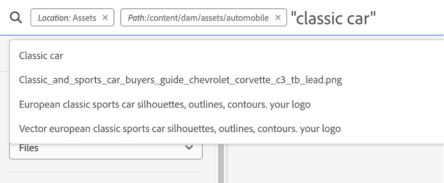
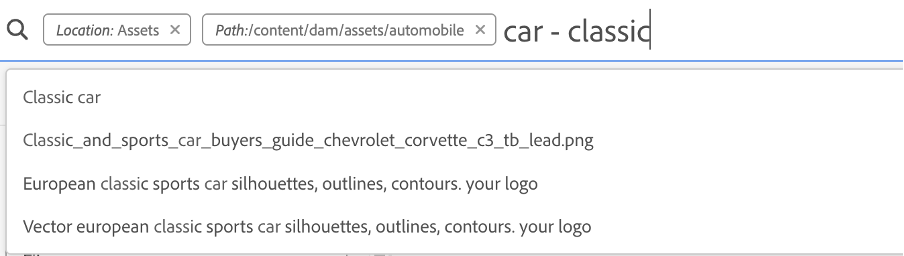
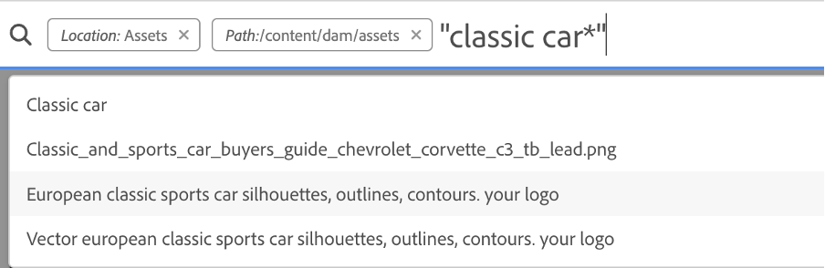

# AEM Search Best Practices

## Access Experience League Search {#access-experience-league-search}

Following are the basic steps to perform in Experience Manager before you begin your search:

* Go to Assets > Files in Experience Manager and click the search icon on the top bar. Alternatively, use a forward slash (/) to open the Omni Search field.  
* `Location:Assets` and `Path:/content/dam` are pre-selected to limit the search scope to your Experience Manager Assets repository. If you navigate to any other folder, `Path:/content/dam/<folder name>` displays in the Omni Search field to limit the search scope to the current folder.

## Simple Search {#simple-search}

**Scenario 1: Perform a basic search using a classic car as the search keyword.**

The keyword search is not case-sensitive and is a full-text search (across the popular metadata fields). If more than one keyword is used, **AND is the default operator between the keywords**.

The search results that match all search terms in metadata fields are displayed first, followed by the search results that match any of the search terms in the smart tags. The approximate order of display of search results is:

1. Matches of Classic Car in the various metadata fields.
2. Matches of Classic Car in smart tags.
3. Matches of Classic or of Car in smart tags.

Specify classic car as the search keyword and click Search. You can view the search suggestions in a drop-down list as you type the keyword. The search suggestions are based on the historical searches performed on your Experience Manager deployment. If you cannot view the appropriate assets in the dropdown menu, press the Enter key to view the list of results. The results are sorted by relevance, starting from the closest matches.

You can make the search more specific by adding your search keyword in double quotes (" "). The search criteria look like - "classic car". 

## Files and folders {#files-folders}

**Scenario 2: Search for all files using the classic car keyword within the Automobiles folder.**

Files and folders filter helps you narrow down your search. Use the Files, Filters, or Files and Folders options available in the drop-down list based on your requirements.

* Use the Files option when you need to search specifically for files at a specific path within the repository. You do not need to search for folders within the defined path.
* Use the Folders option when you need to limit your search to folders at a specific path.
* Use the Files and Folders option if you need to search through all assets available at the specified path within the repository.

To achieve the scenario:

1. Specify classic car as the search keyword and click Search. 
2. Click Filters and define the folder path for the Automobiles folder. For example, `/content/dam/automobile`
3. Select Files from the drop-down list.

## Operators {#operators}

**Scenario 3: Search for Classic Car or Car keywords using various operator combinations to narrow down your search.**

Experience Manager allows you to use a combination of various operators to enhance your search experience. The supported operators are:  

### AND operator {#and-operator}

AND operator is the default operator in Omni Search. For example, when you type "classic car" in the search bar, the results with "classic" and "car" keywords appear in your search results, by default.

### OR (^) operator {#or-operator}

When you want to be specific with the search results and want an option in the search results, you can use the OR operator. For example, the "classic or car" keyword provides search results with the either of keywords in their metadata.

### Asterisk (*) operator {#asterisk-operator}

Asterisk is a wildcard operator that is used to broaden your search by typing fewer characters. When you know the starting characters of the asset that you are searching for but do not know the rest, you can use the asterisk operator in your search. For example, the "*car" query returns all the assets with car available in their metadata. The results could be classic car, sports car, classic and sports car, and so on. Below are a few examples of using the asterisk operator in various ways: 

* `car*` returns assets with caring, car, carried, and so on. 
* `*car` returns assets with out car, sports car, and so on. 
* `*car*` returns all possible combinations 

### Question mark (?) operator {#question-mark-operator} 

The question mark symbol can be used as a conditional operator to ease your search in Experience Manager. 

* `car???` query does not match any asset
* `car????` query matches the word with four characters after car. For example, careful.
* `?car` query matches the word with one character before car. For example, scar.

### Hyphen (-) or exclude operator {#hyphen-operator}

When you want to retrieve excluding some keywords, you can use the hyphen operator. For example, the "car - classic" keyword provides search results of cars excluding classic.

## Filters {#filters}

Adobe Experience Manager provides various search filters which you can use to refine and segment your search using a scoped query. You can use search filters with or without typing a keyword. To open the filters panel, click **GlobalNav** icon and choose **Filters**.

You can choose one or multiple among various filters to refine your search in Adobe Experience Manager. 
<!--The following filters are available out of the box for all the users of Experience Manager:

* File Type Search Filters  
* File Size Search Filters 
* Date of Creation 
* Created by 
* Last Modified date 
* Last Modified by 
* Search by Language 
* Search by Status 
* Search based on Orientation 
* Search by Style 
* Search based on insights 
* Search by Adobe Stock 
* Color specific Asset search 
* Content fragment model 
 -->

**Scenario 4: Searching for PDF file type with keyword 'classic car' in it. The added asset is created or modified within a particular date range.**

To search for the above requirement, type classic car in the search bar. Then go to filters > File type > Documents > Word Processing > PDF to search for PDF files. Moreover, select the date range in created date and modified date filters. Then select status > publish > unpublished.

**Scenario 5: Search for an Asset named 'classic car' in Black color which has either meta description or a similar asset in Japanese language.**  
 
To perform a search on such a requirement, type 'classic car' in the search bar.  Navigate to the filters panel and expand the language search filter drop-down. Type "ja-jp", which represents the Japanese language. Expand the 'Asset Color' filter and select black color or add the hexadecimal code for the black color (#000000).

## Operators + Filters {#operators-filters}

**Scenario 6: Search for all documents in the Experience Manager repository with Classic Car in their metadata and their content.**

Adobe Experience Manager allows you to add multiple criteria to your search. You can use a combination of keywords, operator(s), and filter(s) to make narrow down your search results. 
 
To perform a search for scenario 6: 

1. Type the 'classic car' keyword in the search bar. 
2. Navigate to the filters panel and select Documents under File Type. 
3. Refine your search using the asterisk operator. Type "classic car*" to search all assets that contain the 'classic car' keyword. 
 

**Scenario 7: Search for all documents in the Experience Manager repository that include Car but exclude Classic in their metadata and their content.**

To perform a search for scenario 7: 

1. Type the 'car-classic' keyword in the search bar. 
2. Navigate to filters panel and select Documents under File Type. 

The priority order of search is based on the following: 
Priority 1: Metadata
Priority 2: Smart Tags

## Boosting relevance of keywords {#boosting-keywords}

You can improve the relevance of keywords for particular assets to help boost searches based on the keywords. In other words, the images for which you promote specific keywords appear at the top of the search results when you search based on these keywords.

1. From the Assets user interface, open the properties page for the asset. Click Advanced and click Add under Elevate for search keywords.
2. In the Search Promote box, specify a keyword for which you want to boost the search for the image and then click Add. You can specify multiple keywords in the same way.
3. Click Save & Close. The asset which you promoted for this keyword appears among the top search results.

## Notable things while performing search in Experience Manager {#notable-things}

* You can use **Find Similar** option to narrow down your search to the exact or similar match of the searched Asset. 
* Provide metadata information of the asset to prepare your asset searchable by the Omni Search algorithm. Ensure that the metadata information of the asset is updated.
* Use double quotes (" ") to make your search exact and to the point. 
* Cross-check the path that you are looking into. Choose the appropriate option among folder, file, or file and folder to run your search query at the appropriate location. 
* You can check the filters that you are applying to your search on the Omni Search bar. 
* In case you are not getting any results, cross-check the path you are looking into. Also, check the folder you are performing your search from. For example, if you are performing a search inside the 'Automobile folder' but the keyword that you are using is related to 'Apparels' then the search results are inappropriate.
* Check-in case you have added whitespace before the keyword that you are searching for. 
* Using a mix and match of keywords, operators, and filters can ease and level up your search experience. 

<!--
* Use stemming search approach while searching for the asset. It means using an exact keyword that you are looking for.
* Specify Smart tags to the asset properties to boost the ranking of the search results.
The newly added assets are not indexed.
--> 
