# AEM Assets Search Best Practices

|[Metadata Best Practices](/help/assets/metadata-best-practices.md)|[Content Hub](/help/assets/product-overview.md)|[Dynamic Media with OpenAPI capabilities](/help/assets/dynamic-media-open-apis-overview.md)|[AEM Assets developer documentation](https://developer.adobe.com/experience-cloud/experience-manager-apis/)|
| --------------------------- |---------|----|-----|

[!DNL Adobe Experience Manager Assets] provides robust asset search methods that help you achieve higher content velocity. Sometimes, finding the right asset can be arduous and time-consuming. Therefore, search assets capability in [!DNL Adobe Experience Manager Assets] is central to the usage of a digital asset management system - be it for further use by creatives, for robust management of assets by the business users and marketers, or for administration by DAM administrators.

This help document contains AEM search best practices with the help of various scenarios to assist AEM users to perform basic to advanced level search.

## Access Experience Manager Search {#access-experience-manager-search}

Following are the basic steps to perform in Experience Manager before you begin your search:

* In the **Admin view**, go to Assets > Files in Experience Manager and click the search icon on the top bar. Alternatively, use a forward slash (/) to open the Omni Search field.
In the **Assets view**, the search bar is visible on the top and can be accessed directly.
* `Location:Assets` and `Path:/content/dam` are pre-selected to limit the search scope to your Experience Manager Assets repository. If you navigate to any other folder, `Path:/content/dam/<folder name>` displays in the Omni Search field to limit the search scope to the current folder.

## Basic Search {#basic-search}

**Scenario 1: Perform a basic search using a `classic car` as the search keyword.**

The keyword search is not case-sensitive and is a full-text search across the metadata fields that are included in the Asset *full text search* index (configurable in the index definition). If more than one keyword is used, **AND is the default operator between the keywords, thus, it considers a search for 'classic car' to be 'classic AND car'**.

The search results that match all search terms in metadata fields are displayed first, followed by the search results that match any of the search terms in the smart tags. The approximate order of display of search results is:

1. Matches of `Classic Car` in the various metadata fields.
2. Matches of `Classic Car` in smart tags.
3. Matches of `Classic` or of `Car` in smart tags.

Specify `classic car` as the search keyword and click Search. You can view the search suggestions in a drop-down list as you type the keyword. The search suggestions are based on the contents of the search index on your Experience Manager deployment. If you cannot view the appropriate assets in the drop-down menu, press the Enter key to view the list of results. The results are sorted by relevance, starting from the closest matches.

<!--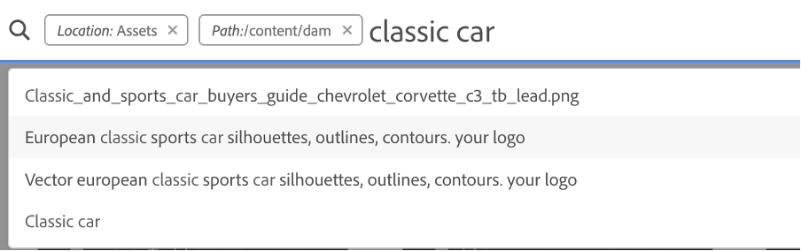-->

You can make the search more specific by adding your search keyword in double quotes (" "). This search only includes Assets which contain the specified terms together. The search criteria look like - `"classic car"`. Therefore, the search results with both terms `classic` and `car` are shown. 

<!--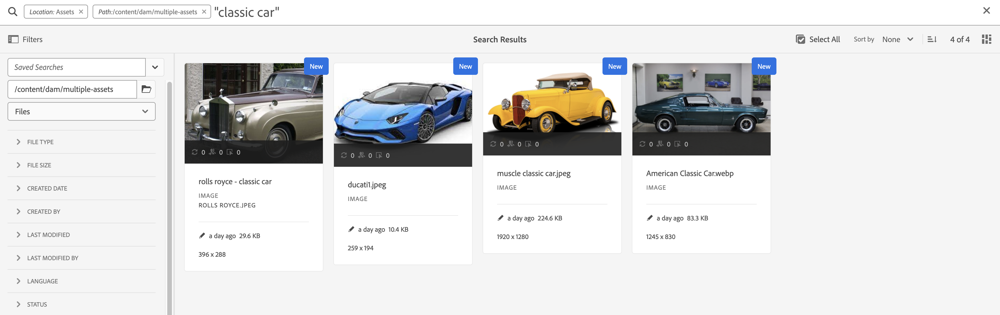-->

The search displays similar results if you are working in the **[!UICONTROL Assets view]** as well.

>[!VIDEO](https://video.tv.adobe.com/v/3425489)

## Files and folders {#files-folders}

**Scenario 2: Search for all files using the `classic car` keyword within the `automobile` folder.**

Files and folders filter helps you narrow down your search. Use Files, Folders, or Files and Folders options available in the drop-down list based on your requirement. The option to choose among Files, Folders, or Files and Folders is accessible in the **[!UICONTROL Admin view]** only. In the **[!UICONTROL Assets view]**, go to [!UICONTROL Path] and browse the folder where you want to perform a search.

* Use the **[!UICONTROL Files]** option when you need to search specifically for files at a specific path within the repository. You do not need to search for folders within the defined path.
* Use the **[!UICONTROL Folders]** option when you need to limit your search to folders at a specific path.
* Use the **[!UICONTROL Files and Folders]** option if you need to search through all assets available at the specified path within the repository.

To achieve this scenario, execute the steps below:

1. Specify `classic car` as the search keyword and click Search. 
2. Click Filters and define the folder path for the `automobile` folder. For example, `/content/dam/multiple-assets/automobile`
Select the folder from the path and navigate to the required folder if you want to search within the specific folder.
3. Select Files from the drop-down list to display all files with the keyword `classic car`. 

<!--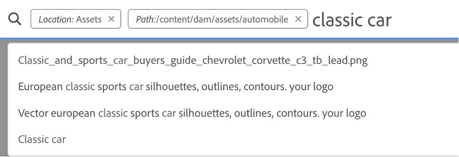-->

>[!VIDEO](https://video.tv.adobe.com/v/3425487)

## Operators {#operators}

**Scenario 3: Search for `Classic Car` or `Car` keywords using various operator combinations to narrow down your search.**

To execute the above scenario in **[!UICONTROL Admin view]**, you can use a combination of various operators to enhance your search experience. The supported operators are:  

### AND operator {#and-operator}

AND operator is the default operator between two keywords in Omni Search. For example, when you type `classic car` in the search bar, the results with `classic` and `car` keywords appear in your search results, by default.

### OR operator {#or-operator}

When you want to be specific with the search results and want an option in the search results, you can use the OR operator. For example, the `classic OR car` keyword provides search results with the either of keywords in their metadata.

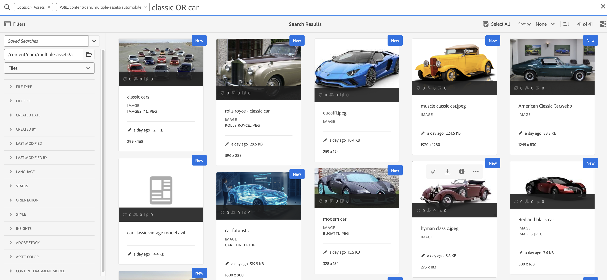

### NOT operator {#not-operator}

When you want to retrieve results excluding some keywords, you can use the NOT operator. The NOT operator uses the hyphen (-) symbol to direct AEM search what to exclude from the search results. For example, the `car - classic` search query that specifies metadata that contains `car` but excludes `classic`.

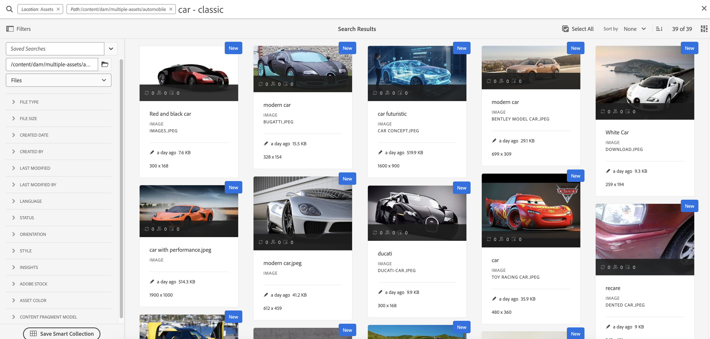

Similarly, you can search for all cars but not jeep. The query looks like: `car - jeep`. It displays all the assets with metadata `car` but excludes assets with metadata `jeep`.

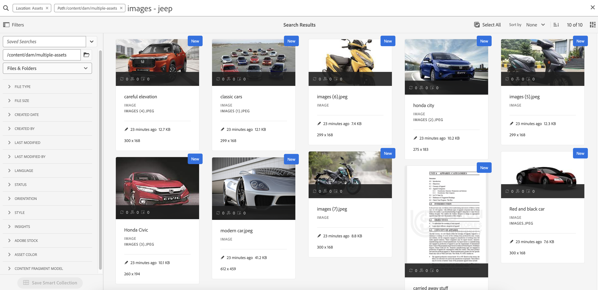

**[!UICONTROL Assets view]** does not support the usage of Operators.

## Wildcards {#wildcards}

Wildcards are used to replace one or more characters in the search. To execute the above scenario in **[!UICONTROL Admin view]**, you can use a combination of various wildcards to enhance your search experience. There are two wildcards used to perform the search - Question mark (?) and Asterisk (*). Question mark symbol is used to search a single character, whereas, asterisk symbol is used to search multiple characters. 

### Question mark (?) {#question-mark} 

The question mark symbol can be used as a conditional operator to ease your search in Experience Manager. 

* `car?` query matches the word with one character after car. For example, cart.
* `?car` query matches the word with one character before car. For example, scar.
* `car????` query matches the word with four characters after car. For example, carwash.

### Asterisk (*) {#asterisk}

Asterisk is a wildcard operator that is used to broaden your search by typing fewer characters. When you know the starting characters of the asset that you are searching for, but do not know the rest, you can use the asterisk operator in your search. For example, the `*car` query returns all the assets with postfix car available in their metadata. The results could be classic car, sports car, classic and sports car, and so on. Below are a few examples of using the asterisk operator in various ways: 

* `*car*` returns all possible combinations.
* `car*` returns assets with carwash, carrier, carriage, and so on. 
* `*car` returns assets with modern car, sports car, and so on. 

>[!VIDEO](https://video.tv.adobe.com/v/3425488)

**[!UICONTROL Assets view]** does not support the usage of Wildcards.

## Filters {#filters}

Adobe Experience Manager provides various search filters which you can use to refine and segment your search using a scoped query. When you are unsure about the title or meta description of an asset, you can use various search filters to make your search more relevant. You can use search filters with or without typing a keyword. To open the filters panel in the **[!UICONTROL Admin view]**, click the **GlobalNav** icon and select **[!UICONTROL Filters]**. Whereas, to open the filters panel in **[!UICONTROL Assets view]**, click [!UICONTROL Filters] beside the search bar.

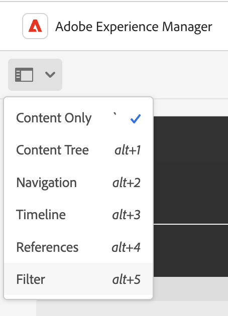

You can select single or multiple filters to refine your search in Adobe Experience Manager. 
<!--The following filters are available out of the box for all the users of Experience Manager:

* File Type Search Filters  
* File Size Search Filters 
* Date of Creation 
* Created by 
* Last Modified date 
* Last Modified by 
* Search by Language 
* Search by Status 
* Search based on Orientation 
* Search by Style 
* Search based on insights 
* Search by Adobe Stock 
* Color specific Asset search 
* Content fragment model 
 -->

<!--**Scenario 5: Search for an Asset named 'classic car' in Black color which has either meta description or a similar asset in Japanese language.**  
 
To perform a search on such a requirement, type 'classic car' in the search bar.  Navigate to the filters panel and expand the language search filter drop-down. Type "ja-jp", which represents the Japanese language. Expand the 'Asset Color' filter and select black color or add the hexadecimal code for the black color (#000000).

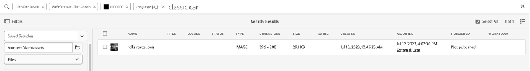
-->

**Scenario 4: Search for unpublished PDF file type documents with the `classic car` keyword in it.**

Execute the following steps in **[!UICONTROL Admin view]**:

1. Type `classic car` in the search bar. 
1. Go to Filters. Under [!UICONTROL File Type], expand [!UICONTROL Documents], further expand [!UICONTROL Word Processing].
1. Select [!UICONTROL PDF].
1. Go to [!UICONTROL Status] > [!UICONTROL Publish] > [!UICONTROL Unpublished].

<!--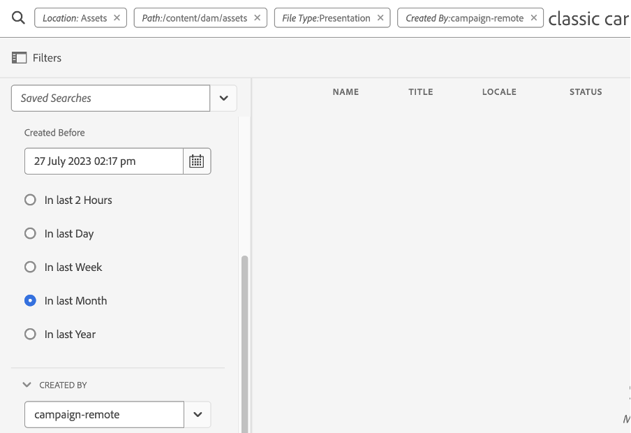-->

Execute the following steps in **[!UICONTROL Assets view]**:

1. Type `classic car` in the search bar. 
1. Go to Filters. Under [!UICONTROL MIME Type], select [!UICONTROL PDF].
1. Go to [!UICONTROL Asset Status], select [!UICONTROL All] to include all the published and unpublished assets.

**Scenario 5: Search for all images except PNG**

When you are unsure about the title or meta description of an asset, you can use various search filters to make your search more relevant. For example, to search assets in **[!UICONTROL Admin view]**, follow the steps below:

1. Go to search filters. 
1. Go to Filters. Under [!UICONTROL File Type], expand [!UICONTROL Images] and select [!UICONTROL Web enabled]
1. Deselect PNG.

<!--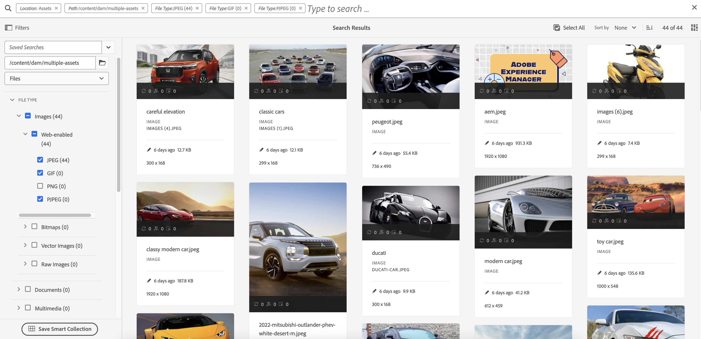-->

To search assets using the mentioned scenario in **[!UICONTROL Assets view]**, follow the steps below:

1. Go to search filters. 
1. Go to Filters. Under [!UICONTROL MIME Type], select all the given MIME types but Deselect PNG.

>[!VIDEO](https://video.tv.adobe.com/v/3425486)

## Advanced search {#advanced-search}

AEM search allows you to craft complex search queries with less effort. Following are the various examples to help you create complex search queries:

**Scenario 6: Search for all documents in the Experience Manager repository with `classic car` in their metadata. The content of the document must contain `classic car` keyword in it.**

Adobe Experience Manager allows you to add multiple criteria to your search. You can use a combination of keywords, operator(s), and filter(s) to narrow down your search results. 
 
To perform a search for scenario 6: 

1. Type the `classic car` keyword in the search bar. 
2. Navigate to the filters panel and select Documents under File Type. 
3. Refine your search using the asterisk wildcard. Type `"classic car"` to search all assets that contain the `classic car` keyword. 
 
<!--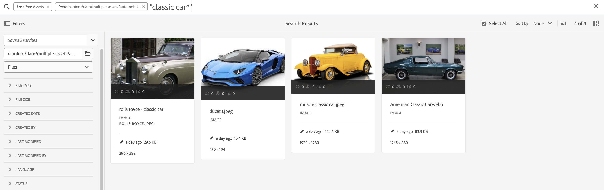-->

Scenario 6 is not possible to execute in **[!UICONTROL Assets view]** as it does not support the usage of Wildcards.

**Scenario 7: Search for all documents in the Experience Manager repository in which the content of the document must include `car` but exclude `classic`. The same condition applies on metadata of an asset.**

To perform a search for scenario 7: 

Type the `car - classic` keyword in the search bar. Navigate to the filters panel and select Documents under File Type. The priority order of search is based on the following: 
Priority 1: Metadata
Priority 2: Smart Tags

<!---->

Scenario 7 is not possible to execute in **[!UICONTROL Assets view]** as it does not support the usage of Wildcards.

<!--
**Scenario 9: Search for all images except PNG**

When you are unsure about the title or meta description of an asset, you can use various search filters to make your search more relevant. Follow the steps below:

1. Go to search filters. 
1. Under [!UICONTROL File Type], expand [!UICONTROL Images] and select [!UICONTROL Web enabled]
1. Deselect PNG.

**Method 1:** Go to search bar and type `images - PNG`. All the images appear excluding PNG.

**Method 2:** Go to search filters. Under [!UICONTROL File Type], expand [!UICONTROL Images] > select [!UICONTROL Web enabled] > deselect PNG.

-->

**Scenario 8: Search for metadata tags with metadata jeep**

You can capture a specific criteria using various search filters. Tag is a keyword that is assigned to an asset to make it identifiable among a large number of assets. For example, in this scenario, search for assets with *jeep* tags in it. To do this, type `tags:jeep` in the search bar. Only assets that meet this criteria are listed in the search results.

<!--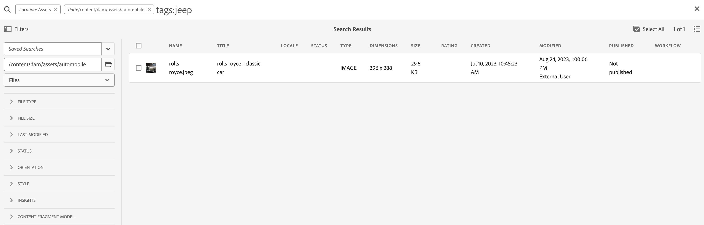-->

The search displays similar results if you are working in the **[!UICONTROL Assets view]** as well.

>[!VIDEO](https://video.tv.adobe.com/v/3425490)  

**Scenario 9: Find similar match for red color car**

While performing your search on AEM, you can filter your results by showing similar assets to the selected ones. You can use the **Find Similar** option to narrow down your search to the exact or similar match of the searched Asset. This helps finding assets which have similar smart tags to the selected asset. For example, when you want to search for alike assets, execute the following steps:

1. Search the asset as per your requirement.
1. Hover over the asset > click ellipsis > select [!UICONTROL Find Similar].
or
Select the asset > navigate to the ellipsis at the top right > select [!UICONTROL Find Similar].

    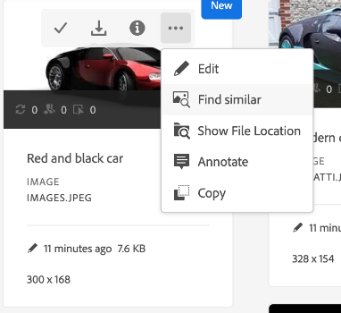

1. Notice the search bar. The thumbnail of the selected asset appears on the search bar indicating your search requirement. As a result, it returns assets with similar smart tags.

Execute the following steps in **[!UICONTROL Assets view]**:

1. Search the asset as per your requirement.
1. Select the image > navigate to [!UICONTROL Find Similar Image] option at navbar on the top.
It takes you to the collection of assets with similar color and metadata.

## Custom search facets {#custom-search-facets}

Search facets in Adobe Experience Manager let you search for assets in multiple ways rather than in a single, pre-determined, or taxonomic order. You can customize search facets and add predicates as per your requirement. Read [Search Facets](https://experienceleague.adobe.com/docs/experience-manager-cloud-service/content/assets/admin/search-facets.html?lang=en#) for the step-by-step guide about adding a custom predicate.

<!--**Scenario 10: Search assets based on Sku ID**
to be added later
-->

**Scenario 10: Search specific assets based on their last modified or expiry date**

Date constraints allow you to narrow down your custom search to a particular period, for example, using the time period search filters. To search for the above requirement, type `classic car` in the search bar. Select the date range in the [!UICONTROL Created Date] and [!UICONTROL Last Modified] date filters.

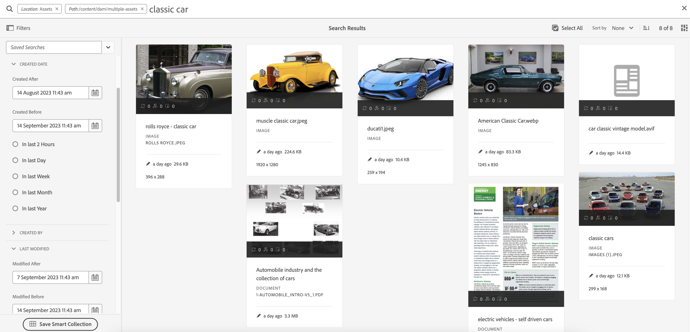

The search displays similar results if you are working in the [!UICONTROL Assets view] as well.

## Boosting relevance of keywords {#boosting-keywords}

You can improve the relevance of keywords for particular assets to help boost searches based on the keywords. In other words, the images for which you promote specific keywords appear at the top of the search results when you search based on these keywords.

1. From the Assets user interface, open the properties page for the asset. Click [!UICONTROL Advanced] and click [!UICONTROL Add] under [!UICONTROL Elevate for search keywords].
2. In the Search Promote box, specify a keyword for which you want to boost the search for the image and then click [!UICONTROL Add]. You can specify multiple keywords in the same way.
3. Click [!UICONTROL Save & Close]. The asset which you promoted for this keyword appears among the top search results.

## Notable things while performing a search in Experience Manager {#notable-things}

* Provide metadata information of the asset to prepare your asset searchable by the Omni Search algorithm. Ensure that the metadata information of the asset is updated.
* Use double quotes (" ") to make your search exact and to the point. 
* Cross-check the path that you are looking into. Select the appropriate option among folder, file, or file and folder to run your search query at the appropriate location. 
* You can check the filters that you are applying to your search on the Omni Search bar. 
* In case you are not getting any results, cross-check the path you are looking into. Also, check the folder that you are performing your search from. For example, if you are performing a search inside the 'Automobile folder' but the keyword that you are using is related to 'Apparels' then the search results are inappropriate.
* Check-in case you have added whitespace before the keyword that you are searching for. 
* Using a mix and match of keywords, operators, and filters can ease and level up your search experience. 

<!--
* Use stemming search approach while searching for the asset. It means using an exact keyword that you are looking for.
* Specify Smart tags to the asset properties to boost the ranking of the search results.
The newly added assets are not indexed.
--> 

## Differences between [!UICONTROL Admin view] and [!UICONTROL Assets view] Search {#differences-asset-and-admin-view}

<table>
    <tr>
        <th> Parameters </th>
        <th> Admin view </th>
        <th> Assets View </th>
    </tr>
    <tr>
        <td> Custom facets </td>
        <td> You can add <a href="https://experienceleague.adobe.com/docs/experience-manager-cloud-service/content/assets/admin/search-facets.html?lang=en">custom search facets as per the requirement.</td>
        <td> The custom facets are partially supported in the Assets view. The supported facets are:
            <ul>
            <li> Predicted tags
            <li> Name
            <li> Predicted tags confidence
            <li> Asset size
            <li> Title
            </ul>
        </td>
    </tr>
    <tr>
        <td> Operators </td>
        <td> Supports AND, OR, and NOT </td>
        <td> Not supported </td>
    </tr>
    <tr>
        <td> Wildcards </td>
        <td> Supports question mark (?) and asterisk (*).</td>
        <td> Not supported </td>
    </tr>
    <tr>
        <td> Boosting search results </td>
        <td> Supported </td>
        <td> Not supported </td>
    </tr>
     <tr>
        <td> Clear all filters at once </td>
        <td> Not supported </td>
        <td> Supported</td>
    </tr>
     <tr>
        <td> Files/Folders/Files & Folders </td>
        <td> Supported </td>
        <td> An option to select a Folder is available under "File Type" </td>
    </tr>
     <tr>
        <td> Asset Status </td>
        <td> 
            Supported options are:
            <ul>
            <li> Publish
            <li> Published date
            <li> Last published by
            <li> Approval 
            <li> Checkout
            <li> Expiry
            <li> Dynamic Media
            </ul>
        </td>
        <td>
        Supported options are:
            <ul>
            <li> All
            <li> Approved
            <li> Rejected
            <li> No Status
            </ul> 
        </td>
    </tr>
     <tr>
        <td> File type </td>
        <td>
        Supported options are:
            <ul>
            <li> Images
            <li> Documents
            <li> Multimedia
            <li> Archives 
            </ul>
            These have further hierarchical options.
        </td>
        <td>
        Supported options are:
            <ul>
            <li> Images
            <li> Documents
            <li> Video
            <li> Folder 
            </ul> 
        More options are listed under MIME type.
        </td>
    </tr>
     <tr>
        <td> File size </td>
        <td>
        Supported options are:
            <ul>
            <li> From - To
            <li> Size (Bytes, KB, MB, GB)
            </ul> 
        </td>
        <td> Not supported </td>
    </tr>
     <tr>
        <td> Other filters </td>
        <td>
            <ul>
            <li> Language
            <li> Status
            <li> Orientation
            <li> Style 
            <li> Insights
            <li> Stock
            <li> Asset Color
            <li> Content fragment model
            </ul> 
        </td>
        <td> Not supported </td>
    </tr>
</table>

>[!MORELIKETHIS]
>
>* [Search assets](https://experienceleague.adobe.com/docs/experience-manager-cloud-service/content/assets/manage/search-assets.html?lang=en)
>* [Search facets](https://experienceleague.adobe.com/docs/experience-manager-cloud-service/content/assets/admin/search-facets.html?lang=en)
