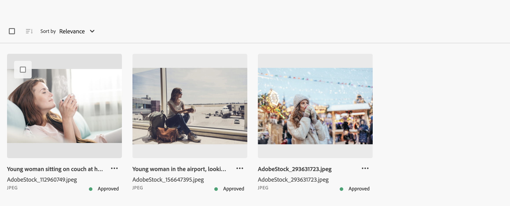
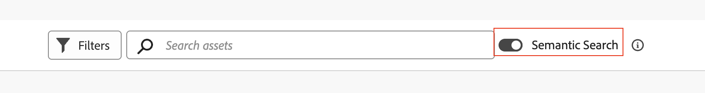

# Semantic Search in Assets view {#semantic-search-assets-view}

Semantic Search is an advanced search capability that understands the meaning and intent behind a user's query rather than relying on exact keyword matches. It uses artificial intelligence (AI), natural language processing (NLP), and machine learning to deliver more accurate and context-aware results.

Unlike traditional keyword-based search, which looks for exact terms, Semantic Search interprets relationships between words, concepts, and user intent. This ensures that users find what they are looking for—even if their query is phrased differently, contains typos, or is in another language.

Some if its key benefits include:

* **Multilingual support**: Search across multiple languages without requiring exact translations. Users can find relevant content regardless of their query language.

* **Handles misspellings**: Automatically corrects or interprets typos and spelling errors, ensuring accurate results even with imperfect input.

* **Understands synonyms**: Delivers results for related terms and phrases, so users do not need to guess the right keyword.

* **Context-Aware search**: Recognizes the intent behind a query, not just the words.

* **Visual analysis**: Goes beyond text to analyze images, which enables Experience Manager Assets to deliver search results based on what is displayed visually in the image irrespective of the asset metadata.

* **Search based on text-based prompts**: Experience Manager Assets applies filters to content and displays appropriate results automatically based on simple text-based prompts.

### Examples {#examples-semantic-search}

**Example Prompt**: *Woman drinking coffee*

The traditional keyword-based search looks for exact matches of asset metadata, such as Woman, Coffee, and so on, and returns assets that include these keywords.

However, Semantic Search looks for similar words such as `Girl`, `Lady` in case of `Woman` and coffee options, such as `Cappuccino` and `Latte` in case of `Coffee`.

Similarly, you can specify this prompt in Spanish or misspell `Woman` as `Wman` and still get the same results.

Semantic Search also performs a visual analysis of the image and in this case also returns images where people with long hair are drinking something hot.

**Example Prompt**: *Images at least 200px tall and 100px wide with beach and clear sky*

Experience Manager Assets uses Sematic Search to apply the following filters automatically based on this search prompt to return appropriate results:

* File type = Images

* Image Min Width = 100

* Image Min Height = 200

* Search string = Beach and Clear Sky

### How to enable Semantic Search? {#enable-semantic-search}

Enable the **[!UICONTROL Semantic Search]** toggle adjacent to the Search bar available on all pages within Experience Manager Assets.

