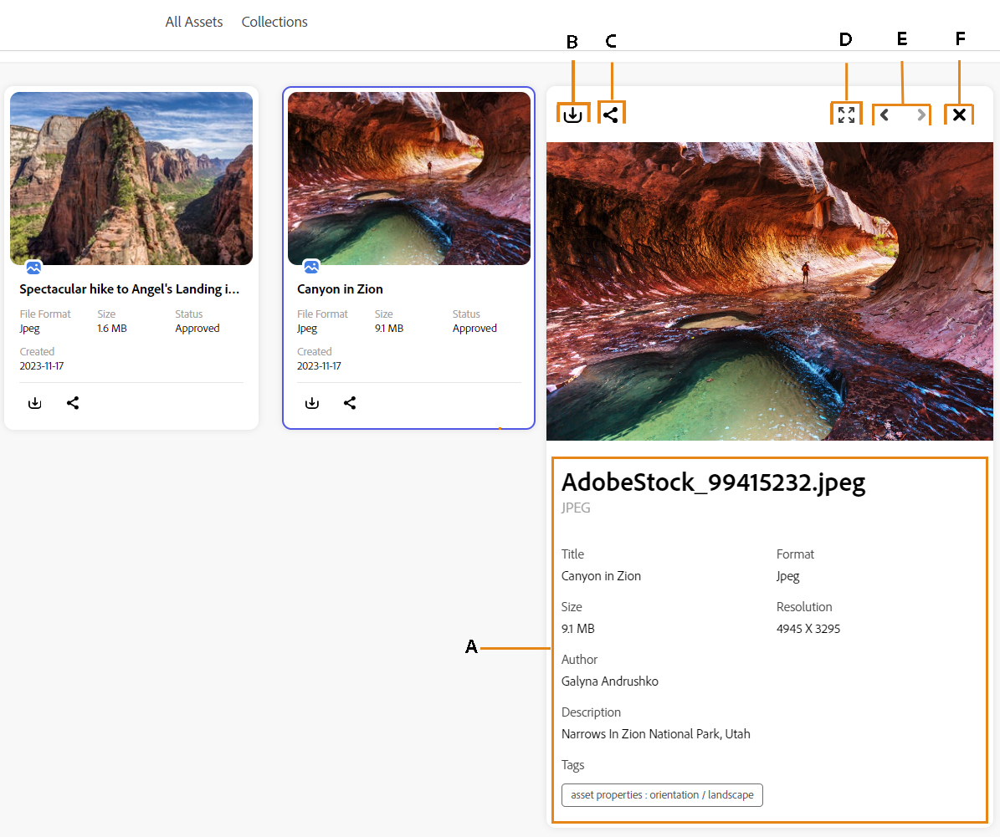
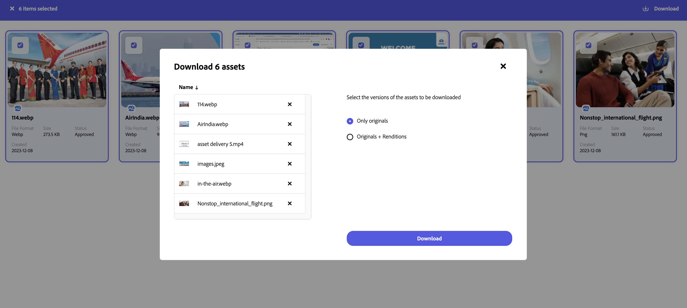

# Share assets as a link in content module of GenStudio {#search-assets-as-a-link}

Sharing assets through a link is a convenient way of making the resources available to the [!DNL the content module of Adobe GenStudio] users. The functionality allows authorized users to access and download the assets shared with them. When downloading assets from a shared link, [!DNL the content module of Adobe GenStudio] uses an asynchronous service that offers faster and uninterrupted download.

## Share a single asset {#share-a-single-asset}

You can share a single asset by executing the following steps: 

1. Select an asset and click the  icon to share an asset. 

    

1. Use the **[!UICONTROL Expiration]** field to specify an expiration date for the link. Select one of the available options, such as, 24 hours, 1 week, 30 days, 90 days, 1 year or specify a custom date.  

1. Click **[!UICONTROL Copy share link]**. You can then share the copied link with the recipient.
 
## Share multiple assets {#share-multiple-assets}

[!DNL The content module of Adobe GenStudio] allows you to share multiple assets via a shared link. Execute the steps below: 

1. Select assets that you need to share with the authorized recipient. You can select multiple assets one by one or click **[!UICONTROL Select All]** to select all available assets at once. The **[!UICONTROL Select All]** option displays only when you select at least one asset.

1. Click the  icon. 

    

1. In preview section, you can also delete assets as per your requirements. Use the **[!UICONTROL Expiration]** field to specify an expiration date for the link. Select one of the available options, such as, 24 hours, 1 week, 30 days, 90 days, 1 year or specify a custom date.  

1. Click **[!UICONTROL Copy share link]**. You can then share the copied link with the recipient. 

## View and manage shared links {#view-and-manage-shared-links}

You can select one or multiple assets and preview the selected assets before sharing them to the authorized users. 

### Preview assets {#preview-assets}

You can preview to see how a digital asset that you are going to share looks when it is viewed by a link recipient. Click the asset that you need to preview. The [!DNL content module of Adobe GenStudio] displays the detailed view for the asset. 

* **A**: Details and metadata of the asset 
* **B**: Download the asset 
* **C**: Share the asset as a link 
* **D**: View the asset in the full screen 
* **E**: View the previous or next asset 
* **F**: Close preview screen  

### Access the shared assets {#access-shared-assets}

After sharing the link for assets, the authorized recipients can click the link to preview or download the shared assets in a web browser. 

Click the shared link, and then click the asset to [preview](#preview-assets) it. You can hover the mouse over the shared asset to select and then download it.  

You can also select multiple assets and click **[!UICONTROL Download]**. <!--You can either download original assets or Original+Renditions of an asset.--> [!DNL The content module of Adobe GenStudio] downloads each asset one-by-one to the local file system.

<!---->

