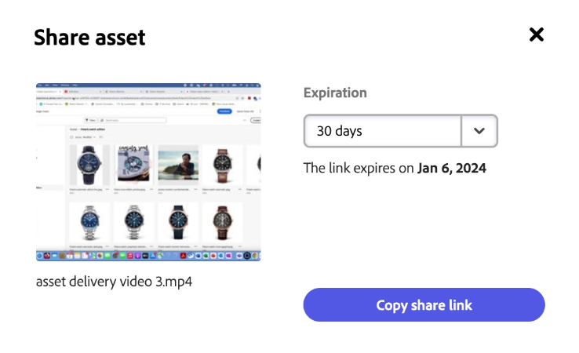
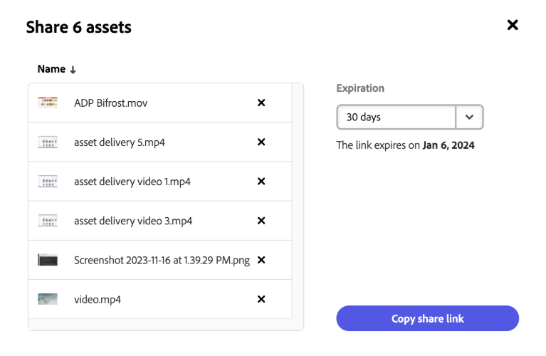
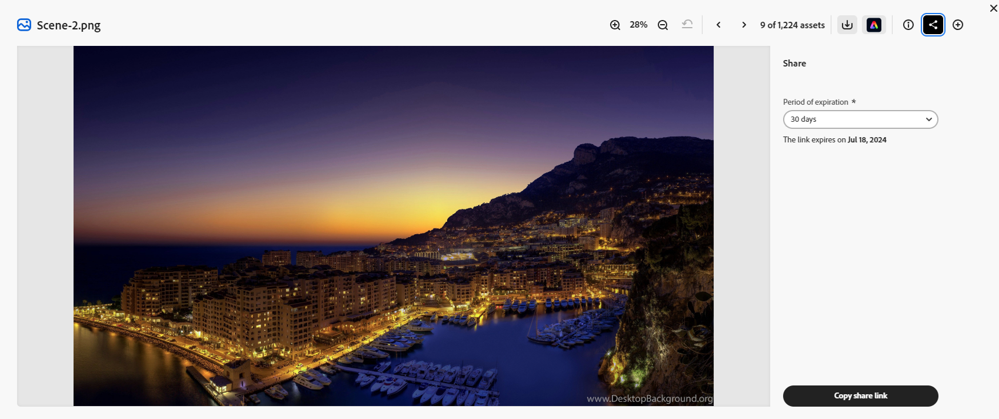
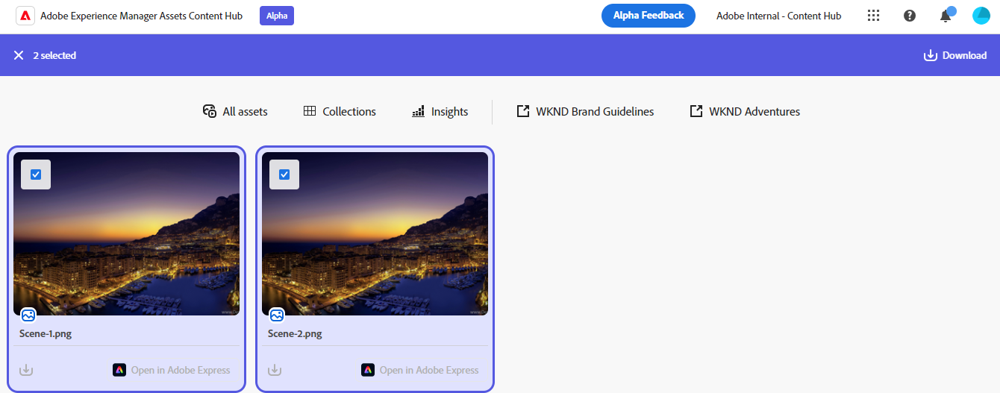

# Share assets in Content Hub {#search-assets-as-a-link}

| [Search Best Practices](/help/assets/search-best-practices.md) |[Metadata Best Practices](/help/assets/metadata-best-practices.md)|[Content Hub](/help/assets/product-overview.md)|[Dynamic Media with OpenAPI capabilities](/help/assets/dynamic-media-open-apis-overview.md)|[AEM Assets developer documentation](https://developer.adobe.com/experience-cloud/experience-manager-apis/)|
| ------------- | --------------------------- |---------|----|-----|

>[!AVAILABILITY]
>
>Content Hub guide is now available in PDF format. Download the entire guide and use Adobe Acrobat AI Assistant to answer your queries. 
>
>[!BADGE Content Hub Guide PDF]{type=Informative url="https://helpx.adobe.com/content/dam/help/en/experience-manager/aem-assets/content-hub.pdf"}

Sharing assets through a link is a convenient way of making the resources available to [!DNL the Content Hub] users. The functionality allows authorized users to access and download the assets shared with them. When downloading assets from a shared link, [!DNL the Content Hub] uses an asynchronous service that offers faster and uninterrupted download.

## Prerequisites {#prerequisites}

[Content Hub users](deploy-content-hub.md#onboard-content-hub-users) can perform actions mentioned in this article.

## Share a single asset {#share-a-single-asset}

You can share a single asset by executing the following steps: 

1. Select an asset and click the  icon to share an asset. 

    

1. Use the **[!UICONTROL Expiration]** field to specify an expiration date for the link. Select one of the available options, such as, 24 hours, 1 week, 30 days, 90 days, 1 year or specify a custom date.  

1. Click **[!UICONTROL Copy share link]**. You can then share the copied link with the recipient.
 
## Share multiple assets {#share-multiple-assets}

[!DNL The Content Hub] allows you to share multiple assets via a shared link. Execute the following steps: 

1. Select assets that you need to share with the authorized recipient. You can select multiple assets one by one or click **[!UICONTROL Select All]** to select all available assets at once. The **[!UICONTROL Select All]** option displays only when you select at least one asset.

1. Click the  icon. 

    

1. In preview section, you can also delete assets as per your requirements. Use the **[!UICONTROL Expiration]** field to specify an expiration date for the link. Select one of the available options, such as, 24 hours, 1 week, 30 days, 90 days, 1 year or specify a custom date.  

1. Click **[!UICONTROL Copy share link]**. You can then share the copied link with the recipient. 

## Preview and share assets {#preview-assets}

You can preview to see how a digital asset that you are going to share looks before sharing with a link recipient. Click the asset that you need to preview. The [!DNL Content Hub] displays the [detailed view for the asset](asset-properties-content-hub.md). 

Click the  icon to share an asset. Use the **[!UICONTROL Expiration]** field to specify an expiration date for the link. Select one of the available options, such as, 24 hours, 1 week, 30 days, 90 days, 1 year or specify a custom date. Click **[!UICONTROL Copy share link]**. You can then share the copied link with the recipient. 

## Access the shared assets {#access-shared-assets}

After sharing the link for assets, the authorized recipients can click the link to preview or download the shared assets in a web browser. 

Click the shared link and click the download icon available on the asset card to download an asset.  You can also select multiple assets and click **[!UICONTROL Download]**. <!--You can either download original assets or Original+Renditions of an asset.--> [!DNL The Content Hub] downloads each asset one-by-one to the local file system.

