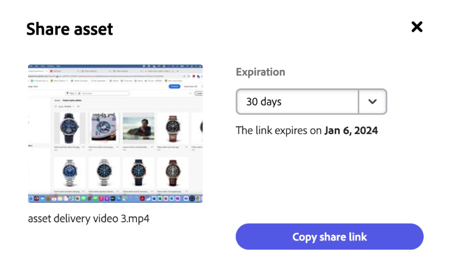
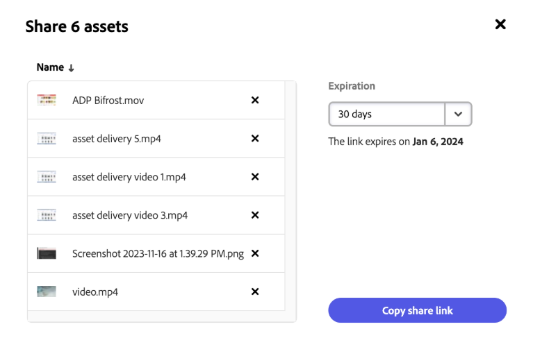
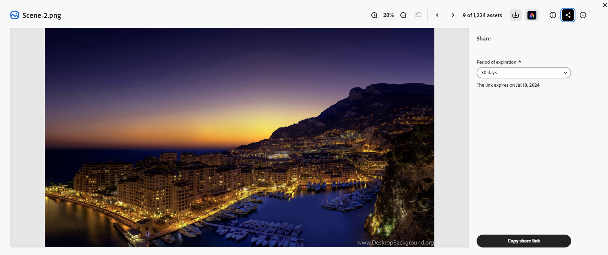
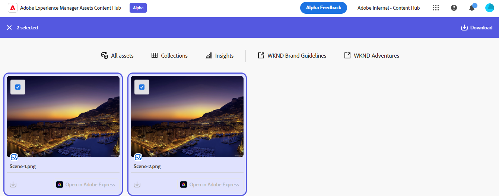

# Share assets in Content Hub {#search-assets-as-a-link}

<table>
    <tr>
        <td>
            <i>New</i> <a href="/help/assets/dynamic-media/dm-prime-ultimate.md"><b>Dynamic Media Prime and Ultimate</b></a>
        </td>
        <td>
            <i>New</i> <a href="/help/assets/assets-ultimate-overview.md"><b>AEM Assets Ultimate</b></a>
        </td>
        <td>
            <i>New</i> <a href="/help/assets/integrate-aem-assets-edge-delivery-services.md"><b>AEM Assets integration with Edge Delivery Services</b></a>
        </td>
        <td>
            <i>New</i> <a href="/help/assets/aem-assets-view-ui-extensibility.md"><b>UI Extensibility</b></a>
        </td>
          <td>
            <i>New</i> <a href="/help/assets/dynamic-media/enable-dynamic-media-prime-and-ultimate.md"><b>Enable Dynamic Media Prime and Ultimate</b></a>
        </td>
    </tr>
    <tr>
        <td>
            <a href="/help/assets/search-best-practices.md"><b>Search Best Practices</b></a>
        </td>
        <td>
            <a href="/help/assets/metadata-best-practices.md"><b>Metadata Best Practices</b></a>
        </td>
        <td>
            <a href="/help/assets/product-overview.md"><b>Content Hub</b></a>
        </td>
        <td>
            <a href="/help/assets/dynamic-media-open-apis-overview.md"><b>Dynamic Media with OpenAPI capabilities</b></a>
        </td>
        <td>
            <a href="https://developer.adobe.com/experience-cloud/experience-manager-apis/"><b>AEM Assets developer documentation</b></a>
        </td>
    </tr>
</table>

>[!AVAILABILITY]
>
>Content Hub guide is now available in PDF format. Download the entire guide and use Adobe Acrobat AI Assistant to answer your queries. 
>
>[!BADGE Content Hub Guide PDF]{type=Informative url="https://helpx.adobe.com/content/dam/help/en/experience-manager/aem-assets/content-hub.pdf"}

Create a shareable link to selected assets to quickly share them with others. As an authorized [!DNL Content Hub] user, select the assets, generate a shareable link, and send it to other authorized or public users. Authorized users must sign in to [!DNL Content Hub] to access and download the shared assets. Public users, as guests, can access and download the shared assets without signing in. [!DNL Content Hub] uses an asynchronous service to download assets from a shared link, ensuring faster and uninterrupted downloads.

## Prerequisites {#prerequisites}

You must be an authorized [Content Hub user](deploy-content-hub.md#onboard-content-hub-users) to share assets with other authorized or public users.

## Share assets {#share-assets}

Execute the following steps to share a single asset or multiple assets with authorized or public users.
1. Navigate to the [!DNL Content Hub] homepage and select the assets to share. You can also select assets available in  **[!UICONTROL Collections]**.
1. Select 

1. Navigate to the [!DNL Content Hub] homepage, select a single asset file or multiple asset files and click  **[!UICONTROL Share]**. A **[!UICONTROL Share assets]** dialog box displaying a sigle selected asset or a list of multiple selected asset files displays. You can also select and share asset files available in  **[!UICONTROL Collections]**.
1. **Optional:** View a single asset or review the list of selected assets available in the dialog box and click  to unselct an asset from the list.

See the following sections to share a single asset or multiple assets with [authorized users](#share-assets-with-authorized-users) and [public users](#share-assets-with-public-users). 

### Share assets with authorized users {#share-assets-with-authorized-users}

On the **[!UICONTROL Share assets]** dialog box execute the following steps to share a single selected asset or multiple selected assets with authorized [!DNL Content Hub] users:

1. Click the dropdown in the **[!UICONTROL Period of expiration]** field and select a duration after which the recipient cannot access the selected assets. 
1. Select **[!UICONTROL Generate share link]** to generate a link and copy it to your clipboard. 

Share this link with your authorized users. See [Preview the shared assets](#Preview-the-shared-assets) to know about the page previewing the shared assets.

### Share assets with public users {#share-assets-with-public-users}

On the **[!UICONTROL Share assets]** dialog box execute the following steps to share a single selected asset or multiple selected assets with public users:
1. Enable the **[!UICONTROL Public Link]** toggle, click **[!UICONTROL Period of expiration]** and select a duration after which the recipient cannot access the selected assets. 
1. Click **[!UICONTROL Generate public share link]** to create a sharable link copy it to your clipboard.

Share this link with public users. See [Preview the shared assets](#Preview-the-shared-assets) to see how the page previewing the shared assets looks like.

## Share an asset from its preview page

Execuet the following steps to share an asset while previewing it:

1. Navigate to the [!DNL Content Hub] homepage and click the asset thumbnail. The asset preview displays with menu options available on the right pane.
1. Select , the **[!UICONTROL Share]** panel displays.
1. Select a duration after which the recipient cannot access the selected assets and click **[!UICONTROL Generate share link]** to share the link with the authorized users or enable the **[!UICONTROL Public Link]** toggle, select a **[!UICONTROL Period of expiration]** and click **[!UICONTROL Generate public share link]** to create a sharable link to share with the public user.

You can also select assets available in  **[!UICONTROL Collections]**. 

## Preview the shared assets {#Preview-the-shared-assets}

Click the link to preview the shared assets. A page displaying the selected assets opens. Select the assets and click  **[!UICONTROL Download]** to download them. Double click an asset to see its details.

## Share a single asset {#share-a-single-asset}

You can share a single asset by executing the following steps: 

1. Select an asset and click the  icon to share an asset. 

    

1. Use the **[!UICONTROL Expiration]** field to specify an expiration date for the link. Select one of the available options, such as, 24 hours, 1 week, 30 days, 90 days, 1 year or specify a custom date.  

1. Click **[!UICONTROL Copy share link]**. You can then share the copied link with the recipient.
 
## Share multiple assets {#share-multiple-assets}

[!DNL The Content Hub] allows you to share multiple assets via a shared link. Execute the following steps: 

1. Select assets that you need to share with the authorized recipient. You can select multiple assets one by one or click **[!UICONTROL Select All]** to select all available assets at once. The **[!UICONTROL Select All]** option displays only when you select at least one asset.

1. Click the  icon. 

    

1. In the preview section, you can also delete assets as per your requirements. Use the **[!UICONTROL Expiration]** field to specify an expiration date for the link. Select one of the available options, such as, 24 hours, 1 week, 30 days, 90 days, 1 year or specify a custom date.  

1. Click **[!UICONTROL Copy share link]**. You can then share the copied link with the recipient. 

## Preview and share assets {#preview-assets}

You can preview to see how a digital asset that you are going to share looks before sharing with a link recipient. Click the asset that you need to preview. The [!DNL Content Hub] displays the [detailed view for the asset](asset-properties-content-hub.md). 

Click the  icon to share an asset. Use the **[!UICONTROL Expiration]** field to specify an expiration date for the link. Select one of the available options, such as, 24 hours, 1 week, 30 days, 90 days, 1 year or specify a custom date. Click **[!UICONTROL Copy share link]**. You can then share the copied link with the recipient. 

## Access the shared assets {#access-shared-assets}

After sharing the link for assets, the authorized recipients can click the link to preview or download the shared assets in a web browser. 

Click the shared link and click the download icon available on the asset card to download an asset.  You can also select multiple assets and click **[!UICONTROL Download]**. <!--You can either download original assets or Original+Renditions of an asset.--> [!DNL The Content Hub] downloads each asset one-by-one to the local file system.

## Share assets with non [!DNL Content Hub] users {#share-assets-with-non-Content-Hub-users}

[Content Hub users](deploy-content-hub.md#onboard-content-hub-users) can share asset files with non [!DNL Content Hub] users. Execute the following steps to share the asset files:

1. On the [!DNL Content Hub] homepage, select the asset files and click  **[!UICONTROL Share]**. A **[!UICONTROL Share assets]** dialog box displaying the selected assets displays. You can also share assets available in  **[!UICONTROL Collections]**.

1. Enable the **[!UICONTROL Public Link]** toggle, click **[!UICONTROL Period of expiration]** and select a duration after which the recipient cannot access the selected assets. 

1. Click **[!UICONTROL Generate public share link]** to create a sharable link to the selected assets.

1. Copy the link and share with the user. 

Click the link to preview the shared assets. A page displaying the selected assets opens. Select the assets and click  **[!UICONTROL Download]** to download them. Double click an asset to see its details.