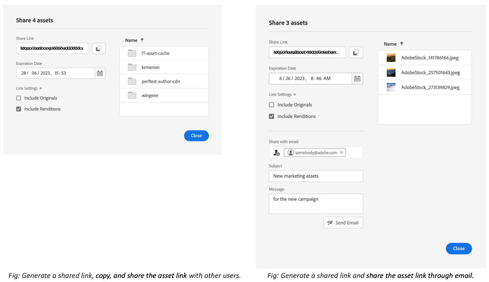
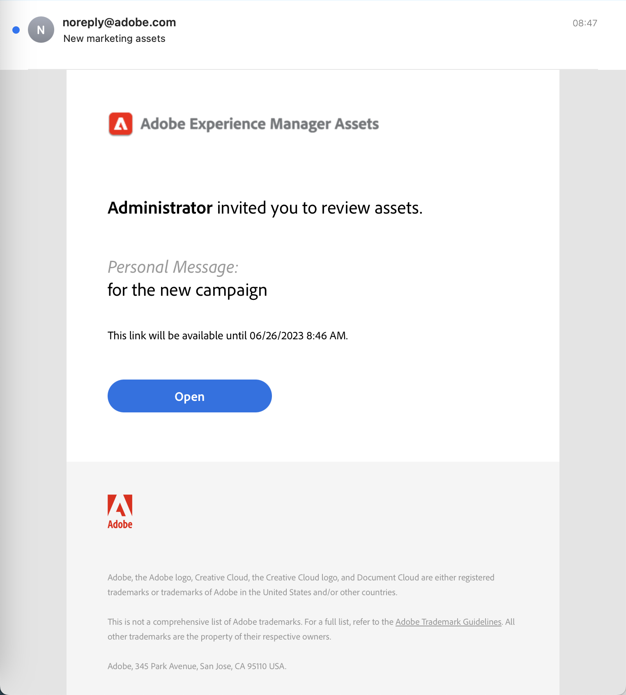
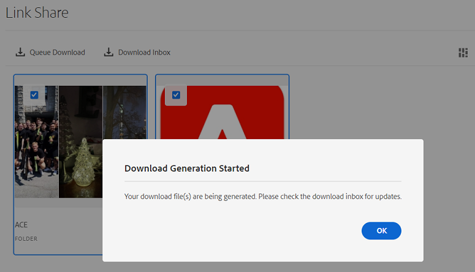
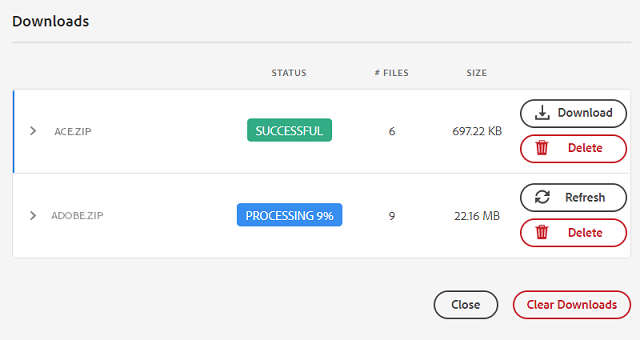

# Share and distribute assets managed in [!DNL Experience Manager] {#share-assets-from-aem}

| Version | Article link |
| -------- | ---------------------------- |
| AEM 6.5  |    [Click here](https://experienceleague.adobe.com/docs/experience-manager-65/assets/administer/link-sharing.html?lang=en)                  |
| AEM as a [!DNL Cloud Service]     | This article         |

[!DNL Adobe Experience Manager] (AEM) [!DNL Assets] enables you to share **assets, folders, and collections** with members of your organization and with external entities, including partners and vendors. This flexible sharing capability supports collaborative content workflows, allowing internal teams and outside stakeholders to access approved digital assets without duplicating or losing control of the source files.

## Methods to share assets from [!DNL Experience Manager Assets] as a [!DNL Cloud Service]

Use any of the following methods to share assets from [!DNL Experience Manager Assets] as a [!DNL Cloud Service], choosing the option that best matches your recipients and workflow:

* **[Share as a link](#sharelink)** — Generate a shareable link to assets, folders, or collections, which is well suited for quickly granting access to specific recipients without requiring them to log in to the authoring environment.
* **[Download assets](/help/assets/download-assets-from-aem.md) and share separately** — Download the assets locally and distribute them through your preferred channel. This method is useful when recipients need offline copies or when files must be delivered outside the [!DNL Experience Manager] environment.
* Share using the **[Experience Manager [!DNL desktop app]](https://experienceleague.adobe.com/docs/experience-manager-desktop-app/using/introduction.html)** — Connect the [!DNL desktop app] to browse, open, and work with [!DNL Experience Manager] assets directly from your local file system, streamlining collaboration for users who work with desktop applications.
* Share using **[Adobe [!DNL Asset Link]](https://www.adobe.com/creativecloud/business/enterprise/adobe-asset-link.html)** — Access and share [!DNL Experience Manager] assets from within Adobe [!DNL Creative Cloud] applications, enabling creative professionals to work with approved, centrally managed assets without leaving their design tools.
* Share using **[Brand Portal](https://experienceleague.adobe.com/docs/experience-manager-brand-portal/using/introduction/brand-portal.html)** — Distribute approved, brand-compliant assets to internal and external users through a dedicated portal, which is ideal for making curated content available to a broad audience such as partners, vendors, and distributed teams.

Selecting the right method depends on whether recipients need direct system access, offline copies, integration with their creative tools, or a governed portal for approved brand assets.

## Prerequisites {#prerequisites}

Administrator privileges are **required** to [configure settings for sharing assets as a Link](#config-link-share-settings). Users must have **Administrator privileges** before they can access and modify these link-sharing configurations, because these settings govern how assets are shared externally and are therefore restricted to administrator-level roles.

Before you begin, confirm the following:

- **Administrator privileges** are assigned to your account.

Without **Administrator privileges**, the option to [configure settings for sharing assets as a Link](#config-link-share-settings) is unavailable, and the link-sharing controls cannot be modified. As a result, requesting or being granted an administrator role is the essential first step, ensuring that only authorized users can adjust how assets are shared as links.

## Configure link share settings {#config-link-share-settings}

[!DNL Experience Manager Assets] allows you to configure the default link share settings.

1. Click the [!DNL Experience Manager] logo, and then navigate to **[!UICONTROL Tools]** &gt; **[!UICONTROL Assets]** &gt; **[!UICONTROL Assets Configuration]** &gt; **[!UICONTROL Link Share]**.
1. Initial Settings:

   * **Include Originals:** 

      * Select `Select Include Originals` to select the `Include Originals` option by default in the link share dialog. 
      * Select how the `Include Originals` option is presented to you on the Link Share dialog. [!UICONTROL Editable] allows the user to change the settings defined here in the Initial Settings. With `Read-only` the setting is displayed but users cannot modify it. `Hidden` hides the setting entirely, so the link share dialog automatically applies the value configured here in the Initial Settings.
   * **Include Renditions:** 
      * Select `Select Include Renditions` option to select the `Include Renditions` option by default in the link share dialog.   
      * Select how the `Include Renditions` option is presented to you on the Link Share dialog. [!UICONTROL Editable] allows the user to change the settings defined here in the Initial Settings. With `Read-only` the setting is displayed but users cannot modify it. `Hidden` hides the setting entirely, so the link share dialog automatically applies the value configured here in the Initial Settings.

1. Specify the default validity period for the link in the `Validity Period` field within the `Expiration date` section. This determines how long a shared link remains active before it expires, helping control access to shared assets.

1. **[!UICONTROL Link share]** button in the action bar:

   * All users with `jcr:modifyAccessControl` permissions — the access-control privileges that govern who can manage sharing on an asset — can view the [!UICONTROL Link share] option. The [!UICONTROL Link share] button is visible to all administrators and, by default, to everyone. You can configure it to display this option only for defined groups, or you can deny this option from specific groups. Select `Allow only for groups` if you want to allow specific groups to view the `Share Link` option. Select `Deny from groups` to deny the `Share Link` option from specific groups. Once you select either of these options, specify the group names using the `Select Groups` field to add the group names that you need to allow or deny.

For Email Configuration related settings, visit [Email Service Documentation](https://experienceleague.adobe.com/docs/experience-manager-learn/cloud-service/networking/examples/email-service.html)


## Share assets as a link

Sharing assets through a link is a convenient and controlled way to distribute resources to external parties, marketers, and other [!DNL Experience Manager] users. Link sharing lets recipients receive and download assets without needing an [!DNL Experience Manager] account, because the functionality allows **anonymous users** to access and download the assets shared with them. This makes it an effective method for distributing creative and marketing assets to collaborators outside your organization.

Downloads from a shared link use an **asynchronous service** that delivers faster and uninterrupted downloads, because processing occurs in the background rather than tying up the browser session. [!DNL Experience Manager Assets] queues the assets in the background into **ZIP archives** of manageable file size, which keeps large transfers reliable and prevents interruptions. For large downloads, the download is bundled into **multiple files of 100 GB per file**.

<!--
Users with administrator privileges or with read permissions at `/var/dam/share` location are able to view the links shared with them. 
-->

>[!NOTE]
>
>* You need **Edit Access Control List (ACL)** permission on the folder or the asset that you want to share as a link.
>* [Enable outbound emails](/help/implementing/developing/introduction/development-guidelines.md#sending-email) before sharing a link with the users. 

There are two ways of sharing the assets using the link sharing functionality:

1. Generate a shared link, [copy, and share the asset link](#copy-and-share-assets-link) with other users.
1. Generate a shared link and [share the asset link through email](#share-assets-link-through-email). You can modify the default values such as expiration date and time, and allow downloading the original assets and its renditions. You can send email to multiple users by adding their email addresses.

   

In both cases, you can modify the default values such as expiration date and time, and allow downloading the original assets and its renditions.

### Copy and share the asset link{#copy-and-share-asset-link}

To share assets as a public URL:

1. Log in to [!DNL Experience Manager Assets] and navigate to **[!UICONTROL Files]**.
1. Select the assets or folder containing assets. From the toolbar, click **[!UICONTROL Share Link]**.
1. The **[!UICONTROL Link Sharing]** dialog appears, which contains an auto-generated asset link in the **[!UICONTROL Share Link]** field. This link is the public URL that recipients use to access the selected assets.
1. Set the expiration date of the shared link as required. This limits how long recipients can access the shared assets and helps enforce content governance.
1. Under **[!UICONTROL Link Settings]**, check or uncheck `Include Originals` or `Include Renditions` to include or exclude either of the two. Selecting at least **one** option is mandatory, because a shared link must expose either the original files or their renditions.
1. The names of the selected assets appear in the right column of the [!DNL Share Link] dialog box, confirming exactly which assets are included in the shared link.
1. Copy the asset link and share the asset link with the intended users.

### Share asset link through email notification {#share-assets-link-through-email}

Sharing an asset link through email lets you distribute selected assets or entire folders to specific recipients using a secure, auto-generated link. To share assets through email:

1. Select the assets or folder containing assets. From the toolbar, click **[!UICONTROL Share Link]**.
1. The **[!UICONTROL Link Sharing]** dialog appears, which contains an auto-generated asset link in the **[!UICONTROL Share Link]** field.

   * In the email address box, type the email address of the user with whom you want to share the link, then press [!UICONTROL Enter]. If the user is a member of your organization, select their email address from the suggestions that appear in the drop-down list. You can share the link with multiple users by repeating this step for each recipient.
   * In the **[!UICONTROL Subject]** box, type a subject to specify the purpose of the assets that are shared.
   * In the **[!UICONTROL Message]** box, type a message if necessary.
   * In the **[!UICONTROL Expiration]** field, use the date picker to specify an expiration date and time for the link. This ensures the shared link automatically becomes inaccessible after the specified time, protecting the assets from indefinite access.
   * Enable the **[!UICONTROL Allow download of the original file]** check box to allow the recipients to download the original rendition, which is the full-resolution source file rather than a generated preview or lower-quality version.

1. Click **[!UICONTROL Share]**. A message confirms that the link is shared with the users. The users receive an email containing the shared link, which they use to access the shared assets directly.

   

### Customize email template {#customize-email-template}

The **[!DNL Adobe Experience Manager]** allows you to customize the email template that is sent to recipients who receive the email containing the shared link. A well-designed template conveys professionalism and competence, enhancing the credibility of your message and your organization.

Customizing the email template delivers several benefits:

- **Personalized content** — Customized email templates let you address recipients by name and reference specific details relevant to them, such as the shared link and its expiry, drawn from the available placeholders. This personal touch makes the recipient feel valued and increases engagement.
- **Consistent brand identity** — A customized template ensures that your emails remain consistent with your brand identity, including logos, colors, and fonts.
- **Reinforced recognition and trust** — Consistency across every email reinforces brand recognition and builds trust among recipients.

#### Format of a customized email template {#format-of-custom-email-template}

The email template can be customized using **plain text** or **HyperText Markup Language (HTML)**. The default editable template link is located at **`/libs/settings/dam/adhocassetshare/en.txt`**.

To override the default template without modifying the out-of-the-box file:

1. Create the file **`/apps/settings/dam/adhocassetshare/en.txt`**. The template in the `/apps` path takes precedence over the default in the `/libs` path, so your customizations apply while the original remains intact.
2. Edit the newly created file with your desired plain text or HTML content and the required placeholders.
3. Repeat as needed — you can modify the email template as many times as required.

The following placeholders are available for use within the template:

| Placeholders | Description |
|---|-----|
| `${emailSubject}` | Subject of an email |
| `${emailInitiator}` | Email ID of the user who created the email |
| `${emailMessage}` | Email body |
| `${pagePath}` | URL of the shared link |
| `${linkExpiry}` | Shared link expiry date |

<!--| `${host.prefix}` | Origin of the [!DNL Experience Manager] instance, for example `http://www.adobe.com"` |-->

#### Customized email template example {#custom-email-template-example}

The example below demonstrates how the available placeholders combine into a complete, personalized template. Each placeholder is replaced with its corresponding value when the email is sent:

```

<!--Sent from instance: ${host.prefix}-->
subject: ${emailSubject}

<!DOCTYPE html>
<html><body>
<p><strong>${emailInitiator}</strong> invited you to review assets.</p>
<p>${emailMessage}</p>
<p>The shared link will be available until ${linkExpiry}.
<p>
    <a href="${pagePath}" target="_blank"><strong>Open</strong></a>
</p>

</body></html>
```

An alternative plain-text template can also be used:

```
Dear Recipient,

${emailMessage}

You can access the shared content using the following link:
${pagePath}

Please note that this shared link expires on ${linkExpiry}.

Shared by: ${emailInitiator}
```

### Download assets using the asset link {#download-assets-using-asset-link}

Any user with access to the shared asset link can download the assets, which are bundled together in a single **zip folder**. The download process is identical whether a user accesses the copied asset link or uses the asset link shared through email, so the same steps apply in both cases.

Follow these steps to download the shared assets:

* Click the asset link or paste the URL in your browser. The **[!UICONTROL Link Share]** interface opens, where you can switch between the **[!UICONTROL Card View]** and the **[!UICONTROL List View]**.

* In the **[!UICONTROL Card View]**, hover the mouse over the shared asset or shared assets folder to either select the assets or queue them for download.

* By default, the user interface displays the **[!UICONTROL Download Inbox]** option. The **[!UICONTROL Download Inbox]** reflects the list of all shared assets or folders that are queued for download, along with their status, so users can track every queued item in one place.

* On selecting the assets or folder, the **[!UICONTROL Queue Download]** option appears on the screen. Click the **[!UICONTROL Queue Download]** option to initiate the download process.

  

* While the download file is prepared, click the **[!UICONTROL Download Inbox]** option to view the status of your download. For large downloads, click the **[!UICONTROL Refresh]** button to update the status, because large downloads take longer to prepare on the server.

  

* Once the processing is complete, click the **[!UICONTROL Download]** button to download the zip file.

<!--
You can also copy the auto-generated link and share it with the users. The default expiration time for the link is one day.
-->

  >[!NOTE]
  >
  >If a shared asset is moved to a different location, its link stops working because the original path no longer resolves. As a result, re-create the link and reshare it with the users.

<!--
## Share assets as a link

To generate the URL for assets you want to share with users, use the Link Sharing dialog. Users with administrator privileges or with read permissions at `/var/dam/share` location are able to view the links shared with them. Sharing assets through a link is a convenient way of making resources available to external parties without them having to first log in to Experience Manager Assets.

>[!NOTE]
>
>* You need Edit ACL permission on the folder or the asset that you want to share as a link.
>* Before you share a link with users, ensure that Day CQ Mail Service is configured. Otherwise, an error occurs.

1. In the Assets user interface, select the asset to share as a link.
1. From the toolbar, click/tap the **[!UICONTROL Share Link]**.

   An asset link is auto-created in the **[!UICONTROL Share Link]** field. Copy this link and share it with the users. The default expiration time for the link is one day.

   Alternatively, proceed to perform steps 3-7 of this procedure to add email recipients, configure the expiration time for the link, and send it from the dialog.

   >[!NOTE]
   >
   >If a shared asset is moved to a different location, its link stops working. Re-create the link and re-share with the users.

1. From the web console, open the **[!UICONTROL Day CQ Link Externalizer]** configuration and modify the following properties in the **[!UICONTROL Domains]** field with the values mentioned against each:

    * local
    * author
    * publish

   For the local and author properties, provide the URL for the local and author instance respectively. Both local and author properties have the same value if you run a single Experience Manager author instance. For publish, provide the URL for the publish instance.

1. In the email address box of the **[!UICONTROL Link Sharing]** dialog, type the email ID of the user you want to share the link with. You can also share the link with multiple users.

   If the user is a member of your organization, select the user's email ID from the suggested email IDs that appear in the list below the typing area. For an external user, type the complete email ID and then select it from the list.

   To enable emails to be sent out to users, configure the SMTP server details in [Day CQ Mail Service](/help/assets/configure-asset-sharing.md#configmailservice).

   >[!NOTE]
   >
   >If you enter an email ID of a user that is not a member of your organization, the words "External User" are prefixed with the email ID of the user.

1. In the **[!UICONTROL Subject]** box, enter a subject for the asset you want to share.
1. In the **[!UICONTROL Message]** box, enter an optional message.
1. In the **[!UICONTROL Expiration]** field, specify an expiration date and time for the link using the date picker. By default, the expiration date is set for a week from the date you share the link.
1. To let users download the original image along with the renditions, select **[!UICONTROL Allow download of original file]**.

   >[!NOTE]
   >
   >By default, users can only download the renditions of the asset that you share as a link.

1. Click **[!UICONTROL Share]**. A message confirms that the link is shared with the users through an email.
1. To view the shared asset, click/tap the link in the email that is sent to the user. The shared asset is displayed in the **[!UICONTROL Adobe Marketing Cloud]** page.

   To toggle to the list view, click/tap the layout icon in the toolbar.

1. To generate a preview of the asset, click/tap the shared asset. To close the preview and return to the **[!UICONTROL Marketing Cloud]** page, click/tap **[!UICONTROL Back]** in the toolbar. If you have shared a folder, click/tap **[!UICONTROL Parent Folder]** to return to the parent folder.

   >[!NOTE]
   >
   >Experience Manager supports generating the preview of assets of these MIME types: JPG, PNG, GIF, BMP, INDD, PDF, and PPT. You can only download the assets of the other MIME types.

1. To download the shared asset, click/tap **[!UICONTROL Select]** from the toolbar, click/tap the asset, and then click/tap **[!UICONTROL Download]** from the toolbar.
1. To view the assets you shared as links, go to the Assets user interface and click/tap the GlobalNav icon. Choose **[!UICONTROL Navigation]** from the list to display the Navigation pane.
1. From the Navigation pane, choose **[!UICONTROL Shared Links]** to display a list of shared assets.
1. To un-share an asset, select it and tap/click **[!UICONTROL Unshare]** from the toolbar.

A message confirms that you unshared the asset. In addition, the entry for the asset is removed from the list.
-->

## Download assets and share separately {#download-and-share-assets}

[!DNL Adobe Experience Manager] (AEM) enables users to **download** the required **assets** and **share** them outside of [!DNL Experience Manager]. This download-and-share workflow provides a straightforward way to distribute approved content to recipients who do not have direct access to the [!DNL Experience Manager] environment. Because the assets are downloaded first and then distributed independently, users retain full control over which files are shared and how they are delivered.

This approach is especially useful when collaborating with external stakeholders, agencies, partners, or reviewers who work outside the organization's [!DNL Experience Manager] instance. By downloading assets locally, users can attach them to emails, upload them to third-party platforms, or transfer them through any preferred sharing channel, ensuring that finalized content reaches its intended audience without requiring platform access.

For more information, see the following resources:

- [How to search assets](/help/assets/search-assets.md) — locate the specific assets you need within [!DNL Experience Manager].
- [How to download assets](/help/assets/download-assets-from-aem.md) — retrieve individual assets to your local system for sharing.
- [How to download collections](manage-collections.md#download-a-collection) — download an entire collection of grouped assets in a single action.

## Share assets with creative professionals {#share-with-creatives}

Marketers and line-of-business users share approved assets with creative professionals through two primary methods:

* **[!DNL Experience Manager] [!DNL desktop app]**: The app runs on both **Windows** and **Mac**. This cross-platform support ensures creative teams can access shared content regardless of their operating environment. See [desktop app overview](https://experienceleague.adobe.com/docs/experience-manager-desktop-app/using/introduction.html). To learn how any authorized desktop user accesses the shared assets, see [browse, search, and preview assets](https://experienceleague.adobe.com/docs/experience-manager-desktop-app/using/using.html#browse-search-preview-assets). Desktop users create assets and share those assets back with [!DNL Experience Manager] users—for example, by uploading new images. See [upload assets using a [!DNL desktop app]](https://experienceleague.adobe.com/docs/experience-manager-desktop-app/using/using.html#upload-and-add-new-assets-to-aem).

* **[!DNL Adobe Asset Link]**: Creative professionals search and use approved assets directly within **[!DNL Adobe InDesign]**, **[!DNL Adobe Illustrator]**, and **[!DNL Adobe Photoshop]**. This eliminates the need to leave the design application, keeping creative work connected to governed, approved content.

## Configure asset sharing {#configure-sharing}

Configuring asset sharing establishes how assets are made available to other users, systems, or external audiences. Each sharing option operates differently, and each one requires its own configuration and must meet specific prerequisites before it can be enabled. Choosing the appropriate option depends on who needs access to the assets, how they will consume those assets, and the level of control you want to retain over distribution.

### Sharing options

The available methods for sharing assets typically fall into several distinct categories, each suited to a different use case:

- **Internal sharing** — Making assets accessible to other users or teams within the same organization or workspace.
- **External sharing** — Distributing assets to recipients outside the organization, such as partners, clients, or the public.
- **Link-based sharing** — Generating shareable links that grant access to specific assets without requiring individual account provisioning.
- **Embedded or integrated sharing** — Delivering assets directly into other systems, applications, or channels through supported integrations.

Because each option delivers assets through a different mechanism, the configuration steps and access controls vary accordingly.

### Prerequisites before configuring sharing

Before you enable any sharing option, verify that the required prerequisites are in place. This ensures that assets are shared securely and that recipients can access them without errors. Prerequisites commonly include:

- **Access permissions** — The account or role performing the configuration must have the rights needed to share the relevant assets.
- **Asset readiness** — The assets must be published, approved, or otherwise in a state that supports sharing.
- **Destination configuration** — Any target system, channel, or external endpoint involved in the sharing method must be properly set up and connected.
- **Security and access policies** — Applicable governance, authentication, or visibility rules must be defined so that sharing complies with organizational requirements.

Confirming these prerequisites first prevents failed sharing attempts and reduces the risk of exposing assets beyond their intended audience. Once the prerequisites are satisfied, you can proceed to configure the specific sharing option that matches your distribution needs.

### Configure asset link sharing {#asset-link-sharing}

<!-- TBD: Web Console is not there so how to configure Day CQ email service? Or is it not required now? -->

The **Link Sharing** dialog generates a shareable URL for any asset you want to distribute to users. Use this dialog to create a direct link, then send that link to the intended recipients so they can access the asset without navigating the full repository.

Users with **administrator privileges**, or with **read permissions at the `/var/dam/share` location** in the Digital Asset Management (DAM) repository, can view the links shared with them. These permission levels determine who is authorized to open and retrieve the shared asset.

Sharing assets through a link is a convenient way of making resources available to external parties without requiring them to first log in to [!DNL Assets]. Because external recipients do not need [!DNL Assets] credentials or an account, link sharing streamlines collaboration with clients, partners, and other outside stakeholders while keeping the underlying repository access controlled.

#### Security recommendation for the Author instance

   >[!NOTE]
   >
   >If you want to share links from your Author instance to external entities, expose only the following URLs for `GET` requests. Blocking all other URLs limits the exposed attack surface and keeps your Author instance secure.
   >
   >* `[aem_server]:[port]/linkshare.html`
   >* `[aem_server]:[port]/linksharepreview.html`
   >* `[aem_server]:[port]/linkexpired.html`

<!--
1. From the list of services, locate **[!UICONTROL Day CQ Mail Service]**.
1. Click the **[!UICONTROL Edit]** icon beside the service, and configure the following parameters for **Day CQ Mail Service** with the details mentioned against their names:

    * SMTP server host name: email server host name
    * SMTP server port: email server port
    * SMTP user: email server user name
    * SMTP password: email server password
-->

<!--
 TBD: Commenting as Web Console is not available. Document the appropriate OSGi config method if available in CS.
### Configure maximum data size {#maxdatasize}

When you download assets from the link shared using the Link Sharing feature, Experience Manager compresses the asset hierarchy from the repository and then returns the asset in a ZIP file. However, in the absence of limits to the amount of data that can be compressed in a ZIP file, huge amounts of data is subjected to compression, which causes out of memory errors in JVM. To secure the system from a potential denial of service attack due to this situation, you can configure the maximum size of the downloaded files. If uncompressed size of the asset exceeds the configured value, asset download requests are rejected. The default value is 100 MB.

1. Click/Tap the Experience Manager logo and then go to **[!UICONTROL Tools]** &gt; **[!UICONTROL Operations]** &gt; **[!UICONTROL Web Console]**.
1. From the web console, locate the **[!UICONTROL Day CQ DAM Adhoc Asset Share Proxy Servlet]** configuration.
1. Open the configuration in edit mode, and modify the value of the **[!UICONTROL Max Content Size (uncompressed)]** parameter.
1. Save the changes.
-->

<!--
Add content or link about how to configure sharing via BP, DA, AAL, etc.
-->

Restricting external `GET` access to these three endpoints ensures that only the link-sharing, preview, and expiration pages are reachable from outside, preventing external entities from reaching other resources on the Author instance.

### Enable desktop actions to use with [!DNL desktop app] {#desktop-actions}

**Desktop actions** are browser-based controls in the [!DNL Adobe Experience Manager] (AEM) [!DNL Assets] user interface that let you work with assets directly in your native desktop application rather than only within the browser. These actions bridge browser-based digital asset management with your local desktop editing tools, which is why enabling them streamlines the workflow for teams that create and update assets on the desktop.

From within the [!DNL Assets] user interface in a browser, desktop actions give you the following capabilities:

- **Explore asset locations** — navigate to and reveal where an asset is stored, making it easier to locate the underlying file.
- **Check out and open assets for editing** — check out the asset and open it directly in your desktop application, so edits are made in the appropriate native software.

To enable desktop actions, see [enable desktop actions in [!DNL Assets] web interface](https://experienceleague.adobe.com/docs/experience-manager-desktop-app/using/using.html#desktopactions-v2).

![Enable desktop actions to use as shortcut when working with [!DNL desktop app]](assets/enable_desktop_actions.png)

### Configurations to use [!DNL Adobe Asset Link] {#configure-asset-link}

**[!DNL Adobe Asset Link]** streamlines collaboration between creatives and marketers throughout the content creation process by bridging asset management and creative production. It connects **[!DNL Adobe Experience Manager] (AEM) [!DNL Assets]** with **Adobe [!DNL Creative Cloud]** desktop applications, giving creative teams direct access to centrally governed, approved assets from inside their design tools.

#### Supported [!DNL Creative Cloud] applications

[!DNL Adobe Asset Link] integrates with the following desktop applications:

- **[!DNL Adobe InDesign]**
- **[!DNL Adobe Photoshop]**
- **[!DNL Adobe Illustrator]**

The [!DNL Adobe Asset Link] panel lets creatives browse, access, and modify content stored in AEM [!DNL Assets] directly within the creative applications they already use. Because creatives no longer need to switch between separate systems to locate or check out assets, this reduces context switching and helps ensure that everyone works from the latest approved versions. This connection keeps creative production and enterprise asset governance aligned, improving efficiency and consistency across the content workflow.

See [how to configure [!DNL Assets] to use it with [!DNL Adobe Asset Link]](https://helpx.adobe.com/enterprise/using/configure-aem-assets-for-asset-link.html).

## Best practices and troubleshooting {#bestpractices}

### Sharing folders and collections

* **Folder and collection names must not contain whitespace.** Asset folders or collections that contain a whitespace in their name may fail to share, because whitespace characters can break the share operation. To avoid this issue, rename any affected folders or collections to remove spaces before sharing.

### Download limits and permissions

* **The default download limit is 100 MB.** If users cannot download shared assets, administrators should confirm the configured download limits in **[!DNL Adobe Experience Manager] (AEM)**. This limit is set at the environment level, so it is the administrator, rather than the individual user, who can adjust it. When downloads fail, the configured limit is the most common cause, and verifying it typically resolves the problem.

### Previewing and downloading shared videos

* **A static video rendition is required for link-shared video previews.** For a user to preview a video that is shared using link sharing, the video must have a **static video rendition** available at the **`/jcr:content/renditions`** location in the video's node in the repository. The preview works because it relies on this static rendition and is **not** dependent on the availability of a [!DNL Dynamic Media] rendition. As a result, a video without a static rendition will not preview through link sharing, even if a [!DNL Dynamic Media] rendition exists.

* **[!DNL Dynamic Media] renditions are excluded from link-share downloads.** When downloading a video asset via link share, the [!DNL Dynamic Media] renditions are not included in the downloaded archive. Users who require the [!DNL Dynamic Media] renditions should obtain them through another workflow, because the link-share archive delivers only the base asset and its standard renditions.

<!--
* If you cannot send email with links to shared assets or if the other users cannot receive your email, check with your Experience Manager administrator if the [email service](/help/assets/configure-asset-sharing.md#configmailservice) is configured or not. 
* If you cannot share assets using link sharing functionality, ensure that you have the appropriate permissions. See [share assets](#sharelink).
-->

<!--
 TBD: Add content or link about how to share using Brand Portal when it is available on [!DNL Cloud Service].
-->

**See also**

* [Translate [!DNL Assets]](/help/assets/translate-assets.md)
* [Assets HTTP API](/help/assets/mac-api-assets.md)
* [Assets supported file formats](/help/assets/file-format-support.md)
* [Search assets](/help/assets/search-assets.md)
* [Connected assets](/help/assets/use-assets-across-connected-assets-instances.md)
* [Asset reports](/help/assets/asset-reports.md)
* [Metadata schemas](/help/assets/metadata-schemas.md)
* [Download assets](/help/assets/download-assets-from-aem.md)
* [Manage metadata](/help/assets/manage-metadata.md)
* [Manage [!DNL Dynamic Media] templates](/help/assets/dynamic-media/manage-dynamic-media-templates.md)
* [Manage reports in [!DNL Assets] view](/help/assets/manage-reports-assets-view.md)
* [Search facets](/help/assets/search-facets.md)
* [Manage collections](/help/assets/manage-collections.md)
* [Bulk metadata import](/help/assets/metadata-import-export.md)
* [Publish [!DNL Assets] to AEM and [!DNL Dynamic Media]](/help/assets/publish-assets-to-aem-and-dm.md)
