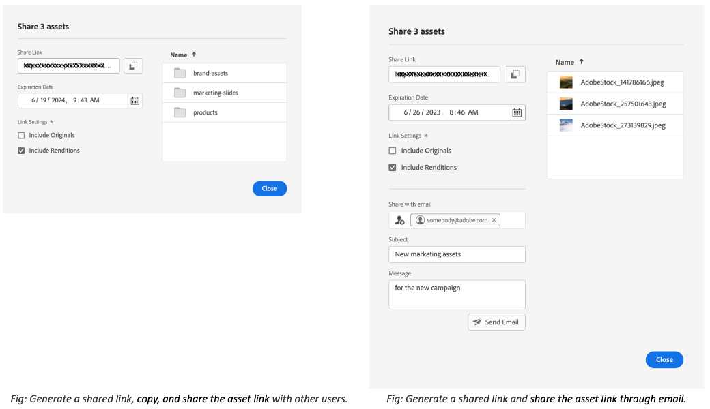

# Share and distribute assets managed in [!DNL Experience Manager] {#share-assets-from-aem}

| [Search Best Practices](/help/assets/search-best-practices.md) |[Metadata Best Practices](/help/assets/metadata-best-practices.md)|[Content Hub](/help/assets/product-overview.md)|[Dynamic Media with OpenAPI capabilities](/help/assets/dynamic-media-open-apis-overview.md)|[AEM Assets developer documentation](https://developer.adobe.com/experience-cloud/experience-manager-apis/)|
| ------------- | --------------------------- |---------|----|-----|

| Version | Article link |
| -------- | ---------------------------- |
| AEM 6.5  |    [Click here](https://experienceleague.adobe.com/docs/experience-manager-65/assets/administer/link-sharing.html?lang=en)                  |
| AEM as a Cloud Service     | This article         |

[!DNL Adobe Experience Manager Assets] lets you share assets, folders, and collections with members of your organization and external entities, including partners and vendors. Use the following methods to share assets from [!DNL Experience Manager Assets] as a [!DNL Cloud Service]:

* [Share as a link](#sharelink).
* [Download assets](/help/assets/download-assets-from-aem.md) and share separately.
* Share using [[!DNL Experience Manager] desktop app](https://experienceleague.adobe.com/docs/experience-manager-desktop-app/using/introduction.html).
* Share using [[!DNL Adobe Asset Link]](https://www.adobe.com/creativecloud/business/enterprise/adobe-asset-link.html).
* Share using [[!DNL Brand Portal]](https://experienceleague.adobe.com/docs/experience-manager-brand-portal/using/introduction/brand-portal.html).

## Prerequisites {#prerequisites}

You need Administrator privileges to [configure settings for sharing assets as a Link](#config-link-share-settings).

## Configure link share settings {#config-link-share-settings}

[!DNL Experience Manager Assets] allows you to configure the default link share settings.

1. Click the [!DNL Experience Manager] logo, and then navigate to **[!UICONTROL Tools]** &gt; **[!UICONTROL Assets]** &gt; **[!UICONTROL Assets Configuration]** &gt; **[!UICONTROL Link Share]**.
1. Initial Settings:

   * **Include Originals:** 

      * Select `Select Include Originals` to select the `Include Originals` option by default in the link share dialog. 
      * Select how the `Include Originals` option is presented to you on the Link Share dialog. [!UICONTROL Editable] allows the user to change the settings defined here in the Initial Settings. With `Read-only` the setting is displayed but cannot be modified. `Hidden` hides the setting and uses the value configured here in the Initial settings.
   * **Include Renditions:** 
      * Select `Select Include Renditions` option to select the `Include Renditions` option by default in the link share dialog.   
      * Select how the `Include Renditions` option is presented to you on the Link Share dialog. [!UICONTROL Editable] allows the user to change the settings defined here in the Initial Settings. With `Read-only` the setting is displayed but cannot be modified. `Hidden` hides the setting and uses the value configured here in the Initial settings.

1. Specify the default validity period for the link in the `Validity Period` field in the `Expiration date` section.

1. **[!UICONTROL Link share]** button in the action bar:
   * All users with `jcr:modifyAccessControl` permissions can view the [!UICONTROL Link share] option. It is visible to all administrators by default. The [!UICONTROL Link share] button is visible to everyone, by default. You can configure to display this option only for the defined groups or you can also deny this option from specific groups. Select `Allow only for groups` if you want to allow specific groups to view the `Share Link` option. Select `Deny from groups` to deny the `Share Link` option from specific groups. Once you select any of these options, specify the group names using `Select Groups` field to add the group names that you need to allow or deny.

For Email Configuration related settings, visit [Email Service Documentation](https://experienceleague.adobe.com/docs/experience-manager-learn/cloud-service/networking/examples/email-service.html)

   

## Share assets as a link {#sharelink}

Sharing assets through a link is a convenient way of making the resources available to external parties, marketers, and other [!DNL Experience Manager] users. The functionality allows anonymous users to access and download the assets shared with them. When downloading assets from a shared link, [!DNL Experience Manager Assets] uses an asynchronous service that offers faster and uninterrupted download. The assets to be downloaded are queued in the background into ZIP archives of manageable file size. For large downloads, the download is bundled into multiple files of 100 GB per file size.

<!--
Users with administrator privileges or with read permissions at `/var/dam/share` location are able to view the links shared with them. 
-->

>[!NOTE]
>
>* You need Edit ACL permission on the folder or the asset that you want to share as a link.
>* [Enable outbound emails](/help/implementing/developing/introduction/development-guidelines.md#sending-email) before sharing a link with the users. 

There are two ways of sharing the assets using the link sharing functionality:

1. Generate a shared link, [copy, and share the asset link](#copy-and-share-assets-link) with other users.
1. Generate a shared link and [share the asset link through email](#share-assets-link-through-email). You can modify the default values such as expiration date and time, and allow downloading the original assets and its renditions. You can send email to multiple users by adding their email addresses.

   

In both cases, you can modify the default values such as expiration date and time, and allow downloading the original assets and its renditions.

### Copy and share the asset link{#copy-and-share-asset-link}

To share assets as a public URL:

1. Log in to [!DNL Experience Manager Assets] and navigate to **[!UICONTROL Files]**.
1. Select the assets or folder containing assets. From the toolbar, click **[!UICONTROL Share Link]**. 
1. The **[!UICONTROL Link Sharing]** dialog appears which contains an auto-generated asset link in the **[!UICONTROL Share Link]** field.
1. Set the expiration date of the shared link as required.
1. Under **[!UICONTROL Link Settings]**, check or uncheck `Include Originals` or `Include Renditions` to include or exclude either of the two. Choosing at least option is mandatory. 
1. The names of selected Assets appear in the right column of the [!DNL Share Link] dialog box.
1. Copy the asset link and share it with the users. 

### Share asset link through email notification {#share-assets-link-through-email}

To share assets through email: 

1. Select the assets or folder containing assets. From the toolbar, click **[!UICONTROL Share Link]**. 
1. The **[!UICONTROL Link Sharing]** dialog appears which contains an auto-generated asset link in the **[!UICONTROL Share Link]** field. 

   * In the email address box, type the email address of the user with whom you want to share the link. You can share the link with multiple users. If the user is a member of your organization, select their email address from the suggestions that appear in the drop-down list. In the email address text field, type the email address of the user with whom you want to share the link and click [!UICONTROL Enter]. You can share the link with multiple users.

   * In the **[!UICONTROL Subject]** box, type a subject to specify the purpose of the assets that are shared.
   * In the **[!UICONTROL Message]** box, type a message if necessary.
   * In the **[!UICONTROL Expiration]** field, use the date picker to specify an expiration date and time for the link.
   * Enable the **[!UICONTROL Allow download of the original file]** check box to allow the recipients to download the original rendition. 

1. Click **[!UICONTROL Share]**. A message confirms that the link is shared with the users. The users receive an email containing the shared link. 

   

### Customize email template {#customize-email-template}

A well-designed template conveys professionalism and competence, enhancing the credibility of your message and your organization. The [!DNL Adobe Experience Manager] allows you to customize the email template, which is sent to the recipients who receive the email containing the shared link. Additionally, customized email templates allow personalizing your email content by addressing your recipients with name and referencing specific details relevant to them. This personal touch can make the recipient feel valued and increase engagement. Not just that, a customized template ensures that your emails are consistent with your brand identity, including logos, colors, and fonts. Consistency reinforces brand recognition and trust among recipients.

#### Format of a customized email template {#format-of-custom-email-template}

The email template can be customized using plain text or HTML. The default editable template link can be found at `/libs/settings/dam/adhocassetshare/en.txt`. You can override the template by creating the file `/apps/settings/dam/adhocassetshare/en.txt`. You can modify the email template as many times as required.

| Placeholders | Description |
|---|-----|
| `${emailSubject}` | Subject of an email |
| `${emailInitiator}` | Email ID of the user who created the email |
| `${emailMessage}` | Email body |
| `${pagePath}` | URL of the shared link |
| `${linkExpiry}` | Shared link expiry date |

<!--| `${host.prefix}` | Origin of the [!DNL Experience Manager] instance, for example `http://www.adobe.com"` |--> 

#### Customized email template example {#custom-email-template-example}

```
subject: ${emailSubject}

<!DOCTYPE html>
<html><body>
<p><strong>${emailInitiator}</strong> invited you to review assets.</p>
<p>${emailMessage}</p>
<p>The shared link will be available until ${linkExpiry}.
<p>
    <a href="${pagePath}" target="_blank"><strong>Open</strong></a>
</p>

</body></html>
```

<!--Sent from instance: ${host.prefix}-->

### Download assets using the asset link {#download-assets-using-asset-link}

Any user having access to the shared asset link can download the assets bundled in a zip folder. The download process is the same, whether a user is accessing the copied asset link, or using the asset link shared through the email. 

* Click the asset link or paste the URL in your browser. The [!UICONTROL Link Share] interface opens wherein you can switch to the [!UICONTROL Card View] or [!UICONTROL List View]. 

* In the [!UICONTROL Card View], you can hover the mouse over the shared asset or shared assets folder to either select the assets or queue them for download.

* By default, the user interface shows the **[!UICONTROL Download Inbox]** option. It reflects the list of all the shared assets or folders that are queued for download along with their status. 

* On selecting the assets or folder, a **[!UICONTROL Queue Download]** option appears on the screen. Click the **[!UICONTROL Queue Download]** option to initiate the download process.  

  

* While the download file is prepared, click the **[!UICONTROL Download Inbox]** option to view the status of your download. For large downloads, click the **[!UICONTROL Refresh]** button to update the status. 

  

* Once the processing is complete, click the **[!UICONTROL Download]** button to download the zip file.  

<!--
You can also copy the auto-generated link and share it with the users. The default expiration time for the link is one day.
-->

   >[!NOTE]
   >
   >If a shared asset is moved to a different location, its link stops working. Re-create the link and reshare with the users.


<!--
## Share assets as a link {#sharelink}

To generate the URL for assets you want to share with users, use the Link Sharing dialog. Users with administrator privileges or with read permissions at `/var/dam/share` location are able to view the links shared with them. Sharing assets through a link is a convenient way of making resources available to external parties without them having to first log in to Experience Manager Assets.

>[!NOTE]
>
>* You need Edit ACL permission on the folder or the asset that you want to share as a link.
>* Before you share a link with users, ensure that Day CQ Mail Service is configured. Otherwise, an error occurs.

1. In the Assets user interface, select the asset to share as a link.
1. From the toolbar, click/tap the **[!UICONTROL Share Link]**.

   An asset link is auto-created in the **[!UICONTROL Share Link]** field. Copy this link and share it with the users. The default expiration time for the link is one day.

   Alternatively, proceed to perform steps 3-7 of this procedure to add email recipients, configure the expiration time for the link, and send it from the dialog.

   >[!NOTE]
   >
   >If a shared asset is moved to a different location, its link stops working. Re-create the link and re-share with the users.

1. From the web console, open the **[!UICONTROL Day CQ Link Externalizer]** configuration and modify the following properties in the **[!UICONTROL Domains]** field with the values mentioned against each:

    * local
    * author
    * publish

   For the local and author properties, provide the URL for the local and author instance respectively. Both local and author properties have the same value if you run a single Experience Manager author instance. For publish, provide the URL for the publish instance.

1. In the email address box of the **[!UICONTROL Link Sharing]** dialog, type the email ID of the user you want to share the link with. You can also share the link with multiple users.

   If the user is a member of your organization, select the user's email ID from the suggested email IDs that appear in the list below the typing area. For an external user, type the complete email ID and then select it from the list.

   To enable emails to be sent out to users, configure the SMTP server details in [Day CQ Mail Service](/help/assets/configure-asset-sharing.md#configmailservice).

   >[!NOTE]
   >
   >If you enter an email ID of a user that is not a member of your organization, the words "External User" are prefixed with the email ID of the user.

1. In the **[!UICONTROL Subject]** box, enter a subject for the asset you want to share.
1. In the **[!UICONTROL Message]** box, enter an optional message.
1. In the **[!UICONTROL Expiration]** field, specify an expiration date and time for the link using the date picker. By default, the expiration date is set for a week from the date you share the link.
1. To let users download the original image along with the renditions, select **[!UICONTROL Allow download of original file]**.

   >[!NOTE]
   >
   >By default, users can only download the renditions of the asset that you share as a link.

1. Click **[!UICONTROL Share]**. A message confirms that the link is shared with the users through an email.
1. To view the shared asset, click/tap the link in the email that is sent to the user. The shared asset is displayed in the **[!UICONTROL Adobe Marketing Cloud]** page.

   To toggle to the list view, click/tap the layout icon in the toolbar.

1. To generate a preview of the asset, click/tap the shared asset. To close the preview and return to the **[!UICONTROL Marketing Cloud]** page, click/tap **[!UICONTROL Back]** in the toolbar. If you have shared a folder, click/tap **[!UICONTROL Parent Folder]** to return to the parent folder.

   >[!NOTE]
   >
   >Experience Manager supports generating the preview of assets of these MIME types: JPG, PNG, GIF, BMP, INDD, PDF, and PPT. You can only download the assets of the other MIME types.

1. To download the shared asset, click/tap **[!UICONTROL Select]** from the toolbar, click/tap the asset, and then click/tap **[!UICONTROL Download]** from the toolbar.
1. To view the assets you shared as links, go to the Assets user interface and click/tap the GlobalNav icon. Choose **[!UICONTROL Navigation]** from the list to display the Navigation pane.
1. From the Navigation pane, choose **[!UICONTROL Shared Links]** to display a list of shared assets.
1. To un-share an asset, select it and tap/click **[!UICONTROL Unshare]** from the toolbar.

A message confirms that you unshared the asset. In addition, the entry for the asset is removed from the list.
-->

## Download assets and share separately {#download-and-share-assets}

Users can download the required assets and share these outside of [!DNL Experience Manager]. For more information, see [how to search assets](/help/assets/search-assets.md), [how to download assets](/help/assets/download-assets-from-aem.md), and [how to download collections](manage-collections.md#download-a-collection)

## Share assets with creative professionals {#share-with-creatives}

Marketers and line-of-business users can easily share approved assets with their creative professionals using,

* **Experience Manager desktop app**: The app works on Windows and Mac. See [desktop app overview](https://experienceleague.adobe.com/docs/experience-manager-desktop-app/using/introduction.html). To know how any authorized desktop user can easily access the shared assets, see [browse, search, and preview assets](https://experienceleague.adobe.com/docs/experience-manager-desktop-app/using/using.html#browse-search-preview-assets). The desktop users can create assets and share it back with their counterparts who are Experience Manager users, for example, by uploading new images. See [upload assets using a desktop app](https://experienceleague.adobe.com/docs/experience-manager-desktop-app/using/using.html#upload-and-add-new-assets-to-aem).

* **Adobe Asset Link**: The creative professionals can search and use assets directly from within [!DNL Adobe InDesign], [!DNL Adobe Illustrator], and [!DNL Adobe Photoshop].

## Configure asset sharing {#configure-sharing}

The different options to share the assets require specific configuration and have specific prerequisites.

### Configure asset link sharing {#asset-link-sharing}

<!-- TBD: Web Console is not there so how to configure Day CQ email service? Or is it not required now? -->

To generate the URL for assets that you want to share with users, use the Link Sharing dialog. Users with administrator privileges or with read permissions at `/var/dam/share` location are able to view the links shared with them. Sharing assets through a link is a convenient way of making resources available to external parties without them having to first login to [!DNL Assets].

   >[!NOTE]
   >
   >If you want to share links from your Author instance to external entities, ensure that you expose only the following URLs for `GET` requests. Block other URLs to ensure that your Author instance is secure.
   >
   >* `[aem_server]:[port]/linkshare.html`
   >* `[aem_server]:[port]/linksharepreview.html`
   >* `[aem_server]:[port]/linkexpired.html`

<!--
1. From the list of services, locate **[!UICONTROL Day CQ Mail Service]**.
1. Click the **[!UICONTROL Edit]** icon beside the service, and configure the following parameters for **Day CQ Mail Service** with the details mentioned against their names:

    * SMTP server host name: email server host name
    * SMTP server port: email server port
    * SMTP user: email server user name
    * SMTP password: email server password
-->

<!-- TBD: Commenting as Web Console is not available. Document the appropriate OSGi config method if available in CS.
### Configure maximum data size {#maxdatasize}

When you download assets from the link shared using the Link Sharing feature, Experience Manager compresses the asset hierarchy from the repository and then returns the asset in a ZIP file. However, in the absence of limits to the amount of data that can be compressed in a ZIP file, huge amounts of data is subjected to compression, which causes out of memory errors in JVM. To secure the system from a potential denial of service attack due to this situation, you can configure the maximum size of the downloaded files. If uncompressed size of the asset exceeds the configured value, asset download requests are rejected. The default value is 100 MB.

1. Click/Tap the Experience Manager logo and then go to **[!UICONTROL Tools]** &gt; **[!UICONTROL Operations]** &gt; **[!UICONTROL Web Console]**.
1. From the web console, locate the **[!UICONTROL Day CQ DAM Adhoc Asset Share Proxy Servlet]** configuration.
1. Open the configuration in edit mode, and modify the value of the **[!UICONTROL Max Content Size (uncompressed)]** parameter.
1. Save the changes.
-->

<!--
Add content or link about how to configure sharing via BP, DA, AAL, etc.
-->

### Enable desktop actions to use with desktop app {#desktop-actions}

From within the [!DNL Assets] user interface in a browser, you can explore the asset locations or check-out and open the asset for editing in your desktop application. These options are called desktop actions and to enable it, see [enable desktop actions in [!DNL Assets] web interface](https://experienceleague.adobe.com/docs/experience-manager-desktop-app/using/using.html#desktopactions-v2).


### Configurations to use [!DNL Adobe Asset Link] {#configure-asset-link}

Adobe Asset Link streamlines collaboration between creatives and marketers in the content creation process. It connects [!DNL Adobe Experience Manager Assets] with [!DNL Creative Cloud] desktop apps, [!DNL Adobe InDesign], [!DNL Adobe Photoshop], and [!DNL Adobe Illustrator]. The [!DNL Adobe Asset Link] panel allows creatives to access and modify content stored in [!DNL Assets] without leaving the creative apps they are most familiar with.

See [how to configure [!DNL Assets] to use it with [!DNL Adobe Asset Link]](https://helpx.adobe.com/enterprise/using/configure-aem-assets-for-asset-link.html).

## Best practices and troubleshooting {#bestpractices}

* Asset folders or collections that contain a whitespace in their name may not get shared.
* If users cannot download the shared assets, check with your Experience Manager administrator what the download limits are. The default value is 100 MB.
* For a user to preview a video that is shared using link sharing, the video must have a static video rendition available at `/jcr:content/renditions` location in the video's node in the repository. The preview is not dependent on the availability of a [!DNL Dynamic Media] rendition.
* When downloading a video asset via link share, the [!DNL Dynamic Media] renditions are not included in the downloaded archive.

<!--
* If you cannot send email with links to shared assets or if the other users cannot receive your email, check with your Experience Manager administrator if the [email service](/help/assets/configure-asset-sharing.md#configmailservice) is configured or not. 
* If you cannot share assets using link sharing functionality, ensure that you have the appropriate permissions. See [share assets](#sharelink).
-->

<!-- TBD: Add content or link about how to share using Brand Portal when it is available on [!DNL Cloud Service].
-->

**See also**

* [Translate Assets](translate-assets.md)
* [Assets HTTP API](mac-api-assets.md)
* [Assets supported file formats](file-format-support.md)
* [Search assets](search-assets.md)
* [Connected assets](use-assets-across-connected-assets-instances.md)
* [Asset reports](asset-reports.md)
* [Metadata schemas](metadata-schemas.md)
* [Download assets](download-assets-from-aem.md)
* [Manage metadata](manage-metadata.md)
* [Search facets](search-facets.md)
* [Manage collections](manage-collections.md)
* [Bulk metadata import](metadata-import-export.md)
* [Publish Assets to AEM and Dynamic Media](/help/assets/publish-assets-to-aem-and-dm.md)

