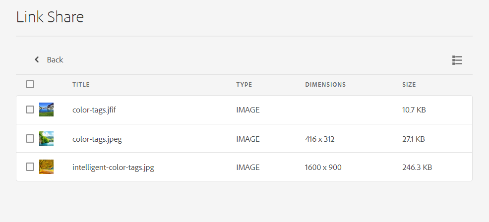

# Share links to assets {#share-links-assets}

| [Search Best Practices](/help/assets/search-best-practices.md) |[Metadata Best Practices](/help/assets/metadata-best-practices.md)|[Content Hub](/help/assets/product-overview.md)|[Dynamic Media with OpenAPI capabilities](/help/assets/dynamic-media-open-apis-overview.md)|[AEM Assets developer documentation](https://developer.adobe.com/experience-cloud/experience-manager-apis/)|
| ------------- | --------------------------- |---------|----|-----|

[!DNL Assets view] enables you to generate a link and share assets with external stakeholders, who do not have access to the [!DNL Assets view] application. You can define an expiration date for the link and then share it with others using your preferred communication method like email or messaging services. Recipients of the link can preview assets and download them.

## Generate a link for assets {#generate-link-for-assets}

To generate a link for an asset or a folder containing assets:

1. Select the assets, or folders, or both, that contain assets and click **[!UICONTROL Share Link]**.

1. If you want to adjust it, click the Calendar icon to define an expiration date for the link using the **[!UICONTROL Expiration Date]** field. You can also specify a date directly in the `yyyy-mm-dd` format. By default, expiration date for a link is set to 2 weeks from the date of sharing.

1. Copy the link from the **[!UICONTROL Share Link]** field. 

   

1. Click **[!UICONTROL Close]** and share the link using email or other collaboration tools.

## Access the shared assets {#access-shared-assets}

After sharing the public link for assets, the recipients can click the link to preview or download the shared assets in a web browser without the need to log in to [!DNL Assets view].

Click the link, click the folder to navigate to the asset, and then click the asset to preview it. You can select to view the shared assets in a List View or a Card View.

You can hover the mouse over the shared asset or the shared assets folder to either select the asset or download it.

You can also select multiple assets and click **[!UICONTROL Download]**. [!DNL Assets view] downloads the selected assets as a zip file. [!DNL Assets view] creates a sub-folder in the parent zip file, with the same name as that of the asset, for each asset that you select to download.

To download all assets at once, switch to the **[!UICONTROL List view]**, click **[!UICONTROL Select all]** and then click **[!UICONTROL Download]**.

## Next Steps {#next-steps}

* [Watch a video to share links for assets in Assets view](https://experienceleague.adobe.com/docs/experience-manager-learn/assets-essentials/basics/link-sharing.html)

* Provide product feedback using the [!UICONTROL Feedback] option available on the Assets view user interface

* Provide documentation feedback using [!UICONTROL Edit this page]  or [!UICONTROL Log an issue]  available on the right sidebar

* Contact [Customer Care](https://experienceleague.adobe.com/?support-solution=General#support)
