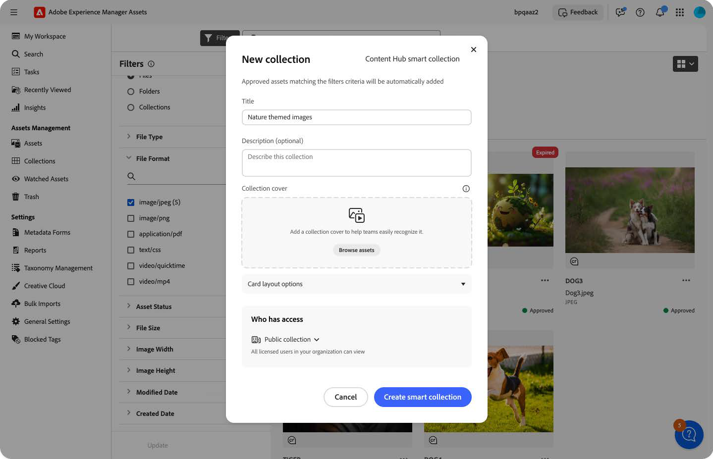
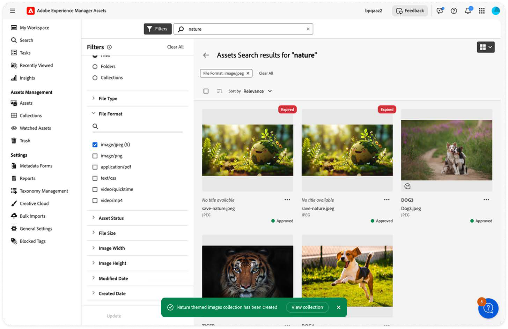
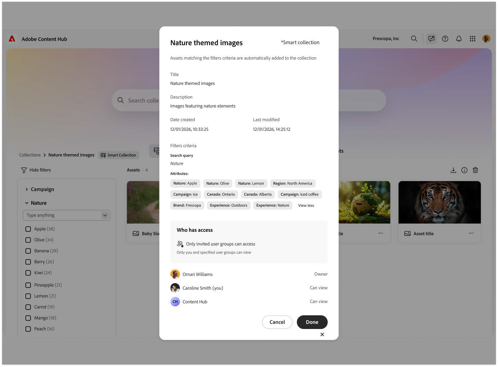

# Smart Collections in Content Hub {#smart-collections-content-hub}

Smart Collections enable you to automatically organize assets based on defined search criteria.

When you create a Smart Collection, the collection stores the search query and filter criteria instead of storing individual assets. Assets that match the configured criteria are automatically displayed in the collection.

Unlike standard collections, Smart Collections automatically remain up to date. When newly approved assets satisfy the configured search criteria, they are automatically added to the collection.

## Create a Smart Collection {#create-smart-collection}

Create a Smart Collection by saving a search and its associated filters.

To create a Smart Collection:

1. Navigate to Assets.
2. Search for assets using keywords or metadata filters.
 

3. Apply the required search criteria.
 

4. Click **Save as** and select **Content Hub Smart Collection**.
 

5. In the **New Collection** dialog, specify the collection title and an optional description.
6. Optional. Select a collection cover image.
7. Specify the collection access settings.
 

8. Click **Create**.
 

The Smart Collection is created using the selected search criteria.

## View Smart Collections {#view-smart-collections}

Smart Collections are available from the **Collections** tab in Content Hub.

To view Smart Collections:

1. Navigate to **Collections**.
2. Browse the available collections.
3. Select a Smart Collection to view its contents.

The collection displays assets that match the configured search criteria.

## Filter Smart Collections {#filter-smart-collections}

Use collection filters to locate Smart Collections when multiple collections are available.

To filter Smart Collections:

1. Navigate to **Collections**.
2. Open the collection filters.
3. Select **Smart Collections**.

The page displays only Smart Collections available to you.

## Automatic updates to Smart Collections {#automatic-updates-to-smart-collections}

Smart Collections automatically remain up to date.

When a newly approved asset matches the configured search criteria, the asset is automatically added to the Smart Collection.

No manual action is required to maintain collection contents.

