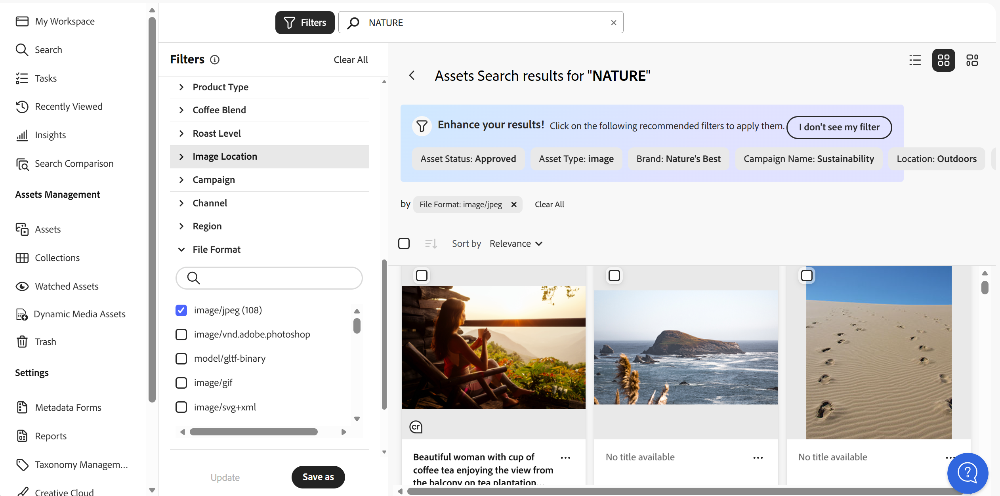
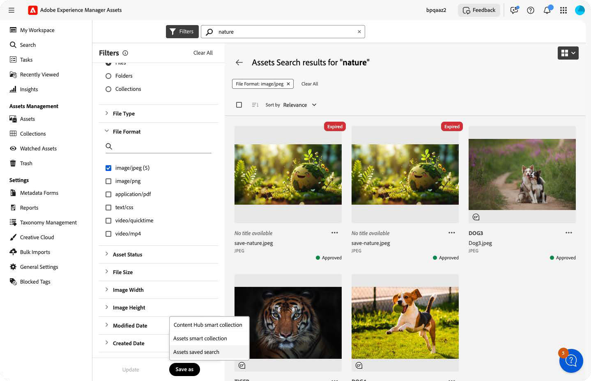
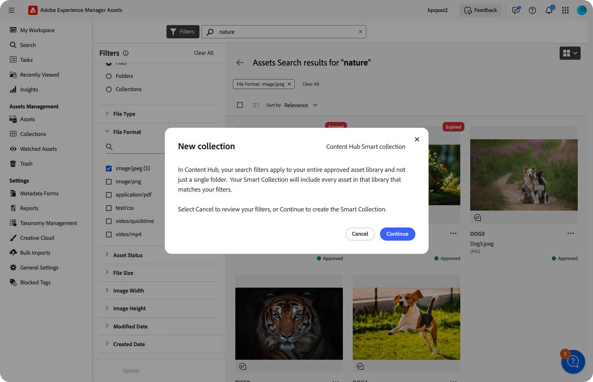
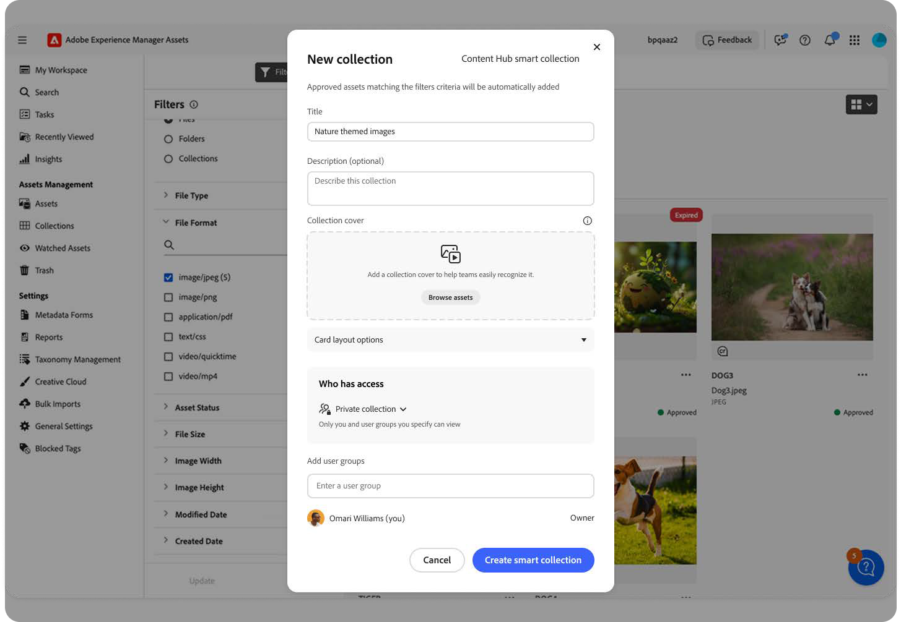
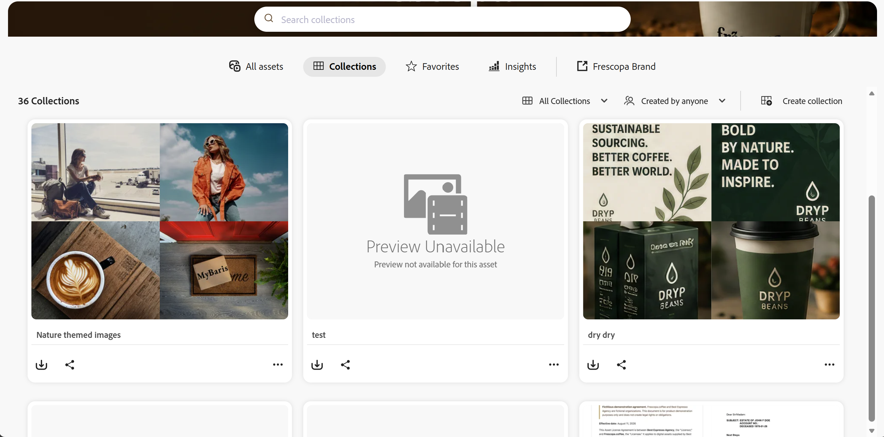
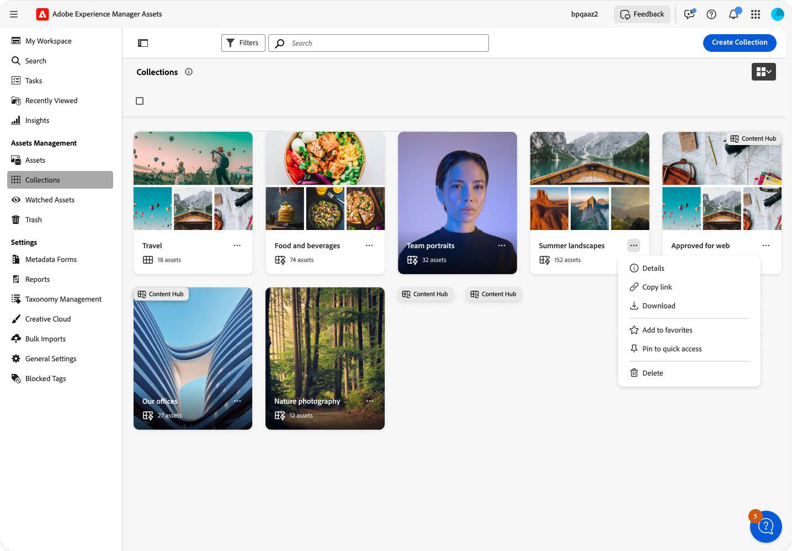

# Smart Collections in Content Hub {#smart-collections-content-hub}

Smart Collections enable you to automatically organize assets based on defined search criteria.

When you create a Smart Collection, the collection stores the search query and filter criteria instead of storing individual assets. Assets that match the configured criteria are automatically displayed in the collection.

Smart Collections automatically remain up to date. When newly approved assets satisfy the configured search criteria, they are automatically added to the collection.

## Create a Smart Collection {#create-smart-collection}

Create a Smart Collection by saving a search and its associated criteria.

To create a Smart Collection:

1. Navigate to Assets.
2. Search for assets using keywords.
 

3. Refine results using filters from the search panel.

4. Select **Save as** and select **Content Hub Smart Collection**.
 

5. In the confirmation dialog, review the information and select **Continue**.
 

 >[!NOTE]
 >
 >A Smart Collection does not store individual assets. It stores the search criteria and automatically includes assets that match the defined filters.

6. In the **New Collection** dialog, specify the following details:
   * Title for the collection
   * Optional description
   * Collection cover image
   * Collection visibility (Private or Public)
   * Access settings based on selected visibility

    

7. Select **Create smart collection**.

The Smart Collection is created and automatically includes assets that match the configured search criteria.

## View Smart Collections {#view-smart-collections}

Smart Collections are available in the **Collections** tab in Content Hub.
 

To view a Smart Collection:

1. Navigate to **Collections** in Content Hub.
2. Locate the required Smart Collection.
3. Select the Smart Collection name to open it.

You can access additional actions from the (⋯) menu on the collection card.

Available actions include viewing collection details, copying the link, downloading the collection, adding to favorites, pinning to quick access, and deleting the collection.
 

The Smart Collection displays assets that match the configured search criteria.

## Filter Smart Collections {#filter-smart-collections}

Use collection filters to refine and locate Smart Collections when multiple collections are available.

To filter Smart Collections:

1. Navigate to **Collections**.
2. Open the filters panel.
3. Select **Smart Collections** from the collection type filter.

The filters panel also allows you to refine results based on additional attributes.

The page updates to display only the Smart Collections that match the selected filter criteria.