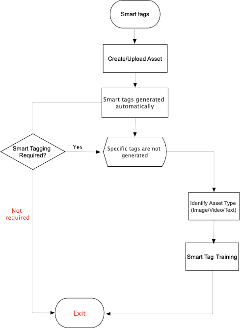

# Using smart tags to your AEM Assets {#using-smart-tags}

Organizations have many digital assets and these are growing continuously. Searching the desired asset while dealing with such enormous amount of data is a significant challenge. To deal with this challenge, *metadata* and *tags* are used to enhance the search capability of digital assets. Organizations use taxonomy-controlled vocabulary in asset metadata. Essentially, it includes a list of keywords that employees, partners, and customers commonly use to refer to and search for their digital assets. Tagging assets with taxonomy-controlled vocabulary ensures that the assets can be easily identified and retrieved in searches. 

For an instance, the words saved in the dictionary in an alphabetical order are easier in search, rather than searching the scattered words. Tagging also solves the same purpose. It aligns assets based on business taxonomy and ensures that the most relevant assets appear in searches. For example, a car manufacturer can tag car images with model names so only relevant images are displayed when searched to design a promotion campaign.

In the background, the functionality uses the artificially intelligent framework of [Adobe Sensei](https://business.adobe.com/why-adobe/experience-cloud-artificial-intelligence.html) to train its image recognition algorithm on your tag structure and business taxonomy. This content intelligence is then used to apply relevant tags on a different set of assets. [!DNL Experience Manager Assets] automatically applies smart tags to uploaded assets, by default.

## Benefits of smart tags to your assets {#benefits-of-smart-tags}

Following are the benefits of using smart tags in your AEM Assets:
*  It helps get your tagging job done of assigning tags manually. Thus, it generates relevant tag to your AEM Asset automatically.
*  It allows the usage of the same vocabulary, tag structure, and taxonomy so that you need not to worry about tagging if by chance you miss tagging at first.
*  Whether you are tagging "runners" or "running" shoes, you cannot compensate for typos, wrong spellings, or alternative search terms as smart tags know it already!
*  Helps your assets to become organized and categorized.
*  Smart tags training allows you to train your tags so that you can specify the particulars if the relevant tags are not there.

## Prerequisites and configuration

Smart Tags is automatically provisioned for AEM as a Cloud Service.

## Supported asset types {#smart-tags-supported-file-formats}

You can tag the following types of assets:

### Generic smart tags

#### Text-based assets 

For text-based assets, the efficacy of Smart Tags does not depend on the amount of text in the asset but on the relevant keywords or entities present in the text of the asset. The Smart Tags are the keywords that appear in the text but the ones that best describe the asset.
For supported assets, Experience Manager already extracts the text, which is then indexed and is used to search for the assets. However, Smart Tags based on keywords in the text provide a dedicated, structured, and higher priority search facet. The latter helps improve asset discovery as compared to a search index.

**Example of tagging assets with Smart Tags**

All types of supported assets are automatically tagged by [!DNL Experience Manager Assets] when uploaded. Tagging is enabled and works, by default. [!DNL Experience Manager] applies the appropriate tags in near-real-time.

#### Image-based assets

For images and videos, the Smart Tags are based on some visual aspect.Images in many formats are tagged using the Adobe Sensei's smart content services. You [create a training model](#/help/assets/smart-tags-training.md) and then the uploaded images are automatically tagged. Smart Tags are applied to the supported file types that generate renditions in JPG and PNG format.

#### Video-based assets
For video-based assets, tagging is enabled by default in [!DNL Adobe Experience Manager] as a [!DNL Cloud Service]. [Videos are auto-tagged](/help/assets/smart-tags-video-assets.md) when you upload new videos or reprocess existing ones.

### Trainable smart tags

Image type smart tags can be trained to provide more accuracy and efficacy in the tags. Refer to the [smart tags training](#/help/assets/smart-tags-training.md) to understand the training of images with custom or enhanced smart tags.

### Supported file formats for smart tags

|Images (MIME types) | Text-based assets (file formats) | Video assets (file formats and codecs) |
|----|-----|------|
| image/jpeg | CSV | MP4 (H264/AVC) |
| image/tiff | DOC | MKV (H264/AVC) |
| image/png | DOCX | MOV (H264/AVC, Motion JPEG) |
| image/bmp | HTML | AVI (indeo4) |
| image/gif | PDF | FLV (H264/AVC, vp6f) |
| image/pjpeg | PPT | WMV (WMV2) |
| image/x-portable-anymap | PPTX |  |
| image/x-portable-bitmap | RTF |  |
| image/x-portable-graymap | SRT |  |
| image/x-portable-pixmap | TXT |  |
| image/x-rgb | VTT |  |
| image/x-xbitmap | |  |
| image/x-xpixmap | |  |
| image/x-icon |  |  |
| image/photoshop |  |  |
| image/x-photoshop |  |  |
| image/psd |  |  |
| image/vnd.adobe.photoshop |  |  |

## Smart Tags workflow

Smart tags are implemented in AEM Assets using the following workflow:
1.  Create or upload an asset in AEM.
1.  Text-based tags are generated automatically based upon the type of asset you have created or uploaded. If you find that specific tags are not generated then you can train your tags accordingly. You can perform custom tags training for [smart tags for images](https://experienceleague.adobe.com/docs/experience-manager-learn/assets/metadata/custom-smart-tags.html?lang=en) and [smart tags for videos](/help/assets/smart-tags-video-assets.md).
1.  Once smart tags are trained, the tags identification are saved in AEM so that you apply these tags on a similar set of assets.

## Manage smart tags and asset searches {#manage-smart-tags-and-searches}

You can curate smart tags to remove any inaccurate tags that may have been assigned to your brand assets, so that only the most relevant tags are displayed.

Moderating smart tags also helps refine tag-based searches for assets by ensuring that your assets appear in search results for the most relevant tags. Essentially, it helps eliminate the chances of unrelated assets from showing up in search results.

You can also assign a higher rank to a tag to increase the tag's relevance for the asset. Promoting a tag for an asset increases the chances of the asset appearing in search results when a search is performed based on the particular tag.

To moderate the smart tags of your digital assets:

1. In the search field, search for digital assets based on a tag.

1. To identify the digital assets that you do not find relevant to your search, inspect the search results.

1. Select an asset, and then select  from the toolbar.

1. From the **[!UICONTROL Manage Tags]** page, inspect the tags. If you do not want the asset to be searched based on a specific tag, then select the tag and select  from the toolbar. Alternatively, select `X` symbol next to the label.

1. To assign a higher rank to a tag, select the tag and select  from the toolbar. The tag you promote is moved to the **[!UICONTROL Tags]** section.

1. Select **[!UICONTROL Save]** and then select **[!UICONTROL OK]** to close the [!UICONTROL Success] dialog.

1. Navigate to the [!UICONTROL Properties] page for the asset. Observe that the tag that you promoted is assigned a high relevance and, therefore, appears higher in the search results.

### Understand [!DNL Experience Manager] search results with smart tags {#understand-search}

By default, [!DNL Experience Manager] combines the search terms with an `AND` or `OR` clause to find any of the search terms in the applied smart tags. Using smart tags does not change this default behavior. For example, consider searching for `woman running`. Assets with just `woman` or just `running` keyword in the metadata do not appear in the search results by default. However, an asset tagged with either `woman` or `running` using smart tags appears in such a search query. So the search results are a combination of,

* Assets with `woman` and `running` keywords in the metadata.

* Assets smart tagged with either of the keywords.

The search results that match all search terms in metadata fields are displayed first, followed by the search results that match any of the search terms in the smart tags. In the above example, the approximate order of display of search results is:

1. matches of `woman running` in the various metadata fields.
1. matches of `woman running` in smart tags.
1. matches of `woman` or of `running` in smart tags.

## Limitations and best practices related to smart tags {#limitations}

[Enhanced smart tagging](/help/assets/smart-tags-training.md) is based on learning models of images and their tags. These models are not always perfect at identifying tags. The current version of the Smart Tags has the following limitations:

* Inability to recognize subtle differences in images. For example, slim-fit versus regular-fit shirts.
* Inability to identify tags based on tiny patterns or parts of an image. For example, logos on shirts.
  <!-- TBD: Check the languaguages support as the mentioned url does not provide any relevant information -->
* The tags that are not handled relate to:

  * Non-visual, abstract aspects. For example, the year or season of release of a product, mood or emotion evoked by an image, and a subjective connotation of a video.
  * Fine visual differences in products such as shirts with and without collars or small product logos embedded on products.

* To train the model, use the most appropriate images. The training cannot be reverted or training model cannot be removed. Your tagging accuracy depends on the current training, so do it carefully.
* To search for files with smart tags (regular or enhanced), use the [!DNL Assets] search (full-text search). There is no separate search predicate for smart tags.
* In comparison of general tags, the assets that are tagged using business taxonomy are easier to identify and retrive by tag-based searches.

>[!NOTE]
>
>The ability of the Smart Tags to train on your tags and apply them on other images depends on the quality of images you use for training.
>For best results, Adobe recommends that you use visually similar images to train the service for each tag.