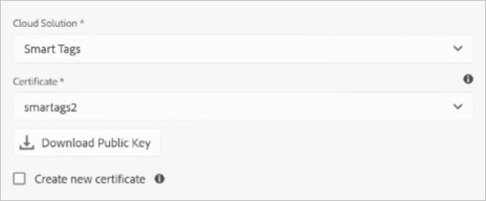
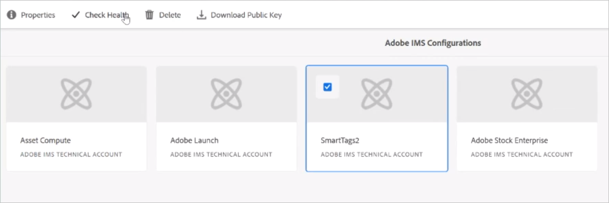
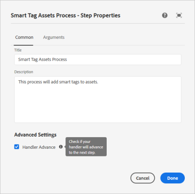

# Configure Experience Manager for smart tagging of assets {#configure-aem-for-smart-tagging}

Tagging assets with taxonomy-controlled vocabulary ensures that the assets can be easily identified and retrieved by tag-based searches. Adobe provides Smart Tags that uses artificial intelligence and machine learning algorithms to train images. Smart Tags uses an artificial intelligence framework of [Adobe Sensei](https://www.adobe.com/sensei/experience-cloud-artificial-intelligence.html) to train its image recognition algorithm on your tag structure and business taxonomy.

The Smart Tags functionality is available for purchase as an add-on to [!DNL Experience Manager]. After you purchase, an email is sent to the administrator of your organization with a link to Adobe Developer Console. The administrator accesses the link to integrate the Smart Tags with [!DNL Experience Manager] using Adobe Developer Console.

<!-- TBD: 
1. Can a similar flowchart be created about how training works in CS? 
2. Is there a link to buy SCS or initiate a sales call.
3. Keystroke all steps and check all screenshots.
-->

>[!IMPORTANT]
>
>[!DNL Experience Manager Assets] deployments created after [August 2020 release](/help/release-notes/release-notes-cloud/2020/release-notes-2020-8-0.md#assets) are integrated with [!DNL Adobe Developer Console] by default. It helps configure the smart tags functionality faster. On the older deployments, administrators can follow the following steps to configure the integration.

## Integrate with Adobe Developer Console {#aio-integration}

Before you can tag the images using SCS, integrate [!DNL Adobe Experience Manager] with the Smart Tags service using Adobe Developer Console. At the back end, the [!DNL Experience Manager] server authenticates your service credentials with the Adobe Developer Console gateway before forwarding your request to the service.

* Create a configuration in [!DNL Experience Manager] to generate a public key. [Obtain public certificate](#obtain-public-certificate) for OAuth integration.
* [Create an integration in Adobe Developer Console](#create-aio-integration) and upload the generated public key.
* [Configure Smart Tags](#configure-smart-content-service) in your [!DNL Experience Manager] instance using the API key and other credentials from Adobe Developer Console.
* [Test the configuration](#validate-the-configuration).
* [Reconfigure after certificate expires](#certrenew).

### Prerequisites for Adobe Developer Console integration {#prerequisite-for-aio-integration}

Before you can use the Smart Tags, ensure the following to create an integration on Adobe Developer Console:

* An Adobe ID account that has administrator privileges for the organization.
* The Smart Tags is enabled for your organization.

### Obtain a public certificate {#obtain-public-certificate}

A public certificate allows you to authenticate your profile on Adobe Developer Console. You create a certificate from within [!DNL Experience Manager].

1. In the [!DNL Experience Manager] user interface, access **[!UICONTROL Tools]** > **[!UICONTROL Security]** > **[!UICONTROL Adobe IMS Configurations]**.

1. On the [!UICONTROL Adobe IMS Configurations] page, click **[!UICONTROL Create]**. From **[!UICONTROL Cloud Solution]** menu, select **[!UICONTROL Smart Tags]**.

1. Select **[!UICONTROL Create new certificate]**. Provide a name and click **[!UICONTROL Create certificate]**. Click **[!UICONTROL OK]**.

1. Click **[!UICONTROL Download Public Key]**.

   

### Create an integration {#create-aio-integration}

To use Smart Tags, create an integration in Adobe Developer Console to generate API Key, Technical Account Id, Organization Id, and Client Secret.

1. Access [https://console.adobe.io](https://console.adobe.io/) in a browser. Select the appropriate account and verify that the associated organization role is system administrator.
1. Create a project with any desired name. Click **[!UICONTROL Add API]**.
1. On the **[!UICONTROL Add an API]** page, select **[!UICONTROL Experience Cloud]** and select **[!UICONTROL Smart Content]**. Click **[!UICONTROL Next]**.
1. Select **[!UICONTROL Upload your public key]**. Provide the certificate file downloaded from [!DNL Experience Manager]. A message [!UICONTROL Public key(s) uploaded successfully] is displayed. Click **[!UICONTROL Next]**.
1. [!UICONTROL Create a new Service Account (JWT) credential] page displays the public key for the service account just configured. Click **[!UICONTROL Next]**.
1. On the **[!UICONTROL Select product profiles]** page, select **[!UICONTROL Smart Content Services]**. Click **[!UICONTROL Save configured API]**. A page displays more information about the configuration. Keep this page open to copy and add these values in Experience Manager when further configuring Smart Tags in [!DNL Experience Manager].

   

### Configure Smart Tags {#configure-smart-content-service}

To configure the integration, use the values of Payload, Client Secret, Authorization Server, and API key fields from the Adobe Developer Console integration.

1. In the [!DNL Experience Manager] user interface, access **[!UICONTROL Tools]** > **[!UICONTROL Security]** > **[!UICONTROL Adobe IMS Configurations]**.
1. Access **[!UICONTROL Adobe IMS Technical Account Configuration]** page, provide a desired **[!UICONTROL Title]**.
1. In **[!UICONTROL Authorization Server]** field, provide `https://ims-na1.adobelogin.com` URL.
1. In **[!UICONTROL API Key]** field, provide **[!UICONTROL Client ID]** from the [!DNL Adobe Developer Console].
1. In **[!UICONTROL Client Secret]** field, provide the **[!UICONTROL Client Secret]** from the [!DNL Adobe Developer Console]. Click **[!UICONTROL Retrieve Client Secret]** option to see it.
1. In [!DNL Adobe Developer Console], in your project, click **[!UICONTROL Service Account (JWT)]** from the left margin. Click **[!UICONTROL Generate JWT]** tab. Click **[!UICONTROL Copy]** to copy the displayed **[!UICONTROL JWT Payload]**. Provide this value in the **[!UICONTROL Payload]** field in [!DNL Experience Manager]. Click **[!UICONTROL Create]**.

### Validate the configuration {#validate-the-configuration}

After you've completed the configuration, follow these steps to validate the configuration.

1. In the [!DNL Experience Manager] user interface, access **[!UICONTROL Tools]** > **[!UICONTROL Security]** > **[!UICONTROL Adobe IMS Configurations]**.

1. Select the Smart Tags configuration. Click **[!UICONTROL Check Health]** from the toolbar. Click **[!UICONTROL Check]**. A dialog with [!UICONTROL Healthy configuration] message confirms that the configuration is working.

### Reconfigure if a certificate expires {#certrenew}

When the certificate expires it is no longer trusted. To add a new certificate, follow these steps. You cannot renew an expired certificate.

1. Log in your [!DNL Experience Manager] deployment as an administrator. Click **[!UICONTROL Tools]** > **[!UICONTROL Security]** > **[!UICONTROL Users]**.  

1. Locate and click **[!UICONTROL dam-update-service]** user. Click on **[!UICONTROL Keystore]** tab.
1. Delete the existing **[!UICONTROL similaritysearch]** keystore with the expired certificate. Click **[!UICONTROL Save & Close]**.

   

   *Figure: Delete the existing `similaritysearch` entry in Keystore to add a new security certificate.*

1. In the [!DNL Experience Manager] user interface, access **[!UICONTROL Tools]** > **[!UICONTROL Security]** > **[!UICONTROL Adobe IMS Configurations]**. Open the available Smart Tags configuration. To download a public certificate, click **[!UICONTROL Download Public Certificate]**.

1. Access [https://console.adobe.io](https://console.adobe.io) and navigate to the existing service in the Project. Upload the new certificate and configure. For more information on configuration, see the instructions in [Create Adobe Developer Console integration](#create-aio-integration).

## Enable auto-tagging when assets are uploaded (Optional) {#enable-smart-tagging-for-uploaded-assets}

1. In [!DNL Experience Manager], go to **[!UICONTROL Tools > Workflow > Models]**.
1. On **[!UICONTROL Workflow Models]** page, select the **[!UICONTROL DAM Update Asset]** workflow model.
1. Click **[!UICONTROL Edit]** from the toolbar.
1. Expand the Side Panel to display the steps. Drag **[!UICONTROL Smart Tag Asset]** step that is available in the DAM Workflow section and place it after the **[!UICONTROL Process Thumbnails]** step.

   

   *Figure: Add smart tag asset step after the process thumbnail step in the DAM Update Asset workflow.*

1. Open the step to configure. Under **[!UICONTROL Advanced Settings]**, ensure that the **[!UICONTROL Handler Advance]** option is selected.

   

1. In the **[!UICONTROL Arguments]** tab, select **[!UICONTROL Ignore Errors]** if you want the workflow to ignore failures when predicting tags. To tag assets when they are uploaded irrespective of whether smart tagging is enabled on folders, select **[!UICONTROL Ignore Smart Tag Flag]**.

1. Click **[!UICONTROL OK]** to close the process step, and then save the workflow. Click **[!UICONTROL Sync]**.

>[!MORELIKETHIS]
>
>* [Tag assets using smart service](smart-tags.md)
